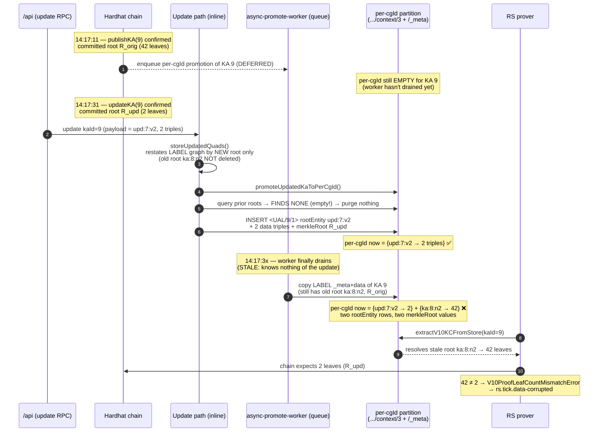

# GH #842 — Updated KAs are unprovable by Random Sampling

**Status:** fixed on `release/rc.12` (§7-minimal patch). The full collapse in §8 is deferred to a tracked follow-up.
**Severity:** high — every *updated* Knowledge Asset becomes permanently unprovable by Random Sampling (RS), producing a steady stream of `rs.tick.data-corrupted` on core nodes.
**Scope:** affects the local triple-store *materialization* layer, not the chain or the proof math.

> **Fix landed (§7-minimal).** Three changes give the projection layer the same
> ordering guarantee the chain log already has, without removing the two-partition
> design:
> 1. **Full label-graph restatement** on *both* update paths — `DKGPublisher.storeUpdatedQuads` (local) and `UpdateHandler` (gossip) — via the shared `restateLabelGraphForUpdate` helper: prior root entities' data is purged, `rootEntity` is repointed (rich provenance preserved), `merkleRoot` refreshed.
> 2. **A per-KA `dkg:materializedVersion` (`block:txIndex`) guard** stamped on the KC's `<ual>` in the meta graph each writer touches. *Every* canonical writer — `publishFromSharedMemory`'s publish→per-cgId promotion, `promoteUpdatedKaToPerCgId`, and the receiver `FinalizationHandler` — refuses to apply a state older than what is already materialised. A late publish-promotion can no longer clobber an applied update.
> 3. **A deterministic-UAL fallback** in `UpdateHandler` (`did:dkg:<chainId>/<kasAddress>/<batchId>`) so a gossip receiver that hasn't yet materialised the `dkg:batchId` edge still promotes instead of silently skipping.
>
> Helpers live in `packages/publisher/src/metadata.ts` (`restateKaPartition`, `restateLabelGraphForUpdate`, `shouldApplyMaterialization`, `writeMaterializedVersion`). Regression coverage: `packages/random-sampling/test/ka-extractor.test.ts` (race-repro, txIndex tiebreaker, idempotent re-apply, label restatement) and `packages/publisher/test/update-handler-gh842.test.ts` (deterministic-UAL receiver path).

---

## 1. TL;DR

An update in V10 is a **full restatement**, exactly like a publish: the caller sends the complete new set of triples for the KA, and the chain commits a Merkle root over **all of those triples** — there is no delta and no merge with the previous state. In the failing test the caller restated the KA as a small 2-triple state, so the chain's committed leaf count is 2. But the RS prover keeps extracting the **stale pre-update KA** (42 leaves) from its local store, so its recompute can never match the chain commitment:

```
V10ProofLeafCountMismatchError
  extractedLeafCount     = 42   (stale pre-update state, still in the prover's partition)
  chainExpectedLeafCount = 2    (the full new state the caller restated — 2 triples)
→ rs.tick.data-corrupted        (forever, for this KA)
```

The on-chain history is correctly **ordered** (publish then update). The bug is that the daemon's **local projection** of that ordered history — specifically into the partition the RS prover reads — does **not honor that order**: two independent, asynchronous writers race, and a *late* publish-promotion clobbers an *already-applied* update with no version guard.

> **This is not a hashing / leaf-semantics bug.** The chain's committed root is correct, and the leaf computation is correct. The defect is purely that the prover's *local copy* still holds the old state. See §1a for why the "only 2 leaves" figure is a full restatement, not a delta.

### 1a. Update semantics: full restatement, not delta

Publish and update are the same operation in spirit — **hash all the triples you send; that becomes the new committed state.** Nothing in the system hashes a delta or unions the payload with pre-existing triples:

- The author computes `newMerkleRoot` **off-chain over exactly the payload triples** (`computeFlatKCRootV10(payload)`), signs `UpdateAuthorAttestation(kaId, newMerkleRoot, authorAddress)`, and the contract records that root (keeping the prior root in history) — gated on the signer being `ownerOf(kaId)`.
- The daemon's `storeUpdatedQuads()` likewise computes the root over **only the payload quads**, never over a union with what's already stored.

So to *add* a triple while keeping the existing ones, the caller must re-send **all** triples (existing + new) as the payload — the update payload is always the intended complete new state. The failing test simply restated the KA as a 2-triple state, which is why the chain's leaf count is 2.

---

## 2. Background: why a KA has **two views** (and yes, content is duplicated)

This is your first question — and it's central, because the duplication is what has to be kept consistent across an update.

A KA's public triples are stored in **two graph partitions** in every node's local triple store:

| Partition | URI shape | Keyed by | Who reads it | Purpose |
|---|---|---|---|---|
| **Label graph** | `did:dkg:context-graph:<name>` (+ `/_meta`) | human-readable CG **name** | `agent.query()` / normal app reads | ergonomic, name-addressed view; also accumulates post-publish annotations (e.g. trust-level stamps) |
| **Per-cgId partition** | `did:dkg:context-graph:<name>/context/<cgId>` (+ `/_meta`) | on-chain numeric **cgId** | **RS prover** (`extractV10KCFromStore`) | a *chain-anchored* snapshot that reproduces the publish-time Merkle leaf set **bit-for-bit** |

> **What is the "label graph"?** A *context graph* (CG) has two identifiers: a human-readable **name/label** chosen at creation (e.g. `rs-cohort-1780229698`) and a numeric **on-chain id** (`cgId`, e.g. `3`) assigned when it's registered on-chain. The **label graph** is the named-graph URI built from the label — `did:dkg:context-graph:<name>` for data and `…/<name>/_meta` for metadata. It's the "default", name-addressed home for a CG's triples and the graph `agent.query(<name>)` reads. The **per-cgId partition** is a second named-graph URI built from the *same name plus the numeric id* (`…/<name>/context/<cgId>`), introduced so the RS prover can address a CG by its on-chain id and read a frozen, commit-time snapshot. The label↔cgId correspondence is recorded in a small `ontology` graph (`<did:dkg:context-graph:<name>> ContextGraphOnChainId "<cgId>"`), which the extractor already uses to translate a numeric `cgId` back to the name.

**Yes, the public triples are deliberately duplicated.** At publish time the daemon *copies* the public quads from the label graph into the per-cgId partition (see `dkg-publisher.ts`, the "Data promotion: always COPY public quads to the per-cgId data graph" block). On a same-graph publish the original label copy is intentionally left in place so that `agent.query(<label>)` keeps working.

**Why two views instead of one?**

- The RS prover receives a challenge in **on-chain terms**: `(cgId, kaId, chunkId)`. It must reconstruct *exactly* the leaf set the chain committed, with no extra/missing triples, or the Merkle root won't match. That demands a partition that is (a) addressable by the numeric `cgId`, and (b) a faithful, frozen snapshot of the commit-time payload.
- The label graph is the **app-facing** view. It's name-addressed, it's what queries hit, and it is *not* guaranteed to be a bit-exact mirror of any single chain commitment (e.g. post-publish stamps like `dkg:trustLevel` get written there and must be *excluded* from the leaf set — the extractor has an explicit skip-list for exactly this reason).

So the split exists to keep a clean, chain-anchored snapshot for proving, separate from the mutable, query-facing view. The cost of that design is **a consistency obligation**: any mutation (like an update) must be reflected correctly in *both* partitions. The update path currently keeps neither partition fully correct — and that's the bug. (Whether this split should exist at all is taken up in §8 — the strong argument is that it should not.)

---

## 3. Your second question: "shouldn't our update system already honor order / hold a version guard?"

Short answer: **the chain holds the authoritative version; the daemon's update path knows it locally; but that version is never propagated as a guard to the other writer that materializes the per-cgId partition.** So the guard you'd expect *exists conceptually but is not enforced in the projection layer.*

Concretely, here's what the update system *does* and *doesn't* do:

**What it does (ordering is fine at these layers):**
- The chain enforces a strict total order and the author attestation, and **assigns** the new `merkleRoot` / `merkleLeafCount` over the payload. The contract is the source of truth, and its order is unambiguous.
- The daemon's update path computes that same new root and writes it into the **label** `_meta` (`updateMetaMerkleRoot`).

**What it does *not* do (the gap):**
1. **It doesn't fully restate the label graph.** `storeUpdatedQuads` deletes/inserts keyed by the *new* payload's root entities only. The *old* root entity (`ka:8:n2`) and its 42 triples are left behind in both the label data graph and label `_meta`. So even the "source" the per-cgId copy is built from still describes the stale KA.
2. **It doesn't carry a monotonic version into the per-cgId writers.** There is no per-KA "current version = this merkleRoot / this update block" that *every* writer checks before applying. So a writer that runs later with *older* data has no way to know it's stale.
3. **There are multiple independent writers to the per-cgId partition, and they're not serialized:**
   - **publish → per-cgId promotion** is done by `DKGPublisher.publishFromSharedMemory` (the "Data promotion: always COPY public quads…" block). It runs as part of the publish/lift flow, which can complete *after* a subsequent update — the `async-promote-worker` only *schedules* this drain, it is not itself the per-cgId writer. (The worker's own job is the WM→SWM assertion promotion, a different concern.)
   - **update → per-cgId promotion** runs **inline**, synchronously, via `promoteUpdatedKaToPerCgId` during `/api/update`.
   - **receiver (gossip) promotion** is done by `FinalizationHandler.promoteSharedMemoryToCanonical` (publish finalization) and `UpdateHandler` (update gossip) — the same race, one node over.

Because of (3), the **local writes can land in the opposite order from the chain**: the inline update-promotion runs first, then the publish-promotion runs second and re-imports the original KA. Because of (2), nothing stops it. Because of (1), even "rebuild from the label graph" wouldn't save us — the label graph is itself stale.

> **Correction (vs. an earlier draft of this note):** the racing per-cgId *writer* is `publishFromSharedMemory` / `FinalizationHandler`, **not** `async-promote-worker`. The worker schedules the publish flow but does not itself copy public quads into the per-cgId partition. The fix therefore guards `publishFromSharedMemory`, `promoteUpdatedKaToPerCgId`, and `FinalizationHandler` directly.

Mental model: **the chain is an ordered event log; the per-cgId partition is a projection built by concurrent workers with no ordering or last-writer-wins-by-version discipline.** That's a classic event-sourcing projection bug. The fix is to give the projection the same ordering guarantee the log already has.

---

## 4. The exact trace (kaId 9 on core2)

core2 was *both* the publisher and the updater of kaId 9, so there's no gossip in the picture — and it *still* broke. This is the cleanest reproduction.



### Evidence (from `node2/store.nq`)

Both roots coexist in the per-cgId `_meta`, and there are two `merkleRoot` values — exactly what the race predicts:

```text
<UAL/9>   dkg:rootEntity <urn:rs:…:ka:8:n2>   <…/context/3/_meta>   ← stale, re-added by worker
<UAL/9>   dkg:merkleRoot  "c80c80ef…"          <…/context/3/_meta>   ← R_orig (also present in label _meta)
<UAL/9/1> dkg:rootEntity <urn:rs:…:upd:7:v2>  <…/context/3/_meta>   ← mine (inline update-promotion)
<UAL/9>   dkg:merkleRoot  "7a84ec99…"          <…/context/3/_meta>   ← R_upd (mine)
```

The extractor's resolution query (`?ka dkg:partOf <ual> ; dkg:rootEntity ?root`) matches **both** root rows; the stale `ka:8:n2` root yields 42 triples → mismatch.

### Receiver (gossip) variant — same root cause, simpler failure

On the *other* cores, which received the update only via gossip, the inline promotion was **skipped** entirely:

```
[UpdateHandler] GH#842: skipped per-cgId promotion (UAL unresolved) for batchId=9
```

`resolveUalByBatchId` returned nothing because, at gossip-receive time, the `dkg:batchId` edge wasn't in the meta graph yet (same async timing). So those nodes had *only* the stale, async-promoted original in their per-cgId partition → a guaranteed 42-leaf mismatch.

---

## 5. Why the unit tests passed but devnet failed

The regression tests in `packages/random-sampling/test/ka-extractor.test.ts` seed the per-cgId meta **directly in its final shape** and then call the promotion helper synchronously. They do not reproduce:
- the **async-promote race** (a late publish-promotion re-adding the original), nor
- the **publisher's actual meta shape** (KA-subject = the UAL itself, `<ual> dkg:partOf <ual>`), nor
- the **gossip-receive timing** where the `dkg:batchId` edge isn't yet present.

So the helper's `INSERT`s were validated, but its `DELETE`s were never exercised against a racing writer. A correct regression must drive the *ordering*, not just the final-state shape.

---

## 6. Test result that surfaced this

Surgical RS harness (`scripts/devnet-rs-validation.sh`, `INCLUDE_UPDATED_COHORT=1`, 3-node devnet, 30 KAs, 7 updated):

```
core1: submits=13 periods=14 per-period=92%  | data-corrupted=0
core2: submits=15 periods=15 per-period=100% | data-corrupted=17   ← updated KAs
VERDICT: FAIL | submits=28 data-corrupted=17 | PASS=9 WARN=1 FAIL=1
```

`data-corrupted` is **0 on non-updated KAs** and concentrated on the **updated** cohort — confirming RS proving itself is healthy and the defect is specific to the update→materialization path.

> Note: the 3 update failures during the run (`SignerIsNotNodeOperator` on kaIds 4/7/10) are a devnet wallet-pool quirk — those KAs' owners weren't registered node operators — and are unrelated to #842.

---

## 7. The fix (make the projection honor chain order) — IMPLEMENTED

Three complementary changes; (1)+(3) are the high-confidence core, (2) is the durable guarantee. All four items below are landed on `release/rc.12`.

1. **Full-restatement on the label graph (source of truth) — BOTH paths.** Resolve the *old* root entities from `<name>/_meta`, delete their label data, repoint `rootEntity`, and refresh `merkleRoot` to the new payload (rich provenance like `dkg:authoredBy` is preserved). Applied on the publisher path (`storeUpdatedQuads`) **and** the gossip-receiver path (`UpdateHandler`) via the shared `restateLabelGraphForUpdate` helper — the receiver had the identical restatement gap.

2. **Monotonic last-writer-wins-by-version across ALL canonical writers.** Stamp each materialisation with the chain version (`block:txIndex`) on the KC's `<ual>` in the meta graph it writes. Every canonical writer refuses to apply a state older than what's already materialised — not just the per-cgId writers but also `FinalizationHandler` (which can write the label graph via the same-graph dual-write) and the publisher's `publishFromSharedMemory` promotion. This is robust regardless of interleaving.

3. **Deterministic UAL on the gossip-receiver path.** Construct the UAL deterministically (`did:dkg:<chainId>/<kasAddress>/<batchId>`, matching the publisher's own `resolveKaUal` scheme) instead of relying on a `dkg:batchId` meta edge that may not exist yet at receive time, so the receiver promotion never silently skips.

4. **Race-reproducing regression tests.** Drive publish-promotion *after* update-promotion and assert the version guard makes it a no-op (extract still reflects the payload); plus txIndex-tiebreaker, idempotent re-apply, label restatement, and the deterministic-UAL receiver path.

### Alternatives considered
- **Defer #842 as a documented known-issue** (updated KAs unprovable by RS) and ship rc.12 with the harness / `devnet.sh` / ethers-leak fixes, fixing #842 in a follow-up. Viable if updates are rare relative to publishes in the near term.
- **Serialize per-KA materialization** so publish- and update-promotions for the same KA can't interleave. Cleanest conceptually but a larger change to the promote-queue scheduler.

---

## 8. Should these two partitions exist at all? (proposal: collapse to one)

The two-partition design is the *root enabler* of this bug class. This section argues for removing it and sketches how.

### Why remove it

1. **It deletes the entire bug class.** With a single canonical home for the public triples there is no second copy to keep in sync, so there is no race between an inline update-promotion and an async publish-promotion, and no need for a version guard at all. #842 simply cannot happen.
2. **It halves storage** for public triples on any node that both serves queries and proves. KA payloads are the bulk of the data; the `_meta` structure is tiny by comparison.
3. **It removes a non-uniform, role-dependent layout.** Today the *same* triples live in different places depending on what a node does (an edge node that only queries keeps the label copy; a core node that only proves keeps the per-cgId copy; a dual-role node keeps both). Data layout should not depend on a node's role — that divergence is itself a smell and makes reasoning, debugging, and tooling (e.g. the `_meta`-rescue tool in `status.ts`) harder. One uniform layout for every node is simpler to operate and to reason about.

The often-cited justification — "the prover needs a frozen, commit-exact snapshot" — does **not** require a *physical copy*. The extractor already filters out non-commit triples at read time (the `POST_PUBLISH_PREDICATES_TO_SKIP` set, e.g. trust-level stamps). That same filter lets a single graph serve both readers: the *commit-exact* leaf set is whatever remains after the filter, computed on demand. The genuinely prover-specific data (batchId↔UAL, rootEntity, privateMerkleRoot, merkleRoot) lives in `_meta` and is **not** duplicated payload — keeping `_meta` is fine and expected. It's only the duplication of the *public triples* that is unnecessary.

### How to remove it (proposed design)

1. **One canonical data graph per CG for public triples.** Pick a single addressing scheme and stick to it (either the name-addressed `…/<name>` or the cgId-addressed `…/<name>/context/<cgId>` — name-addressed is the natural "source of truth" since it predates the cgId one). Stop copying.
2. **Keep `_meta` as-is** for the prover-facing structure. This is legitimately *extra* data, not a second copy of the payload.
3. **Point the prover at the single graph.** `extractV10KCFromStore` already resolves `cgId → name` via the `ontology` graph; have it read the canonical data graph filtered by the KA's root entities + the existing commit-time skip-list, so it still reproduces the exact committed leaf set.
4. **Simplify the write paths.** Delete the publish→per-cgId COPY step in `dkg-publisher.ts` and the per-cgId promotion in the async-promote worker. The update path then mutates exactly one graph (full restatement: delete the KA's old roots, insert the payload, refresh `_meta`). With one writer and one copy, ordering is trivially correct.

### What must be audited before doing this (not yet verified)

This is a bigger refactor than the #842 patch, and the following consumers of the per-cgId partition must be checked so nothing silently depends on the physical split:

- **Every reader of `…/context/<cgId>` graphs** (grep the codebase), including the `_meta`-rescue operator tool in `daemon/routes/status.ts`.
- **Sharding / partial replication** — if the per-cgId partition is the unit a core node replicates/stores for proving, the single-graph model must define that unit explicitly (likely "the KAs of CGs I'm subscribed to").
- **Subgraphs** (`<name>/<subGraphName>`) — ensure a single-graph model still isolates subgraph data and any access policy. **Note (sub-graph flattening):** the per-cgId partition is not merely a redundant copy of the label graph — it is also a *flat, numerically-addressed, sub-graph-flattened* projection. A KA published into a sub-graph (`<name>/<subGraphName>`) is promoted into the per-cgId data graph (`<name>/context/<cgId>`) **without** the sub-graph layer, because the RS prover is sub-graph-unaware: it only knows `(cgId, kaId, chunkId)` and must read one flat graph. A single-graph collapse must therefore either (a) make the prover resolve and union the relevant sub-graph(s) at read time, or (b) preserve a flat per-cgId read model purely for proving. This is the strongest remaining argument for keeping *some* per-cgId structure and was the deciding factor in shipping the §7-minimal patch for rc.12 rather than the collapse.
- **The remap/publish-from-SWM flow** — publishing from an arbitrary source SWM graph into a target `cgId` must land in the one canonical graph.
- **Private data** (`…/_private`) scoping is unaffected, but confirm.
- **Migration** — existing nodes hold data in both partitions; a one-time reconciliation (or a convergence pass) is needed so old per-cgId copies don't linger.

### Tradeoffs

- **Read-time filtering cost.** The prover filters by root + skip-list at proof time instead of reading a pre-isolated partition. Expected to be negligible and indexable, but worth measuring.
- **Bigger blast radius** than the targeted #842 fix. Recommended sequencing: land the §7 patch to unblock rc.12, then do this removal as the follow-up that *retires* the bug class rather than guarding it.

---

## 9. Files in play

| File | Role |
|---|---|
| `packages/random-sampling/src/ka-extractor.ts` | RS prover read path; defines what the per-cgId partition must contain (unchanged) |
| `packages/publisher/src/metadata.ts` | version-guard + restatement helpers: `restateKaPartition`, `restateLabelGraphForUpdate`, `shouldApplyMaterialization`, `writeMaterializedVersion`; `promoteUpdatedKaToPerCgId` now delegates to `restateKaPartition` with a version |
| `packages/publisher/src/dkg-publisher.ts` | `update()`/`storeUpdatedQuads()` now full-restate the label graph + thread the update version; `publishFromSharedMemory` per-cgId promotion is version-guarded |
| `packages/publisher/src/update-handler.ts` | gossip-receiver: label restatement + deterministic-UAL fallback + version-guarded per-cgId promotion |
| `packages/agent/src/finalization-handler.ts` | receiver publish-finalization promotion is now version-guarded (skips a stale promotion that would clobber an applied update) |
| `packages/cli/src/daemon/worker/async-promote-worker.ts` | *schedules* the publish flow; **not** itself the per-cgId writer (earlier-draft misattribution — see §3 correction) |
| `packages/agent/src/dkg-agent.ts` | threads the on-chain cgId into update |
| `scripts/devnet-rs-validation.sh` | surgical RS harness that reproduces the failure / gates the fix (`INCLUDE_UPDATED_COHORT=1`) |
