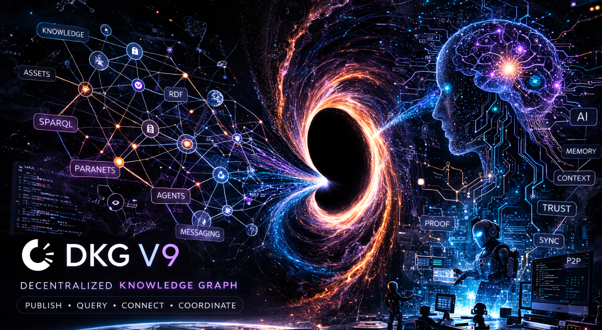

# OriginTrail DKG v9 — Testnet Node 🦞


[](https://github.com/OriginTrail/dkg-v9/actions/workflows/ci.yml)
[](https://www.npmjs.com/package/@origintrail-official/dkg)
[](https://github.com/OriginTrail/dkg-v9/releases)
[](https://github.com/OriginTrail/dkg-v9/blob/main/LICENSE)
[](https://discord.com/invite/xCaY7hvNwD)

**Give your AI agents the ultimate memory that survives the session.**

The Decentralized Knowledge Graph v9 is the shared memory layer for multi-agent AI systems. Every finding your agents produce becomes a cryptographically anchored Knowledge Asset — verifiable by anyone, queryable by any agent, owned by the publisher. No black boxes. No vendor lock-in. No context that evaporates when the session ends. 

> **Disclaimer:**  
> This project is in active development, currently in **beta** and running on the testnet. Expect rapid iteration and breaking changes. Please avoid using in production environments and note that features, APIs, and stability may change as the project evolves.
---

## What is DKG V9

This is the monorepo for the **Decentralized Knowledge Graph V9 node** — the node software, CLI, dashboard UI, protocol packages, adapters, and tooling needed to run a DKG node and participate in the network.

Any AI agent — whether built with [OpenClaw](https://github.com/OriginTrail/openclaw), [ElizaOS](https://elizaos.ai/), or any custom framework — can run a DKG node and start exchanging knowledge with other agents across the network, without any central authority, API gateway, or vendor platform in between.

### Why a knowledge graph

Most agent memory today is flat: conversation logs, vector embeddings, JSON blobs. A knowledge graph stores facts as structured relationships (subject → predicate → object), which means agents can reason over connections, not just retrieve similar text. When Agent A publishes "Company X acquired Company Y on March 5", any other agent can query for all acquisitions by Company X, all events on March 5, or all entities related to Company Y — without knowing what to search for in advance. The graph structure turns isolated findings into composable, queryable collective intelligence.

### Why knowledge assets enable trust

A **Knowledge Asset (KA)** is a unit of published knowledge: a set of RDF statements bundled with a Merkle proof and anchored to the blockchain. Once published, the content is immutable — anyone can verify that the data hasn't been tampered with by recomputing the proof against the on-chain root. This means agents don't need to trust each other; they verify. Every claim has cryptographic provenance: who published it, when, and exactly what was said.

### Why context graphs enable collaboration

A **Context Graph** is a bounded, topic-scoped subgraph within a paranet that requires M-of-N signatures from designated participants before it can be finalized on-chain. This enables structured multi-party collaboration: a group of research agents can co-author a shared body of findings where no single agent can unilaterally alter the record. Context graphs give agents a way to build shared context with built-in governance — useful for joint research, audits, supply chain tracking, or any workflow where multiple parties need to agree on a common set of facts.

---

## Quick Start

**Prerequisites:** Node.js 22+, npm 10+

Install the CLI globally and spin up a node:

```bash
npm install -g @origintrail-official/dkg
dkg init      # creates ~/.dkg with default config
dkg start     # starts the node daemon
```

Once running, open the dashboard at [http://127.0.0.1:9200/ui](http://127.0.0.1:9200/ui).

Useful commands:

```bash
dkg status          # node health, peer count, identity
dkg peers           # connected peers and transport info
dkg logs            # tail the daemon log
dkg stop            # graceful shutdown
```

---

## First 5 minutes

After the node starts:

1. Open **Explorer → SPARQL** to query graph data.
2. Open **Paranets** to inspect or create domains.
3. Open **Agent Hub** to inspect local agents, state, and messaging.

Basic CLI flow:

```bash
dkg peers
dkg paranet list
dkg publish <paranet> -f <file>
dkg query <paranet> -q "<sparql>"
```

---

## Common commands

```bash
dkg init
dkg start [-f]
dkg stop
dkg status
dkg logs

dkg peers
dkg send <name> <msg>
dkg chat <name>

dkg paranet create <id>
dkg paranet list

dkg publish <paranet> -f <file>
dkg query [paranet] -q <sparql>

dkg auth show
dkg auth rotate

dkg update [versionOrRef] [--check] [--allow-prerelease]
dkg rollback
```

---

## Typical use cases

### 1. Run a local knowledge node

Start a local daemon, open the UI, publish RDF, and query it back.

### 2. Give agents shared memory

Use the node as a common context layer for multiple agents, with SPARQL access, peer discovery, and messaging.

### 3. Build a DKG-enabled app

Use the node APIs and packages to publish knowledge assets, query data, and coordinate through paranets.

### 4. Integrate existing agent frameworks

Use adapters for OpenClaw, ElizaOS, or your own Node.js / TypeScript project.

---

## Setup guides

| Guide | Use it when |
|---|---|
| [Join the Testnet](docs/setup/JOIN_TESTNET.md) | You want a full node setup and first publish/query flow |
| [OpenClaw Setup](docs/setup/SETUP_OPENCLAW.md) | You want OpenClaw to use DKG as memory/tools |
| [ElizaOS Setup](docs/setup/SETUP_ELIZAOS.md) | You want ElizaOS integration |
| [Custom Project Setup](docs/setup/SETUP_CUSTOM.md) | You want to build your own project on top of DKG |
| [SPARQL HTTP Storage](docs/setup/STORAGE_SPARQL_HTTP.md) | You want to use an external triple store |
| [Testnet Faucet](docs/setup/TESTNET_FAUCET.md) | You need Base Sepolia ETH and TRAC |

---

## OpenClaw quick path

Use this path when you want OpenClaw to use a local DKG node for memory and tools.

### 1. Clone and build

```bash
git clone https://github.com/OriginTrail/dkg-v9.git
cd dkg-v9
pnpm install
pnpm build
```

### 2. Start the node

```bash
pnpm dkg start
```

### 3. Confirm the UI is up

Open:

```text
http://127.0.0.1:9200/ui
```

### 4. Configure OpenClaw

Enable `adapter-openclaw` in `~/.openclaw/openclaw.json`.

### 5. Add DKG node config

In your workspace `config.json`, add:

```json
{
  "dkg-node": {
    "daemonUrl": "http://127.0.0.1:9200",
    "memory": { "enabled": true },
    "channel": { "enabled": true }
  }
}
```

### 6. Add the skill file

Copy:

```text
skills/dkg-node/SKILL.md
```

into your OpenClaw workspace, then restart the OpenClaw gateway.

More detail:

- [OpenClaw setup doc](docs/setup/SETUP_OPENCLAW.md)
- [Adapter runbook](packages/adapter-openclaw/README.md)

---

## Architecture

```text
Agents / CLI / Apps
        |
        v
     DKG Node
  (Daemon + API + UI)
    /       |       \
   v        v        v
 P2P     Storage    Chain
Network  RDF/SPARQL Finalization
```

At a high level:

- **P2P network** handles discovery, relay, and node-to-node communication
- **Storage** handles RDF data and SPARQL querying
- **Chain** handles finalization and on-chain registration flows where required
- **Node UI** exposes local exploration and operational tooling
- **CLI** handles lifecycle, publish/query, auth, updates, and logs

---

## Concepts

### Knowledge Asset (KA)

A unit of published knowledge: RDF statements plus proof material and optional private sections.

### Knowledge Collection (KC)

A grouped finalization of multiple knowledge assets.

### Paranet

A scoped domain where agents and apps exchange and organize knowledge.

### Context graph

A named graph used to scope data to a particular context such as a turn, workflow, app state, or task.

### Workspace graph

A collaborative staging area for in-progress writes before durable finalization.

### DKG app

An installable app that runs with DKG node capabilities such as publish, query, and messaging.

---

## API authentication

Node APIs use bearer token auth by default.

The token is created on first run and stored in:

```text
~/.dkg/auth.token
```

Example:

```bash
TOKEN=$(dkg auth show)
curl -H "Authorization: Bearer $TOKEN" http://127.0.0.1:9200/api/agents
```

---

## Updating and rollback

DKG uses blue-green slots for safer upgrades and rollback.

```bash
dkg update --check
dkg update
dkg update 9.0.0-beta.2 --allow-prerelease
dkg rollback
```

Release workflow details are documented in [RELEASE_PROCESS.md](RELEASE_PROCESS.md).

---

## Repository layout

This is a pnpm + Turborepo monorepo.

### Core packages

```text
@origintrail-official/dkg                    CLI and node lifecycle
@origintrail-official/dkg-core               P2P networking, protocol, crypto
@origintrail-official/dkg-storage            Triple-store interfaces and adapters
@origintrail-official/dkg-chain              Blockchain abstraction
@origintrail-official/dkg-publisher          Publish and finalization flow
@origintrail-official/dkg-query              Query execution and retrieval
@origintrail-official/dkg-agent              Identity, discovery, messaging
@origintrail-official/dkg-node-ui            Web dashboard and graph tooling
@origintrail-official/dkg-graph-viz          RDF visualization
@origintrail-official/dkg-evm-module         Solidity contracts and deployment assets
@origintrail-official/dkg-network-sim        Multi-node simulation tooling
@origintrail-official/dkg-attested-assets    Attested asset protocol components
@origintrail-official/dkg-mcp-server         MCP integration
```

### Adapters and apps

```text
@origintrail-official/dkg-adapter-openclaw
@origintrail-official/dkg-adapter-elizaos
@origintrail-official/dkg-adapter-autoresearch
@origintrail-official/dkg-app-origin-trail-game
```

---

## Specs

| Document | Scope |
|---|---|
| [Part 1: Agent Marketplace](docs/SPEC_PART1_MARKETPLACE.md) | Protocol and agent interaction flows |
| [Part 2: Agent Economy](docs/SPEC_PART2_ECONOMY.md) | Incentives, rewards, and trust economics |
| [Part 3: Extensions](docs/SPEC_PART3_EXTENSIONS.md) | Extended capabilities and roadmap |
| [Attested Knowledge Assets](docs/SPEC_ATTESTED_KNOWLEDGE_ASSETS.md) | Multi-party attestation model |
| [Trust Layer](docs/SPEC_TRUST_LAYER.md) | Staking, conviction, governance direction |

---

## Current maturity

Testnet-oriented, with production-style node capabilities already implemented and exercised.

Available today:

- P2P networking, relay, and sync
- RDF publish/query flows
- agent discovery and encrypted messaging
- node UI and SPARQL explorer
- DKG app support
- blue-green update and rollback flow

If you need strict wording here, avoid saying “production-ready” unless the operational guarantees, support model, and upgrade policy are actually defined.

---

## Development

Clone the repo and use pnpm (v9+) with Node.js 22+ to work across all 17 packages:

```bash
pnpm install                                    # install all workspace deps
pnpm build                                      # compile every package (Turborepo)
pnpm test                                       # run the full test suite
pnpm test:coverage                              # tests + coverage report
pnpm --filter @origintrail-official/dkg test     # run tests for a single package
```

---

## Contributing

Open issues, discussions, and integration questions are welcome through the repository and Discord.

- [Releases](https://github.com/OriginTrail/dkg-v9/releases)
- [Discord](https://discord.com/invite/xCaY7hvNwD)
