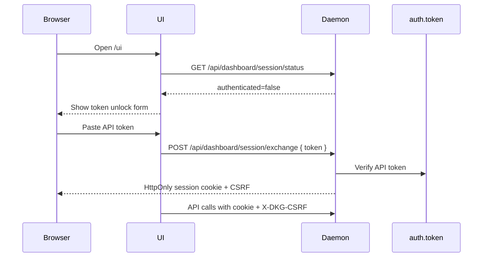
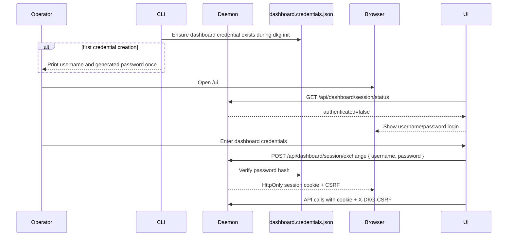
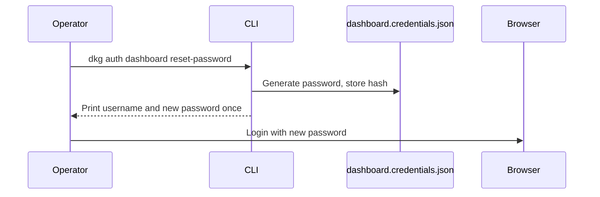

# Dashboard Login Follow-Up Plan

## Executive Summary

PR #1428 fixes the highest-risk issue by removing JavaScript-readable API-token injection from Node UI. The remaining UX problem is that a fresh browser must paste a node API token into the unlock gate. This follow-up will add a lightweight, single-user dashboard login that is safer and more familiar:

- Generate a local dashboard username/password credential during `dkg init`, with a CLI reset path for existing nodes.
- Store only a password hash under `DKG_HOME`, never the cleartext password.
- Print the generated password once from the explicit CLI command that creates it, and provide a CLI reset command for recovery.
- Let the browser login with username/password to mint the existing HttpOnly dashboard session cookie and CSRF state.
- Preserve the API-token exchange route for automation, devnet, and compatibility.

This is intentionally not a full multi-user account system. It is a single-node operator login with a migration path toward passkeys, RBAC, proxy auth, or multi-user credentials later.

## Team Lead Prompt

Mission: implement a stacked follow-up PR off `codex/node-ui-auth-bootstrap-session` that replaces the default token-paste dashboard UX with a lightweight single-user dashboard login.

Repository: `/home/jurij/dkg-pr1428`.

Constraints:
- Preserve all PR #1428 security properties: no bearer token in HTML, localStorage, query params, visible cookies, or browser-readable config.
- Preserve dashboard session cookies, CSRF, origin checks, logout, SSE closure, and invalid explicit bearer/query no-fallback behavior.
- Do not reopen broad request-auth architecture refactors already tracked in issue #1433.
- Keep the PR stacked against `codex/node-ui-auth-bootstrap-session`.

Permanent teammates:
- Implementation lead: owns daemon route, credential storage, CLI reset, and UI integration.
- Security reviewer: owns threat model, brute-force/session-fixation/credential-storage/CSRF review, and required tests.
- UX reviewer: owns login form copy, failure states, first-run/reset operator experience, and accessibility.
- QA reviewer: owns targeted unit/e2e/devnet validation plan.

Coordination:
- Inspect current code and plan before implementation.
- After implementation, security, UX, and QA review the diff before push.
- Defer broad follow-ups only when they do not represent a concrete regression in this PR.

## Root Cause

The token unlock gate exists because the browser needs a privileged dashboard session but cannot safely receive the node API bearer token. Pasting the token into the UI is secure enough as a baseline, but poor UX because:

- users must find terminal/file credentials;
- the token is an API credential, not a human login concept;
- the UI looks like an unfinished admin system;
- repeated review rounds hardened the token flow but did not solve first-run ergonomics.

## Desired Security Model

The dashboard password is a human-facing credential used only to mint a dashboard session. The API token remains a daemon/internal credential.

Properties:
- Password verification happens server-side.
- Password file stores only a salted memory-hard hash.
- Reusable passwords are never printed by daemon startup/runtime logs.
- Login success mints the existing HttpOnly `dkg_ui_session` cookie and CSRF token.
- Dashboard requests continue to use cookie + `X-DKG-CSRF`.
- The browser never receives the backing API token.
- Login requires trusted `Origin`/`Referer` policy, same as the current exchange route.
- Repeated login failures are rate-limited.
- Password reset invalidates password-login sessions on their next request.
- API-token exchange remains available for automation and test/devnet bootstrap.

## Existing Flow

## Desired Flow

## Password Reset Flow

## Adversarial Review

### Security Lens

Risks:
- Offline brute force if the credential file is stolen.
- Online brute force against remote `/ui`.
- Login CSRF/session fixation from hostile origins.
- Accidentally exposing the backing API token after successful password login.
- Stale dashboard sessions remaining valid after API-token rotation.
- Password reset output being captured in shell history/logs.
- Reusable passwords being captured in daemon logs and later retrievable via UI/log APIs.

Mitigations:
- Use `crypto.scrypt` with per-credential random salt.
- Store file with mode `0600` and never store cleartext password.
- Add in-memory login attempt throttling.
- Reuse `hasTrustedDashboardOrigin` before exchange.
- Session continues to store a backing valid API token server-side only; `verifyToken` still reconciles token rotations.
- Password-login sessions store a credential-file fingerprint and are revoked if the credential file changes.
- CLI prints password once with explicit "save securely" wording.
- Daemon logs only the credential file path/reset instruction, never the generated password.

Required tests:
- Generated credentials verify correct password and reject wrong password.
- Password file contains no cleartext password.
- Login creates dashboard session without token body.
- Wrong password returns 401 and no cookie.
- Hostile origin cannot login even with correct password.
- Repeated wrong password attempts lock out temporarily.
- Password reset changes the credential fingerprint and invalidates password-login sessions.
- Existing API-token exchange still works.

### UX/UI Lens

Risks:
- Users still do not know where credentials came from.
- Login error copy may sound like API-token failure.
- Password reset may require daemon restart if verifier caches credentials.
- First-run generated password can be missed in CLI output.

Mitigations:
- Login form labels "Username" and "Password", not "API token".
- Helper copy names `dkg auth dashboard reset-password`.
- Verifier reads the credential file on login so reset takes effect immediately.
- Auth status command shows the dashboard username and credential file path, not the password.

### Implementation Lens

Risks:
- Coupling dashboard-session route directly to filesystem.
- Choosing the wrong backing API token for sessions.
- Breaking devnet/e2e token bootstrap.
- Overbuilding a multi-user system too early.

Mitigations:
- Inject dashboard-login verifier into `handleDashboardSessionRequest`.
- Select a server-held valid token from the existing `validTokens` set after reconciliation.
- Keep token exchange compatibility.
- Scope storage to one credential record.

## Implementation Plan

1. Add `packages/cli/src/daemon/dashboard-credentials.ts`.
   - Define credential file path under `dkgDir()`.
   - Generate username `admin` and strong random password.
   - Hash with `scrypt`.
   - Verify with timing-safe comparison.
   - Reset command helper writes a new hash and returns generated password once.

2. Extend daemon session exchange.
   - Add optional `dashboardLogin` handler options.
   - Parse `{ username, password }` bodies in addition to existing `{ token }`.
   - On password success, choose a valid server-side backing API token and create source `login` session.
   - Add login throttling for failures.

3. Wire lifecycle.
   - Do not create or print dashboard passwords from daemon startup/runtime logs.
   - Existing nodes without a dashboard credential see login copy and status/reset guidance.
   - Inject verifier and backing-token selector into `handleDashboardSessionRequest`.

4. Add CLI reset/status.
   - `dkg auth dashboard reset-password [--username <name>]`.
   - `dkg auth status` prints dashboard credential path and username when present.
   - `dkg init` creates the initial dashboard credential when missing and prints it once.

5. Update UI.
   - Change unlock gate to username/password login.
   - Keep client function name compatible or add `loginDashboardSession`.
   - Error copy should say "Invalid dashboard username or password".

6. Tests.
   - CLI credential helper tests.
   - Dashboard-session route tests for login success/failure/origin/lockout/token compatibility.
   - Node UI gate tests for username/password payload and failure copy.
   - Focused typechecks/builds.

## Deferred Follow-Ups

- Multi-user credentials and roles.
- Passkeys/WebAuthn.
- Proxy-auth trusted identity headers.
- First-run browser pairing without terminal.
- Secure display/retrieval UX for users who miss first-run password output.

## PR Strategy

Create a stacked PR:

- Head: `codex/node-ui-dashboard-login`
- Base: `codex/node-ui-auth-bootstrap-session`
- Draft initially, because it depends on PR #1428.

The PR body should explicitly state that it builds on #1428 and keeps API-token exchange compatibility for automation.
