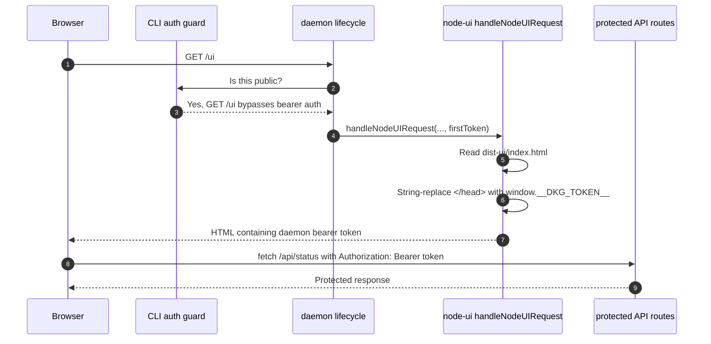
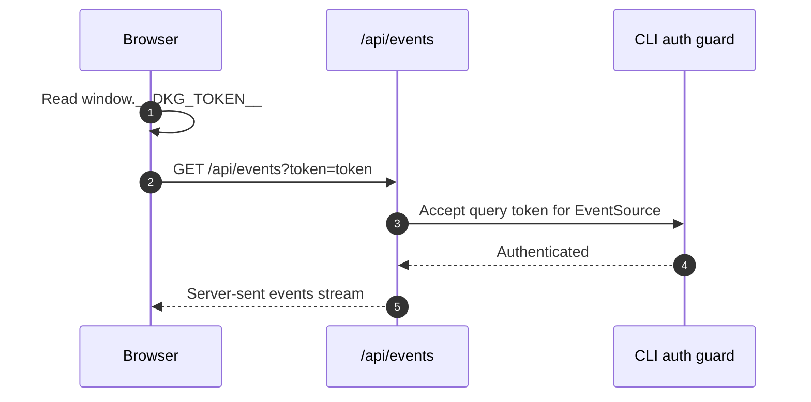
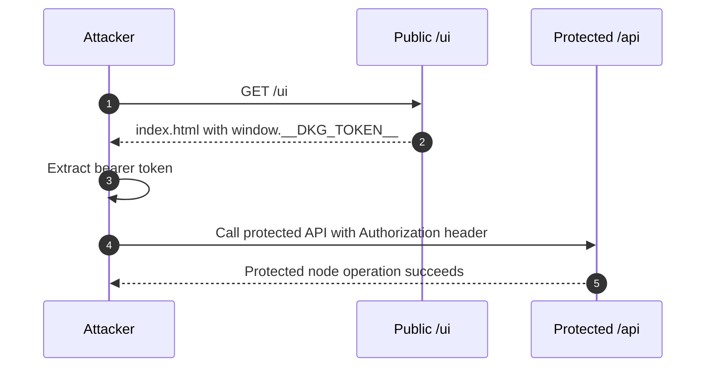
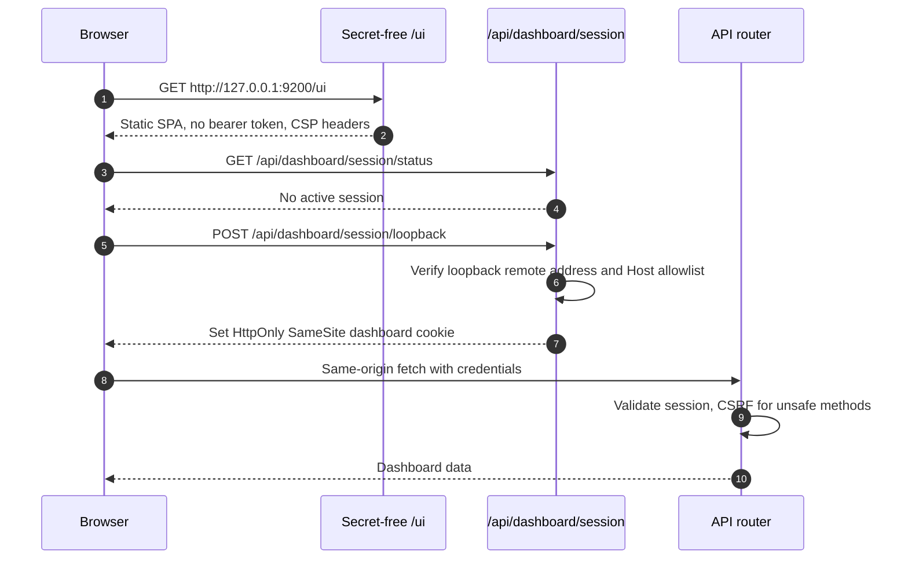
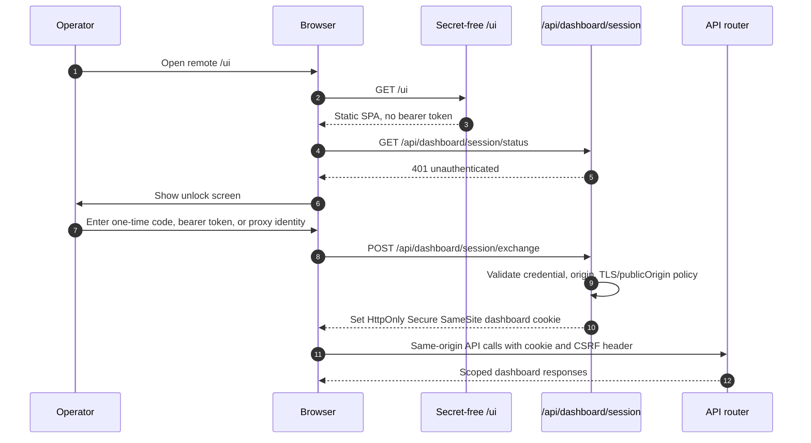
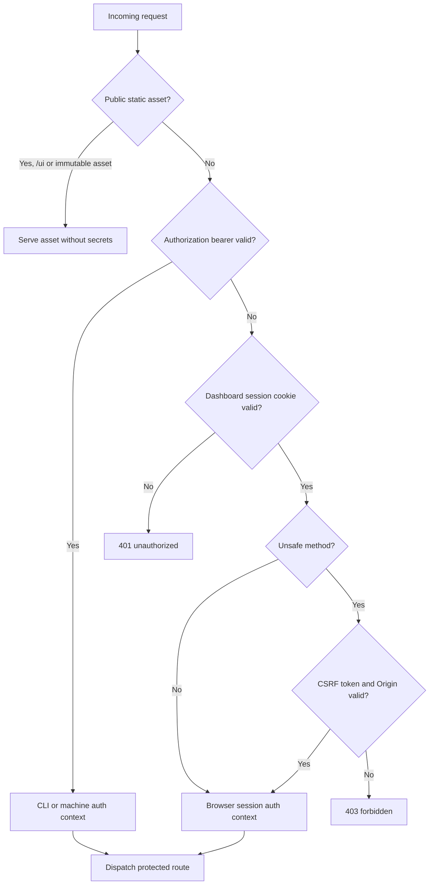

# Node UI Auth Bootstrap Upgrade Plan

Date: 2026-07-03

## Executive Summary

The community complaint is directionally useful but imprecise. The backend is not hand-rendering the Node UI as a 1990s-style HTML application. Production `/ui` serves a Vite-built static SPA. The real issue is the authentication bootstrap: unauthenticated `GET /ui` receives an inline script containing a valid daemon API bearer token as `window.__DKG_TOKEN__`.

That design crosses the auth boundary. It treats public static UI delivery as the way to distribute a reusable API credential to browser JavaScript. Under the default loopback bind this is a contained local-admin convenience with non-trivial local-host risks. If `/ui` is reachable by untrusted clients, the severity becomes Critical because any client can fetch `/ui`, extract the token, and call protected APIs.

Recommended target: keep the SPA static and secret-free, keep bearer tokens for CLI and machine clients, and give browsers an explicit dashboard session model:

- Serve `/ui` without injected secrets.
- Authenticate dashboard browsers with an opaque server-side session cookie.
- Use `HttpOnly`, `SameSite`, short lifetimes, and `Secure` on HTTPS.
- Add CSRF, Origin/Referer, Fetch Metadata, Host allowlist, and CORS hardening.
- Replace EventSource query tokens with cookie-authenticated same-origin SSE or a fetch-based stream.
- Add CSP and other static security headers once inline token bootstrap is removed.
- Preserve low-friction local UX while refusing silent admin access on public binds.

Overall program severity: High. Public bind or public reverse-proxy exposure is Critical until the browser no longer receives the daemon bearer token.

## Team Analysis Inputs

This plan was prepared using the Claude Code Agent Teams prompt structure in `agent-docs/node-ui-auth-bootstrap-team-prompt.md`, with four focused read-only analyses:

- Security architecture: auth-boundary threat model, severity, session target state.
- Daemon/backend: request order, auth guard, CORS, token classes, rollout risks.
- Frontend/UX: `window.__DKG_TOKEN__`, API clients, SSE, mock fallback, wallet/PCA behavior.
- QA/release: regression tests, doctor/smoke gaps, CI/devnet gates, acceptance criteria.

## Current Evidence

Key current files:

- `packages/cli/src/auth.ts`: public GET policy includes `/ui`, `/ui/`, and `/apps/`; `/api/events` accepts `?token=` for EventSource.
- `packages/cli/src/daemon/lifecycle.ts`: daemon passes the first valid auth token into `handleNodeUIRequest`.
- `packages/node-ui/src/api.ts`: `/ui` static serving injects `` into HTML.
- `packages/node-ui/src/ui/api.ts`: browser fetch helpers attach `Authorization: Bearer ${window.__DKG_TOKEN__}`.
- `packages/node-ui/src/ui/api-wrapper.ts`: mock-mode probe duplicates the token-global lookup.
- `packages/node-ui/src/ui/hooks/useNodeEvents.ts`: SSE uses `/api/events?token=...`.
- `packages/cli/src/daemon/http-utils.ts`: CORS defaults to loopback origins, but `apiHost=0.0.0.0` currently returns wildcard for compatibility.
- `packages/node-ui/vite.config.ts`: dev server injects the same browser global during Vite development.
- `scripts/devnet-test-node-ui-smoke.sh`: smoke only proves `/ui/` returns HTML-shaped content.
- `scripts/devnet-comprehensive.sh`: registers the Node UI smoke as `node-ui-smoke` in the `node-ui` group and skips it only when `SKIP_UI=1`.
- `.github/workflows/ci.yml`: has a `Kosava: node-ui` unit lane and a `Kosava: node-ui e2e (Playwright real-node devnet)` lane.
- `packages/node-ui/playwright.config.ts`: the e2e lane chains `e2e/bootstrap-devnet.ts` and `pnpm dev:ui`, defaults to a four-node devnet, and pins CI to one worker.
- `packages/node-ui/e2e/helpers/page-api.ts`: browser-side e2e helper currently scrapes `window.__DKG_TOKEN__` and manually sends `Authorization`.
- `packages/node-ui/e2e/fixtures/base.ts`: auto-fails any e2e test that silently falls back to mock/demo data.

## Existing Devnet and CI Pattern

The upgrade should extend the current test topology instead of inventing a parallel one.

Current lightweight devnet pattern:

- `scripts/devnet-test-node-ui-smoke.sh` starts Vite through `scripts/devnet.sh ui start`.
- It targets `UI_NODE_ID=1` and `UI_PORT=5173` by default.
- It polls `http://localhost:5173/ui/`.
- It currently passes if the payload is non-empty and HTML-shaped.
- `scripts/devnet-comprehensive.sh` registers it as `node-ui-smoke`, grouped under `node-ui`, and honors `SKIP_UI=1`.

Current heavy UI gate:

- `packages/node-ui/playwright.config.ts` owns the real-node e2e topology.
- The Playwright `webServer` command first boots or repairs a real devnet through `e2e/bootstrap-devnet.ts`, then starts `pnpm dev:ui`.
- The default e2e topology is a four-node devnet so VM publish flows can satisfy the 3-of-N ACK quorum.
- `.github/workflows/ci.yml` runs this as `Kosava: node-ui e2e (Playwright real-node devnet)` with one CI worker, retries, Playwright report upload, and devnet log upload on failure.
- The existing e2e fixture already blocks silent mock fallback, which is exactly the right pattern to preserve for auth/session work.

Current helper gap:

- `packages/node-ui/e2e/helpers/page-api.ts` currently reaches protected APIs by reading `window.__DKG_TOKEN__`.
- The upgrade must replace that helper with a session-aware browser fetch helper using `credentials: 'same-origin'`, and all e2e specs that call it should keep exercising the live daemon rather than falling back to direct Node-side bearer-token calls.

## Current Key Flows

### Current Production UI Bootstrap

### Current SSE Bootstrap

### Current Public Exposure Failure Mode

## Desired Key Flows

### Desired Local Loopback Dashboard

### Desired Remote Dashboard

### Desired Auth Decision Flow

## Root Cause Analysis

Primary root cause: the static UI bootstrap and API authorization credential are the same trust object. A public route (`/ui`) is used to distribute a reusable protected API bearer token.

Contributing causes:

- Browser auth is modeled as a JavaScript-readable daemon bearer token instead of a browser session.
- The server chooses `validTokens.values().next().value`, so token selection is broad and implicit rather than scoped to UI intent.
- `/ui` is deliberately public to allow the SPA to load, but no second step establishes a constrained UI session.
- Native `EventSource` cannot set Authorization headers, so SSE was given a query-token exception.
- CORS and bind-host behavior are treated as deployment convenience rather than explicit browser-session policy.
- Mock fallback can hide auth/connectivity failures in UX contexts where operators need accurate node status.
- The inline script prevents a strict `script-src 'self'` CSP.
- Smoke and doctor checks validate "some HTML arrived" more than "the correct secure dashboard is being served."

## Risk Analysis

| Scenario | Severity | Why |
| --- | --- | --- |
| Default single-user loopback, trusted workstation | Medium | Any local process or local browser context that can fetch `/ui` can recover the daemon token, but network exposure is constrained. |
| Shared host, hostile local user, browser-local attack, DNS rebinding pressure | High | Loopback is not a strong authorization boundary. Host validation, CSRF, and no-JS-token design are needed. |
| `apiHost=0.0.0.0` or public port | Critical | Any unauthenticated remote client can fetch `/ui`, extract the bearer token, and call protected APIs. |
| Reverse proxy with public `/ui` | Critical unless proxy auth is equivalent to node-admin | `/ui` still discloses the daemon credential to whoever can load it. |
| XSS in the dashboard | High today, reduced after migration | Today XSS can steal the bearer token. With HttpOnly sessions, XSS can still act as the user but cannot exfiltrate a reusable daemon bearer token. |
| CSRF after cookie migration | High if not handled | Cookies are automatically sent by browsers. The migration must add CSRF and Origin/Referer checks for unsafe methods. |
| Query token in SSE | Medium to High | URLs can leak through logs, diagnostics, browser history, and referrers. Remove or deprecate. |

## Research Conclusions

The recommended target follows current browser-app security guidance:

- OWASP Session Management emphasizes that a session token is effectively equivalent to authentication while active; disclosure enables hijacking. Source: [OWASP Session Management Cheat Sheet](https://cheatsheetseries.owasp.org/cheatsheets/Session_Management_Cheat_Sheet.html).
- OWASP HTML5 guidance warns against keeping session identifiers in JavaScript-accessible browser storage and points to `HttpOnly` cookies as a mitigation. Source: [OWASP HTML5 Security Cheat Sheet](https://cheatsheetseries.owasp.org/cheatsheets/HTML5_Security_Cheat_Sheet.html).
- Modern browser apps with sensitive data should prefer a backend-for-frontend style pattern where tokens remain server-side and the browser gets only a session cookie. The IETF browser-based apps draft describes the BFF pattern as using a cookie-backed session while the backend keeps tokens out of the browser, and notes that token-mediating designs exposing access tokens to the browser are weaker. Source: [IETF OAuth 2.0 for Browser-Based Applications draft](https://datatracker.ietf.org/doc/html/draft-ietf-oauth-browser-based-apps).
- Cookie-backed browser auth requires CSRF controls. SameSite helps, but sensitive apps should also validate CSRF tokens and trusted origins for state-changing requests. Sources: [OWASP CSRF Prevention Cheat Sheet](https://cheatsheetseries.owasp.org/cheatsheets/Cross-Site_Request_Forgery_Prevention_Cheat_Sheet.html), [IETF browser-based apps draft](https://datatracker.ietf.org/doc/html/draft-ietf-oauth-browser-based-apps).
- Cookie attributes matter: use `HttpOnly`, `SameSite`, `Path=/`, `Secure` on HTTPS, and host-only cookies. The `__Host-` prefix is appropriate for HTTPS deployments because it requires `Secure`, no `Domain`, and `Path=/`. Source: [MDN Set-Cookie](https://developer.mozilla.org/en-US/docs/Web/HTTP/Headers/Set-Cookie).
- Strict CSP becomes practical only after removing the inline token script. Avoid inline script execution except with deliberate nonce or hash policy. Sources: [MDN Content Security Policy](https://developer.mozilla.org/en-US/docs/Web/HTTP/Guides/CSP), [OWASP Content Security Policy Cheat Sheet](https://cheatsheetseries.owasp.org/cheatsheets/Content_Security_Policy_Cheat_Sheet.html).
- Credentialed browser CORS cannot safely use wildcard origins. Explicit origins are required when cookies or credentials are involved. Source: [MDN CORS](https://developer.mozilla.org/en-US/docs/Web/HTTP/Guides/CORS).
- Loopback is a useful local-app pattern, but it is not the same as remote authorization. Native-app guidance uses loopback with care and acknowledges interception risks. Source: [RFC 8252 OAuth 2.0 for Native Apps](https://www.rfc-editor.org/rfc/rfc8252).

Engineering conclusion: the right state is not "template the HTML better." It is "stop handing daemon bearer tokens to browser JavaScript."

## Delivery Target

The implementation target is a pull request into `main`.

Branch and PR expectations:

- Create a focused branch for the Node UI auth bootstrap migration.
- Keep the PR scoped to the dashboard auth/session upgrade, related tests, docs, doctor/smoke updates, and CI wiring needed to prove it.
- Use `main` as the PR base unless repository state makes that genuinely incorrect.
- Before pushing, inspect the branch diff, changed files, ignored paths, generated artifacts, and local-only files so the PR contains no accidental workspace noise.
- After pushing, use the `github-pr-driver` workflow to drive the PR to convergence with the remote reviewer.

Required PR shape:

- `## Summary`
- `## Related`
- `## Files changed`
- `## Test plan`

Reviewer convergence workflow:

- After the PR is created, and after each material push, wait for fresh review/CI signal before sweeping feedback.
- Pull open review comments, unresolved threads, recent replies, and CI/check status.
- Classify feedback as valid/actionable, already addressed, outdated/superseded, or not valid.
- Treat failing CI as first-class review input.
- Fix valid comments with the smallest clean change that preserves the security target and existing CLI/browser compatibility.
- Reply to each addressed thread with what changed and how it was validated.
- Resolve threads only after the fix is present on the PR branch and the reply cites the relevant evidence.
- Repeat review rounds until no relevant unresolved comments or failing checks remain, or summarize the blocker and options if convergence stalls after repeated good-faith rounds.

## Recommended Target Architecture

### Auth Model

Keep two auth families:

1. Bearer token auth for CLI, automation, tests, and machine clients.
2. Dashboard session auth for browsers.

Dashboard sessions should be:

- Opaque random identifiers, not raw daemon tokens.
- Stored server-side as session records containing principal, scopes, issue time, expiry, and optional bound metadata.
- Sent in cookies with `HttpOnly`, `SameSite=Strict` where feasible, `Path=/`, no `Domain`, and `Secure` when served over HTTPS.
- Short-lived by default, with refresh/rotation policy and explicit logout.
- Scoped to dashboard needs, not implicitly all daemon admin authority unless a route truly needs it.

### Bootstrap Modes

Recommended modes:

- `loopback-session` default: available only when remote address is loopback and Host is `127.0.0.1`, `localhost`, or `[::1]` with the bound port. May auto-mint a dashboard session to preserve local "open and it works" UX, but never exposes the bearer token to JavaScript.
- `paired-session`: local or remote flow using a one-time code from `dkg ui open` or `dkg auth ui-code`, or explicit token entry from an operator. Recommended for shared machines and SSH tunnel workflows.
- `external-auth-session`: reverse proxy or identity provider asserts an operator identity to the daemon over a trusted local interface, then the daemon mints a dashboard session. Requires explicit `publicOrigin` and HTTPS.
- `legacy-token-injection`: temporary, explicit opt-in only, with startup warnings and non-loopback refusal unless a deliberate insecure flag is set. Remove after a deprecation window.

### Browser API Pattern

- Centralize browser fetch in one API client.
- Use `credentials: 'same-origin'`.
- Remove `authHeaders()` as a bearer-token helper from UI code.
- For unsafe methods, require a CSRF header supplied by a same-origin session endpoint.
- Preserve external wallet/RPC boundaries: never send dashboard credentials to external RPC URLs or wallet providers.
- Treat 401 as "session required/expired", not as a trigger for demo data in operator mode.

### SSE Pattern

Preferred:

- Same-origin `EventSource('/api/events')` authenticated by the dashboard cookie.
- Route validates session cookie and CSRF is not required for read-only GET stream.
- Host and Origin policy still apply where relevant.

Alternative if cookie SSE is difficult:

- Use a fetch-based SSE/polyfill stream that can use the centralized API client.
- Avoid bearer token query strings.

### CORS and Host Policy

- Same-origin dashboard calls should not need CORS.
- Keep CORS for explicit machine/browser integrations, but separate it from dashboard session auth.
- Do not emit `Access-Control-Allow-Credentials: true` with wildcard origins.
- Stop defaulting `apiHost=0.0.0.0` to wildcard CORS for credentialed browser contexts.
- Add Host allowlist checks for loopback UI/session endpoints to reduce DNS rebinding risk.
- Require explicit `publicOrigin` for remote browser session mode.

### Security Headers

Add once inline bootstrap is removed:

- `Content-Security-Policy: default-src 'self'; script-src 'self'; object-src 'none'; base-uri 'none'; frame-ancestors 'none'; connect-src 'self' ...`
- Start with `Content-Security-Policy-Report-Only` if existing inline styles or wallet integrations need inventory.
- `X-Content-Type-Options: nosniff`
- `Referrer-Policy: no-referrer` or `strict-origin-when-cross-origin`
- `Permissions-Policy` denying unneeded browser features
- `Cross-Origin-Opener-Policy: same-origin` where compatible
- `Cache-Control: no-store` for session endpoints and HTML; immutable caching only for fingerprinted assets.

## Implementation Plan

### Phase 0 - Containment and Baseline

Goal: prevent accidental public exposure while building the real session architecture.

Steps:

1. Add a config and startup warning path that detects `apiHost=0.0.0.0` or non-loopback public origins while token injection is enabled.
2. Refuse token injection for non-loopback UI requests unless an explicit insecure compatibility flag is set.
3. Escape or remove the legacy inline script for unusual token characters if the legacy mode remains for one release.
4. Add tests proving `/ui` no longer exposes a token under public-bind mode.
5. Update docs to tell operators not to expose `/ui` without a trusted access-control layer.

Files likely touched:

- `packages/cli/src/daemon/lifecycle.ts`
- `packages/node-ui/src/api.ts`
- `packages/cli/src/config.ts`
- `packages/cli/test/auth.test.ts`
- `packages/node-ui/test/api-routes.test.ts`

### Phase 1 - Session Primitives

Goal: introduce browser session auth without removing bearer token auth for CLI clients.

Steps:

1. Add a daemon dashboard-session module:
   - Generate high-entropy session IDs.
   - Store only hashed session IDs server-side.
   - Track principal, scopes, issued-at, expires-at, last-used, and source mode.
   - Support revoke/logout and expiry cleanup.
2. Add session endpoints:
   - `GET /api/dashboard/session/status`
   - `POST /api/dashboard/session/loopback`
   - `POST /api/dashboard/session/exchange`
   - `POST /api/dashboard/session/logout`
   - `GET /api/dashboard/session/csrf`
3. Add cookie helpers:
   - Local HTTP loopback cookie: `HttpOnly; SameSite=Strict; Path=/`.
   - HTTPS remote cookie: `__Host-dkg-ui=...; Secure; HttpOnly; SameSite=Strict; Path=/`.
4. Add AuthContext:
   - Bearer context for existing tokens.
   - Dashboard session context for browser requests.
   - Principal and scope helpers for routes that distinguish node-admin vs agent tokens.
5. Keep route order stable: CORS `OPTIONS` before auth, public static UI before generic API where needed, protected APIs behind a unified auth decision.

Files likely touched:

- `packages/cli/src/auth.ts`
- `packages/cli/src/daemon/lifecycle.ts`
- `packages/cli/src/daemon/http-utils.ts`
- new `packages/cli/src/daemon/dashboard-session.ts`
- route helpers that currently infer agent identity from bearer token only

### Phase 2 - Secret-Free Static UI

Goal: make `/ui` a public static shell that never contains daemon credentials.

Steps:

1. Remove `authToken` from `handleNodeUIRequest` and from the lifecycle call site.
2. Delete production `window.__DKG_TOKEN__` injection.
3. Replace the Vite dev injection with the same session flow or a dev-only explicit session bootstrap endpoint.
4. Add CSP and static security headers.
5. Make the "Node UI not built" fallback return a non-200 status such as 503 and include a sentinel that smoke tests reject.
6. Add a build-time UI version/fingerprint meta contract so doctor can compare served vs installed UI.

Files likely touched:

- `packages/node-ui/src/api.ts`
- `packages/node-ui/vite.config.ts`
- `packages/cli/src/daemon/lifecycle.ts`
- `packages/cli/src/doctor/checks/served-ui-mismatch.ts`
- `packages/node-ui/src/ui/index.html`

### Phase 3 - Frontend API Migration

Goal: remove browser bearer-token assumptions and improve operator UX.

Steps:

1. Replace `authHeaders()` with a centralized `apiFetch` helper:
   - `credentials: 'same-origin'`
   - JSON parsing and `HttpError` handling
   - CSRF header on unsafe methods
   - consistent timeout handling
2. Remove `Window.__DKG_TOKEN__` types and tests.
3. Update all fetch sites to use `apiFetch`.
4. Update EventSource to use cookie-authenticated `/api/events` or a fetch-based stream.
5. Update `useCurrentAgent` to derive identity from `/api/dashboard/session/status`.
6. Change mock fallback:
   - Dev/demo mode may still use mocks with an obvious banner.
   - Operator mode should show "session expired", "node unreachable", or "auth required" instead of silently using demo data.
7. Preserve PCA/wallet separation:
   - Same-origin daemon PCA routes use dashboard session.
   - External RPC URLs and wallet providers receive no dashboard cookie or bearer token.

Files likely touched:

- `packages/node-ui/src/ui/api.ts`
- `packages/node-ui/src/ui/api-wrapper.ts`
- `packages/node-ui/src/ui/hooks.ts`
- `packages/node-ui/src/ui/hooks/useNodeEvents.ts`
- `packages/node-ui/src/ui/hooks/useCurrentAgent.ts`
- `packages/node-ui/src/ui/web3/clients.ts`
- `packages/node-ui/src/ui/pca/ownerActions.ts`
- `packages/node-ui/e2e/helpers/page-api.ts`

### Phase 4 - CSRF, Origin, and Host Hardening

Goal: make cookie auth safe for browser state-changing requests.

Steps:

1. Require CSRF tokens for unsafe methods when authenticated by dashboard session.
2. Validate `Origin` and, where needed, `Referer` against configured local/public origins.
3. Reject suspicious Host headers for loopback session minting.
4. Add Fetch Metadata checks (`Sec-Fetch-Site`, `Sec-Fetch-Mode`, `Sec-Fetch-Dest`) as defense in depth.
5. Do not require CSRF for bearer-token CLI clients.
6. Ensure CORS preflight behavior remains compatible with bearer-token integrations.

Files likely touched:

- `packages/cli/src/auth.ts`
- `packages/cli/src/daemon/http-utils.ts`
- `packages/cli/src/daemon/lifecycle.ts`
- new session/CSRF helpers
- route tests covering unsafe methods

### Phase 5 - Doctor, Devnet, CI, and Observability

Goal: make the secure UI state testable and diagnosable.

Steps:

1. Upgrade `dkg doctor` to report:
   - served UI version/fingerprint
   - installed UI package version
   - static directory
   - session mode
   - public bind risk
   - CSP/report-only status
2. Upgrade Node UI smoke:
   - Keep the current `scripts/devnet-test-node-ui-smoke.sh` entry point so `scripts/devnet-comprehensive.sh` continues to run `node-ui-smoke` in the `node-ui` group.
   - Add `trap` cleanup around `scripts/devnet.sh ui stop` so Vite is stopped on both pass and failure.
   - Fetch `/ui/` and assert the response is HTML, is not the "Node UI not built" sentinel, and does not contain `window.__DKG_TOKEN__`.
   - Assert HTML response headers include the expected cache and security headers, including CSP once enforced.
   - Parse referenced JS/CSS assets from the index and fetch them through the same Vite server.
   - Use a curl cookie jar to prove `GET /api/dashboard/session/status` reports no active session before bootstrap.
   - Prove a protected API call fails without either bearer auth or dashboard session.
   - Establish loopback dashboard session through the planned loopback/session endpoint, then prove `/api/status` succeeds with the session cookie and no `Authorization` header.
   - Prove `/api/events` can be opened without a `?token=` query once SSE is session-authenticated.
   - Save the served index head, response headers, session-status payload, API-status payload, and Vite log as debuggable artifacts when this smoke runs in CI/devnet sweeps.
3. Add or update the default Playwright real-node e2e suite:
   - Add an auth/session spec, for example `packages/node-ui/e2e/specs/auth-session.spec.ts`.
   - Assert `window.__DKG_TOKEN__` is absent in the browser context after page load.
   - Assert the app either auto-establishes a valid loopback session or shows the expected unlock state for remote/public mode.
   - Intercept/fail requests containing `?token=` on `/api/events`.
   - Verify a protected workflow still succeeds through the dashboard session.
   - Verify logout/session-expiry returns the UI to an auth-required state without mock fallback.
4. Update e2e helpers:
   - Replace `packages/node-ui/e2e/helpers/page-api.ts` token scraping with a session-aware helper that calls `fetch(path, { credentials: 'same-origin' })`.
   - Keep the `packages/node-ui/e2e/fixtures/base.ts` no-mock guard and extend the message to distinguish mock fallback from auth-required/session-expired states if product state names change.
   - Update specs such as `header.spec.ts` and `publishing-conviction.spec.ts` that currently assume the injected token helper.
5. Add fast CI gate for `build:ui` and static bundle contract:
   - The shared build currently skips `dist-ui`; add a Kosava-level step/job that runs `pnpm --filter @origintrail-official/dkg-node-ui run build:ui`.
   - After `build:ui`, run a static contract check that `dist-ui/index.html` contains the version/fingerprint marker, contains no `window.__DKG_TOKEN__`, and references fetchable fingerprinted assets.
   - Fail if the fallback "Node UI not built" page can satisfy the smoke predicate.
6. Preserve and extend the existing `Kosava: node-ui e2e (Playwright real-node devnet)` lane:
   - Keep its current four-node devnet, one-worker CI, retry, report upload, and devnet-log upload pattern.
   - Ensure the new auth/session spec is part of default `pnpm --filter @origintrail-official/dkg-node-ui test:e2e`.
   - Add session diagnostics to uploaded artifacts on failure where practical: served index head, `/api/dashboard/session/status`, `/api/status`, Vite log, and daemon auth/session log lines.
7. Log startup facts:
   - `nodeUiStaticDir`
   - served UI fingerprint
   - auth/session mode
   - public-bind warning or refusal
   - no raw token values
8. Emit counters for:
   - dashboard session created/revoked/expired
   - CSRF rejected
   - Origin/Host rejected
   - legacy token injection attempted

Files likely touched:

- `packages/cli/src/doctor/checks/served-ui-mismatch.ts`
- `packages/cli/test/dkg-doctor.test.ts`
- `scripts/devnet-test-node-ui-smoke.sh`
- `scripts/devnet-comprehensive.sh`
- `.github/workflows/ci.yml`
- `scripts/devnet.sh`
- `packages/node-ui/playwright.config.ts`
- `packages/node-ui/e2e/helpers/page-api.ts`
- `packages/node-ui/e2e/fixtures/base.ts`
- new `packages/node-ui/e2e/specs/auth-session.spec.ts`
- daemon startup logging

## Test Plan

Auth and routing tests:

- `GET /ui` serves no `window.__DKG_TOKEN__`.
- Public bind cannot receive token injection.
- `/ui-custom`, `/ui%2f..`, `/apps-custom`, and non-GET `/ui` do not bypass auth.
- `OPTIONS` remains before auth where required.
- Bearer-token CLI requests still work.
- Dashboard session requests work only with valid cookies.
- Unsafe dashboard-session requests without CSRF fail with 403.
- Invalid Origin, Referer, Fetch Metadata, or Host fails closed.

Static serving tests:

- SPA fallback still works for valid `/ui/*` paths.
- Traversal and symlink/junction escape guards remain intact.
- Missing `dist-ui/index.html` returns non-200 and fails smoke.
- CSP/security headers appear on HTML.
- Immutable caching applies only to fingerprinted assets.

Frontend tests:

- No tests set `window.__DKG_TOKEN__`.
- API helpers use `credentials: 'same-origin'`.
- Session-expired state is distinct from mock/demo state.
- Event stream connects without `?token=`.
- PCA and wallet helpers do not send dashboard credentials to external RPCs.

E2E tests:

- Local loopback dashboard opens and establishes a session.
- Remote/public dashboard shows an unlock/auth-required state.
- Session logout and expiry return the UI to auth-required state.
- Protected workflows still pass after session establishment.
- Playwright helper no longer scrapes `window.__DKG_TOKEN__`.
- New real-node auth/session spec runs in the existing default Playwright suite, not as a mock-only or optional lane.
- E2E request interception fails any browser request to `/api/events?token=...`.
- The no-mock guard remains active and does not treat auth-required/session-expired UI states as successful demo fallback.

CI/devnet tests:

- Existing `scripts/devnet-test-node-ui-smoke.sh` becomes the session/auth bootstrap smoke and remains registered by `scripts/devnet-comprehensive.sh` as `node-ui-smoke`.
- The smoke rejects `window.__DKG_TOKEN__`, the "Node UI not built" fallback, missing JS/CSS assets, missing session status, protected API access without session, and failed API access after loopback session bootstrap.
- Fast static bundle contract runs in CI after `build:ui` and before release packaging assumptions depend on `dist-ui`.
- Existing `Kosava: node-ui e2e (Playwright real-node devnet)` remains required and includes the new auth/session spec.
- CI artifacts include Playwright reports, devnet logs, served index head, session status, API status, Vite log, and doctor JSON when available.

Recommended focused command families once implemented:

- `pnpm --filter @origintrail-official/dkg exec vitest run --config vitest.unit.config.ts test/auth.test.ts test/dkg-doctor.test.ts`
- `pnpm --filter @origintrail-official/dkg-node-ui exec vitest run test/api-routes.test.ts test/ui-api-pure.test.ts --no-file-parallelism`
- `pnpm --filter @origintrail-official/dkg-node-ui run build:ui`
- Node UI Playwright real-node devnet lane from CI.

## UX Requirements

Local loopback:

- Keep "open the local dashboard and it works" as the default, but via HttpOnly session cookie rather than JS bearer token.
- Show a clear reconnect/unlock state if the session expires.
- Do not display demo data unless the user is explicitly in dev/demo mode.

Remote/public:

- Do not auto-grant dashboard authority by serving `/ui`.
- Show an auth gate with exact next steps:
  - use SSH tunnel/local loopback, or
  - enter one-time UI code, or
  - configure trusted HTTPS `publicOrigin` and external auth.
- Warn loudly on insecure remote HTTP.
- Prefer read-only status where unauthenticated exposure is intended; require session for privileged data or actions.

Developer/Vite:

- Keep dev startup ergonomic.
- Avoid dev-only token globals becoming product assumptions.
- Make mock mode explicit and visible.

Operator trust:

- Never log or display raw bearer tokens.
- Make doctor and startup output explain whether the dashboard is in legacy, loopback-session, paired-session, or external-auth mode.

## Rollout Plan

0. PR delivery:
   - Implement this plan on a focused branch.
   - Push the branch and open a PR into `main`.
   - Use the PR-driver workflow after push to keep the PR moving through review, CI failures, replies, and follow-up commits until it converges with the remote reviewer.
1. Patch release containment:
   - Warn or refuse legacy token injection outside loopback.
   - Document public exposure risk.
   - Add tests around public bind and no accidental token leakage.
2. Minor release:
   - Add dashboard session endpoints behind feature flag.
   - Add frontend compatibility path.
   - Add doctor/smoke visibility.
3. Default switch:
   - Make `loopback-session` default.
   - Keep `legacy-token-injection` as explicit deprecated opt-in for one release if necessary.
4. Removal:
   - Delete token injection and `window.__DKG_TOKEN__`.
   - Delete SSE query-token path for browser UI, or retain only for explicit non-browser compatibility with warnings.
5. Hardening:
   - Enforce CSP.
   - Tighten CORS defaults.
   - Require explicit `publicOrigin` and HTTPS for remote dashboard session mode.

## Rollback Plan

- Keep bearer-token API behavior untouched for CLI clients throughout the migration.
- Use feature flags for dashboard session mode until e2e coverage is green.
- If session migration breaks local UI, temporarily switch only local loopback users back to legacy mode while keeping public-bind refusal.
- Do not roll back to public token injection on remote/public binds.
- Preserve the old UI static bundle discovery/rollback tests while changing the auth bootstrap.

## Open Decisions

- Should local loopback auto-mint a dashboard session, or should all environments require an explicit one-time UI code?
- What scopes should dashboard sessions have: full node-admin, agent-scoped, or route-specific scopes?
- Is remote dashboard access a supported product surface, or should the supported answer be SSH tunnel/reverse proxy with external auth?
- What is the required HTTPS story for remote operators: daemon-native TLS, reverse proxy only, or both?
- How long should dashboard sessions live, and should activity extend them?
- Should agent-scoped bearer tokens be able to mint dashboard sessions?
- How much of `/apps/` should remain public, and does it need the same session model?
- Should the `?token=` SSE compatibility path be removed immediately or after one release?

## Acceptance Criteria

A staff engineer should be able to approve the upgrade when all of this is true:

- The implementation is proposed as a PR into `main` with a structured summary, related links, files-changed table, and concrete test plan.
- Remote reviewer comments and CI failures have been swept, classified, fixed or answered with evidence, and driven to convergence.
- Loading `/ui` never exposes a daemon bearer token in HTML, JavaScript globals, URLs, logs, or browser storage.
- Browser API calls authenticate with dashboard sessions, not JS bearer tokens.
- CLI and machine bearer-token clients remain compatible.
- Cookie-authenticated unsafe methods enforce CSRF and trusted-origin checks.
- Public-bind or remote dashboard mode fails closed unless explicitly configured.
- Event streams do not use bearer tokens in query strings for the browser UI.
- CSP/security headers are present and tested.
- Doctor and smoke checks can prove which UI bundle is served and whether secure session mode is active.
- CI includes targeted unit, static bundle, smoke, and real-node Playwright coverage.
- Operator docs clearly explain local, remote, legacy, and migration behavior.

## References

- [OWASP Session Management Cheat Sheet](https://cheatsheetseries.owasp.org/cheatsheets/Session_Management_Cheat_Sheet.html)
- [OWASP HTML5 Security Cheat Sheet](https://cheatsheetseries.owasp.org/cheatsheets/HTML5_Security_Cheat_Sheet.html)
- [OWASP CSRF Prevention Cheat Sheet](https://cheatsheetseries.owasp.org/cheatsheets/Cross-Site_Request_Forgery_Prevention_Cheat_Sheet.html)
- [OWASP Content Security Policy Cheat Sheet](https://cheatsheetseries.owasp.org/cheatsheets/Content_Security_Policy_Cheat_Sheet.html)
- [MDN Content Security Policy](https://developer.mozilla.org/en-US/docs/Web/HTTP/Guides/CSP)
- [MDN Set-Cookie](https://developer.mozilla.org/en-US/docs/Web/HTTP/Headers/Set-Cookie)
- [MDN CORS](https://developer.mozilla.org/en-US/docs/Web/HTTP/Guides/CORS)
- [IETF OAuth 2.0 for Browser-Based Applications draft](https://datatracker.ietf.org/doc/html/draft-ietf-oauth-browser-based-apps)
- [RFC 8252 OAuth 2.0 for Native Apps](https://www.rfc-editor.org/rfc/rfc8252)
