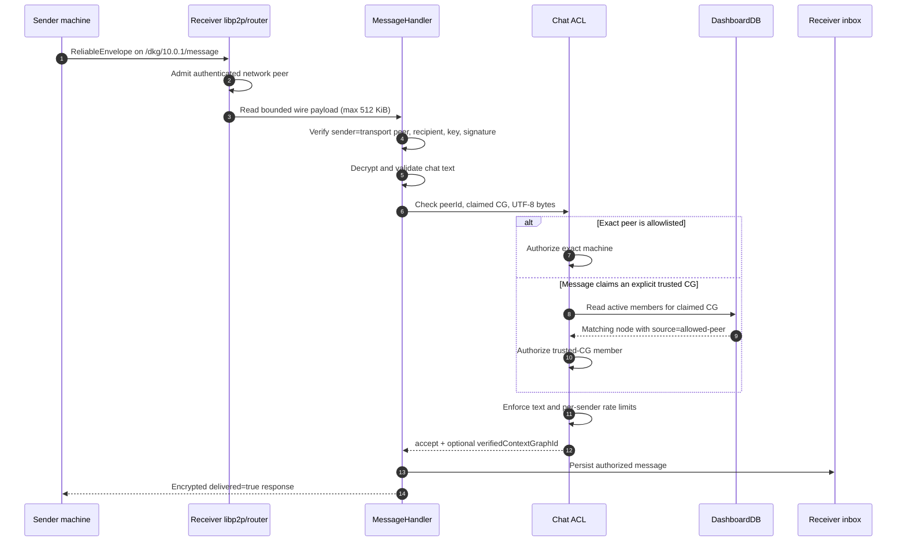
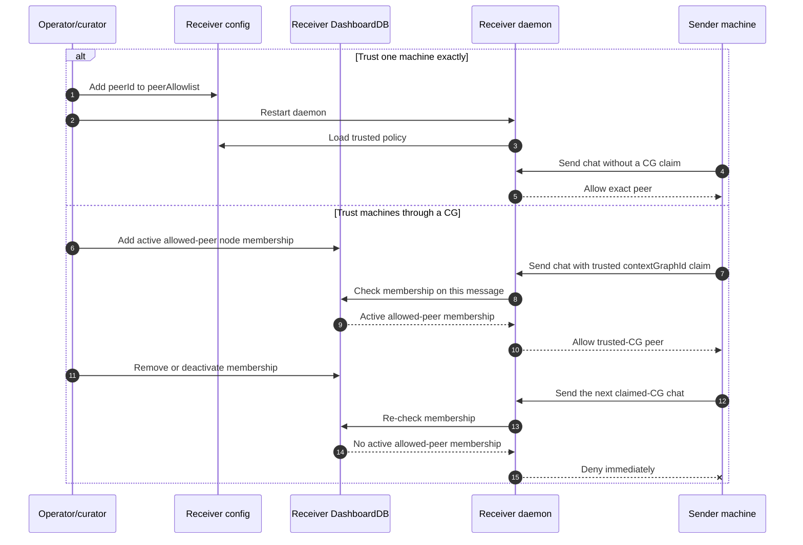

# Secure chat access matrix

This suite turns six ordinary devnet nodes into an inspectable access-control
lab and proves the inbound DKG chat boundary over the real libp2p transport.

## Machine roles

| Node | Role in the matrix |
|---|---|
| 1 | Receiver: `chat.enabled=true`, `mode=trusted`; trusts node 2 exactly and one explicit CG containing node 3. Limits: 64 UTF-8 bytes and 3 accepted messages/minute/sender. |
| 2 | Exact trusted machine. |
| 3 | Trusted only through an active `allowed-peer` membership in node 1's explicit trusted CG. |
| 4 | Untrusted machine; it is deliberately made a member of a different, untrusted CG. |
| 5 | Receiver with chat omitted, proving default-off. |
| 6 | Receiver with chat enabled but ACL `deny`, proving default-deny. |

The 16-row matrix covers exact-peer access, CG access, missing and false CG
claims, an untrusted CG member, an unknown peer, loopback, disabled and deny
receivers, the UTF-8 byte cap, and the rolling rate boundary. A row passes only
when the sender's delivery result and the receiver's persisted inbox agree.
libp2p rejects a self-dial before application dispatch, so the loopback row is
recorded as a transport-layer denial; the ACL-specific default-deny and explicit
`allowLoopback` behavior is pinned in `packages/cli/test/chat-acl.test.ts`.

Trusted-CG access is deliberately narrow: the sender must claim a CG listed in
`trustedContextGraphIds`, and the receiver must hold an active node membership
whose source is `allowed-peer`. Merely subscribing to the same CG, appearing in
discovery, writing to SWM, or having an agent-principal row does not grant chat.

## Configure a receiver

Inbound chat is off when `chat` is omitted or `enabled` is not exactly `true`.
An enabled receiver also defaults to `deny`. The recommended policy is:

```json
{
  "chat": {
    "enabled": true,
    "allowLoopback": false,
    "acl": {
      "mode": "trusted",
      "peerAllowlist": ["12D3KooW...trusted-machine-peer-id"],
      "trustedContextGraphIds": ["operations/trusted-agents"]
    },
    "limits": {
      "maxTextBytes": 32768,
      "maxMessagesPerMinute": 30
    }
  }
}
```

The two trust lists use OR semantics: an exact peer match is enough; otherwise
the sender must include the trusted CG claim and have an active `allowed-peer`
node membership in that CG on the receiver. Trusted-CG membership is read on
every message, so removing that membership takes effect immediately. Exact
peer allowlist changes take effect after the receiver daemon restarts. Message
bodies remain untrusted data even after transport authentication and
authorization.

## Sequence diagrams

### Accepted message path



### Fail-closed and denial path

```mermaid
sequenceDiagram
    autonumber
    participant S as Sender machine
    participant L as Receiver libp2p/router
    participant M as MessageHandler
    participant A as Chat ACL
    participant I as Receiver inbox

    alt Sender attempts a self-dial
        S->>L: Dial its own peer ID
        L--xS: Reject before application dispatch
    else Remote sender
        S->>L: ReliableEnvelope
        alt Network peer is not admitted
            L--xS: Reject before reading attacker-controlled bytes
        else Network peer is admitted
            L->>M: Bounded wire payload
            alt Sender/recipient binding or signature is invalid
                M--xS: Protocol error; ACL and inbox are not invoked
            else Envelope is authentic
                M->>A: Authorize inbound chat
                alt Chat disabled or ACL mode=deny
                    A-->>M: unauthorized
                else Sender lacks exact-peer and trusted-CG authority
                    A-->>M: unauthorized
                else Text or rate limit is exceeded
                    A-->>M: resource limit or rate limit
                end
                M-->>S: Encrypted delivered=false response with policy reason
                Note over I: No inbox row and no MESSAGE_RECEIVED event
            end
        end
    end
```

### Trust provisioning and revocation



## Run

```bash
./scripts/devnet-chat-access-matrix.sh
```

The wrapper builds the branch, starts a fresh six-node devnet, and runs this
suite. Direct use against an already-running six-node devnet is also supported:

```bash
pnpm test:devnet:chat-access-matrix
```

Machine-readable evidence is written to
`.devnet/chat-access-matrix-results/chat-access-*.json`. The suite intentionally
leaves the configured nodes running so the matrix can be inspected manually.
