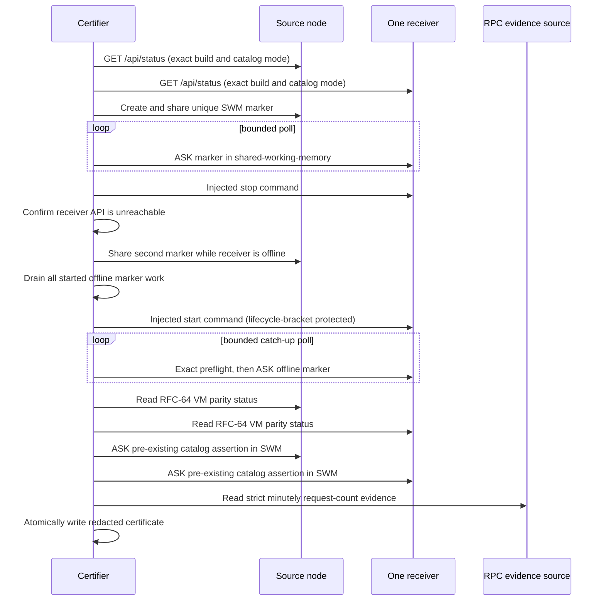

# RFC-64 remote testnet canary certification

This runner turns the local RFC-64 release gate into a bounded remote canary
check. It is intentionally host-agnostic: node URLs, canary Context Graphs,
and optional lifecycle commands come from a strict JSON configuration. Nothing
in this directory names or connects to a deployed node by default.

The runner fails closed. `PASS` means every configured node ran the exact
expected commit, the sync reconciler and catalog mode were active, new SWM data
propagated, one receiver caught up after a real stop/start, VM status reached
exact digest/count parity, a pre-existing catalog-owned SWM assertion remained
queryable on both nodes, authorization denials were observed, and minutely RPC
evidence was supplied. A missing lifecycle command, known-catalog SWM query,
unavailable denial API, or missing RPC evidence produces `INCOMPLETE` with a
machine-readable evidence requirement. It never turns an unperformed check
into a pass.

## Safety and artifact boundary

- Use only dedicated testnet canary Context Graphs. The SWM checks intentionally
  create small uniquely named assertions; they do not publish to VM.
- HTTP bearer values are accepted only through absolute secret-file paths.
  They are loaded in memory, never printed, and never written to an artifact.
- HTTPS is required by default. Plain HTTP must be explicitly acknowledged per
  node with `"allowTailscaleHttp": true` and is intended only for an encrypted
  tailnet path. HTTP redirects are rejected; evidence must come directly from
  the configured node origin and route.
- Lifecycle and RPC collector commands use argument arrays and `shell: false`.
  Inline authorization headers, user/password flags, secret environment
  assignments, API keys, tokens, and URL credentials are rejected.
- At most one receiver may appear in all CG scenarios. The runner stops it
  once, requires three consecutive unreachable probes, rechecks unreachability
  around every offline marker share, drains all bounded marker work, and always
  invokes exactly one recovery command through the receiver lifecycle bracket.
- Artifacts contain role aliases and opaque hashes instead of URLs, command
  arguments, secret paths, CG ids, peer ids, query text, or HTTP bodies.
- Each CG needs a read-only `vmAskSparql` assertion for a full `PASS`. Catalog
  cursor/digest parity is always checked, but without an application-level VM
  assertion the result remains `INCOMPLETE` rather than treating status alone
  as proof that VM data is queryable.
- Configured ASK evidence is restricted to a non-empty mandatory basic graph
  pattern with at least one concrete IRI or literal. Control constructs such
  as `BIND`, `OPTIONAL`, `UNION`, and tautologies such as `ASK {}` are rejected
  before any node is contacted.
- The unauthorized probe always runs without credentials; the revoked probe
  always runs as the configured node. These authentication modes are bound to
  their semantic roles during configuration validation.
- Each CG also needs a read-only `catalogSwmAskSparql` for a pre-existing asset
  represented by its catalog. The runner checks it on both source and receiver
  after the receiver restart and parity phase. This is deliberately distinct
  from the assertions created during the run: fresh marker delivery cannot
  conceal missing catalog-owned SWM. A false result fails certification.
- Catalog preflight requires `legacySyncAllowed` to be exactly `false`, so
  marker delivery cannot be attributed to a compatibility or rollback lane.
- A new run atomically writes `INCOMPLETE` before doing work, so an old `PASS`
  cannot survive a failed or interrupted attempt—including a missing or
  malformed configuration file. The config and artifact paths must be distinct;
  normalized paths, symlinks, and hard links to the same file are rejected
  before the first artifact write.
- Independent node and Context Graph checks run with a four-operation cap;
  phase ordering and the receiver stop/start critical section remain serial.



## Configuration

[`config.schema.json`](./config.schema.json) is executed by the runner as its
canonical shape contract; handwritten checks only enforce cross-reference,
normalization, and safety semantics. `domain-contract.ts` separately defines
the raw input, normalized topology, closed authentication/RPC evidence unions,
and injected dependency boundary. Every production module in this runner,
including the CLI and public facade, is checked directly from its JavaScript
source on every required test run; there are no parallel declaration stubs that
can drift from runtime behavior. A new union member or a drifted normalized
field therefore fails typechecking before execution. This minimal
shape deliberately declares the current catalog wire-denial APIs unavailable;
the resulting certificate is `INCOMPLETE` until executable read-only denial
probes are configured.

```json
{
  "schema": "dkg-rfc64-remote-canary-config-v1",
  "expectedCommit": "0123456789abcdef0123456789abcdef01234567",
  "nodes": [
    {
      "id": "source-a",
      "role": "source",
      "baseUrl": "https://source.example.invalid",
      "auth": {
        "kind": "bearer-file",
        "secretFile": "/run/secrets/dkg-source-token"
      }
    },
    {
      "id": "receiver-a",
      "role": "receiver",
      "baseUrl": "https://receiver.example.invalid",
      "auth": {
        "kind": "bearer-file",
        "secretFile": "/run/secrets/dkg-receiver-token"
      }
    }
  ],
  "contextGraphs": [
    {
      "id": "testnet-canary-context-graph",
      "expectedMode": "catalog",
      "sourceNodeId": "source-a",
      "receiverNodeId": "receiver-a",
      "vmAskSparql": "ASK { <urn:known:vm-subject> ?p ?o }",
      "catalogSwmAskSparql": "ASK { <urn:known:catalog-swm-subject> ?p ?o }"
    }
  ],
  "lifecycle": {
    "receiverNodeId": "receiver-a",
    "stop": { "argv": ["node-lifecycle-wrapper", "stop", "receiver-a"] },
    "start": { "argv": ["node-lifecycle-wrapper", "start", "receiver-a"] }
  },
  "authorizationChecks": {
    "unauthorized": {
      "kind": "not-exposed",
      "reasonCode": "catalog-protocol-api-not-exposed"
    },
    "revoked": {
      "kind": "not-exposed",
      "reasonCode": "revocation-api-not-exposed"
    }
  },
  "rpcUsage": {
    "kind": "evidence-file",
    "path": "/tmp/redacted-rpc-minutes.json",
    "minimumSamples": 3
  }
}
```

The lifecycle wrapper is operator supplied. It must target only the configured
receiver and use an SSH agent or credential file outside the JSON; the runner
does not accept an environment block or inline credential. An HTTP denial
probe, when a read-only daemon surface exists, accepts only `GET` or
`POST /api/query` and only 401/403/404 as denial outcomes. Every accepted denial
must include a configured RFC-64-specific response code. A 404 additionally
requires `notFoundControlNodeId`; the same request must succeed with that
control node's bearer credential, preventing a misspelled route from certifying
a denial. Previously committed
local data remaining queryable after revocation is not itself a denial failure:
revocation is expected to block subsequent network reads, not erase history.

## RPC evidence

The daemon emits raw provider-billing request counts in minutely `rpc_usage`
telemetry. Export only the count fields into the schema in
[`rpc-usage-evidence.schema.json`](./rpc-usage-evidence.schema.json):

```json
{
  "schema": "dkg-rpc-usage-minutes-v1",
  "scope": "certified-cohort",
  "expectedCommit": "0123456789abcdef0123456789abcdef01234567",
  "cohortRef": "cohort:0123456789abcdef0123",
  "samples": [
    {
      "windowStartedAt": "2026-09-11T00:00:00.000Z",
      "windowEndedAt": "2026-09-11T00:01:00.000Z",
      "total": 12,
      "byMethod": { "eth_blockNumber": 2, "eth_call": 10 }
    }
  ]
}
```

`rpcUsage.kind` may be:

- `evidence-file`: read the strict redacted JSON above;
- `command`: execute a no-shell command whose stdout is exactly that JSON;
- `required`: perform no collection and return `INCOMPLETE` with the schema
  that must be supplied.

Each sample must span 45–75 seconds, windows may not overlap, every count must
be a non-negative safe integer, and `total` must equal `byMethod` exactly. The
commit and derived cohort reference must match the run. The latest sample must
overlap or end no more than five minutes before the run starts, and samples may
not extend more than one minute beyond the observation time. The certificate
retains only the cohort reference and window bounds for auditability. Counts
must be aggregated across the complete certified cohort. Provider URLs and
account metadata are not accepted by the evidence schema.

## Run

Use Node 22. Dry-run performs strict configuration validation and writes a
redacted plan without reading secrets, opening a network connection, or
executing a command.

```sh
pnpm devnet:rfc64-remote-canary -- \
  --config /absolute/path/to/canary.json \
  --artifact /absolute/path/to/certificate.json \
  --dry-run
```

Remove `--dry-run` only in an approved testnet canary window. Exit codes are
`0` for `PASS`/`DRY_RUN`, `2` for `INCOMPLETE`, and `1` for `FAIL`.
