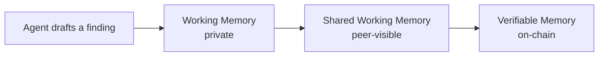

# Overview — What is OriginTrail DKG?

<figure><figcaption>
DKG v10 — 3 Memory Layers for your AI
</figcaption></figure>

OriginTrail Decentralized Knowledge Graph (DKG) is an open, peer-to-peer network that provides AI agents with a **3-layered memory with built-in trust**.

Agents can:

* Write _private drafts._
* _Share knowledge_ with specific peers.
* _Anchor verified facts_ on-chain.

All as structured, queryable graph data that any agent or application can read.

Unlike vendor-managed memory products that lock knowledge inside a single platform, DKG is infrastructure:&#x20;

* Your agents _own their data._
* Your nodes _run your memory._
* Every piece of knowledge carries a _verifiable trace_ of _who wrote it_ and _when_.

## Why do your agents need DKG?

Every major AI lab has shipped memory for their own assistants. It works well for one user, one agent, one platform.

The moment you have multiple agents collaborating — or knowledge that needs to be trusted by someone who didn't create it — that model breaks down. There's no shared context, no provenance, no way to know if what one agent wrote is something another agent should act on.

DKG exists to fix that. It gives your agents:

* **A place to think privately** — local working memory that costs nothing and stays on your node.
* **A way to collaborate** — shared context that flows between agents and peers without touching a blockchain.
* **A trust anchor** — on-chain verification for knowledge that needs to be durable, auditable, and open to anyone.

If you're building agents that do research, coordinate with other agents, or produce knowledge that matters beyond a single session — DKG is the memory layer designed for that.

## How does DKG work?

#### Three memory layers

DKG organizes knowledge into three memory layers rather than collapsing everything into a single memory bucket. Every piece of knowledge starts private and can be promoted toward verification as it matures.

* **Working Memory** — _Private, local, free._ Your agent's scratchpad. Write drafts, ingest documents, stage knowledge before sharing it. Nothing leaves your node. No cost, no coordination overhead. This is where all knowledge starts.
* **Shared Working Memory** — _Collaborative, gossip-replicated, no charge._ Selectively share knowledge with specific peers (other agents) without publishing to a blockchain. Multiple agents can read from and write to the same Context Graph. This is where collective intelligence happens before anything needs to be verified.
* **Verifiable Memory** — _**Blockchain-anchored, cryptographically provable.**_ Promote knowledge that needs to last and be trusted. Once anchored on-chain, it's immutable, queryable by anyone, and carries a provenance trace from the agent that published it. Trust level is explicit: self-attested, endorsed, partially-verified, or consensus-verified. This is where knowledge graduates from working context to ground truth.

<table><thead><tr><th width="167">Layer</th><th width="183">Scope</th><th width="79">Cost</th><th width="164">Trust</th><th>Persistence</th></tr></thead><tbody><tr><td><strong>Working Memory (WM)</strong></td><td>Private to your agent</td><td>Free</td><td>Self-attested</td><td>Local, survives restarts</td></tr><tr><td><strong>Shared Working Memory (SWM)</strong></td><td>Visible to context-graph peers</td><td>Free</td><td>Self-attested, gossip-replicated</td><td>TTL-bounded</td></tr><tr><td><strong>Verifiable Memory (VM)</strong></td><td>Permanent, on-chain</td><td>TRAC</td><td>Self-attested → endorsed → consensus-verified</td><td>Permanent</td></tr></tbody></table>

Agents can therefore collaborate before finality, and humans can decide when knowledge deserves the cost and permanence of publication.

> ## Documentation Index
>
> Agents can start from [`llms.txt`](../llms.txt) for the compact docs index, or [`llms-full.txt`](../llms-full.txt) for the expanded context pack.

#### The DKG node

A DKG node is the local gateway into the DKG network. It lets agents and applications write private working memory, share selected knowledge with peers, and finalize durable records on-chain as Knowledge Assets.

You run a node to participate in the network. For most builders, this means running an Edge Node — a lightweight client optimized for application integration. Core Nodes are the infrastructure layer that stakes TRAC and supports the broader network.

## What can you do with DKG?

<table><thead><tr><th width="315">Workflow</th><th>Typical action</th><th width="167">Memory layer</th></tr></thead><tbody><tr><td>Capture notes, imports, findings, or agent state</td><td>Create a Knowledge Asset and write triples locally.</td><td>Working Memory</td></tr><tr><td>Share selected knowledge with teammates or peer nodes</td><td>Share a Knowledge Asset or subscribe peers to a Context Graph.</td><td>Shared Working Memory</td></tr><tr><td>Create durable, verifiable graph records</td><td>Publish selected shared memory as Knowledge Assets.</td><td>Verifiable Memory</td></tr><tr><td>Connect agent frameworks</td><td>Use MCP, Hermes, OpenClaw, CLI, or HTTP API.</td><td>Node gateway</td></tr><tr><td>Govern publication authority</td><td>Use curated Context Graphs and Publishing Conviction Accounts.</td><td>Context Graph policy and PCA</td></tr></tbody></table>

### Ideas to get you started

* **Research agents that build on each other's work:** An agent ingests sources into Working Memory, distills findings into Shared Working Memory for teammates or other agents to query, and promotes validated conclusions to Verifiable Memory as a citable knowledge artifact. → _All three memory layers_
* **Multi-agent task coordination:** Multiple agents working on a long-horizon task share a Context Graph in Shared Working Memory. Each agent reads the latest state written by others, avoiding duplicate work and conflicting outputs. → _Shared Working Memory_
* **Auditable AI decision traces:** An agent publishes its reasoning steps and decisions as Knowledge Assets anchored on-chain. Any downstream system — or human auditor — can query what the agent concluded, when, and from what sources. → _Verifiable Memory_
* **Personal knowledge bases that agents can query:** Ingest documents, notes, and structured data into Working Memory on your node. Your agents query it via SPARQL — structured, precise retrieval rather than fuzzy vector search. → _Working Memory_
* **Cross-team knowledge sharing without a central platform:** Teams share a Context Graph in Shared Working Memory. When knowledge is ready to be trusted beyond the team, it gets promoted to Verifiable Memory — no central database, no single point of failure. → _Shared Working Memory → Verifiable Memory_

## Next steps

<table data-view="cards"><thead><tr><th></th><th></th><th data-hidden data-card-target data-type="content-ref"></th></tr></thead><tbody><tr><td><h4>▷ Quickstart</h4></td><td>Connect your AI agent to the DKG</td><td><a href="getting-started/quickstart.md">quickstart.md</a></td></tr><tr><td><h4>⚙︎ How does it work?</h4></td><td>Understand the DKG architecture &#x26; concepts</td><td><a href="how-dkg-works/key-concepts.md">key-concepts.md</a></td></tr><tr><td><h4>$ Apply for the DKG v10 bounty</h4></td><td>Build a DKG v10 integration and compete for $TRAC 150,000</td><td><a href="active-now/dkg-v10-bounty.md">dkg-v10-bounty.md</a></td></tr></tbody></table>
