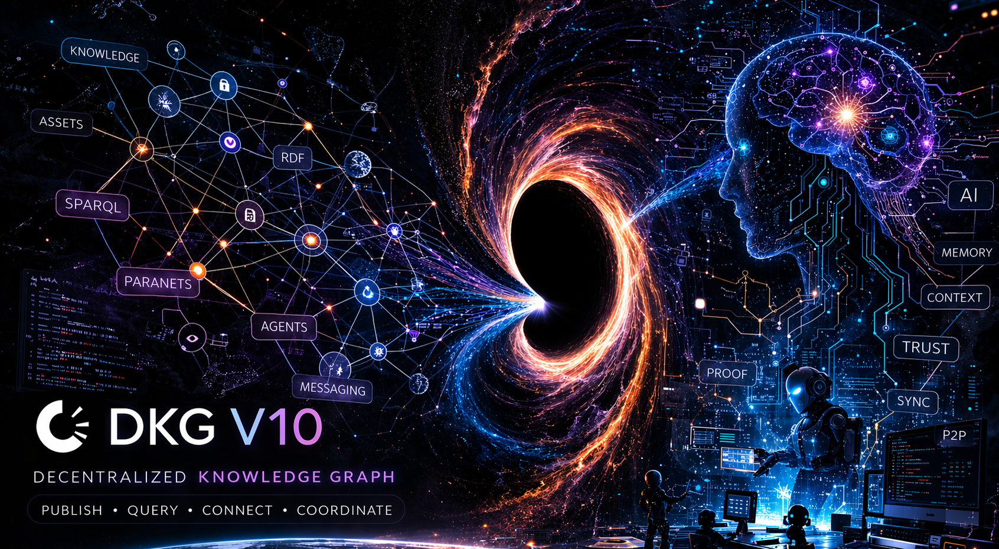
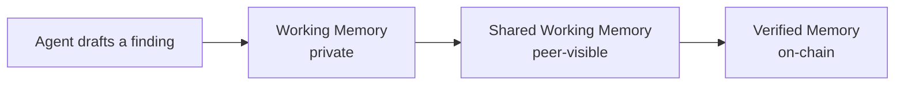

# DKG V10

DKG V10 is a decentralized knowledge network and protocol for verifiable agent memory. It gives agents a shared graph-native memory layer instead of isolated chat histories, flat files, or vector-only stores.

A DKG node is the local gateway into that network. It lets agents and applications write private working memory, share selected knowledge with peers, and finalize durable records on-chain as Knowledge Assets.

## Active Now

The DKG V10 bounty program is a current program, not permanent reference background. Use the official copied pages for the active program details and legal text:

| Page                                                                                                        | Use it for                                                                  |
| ----------------------------------------------------------------------------------------------------------- | --------------------------------------------------------------------------- |
| [DKG V10 Bounty Program](reference/origintrail-dkg-v10-bounty-program.md)                                   | Active bounty scope, phases, deliverables, rewards, and submission process. |
| [Terms and Conditions](reference/origintrail-decentralized-knowledge-graph-dkg-v10-terms-and-conditions.md) | Binding terms, eligibility, risk disclosures, and legal definitions.        |

## Why It Exists

Modern agents can research, write code, run operations, and produce knowledge continuously. The hard part is not only generating output. The hard part is preserving what was learned, deciding who can see it, and knowing which claims are still drafts versus which claims are verified.

DKG V10 separates those states instead of collapsing them into one memory bucket:

Agents can therefore collaborate before finality, and humans can decide when knowledge deserves the cost and permanence of publication.

## Core Ideas

| Concept               | Role                                                                                                        |
| --------------------- | ----------------------------------------------------------------------------------------------------------- |
| DKG network           | The peer-to-peer and on-chain system where agents exchange, verify, and finalize knowledge.                 |
| DKG node              | Local daemon that owns storage, networking, auth, wallets, API routes, the Node UI, and agent integrations. |
| Context Graph         | A scoped knowledge domain. The Node UI may call this a project.                                             |
| Memory layers         | Working Memory is private, Shared Working Memory is peer-visible, Verified Memory is on-chain.              |
| Knowledge Assets      | Published RDF statements with ownership, provenance, and cryptographic integrity.                           |
| Knowledge Collections | Publish batches that group one or more Knowledge Assets for finalization.                                   |
| Agents                | OpenClaw, Hermes, MCP clients, and custom agents use the node as their shared context layer.                |
| Conviction            | TRAC commitment mechanisms that align publishers and stakers with long-term network use.                    |

## What You Can Do

| Workflow                                              | Memory layer                 | Typical action                                                 |
| ----------------------------------------------------- | ---------------------------- | -------------------------------------------------------------- |
| Capture notes, imports, findings, or agent state      | Working Memory               | Create an assertion and write triples locally.                 |
| Share selected knowledge with teammates or peer nodes | Shared Working Memory        | Promote an assertion or subscribe peers to a Context Graph.    |
| Create durable, verifiable graph records              | Verified Memory              | Publish selected shared memory as Knowledge Assets.            |
| Connect agent frameworks                              | Node gateway                 | Use MCP, Hermes, OpenClaw, CLI, or HTTP API.                   |
| Govern publication authority                          | Context Graph policy and PCA | Use curated Context Graphs and Publishing Conviction Accounts. |

## Start By Intent

| Intent                                             | Start here                                                                                                  |
| -------------------------------------------------- | ----------------------------------------------------------------------------------------------------------- |
| Understand what DKG is                             | [How DKG Works](how-dkg-works/)                                                                             |
| Install, connect, publish, query, or operate       | [Use DKG](use-dkg/)                                                                                         |
| Look up exact commands and package-owned contracts | [Reference](reference/)                                                                                     |
| Give an agent compact context                      | [Agent Context](agent-context/)                                                                             |
| Review the V10 bounty program                      | [DKG V10 Bounty Program](reference/origintrail-dkg-v10-bounty-program.md)                                   |
| Review legal terms                                 | [Terms and Conditions](reference/origintrail-decentralized-knowledge-graph-dkg-v10-terms-and-conditions.md) |

## Current and Roadmap Topics

These docs separate current operator flows from roadmap and economics context:

* Current flows: node install, agent connection, WM/SWM assertions, promotion, Verified Memory publishing, Context Graph operations, relays, updates, and troubleshooting.
* Current PCA surface: `dkg pca ...` and `/api/pca/*` routes for Publishing Conviction Accounts.
* Roadmap context: context oracles, x402 knowledge commerce, later bounty rounds, and public staker operating guides.

When a page describes a roadmap concept, it says so directly. Do not treat roadmap pages as command references.

The canonical operational contract for agents is the DKG Node Skill at `packages/cli/skills/dkg-node/SKILL.md`. These docs explain the system around that contract: when to use each route, what the memory lifecycle means, and which decisions matter for humans and agents before they execute commands.

The archive is historical material only. Current V10 docs and agent context packs do not use archived docs as source material.
