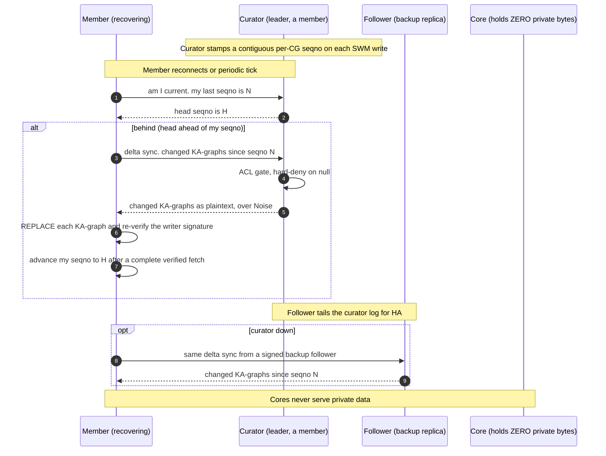

# OT-RFC-49 — SWM Recovery, Explained

*A readable companion to `OT-RFC-49-RC18-MASTER-PLAN.md`. Where the master plan is the detailed engineering spec, this is the "what and why," structured for understanding. Date: 2026-06-14.*

> **Status:** design proposal for the rc18 WS-0 recovery layer — not yet approved-to-build. Open problems tracked in §6; the recovery MVP (WS-0.0–0.3) is the merge-first slice, failover/provenance/tombstones/leader-pick are the net-new tail.

---

## 1. TL;DR

OT-RFC-49 strips core nodes of all private data: for a private context graph (CG), **cores hold zero private bytes** — they host and prove only a small public catalog. The private working memory (**SWM**) then lives only on **member** nodes, who must keep it alive and recoverable among themselves.

The recovery design is **curator-as-leader** (single-leader / primary-backup replication, *not* peer consensus):

- The **curator** (the CG owner's node — a member, never a core) is the **authoritative SWM replica**.
- It maintains a **contiguous per-CG sequence number** over the SWM writes it observes — an off-chain ordering oracle. It plays the role VM gets from the chain, but where VM's oracle is the **per-KA on-chain merkle root** (`getLatestMerkleRoot(kaId)`) — recomputable and chain-verifiable — the curator-seqno is a bare off-chain counter with no such anchor (see §5). *(Note: there is no on-chain "batchId" ordinal or "batch" — that's dead KC-legacy; V10 is strictly one merkle root per KA.)*
- A behind member **delta-syncs** "give me the changed knowledge-asset graphs since my sequence number N" — the *same shape* as VM's chain delta-sync — and applies them by **REPLACE** (not the corrupting blind-union the code does today).
- HA via 1–2 **follower** replicas; failover to a follower if the curator is down.

It is **simpler than the alternatives** (multi-master anti-entropy, or a per-root digest manifest) because it *names* an ordering authority instead of trying to synthesize one. It is a **clean fit for the enterprise / trusted-curator target** (DMaaST, HOLOS), where "trust the curator + it's always-on" is the deployment model, not a flaw. Its open problems split cleanly: the **trust** ones (per-write provenance, the no-curator edge case) are answered by that deployment; the **availability** ones (automatic failover, slow-vs-down detection) are still owed engineering, not dissolved by trust (see §6).

---

## 2. The problem

The strip removes cores as the custodian of private data. That creates two problems members must now solve themselves:

1. **Custody.** Private SWM lives only on members. If a member falls behind (offline, missed gossip, rejoined after a membership change), it must recover the current state from another member — there is no core backstop anymore.

2. **Convergence detection — the hard one.** For durable data (**VM**), the chain is a global, trustless oracle: a node reads each KA's latest on-chain merkle root (`getLatestMerkleRoot(kaId)`), compares to its own materialized root, and re-pulls any stale KA. "Am I current?" has a definitive, verifiable answer — *per KA*. **SWM has no such oracle** — it is mutable, off-chain working memory. So "am I current?" is unanswerable in absolute terms, only relative to peers who can disagree.

On top of that, three traps the code surfaces:
- **Recovery corrupts today.** The sync path applies pulled rows as a blind triple-**union**, so re-syncing `status=v2` into a store holding `v1` leaves *both* (`{v1, v2}`) — permanent corruption of any single-valued property.
- **Full-state transfer doesn't scale.** Re-pulling the whole SWM every reconcile tick is expensive for large working sets.
- **Multi-master is genuinely hard.** Two writers, no global order, no tiebreak, "stale source overwrites newer" oscillation, and a per-unit reconciliation manifest that doesn't scale to millions of units.

---

## 3. The solution (high level)

**Don't try to invent an oracle the chain doesn't give SWM — name a leader and replicate from it.** Reliable mutable-state systems (Postgres streaming replication, Kafka leader-per-partition) are leader-based, not consensus-based. The CG already has a natural, chain-resolvable leader: the **curator**.

Three moving parts:

1. **Leader-log.** The curator stamps a **monotonic, contiguous per-CG sequence number** on each SWM write it observes (its own writes, and writes it ingests from members over gossip). Because it is the single allocator, the sequence is dense `1..N` with no holes — exactly the gap-safety property delta-sync needs.

2. **Delta-sync (a "since N" cursor, curator-oracle).** A behind member asks the curator (or a follower): *"give me the knowledge-asset graphs changed since my sequence number N."* "Am I current?" becomes a single integer compare (`myLast == curatorHead`). This reuses the existing sync transport (the `sinceBatchId`-shaped delta wire). *Honesty note: that wire's `dkg:batchId` predicate is actually the kaId, and the durable delta path is currently dormant (durable sync full-scans today) — we reuse its **wire shape**, not a live VM "batch delta," which doesn't exist. VM's real freshness oracle is per-KA `getLatestMerkleRoot(kaId)`.*

3. **REPLACE apply.** The returned changed graphs are applied by **per-graph REPLACE** (clear + reinsert), not union — the fix for the corruption above. A delta is just a smaller set of graphs to replace.

Plus **HA**: 1–2 follower members tail the curator's log; if the curator is unreachable, members recover from a signed backup follower. The unit throughout is the **knowledge-asset graph** (`…/_shared_memory/{author}/{number}`) — a named graph that can hold many entities (one Obsidian file = many entities = one KA), *not* the legacy per-entity "rootEntity."

---

## 4. Why does this scale?

**Delta-from-leader.** A member pulls only `head − myLast` changed graphs — it never enumerates the full state, and never exchanges a per-unit digest manifest (the approach that would have meant shipping a hash for *every* unit, dedup and all, scaling with total size). The cost is proportional to **what changed**, not to total state — the same scaling property that makes VM's chain delta-sync work, now applied to SWM.

Two honest caveats:
- **The write side serializes through the curator.** Every write the curator observes advances the dense sequence under one per-CG lock — a bottleneck the peer mesh didn't have. Put a number on it before shipping: the target has to hold for a streaming-ingest CG (EPCIS / IoT events into SWM at ~10²–10³ writes/s), where seqno-allocate + persist-in-the-same-batch under one lock could become the ceiling — and it *compounds* with the existing SWM reconciler/scan cost on a large store (a separate, measured idle-CPU driver). Acceptable for the document-collaboration target; **must be measured for the high-ingest target.**
- **Deletions need explicit tombstones — a first-class item, not a caveat.** A "since seqno N" delta surfaces adds and updates, but REPLACE never removes a graph the source merely *omits* — so a deleted KA persists **forever** on behind members. For mutable working memory, delete is not optional; it needs an explicit tombstone op in the log (WS-0.10), not a periodic full pass bolted on later.

---

## 5. Relationship to VM — VM is *property*, SWM is *working memory*

The two aren't the same data under different trust — they're different **kinds of thing**, for different jobs. SWM is shared, mutable **working memory**: low-latency scratch space among members who already trust the curator. VM is owned, governed, time-proven **property**: an on-chain asset with an owner, a history, and economic backing. The leader-based recovery design makes SWM *resemble* VM in **wire shape** (a "since N" delta), but it deliberately does **not** give SWM VM's trust shape or its powers — and that gap is the point.

**The recovery-relevant comparison (trust + convergence):**

| | **SWM** (curator-as-leader) | **VM** (on-chain) |
|---|---|---|
| Convergence oracle | curator sequence — **off-chain, per-CG** monotonic counter | **per-KA on-chain merkle root** — `getLatestMerkleRoot(kaId)`, one root-list *per KA* |
| Truth anchor behind it | **none** — the seqno is a bare counter | the **per-KA merkle root itself** (recomputable + chain-verifiable) |
| "Am I current?" | compare my seqno to the curator's head | compare my local root to the chain's `getLatestMerkleRoot` |
| Verifiability | **trust the curator** (it can lie; no anchor) | **trustless** — chain-verifiable regardless of who served it |
| Replication / availability | leader → members (+ followers); single-curator dependency | served by **any** staked core via the sharding table + ACK quorum |
| Durability | survives while a holder (curator/follower) is online | permanent, consensus-backed |
| Mutability | mutable working set, low latency | append-only durable record |
| Unit | knowledge-asset graph `(author, number)` | knowledge asset (one `kaId`, one merkle-root list) |

**The powers VM has that SWM fundamentally cannot — beyond verifiability.** Each is contract-enforced in V10 and has no SWM analogue:

| Power | VM (on-chain) | SWM |
|---|---|---|
| **Ownership of the record** | A KA *is* an ERC-721 (`tokenId == kaId`). **Only `ownerOf(kaId)` can update it** (`KnowledgeAssetsLifecycle._executeUpdateCore` → reverts `NotKnowledgeAssetOwner`). Update authority is a **transferable token right** — "to change who may update, transfer the NFT." | No per-record ownership. The curator-leader can mutate or withhold any record at will. |
| **Immutable, timestamped history** | Every update **appends** `MerkleRoot{publisher, root, timestamp}` to a monotonic on-chain array (+ per-version author). You can **prove what the data was at any past block** (`getMerkleRootByIndex`). | Last-writer-wins gossip — no retained prior state, no temporal proof. |
| **Economic security** | Serving is backed by **conviction-locked TRAC stake**; epoch reward is **zero without proof-of-serve** (`nodeScore == 0 → reward 0`). Not serving is *costly*. | No stake, no lock, no slashing. Not serving is **free**. |
| **On-chain access/curation policy** | `accessPolicy`/`publishPolicy` + curator authority are contract-enforced (`isAuthorizedPublisher` reverts `UnauthorizedPublisher`). | Access is the curator's **off-chain** ACL — unauditable, unenforceable by consensus. |
| **Non-repudiation across time** | EIP-712 author attestation recovered + persisted **per version, forever** (`merkleRootAuthors`). | Authorship is an off-chain claim with no consensus anchor. |
| **Stable composability** | One canonical UAL `did:dkg:{chain}/{contract}/{kaId}`, bound to a deterministic owner — other assets can link to it safely. | `_shared_memory/{author}/{n}` is a gossip path — no on-chain identity, no stable ownership. |

**The boundary that makes this clean: trust domains.** SWM lives **inside one trust domain** — the curator and the members who already trust it (an enterprise, or a consortium that trusts the curator). "Trust the curator" is *correct* there because everyone in the domain already does. VM lives **across trust domains** — owned, verifiable, and available to a party who trusts *no one*: the regulator, the downstream brand, the auditor, the counterparty. That is exactly where "trust the curator" fails and only VM works.

**So the promotion rule is sharper than "durable/verifiable":** promote SWM → VM the moment data must become **owned, historical, or cross-trust-domain.** An EU-DPP record is all three at once — owned by the manufacturer, provable *as-of-shipment-date* years later, and audited by a regulator who trusts nobody. SWM cannot do any of the three; VM is the only answer. That promotion boundary is also what keeps SWM bounded and this recovery design tractable.

**What SWM gives that VM doesn't:** cheap, low-latency, mutable working memory without an on-chain write per change. That's its job — and a real one. The design simply stops treating SWM as a substitute for VM; it's the layer *below* it.

---

## 6. Downsides / critique

The design is directionally sound (leader-based beats multi-master for mutable state), but an adversarial review found the first-pass write-up *oversold* it. The honest open problems:

1. **No per-write provenance on the recovery path (the biggest gap) — but it's retention, not invention.** The signing already exists: every SWM write *is* EIP-191-signed over the gossip payload (`dkg-agent-crypto.ts:2442`) and *is* cryptographically verified on the live-gossip path (`ethers.verifyMessage` → recovered ∈ the CG agent-gate, `workspace-handler.ts:1439`). The gap is that the signature is **discarded right after that verify** — it never becomes a triple; only the verified signer's DID is persisted, as a self-asserted `prov:wasAttributedTo` literal with no crypto binding. So the **recovery** path (`applySwmRecovery`) has nothing to re-verify and admits data **purely structurally** (`rdf:type dkg:WorkspaceOperation` + `dkg:publishedAt`), reading "creator" from the `dkg:publisherPeerId` literal — a compromised/forked curator can omit, reorder, or misattribute on recovery undetected. **Closing it is retain-and-reuse:** persist the signature (+ its signed-digest inputs) as `_shared_memory_meta` triples at the apply seam, and call the *existing* verify routine inside `applySwmRecovery`. The crypto is already written; the net-new is *retention + wiring*, not a new primitive. (Subtlety: the signature covers the whole payload, so persist the signed-payload digest and on recovery re-check that the recovered triples reconstruct it.)
2. **Curator is a soft single-point-of-failure + an always-on assumption.** Reads survive curator loss (followers serve), but write-ordering stalls and "am I current?" is unanswerable until failover.
3. **No automatic failover in V10.** There is no failure detector — a *slow* curator is indistinguishable from a *down* one, and the only "down" signal is a dial failure (whose fallback pulls from untrusted arbitrary peers, defeating the oracle). V10 is realistically **manual failover**.
4. **Deterministic leader pick is unsolved.** The current curator resolver is node-relative and falls back to an unordered query, so two members can elect *different* leaders. A globally deterministic pick must be built.
5. **Foreign/peer-discovered CGs may have no resolvable curator** — for a CG you didn't create and whose curator triple you never received, there is no leader, and recovery falls back to the best-effort mesh. State this as a real boundary.
6. **Split-brain heal is incomplete — and it contradicts WS-0.6.** On partition heal, "curator log is authoritative" only repairs the graphs the curator's delta touches; forked writes a follower gossiped to other members can survive, and a follower-acked "durable" write can be **silently lost**. That directly contradicts WS-0.6's promise of "never silent loss." One of them has to give: either split-brain heal must *reconcile* forked-but-acked writes (not just discard the fork), or WS-0.6's guarantee must be downgraded to "acked-by-the-then-leader" — which a partition can revoke.
7. **No chain anchor (fundamental).** Unchanged by any model — the curator sequence is a bare integer.

**Why it's still the right call — but don't let the deployment story paper over two different problems.** The *trust* weaknesses (trust the curator, no per-write anchor) are genuinely dissolved by the target deployment: an enterprise runs its own curator on its own infra, so "trust the curator" is *correct* — that's the DMaaST/HOLOS model, not a flaw. The *availability* weaknesses (soft SPOF, no failure detector, manual failover) are **not** dissolved by trusting your own infra — your own curator still goes down, and "a slow curator is indistinguishable from a down one" is a real outage mode regardless of trust; those are answered only by failover engineering, which V10 doesn't have (problem 3). So keep the two ledgers separate: **trust → answered by deployment; availability → still owed.** Either way, the read-delta + deleting the multi-master machinery is an immediate, unconditional win.

---

## 7. Sequence diagram

---

## 8. Detailed specification

The recovery layer (WS-0), curator-as-leader. **Reuse** = existing code; **net-new** flagged explicitly. Full file:line detail lives in `OT-RFC-49-RC18-MASTER-PLAN.md` §10 / WS-0.

| WS | What | Reuse vs net-new | Size |
|---|---|---|---|
| **WS-0.0** | **Recovery apply = REPLACE per KA-graph, not blind union.** `applySwmRecovery` (clear + reinsert per graph) — built + tested. One change: key on the whole KA-graph `(author, number)`, not per-rootEntity. Hydrate the ownership cache (built — fixes a Rule-4 mis-arbitration bug). **Trigger discipline (M1):** REPLACE fires **only on an explicit recovery from one chosen authoritative peer** (`recoverContextGraphSwmFromPeer`) — *never* blanket on-connect/reconciler. Those pull the same private CG from arbitrary, possibly-stale, **concurrent** peers (`sync-on-connect.ts:125`; the `Promise.all` reconciler at `dkg-agent-lifecycle.ts:3195`), so a blind REPLACE there races delete/insert across sources and can clobber a newer local write (reachable even under Rule-4: A owns R=v2, offline B still serves v1, A pulls B → loses v2). The on-connect/reconciler **union path stays as-is**; its corruption-on-update is a *pre-existing* bug whose correct fix is the **M2 leader-pull** (delta from the one authoritative seqno), not blind REPLACE on every sync. | mostly **built**; unit narrowing | S |
| **WS-0.1** | **Leader-log.** Curator stamps a contiguous per-CG seqno at the single lock-guarded write seam (`_shareImpl → store.insert`), persisted as a `dkg:curatorSeqno` meta triple in the same insert batch. Allocate only on `applied:true` (no phantom gaps). Namespace by curator epoch (so a promoted leader's seqno-1 can't collide). | **net-new** (core new mechanism); reuse host-store *shape* | M |
| **WS-0.2** | **Delta-sync responder + requester.** Mirror VM's `sinceBatchId` as a parallel `sinceCuratorSeqno`: responder filters changed KA-graphs by `seqno > since` (latest-per-graph), AND-ed with the TTL admission; requester threads the watermark for the SWM data path and advances it only after a complete verified fetch. | **reuse** the entire delta transport/parse/checkpoint machinery; small net-new field | S/M |
| **WS-0.3** | **ACL hard-deny gate (#1 security item).** Plaintext serve makes the ACL the only cleartext barrier: authorize against the agent-gate, **hard-deny on null** (today it widens), from a **fresh** authenticated read (not the poisonable subscription cache). | `isMemberRecoveryAuthorized` **built**; wiring net-new | S |
| **WS-0.4** | **Follower replication + failover.** Followers tail the curator log (delta-sync on a tight interval). Failover via **signed** `dkg:curatorBackup` peer-ids in `_meta`. Split-brain heal = forked follower discards its fork and re-follows. V10: static backup ordering, **no live election**. | reuse delta path; **net-new** failover + deterministic-leader-pick | M/L |
| **WS-0.5** | **Per-write provenance = persist + re-verify the signature that already exists.** SWM writes are already EIP-191-signed and verified on live gossip (`workspace-handler.ts:1439`); the signature is simply *discarded* (never a triple). Net-new is **retention**: persist the signature + signed-digest inputs as `_shared_memory_meta` triples at the apply seam, then call the *existing* `ethers.verifyMessage` inside `applySwmRecovery` (today 100% structural). Reuses the signing + verify code wholesale. | **reuse** crypto; **net-new** retention/wiring | S/M |
| **WS-0.6** | **Durability gate = "leader acked"** (+ optional ≥1 follower-ack). Reuses the reliable-send + outbox + applied-attesting-ack convention. Leader-offline window surfaces as typed "not-yet-durable" — never silent loss, **except** the split-brain case (§6 problem 6): a follower-acked write a partition orphans can still be lost, so either heal reconciles forked-acked writes or this guarantee is "acked-by-the-then-leader." | **reuse** + net-new split-brain reconcile | M |
| **WS-0.7–0.9** | Leader discovery (`resolveCuratorPeerId` — exists), member-side materialized state (exists), gossip-off coupling (keep gossip on until the strip). | **reuse** | S |
| **WS-0.10** | **Tombstones (deletion).** An explicit delete op in the leader-log — a tombstone marker (`dkg:tombstone` + the seqno, or a tombstone KA-graph) so REPLACE-by-delta can actually *remove* a KA on behind members. Without it, delete never propagates (§4). | **net-new** | S/M |

**Dropped (superseded, not deferred):** `frontier.ts`, `frontier-beacon.ts`, `recovery-plan.ts`, and the digest-manifest design — all were scaffolding to *invent or distribute* an oracle the curator now *is*. Cleanly removable.

**Honest estimate:** read-delta MVP ~2–3 weeks (mostly reuse); failover + provenance + tombstones + deterministic-leader are the net-new cost (~1–1.5 weeks, the part the first pass under-counted). Lower convergence risk than the frontier model; the residual concentrates on leader-election/failover/trust — better-understood problems, not free ones. The overall rc18 envelope (contract half + strip + testnet bake) is unchanged.
