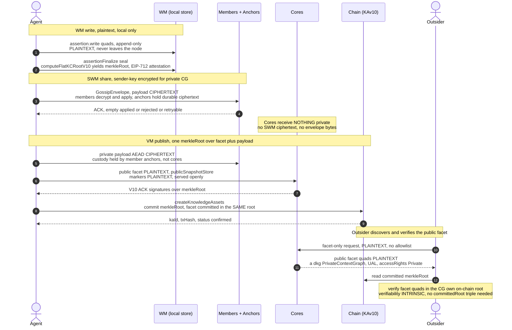

# OT-RFC-49 — The Flow of Triples: WM → SWM → VM, and the Combined Public Facet

## 1. Purpose & audience

This document is for OriginTrail engineers working on the DKG V10 publish/sync stack. It explains the three memory layers a triple passes through — Working Memory (WM), Shared Working Memory (SWM), and Verified Memory (VM) — grounded in the actual code paths, and then specifies the OT-RFC-49 *hosting-follows-access* end state. Under that end state a private Context Graph (CG) carries a small plaintext public facet that rides in the **same** VM publish and the **same** on-chain merkle root as its encrypted private payload; **core nodes host only that public facet**, while all private content (live SWM and the VM private payload) is held by **member anchors** — always-on member nodes per RFC-49. The document is precise about the code-grounded mechanics that carry over unchanged, and it names — in a dedicated section — exactly what the rc.17 "ciphertext strip" changes to reach this state.

## 2. The three memory layers

| Layer | What it is | Scope | Persistence | Who sees it |
|---|---|---|---|---|
| **WM** (Working Memory) | An agent's local, per-agent memory — the literal "assertion" graph, written append-only. The name says "working", but **WM is not inherently transient**: it is often a *staging* area on the way to SWM/VM, yet it is equally a permanent private store. Nothing forces promotion and there is no WM TTL, so an agent MAY keep data here forever precisely *because* it is private and never meant to leave the node. | Per-agent (`{addr}`) and per-KA, inside the owning node's own triple store. | Local named graph (`_working_memory/{addr}/{number}`, legacy `assertion/{addr}/{name}`); sealed at finalize. **No TTL, no eviction, no forced promotion** — it persists until the agent chooses to promote/publish it, or indefinitely if it never does (contrast SWM's 30-day `DEFAULT_SWM_TTL_MS`). | Only the owning node/agent. Nothing is gossiped or anchored. |
| **SWM** (Shared Working Memory) | The live collaboration layer: signed gossip envelopes carrying the WM triples, sender-key encrypted for private CGs, fanned out member-to-member. | All CG members; durable custody held by **member anchors**. | Local `_shared_memory` graph on each member; ciphertext custody on **member anchors** (TTL + byte-capped). For a private CG, **no ciphertext reaches a core**. | Members (decrypt & apply); member anchors hold the durable ciphertext; the envelope's outer metadata leaks cleartext cgId + publisher only among members and anchors. |
| **VM** (Verified Memory) | The finalized layer: a publisher batches content, computes a V10 merkle root, gathers core ACK co-signatures, and commits the root on chain. | Network-wide commitment; the canonical anchor for the KA. | On-chain KC record (`merkleRoot`); the **public facet** (plaintext) hosted on cores; the **private payload** (ciphertext) held by member anchors. | Anyone reads the on-chain root and the public facet (served openly by cores); the private payload is AEAD ciphertext gated to members and custodied by anchors. |

> **"Local/private" and "transient/permanent" are independent axes.** WM is *local* (never leaves the node unless promoted); whether its contents are transient or permanent is the agent's choice, not a property of the layer. That gives two distinct homes for data the agent never intends to share, with different trade-offs:
>
> - **Permanent private in WM** — local-only. Free, no anchoring, no proof-of-existence, no network durability: if the node's store is lost, the data is gone, and no one else can verify it ever existed. Right for an agent's private working knowledge that needs neither durability nor provability.
> - **Private in VM** — published as encrypted `privateQuads`. The content stays gated to members, but the publish anchors a `merkleRoot` on chain (provable existence + integrity) and **member anchors** hold the ciphertext (network durability). Right for private data that must also be durable or verifiable.
>
> So "I want to keep this private forever" does not force a trip through SWM/VM — but choosing WM vs VM is really a choice about *durability and provability*, not about privacy (both keep the content unshared).

## 3. The journey of a triple

**Enter WM.** A caller hits `POST /api/knowledge-assets/:name/wm/write` (`packages/cli/src/daemon/routes/knowledge-assets.ts:793`) or the atomic create+write shortcut at line 593. This calls `agent.assertion.write` (`packages/agent/src/dkg-agent.ts:1702`), which normalizes the body: a `Quad[]` is used as-is; a JSON-LD document is split via `jsonLdToQuads` into `publicQuads` + `privateQuads` (both concatenated and written); a simple `{subject,predicate,object}[]` is mapped to quads. It then delegates to `publisher.assertionWrite` (`packages/publisher/src/dkg-publisher.ts:4364`).

**Graph resolution & guard.** `assertionWrite` resolves the WM named-graph URI via `wmGraphUri` (`dkg-publisher.ts:4223`): once a kaId is minted it returns `contextGraphLayerUri(cg, MemoryLayer.WorkingMemory, addr, number, sub)` = `did:dkg:context-graph:{cg}[/{sub}]/_working_memory/{addr}/{number}`, otherwise the legacy `contextGraphAssertionUri` = `.../assertion/{addr}/{name}` (`packages/core/src/constants.ts:277`, `:261`). Every incoming triple is re-stamped with that WM graph URI — `assertionWrite` maps only `{subject,predicate,object}` and sets `graph: graphUri`, so the input's own graph field is discarded (`dkg-publisher.ts:4373-4375`). Then `rejectUserAuthoredProtocolMetadata` (`dkg-publisher.ts:343`, called at `:4378` before the store insert) runs: it throws `ReservedNamespaceError` if any quad's **subject** matches a reserved prefix — `urn:dkg:file:` or `urn:dkg:extraction:` (`packages/publisher/src/reserved-subjects.ts:4`), case-insensitive (`findReservedSubjectPrefix` lowercases, `reserved-subjects.ts:10`) — and also rejects user-authored trust-level quads. The guard inspects `q.subject` only (`dkg-publisher.ts:333`), so these URNs remain legal as **objects** (e.g. `<entity> dkg:sourceFile <urn:dkg:file:...>`).

**Store.** `store.insert(quads)` (`dkg-publisher.ts:4379`) appends to the triple store (oxigraph by default) via the `TripleStore` interface (`packages/storage/src/triple-store.ts:49`; `:48` is the interface header, and the append is performed by the adapter, not this declaration). WM is append-only: there is no delete/replace. The draft graph itself was opened earlier by `assertionCreate` (`dkg-publisher.ts:4253`), which `createGraph(wmGraphUri)` (`:4341`), wrote the lifecycle record into `_meta` (`:4343-4352`), and stamped `<wmGraphUri> dkg:memoryLayer "WM"` (`:4354-4359`). The one legitimate producer of reserved-subject rows in WM is the import-file handler (`packages/cli/src/daemon/routes/knowledge-assets-import.ts`), which writes `urn:dkg:file:{keccak256}` descriptor blocks and `urn:dkg:extraction:{uuid}` provenance (URN formats at `:1059-1060`) via a direct `agent.store.insert([...dataGraphQuads, ...metaQuads])` (`:1555`) that deliberately bypasses the guard (the bypass rationale is documented in the comment at `:1150`).

**Finalize (still WM, sealed before sharing).** `assertionFinalize` (`packages/agent/src/dkg-agent-publish.ts:1616`) reads the WM quads, filters `!isReservedSubject(q.subject) && !isTrustLevelQuad(q)` (line 1677) — the exact filter promote uses (`dkg-publisher.ts:4605-4606`), so the seal hashes the post-strip set the share/publish path will actually carry. It `skolemizeByEntity` (`:1714`), computes `computeFlatKCRoot` (aliased from `computeFlatKCRootV10`, `dkg-agent-publish.ts:107`) → `merkleRoot` (`:1733`), signs an EIP-712 `AuthorAttestation` (`buildAuthorAttestationTypedData` + `signTypedData`, `:2024`/`:2076`), and persists the seal as `_meta` triples keyed by the assertion-graph URI, plus pointer triples keyed on the lifecycle URI: `dkg:wmCurrentAssertion` (`WM_CURRENT_ASSERTION_PRED`, `:2124`), `dkg:kaId` (`KA_ID_PRED`, `:2133`), `dkg:reservedUal` (`RESERVED_UAL_PRED`, `:2139`). The `reservedKaId` is allocated **at finalize** (`:2002-2003`) and reused at mint so the on-chain kaId equals the signed id.

**Leave WM → SWM.** For collaboration, `assertionPromote` (`dkg-publisher.ts:4506`) copies the sealed content into the `_shared_memory` graph, re-applying the identical reserved-subject filter (`:4605-4607`) as defense-in-depth, and emits a gossip message. The async ingestion path instead runs `publishAsync` (`dkg-agent-publish.ts:805`): it calls `partitionPublishAsyncQuads` (`packages/agent/src/dkg-agent-helpers.ts:77`), hands public quads to `writeToWorkspace` (`dkg-agent-publish.ts:891-901`), and stores private quads in a `PrivateContentStore` (`:903-904`). `writeToWorkspace` (`dkg-publisher.ts:826`, deprecated, delegating to `share` → `_shareImpl`) serializes the public quads to N-Quads (`:907`/`:922`), wraps them in a `WorkspacePublishRequest`, inserts them into the local SWM graph (`store.insert`, `:974`), then `encodeWorkspaceGossipPayload` (`:1020`) decides encryption. For a **private** CG, `encryptWorkspacePayloadWithSenderKey` (`packages/agent/src/dkg-agent-crypto.ts:1120`, routed at `dkg-publisher.ts:1048-1058`) AEAD-encrypts the payload under a ratcheting epoch chain key minted/rotated by `createAndDistributeSwmSenderKeyEpoch` (`:1214`); the chain key is ECIES-style sealed per recipient (X25519 ephemeral-static ECDH + AEAD, `swm-sender-key.ts:163-195`) via `createSignedSwmSenderKeyPackage` (`:1788`) and sent over `PROTOCOL_SWM_SENDER_KEY`. For a **public** CG the N-Quads stay plaintext (`dkg-publisher.ts:1039`). `encodeWorkspaceGossipMessage` (`dkg-agent-crypto.ts:2355`) EOA-signs (`ethers.Wallet(...).signMessage`, `:2375`) a `GossipEnvelope` (`packages/core/src/proto/gossip-envelope.ts:31`) carrying the cleartext `contextGraphId`, sender `agentAddress`, timestamp, and the payload (`:2379-2383`). `chooseFanOutTier` (`packages/agent/src/swm/substrate-fanout.ts:197`) decides substrate (`PROTOCOL_SWM_UPDATE`, point-to-point reliable) + gossip (GossipSub mesh on the wire-hashed workspace topic). Members run `SharedMemoryHandler.handle`, verify, decrypt, and apply the N-Quads into their local SWM. For a private CG the durable custody of the encrypted envelope is held by **member anchors** — always-on member nodes that append the opaque envelope bytes to their anchor store (the same byte-backed store mechanism as `host-mode-store.ts:329`, now reached only on anchors). **No core node receives the envelope:** cores host nothing of a private CG's SWM.

**VM publish.** `_publish` (`dkg-agent-publish.ts:1173`) mints a `precomputedAttestation` over the kcMerkleRoot and resolves the encrypt-inline emitters (LU-5 single-blob `_resolveEncryptInlinePayload` at `:2650`, LU-11 chunked `_resolveEncryptInlineChunked` at `:2703`) for curated CGs only — in this codebase **curated == private** (`accessPolicy=1`), since `_resolveCuratedChainKeyContext` maps a PRIVATE on-chain CG to curated → encrypted inline (`:2515-2517`), so "curated CGs only" and "private CG" denote the same population. It then calls `this.publisher.publish(...)` (`dkg-publisher.ts:1704`, invoked from `_publish` at `:1268`). The publisher recomputes `kcMerkleRoot` via the shared `canonicalPublishPayload` (`packages/publisher/src/canonical-publish-payload.ts:24`, root at `:51` = `computeFlatKCRootV10(skolemizedPublicQuads, privateRoots)`, with `privateRoots` from `computePrivateRootV10`) using the same V10 keccak sort+dedupe tree (`V10MerkleTree`, `packages/core/src/crypto/v10-merkle.ts:28`) the finalize seal used — drift between them is exactly what the `expectedMerkleRoot` guard catches (`dkg-publisher.ts:2490-2493`). The public facet plus all other public quads land plaintext in `publicSnapshotStore` (`dkg-publisher.ts:989`, `:4816`) and are served by cores. The private payload is AEAD-encrypted and its ciphertext custody is routed to **member anchors**, not cores. It collects a hard quorum of V10 ACKs from cores (`createV10ACKProvider`, `dkg-agent.ts:1284` → `ACKCollector.collect`, `packages/publisher/src/ack-collector.ts:137`), then submits `chain.createKnowledgeAssets` (`dkg-publisher.ts:2709`), landing in `KnowledgeAssetsLifecycle.publish` (`packages/evm-module/contracts/KnowledgeAssetsLifecycle.sol:489`). The on-chain ACK digest binds `(chainid, address(this), contextGraphId, merkleRoot, kaAmount, byteSize, epochs, tokenAmount, merkleLeafCount, ciphertextChunksRoot, ciphertextChunkCount, isImmutable)` (`sol:651-666`). Status flips to `confirmed` only after a successful tx (`dkg-publisher.ts:2837`); the triple is now Verified Memory.

## 4. The combined public facet

**The combined model.** The facet floor is unioned into the publish's `publicQuads` **before** the split, at the async attach point in `publishAsync` (`dkg-agent-publish.ts:889`, just before `partitionPublishAsyncQuads`) and the corresponding sync `publish()` entry. The floor is the set `buildPublicProjection` produces minus its bridging triple: `(ual a dkg:PrivateContextGraph)`, `(ual dct:identifier UAL)`, `(ual dct:accessRights dkg:Private)` (`context-graph-public-projection.ts:96-98`), plus optional disclosure-priced tiers (`dct:publisher` `:104`, `dkg:accessService` `:107`, `dct:conformsTo` `:112`, `dkg:blindedAnchor` `:115`); IRIs in `packages/core/src/genesis.ts:243-251`. Because the facet now rides inside the CG's own committed root, the builder no longer emits a `dkg:committedRoot` floor triple — that triple existed only to bridge two separate roots, and under the combined model there is exactly one root, so it is redundant (see below).

**Same root, intrinsic verifiability.** Once the facet rides in `publicQuads`, `canonicalPublishPayload` commits it inside `kcMerkleRoot = computeFlatKCRootV10(skolemizedPublicQuads, privateRoots)` (`canonical-publish-payload.ts:51`) — the **same** merkle root that folds in the per-entity private hashes (`computePrivateRootV10`). The facet sits alongside the existing plaintext `PRIVATE_DATA_ANCHOR` markers (`packages/agent/src/dkg-agent-constants.ts:13`, inserted at `dkg-agent-helpers.ts:86-95`) that `partitionPublishAsyncQuads` already places for every gated root. Because the facet is in the CG's **own** committed root, the on-chain publish record *is* the facet's verifiability edge: there is no second KA, no separate root, and therefore **no `dkg:committedRoot` self-reference and no registry/discovery CG** are required. Verifiability of the public facet is intrinsic — it lives in the CG's own on-chain root.

**Only private quads are encrypted.** The split is unchanged: `partitionPublishAsyncQuads` separates `publicQuads` from `privateQuads` and encrypts nothing. Only `privateQuads` are folded into the root as opaque `computePrivateRootV10` hashes and shipped as AEAD ciphertext to **member anchors** (`encryptInlinePayload` for the LU-5 single-blob path, `encryptInlineChunked` for the LU-11 chunked path; emitters span `dkg-publisher.ts:1989-2017`, with the chunked emitter invoked at `:1995` and the single-blob at `:2011`; on the chunked path the chunks travel via SWM gossip rather than the ACK wire, `:2000-2002`); for private CGs the SWM gossip envelope is additionally sender-key encrypted. The public facet stays **plaintext** in `publicSnapshotStore` on cores, committed in the clear inside the same root. No private VM ciphertext reaches a core.

## 5. Sequence diagram — WM → SWM → VM

> The diagram is the target state. WM is local plaintext, the SWM share is sender-key encrypted and custodied only by member anchors (cores receive nothing private), and the VM publish commits one merkle root over the public facet (plaintext, hosted by cores) and the private payload (ciphertext, custodied by anchors). An outsider reads and verifies only the public facet, from cores plus chain.

## 6. Public vs private at each stage

| Stage | Plaintext / public | Encrypted / private | Who can read |
|---|---|---|---|
| **WM** | Everything (data quads + `_meta` bookkeeping) is plaintext in the local store; reserved-subject rows are WM/`_meta`-only. | Nothing is encrypted at WM; `privateQuads` from JSON-LD sit plaintext alongside `publicQuads`. | Only the owning node/agent (unshared). |
| **SWM** | Outer `GossipEnvelope` fields: version, type, cleartext `contextGraphId`, sender `agentAddress`, timestamp, signature; sender-key message metadata (epochId, membershipHash, messageIndex, nonce, aadHash). For a **public CG**, the N-Quads payload too. | For a **private CG**, the `WorkspacePublishRequest` payload (AEAD under ratcheting chain key); the chain key (ECIES-style sealed per recipient). | Members decrypt & apply; **member anchors** hold the durable ciphertext + see envelope metadata only. Cores see nothing of a private CG's SWM. |
| **VM** | Public quads incl. `PRIVATE_DATA_ANCHOR` markers and the public facet floor → `publicSnapshotStore` on cores, committed plaintext in `kcMerkleRoot`. The on-chain `merkleRoot` itself. | `privateQuads` as opaque `computePrivateRootV10` hashes in the root + AEAD ciphertext custodied by **member anchors**. | Anyone reads the on-chain root + public facet (cores serve it openly); private payload gated to members and held by anchors. |

## 7. Cores serve the public facet openly

Under the target, the only part of a private CG that a core touches is its public facet, and cores **serve the public-facet subgraph of a private CG openly to outsiders**, even though the rest of the CG is access-gated and never reaches a core at all. This is the facet-scoped open-serve path.

The serve gate distinguishes the facet from gated content. On the responder side, `authorizeSyncRequest` (`packages/agent/src/dkg-agent-cg-resolve.ts:779`) returns `true` for a public CG (`!isPrivateContextGraph`, `:781-782`) and, for a private CG, takes a **facet-scoped open-serve path** — it serves the bounded public-projection subgraph (the facet floor + `PRIVATE_DATA_ANCHOR` markers) without allowlist auth, while routing any request that reaches beyond the facet through `authorizePrivateSyncRequest` (`packages/agent/src/sync/auth/request-authorize.ts:46`, called at `:785`), which validates envelope/replay/signature and returns a CG-wide allow/deny boolean (`:195`). On a core, the private payload is not present to serve regardless — only the facet is hostable. On the requester side, `buildSyncRequest` (`cg-resolve.ts:701`) frames an unauthenticated **facet-only** request shape so an outsider can fetch the plaintext facet of a private CG. The classifier feeding both gates is `isPrivateContextGraph` (`:1211`). The `SyncPhase` set carries a facet-scoped phase/scope alongside `meta | snapshot | data` (`request-build.ts:3`) so the open path cannot be used to exfiltrate gated quads.

This is the post-strip serve surface: because cores stop holding private payloads at all, the public facet is the **only** part of a private CG that cores touch, so the facet-scoped open-serve path *is* the whole of what a core does for a private CG.

## 8. Relationship to current rc.17 code

The mechanics in Sections 3 and 4 — WM `assertion.write` + the reserved-subject guard + the finalize seal and its `computeFlatKCRootV10` merkleRoot; the public/private quad split via `partitionPublishAsyncQuads` where only `privateQuads` are encrypted; the single-root commit via `canonicalPublishPayload`; the on-chain ACK digest in `KnowledgeAssetsLifecycle.sol` — are present in rc.17 and carry over to the target unchanged. WM is fully unchanged. What the "ciphertext strip" changes to reach the target is bounded and named here:

1. **Cores stop running SWM host mode for private CGs.** In rc.17 a hosting core in host mode (`packages/agent/src/dkg-agent-swm-host.ts:610`) appends the raw opaque envelope bytes to the `SwmHostModeStore` (`packages/agent/src/swm/host-mode-store.ts:329`). The strip removes the core-side host-mode ciphertext path; durable SWM custody for private CGs is taken over by **member anchors** using the same byte-backed store mechanism, now reached only on anchor nodes. After the strip, no private SWM ciphertext reaches a core.

2. **The publisher stops shipping LU-5/LU-11 ciphertext to cores for private CGs.** In rc.17 the encrypt-inline emitters (single-blob `dkg-publisher.ts:2011`, chunked `:1995`; `buildCiphertextChunksRoot`, `packages/core/src/crypto/v10-ciphertext-merkle.ts:197`) and the resulting AEAD ciphertext are delivered toward cores. The strip re-routes the private payload to **member anchors**; cores receive only the plaintext public facet and other public quads in `publicSnapshotStore`. The single root still folds the private payload in as opaque `computePrivateRootV10` hashes — only the ciphertext *custody* moves.

3. **The contract's ciphertext-commitment requirement is relaxed for the member-anchored path.** In rc.17 a curated (private) CG missing its ciphertext commitment reverts `CuratedCGRequiresCiphertextCommitment` (`KnowledgeAssetsLifecycle.sol:704-706`). Because cores no longer custody the ciphertext, this requirement is relaxed for the member-anchored path so a private CG can commit its `merkleRoot` (with the private payload bound in as `computePrivateRootV10` hashes) without forcing a core-held `ciphertextChunksRoot` commitment.

4. **A facet-scoped open-serve path lets cores serve the public facet of a private CG without allowlist auth.** In rc.17 the serve path is all-or-nothing: `authorizeSyncRequest` (`dkg-agent-cg-resolve.ts:779`) returns `true` only for `!isPrivateContextGraph` (`:781-782`) and otherwise delegates wholly to `authorizePrivateSyncRequest` (`request-authorize.ts:46`), which returns a single CG-wide allow/deny (`:195`); `buildSyncRequest` sets `needsAuth = isPrivate || !hasLocalData` (`cg-resolve.ts:718`), so an outsider cannot frame an honored request for the plaintext facet, and the `SyncPhase` set is `meta | snapshot | data` with no facet phase (`request-build.ts:3`). The strip adds the facet-scoped phase/scope and the open-serve carve-out described in Section 7.

## 9. Status & open questions

**Mechanics that carry over unchanged from rc.17.**
- The public/private split with plaintext markers: `partitionPublishAsyncQuads` (`dkg-agent-helpers.ts:77`) and `PRIVATE_DATA_ANCHOR` (`dkg-agent-constants.ts:13`, markers inserted at `dkg-agent-helpers.ts:86-95`).
- The single-root commit binding public quads + private hashes: `canonicalPublishPayload` (`canonical-publish-payload.ts:51`).
- "Only private quads encrypted": `encryptInlinePayload`/`encryptInlineChunked` (emitters span `dkg-publisher.ts:1989-2017`; chunked at `:1995`, single-blob at `:2011`); public quads to `publicSnapshotStore`.
- The floor builder source set: `buildPublicProjection` (`context-graph-public-projection.ts:80`) — supplies the facet floor quads; under the target it no longer emits the `dkg:committedRoot` bridging triple.

**What the target adds on top of rc.17.**
- Union the facet floor into `publicQuads` **before** `partitionPublishAsyncQuads` / `canonicalPublishPayload` (attach point `dkg-agent-publish.ts:889`), so the facet is committed in the CG's own `kcMerkleRoot`.
- Drop the `dkg:committedRoot` floor triple, the separate projection KA, and the discovery/registry CG (`config.publicProjectionContextGraphId`); verifiability becomes intrinsic to the CG's own on-chain root.
- The four strip changes in Section 8: cores stop hosting private SWM, the publisher routes private payload to anchors, the contract ciphertext-commitment requirement is relaxed for the anchored path, and the facet-scoped open-serve path is added.

**Needs devnet verification.**
- The serve-path piece: that a private CG's facet subgraph can be requested unauthenticated and served openly by cores while everything gated stays off cores entirely — this requires the new sync phase/scope and end-to-end testing. The exact facet-bounding query (which subjects/predicates constitute "the facet" the gate may release) must be pinned so the open path cannot be used to exfiltrate gated quads.
- That an outsider can fetch the facet from cores, read the on-chain `merkleRoot`, and verify the facet quads against it without any `committedRoot` indirection.
- The member-anchor custody path for the private payload (SWM ciphertext and VM LU-5/LU-11 ciphertext) under TTL + byte caps, with the contract requirement relaxed for the anchored path.

**Resolved.** The earlier *await-vs-background* question — whether to await the separate projection publish or fire it in the background after the private publish — is moot: the facet rides the **same** publish and the **same** merkle root, so there is no second publish to sequence and no window where the private CG is committed but its facet is not yet discoverable.
