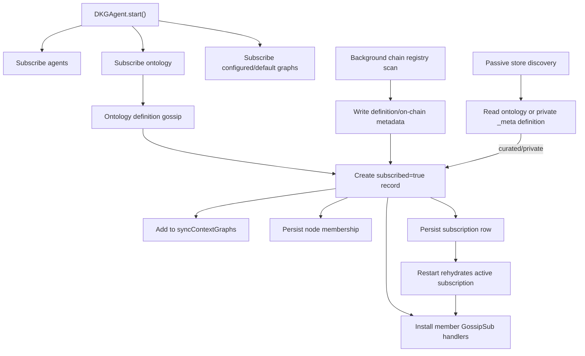
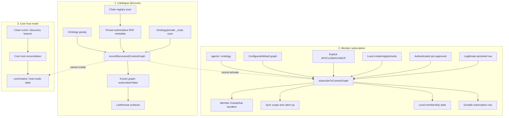

# Separate Context Graph Discovery from Edge-Node Membership

## Summary

This PR stops DKG edge nodes from becoming active members of user Context
Graphs merely because those graphs were discovered through ontology gossip,
the on-chain Context Graph registry, or passive local-store inspection.

Discovery still retains useful catalogue metadata and exposes the graph through
the existing list/browse surfaces, but a newly discovered user graph now stays:

```text
subscribed: false
synced: false
```

until an explicit local-intent path activates membership.

The change preserves the two universal protocol Context Graphs, `agents` and
`ontology`, as automatic subscriptions on every node role. It also preserves
configured/network-default subscriptions, explicit API/CLI/SDK/UI/MCP
subscriptions, local create/register/write flows, approved joins, legitimate
persisted rehydration, unsubscribe/cleanup behavior, and core-only SWM hosting.

## Why This Is Needed

Every node subscribes to the `ontology` system Context Graph so it can learn
Context Graph definitions. Before this PR, receiving a valid definition could
be interpreted as local membership intent. A clean edge node could therefore
accumulate user-graph gossip handlers, sync scope, durable subscription rows,
and membership records without an operator or agent asking it to join.

Those accidental subscriptions were sticky. Once persisted, startup
rehydration restored them and reinstalled their handlers after every restart.
At scale, passive network discovery could therefore fan out into unnecessary
gossip, catch-up, storage, and profile activity.

The required invariant is:

- discovery answers **which Context Graphs exist**;
- member subscription answers **which Context Graphs this node intentionally
  joins and synchronizes**;
- core hosting answers **which Context Graphs a core stores or reconciles in
  host mode without becoming a member**.

These are separate state transitions and must not imply one another.

## Protocol and Operator Intent That Remain Automatic

### Protocol system Context Graphs

`SYSTEM_CONTEXT_GRAPHS` defines exactly two universal graphs:

| Context Graph | Purpose |
| --- | --- |
| `agents` | Agent registry and peer/agent discovery. |
| `ontology` | Shared ontology and Context Graph definition catalogue. |

`AGENT_REGISTRY_CONTEXT_GRAPH` remains an alias of
`SYSTEM_CONTEXT_GRAPHS.AGENTS`; it is not a third system graph.

Both system graphs remain explicitly subscribed during `DKGAgent.start()` and
remain in the default sync-on-connect scope for edge and core roles. Existing
unsubscribe and bulk-cleanup protections for these graphs are unchanged.

### Configured/default Context Graphs

The daemon still subscribes graphs selected by local `config.contextGraphs` or
a network overlay's `defaultContextGraphs`. Configuration represents explicit
operator/network intent, so it is intentionally different from passive
discovery.

The authoritative repo-root `network/*.json` overlays currently have empty
`defaultContextGraphs` arrays. No user graph name is promoted to a protocol
constant by this PR.

## Architecture Before This PR

### Discovery and membership were coupled



### Ontology gossip path

`GossipPublishHandler` receives validated graph-definition triples on the
universal `ontology` topic. For a new user graph it previously:

1. created a registry record with `subscribed: true`;
2. called the agent's `subscribeToContextGraph()` callback;
3. installed publish/app/update/finalization handlers;
4. added the graph to sync scope; and
5. allowed the subscription state to become durable.

This path had no local-intent gate. Listening to the catalogue was enough to
join every public graph announced through it.

### Chain discovery path

The daemon runs an initial registry scan and periodic recovery scans. A
revealed public entry was written into the local ontology graph and then
activated through `subscribeToContextGraph()`. The authoritative name and
on-chain ID were useful catalogue data, but subscription was an unrelated side
effect.

### Store discovery path

Public ontology definitions were already catalogue-only. The curated/private
branch was different: finding a private `_meta` or allowlist definition seeded
a record and immediately subscribed so the same connection cycle could attempt
catch-up. That made passive metadata observation substitute for an approved
local join. The authenticated `join-approved` path already owns that
activation and immediate catch-up responsibility.

### Persistence made accidental state sticky

`subscribeToContextGraph()` writes active state through the configured
`ContextGraphSubscriptionStore`. Startup rehydration restores those rows,
member topics, and sync behavior. The persisted schema has no reliable
historical origin that can distinguish manual intent from an older
discovery-created row.

### Core hosting was already a separate concept

Core host mode uses `coreHosted`, `swmHostModeSubscribed`, chain-event
reconciliation, discovery beacons, and sharding/storage gates. A core may host
opaque or public graph data without being a member subscriber. This PR does not
route core hosting through the new discovery catalogue transition.

## Architecture After This PR

### Three explicit transitions



### Central catalogue boundary

`DKGAgent.recordDiscoveredContextGraph()` is now the single agent-level
transition for passive discovery metadata.

For a new graph it:

- records the graph in the in-memory catalogue with `subscribed: false`;
- preserves the name, on-chain ID/hash, participant metadata, and confirmed
  meta state supplied by the discovery source;
- does not register member gossip handlers;
- does not add the graph to `config.syncContextGraphs`;
- does not persist node membership;
- does not persist a subscription row; and
- cannot manufacture `coreHosted`, reconciliation watermarks, or pending-join
  state.

For an already active legitimate subscription it may enrich authoritative
catalogue metadata, but it preserves active membership and positive sync/host
state. Passive rediscovery therefore cannot downgrade a manual subscription,
and it also cannot upgrade a catalogue-only record into one.

### Ontology gossip is catalogue-only

The gossip handler callback contract no longer exposes
`subscribeToContextGraph()`. Instead, agent-backed handlers receive
`recordDiscoveredContextGraph()`. Standalone handlers fall back to an
in-memory, non-persisted `subscribed: false` record.

Validated definition triples are still inserted and policy validation is
unchanged. The log now reports that the graph was catalogued rather than
auto-subscribed.

### Chain discovery retains authoritative metadata without joining

Chain scans still:

- retain the cleartext name when revealed;
- persist the authoritative on-chain ID binding in the ontology graph;
- mark projection metadata dirty;
- preserve cursor page acknowledgement ordering; and
- remain idempotent across repeated full/incremental scans.

After the durable RDF binding succeeds, the in-memory catalogue transition
records `subscribed: false`. No member activation follows.

### Public and curated store discovery use the same rule

Definitions found in the ontology graph and private `_meta` graphs now both use
the catalogue transition. A curated `_meta` definition may report confirmed
metadata locally, but membership still requires the authenticated
`join-approved` or another explicit subscription path.

### Profile advertising remains membership-filtered

`publishProfile()` already filters `contextGraphsServed` to active public
subscriptions and excludes `agents`/`ontology`. Its comments now describe both
public and curated passive discovery correctly. Discovery-only rows therefore
remain visible locally without advertising the edge as a graph-serving member.

## Behavior Matrix

| Trigger | Before | After |
| --- | --- | --- |
| Startup: `agents` | Active system subscription | Unchanged |
| Startup: `ontology` | Active system subscription | Unchanged |
| Config/network default | Active configured subscription | Unchanged |
| Ontology definition gossip | Activated user subscription | Catalogue only |
| Revealed public chain entry | Activated user subscription | Catalogue only |
| Public ontology store row | Catalogue only | Catalogue only |
| Curated/private `_meta` row | Activated user subscription | Catalogue only |
| Explicit subscribe API/CLI/SDK/UI/MCP | Active, persisted membership | Unchanged |
| Local create/register/write | Active creator/local subscription | Unchanged |
| Authenticated `join-approved` | Active membership and catch-up | Unchanged |
| Legitimate persisted subscription | Rehydrated active subscription | Unchanged |
| Explicit unsubscribe | Removes member topics/sync scope | Unchanged |
| Admin bulk cleanup | Clears non-system, non-hosted user rows | Unchanged |
| Core chain-event/beacon hosting | Host-mode state, separate from membership | Unchanged |

## Modules Changed and Why

### Runtime

| Module | Change | Reason |
| --- | --- | --- |
| `packages/agent/src/dkg-agent.ts` | Added `recordDiscoveredContextGraph()`; routed store and chain discovery through it; updated logs/comments. | Establish one enforceable catalogue boundary and remove passive activation. |
| `packages/agent/src/gossip-publish-handler.ts` | Removed the subscription callback from the discovery contract; added catalogue recording; new definitions use `subscribed: false`. | Prevent universal ontology listeners from joining every announced user graph. |
| `packages/agent/src/dkg-agent-swm-substrate.ts` | Wires the gossip handler to the catalogue callback instead of member activation. | Connect ontology discovery to the new boundary without changing explicit subscription behavior. |
| `packages/agent/src/dkg-agent-registry.ts` | Updated `contextGraphsServed` architecture comments. | Document that public and curated passive discoveries are both excluded from profile advertising. |

### Tests

| Module | Change | Reason |
| --- | --- | --- |
| `packages/agent/test/discovery-subscription-boundary.test.ts` | New focused edge-node coverage for system graphs, gossip-registration state, sync scope, persistence, membership, restart, public/curated store discovery, chain discovery, idempotency, metadata enrichment, and core-host-state separation. | Prove side effects, not only `subscribed` map values. |
| `packages/agent/test/gossip-publish-handler.test.ts` | Updated the callback contract and added ontology catalogue-only coverage. | Prevent reintroduction of the gossip activation path. |
| `packages/agent/test/context-graph-discovery.test.ts` | Replaced chain auto-subscribe expectations; added persistence/sync assertions; strengthened curated store and cursor/idempotency expectations. | Align the existing integration-oriented discovery suite with the new invariant. |
| `packages/agent/test/adversarial-determinism.test.ts` | Removed obsolete gossip subscription callback fixtures. | Keep adversarial handler construction aligned with the callback contract. |
| `packages/agent/test/phase-sequences.test.ts` | Removed obsolete gossip subscription callback fixtures. | Keep phase-contract tests aligned with the callback contract. |

### Operator documentation

| Module | Change | Reason |
| --- | --- | --- |
| `docs/references/cli.md` | Documents discovery-only behavior, the two system graphs, explicit subscribe, and legacy cleanup scope. | Give operators a safe rollout and recovery procedure. |

## Preserved Activation Sources

The PR deliberately does not add a blanket edge-role rejection inside
`subscribeToContextGraph()`. Edge nodes must still be able to join when intent
is explicit.

The following activation call sites remain valid:

- system graph startup in `dkg-agent-lifecycle.ts`;
- configured/network-default startup in `packages/cli/src/daemon/lifecycle.ts`;
- explicit subscribe routes in `packages/cli/src/daemon/routes/context-graph.ts`;
- local graph create/register paths in `dkg-agent-cg-registry.ts` and
  `dkg-agent-context-graph.ts`;
- explicit local publish/write paths in `dkg-agent-publish.ts`;
- authenticated join approval in `dkg-agent-lifecycle.ts`; and
- persisted subscription rehydration in `dkg-agent-lifecycle.ts`.

Core host-mode activation remains in the existing lifecycle/SWM-host modules
and is not implemented as member subscription.

## Persisted-State and Rollout Behavior

No database schema or provenance migration is introduced.

Discovery-only entries are not written to `context_graph_subscriptions`; their
durable catalogue data already lives in ontology/on-chain RDF state. Fresh or
explicitly cleaned edge nodes therefore do not recreate accidental rows after
restart.

Existing persisted rows are intentionally preserved because historical rows
cannot be classified safely as manual or discovery-created. Silently deleting
them could remove legitimate user intent.

Operators can inspect active user subscriptions through:

```text
GET /api/context-graph/subscriptions
```

and deliberately clear the backlog through:

```text
DELETE /api/context-graph/subscriptions
```

The DELETE operation clears every non-system, non-`coreHosted` user
subscription, including legitimate subscriptions. It preserves `agents`,
`ontology`, core-hosted rows, and VM/SWM graph data. Wanted user subscriptions
must be re-added explicitly afterward.

## Verification

### Passed

- `pnpm run build:runtime:packages`
  - all runtime packages built successfully;
- `pnpm --filter @origintrail-official/dkg-agent build`
  - TypeScript build and agent type tests passed after the final runtime edit;
- focused agent regressions:
  - ontology gossip handler: 14 passed;
  - discovery/subscription boundary: 3 passed;
  - core discovery-beacon host mode: 4 passed;
- focused CLI regressions:
  - chain scan scheduling/idempotency: 8 passed;
  - subscription diagnostics/cleanup route: 3 passed;
- focused two-node devnet discovery/subscription boundary: passed;
- `git diff --check` passed.

The focused boundary suite exercises actual `DKGAgent` startup with a
`MockChainAdapter` and verifies:

- only `agents` and `ontology` are universal system graphs;
- `AGENT_REGISTRY_CONTEXT_GRAPH` is the `agents` alias;
- passive discovery creates no member handler, sync-scope entry, membership
  record, subscription row, pending join, or core-host state;
- public and curated store definitions remain catalogue-only;
- a revealed chain entry retains its on-chain ID and remains catalogue-only;
- repeated chain discovery is idempotent;
- explicit subscription installs member handlers, sync scope, membership, and
  persistence;
- rediscovery cannot downgrade that explicit subscription; and
- restart rehydrates only the explicitly activated graph.

### Focused devnet boundary

An isolated two-node devnet was run with one core and one edge node. The test
cleared the edge node's preconfigured user subscriptions, created and
registered a fresh public graph on the core (`onChainId=3`), and observed the
graph on the live edge through ontology gossip with `subscribed=false`.

The edge was then restarted to exercise persisted discovery state and the
startup chain scan scheduled after 15 seconds. After that scan, the graph still
had `subscribed=false`, retained `onChainId=3`, and was absent from
`GET /api/context-graph/subscriptions`. A final explicit
`POST /api/context-graph/subscribe` activated the graph with
`subscribed=true` and `coreHosted=false`.

A follow-up data-bearing check created another randomly named public graph,
wrote a unique marker triple into the core node's shared working memory, and
verified that the core could query the marker. The edge discovered the graph
with `subscribed=false` but returned zero marker rows before subscription and
through a 30-second passive window after an edge restart. After an explicit
subscription with shared-memory catch-up, the same edge query returned the
marker. This proves the graph data is available and sync-capable, while passive
discovery alone does not initiate synchronization.

The isolated devnet and its generated deployment metadata were cleaned after
the run.

### Local fixture limitation

The repository's default chain-backed agent test command was attempted under
both the shell's Node 25 and the repository's supported Node 24 runtime. In
this local environment, the spawned Hardhat process became unreachable after
deployment (`ECONNREFUSED 127.0.0.1:9547`, and once an empty contract result),
so `context-graph-discovery.test.ts` and the large agent-part suites aborted
before their assertions ran.

This was a fixture/runtime failure, not a failing product assertion. The
chain/store behavior changed by this PR is covered by the passing MockChain
boundary tests, while the existing chain-backed expectations were also updated
for CI or an environment with a stable Hardhat fixture.

## Compatibility and Risk

- No public API endpoint is removed or renamed.
- No persisted schema changes.
- No user graph is hard-coded as a new system graph.
- Existing legitimate persisted subscriptions continue to rehydrate.
- Configured/default graph subscriptions remain automatic.
- Core hosting and ciphertext custody paths are unchanged.
- The behavior change is intentionally limited to passive discovery call
  sites.

The primary rollout consideration is existing accidental persisted rows. They
remain active until an operator deliberately invokes the documented cleanup
endpoint.

## Reviewer Checklist

- [ ] Ontology gossip inserts validated definitions but does not activate a
      user subscription.
- [ ] Chain scans retain authoritative metadata and cursor semantics without
      joining the graph.
- [ ] Public and curated store discoveries both stay catalogue-only.
- [ ] Explicit edge subscription still installs handlers, sync scope,
      membership, and persistence.
- [ ] `agents` and `ontology` remain active on startup and sync-on-connect.
- [ ] Configured/default graphs remain automatic subscriptions.
- [ ] Join-approved, local create/write, rehydration, and unsubscribe paths are
      unchanged.
- [ ] `contextGraphsServed` excludes discovery-only graphs.
- [ ] Core host mode remains independent from member subscription.
- [ ] Legacy cleanup scope is clear and operator-controlled.
