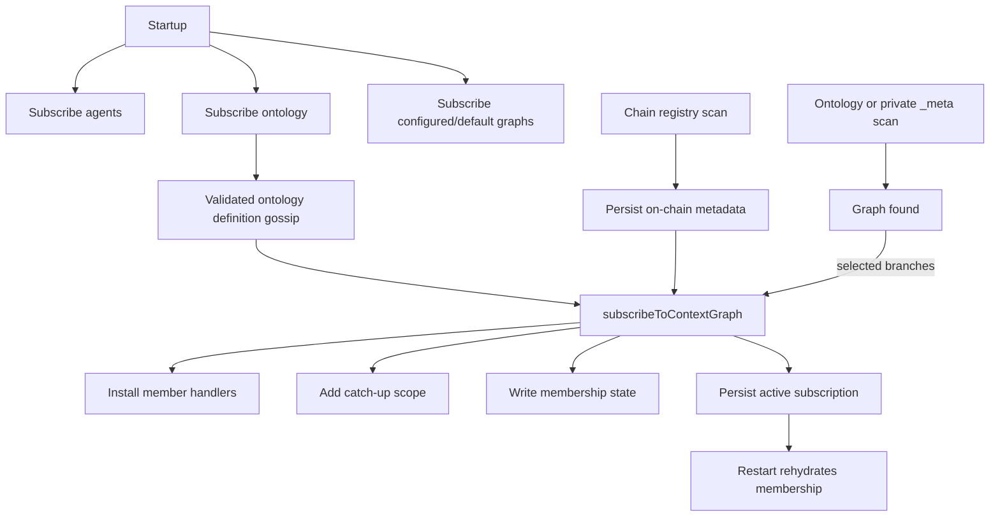
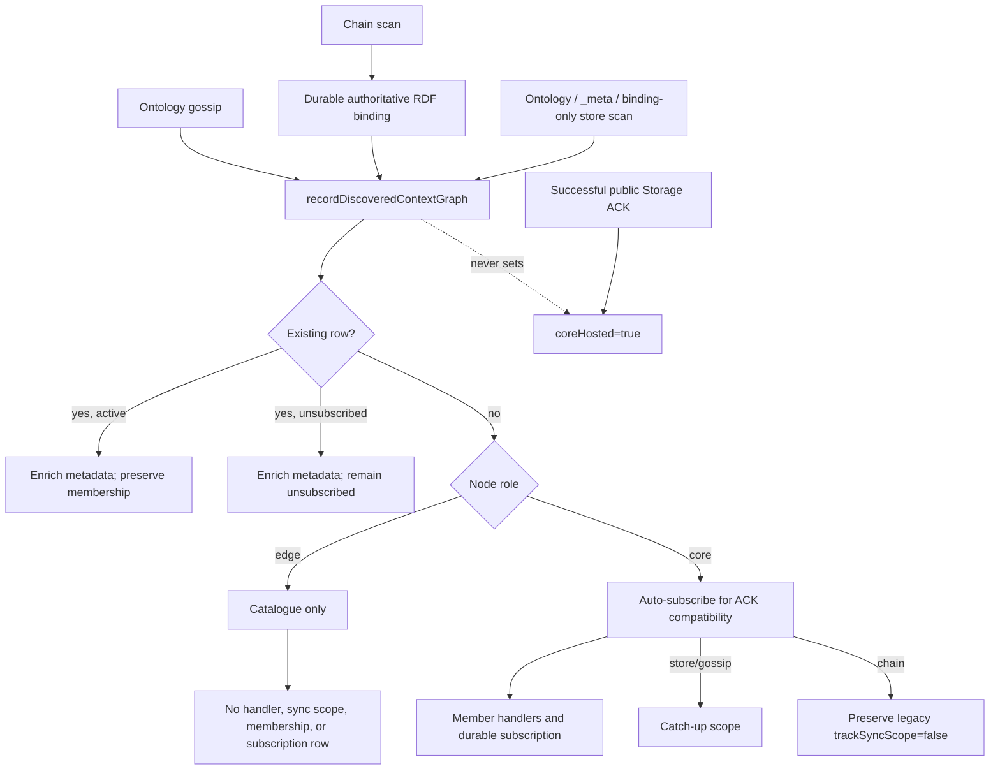

# Stop Unsolicited Context Graph Subscriptions on Edge Nodes

## Summary

This PR separates Context Graph discovery from edge-node membership without
removing the temporary core behavior required for Storage ACK custody.

The role contract is now explicit:

- an **edge** that learns about a user Context Graph through ontology gossip,
  a chain scan, or store inspection records catalogue metadata only;
- a **core** still auto-subscribes to newly discovered graphs because the ACK
  path currently depends on member gossip/finalization handlers; remove that
  compatibility bridge only with host-mode separation in #1611;
- an existing explicitly unsubscribed row is never reactivated by rediscovery
  on either role; and
- `coreHosted` remains a separate, ACK-backed durable obligation. Discovery
  does not manufacture it.

`agents` and `ontology` remain universal startup subscriptions. Configured or
network-default graphs, explicit subscribe, local create/write, approved join,
and legitimate persisted rehydration also remain activation paths.

## Motivation

Every node subscribes to `ontology` so it can learn Context Graph definitions.
Before this change, a valid definition could be treated as local membership
intent. On edge nodes, passive network observation could therefore install
user-graph GossipSub handlers, add catch-up scope, persist a membership row,
and restore that accidental subscription after every restart.

The architecture needs three distinct facts:

1. **Catalogue:** this graph exists and these are its authoritative identifiers.
2. **Membership:** this node intentionally joined and synchronizes the graph.
3. **Core custody:** this core has an ACK-backed hosting/reconciliation duty.

For edges, fact 1 must not imply fact 2. For cores, fact 1 still temporarily
activates fact 2 because ACK handling is not yet independent (#1611). Fact 3
is never inferred from discovery.

## Architecture Before



Discovery call sites owned membership side effects directly. In particular:

- ontology gossip called the subscription callback after inserting a valid
  definition;
- a revealed public chain entry persisted its binding and subscribed;
- curated/private store discovery subscribed immediately; and
- persisted accidental rows became indistinguishable from legitimate intent.

This coupling was wrong for edge nodes. It could not simply be removed for all
roles, however, because cores are responsible for ACK handling and still need
the member handlers that subscription installs.

## Architecture After

### Central role-aware discovery boundary



`DKGAgent.recordDiscoveredContextGraph()` is the only agent-level transition
used by passive discovery. It accepts a deliberately narrow metadata type:

- `name`;
- `onChainId`;
- `onChainHash`; and
- `participantAgents`.

Callers cannot choose `subscribed`, `synced`, `metaSynced`, `coreHosted`,
reconciliation watermarks, or pending-join state. The implementation also
constructs the next record field-by-field, so an older or untyped runtime
caller cannot inject those fields through object spreading.

### Edge behavior

A newly discovered edge record starts with:

```text
subscribed: false
synced: false
sharedMemorySynced: false
metaSynced: false
```

It stays in the local in-memory catalogue and list/browse surfaces, but
discovery does not:

- register publish/app/update/finalization handlers;
- add the graph to `config.syncContextGraphs`;
- write local graph membership;
- persist an active subscription row; or
- add the edge to `contextGraphsServed`.

### Core behavior and #1611

A core still auto-subscribes when a graph is first discovered. This is a
compatibility requirement, not an assertion that catalogue discovery and
membership are conceptually the same: cores currently need subscription-owned
handlers to receive, finalize, and ACK network data.

Core discovery source behavior is preserved:

| Discovery source | Core activation | Ordinary catch-up scope |
| --- | --- | --- |
| Ontology gossip | auto-subscribe | enabled |
| Public/curated store scan | auto-subscribe | enabled |
| Revealed public chain scan | auto-subscribe | disabled (`trackSyncScope=false`) |

`coreHosted` remains independent. It is set by the ACK-backed host path, can be
true while `subscribed=false`, and is preserved by unsubscribe/cleanup. It must
not be set merely because a core discovered or subscribed to a graph.

### Ontology gossip

The gossip handler still validates and inserts Context Graph definitions. Its
callback now accepts only discovery metadata and delegates role policy to the
agent:

- edge agent: records a passive catalogue entry;
- core agent: records and auto-subscribes;
- standalone handler without an agent callback: uses a safe passive in-memory
  fallback.

`metaSynced` is not declared by discovery. New records remain false until
`refreshMetaSyncedFlags()` observes the required local metadata; that method
remains the single authority for opening the metadata gate.

### Chain discovery and durable restart reconstruction

Chain scans continue to:

- retain revealed names and authoritative on-chain IDs;
- write the `ContextGraphOnChainId` RDF binding before acknowledging a page;
- preserve full/incremental scan watermark and retry semantics;
- skip unresolved hash-only entries whose topic name is unusable; and
- apply the existing private-entry curator filter.

The chain path cannot always write a complete `rdf:type`/name definition. Store
discovery therefore also reads binding-only `ContextGraphOnChainId` rows and
derives the local graph ID from their canonical subject URI. After a restart
with chain RPC unavailable, an edge reconstructs the graph and its on-chain ID
without subscribing. Active persisted core/member state still rehydrates with
its original scope semantics.

### On-chain rebinding safety

When authoritative discovery changes an active graph's `onChainId`, the shared
binding helper now applies the same invalidation rules as other binding paths:

- reset and persist `lastReconciledOrdinal`;
- discard the in-memory reconciliation cursor;
- clear a stale `onChainHash` unless the new authoritative hash is supplied;
  and
- preserve watermark/cursor state when the ID is unchanged.

This prevents VM reconciliation state for one on-chain graph from being reused
against a different binding.

### Store discovery

Public ontology definitions, curated/private `_meta` definitions, and
binding-only chain metadata all pass through the same role-aware recorder.
Public and curated branches no longer duplicate subscription logic.

Rediscovery enriches an existing active row and re-tracks an active private
member when required for SWM catch-up. It never re-tracks or reactivates an
explicitly unsubscribed row.

### Invited-agent join flow

`add-agent` grants authorization on the curator; it is not edge-local join
intent. The edge stays passive until its agent sends `request-join`.

The pre-approved sequence is covered end-to-end over real libp2p:

```text
add-agent
  -> edge remains unsubscribed
request-join
  -> curator returns already-member
  -> join-approved delivered to requester node
  -> requester subscribes
  -> same-cycle curator catch-up completes
```

The already-member short-circuit has no pending request row to update; approval
is proven by requester-side handler/scope/persistence activation and successful
same-cycle data catch-up.

## Behavior Matrix

| Trigger | Edge after | Core after |
| --- | --- | --- |
| Startup `agents` | active | active |
| Startup `ontology` | active | active |
| Configured/network-default graph | active | active |
| Ontology definition gossip | catalogue only | active for ACK compatibility |
| Revealed public chain entry | catalogue only | active, legacy no ordinary scope |
| Public ontology store row | catalogue only | active |
| Curated/private `_meta` row | catalogue only | active |
| Rediscovery after explicit unsubscribe | remains unsubscribed | remains unsubscribed |
| Explicit subscribe | active and persisted | active and persisted |
| Local create/write | active and persisted | active and persisted |
| `join-approved` | active plus immediate catch-up | active plus immediate catch-up |
| Legitimate persisted row | rehydrated | rehydrated |
| Successful public ACK | no core host state | may set independent `coreHosted` |

## Modules Changed and Why

### Runtime

| Module | Change | Why |
| --- | --- | --- |
| `packages/agent/src/dkg-agent-types.ts` | Adds narrow discovery metadata/options types and documents forbidden state. | Make the discovery boundary explicit at compile time. |
| `packages/agent/src/index.ts` | Exports the discovery contract. | Keep handler and external agent construction typed consistently. |
| `packages/agent/src/dkg-agent.ts` | Implements role-aware recording; routes ontology/store/chain discovery; reads binding-only RDF rows; preserves unsubscribe; resets changed bindings. | Centralize policy and retain core ACK behavior plus restart durability. |
| `packages/agent/src/gossip-publish-handler.ts` | Replaces subscription-shaped discovery input with metadata-only recording and a passive fallback. | Prevent ontology listeners from directly choosing membership. |
| `packages/agent/src/dkg-agent-swm-substrate.ts` | Wires the gossip handler to the central recorder. | Ensure real agent-backed ontology gossip uses the role boundary. |
| `packages/agent/src/dkg-agent-registry.ts` | Clarifies role-aware `contextGraphsServed` behavior. | Distinguish edge catalogue rows, core public membership, curated exclusion, and `coreHosted`. |

### Tests

| Module | Change | Why |
| --- | --- | --- |
| `packages/agent/test/discovery-subscription-boundary.test.ts` | Covers edge/core gossip, chain, public/curated store discovery, forbidden metadata injection, persistence, restart with RPC unavailable, rebinding, profile advertisement, explicit activation, cleanup, and host independence. | Assert all side effects, not just a map boolean. |
| `packages/agent/test/e2e-join.test.ts` | Runs the pre-approved join sequence on an edge requester over real libp2p and checks same-cycle data catch-up. | Prove `add-agent` stays passive while `join-approved` remains an activation source. |
| `packages/agent/test/gossip-publish-handler.test.ts` | Uses the narrowed callback and passive fallback. | Lock the handler contract. |
| `packages/agent/test/context-graph-discovery.test.ts` | Aligns store `metaSynced` expectations with the refresh authority. | Prevent discovery from declaring metadata complete. |
| `packages/agent/test/adversarial-determinism.test.ts`, `phase-sequences.test.ts` | Updates handler fixtures for the new callback. | Keep adversarial/phase coverage representative. |
| `packages/agent/test/sync-on-connect-churn.test.ts` | Retains system/configured scope assertions. | Prove automatic intended subscriptions still sync on connect. |
| Agent/CLI Vitest configs and daemon wiring tests | Include the focused boundary and configured/default coverage. | Ensure CI runs the new contract. |

### Documentation

| Module | Change | Why |
| --- | --- | --- |
| `docs/references/cli.md` | Documents edge discovery, core ACK compatibility, #1611, system graphs, explicit subscribe, and cleanup. | Give operators the correct role and rollout model. |
| This file | Records before/after architecture, module ownership, risk, and validation. | Serve as the standard PR description and durable handoff. |

## Preserved Explicit Activation Paths

This PR does not reject edge subscriptions inside `subscribeToContextGraph()`.
The following paths still express intent and activate membership:

- startup for `agents` and `ontology`;
- configured/network-default graphs;
- explicit API/CLI/SDK/UI/MCP subscribe;
- local create/register/write;
- authenticated `join-approved`;
- legitimate persisted rehydration.

Explicit unsubscribe still removes member topics and sync scope. Local create,
write, rehydration, and unsubscribe production modules are unchanged.

## Persistence, Cleanup, and Rollout

No database schema or provenance migration is introduced.

Fresh edge discoveries do not create active subscription rows. Existing rows
are preserved because historical state cannot safely distinguish manual intent
from an old discovery side effect.

Operators can inspect and deliberately clear legacy user subscriptions through:

```text
GET /api/context-graph/subscriptions
DELETE /api/context-graph/subscriptions
```

Bulk cleanup preserves `agents`, `ontology`, host-only `coreHosted` rows, and
graph data. It removes all eligible non-system user subscriptions, including
legitimate ones. Wanted graphs must be subscribed again explicitly. Later
passive discovery may repopulate catalogue visibility but cannot reactivate an
edge subscription; core rediscovery retains the temporary ACK behavior.

## Validation

### Automated results

- `pnpm --filter @origintrail-official/dkg-agent build`
  - TypeScript build and type tests passed.
- focused role boundary and ontology handler suite
  - 2 files, 27 tests passed.
- chain/store Context Graph discovery suite
  - 1 file, 79 tests passed.
- real-libp2p invited join suite
  - 1 file, 6 tests passed.
- reconciler/backpressure/late-joiner/rehydration shard
  - 4 files, 115 tests passed.
  - includes `defers wrapped private shared-memory admission pressure without peer backoff`; the expected result remains `deferred-backpressure`.
- focused CLI scan/cleanup/configuration suite
  - 3 files, 17 tests passed.
- `git diff --check`
  - passed.

### Focused live devnet proof

The branch was also exercised on an isolated core/edge devnet with a freshly
generated public graph. The core registered the graph and wrote a unique marker
triple to SWM. The edge learned the graph through discovery with
`subscribed=false`, returned zero marker rows before subscription, and remained
passive through a restart plus a 30-second observation window. After an
explicit subscribe request with shared-memory catch-up, the edge returned the
same marker triple. The graph was therefore available and sync-capable, while
passive edge discovery alone did not synchronize it.

The devnet proof also confirmed the discovered on-chain ID survived edge
restart, the passive graph was absent from the active-subscriptions endpoint,
and explicit activation persisted `subscribed=true, coreHosted=false`.

### Acceptance matrix

| Invariant | Evidence |
| --- | --- |
| Ontology gossip inserts validated definitions without unsolicited edge membership. | Real agent-backed edge/core role matrix plus handler fallback tests. |
| Chain scans retain authoritative metadata and cursor semantics. | Durable RDF-before-ack assertion, edge passive assertion, and core legacy-scope assertion. |
| Public and curated store discovery obey role policy. | Edge remains catalogue-only; core auto-subscribes both; explicit unsubscribe survives rediscovery. |
| Explicit edge subscription installs handlers, scope, membership, and persistence. | Boundary lifecycle assertions and same-cycle join catch-up. |
| `agents` and `ontology` remain startup and sync-on-connect subscriptions. | Startup and churn/reconciler tests. |
| Configured/default graphs remain automatic. | Existing daemon wiring and boundary lifecycle coverage. |
| Join-approved, local create/write, rehydration, and unsubscribe remain valid. | Real join test plus boundary lifecycle/regression shards. |
| `contextGraphsServed` excludes discovery-only edge graphs. | Profile capture excludes edge catalogue rows; active public membership remains advertised; curated graphs remain excluded. |
| Core host mode remains independent from member subscription. | Host-only and ACK/reconciliation coverage; discovery cannot inject `coreHosted`. |
| Binding changes invalidate stale reconciliation state. | Changed-ID and same-ID persistence/cursor tests. |
| Chain catalogue survives restart without RPC. | Disk-backed restart reconstructs an OnChainId-only row without edge activation. |
| Legacy cleanup is explicit and operator-controlled. | GET/DELETE route and boundary cleanup coverage. |

## Compatibility and Risk

- No public endpoint or persisted schema changes.
- No new system graph is introduced.
- Existing legitimate subscriptions continue to rehydrate.
- Core discovery remains active until #1611, avoiding an ACK regression.
- `coreHosted` and ciphertext/VM reconciliation remain independent.
- The main rollout risk is pre-existing accidental subscription rows; cleanup
  is intentionally opt-in because provenance is unavailable.

## Reviewer Checklist

- [x] Edge ontology gossip is catalogue-only; core ontology gossip remains active.
- [x] Edge chain/store discovery is passive; core ACK compatibility is retained.
- [x] Existing explicit unsubscribe is not undone by rediscovery.
- [x] Discovery cannot inject membership, sync, host, watermark, or pending state.
- [x] Binding-only chain metadata survives restart without RPC.
- [x] Changed bindings clear stale hash, watermark, and live cursor state.
- [x] `add-agent -> request-join -> already-member -> join-approved -> catch-up` is covered over real libp2p.
- [x] `metaSynced` has one refresh authority.
- [x] `contextGraphsServed` reflects role and access policy correctly.
- [x] Cleanup scope is documented and operator-controlled.
