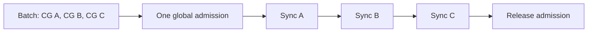
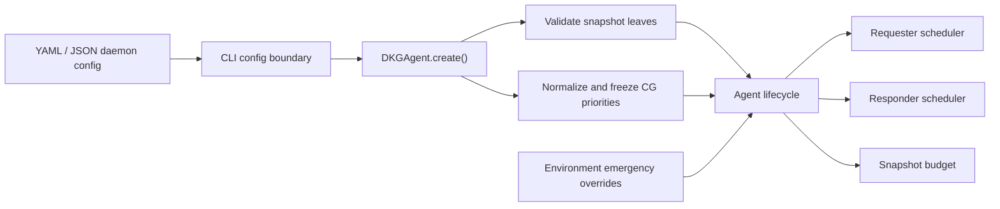
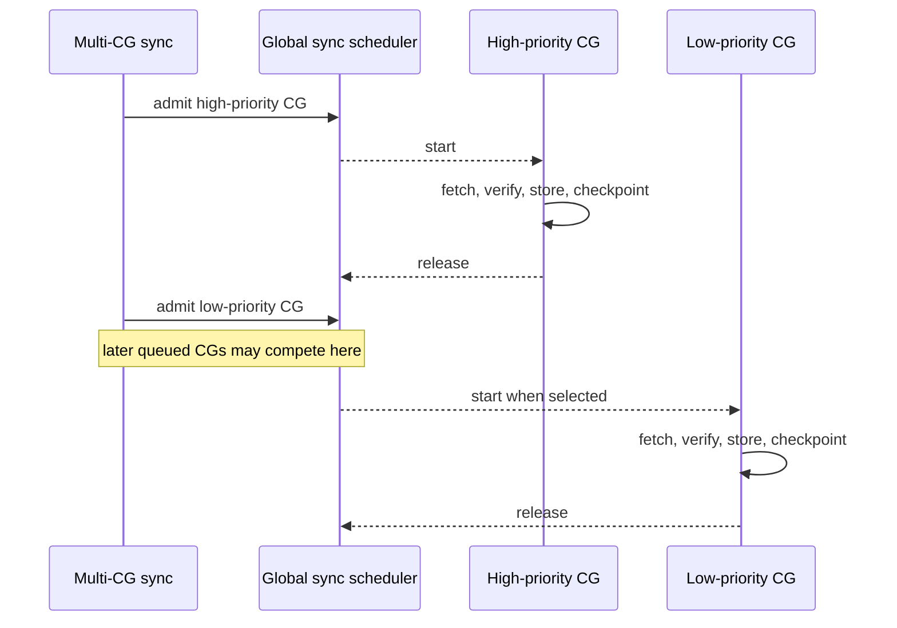
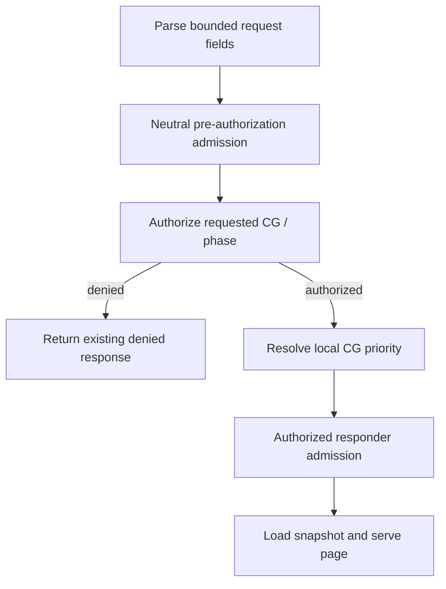
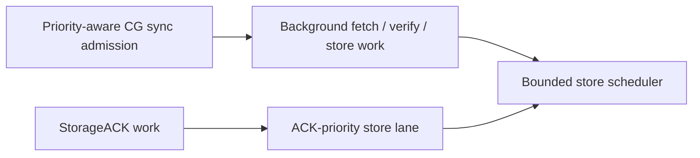

# Make Sync Snapshot Limits Configurable and Prioritize Context Graph Sync

## Summary

This PR introduces a daemon-local sync policy that solves two related
operational problems:

1. responder snapshot row and estimated-byte limits can now be configured
   through the normal DKG configuration pipeline, while retaining environment
   variables as emergency overrides;
2. operators can assign local priorities to Context Graphs (CGs), allowing
   important graphs to move ahead of lower-priority queued sync work on both
   requester and responder paths.

The implementation changes admission and scheduling, not sync correctness.
Every admitted CG still completes the same phase sequence, authorization,
verification, store mutation, and checkpoint rules as before. Running work is
never preempted. Queues remain bounded, equal priorities remain FIFO, and aging
prevents low-priority work from starving indefinitely.

The priority map is deliberately local policy. It is never sent over the wire
and is not trusted from a remote requester.

Local admission pressure is also modeled explicitly. If one CG completes and a
later CG cannot enter the bounded queue, the completed counters and checkpoints
are preserved, the batch returns a deferred result, and the peer is retried
without peer-failure backoff.

## Why This Is Needed

DKG V10 already has process-local sync concurrency and queue limits, as well as
shared responder snapshot budgets. Those controls bound total pressure, but
they previously treated all CGs as equivalent.

Under sustained catch-up or rehydration, this creates two operational issues:

- a large batch of lower-value CGs can occupy every requester slot before an
  operationally important CG is discovered;
- authorized responder work for an important CG can wait behind ordinary
  queued requests, even though the node already knows which CG the request is
  allowed to read.

Snapshot limits also existed primarily as constants with environment
overrides. They could not be represented in the normal YAML/JSON daemon
configuration, validated at agent creation, forwarded through the CLI daemon
boundary, or included coherently in startup diagnostics.

This PR makes these controls first-class while preserving existing defaults
and emergency environment overrides.

## Configuration

Two new top-level daemon/agent configuration fields are available:

```yaml
syncResponderSnapshotLimits:
  global:
    rows: 750000
    bytesEstimate: 402653184
  local:
    rows: 250000
    bytesEstimate: 134217728

syncContextGraphPriorities:
  did:dkg:base:8453/important-context-graph: 100
  did:dkg:base:8453/background-context-graph: -10
```

### Snapshot limit semantics

| Field | Meaning | Existing default |
| --- | --- | ---: |
| `global.rows` | Maximum rows retained across responder snapshots | 750,000 |
| `global.bytesEstimate` | Maximum estimated bytes retained across responder snapshots | 384 MiB |
| `local.rows` | Maximum rows retained by one snapshot | 250,000 |
| `local.bytesEstimate` | Maximum estimated bytes retained by one snapshot | 128 MiB |

Each leaf resolves independently using:

```text
environment variable -> daemon config -> existing default
```

The existing environment overrides remain supported:

| Configuration leaf | Environment override |
| --- | --- |
| `global.rows` | `DKG_SYNC_RESPONDER_GLOBAL_SNAPSHOT_ROW_LIMIT` |
| `global.bytesEstimate` | `DKG_SYNC_RESPONDER_GLOBAL_SNAPSHOT_BYTES_ESTIMATE_LIMIT` |
| `local.rows` | `DKG_SYNC_RESPONDER_PER_SNAPSHOT_ROW_LIMIT` |
| `local.bytesEstimate` | `DKG_SYNC_RESPONDER_PER_SNAPSHOT_BYTES_ESTIMATE_LIMIT` |

All configured leaves must be positive safe integers. An invalid config value
fails agent creation with the exact field path. An invalid environment value
emits one warning and falls through to the configured value or default.

A local limit cannot exceed the corresponding global limit. If it does, the
effective local value is clamped to the global value and the node logs the
clamp. This prevents internally contradictory budget policy while keeping an
emergency global override safe.

### Context Graph priority semantics

`syncContextGraphPriorities` maps a CG ID to a JavaScript safe integer:

- higher numbers run before lower numbers while queued;
- missing CGs use priority `0`;
- equal priorities preserve original/FIFO order;
- positive, zero, and negative values are valid;
- CG IDs do not need to be registered when configuration is loaded, allowing
  an operator to prepare policy before graph discovery or registration.

The map is validated, copied, and frozen once during `DKGAgent.create()`.
Priority changes therefore take effect on the next agent start.

For metrics and diagnostics, numeric values are projected into three bounded
classes:

| Numeric priority | Metric class |
| ---: | --- |
| `> 0` | `elevated` |
| `0` | `default` |
| `< 0` | `deprioritized` |

Scheduling still compares the complete numeric value. The classes exist only
to keep observability cardinality bounded.

## Architecture Before This PR

Requester backpressure admitted an entire multi-CG sync call as one job:



This had two consequences:

- a lower-priority batch tail retained the slot until every CG in the batch
  completed;
- a later high-priority CG could not compete for admission between CGs.

The queue was bounded and FIFO, but carried no CG identity or priority. The
responder also used FIFO admission before authorization, so it could not safely
prioritize by CG: trusting the request's claimed CG before authorization would
let an unauthorized peer claim an elevated graph to jump the queue.

## Architecture After This PR

### Shared local policy

A new sync policy module owns:

- snapshot configuration types and validation;
- priority map normalization;
- stable priority ordering and de-duplication;
- local priority lookup;
- bounded priority-class projection and configured-class counts.

The CLI config imports these public agent types and forwards both policy
objects unchanged into `DKGAgent.create()`. The agent then validates and
normalizes them once before lifecycle services start.



### Per-CG requester admission

Durable and shared-memory runners are execution-only: they fetch, verify, store,
and checkpoint the CGs passed to them, but they do not recursively schedule
themselves. Lifecycle orchestration stably orders the batch by local priority,
admits one CG, invokes the single-CG runner, and immediately merges its result
before attempting the next admission.



The admission boundary is intentionally outside the complete CG operation:

- durable sync keeps metadata fetch, data fetch, worker verification, store
  insertion, and checkpoint updates together;
- public shared-memory sync keeps its data/meta fetch, verification, guarded
  insertion, ownership update, and checkpoint sequence together;
- private shared-memory recovery keeps its all-or-nothing recovery operation
  together;
- a sync deadline is created after queue admission, so queue wait does not
  consume the CG's network/store execution budget.

Summary counters are merged after each CG. A typed local admission rejection
increments `deferredBackpressure`, stops the remaining fanout, and returns the
partial summary. It does not increment `failedPeers`,
`backoffWorthyFailures`, or peer retry backoff. Sync-on-connect reports
`deferred-backpressure`; partial progress updates only the progress timestamp,
never the clean-success timestamp.

Existing stop-on-backoff behavior is preserved for actual peer or transport
pressure.

### Requester lanes covered

The same local priority policy is applied at the real admission boundaries:

- legacy durable full-scan sync;
- OT-RFC-59 changelog sync, one public CG at a time;
- changelog-triggered legacy resync without nested/double admission;
- public shared-memory incremental sync;
- private curator shared-memory recovery;
- direct shared-memory recovery;
- catch-up work, which reaches these same agent-side admission methods.

Public shared-memory sync and private curator recovery are interleaved through
one priority-ordered eligible-CG plan. A high-priority private recovery can
therefore run before a lower-priority public incremental sync.

### Global requester scheduler

The existing process-local global sync limit remains the capacity authority:

| Control | Existing default |
| --- | ---: |
| Global requester inflight | 2 |
| Global requester queue | `2 x inflight` (4 by default) |
| Queue aging threshold | 30 seconds |

Existing `syncGlobalMaxInflight`, `syncGlobalLimit`,
`syncGlobalQueueLimit`, and their environment overrides continue to resolve
as before. A resolved inflight limit of `0` continues to disable this global
admission layer.

Requester and responder limiters now share one internal priority-admission
queue. The shared primitive owns stable sequencing, aging selection,
strictly-higher-priority displacement, queued abort/timeout cleanup,
exactly-once rejection, and scheduler metrics. Thin wrappers retain their
different capacity policies: global requester limits on one side, and
global/per-peer responder limits on the other.

The scheduler stores bounded metadata with every queued entry:

```text
CG ID for diagnostics
lane
numeric priority
bounded priority class
stable sequence
enqueue timestamp
abort signal
```

Selection rules are:

1. running work is never preempted;
2. the oldest runnable entry past the aging threshold runs first;
3. otherwise, the highest numeric priority runs first;
4. equal priorities run in enqueue order;
5. aborted queued work is removed immediately;
6. if the queue is full, a new job may displace only a strictly lower-priority
   queued job;
7. equal- or lower-priority arrivals are rejected rather than growing the
   queue.

Displaced work receives a typed `SyncBackpressureBusyError` with reason
`displaced`. Ordinary capacity rejection retains reason `queue_full`.
Existing retry/backoff handling remains the owner of what happens next.

### Authorization-safe responder priority

Responder behavior has an explicit compatibility switch:

- omitted, empty, or all-zero priorities use the original single admission
  across authorization and page serving;
- at least one non-zero priority enables authorization-safe two-stage
  scheduling.

With priority scheduling enabled, responder scheduling is split into two
stages:



Pre-authorization work always uses priority `0` and class `default`.
Only after the existing authorization function approves the request does the
limiter resolve `syncContextGraphPriorities[contextGraphId]`.

This prevents priority spoofing: an unauthorized requester cannot claim the ID
of an elevated CG to gain admission. Requests that do not transition into an
authorized CG-specific stage remain neutral.

The transition is atomic from the scheduler's perspective. The authorized
stage is queued before the neutral running slot is released, allowing it to
compete with all queued work without exceeding the existing running limit.
The hand-off reuses the request's original arrival sequence, so equal-priority
work does not lose FIFO position merely because authorization introduced a
second admission stage. Stage results are a discriminated union rather than a
byte-array sentinel.

Existing responder protection remains:

| Control | Value |
| --- | ---: |
| Global responder concurrency | 3 |
| Per-peer responder concurrency | 1 |
| Global responder queue | 64 |
| Per-peer responder queue | 4 |
| Maximum queue wait | 10 seconds |
| Aging threshold | 5 seconds |

The responder uses the same core selection rules: aged work first, then
numeric priority, then FIFO ties. Queue and per-peer caps remain enforced.
Strictly higher-priority authorized work may displace lower-priority queued
work, while running work is never interrupted. Abort and queue-timeout paths
remove entries and release accounting.

Responder capacity failures continue to map into the existing quiet retryable
transport path.

### StorageACK isolation is preserved

This PR does not move sync writes into the StorageACK priority lane and does not
alter StorageACK admission. Durable and shared-memory inserts retain
`priority: 'background'`.

The sync scheduler controls when a complete CG sync operation is allowed to
create fetch/verify/store pressure. Store-level ACK priority remains the final
protection for latency-sensitive acknowledgement work.



## Snapshot Policy Resolution

At startup, the lifecycle resolves one effective snapshot policy and passes
the resulting budget directly to the sync responder. Resolution is performed
once for the running agent rather than independently at each request.
Resolver inputs are explicit `(config, env, onWarning)`; the implementation
does not infer whether an object is configuration or an environment map by
inspecting its keys.

Backward compatibility is explicit:

- no config produces the existing 750,000-row / 384-MiB global budget and
  250,000-row / 128-MiB local budget;
- existing environment-only deployments behave as before;
- the existing environment variable names are unchanged;
- environment values continue to take precedence, leaf by leaf;
- responder snapshot entry caps, TTL, LRU behavior, retry semantics, and
  stable-session pagination are unchanged.

## Observability

### Startup diagnostic

The node emits one structured startup log containing:

- effective global snapshot rows and estimated bytes;
- effective local snapshot rows and estimated bytes;
- effective global sync inflight and queue limits;
- configured priority counts by bounded class;
- whether either local snapshot limit was clamped.

Example shape:

```text
Resolved sync policy {
  "snapshotGlobalRows": 750000,
  "snapshotGlobalBytesEstimate": 402653184,
  "snapshotLocalRows": 250000,
  "snapshotLocalBytesEstimate": 134217728,
  "syncGlobalInflightLimit": 2,
  "syncGlobalQueueLimit": 4,
  "configuredPriorities": {
    "elevated": 1,
    "default": 0,
    "deprioritized": 1
  },
  "snapshotLocalClamped": false
}
```

### Scheduler metrics

Two process-local metrics are added:

```text
dkg.sync.scheduler.queue_wait_ms{lane,priority_class}
dkg.sync.scheduler.decisions_total{lane,priority_class,outcome}
```

Outcomes cover scheduler events such as started, aged, rejected, displaced,
and aborted. These are event counts rather than throughput counts: an aged
start intentionally emits both `started` and `aged`. Labels use bounded
lane, priority-class, and outcome enums.

CG IDs, peer IDs, session IDs, operation IDs, and raw numeric priorities are
not metric labels.

### StorageACK pressure diagnostics

When StorageACK reports surrounding sync pressure, the diagnostic snapshot now
also includes:

- queued elevated/default/deprioritized counts;
- oldest queued sync age;
- existing inflight, queue depth, and configured capacity values.

This makes it possible to distinguish ordinary sync saturation from a backlog
that contains elevated work without introducing high-cardinality telemetry.

## Correctness and Safety Invariants

The implementation preserves these boundaries:

- priorities influence only queued admission order;
- running work is never preempted;
- one CG's fetch/verify/store/checkpoint sequence is not split by the
  scheduler;
- queue wait happens before the CG deadline starts;
- responder priority is applied only after authorization;
- empty/all-zero responder priority policy retains one continuous admission;
- all queues remain bounded;
- equal priorities remain stable FIFO;
- aging bounds starvation;
- aborts, timeouts, and displacement remove queued entries and listeners
  exactly once;
- nested changelog resync reuses its existing CG admission;
- local admission deferral preserves prior results and never penalizes a peer;
- sync store writes remain background priority;
- StorageACK priority handling is unchanged;
- priority policy is local and never accepted from the network;
- metric labels remain bounded.

## Compatibility and Non-Goals

### Compatibility

- No sync protocol ID or wire payload changes.
- No on-chain state changes.
- No database migration.
- No change to default snapshot limits.
- No change to default requester or responder concurrency.
- No responder scheduling change when priorities are omitted or all `0`.
- Multi-CG requester batches release global admission between CGs even when
  every CG uses priority `0`.
- Existing environment-only snapshot configuration remains valid.

### Non-goals

This PR does not:

- implement cluster-wide or consensus priority;
- propagate priority between peers;
- dynamically reload priorities without restarting the agent;
- preempt running sync or store operations;
- add CG IDs to metrics;
- change snapshot materialization, verification algorithms, or pagination;
- replace store-level ACK priority or global sync backpressure;
- guarantee that an elevated job starts immediately when all slots are already
  running.

## Failure and Rollback Behavior

If policy is omitted, defaults preserve current operation.

For a conservative rollout:

1. deploy with `syncResponderSnapshotLimits` omitted and an empty priority
   map;
2. confirm the startup diagnostic matches current effective limits;
3. add priority entries for the small set of operationally important CGs;
4. monitor queue wait and decision outcomes by bounded priority class;
5. tune snapshot config only when retained-snapshot telemetry justifies it.

Rollback requires removing the two new config fields or deploying the previous
version. There is no persisted priority state or schema change to reverse.

## Test Coverage

The added and extended tests cover:

- positive-safe-integer snapshot validation with exact error paths;
- unchanged default snapshot resolution;
- environment-over-config precedence per leaf;
- invalid environment fallback and one-time warnings;
- local-to-global clamping;
- priority map normalization, unknown/preconfigured IDs, stable ties, and
  bounded classes;
- higher-priority requester admission;
- FIFO behavior for equal priorities;
- aging of lower-priority queued work;
- bounded queue rejection and strictly-higher-priority displacement;
- abort cleanup;
- per-CG durable and shared-memory admission;
- partial durable and shared-memory accounting across admission deferral;
- deferred sync-on-connect retry without peer backoff or clean-success stamp;
- changelog admission deferral without same-attempt legacy fallback;
- a later elevated CG overtaking a lower-priority batch tail;
- mixed public shared-memory and private recovery ordering;
- original single-stage responder admission for omitted/all-zero priorities;
- responder priority only after successful authorization;
- unauthorized elevated-CG claims receiving no priority;
- FIFO sequence preservation across authorization handoff;
- displacement cleanup without later timeout double-settlement;
- preservation of global and per-peer responder limits;
- CLI configuration parsing and daemon-to-agent forwarding.

Verification performed in the implementation worktree:

```text
agent unit suite:                                    56 files / 648 tests passed
CLI config + daemon wiring tests:                     2 files / 119 tests passed
devnet manifest gate:                                 2 files / 8 tests passed
devnet folded public/private StorageACK flow:         1 test passed
devnet core peers/features:                           5 of 6 tests passed
  - normal full-scan sync/publish path passed
  - offline-core case stopped before sync: a four-core/min-signature-3
    cluster has only two remote core ACKs while one core is offline
live custom-policy restart:                           passed
  - global/local rows resolved as 123456 / 23456
  - global/local byte estimates resolved as 64 MiB / 16 MiB
  - priority classes resolved as elevated=1 / deprioritized=1
  - restarted edge rejoined with five connected peers
@origintrail-official/dkg-core build:                 passed
@origintrail-official/dkg-agent build + type tests:   passed
@origintrail-official/dkg CLI build:                  passed
git diff --check:                                     passed
```

## Main Code Surfaces

- `packages/agent/src/sync/policy.ts`
  - configuration types, validation, priority normalization, stable ordering,
    and bounded priority classes;
- `packages/agent/src/sync/backpressure.ts`
  - global requester capacity wrapper and pressure diagnostics;
- `packages/agent/src/sync/priority-admission-queue.ts`
  - shared priority/FIFO ordering, aging, displacement, abort/timeout cleanup,
    handoff sequence preservation, and scheduler metrics;
- `packages/agent/src/sync/requester/ordered-sync.ts`
  - explicit per-CG requester orchestration and partial-result preservation;
- `packages/agent/src/sync/requester/durable-sync.ts`
  - durable execution and progress accounting;
- `packages/agent/src/sync/requester/shared-memory-sync.ts`
  - shared-memory execution and progress accounting;
- `packages/agent/src/dkg-agent-lifecycle.ts`
  - policy resolution, requester-lane integration, mixed public/private SWM
    ordering, startup logging, and responder wiring;
- `packages/agent/src/sync/responder/sync-handler.ts`
  - explicit snapshot config resolution, default single-stage admission, and
    authorization-safe two-stage priority scheduling;
- `packages/agent/src/dkg-agent.ts`
  - fail-fast validation and one-time priority normalization;
- `packages/cli/src/config.ts` and
  `packages/cli/src/daemon/lifecycle.ts`
  - public config surface and CLI-to-agent forwarding;
- `packages/core/src/telemetry-api.ts`
  - bounded scheduler metrics.
