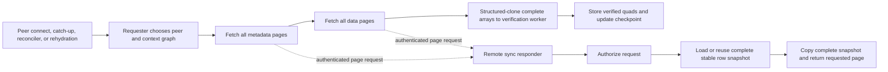
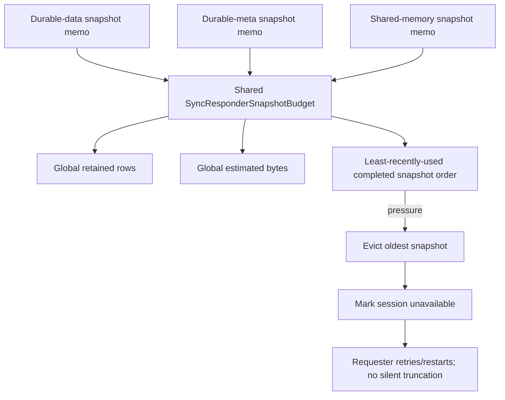

# Bound DKG V10 Sync Responder Heap and Remove Full-Snapshot Page Copies

## Summary

This PR reduces the heap amplification caused by DKG V10 sync responder
snapshots and adds the telemetry needed to attribute remaining sync memory.

Before this change, sync responder snapshots were limited only by entry count:

- 128 durable-data snapshots;
- 64 durable-meta snapshots;
- 64 shared-memory snapshots.

Those 256 possible entries had no shared row or byte budget. A cache hit also
copied the complete snapshot twice before returning one page: once when the
memo returned the cached value and again immediately before `slice()`. Serving
a 500-row page from a large snapshot therefore generated allocation work
proportional to the complete graph, not to the page.

This PR:

- introduces one daemon-local LRU budget shared by all three responder memos;
- enforces global and per-snapshot row/estimated-byte limits;
- preserves the existing per-phase entry caps as secondary abuse protection;
- removes complete-array copies from cache hits and page extraction;
- records process, responder-cache, and requester-phase memory telemetry;
- converts snapshot-admission budget rejection into the existing quiet
  retryable sync-limit path instead of truncating data;
- adds deterministic coverage for cross-phase eviction, oversized snapshots,
  aborted owners, page allocation behavior, and bounded metric labels;
- adds a reproducible microbenchmark for the changed page-serving hot path.

The change is intentionally scoped. It bounds retained responder cache state
and removes avoidable responder page allocations. It does **not** yet make
requester verification incremental, remove worker structured cloning, or stop
the store from temporarily materializing a complete snapshot before budget
admission.

## Why This Is Needed

Mainnet nodes have experienced repeated V8 heap exhaustion during sustained
sync, subscription rehydration, and finalization activity:

```text
FATAL ERROR: Reached heap limit Allocation failed - JavaScript heap out of memory
```

Reducing catch-up and global sync concurrency improved ACK/publish behavior,
which confirms that overlapping sync/store pressure is operationally
significant. Concurrency limits are still only an outer traffic valve: one
large graph can produce a large responder snapshot and requester batch even
when concurrency is `1`.

## Architecture Before This PR

DKG sync is requester-driven. The requester fetches metadata and data in
separate pagination loops, verifies the complete result, and stores accepted
quads locally.



### Stable responder sessions

The responder deliberately holds a stable sorted snapshot for a sync session.
That prevents live store mutations from shifting `OFFSET` ordering between
pages and causing skipped or duplicated rows.

The old cache topology was:

```text
durable data memo:  up to 128 entries
durable meta memo:  up to  64 entries
shared memory memo: up to  64 entries
-------------------------------------
total:              up to 256 entries
```

Each memo enforced only its own entry count and TTL. Entry count was not a heap
bound because one entry could contain a small graph while another could
contain hundreds of thousands of rows.

### Old cached-page allocation path

On a steady-state memo hit, the old code behaved like this:

```ts
// Memo hit: shallow-copy the complete snapshot.
return [...existing.value];

// Page extraction: shallow-copy the complete result again, then slice 500 rows.
const page = [...rows].slice(offset, offset + limit);
```

The row objects and strings were shared, but each spread allocated another
complete array backing store.

For snapshot size `N`, page size `P`, and `ceil(N / P)` page requests:

```text
old copied array slots ~= 2 * N * ceil(N / P) + N
new copied array slots  = N
```

At `N = 250,000` and `P = 500`, the old steady-state page path copied
`250,250,000` array slots to return `250,000` logical rows. The new path copies
`250,000` slots, one requested page at a time.

The first page of a newly loaded snapshot was even more allocation-heavy: the
old loader cloned the store result before caching it, cloned it again when
returning it, and page extraction cloned it a third time before slicing.

### Other pre-existing memory amplifiers

The broader sync pipeline also retains or copies complete phase data:

- `fetchSyncPages()` appends every parsed page into one `Quad[]`;
- durable and SWM sync hold complete metadata and data arrays together;
- worker `postMessage()` structured-clones ordinary quad object graphs;
- verification creates maps, sets, filtered arrays, and cloned result payloads;
- startup rehydration can quickly recreate sync work after a restart;
- finalization can overlap with sync and create additional complete arrays.

Those paths explain why this PR should reduce heap pressure but is not presented
as the complete end-to-end memory fix.

## Architecture After This PR

### One shared row and estimated-byte budget

All three responder memos now register retained snapshots with one shared LRU
coordinator:



Default limits:

The global limits are derived as `per-snapshot × SYNC_RESPONDER_GLOBAL_CONCURRENCY`
(concurrency `3`) so every admitted responder computation retains room without
cross-peer eviction, and every limit is operator-overridable via env
(`DKG_SYNC_RESPONDER_{GLOBAL_SNAPSHOT_ROW,GLOBAL_SNAPSHOT_BYTES_ESTIMATE,PER_SNAPSHOT_ROW,PER_SNAPSHOT_BYTES_ESTIMATE}_LIMIT`).

| Limit | Default |
| --- | ---: |
| Global retained rows | 750,000 |
| Global retained estimated bytes | 384 MiB |
| Rows in one retained snapshot | 250,000 |
| Estimated bytes in one retained snapshot | 128 MiB |
| Durable-data entry cap | 128 |
| Durable-meta entry cap | 64 |
| Shared-memory entry cap | 64 |

The byte estimate is deliberately conservative and version-independent:

```text
160 bytes of row/object/array overhead
+ 1 byte per UTF-16 code unit in s, p, o, and g
```

Production RDF terms are overwhelmingly Latin-1/ASCII, which V8 stores as
one-byte strings; charging one byte per code unit keeps the estimate close to
measured retained size instead of ~1.7x over it.

It is an admission estimate, not a claim about exact V8 retained size. Row
count and estimated bytes are enforced together so neither a large number of
short rows nor a smaller number of large strings can consume the cache without
a bound.

### LRU behavior

- A cache hit moves the snapshot to the most-recently-used position.
- Admission evicts completed snapshots from the LRU head until the new snapshot
  fits both global budgets.
- TTL expiry, explicit release, and replacement remove the entry from budget
  accounting.
- A snapshot larger than its per-snapshot limit is rejected without evicting
  unrelated retained snapshots.
- Evicted sessions are marked unavailable; a later page fails through the
  existing expired-session path and requester retry logic restarts the session.
- An oversized or otherwise unadmittable new snapshot returns a quiet retryable
  limit error. Neither case silently truncates graph data.
- Completed loads whose original requester disconnected are still admitted, but
  cannot push retained state past the shared budget.

### Page serving no longer copies the complete snapshot

The memo now returns its immutable retained reference, and page extraction
slices it directly:

```ts
return existing.value;

const page = rows.slice(offset, offset + limit);
```

Only the requested page receives a new array backing store. Snapshot ordering,
row objects, authorization, serialization, and session behavior are unchanged.

### Memory attribution telemetry

Process memory is sampled at bounded sync lifecycle checkpoints:

```text
process.heap_used_bytes
process.heap_total_bytes
process.heap_limit_bytes
process.rss_bytes
process.external_bytes
process.array_buffers_bytes
```

Responder ownership and pressure:

```text
dkg.sync.responder.snapshots
dkg.sync.responder.snapshot_rows
dkg.sync.responder.snapshot_bytes_estimate
dkg.sync.responder.snapshot_evictions_total{phase,reason}
dkg.sync.responder.snapshot_load_duration_ms{phase,outcome}
```

Requester accumulation:

```text
dkg.sync.requester.accumulated_quads{phase,outcome}
dkg.sync.requester.accumulated_bytes{phase,outcome}
dkg.sync.requester.page_count{phase,outcome}
dkg.sync.requester.phase_duration_ms{phase,outcome}
```

Metric attributes are closed enums such as `phase`, `boundary`, `outcome`, and
`reason`. Peer IDs, context-graph IDs, session IDs, UALs, and operation IDs are
not metric labels.

## Expected Heap Impact

### Retained heap

The responder can no longer retain an arbitrary number of rows merely because
the number of session entries remains below 256. Retained snapshots are capped
across all responder phases by both row count and estimated bytes.

This changes the retention model from:

```text
retained heap = sum(size of up to 256 independently capped snapshots)
```

to:

```text
retained rows <= 750,000
retained estimated bytes <= 384 MiB
one snapshot <= 250,000 rows and <= 128 MiB estimated
```

### Transient allocation and GC

Serving a cached page now allocates only the page array instead of two complete
snapshot arrays plus the page. Expected effects:

- lower allocation rate during multi-page sync;
- fewer and shorter young-generation collections;
- less promotion pressure into old space;
- fewer large temporary array backing stores;
- lower event-loop and CPU time spent copying array references;
- more heap headroom for requester verification and concurrent finalization.

### What remains unbounded or amplified

The budget is applied after the store returns a complete snapshot. Therefore it
bounds **retained cache state**, but not the temporary store result while a
single under-cap snapshot is being built and sorted for caching.

When a snapshot is intrinsically larger than the per-snapshot cap, every
memoized responder phase now falls back to a **store-bounded paged read**
(`ORDER BY … OFFSET/LIMIT`) — including durable-meta and TTL-cutoff SWM-data,
whose subject-membership filters are pushed into the store via `EXISTS` rather
than re-materialized in Node. Such a graph therefore stays syncable (paginated,
uncached) instead of buffering the complete filtered set or returning a
permanent retryable limit. Global (process-wide) budget pressure remains a quiet
retryable limit so the requester retries once other sessions drain.

This PR also does not yet bound:

- requester `allQuads` accumulation across every page in a phase;
- simultaneous complete metadata and data arrays;
- worker structured clones and worker-side verification indexes;
- returned complete verified arrays;
- finalization working sets;
- startup rehydration fan-out beyond the existing concurrency controls.

An OOM is therefore still possible through a sufficiently large individual
materialization or requester/worker working set. This PR removes two concrete
amplifiers and adds enough telemetry to identify the next dominant owner.

## Benchmark

### Method

`packages/agent/scripts/sync-responder-page-benchmark.cjs` compares the exact
steady-state page algorithms:

```text
old: memoResult = [...snapshot]; page = [...memoResult].slice(offset, offset + 500)
new: page = snapshot.slice(offset, offset + 500)
```

Methodology:

- realistic four-string row objects;
- page size `500`;
- snapshot sizes from `10,000` to the new per-snapshot row cap of `250,000`;
- one complete sequential page pass per isolated child process;
- `7` isolated trials per mode and size;
- alternating old/new trial order;
- explicit GC before each measured pass;
- repository-pinned Node.js `v24.11.1`;
- V8 old-space capped at `512 MiB`;
- table values are medians;
- old/new checksums must match.

Command:

```bash
pnpm --dir packages/agent benchmark:sync-responder-pages -- --trials=7
```

Results:

| Snapshot rows | Pages | Old median | New median | Speedup | Old peak heap delta | New peak heap delta | Copied-slot reduction |
| ---: | ---: | ---: | ---: | ---: | ---: | ---: | ---: |
| 10,000 | 20 | 0.25 ms | 0.08 ms | 3.2x | 3.34 MiB | 0.49 MiB | 41x |
| 50,000 | 100 | 8.17 ms | 0.22 ms | 36.9x | 7.68 MiB | 0.42 MiB | 201x |
| 100,000 | 200 | 34.41 ms | 0.36 ms | 95.9x | 15.31 MiB | 0.84 MiB | 401x |
| 250,000 | 500 | 226.47 ms | 0.85 ms | 265.8x | 30.56 MiB | 2.09 MiB | 1,001x |

The copied-slot reduction is deterministic from the two algorithms. Timing and
heap values are machine/runtime-specific. This is a focused allocation
microbenchmark, not an end-to-end sync throughput or production-RSS claim. It
does not include store querying, sorting, N-Quads serialization, transport,
parsing, verification workers, storage, or finalization.

The benchmark nevertheless demonstrates the intended mechanical effect: page
allocation scales with the requested page data after this PR, instead of with
`snapshot size × page count`.

## Correctness and Compatibility

- Sync authorization is unchanged.
- Page size and wire protocol are unchanged.
- Snapshot row ordering is unchanged.
- Existing per-phase entry caps remain.
- Merkle and metadata verification are unchanged.
- Checkpoints are not advanced early.
- No graph is silently truncated to fit a budget.
- Empty snapshots remain uncached and do not consume the budget.
- Same-session concurrent loads still coalesce.
- Aborted owners still reject locally while their owner-independent completed
  load can be reused if it fits the budget.
- A pressure eviction can force a later page to restart its session, trading
  retry work for a bounded retained heap.
- No migration or persisted-data format change is required.

## Test Plan

Completed verification:

```bash
pnpm --filter @origintrail-official/dkg-core build
pnpm --filter @origintrail-official/dkg-agent build
pnpm --dir packages/node-ui run build
pnpm --dir packages/agent exec vitest run --config vitest.unit.config.ts
pnpm --dir packages/node-ui exec vitest run test/telemetry.test.ts
pnpm --dir packages/agent benchmark:sync-responder-pages -- --trials=7
git diff --check
```

Results:

- Agent unit matrix: `38` files, `381` tests passed.
- Node-UI telemetry/exporter compatibility: `13` tests passed.
- Core, agent, and node-UI TypeScript builds passed.
- Benchmark old/new checksums matched at every snapshot size.
- `git diff --check` passed.

New regression coverage includes:

- one budget shared across durable-data, durable-meta, and SWM memos;
- LRU touch and cross-phase eviction ordering;
- global row accounting staying within the configured bound;
- oversized per-snapshot rejection without evicting unrelated data;
- repeated completed loads from aborted owners remaining bounded;
- cached page extraction that cannot iterate/copy the complete snapshot;
- process/responder/requester metrics reaching the OTel exporter;
- absence of peer and context-graph IDs from metric labels.

## Rollout and Operational Guidance

- Roll out to one canary at a time.
- Keep conservative catch-up/global sync concurrency during the canary; this PR
  reduces memory amplification but does not make one complete phase bounded.
- Monitor worker PID age, restart count, API latency, process heap/RSS, snapshot
  rows/estimated bytes, eviction reasons, requester accumulated quads, host
  `MemAvailable`, and store memory/CPU.
- Treat a larger `--max-old-space-size` as temporary canary headroom, not as a
  substitute for demonstrating a stable heap plateau.
- Watch for higher session-restart/retry rates if the default cache budget is
  too small for the active graph/session mix.

## Follow-up Work

1. Bound snapshot materialization before or during the store read, rather than
   only at cache admission.
2. Make requester parsing, verification, and staging incremental or KC-aware.
3. Replace ordinary-object worker messages with compact transferable payloads,
   or keep parsing/verification/staging in one isolate.
4. Bound pending verification input bytes and expose worker-isolate memory.
5. Make subscription rehydration rolling and pressure-aware.
6. Add a constrained-heap restart/rehydration/finalization soak test and require
   a stable plateau.

## Related Issues

- Relates to #1550: persisted subscription rehydration pressure.
- Relates to #1549: store/finalization pressure.
