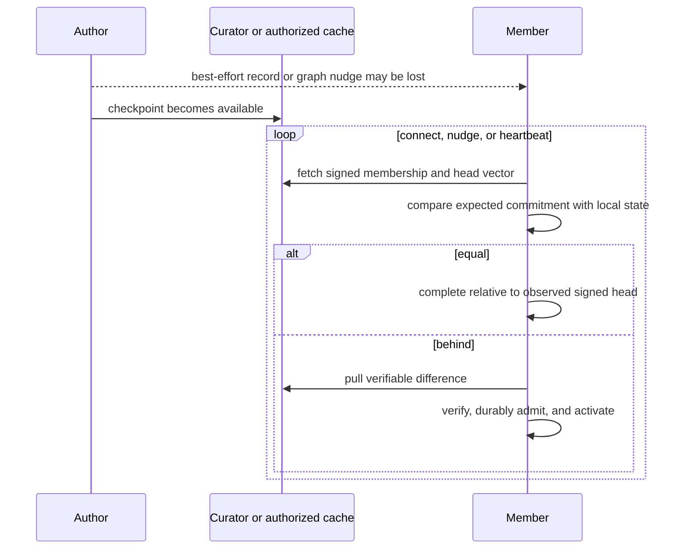
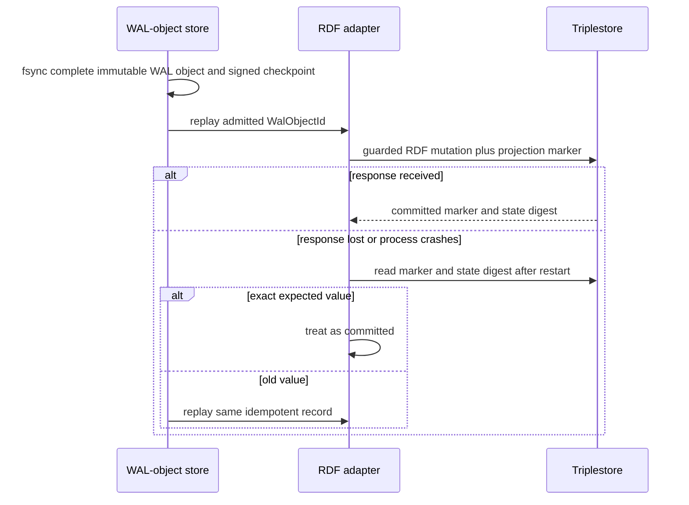

# OT-RFC-65 Companion: Comparison with OT-RFC-64 / PR #144

| Field                 | Value                                                                      |
| --------------------- | -------------------------------------------------------------------------- |
| **Companion to**      | [OT-RFC-65](OT-RFC-65-wal-byte-set-reconciliation-sync.md)                 |
| **Compared proposal** | [OT-RFC-64 / PR #144](https://github.com/OriginTrail/dkgv10-spec/pull/144) |
| **Reviewed PR head**  | `cf8ddb462afe98b9a4327a821dbcaa81edaae462`                                 |
| **Status**            | **Draft comparison**                                                       |
| **Reviewed**          | 2026-07-18                                                                 |

> This companion is deliberately separate from OT-RFC-65 so the protocol proposal
> remains self-contained while the comparison can track OT-RFC-64 revisions.

---

## Abstract

The WAL proposal and
[OriginTrail/dkgv10-spec PR #144](https://github.com/OriginTrail/dkgv10-spec/pull/144)
agree on the most important distributed-systems invariants: each author is the
authority for its own contribution lane; the curator signs membership and a
bounded-freshness head commitment; private access fails closed; serving peers
are untrusted; push is only a latency optimization; a durable pull loop is the
correctness path; lifecycle and retraction semantics are explicit; VM state
remains bound to author and chain evidence; and activation must be idempotent
and crash-safe.

The architectural difference is the synchronization boundary. PR #144 makes a
semantic RDF/Knowledge-Asset inventory the protocol truth. Its Revision 3.2
design compares per-author `(era, seq)` heads, transfers ordered inventory
events and named RDF graphs, verifies canonical RDF-set digests, and coordinates
SQLite control state with guarded Oxigraph activation. Its pending Revision-4
simplification instead transfers whole per-author live catalogs and commits the
catalog, RDF content, and seal together in the triplestore. Both variants keep
RDF graph identity, KA lifecycle, and triplestore activation inside the sync
architecture.

The WAL proposal moves the boundary down one layer. The protocol reconciles an
unordered authenticated set of immutable `WalObjectId` values using rateless
IBLT difference discovery, transfers each complete canonical `WalObjectV1` by
resumable byte ranges, and knows nothing about RDF or SPARQL. A deterministic
replay/conflict adapter then schedules the inline opaque payload bytes and
invokes the same existing DKG semantic core used by the current synchronization
mechanism. A separate materializer only persists that core's resulting SWM/VM
projection atomically. The WAL, not a graph catalog or triplestore, is the
replicated source of truth.

This is explicitly two synchronization mechanisms and one semantic system. The
`legacy` label refers only to current synchronization. It does not refer to the
DKG semantic implementation, SWM/VM model, verified-memory logic, VM/finality
logic, membership authority, or cryptographic implementation; those remain
shared and singular before and after cutover.

The recommendation is therefore not to discard PR #144. Preserve its authority,
freshness, fail-closed routing, pull, VM, fault-injection, and A/B acceptance
contracts, but replace its semantic inventory/event wire with the generic WAL
object-set and range protocol. Keep the proposed Revision-4 single-store
activation insight only inside the semantically passive materializer, where a
guarded SPARQL update atomically advances projection content and its
materialization marker.

This comparison is pinned to PR head
[`cf8ddb4`](https://github.com/OriginTrail/dkgv10-spec/blob/cf8ddb462afe98b9a4327a821dbcaa81edaae462/rfcs/OT-RFC-64-durable-inventory-sync.md).
The PR is open and its section 12 simplification track is explicitly pending
concurrence, so the comparison treats the Revision 3.2 body and proposed
Revision 4 as separate targets.

## 1. Compared designs

### A. PR #144 Revision 3.2 main design

- Signed per-author `(era, seq)` hash-chained inventory event lanes.
- `upsert`/`delete` semantic KA events spanning SWM and VM.
- Signed membership lane and curator-signed CG head vector.
- SQLite control plane for lanes, applied rows, heads, and quarantine.
- Named RDF graph content in Oxigraph.
- Ordered event-range pull followed by named-graph fetch.
- Canonical RDF-set digest and authorship-seal validation.
- Hidden staging plus guarded Oxigraph active descriptor.
- Author pending-intent/outbox to bridge SQLite and content writes.

Source:
[PR #144 sections 3-6](https://github.com/OriginTrail/dkgv10-spec/blob/cf8ddb462afe98b9a4327a821dbcaa81edaae462/rfcs/OT-RFC-64-durable-inventory-sync.md#L203-L555).

### B. PR #144 proposed Revision-4 direction

- One signed whole-live-set catalog per `(CG, author)`.
- `(era, version)` strict domination; absence in a newer catalog is deletion.
- Local set diff of semantic catalog rows.
- Catalog, content, and seal committed by one guarded SPARQL update.
- Triplestore seal is the durable lane/applied cursor and activation guard.
- Deletes event hash chains, protocol-visible SQLite mirrors, author outbox,
  quarantine, and cross-store activation machinery.

Section 12 also proposes a separate **Track 1** of tactical, no-new-protocol bug
fixes before **Track 2**, the convergence protocol simplified by the proposed
Revision 4. Track 1 and Revision 4 are not synonyms.

Source:
[PR #144 section 12](https://github.com/OriginTrail/dkgv10-spec/blob/cf8ddb462afe98b9a4327a821dbcaa81edaae462/rfcs/OT-RFC-64-durable-inventory-sync.md#L727-L825).

### C. WAL byte-set proposal

- One uniform signed immutable `WalObjectV1` with inline opaque payload bytes.
- Signed author checkpoint commits the exact `WalObjectId` set root.
- Signed membership and curator head vector retain the PR's authority model.
- Rateless IBLT reconciliation discovers the exact symmetric difference and is
  verified against the signed deterministic set commitment.
- Resumable whole-object byte ranges fetch missing canonical WAL objects; ranges
  have no independent content identity.
- WAL is authoritative; triplestore is a replayable projection.
- RDF/SPARQL is one adapter with causal merge, explicit conflict branches, and
  guarded activation.
- No semantic RDF graph, SPARQL query, or store cursor is a wire-level protocol
  primitive; RDF patch bytes may still be an opaque payload.

Source:
[WAL byte-set proposal](OT-RFC-65-wal-byte-set-reconciliation-sync.md).

## 2. Executive comparison

| Dimension                     | PR #144 Rev 3.2                                               | PR #144 proposed Rev 4                                                          | WAL byte-set proposal                                                                    |
| ----------------------------- | ------------------------------------------------------------- | ------------------------------------------------------------------------------- | ---------------------------------------------------------------------------------------- |
| Replicated truth              | Signed semantic inventory events plus named RDF content       | Signed live semantic catalog plus RDF content                                   | Signed immutable `WalObjectV1` values with inline opaque payload bytes                   |
| Protocol abstraction          | KA/RDF aware                                                  | KA/RDF aware                                                                    | Application-agnostic bytes                                                               |
| Difference discovery          | Compare `(era, seq)` heads; fetch `(N, M]`                    | Fetch whole catalog; local row-set diff                                         | Rateless IBLT over `WalObjectId`, verified against a signed deterministic set commitment |
| Order dependency              | Per-author ordered hash chain                                 | Per-author catalog version only                                                 | None for sync; causal DAG only in adapter                                                |
| Payload identity              | Canonical RDF-set digest                                      | Canonical RDF-set digest                                                        | No separate payload identity; payload is inline in the complete WAL-object identity      |
| Transfer unit                 | Inventory event plus named RDF graph                          | Whole catalog plus named RDF graphs                                             | One complete canonical `WalObjectV1`, streamed as transient byte ranges                  |
| Resume/chunking               | Not specified                                                 | Not specified                                                                   | Normative range resume; ranges are not independently content-addressed                   |
| Deletion                      | Explicit `delete` event                                       | Absence from newer signed catalog                                               | Immutable tombstone WAL object                                                           |
| SWM-to-VM                     | Delete SWM row plus upsert VM row                             | Catalog tier change                                                             | Causal `MOVE_TIER` payload interpreted by VM adapter                                     |
| Concurrent same-author writes | Local sequence CAS serializes                                 | Lane lock plus guarded seal CAS                                                 | Immutable concurrent records retained; adapter merges or conflicts                       |
| Cross-author conflict         | Mostly avoided by author lanes; no RDF merge policy           | Same                                                                            | Author-scoped coexistence plus signed policy for shared-key conflicts                    |
| SPARQL role                   | Guarded canonical activation                                  | Catalog/content/seal truth and activation                                       | Projection-only guarded materialization                                                  |
| Durable cursor                | SQLite `applied_event` plus Oxigraph descriptor               | Triplestore durable lane/applied cursor + seal                                  | Signed WAL checkpoint for replication; in-store marker for RDF projection only           |
| Two-store problem             | Explicit outbox and cross-store recovery                      | Removed through single-store semantic commit                                    | Removed by single-authority WAL; store is replayable projection                          |
| Bootstrap                     | Signed lane snapshot plus later events                        | Whole catalog                                                                   | Signed WAL snapshot plus post-floor set reconciliation                                   |
| Compaction                    | Era rotation and lane snapshot                                | No event-log compaction; whole catalog replacement with era/version reset rules | Snapshot record and signed compaction floor                                              |
| Freshness                     | Curator signed vector, bounded staleness, `unknown-freshness` | Same                                                                            | Same contract retained                                                                   |
| Private authorization         | Signed membership; fail closed before lane/content serve      | Same                                                                            | Same, before even set summaries or IDs                                                   |
| VM authority                  | Author seal plus on-chain identity/finality                   | Same                                                                            | Same checks in VM adapter                                                                |
| Store portability             | Depends on SQLite plus guarded triplestore semantics          | Depends on guarded SPARQL semantics                                             | Protocol portable; each adapter declares guarded-materialization capability              |
| Rebuild source                | Inventory plus graph providers and snapshots                  | Latest catalogs plus graph providers                                            | Complete WAL objects and signed snapshot WAL objects                                     |
| Steady-state equal cost       | One curator head vector; then no lane fetch                   | One curator head vector; then no catalog fetch                                  | One curator head vector plus equal set roots; cacheable                                  |
| Authority cutover             | Parallel convergence rollout                                  | Track-2 replacement after tactical baseline                                     | Full-fleet shadow run followed by one signed network-wide hard cutover                    |
| Comparison evidence           | Existing behavior is failure characterization, not a correctness baseline | Track 1/2 receipts are informative comparators                                  | Independent semantic oracle, protocol vectors, and measurable RFC gates define success   |

## 3. Where the designs agree

### 3.1 Pull, not push, carries correctness

Both designs correctly reject “make gossip reliable” as the convergence model.
A member offline during a push and a fresh joiner cannot ACK that push. A durable
expected-set commitment plus retryable pull is necessary in either design.



### 3.2 Authority is scoped, not global

Both preserve:

- author signatures for author-owned contributions;
- curator signature for membership and bounded freshness;
- chain authority for registered VM identity/finality;
- untrusted serving peers and caches;
- no global ordering or consensus requirement.

The WAL proposal changes what an author signs—from semantic inventory rows to a
checkpoint over immutable record IDs—not the authority allocation.

### 3.3 Freshness is not implied by a signature

PR #144 correctly states that a valid signed head can be stale on first contact.
The WAL proposal adopts the same honest contract:

> A replica is known-complete only relative to the highest signed head accepted
> under the configured freshness authority. Curator unavailability or evidence
> of a higher head produces `unknown-freshness`, never false completion.

Set reconciliation cannot solve this. It can prove equality with the set a peer
committed to; it cannot reveal a newer set that nobody reachable advertises.

### 3.4 Authorization must fail closed before transfer

Both require signed membership and policy evidence for private collections.
The WAL proposal moves the check slightly earlier: even set roots, counts,
WAL-object IDs, and object lengths may leak activity, so an unauthorized peer receives
no reconciliation summary.

### 3.5 VM remains semantically validated

Neither design treats byte integrity as VM validity. Author seal, KA identity,
assertion version, Merkle root, finality, and reorg handling remain required.
The difference is only placement: PR #144 validates them in the sync/activation
architecture; the WAL proposal validates them in the VM materialization adapter.

## 4. Where the protocol boundary differs

### 4.1 PR #144 synchronizes semantic inventory and graphs

Revision 3.2 asks:

```text
Which author lane sequences am I missing?
Which named RDF graphs do those events describe?
Do their canonical RDF-set digests and seals verify?
```

Proposed Revision 4 asks:

```text
Is my per-author live catalog version current?
Which semantic catalog rows differ?
Which named RDF graphs do I need to fetch or remove?
```

Both make the sync core understand KA number, UAL, tier, version, content digest,
seal, named graph, RDF-set canonicalization, and SPARQL activation.

### 4.2 The WAL proposal synchronizes bytes

The WAL protocol asks:

```text
Which committed WalObjectId values differ between our sets?
Which exact byte ranges of each complete WalObjectV1 are incomplete?
Are the bytes, signatures, authorization, and checkpoint proofs valid?
```

Only after durable admission does the RDF adapter ask:

```text
What logical RDF mutation does this payload encode?
Is it a causal successor, compatible merge, conflict, tombstone, or tier move?
Can it activate under the current SPARQL projection marker and chain view?
```

This permits the replication protocol to stay unchanged if the RDF layout,
canonicalization algorithm, triplestore, query engine, or another application
adapter changes.

## 5. Reconciliation method

### 5.1 PR #144 Revision 3.2

The ordered lane is an authenticated delta protocol:

1. compare author `(era, seq, headHash)`;
2. fetch events `(localSeq, headSeq]`;
3. verify the hash chain reaches the signed head;
4. fetch each named graph;
5. activate and advance the ordered cursor.

It works efficiently when the cursor is correct and history is available. Its
identity and progress model are sequence-based.

### 5.2 PR #144 proposed Revision 4

Revision 4 trades authenticated event deltas for simplicity:

1. compare catalog `(era, version)`;
2. fetch the complete signed live catalog;
3. diff semantic rows locally;
4. fetch added/changed named graphs;
5. treat absence in the newer catalog as deletion.

This is coherent snapshot reconciliation, but it remains a semantic catalog
protocol, and every catalog update retransmits the full author catalog.

### 5.3 WAL set reconciliation

The WAL design compares signed author checkpoint roots. Equal roots finish with
zero reconciliation symbols. When roots differ, nodes subtract deterministic
rateless IBLT symbol streams over `WalObjectId`, peel provider-only and
receiver-only IDs, and verify the decoded remote set against its signed count
and deterministic set commitment. If decoding exceeds its resource budget,
the receiver uses bounded sorted-ID enumeration and recomputes the same signed
root. It is independent of sequential gaps, message arrival, or application
keys.

The protocol-v1 IBLT reconciliation algorithm and its symbols are ephemeral
control-plane data, not synchronized content objects. They have no content IDs
or set membership. `WalObjectV1` remains the sole durable content-addressed
synchronization atom.

The set is append-only between compaction floors. Tombstones make deletion
monotonic. A peer below the floor receives a signed snapshot and then reconciles
the post-snapshot WAL-object set. Empty-node backfill may select deterministic
enumeration immediately because its difference is the entire retained set.

This approach follows Iroh's useful separation—reconcile small metadata, then
fetch content by hash from any usable path or provider—while adding DKG-specific
signed commitments, membership, tombstones, causal metadata, and SPARQL
conflict rules. Protocol version 1 uses the existing libp2p router and does not
take a runtime dependency on Iroh.

## 6. WAL and crash atomicity

### 6.1 PR #144 Revision 3.2

Two components jointly describe authoritative state:

- SQLite inventory/head/applied state;
- Oxigraph content and active descriptor.

The RFC therefore needs a pending outbox, hidden staging, exact post-read,
guarded activation, quarantine, and crash reconciliation between the two.

### 6.2 PR #144 proposed Revision 4

Revision 4 removes the split by making the triplestore catalog/seal and RDF
content one atomic semantic commit. This is materially simpler, but makes the
triplestore the protocol-visible durable truth.

### 6.3 WAL proposal

The WAL is the only replicated durable truth. The triplestore owns only its
projection and an in-store projection cursor. Cross-store atomicity is not
required:



The useful Revision-4 insight is retained inside the adapter: content and the
projection marker move in one guarded SPARQL update. What is rejected is making
that RDF marker the network reconciliation cursor or source of WAL completeness.

## 7. Conflict semantics

### 7.1 PR #144

PR #144 serializes one author's lane and isolates authors by graph ownership.
It defines lifecycle operations and stale/fatal cursor cases, but it does not
define a general SPARQL/RDF merge policy for:

- two incomparable same-key updates;
- delete versus concurrent update;
- single-valued versus multi-valued predicate conflict;
- failed update preconditions after reconnect;
- explicit human/agent conflict resolution.

SPARQL is the activation mechanism, not a conflict language.

### 7.2 WAL proposal

The existing DKG semantic core evaluates source operations and returns explicit
canonical accepted outcomes. The WAL replay/conflict adapter schedules those
bytes from causal preconditions, classifies protocol-level compatibility from
explicit mutation footprints, and asks the same core to validate each branch.
Together they deterministically represent:

- causal successor;
- idempotent overlap;
- disjoint merge;
- policy-declared multi-value merge;
- incompatible conflict branch;
- signed resolution referencing all heads.

This is the largest conflict-representation addition beyond PR #144; it is not
a second semantic implementation. It is necessary because a
generic set protocol will faithfully deliver concurrent records; it must not
pretend their union automatically defines the active RDF view.

## 8. Transfer and resume

PR #144 reuses existing transport and does not specify exact wire framing,
range transfer, whole-object verification, or resume. It identifies content by canonical
RDF-set digest.

The WAL proposal makes transfer an explicit protocol:

- deterministic tuple bytes and a domain-separated complete `WalObjectId`;
- inline opaque payload bytes with no second content identity;
- rateless IBLT/set reconciliation separate from whole-object transfer;
- transient resumable byte ranges followed by complete-object verification;
- durable missing-range maps;
- multi-provider resume;
- strict frame, byte, decompression, and concurrency bounds.

Semantic RDF canonicalization may still occur inside `RdfMutationV1`, but it no
longer defines the transport object or wire identity.

## 9. Complexity trade-off

The WAL proposal is not automatically smaller in its first release. It adds a
generic WAL-object store, authenticated set commitment, rateless IBLT and
fallback reconciliation, range protocol, adapter contract, and explicit
conflict model. Its justification is architectural deletion after migration:

- no RDF page sync protocol;
- no normal-versus-recovery semantic implementations;
- no store-derived graph delta log;
- no transport knowledge of graph naming or KA lifecycle;
- no need for every storage adapter to reproduce reconciliation behavior;
- no separate SWM and VM content-recovery protocols;
- complete triplestore rebuild from one retained record/snapshot system.

PR #144 section 12 **Track 1** is the shortest tactical path: seal rides with
push, sender-key locking and epoch rotation, requester-side VM manifest pull,
and curator dialing for catch-up, without a new convergence protocol. Proposed
Revision 4 simplifies **Track 2**, the durable convergence protocol. The WAL
proposal is the cleaner long-term boundary if the goal is to stop synchronizing
on the triplestore level. These should be evaluated as three different scope
choices, not only code-count competitors.

## 10. What to preserve from PR #144

The WAL RFC should normatively import these PR #144 decisions:

1. Per-author authority; no curator content authorship.
2. Signed monotonic membership and policy commitment.
3. Curator head vector as the default bounded-freshness contract.
4. `known-incomplete` and `unknown-freshness` as explicit states.
5. Pull as correctness and push/nudge as latency only.
6. Fail-closed private routing and authorization.
7. Untrusted caches verified by signatures and digests.
8. Epoch/era protection against restore, reset, and stale replay.
9. VM row identity, finality, and reorg validation beyond a count check.
10. Seal/authorship transported with the content reference.
11. Guarded activation, exact post-read, and fatal same-position/different-hash
    handling.
12. Lost-nudge, author-crash, out-of-order-commit, private authorization,
    removed-member, and VM-substitution fault tests.
13. Correctness plus resource acceptance against an independent semantic
    oracle, frozen protocol vectors, and explicit measurable targets. Current
    sync and Track-1/Track-2 runs are failure characterization or informative
    comparators, not correctness baselines.
14. Retirement of superseded paths as a gate rather than a later cleanup wish.

## 11. What to replace

| PR #144 concept                                    | WAL replacement                                                          |
| -------------------------------------------------- | ------------------------------------------------------------------------ |
| `inventory_event` semantic row                     | Canonical signed `WalObjectV1` bytes                                     |
| Lane event hash chain as delta proof               | Author checkpoint over deterministic `WalObjectId` set root              |
| `(era, seq)` sync cursor                           | Signed checkpoint ID, set root, and compaction floor                     |
| Named RDF graph fetch                              | Complete `WalObjectV1` whole-object range fetch                          |
| Canonical RDF-set digest as transport identity     | Exact-byte BLAKE3 `WalObjectId`; semantic digest remains adapter metadata |
| `applied_row` as sync absence index                | WAL set index; adapter separately owns projection index                  |
| SQLite inventory as protocol control truth         | `WalStore` signed checkpoints; local index implementation is replaceable |
| Oxigraph active descriptor as network progress     | In-store RDF projection marker only                                      |
| Non-canonical local extras and quarantine          | Pre-admission staging plus explicit adapter conflict/quarantine output   |
| Ordered event-range replay                         | Unordered set difference plus a causal replay/conflict adapter that delegates to the shared semantic core |
| KA/RDF-aware reconciliation plus SPARQL activation | Byte/ID-only protocol plus shared DKG semantic core and atomic projection persistence |

## 12. Rollout relationship

The PR #144 black-box convergence harness is reusable because it checks store
end state rather than an internal mechanism. The WAL proposal should add
byte-set and conflict assertions, then run a full-fleet shadow strategy:

1. current synchronization authoritative, WAL local shadow, both invoking the
   same semantic core;
2. WAL network shadow and separate RDF projection;
3. query/read parity canary;
4. validate every collection, active author, upgraded node, and write path;
5. stop writes and drain legacy synchronization in one maintenance window;
6. reconcile the fleet to final signed vectors and prove production/shadow
   parity;
7. activate one signed `NetworkWalCutoverV1` across the fleet;
8. resume writes with WAL as the only synchronization authority and remove
   legacy-sync handlers, while retaining the same semantic core.

The reworked WAL proposal deliberately rejects per-collection mixed authority
and a live legacy fallback after WAL writes resume. Before activation, a failed
gate aborts the maintenance window back to legacy sync authority. After activation,
rollback requires another coordinated maintenance operation and a deterministic
projection export from WAL.

If PR #144 section 12 Track 1 lands first, it becomes a useful tactical
comparator. If the proposed Revision-4 Track-2 implementation lands first, it may
serve as the authoritative legacy-sync arm and its guarded SPARQL activation can
become the first RDF adapter materializer. Its semantic catalog must not become
a second permanent replication truth after the WAL cutover. The WAL A/B run
must record which arm was authoritative and preserve comparable v10.0.8 and
Track-1 receipts where available, while judging correctness only against the
independent semantic oracle and frozen WAL vectors.

## 13. Decision matrix

| If the primary objective is...                                     | Prefer...                  | Reason                                                              |
| ------------------------------------------------------------------ | -------------------------- | ------------------------------------------------------------------- |
| Fix current observed graph delivery with minimum protocol work     | PR #144 section 12 Track 1 | Tactical bug fixes; no new convergence protocol.                    |
| Remove SQLite/Oxigraph dual-authority in the current inventory RFC | PR #144 Revision 4         | One semantic store commit is simpler than cross-store coordination. |
| Make sync independent of RDF and triplestore behavior              | WAL byte-set proposal      | Only immutable bytes and proofs cross the protocol boundary.        |
| Support resumable large-object transfer and exact byte parity      | WAL byte-set proposal      | Whole-object ranges and final object hashes are normative.          |
| Define deterministic concurrent SPARQL update behavior             | Shared semantic core plus WAL replay/conflict adapter | One DKG implementation with explicit causal scheduling and conflict retention. |
| Deliver quickly without committing to the final architecture       | Parallel run               | Keep current path authoritative while applying independent gates.   |

## 14. Recommendation

Proceed with the parallel WAL run, not a direct replacement release.

Use PR #144 as a control-invariant source and reuse its black-box harness,
but adopt the WAL proposal as the target protocol boundary. Specifically:

1. Keep the signed roster, per-author checkpoints, curator freshness vector,
   fail-closed authorization, pull loop, VM chain validation, and A/B gates.
2. Define `WalObjectV1`, exact byte identity, rateless IBLT reconciliation,
   signed set-commitment verification, deterministic fallback, and whole-object
   range transfer instead of semantic inventory events or catalogs.
3. Implement a deterministic replay/conflict adapter that invokes the existing
   DKG semantic core, plus a guarded materializer that only persists the
   resulting projection. Do not create WAL-specific SWM/VM, verified-memory,
   finality, membership, or cryptographic behavior.
4. Run byte reconciliation and shadow projection beside the current path.
5. Consume OT-RFC-65's frozen protocol-v1 schema and vectors, then require
   byte-set equality, RDF projection equality, conflict determinism, crash replay,
   private security, backfill, and resource gates across the complete fleet.
6. Promote WAL synchronization authority with one signed network-wide cutover, not a
   per-collection mixed-authority phase.
7. Retire the PR #144 semantic inventory/catalog path and the superseded RFC-59
   received-change branches rather than retaining either as a second permanent
   correctness stack.

## 15. PR status and unresolved points

At the reviewed head, PR #144 is open, non-draft, unmerged, and currently
mergeable. Revision 3.2 incorporates two substantive review rounds, but the RFC
still asks for decisions on:

- concurrence with the proposed Revision-4 simplification;
- curator commitment versus direct-author/quorum freshness escalation;
- RFC-59 evolution and parallel-stack retirement are decided; RFC-60 op-root
  reuse for content-digest maintenance remains open;
- head-vector and roster wire formats;
- Revision 3.2 quarantine namespace/activation, retention, and operator policy;
  proposed Revision 4 deletes that mechanism;
- removed-author retention and confidentiality;
- compaction cadence;
- VM block-hash/transaction-log binding details.

Review context:

- [PR overview and current discussion](https://github.com/OriginTrail/dkgv10-spec/pull/144)
- [Review identifying roster, authority, atomicity, era, and A/B gaps](https://github.com/OriginTrail/dkgv10-spec/pull/144#issuecomment-5010858118)
- [Revision-2 response](https://github.com/OriginTrail/dkgv10-spec/pull/144#issuecomment-5011094656)
- [Seven-point freshness, lifecycle, atomicity, VM, crypto, and authorization review](https://github.com/OriginTrail/dkgv10-spec/pull/144#pullrequestreview-4728393509)
- [Revision-3 response](https://github.com/OriginTrail/dkgv10-spec/pull/144#issuecomment-5011176007)
- [Current RFC at reviewed head](https://github.com/OriginTrail/dkgv10-spec/blob/cf8ddb462afe98b9a4327a821dbcaa81edaae462/rfcs/OT-RFC-64-durable-inventory-sync.md)
