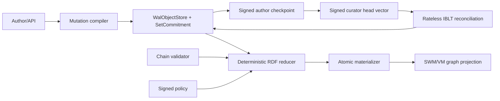
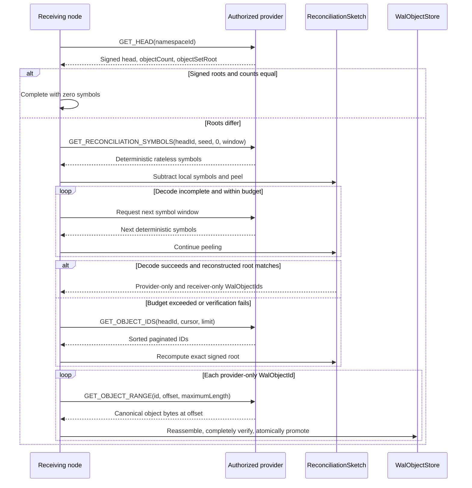
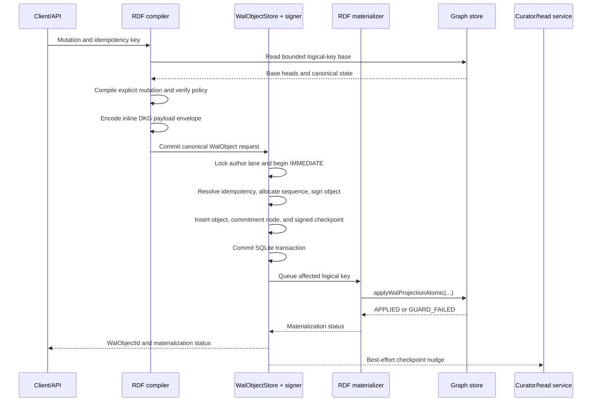
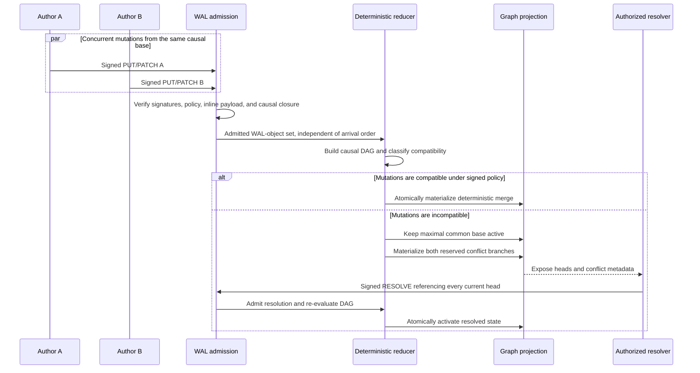
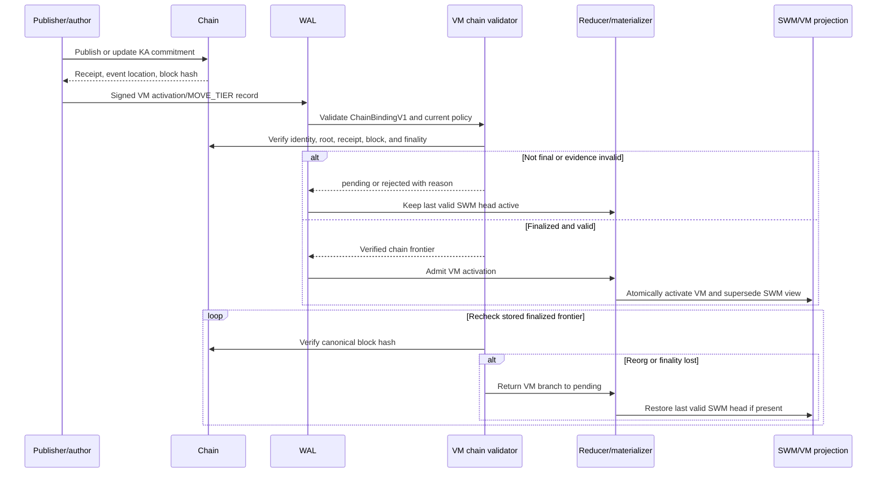
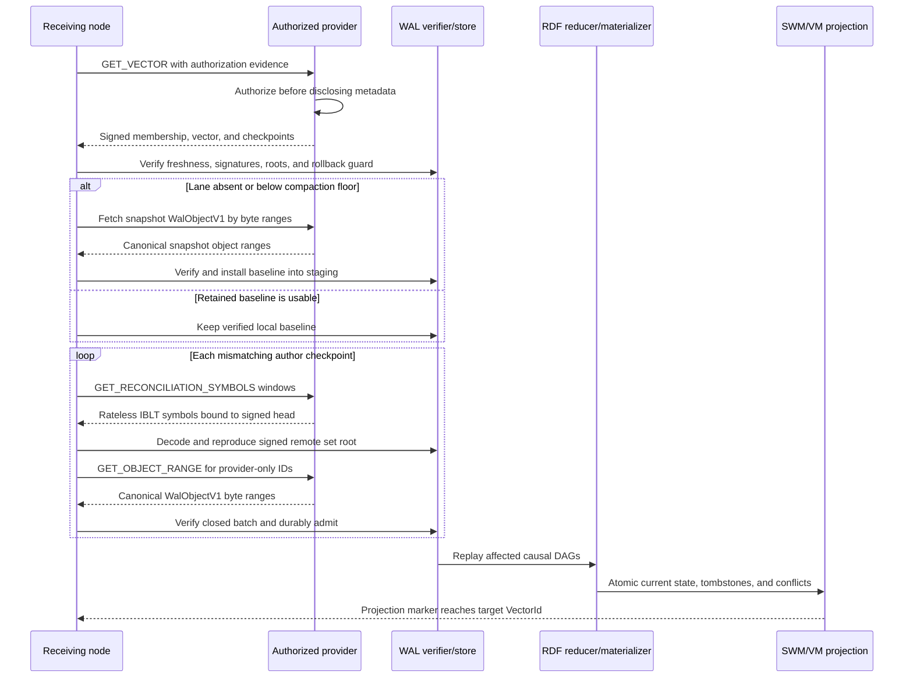
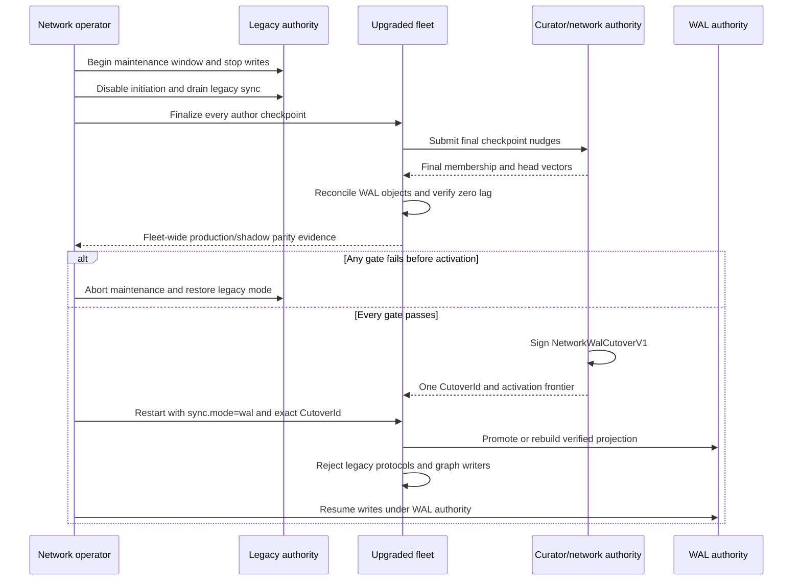

# OT-RFC-65: WAL-Replicated SWM/VM

## Abstract

This RFC replaces triplestore-level SWM/VM synchronization with a generic
write-ahead-log replication protocol. The generic protocol reconciles
authenticated sets of immutable `WalObjectId` values, transfers each missing
canonical `WalObjectV1` as resumable byte ranges, and durably admits the
complete object without knowing anything about RDF graphs or SPARQL. One
`WalObjectV1`, including its inline opaque payload bytes, is the smallest and
only durable content-addressed synchronization atom. Transfer ranges have no
independent identity or protocol lifecycle. RDF remains central to the product,
but it becomes a deterministic projection: a versioned adapter compiles
eligible local SPARQL mutations into canonical opaque payload bytes, validates
causal and policy preconditions, retains incompatible branches, and atomically
materializes accepted state into SWM/VM query graphs.

Each author signs its own WAL records and checkpoints. A curator signs
membership and bounded-freshness vectors naming the exact author checkpoints a
complete replica must hold, while the chain remains authoritative for VM
identity and finality. Serving peers are untrusted caches. Pull-based set
reconciliation is the correctness path; gossip is only a latency hint. Private
authorization is checked before disclosing roots, IDs, sizes, proofs, or bytes,
and private payloads remain encrypted under the existing membership key model.

Protocol version 1 fixes exact-arity deterministic CBOR tuples, BLAKE3 object
identities, a signed deterministic set commitment, rateless IBLT reconciliation
over 32-byte `WalObjectId` values, bounded deterministic full-ID fallback,
whole-object range transfer, three raw libp2p protocol families, durable SQLite
WAL control state, and an atomic RDF materializer contract. The transport
design takes inspiration from Iroh's separation of content identity, provider
choice, resumable byte transfer, and transport path selection, but does not
require an Iroh runtime. IBLT decoding discovers differences efficiently; it is
never accepted as the authenticated completeness proof.

Crash recovery, reconnect, late join, backfill, and projection rebuild all use
the same admission and replay path. A receiver either reconciles retained WAL
records or installs an authenticated author snapshot and then reconciles the
post-snapshot delta. Existing SWM/VM data enters through a signed genesis
barrier; this preserves current authenticated state but does not invent causal
history for mutations that predate the WAL.

Deployment is deliberately parallel but authority is not. The existing graph
path remains production-authoritative while the complete WAL protocol runs in
shadow across the upgraded fleet. After fleet-wide parity, failure, security,
rebuild, and throughput gates pass, one signed network cutover disables legacy
sync and makes WAL the only write authority. There is no per-collection mixed
authority or live legacy fallback after writes resume. A separate companion
document compares this design with OT-RFC-64 / OriginTrail dkgv10-spec PR #144.

## 0. Decision

Build a complete WAL replication protocol beside the current graph-sync stack.
The current stack remains authoritative while both systems run in parallel.
After the WAL path passes the acceptance gates, pause writes, sign one network
cutover manifest, switch every collection and node to WAL authority, and disable
the legacy sync handlers. There is no per-collection gradual migration, no
mixed authoritative mode, and no live legacy fallback after cutover.

The permanent boundary is:

> Reconcile and replicate complete authenticated immutable WAL objects. Treat
> their inline payload as opaque bytes and RDF graphs as a deterministic,
> rebuildable query projection.

The WAL proves what was committed. The graph adapter validates RDF semantics and
materializes query state. A graph database is still central to the product, but
it is no longer required to prove replication history or completeness.

## 1. Scope

### Goals

- Store-independent synchronization for SWM and VM.
- Network work proportional to the symmetric difference and missing WAL-object
  bytes, not all stored graphs.
- Exact replay after crashes, source changes, deletion, expiry, and late join.
- One admission and reducer path for local writes, live delivery, reconnect,
  recovery, and rebuild.
- Deterministic graph projection and explicit conflict retention.
- Existing DKG membership, private-content, authorship, and chain-finality rules.
- A full parallel implementation followed by one hard cutover.

### Measurable success criteria

The WAL path is successful only when it preserves existing DKG semantics and
meets the following objective gates. Implementation completion by itself is not
a success criterion.

For reconciliation measurements:

- `N` is the total committed WAL-object count in the compared namespaces;
- `k` is the cardinality of the `WalObjectId` symmetric difference;
- `b` is the total canonical byte length of remote-only WAL objects.

| Goal | Measurement | Required result before cutover |
|---|---|---|
| **SWM/VM semantic compatibility** | Replay the existing publish, share, update, delete, expiry, membership, private-access, VM-finality, and reorg golden corpus through both paths. Compare authorization decisions, active/conflict state digests, canonical RDF, API-visible lifecycle state, and VM status. | 100% identical results for all previously defined behavior. Zero unexplained divergence during a seven-day full-fleet shadow soak covering at least 1,000,000 accepted mutations and every supported mutation type. |
| **Existing crypto compatibility** | Run the existing author, curator, membership, Sender Key, KA-root, receipt, and chain-validation vectors through the adapter boundary. | 100% of valid vectors remain valid and 100% of invalid vectors remain rejected. The WAL layer must not independently redefine membership, decryption authority, KA identity, or VM finality. |
| **Exact convergence** | Reconcile healthy replicas from equal, partially missing, opposite-arrival, stale-peer, snapshot, and genesis states. Compare checkpoint IDs, object roots/counts, admitted object IDs, projection markers, active-state digests, and conflict digests. | Every authorized healthy replica reaches the exact signed target vector with zero missing WAL objects and identical projection/conflict digests. An IBLT decode alone never satisfies this gate; the decoded remote set must reproduce the signed target commitment. |
| **Equal-set cost** | Start with current cached membership/checkpoints and equal object-set roots for `N = 10^4`, `10^5`, and `10^6`. | After the signed head exchange: zero IBLT symbols, ID enumeration, WAL-object transfer, and triplestore enumeration. Cost must not grow with stored graph count. |
| **Delta-proportional work** | Hold `k` and `b` fixed while increasing `N` from `10^4` to `10^6`, using the same differing IDs and object bytes. | Transferred WAL-object bytes remain exactly constant; rateless reconciliation bytes increase by no more than 50%; cached symbol generation does not rescan RDF or rebuild the full set per peer; triplestore enumeration remains zero. |
| **Backfill and rebuild** | Test empty join, below-compaction-floor join, genesis bootstrap, and projection-only rebuild against the same signed target. | 100% exact target-root and projection parity; zero deleted/expired-state resurrection; no graph enumeration during network backfill; a locally complete WAL rebuild performs zero network payload transfer. Backfill p95 duration must be no worse than the current full graph-sync baseline on the same data and link. |
| **Interrupted transfer efficiency** | Interrupt each WAL-object stream after every negotiated range boundary and at randomized positions inside a range; resume from the same and another provider. | Zero durably recorded complete ranges are retransmitted and at most one in-flight range is retransmitted per interruption. No range has an independent content identity. The complete reconstructed canonical object must match `WalObjectId`, signature, arity, and canonicality before atomic promotion. |
| **Crash safety** | Inject a process crash at every durable boundary listed in the acceptance tests, with at least 100 randomized runs per boundary. | Zero partial canonical projections, lost acknowledged records, false `complete` states, or manual repairs. Every restart converges automatically to the old projection plus pending replay or the fully committed new projection. |
| **Conflict determinism** | Replay every conflict fixture under all WAL-object-arrival permutations and provider orders. | 100% identical active-head, state, and conflict digests. No incompatible branch is silently discarded, and no `WalObjectId` ordering is used as a winner rule. |
| **Private-data non-disclosure** | Exercise unauthenticated, removed-member, stale-policy, wrong-view, wrong-key-epoch, downgrade, proof-probing, and malformed requests. | Zero private roots, counts, IDs, sizes, proofs, ciphertext, or plaintext disclosed beyond a uniform denial response; zero unauthorized projection activation. |
| **VM safety** | Exercise valid, premature, substituted, reverted, and reorged VM evidence using the existing chain-validation corpus. | Zero VM activations without current identity/root/receipt/finality validation; 100% deterministic return to pending and restoration of the last valid SWM state after simulated reorg evidence. |
| **Write-path overhead** | Compare legacy-authoritative and shadow-WAL local writes on identical hardware, data, durability settings, and workloads. | WAL shadowing adds no more than 20% to p95 publish/share latency, 30% to p99 latency, and 25% to peak daemon RSS or CPU seconds. No graph call occurs inside the WAL SQLite transaction. |
| **Operational diagnosis** | Force every readiness state and failure reason through API and restart. | 100% of non-complete collections expose the expected checkpoint, local root/count, exact missing objects/ranges, IBLT decode/fallback state, materialization lag, freshness source, retry state, and stable reason code. No internally known failure is reported as `complete`. |
| **Hard-cutover safety** | Rehearse the maintenance barrier, final reconciliation, signed cutover, restart, late-node return, and pre-activation abort on the full deployment inventory. | 100% of authoritative nodes persist and load the same `CutoverId`; zero legacy protocol handlers or direct graph writers remain after activation; a missing/mismatched ID fails closed; every pre-activation abort returns to legacy authority without accepting WAL-authoritative writes. |

Performance comparisons must use the same hardware, network shaping, dataset,
roster, chain snapshot, adapter version, durability settings, and fault schedule.
Run each performance profile at least three times and report median, p95, p99,
bytes, request counts, CPU seconds, peak RSS, and triplestore operations. A pass
may not be claimed from a faster environment or a smaller workload than its
legacy baseline.

### Non-goals

- No total order or consensus across independent authors.
- No remote execution of arbitrary SPARQL text.
- No wall-clock last-write-wins.
- No replication of database-engine WAL files.
- No Iroh runtime dependency in protocol version 1.
- No compression on the wire in protocol version 1.
- No live dual-authoritative or fallback mode after cutover.

## 2. Architecture



### Components

| Component | Responsibility |
|---|---|
| `WalObjectStore` | Durable complete canonical WAL objects, temporary range staging, checkpoints, vectors, idempotency, and admission state. |
| `SetCommitment` | Deterministic authenticated set commitment over `WalObjectId`; it proves target equality but is not traversed in the normal reconciliation path. |
| `ReconciliationSketch` | Deterministic rateless IBLT symbol generation, subtraction, peeling, decode verification, and bounded full-ID fallback. |
| `CollectionAuthority` | Membership, author authorization, private-view authorization, freshness vector. |
| `ReconciliationDriver` | Compare signed heads, stream IBLT symbols, fetch complete objects by ranges, and admit closed batches. |
| `RdfReducer` | Compute active heads, state, conflicts, deletion, expiry, and tier transitions. |
| `RdfMaterializer` | Atomically apply one logical-key projection and its WAL marker. |
| `VmChainValidator` | Verify KA identity, root, version, receipt, finality, and reorg status. |

### Authority

- An author signs its records and author checkpoints.
- The curator signs membership and bounded-freshness head vectors.
- The chain remains authoritative for VM identity and finality.
- Serving peers are untrusted caches.
- The WAL-object set is replicated truth.
- RDF is the validated query projection of that truth.

## 3. Required invariants

1. **Immutable identity:** one `WalObjectId` names exactly one complete
   canonical signed `WalObjectV1`. No payload, range, or chunk has a separate
   synchronization identity.
2. **Authorization before disclosure:** private roots, IDs, sizes, proofs, and
   bytes are returned only after current membership authorization.
3. **Explicit completeness:** synchronization targets the exact author
   checkpoints named by a valid curator vector, never a provider's incidental
   local inventory.
4. **Pull is correctness:** gossip and push only reduce latency.
5. **WAL before RDF:** complete verified WAL objects are durable before
   materialization.
6. **Deterministic projection:** identical admitted sets, policy, adapter
   version, and finalized chain view produce identical active state and
   conflicts.
7. **Deletion is an object:** absence from a response never means deletion.
8. **No silent conflict loss:** incompatible concurrent heads remain visible
   until an authorized signed resolution references all of them.
9. **Bounded resources:** every frame, IBLT symbol window, decode result, range,
   object, batch, queue, temporary file, and conflict fan-out has an explicit
   admission limit.
10. **One authoritative switch:** before cutover the legacy path owns production;
    after cutover the WAL path owns production.

## 4. Canonical encoding, hashes, and signatures

### 4.1 Control encoding

All WAL objects, checkpoints, vectors, manifests, and protocol control frames
use RFC 8949 deterministic CBOR with this profile:

- exact-arity arrays/tuples for every normative signed, hashed, and wire object;
- definite-length arrays, strings, and byte strings;
- shortest integer representation;
- UTF-8 strings normalized to NFC;
- no maps, floats, tags, or indefinite lengths in normative protocol objects;
- set-like arrays sorted lexicographically by their canonical bytes and deduped;
- a decoder rejects non-canonical bytes instead of re-encoding them;
- missing or extra tuple positions are rejected;
- an optional position is present as CBOR `null`; changing tuple shape requires
  a new object version.

IDs are raw 32-byte values on the wire. Addresses are raw 20-byte EVM
addresses. Counters are unsigned 64-bit integers.

### 4.2 Signatures

Protocol version 1 reuses the current DKG agent/curator secp256k1 authority.

```text
objectDigest = BLAKE3("dkg-wal-object-sign-v1\0" || canonicalUnsignedWalObject)
checkpointDigest = BLAKE3("dkg-wal-checkpoint-sign-v1\0" || canonicalUnsignedCheckpoint)
membershipDigest = BLAKE3("dkg-wal-membership-sign-v1\0" || canonicalUnsignedMembership)
vectorDigest = BLAKE3("dkg-wal-vector-sign-v1\0" || canonicalUnsignedVector)
cutoverDigest = BLAKE3("dkg-wal-cutover-sign-v1\0" || canonicalUnsignedCutover)
signature = EIP191_secp256k1_sign(the corresponding 32-byte digest)
```

Signatures are exactly 65 bytes, recoverable, low-S, and use normalized recovery
bits. Verification recovers the signer address and compares it with the signed
author or curator field.

### 4.3 Object IDs

```text
WalObjectId = BLAKE3("dkg-wal-object-v1\0" || canonicalSignedWalObject)
MembershipCheckpointId = BLAKE3("dkg-wal-membership-v1\0" || canonicalSignedMembership)
CheckpointId = BLAKE3("dkg-wal-checkpoint-v1\0" || canonicalSignedCheckpoint)
VectorId = BLAKE3("dkg-wal-vector-v1\0" || canonicalSignedVector)
CutoverId = BLAKE3("dkg-wal-cutover-v1\0" || canonicalSignedCutover)
```

## 5. Namespace and disclosure views

The generic replication protocol sees only a 32-byte `namespaceId`. DKG maps
its disclosure views to namespaces before crossing the adapter boundary so a
public VM peer cannot learn private SWM object IDs or activity counts.

```text
ReplicationViewKeyV1 = [
  networkId,
  contextGraphId,
  subGraphNameOrNull,
  tier,
  visibility,
  policyEpoch,
  keyEpochOrNull
]

namespaceId = BLAKE3(
  "dkg-wal-namespace-v1\0" || canonicalCBOR(ReplicationViewKeyV1)
)
```

A private request is authorized for one exact view. A member may reconcile
several views, but roots are never merged across visibility or key epochs.
`MOVE_TIER` links source and target namespaces inside adapter-owned payload
bytes without making them one disclosure set. Generic discovery,
reconciliation, and object transfer route only by `namespaceId`.

## 6. Protocol objects

### 6.1 `WalObjectV1`

```text
WalObjectV1 = [
  version,                    // 1
  namespaceId,                // bytes32
  writerId,                   // bytes20 in the v1 DKG secp256k1 profile
  writerEpoch,                // u64
  sequence,                   // u64
  previousObjectIdOrNull,     // WalObjectId | null
  payloadBytes,               // bytes, opaque to generic WAL
  signature                   // bytes65
]
```

Rules:

- The first seven positions form `canonicalUnsignedWalObject`; `signature`
  signs its domain-separated digest from section 4.
- `WalObjectId` hashes the complete eight-position canonical tuple, including
  the signature.
- `sequence` is monotonic within `(namespaceId, writerId, writerEpoch)` but does
  not order different writers.
- `previousObjectIdOrNull` names the immediately preceding object in that writer
  epoch. It is null only for the first object of an epoch.
- `payloadBytes` is inline. It has no `PayloadId`, `BlobId`, range ID, chunk ID,
  separate set membership, or independent fetch method.
- The generic WAL layer does not decode `payloadBytes`. Graph, RDF, SPARQL,
  SWM/VM, policy, chain, conflict, snapshot, and deletion fields are forbidden
  from the generic tuple and belong to the DKG adapter payload.
- Every WAL object has exactly this shape regardless of application operation.
  A missing or extra position, map representation, or alternate field order is
  rejected.
- An object is advertisable only after its complete canonical bytes and writer
  checkpoint are durable.

### 6.2 Adapter-owned payload envelope

DKG payloads use an exact-arity envelope entirely inside `payloadBytes`:

```text
DkgPayloadEnvelopeV1 = [
  version,                    // 1
  payloadKind,                // MUTATION | MOVE_TIER | SNAPSHOT | POLICY | GENESIS
  codec,                      // deterministic-cbor-v1
  mediaType,
  encryptionOrNull,
  contentBytes                // canonical plaintext or ciphertext
]

EncryptionDescriptorV1 = [
  algorithm,                  // AES-256-GCM in v1
  keyEpoch,
  nonce,
  associatedDataDigest
]
```

The envelope is signed indirectly because it is part of `WalObjectV1`. It has
no independent generic-WAL identity. For private payloads, `contentBytes` is
ciphertext and the associated data binds the namespace, writer, epoch,
sequence, envelope version, codec, media type, key epoch, and nonce.

### 6.3 DKG mutation payload

The DKG adapter decodes mutation content as:

```text
DkgMutationV1 = [
  version,
  operation,                  // PUT | DELETE | MOVE_TIER | RESOLVE | SNAPSHOT
  logicalKey,
  parents,                    // sorted unique WalObjectId[]
  baseHeads,                  // sorted unique WalObjectId[]
  policyObjectId,
  rdfMutationOrNull,
  chainBindingOrNull,
  nonConsensusTimestampMsOrNull
]
```

These positions are application semantics, not generic replication metadata.
`DELETE` contains a deterministic deletion mutation, `RESOLVE` references every
conflicting active head, and VM activation requires `chainBindingOrNull` to be
non-null.

### 6.4 RDF logical key

```text
logicalKey = BLAKE3(
  "dkg-rdf-logical-key-v1\0" || deterministicCBOR([
    contextGraphId,
    subGraphName,
    authorAddress,
    knowledgeAssetUal | rootEntity
  ])
)
```

Author scope is deliberate. Shared-write keys require a signed policy that
names the allowed writers and conflict resolvers.

### 6.5 `RdfMutationV1`

The `rdfMutationOrNull` position contains this exact-arity adapter tuple:

```text
RdfMutationV1 = [
  version,
  mode,                       // REPLACE | PATCH | DELETE
  baseStateDigest,
  resultStateDigest,
  replaceGraphs,              // [[graphIri, canonicalNQuadsBytes, quadCount]]
  replaceSubjects,            // [[graphIri, subjectIri, canonicalNQuadsBytes, quadCount]]
  deleteNQuadsBytesOrNull,
  insertNQuadsBytesOrNull,
  touchedKeys,                // [[graphIri, subjectIri, predicateIri]]
  sourceSparqlAuditDigestOrNull
]
```

- `REPLACE` may replace exact graphs and exact metadata subjects in one logical
  operation. It is the default for graph-scoped KAs.
- `PATCH` contains explicit canonical deletes and inserts. Remote nodes never
  execute the source SPARQL.
- `DELETE` makes the logical key inactive but retains its tombstone.
- The reducer recomputes and verifies touched keys and state digests.
- A concurrent `REPLACE` conflicts with every incomparable mutation of the same
  logical key.

All RDF bytes are inline within the enclosing WAL object. Large canonical
datasets therefore produce large WAL objects and use the same whole-object range
transport as every other object; they do not create a second synchronization
atom.

### 6.6 `MoveTierV1`

```text
MoveTierV1 = [
  sourceNamespaceCommitment,
  targetNamespaceId,
  targetMutation
]
```

The source SWM state remains in the WAL. The active view marks it superseded only
when VM validation reaches the configured finalized chain frontier. A public
target object does not expose private source IDs; authorized private peers may
open `sourceNamespaceCommitment` through the source namespace policy.

### 6.7 `ChainBindingV1`

```text
ChainBindingV1 = [
  chainId,
  contextGraphOnChainId,
  kaId,
  assertionVersion,
  merkleRoot,
  transactionHash,
  blockNumber,
  blockHash,
  transactionIndex,
  logIndex,
  eventType,
  requiredFinalityBlocks
]
```

### 6.8 `AuthorCheckpointV1`

```text
AuthorCheckpointV1 = [
  version,
  namespaceId,
  writerId,
  writerEpoch,
  checkpointNumber,
  setCommitmentVersion,
  objectSetRoot,
  objectCount,
  maxSequence,
  previousCheckpointIdOrNull,
  baselineSnapshotObjectIdOrNull,
  compactionFloor,
  signature
]
```

Protocol version 1 creates one checkpoint in the same local transaction that
finalizes each authored object. This favors simple semantics over signature
batching. A later protocol may batch checkpoints without changing WAL-object
IDs.

Within one author epoch, every newer checkpoint must be a set extension. History
may be cut only by a new epoch whose first record is an author-signed snapshot.

### 6.9 `MembershipCheckpointV1`

```text
MembershipCheckpointV1 = [
  version,
  collection,
  checkpointNumber,
  policyEpoch,
  publishMode,
  writerIds,
  memberAgentAddresses,
  allowedPeerIds,
  activeNamespaceIds,
  rdfPolicyObjectId,
  previousMembershipCheckpointIdOrNull,
  issuedAtMs,
  signatureByCurator
]
```

Arrays are sorted and unique. Curated views admit records only from listed
authors. Private disclosure requires a listed member agent or a policy-valid
delegation bound to the transport peer. `OPEN` permits a new public author only
when its record carries valid chain authorization; the next head vector must
index that author before the collection can report `complete`.

### 6.10 `CollectionHeadVectorV1`

```text
CollectionHeadVectorV1 = [
  version,
  collection,
  membershipCheckpointId,
  expectedNamespaces,         // [[namespaceId, [[writerId, checkpointId]]]]
  vectorEpoch,
  vectorNumber,
  issuedAtMs,
  expiresAtMs,
  finalizedChainFrontierOrNull,
  signatureByCurator
]
```

`expectedNamespaces` is sorted by namespace ID; each writer list is sorted by
writer ID and unique.

Defaults:

- curator issues immediately after a valid author-checkpoint nudge or every 5
  seconds, whichever occurs first;
- vector validity is 60 seconds;
- accepted local clock skew is 5 seconds;
- the highest accepted `(epoch, number, hash)` is stored in a rollback guard
  outside graph and WAL snapshot restore domains;
- an expired or rolled-back vector yields `unknown-freshness`;
- private roots are not served under `unknown-freshness`.

For an open public CG, chain-valid authors may create new lanes. Their state is
not reported complete until a newer curator vector includes their checkpoint.
The curator indexes freshness; it does not become the content author.

### 6.11 `NetworkWalCutoverV1`

```text
NetworkWalCutoverV1 = [
  version,
  networkId,
  walProtocolVersion,
  rdfAdapterVersion,
  requiredNodeVersion,
  collectionVectorManifestObjectId,
  cutoverEpoch,
  activation,
  legacySyncDisabled,
  signatureByNetworkAuthority
]
```

The manifest object is an ordinary `WalObjectV1` whose adapter payload contains
the sorted complete list of `[collection, vectorId]` entries covered by the
cutover. Every node must start WAL-authoritative mode with the same `CutoverId`.
Mixed legacy/WAL authority is rejected.

## 7. Whole-object format and resumable range transfer

`WalObjectV1` is the only durable transferred content object. Its canonical
CBOR byte string may be streamed in ranges, but a range is only ephemeral wire
framing and local staging progress.

```text
GetWalObjectRangeV1 = [
  walObjectId,
  offset,
  maximumLength
]

WalObjectRangeV1 = [
  walObjectId,
  totalObjectLength,
  offset,
  bytes
]
```

The offset addresses the complete canonical `WalObjectV1` encoding, including
tuple headers, inline payload, and signature. It never addresses an independent
payload object. Responses are idempotent for the same object ID and byte range.

A receiver:

1. validates `totalObjectLength`, offset arithmetic, negotiated range length,
   staging quota, and concurrency before allocating or extending a file;
2. writes received ranges to quota-controlled temporary storage and records a
   local resume bitmap keyed by `(WalObjectId, offset, length)`;
3. may retry, reorder, overlap, or fetch missing ranges from different
   authorized providers;
4. does not expose or admit any partial object;
5. after all bytes arrive, parses the exact tuple, rejects non-canonical CBOR,
   recomputes `WalObjectId`, verifies the writer signature and sequence link,
   fsyncs the object, atomically renames it to the final ID path, fsyncs the
   parent directory, and only then marks it complete.

Ranges have no independent hash, signature, set membership, durable protocol
identity, or semantic representation. Authenticated encrypted transport
protects in-flight bytes, while the complete object ID and signature provide
end-to-end acceptance. Bytes from a provider that fail complete-object
verification are discarded and the provider is penalized or quarantined.

Large objects are valid. Implementations must stream them without buffering the
complete payload in memory and must interleave range scheduling so one large
object cannot starve smaller objects. Network policy and capability negotiation
set the maximum accepted object length and temporary-disk budget; those limits
must not be implemented by inventing content-addressed sub-objects. Protocol v1
intentionally provides no sub-object deduplication or independent
pre-completion content verification. Adding either requires a later protocol
version and a new synchronization-atom decision.

## 8. Rateless IBLT set reconciliation

### 8.1 Authenticated set commitment

Each author checkpoint commits to the exact set of `WalObjectId` values. The
commitment is a deterministic 16-way radix Merkle root used for authentication,
equality checks, local incremental maintenance, and final decode verification;
normal reconciliation does not traverse it over the wire.

- leaf capacity: 256 IDs;
- IDs inside a leaf are sorted and unique;
- a leaf that exceeds capacity splits by the next nibble;
- maximum depth: 64;
- the empty-set root is `BLAKE3("dkg-wal-set-empty-v1\0")`.

```text
leafHash = BLAKE3(
  "dkg-wal-set-leaf-v1\0" ||
  u8(prefixNibbleLength) || packedPrefix || u64be(count) || concat(sortedIds)
)

branchHash = BLAKE3(
  "dkg-wal-set-branch-v1\0" ||
  u8(prefixNibbleLength) || packedPrefix || u16be(childBitmap) ||
  concat(u8(nibble), u64be(childCount), childHash in nibble order)
)
```

The commitment is not another synchronization atom. It is a signed statement
about the set named by an author checkpoint. Equality of signed `(objectCount,
objectSetRoot)` values completes reconciliation without transmitting any IBLT
symbols.

### 8.2 Rateless difference discovery

When signed roots differ, protocol v1 uses a rateless Invertible Bloom Lookup
Table (IBLT) over fixed 32-byte `WalObjectId` keys. Both peers deterministically
encode the compared sets with the same profile and seed. The receiver subtracts
its local symbols from the provider's symbols: common IDs cancel and peeling
recovers provider-only and receiver-only IDs.

```text
ReconciliationSymbolV1 = [
  symbolIndex,
  count,                 // signed i64
  idXor,                 // bytes32
  checksumXor            // bytes32
]

idChecksum = BLAKE3(
  "dkg-wal-iblt-check-v1\0" || reconciliationSeed || walObjectId
)

reconciliationSeed = BLAKE3(
  "dkg-wal-iblt-seed-v1\0" ||
  localHeadId || remoteHeadId || requesterNonce
)
```

The requester chooses `requesterNonce` only after receiving the provider's
signed immutable head. The normative symbol-membership schedule, degree
distribution, peeling order, integer encoding, overflow behavior, and checksum
test are fixed by the `ProtocolV1IbltReconciliationAlgorithm` conformance
vectors before independent implementations are accepted. This name identifies
a normative algorithm, not a protocol object or synchronization atom. A
provider can generate and cache the same deterministic symbol stream once per
`(headId, reconciliationSeed)` and serve any requested contiguous window.

The following rule is normative:

> The IBLT reconciliation algorithm, its parameters, symbols, local
> set-commitment nodes, byte-range frames, and local progress records are
> control-plane or implementation data, not synchronization atoms. They MUST
> NOT receive content IDs, become members of the reconciled content set, be
> admitted to `WalObjectStore`, or acquire an independent synchronization
> lifecycle. Only `WalObjectId` values are elements of the reconciled content
> set, and only a complete canonical `WalObjectV1` is fetched and admitted as
> synchronized content.

An implementation may cache symbols, commitment nodes, or transfer progress
locally, including across restart, but that cache is disposable and has no
protocol-visible identity or authority.

The receiver initially requests a bounded symbol window, subtracts its local
contribution, and peels pure symbols. If decoding does not complete, it requests
the next window and continues without restarting. A decode is successful only
when all of the following hold:

1. every residual symbol is zero after peeling;
2. every pure symbol passes the domain-separated checksum;
3. decoded IDs are unique, direction-tagged, and within negotiated limits;
4. applying receiver-only removals and provider-only additions to a temporary
   copy of the receiver's set reproduces the provider's signed object count and
   set root exactly.

IBLT decode success alone is never a completeness proof. A checksum collision,
malformed symbol, residual core, arithmetic overflow, root mismatch, or count
mismatch is a failed reconciliation attempt, never a partial success.

### 8.3 Bounded fallback and backfill

If decoding exceeds the negotiated symbol, CPU, memory, or elapsed-time budget,
the receiver switches provider or uses `GET_OBJECT_IDS`, a deterministic sorted
and paginated enumeration bound to the signed head. The receiver accepts the
enumeration only after receiving exactly the signed count and recomputing the
signed set root. An empty-node backfill may select enumeration immediately
because its symmetric difference is the entire retained set; IBLT cannot make
that information-theoretic cost disappear.

IBLT is therefore the normal delta path, while full enumeration is the bounded
decode-failure and large-backfill path. Neither path enumerates RDF or inspects
payload bytes.

### 8.4 Reconciliation sequence



## 9. Transport protocol

Version 1 uses the existing raw libp2p `ProtocolRouter`, not the reliable-message
outbox. All control messages are deterministic CBOR frames with an unsigned
varint length prefix and a 1 MiB maximum frame.

```text
/dkg/10.1.0/wal-control
/dkg/10.1.0/wal-reconcile
/dkg/10.1.0/wal-object
```

### Iroh-inspired transport properties

Protocol version 1 does not depend on the Iroh runtime, but deliberately adopts
the following design properties from Iroh's content and connectivity model:

- stable cryptographic peer identity and authenticated encrypted transport;
- content identity independent of the peer or path serving it;
- metadata reconciliation separated from whole-object byte transfer;
- resumable range transfer with complete-object verification before admission;
- provider switching without changing object identity or correctness;
- direct paths when available and relay paths as an availability mechanism;
- live discovery or gossip as hints, never the durable completeness proof.

The existing libp2p router supplies the version-1 byte streams. A future Iroh
endpoint or another transport may implement the same framed protocols if it
preserves identity binding, authorization-before-disclosure, limits, and exact
byte/proof semantics. Iroh does not supply DKG membership, curator freshness,
WAL admission, RDF conflict handling, VM chain validation, or private key
policy; those remain protocol and adapter responsibilities defined here.

### Requests

Provider discovery is replaceable and outside these three protocol families. A
node may use configured peers, libp2p routing, rendezvous, or authorized
provider advertisements. Discovery results are untrusted candidates; protocol
negotiation, identity binding, authorization, signed heads, and object
verification establish correctness.

Every request uses this outer shape:

```text
FrameV1 = [protocolVersion, messageType, requestId, body]
```

The unsigned-varint prefix is the canonical CBOR frame length. Every request
body binds:

- `requestId` of 16 random bytes;
- `issuedAtMs` with a 90-second maximum age;
- requester and target peer IDs;
- exact `namespaceId`;
- optional requester agent and identity proof;
- the current private-view membership proof when required.

Private authorization reuses the existing agent, delegation, and membership
rules. Replay IDs are cached for the request freshness window. Authorization is
performed before returning a head vector, checkpoint, object root, count, IBLT
symbol, ID, object length, or object byte.

### Message families

| Protocol | Request | Response |
|---|---|---|
| `wal-control` | `GET_CAPABILITIES`, `GET_HEAD`, `GET_VECTOR`, `GET_CHECKPOINT`, `ANNOUNCE_HEAD`, `CANCEL` | Version/limit negotiation, signed completeness statements, optional nudge, cancellation, or uniform denial. |
| `wal-reconcile` | `GET_RECONCILIATION_SYMBOLS`, `GET_OBJECT_IDS` | Deterministic symbol window or bounded sorted fallback page, each bound to one signed head. |
| `wal-object` | `GET_OBJECT_RANGE` | One ephemeral byte range of the complete canonical `WalObjectV1`. |

Responses echo `requestId`. A provider may be switched at any request boundary
because correctness is verified by signed roots and WAL-object IDs, not by
provider session state. `ANNOUNCE_HEAD` is only a latency hint; dropping every
nudge must not prevent pull-based convergence. `ERROR` is a common bounded
response with stable codes for unsupported version, unauthorized, stale head,
invalid range, resource limit, cancelled, and internal unavailable states.

## 10. Durable storage implementation

### 10.1 SQLite

Use a dedicated SQLite database with:

```text
PRAGMA journal_mode=WAL;
PRAGMA synchronous=FULL;
PRAGMA foreign_keys=ON;
```

Minimum tables:

| Table | Purpose |
|---|---|
| `wal_objects` | Complete canonical signed bytes, object path, length, and decoded generic index fields. |
| `object_ranges` | Local-only temporary range progress, file path, length, provider history, and expiry. |
| `author_lanes` | Next sequence, checkpoint number, current set root/count. |
| `set_commitment_nodes` | Persistent local nodes for incremental authenticated set-root maintenance. |
| `iblt_cache` | Bounded deterministic symbol cache keyed by signed head and reconciliation seed. |
| `checkpoints` | Canonical signed author checkpoints. |
| `vectors` | Verified curator vectors and current expected heads. |
| `idempotency` | `(namespace, writer, key) -> requestDigest, WalObjectId, status`. |
| `admission` | Proof, closure, validation, quarantine, and reason state. |
| `materialization` | Per-logical-key desired and applied head/state digests. |
| `peer_state` | Provider success, failures, backoff, and availability hints. |

The rollback-resistant vector high-water is stored in a separate small SQLite
file excluded from WAL, graph, and snapshot restores.

### 10.2 Local write transaction

1. Compile the request to canonical mutation and policy-bound metadata.
2. Encode the complete adapter envelope as inline `payloadBytes`.
3. Acquire the per-writer lane mutex.
4. Begin `IMMEDIATE` SQLite transaction.
5. Resolve the idempotency key. A repeated key with another request digest is an
   error; the same digest returns the existing WAL object.
6. Allocate `sequence` and bind `previousObjectIdOrNull`.
7. Build and sign the complete canonical `WalObjectV1`.
8. Insert the object and update the persistent set commitment.
9. Build and sign the new writer checkpoint.
10. Update the writer lane and idempotency mapping.
11. Commit.
12. Fsync and atomically promote the canonical object file before reporting it
    advertisable.
13. Materialize the logical key synchronously or return
    `materialization-pending` with the durable `WalObjectId`.
14. Send a best-effort checkpoint nudge.

The SQLite transaction remains open while signing. No network or graph call may
occur inside it.



### 10.3 Remote admission transaction

A fetched WAL object remains staged until:

- checkpoint signature and set inclusion are verified;
- complete object bytes, ID, writer signature, policy, and namespace are valid;
- canonical tuple arity and inline payload-envelope bounds are valid;
- ordinary parents and base heads are available;
- cross-author references are allowed by policy and available in the expected
  vector closure;
- private ciphertext authenticates and decrypts for an authorized local member;
- configured limits are satisfied.

The admission transaction inserts the closed WAL-object set and queues affected
logical keys. Invalid objects are retained only in bounded quarantine storage
with a stable reason code.

## 11. RDF canonicalization and compiler

### 11.1 Canonical N-Quads

- UTF-8 with LF line endings;
- one quad per line;
- absolute IRIs only for subject, predicate, and graph;
- blank nodes are rejected; DKG skolem IRIs are required;
- RDF 1.1 N-Quads escaping;
- language tags lowercase;
- duplicate quads removed;
- full lines sorted by unsigned UTF-8 byte order.

```text
stateDigest = BLAKE3(
  "dkg-rdf-state-v1\0" || concat(canonicalSortedNQuads)
)
```

### 11.2 Accepted local SPARQL subset

The local API may accept:

- `INSERT DATA`;
- `DELETE DATA`;
- bounded `DELETE/INSERT WHERE` scoped to one declared logical key and exact
  adapter-owned graphs.

The compiler rejects:

- `SERVICE`, `LOAD`, `CLEAR ALL`, `DROP ALL`, `COPY`, `MOVE`, and `ADD`;
- time, randomness, UUID, or implementation-specific functions;
- graph variables that can escape the declared logical key;
- reads from unrelated local graphs;
- mutations whose explicit result exceeds policy limits.

The compiler evaluates the accepted operation once against the declared base
heads and emits `RdfMutationV1`. Only explicit canonical result bytes are
replicated. Every production write path must compile successfully before
cutover.

## 12. Signed RDF policy

`policyObjectId` identifies an ordinary `WalObjectV1` whose adapter payload is
an `RdfPolicyV1` admitted by the current signed membership checkpoint.

```text
RdfPolicyV1 = [
  version,
  adapterVersion,
  allowedGraphPrefixes,
  maxQuadsPerMutation,
  maxWalObjectBytes,
  singleValuedPredicates,
  multiValuedPredicates,
  sharedWriteLogicalKeys,
  resolverAddresses,
  expiryAuthorityAddresses,
  allowedPayloadKinds
]
```

Default conflict policy is conservative:

- causal successor: apply;
- exact replay: idempotent;
- concurrent `REPLACE`: conflict;
- concurrent `PATCH`: merge only when touched keys are disjoint;
- different objects for one predicate merge only when policy declares the
  predicate multi-valued;
- delete-versus-update, failed precondition, incompatible tier movement, or
  chain disagreement: conflict.

General SHACL execution is not consensus logic in version 1. A future policy
version may define a deterministic SHACL subset.

## 13. Reducer and conflicts

For each logical key, the reducer builds the causal DAG from admitted WAL
objects. `WalObjectId` is only a deterministic processing tie-break, never a
winner rule.

1. Find maximal causally accepted heads.
2. Apply compatible successors and approved merges.
3. If incompatible heads exist, compute their maximal common accepted causal
   base.
4. Make only that common base active.
5. Store each incompatible branch in a reserved conflict graph.
6. Expose conflict metadata through API and system graph.
7. Accept a `RESOLVE` only when its authorized signer references every current
   conflict head and provides the complete resulting mutation.

Reserved graphs:

```text
urn:dkg:wal:projection
urn:dkg:wal:conflicts:<collection-hash>
urn:dkg:wal:conflict:<record-id>
```

Same-sequence author equivocation is retained, marks the author lane blocked,
and prevents new ambiguous state from becoming active until the curator rotates
the author epoch or an authorized governance resolution is admitted.



## 14. Atomic materialization

WAL and graph do not share a distributed transaction. Only the graph projection
operation itself must be atomic.

Each logical key has a marker in `urn:dkg:wal:projection` containing:

- adapter version;
- active-head-set digest;
- projected state digest;
- source vector ID;
- materialization status.

The storage package exposes one required capability:

```text
applyWalProjectionAtomic({
  logicalKey,
  expectedHeadDigest,
  replaceGraphs,
  replaceSubjects,
  deleteQuads,
  insertQuads,
  conflictGraphs,
  newHeadDigest,
  newStateDigest,
  vectorId
}) -> APPLIED | GUARD_FAILED
```

The backend must commit content, conflict graphs, and marker all-or-none. A lost
response is resolved by reading the marker. `GUARD_FAILED` causes reducer
recalculation and retry. Content/marker disagreement blocks readiness and forces
rebuild of that logical key.

Initial authoritative support is limited to backends that pass fault-injection
atomicity tests. Oxigraph is the reference implementation. Blazegraph becomes
eligible only after the same tests pass. A backend without this capability may
run the parallel protocol but cannot participate after cutover.

## 15. Private payloads

Reuse the existing Sender Key membership and key-package distribution. For each
private view and key epoch:

```text
objectKey = HKDF-SHA256(
  epochKey,
  salt = writerId || u64be(writerEpoch),
  info = "dkg-wal-private-object-v1\0" ||
         namespaceId || u64be(sequence)
)
```

The DKG payload envelope uses AES-256-GCM with a random 12-byte nonce. The WAL
store enforces nonce uniqueness per derived key. Associated data commits to the
namespace, writer, epoch, sequence, envelope version, payload kind, codec, media
type, key epoch, and nonce. Ciphertext, including its authentication tag, is
inline `contentBytes` inside the signed WAL object. Neither plaintext nor
ciphertext has a separately advertised content ID. Member removal rotates the
key epoch and stops future serving. It cannot revoke ciphertext or keys
previously obtained.

## 16. VM activation and reorgs

A VM record may be admitted before it is active. Activation requires the
current chain adapter to verify:

- UAL/KA identity and author;
- context-graph binding;
- Merkle root;
- assertion version/root count;
- publish or update receipt and event location;
- block hash and configured finality depth.

The materializer stores the verified chain frontier with the projection marker.
A chain watcher periodically rechecks stored block hashes. On reorg or loss of
finality, the VM branch returns to `pending`, and the reducer restores the last
valid SWM head when one exists. WAL history is never deleted by a reorg.



## 17. Deletion, expiry, snapshots, and compaction

### Deletion and expiry

- Deletion is a signed `DELETE` with causal `baseHeads`.
- Expiry is a `DELETE` signed by the owner or policy-designated expiry authority
  and bound to a signed curator vector number or finalized chain block.
- Local wall time may schedule the expiry request but may not independently hide
  state.
- Tombstones remain part of the author set or its signed snapshot baseline.

### Snapshot

An author-signed `SNAPSHOT` contains a manifest of that author's lane state. It
may reference other authors' records when preserving a shared-key conflict, but
it cannot replace their checkpoints or attest to their authorship. The manifest
contains:

- every live logical key and active head contributed by that author;
- canonical state digest and inline canonical graph bytes;
- unresolved conflicts touching those heads;
- covered checkpoint and set root;
- policy, adapter version, and VM chain frontier.

Default snapshot trigger is 100,000 authored records or 30 days, whichever
comes first. The thresholds are configurable but are signed into network policy.

### Compaction

Compaction starts a new author epoch whose first WAL object is the snapshot.
Ordinary serving of pre-snapshot objects may stop only after:

- the complete snapshot WAL object exists on the author and two additional
  authorized custodians;
- a valid curator vector references the new epoch checkpoint;
- a 30-day retention grace has elapsed.

A peer below `compactionFloor` must install and verify the snapshot before
reconciling post-snapshot records. Tombstones and conflicts are represented in
the snapshot, preventing resurrection.

### Genesis

Entering parallel mode begins with one maintenance barrier:

1. pause writes for each collection;
2. enumerate only known SWM/VM graph families;
3. canonicalize current accepted state;
4. create author-signed genesis snapshots when provenance is provable;
5. place unclaimable legacy state in a read-only `LegacyGenesisV1` lane signed
   by the network migration authority, without pretending it has an original
   author signature; this lane is quarantined from the active projection unless
   an explicit signed migration policy authorizes its visibility;
6. sign genesis checkpoints and a curator head vector;
7. resume legacy production and shadow WAL capture.

All changes after this barrier must produce WAL objects in parallel mode.

### Backfill and projection rebuild

The protocol supports state backfill, not fabrication of pre-WAL event history.
An empty, stale, or rebuilt node converges on current authenticated SWM/VM state
using one of these paths:

1. **Incremental catch-up:** when every local author checkpoint is at or above
   its compaction floor, reconcile missing `WalObjectId` values through rateless
   IBLT and fetch remote-only complete objects by byte ranges.
2. **Snapshot plus delta:** when an author lane is absent or below its floor,
   install that author's verified baseline snapshot and then reconcile all
   post-baseline records named by the current head vector.
3. **Genesis bootstrap:** when joining the parallel deployment, install the
   authenticated genesis snapshots and permitted legacy lanes, then reconcile
   every WAL object after the genesis barrier.
4. **Projection rebuild:** when verified WAL bytes are locally complete but RDF
   is missing or corrupt, discard or isolate the projection and replay the
   baseline plus accepted records through the pinned adapter version. Network
   transfer is needed only for bytes that fail local verification.



Backfill uses the same private-view authorization, encryption-epoch, policy,
VM-chain, conflict, and resource checks as live synchronization. Legacy data
whose provenance is neither author-verifiable nor migration-policy-authorized
remains quarantined. The completeness guarantee is the authenticated baseline
plus every WAL object named after it; complete mutation history before that
baseline is outside the protocol guarantee.

## 18. Parallel protocol and hard cutover

### 18.1 Parallel mode

`sync.mode = parallel` means:

- current graph sync and graph writes remain production-authoritative;
- every local eligible mutation also commits to the shadow WAL;
- the WAL protocols operate between all upgraded nodes;
- WAL records materialize into an isolated shadow store or shadow graph
  namespace;
- production queries never read shadow state;
- legacy sync results are not converted into synthetic WAL history;
- every active author must be upgraded and produce WAL records before cutover.

This is a complete parallel protocol, not a partial canary authority model.

### 18.2 Cutover gates

Cutover is allowed only when all conditions hold for every collection:

- every measurable success criterion in Section 1 has a reproducible evidence
  bundle containing workload inputs, environment, raw measurements, and digests;
- every active node and author supports the required node, protocol, and adapter
  versions;
- current vectors are valid and no collection reports `unknown-freshness`;
- all expected author set roots and counts match across the fleet;
- all target WAL objects are completely verified and durable;
- shadow materialization has no lag;
- production and shadow canonical RDF state digests match;
- conflict digests match the expected reducer result;
- every current write path compiles to WAL;
- full rebuild from genesis/snapshot plus records reproduces the shadow digest;
- crash, range-resume, provider-switch, private-auth, equivocation, deletion,
  expiry, VM-finality, and reorg tests pass;
- resource and throughput targets pass at production scale.

### 18.3 Network-wide switch

1. Announce a maintenance window and stop all writes.
2. Disable legacy gossip and sync initiation, then drain in-flight operations.
3. Finalize one author checkpoint per lane.
4. Issue final curator vectors and reconcile every node to them.
5. Verify production/shadow parity and zero materialization lag.
6. Sign `NetworkWalCutoverV1`.
7. Restart all nodes with `sync.mode = wal` and the exact `CutoverId`.
8. Promote the verified shadow projection or rebuild production from WAL.
9. Do not register legacy sync protocols or allow legacy graph writers.
10. Resume writes.

There is no live fallback. Before writes resume, the fleet may abort and return
to legacy mode. After WAL writes resume, rollback requires another maintenance
window and deterministic graph export from WAL; it is not an automatic protocol
fallback.



## 19. Implementation layout

Recommended modules:

```text
packages/wal/
  src/canonical-cbor.ts
  src/ids.ts
  src/wal-object.ts
  src/checkpoint.ts
  src/vector.ts
  src/cutover.ts
  src/wal-object-store.ts
  src/object-range-staging.ts
  src/set-commitment.ts
  src/rateless-iblt.ts
  src/reconciliation-fallback.ts
  src/authority.ts
  src/reconcile.ts
  src/protocol/*.ts

packages/agent/src/wal/
  local-commit.ts
  remote-admission.ts
  reconciliation-worker.ts
  provider-selection.ts
  status.ts

packages/storage/src/wal/
  rdf-canonical.ts
  sparql-compiler.ts
  rdf-reducer.ts
  materializer.ts
  oxigraph-materializer.ts
  conflict-projection.ts

packages/publisher/src/
  existing publish/share paths call local-commit.ts

packages/cli/src/daemon/routes/
  wal-status.ts
  wal-conflicts.ts
  wal-objects.ts
  wal-admin.ts
```

### Concurrency

- one mutex per local author lane for sequence/checkpoint finalization;
- one mutex per logical key for reduction/materialization;
- maximum four reconciliation streams per peer;
- maximum two WAL-object range streams per namespace and peer;
- global materialization queue with policy-priority scheduling;
- all queues persist retry state in SQLite.

### Default limits

| Limit | Default |
|---|---:|
| Control frame | 1 MiB |
| Reconciliation symbols per response | 4,096 |
| Decoded IDs per reconciliation attempt | 1,000,000 |
| Fallback IDs per page | 4,096 |
| WAL-object range | 1 MiB |
| Concurrent staged ranges per peer | 16 |
| WAL-object size | 1 GiB policy default, 8 GiB implementation default hard cap |
| Temporary object staging per peer | 16 GiB |
| Quads per mutation | 1,000,000 policy cap |
| Conflict heads per logical key | 32 |
| Quarantined bytes per peer | 256 MiB |
| Request freshness | 90 seconds |
| Curator vector validity | 60 seconds |
| Clock skew | 5 seconds |

Exceeding a hard limit rejects or quarantines the object. It never partially
materializes it.

## 20. API and readiness

Publish/share responses include:

```text
walObjectId
walStatus: committed | already-committed
materializationStatus: materialized | pending | blocked
checkpointId
```

A materialization failure after WAL commit returns the durable `WalObjectId`
and `pending`, not an ambiguous generic failure. Retrying with the same
idempotency key returns the same object.

Required operator endpoints:

- WAL/vector/checkpoint status per collection and author;
- missing WAL objects, pending IBLT symbols/fallback pages, and object ranges;
- projection lag and state digest;
- active/conflicting/quarantined logical keys;
- author equivocation;
- provider and retry state;
- force reconcile and rebuild;
- signed conflict resolution submission.

Readiness states are exactly:

```text
complete
known-incomplete
unknown-freshness
materialization-lag
blocked
```

Production readiness requires `complete` for every required view.

## 21. Acceptance tests

The implementation is not cutover-eligible until it proves:

- same admitted set produces the same active and conflict digests on every node;
- opposite arrival order produces identical state;
- equal signed roots complete with zero IBLT symbols or object bytes;
- rateless IBLT decoding recovers exact symmetric differences for all normative
  fixtures and requests more symbols rather than returning a partial decode;
- every decoded remote set reproduces the signed count and set root before any
  reconciliation attempt is reported complete;
- malformed, adversarial, overflowed, and deliberately non-peelable symbol
  streams fail within CPU, memory, symbol, and elapsed-time limits;
- bounded fallback enumeration detects omitted, duplicate, reordered,
  truncated, stale-head, and extra IDs through count and root verification;
- interrupted WAL-object range transfer resumes without giving ranges an
  independent content identity or retransmitting durably recorded ranges;
- switching providers during a transfer preserves correctness;
- no incomplete WAL object mutates canonical RDF state;
- crashes at every object-range, fsync, rename, SQLite, checkpoint, admission,
  and materialization
  boundary recover automatically;
- tombstones survive stale-peer reconnect and compaction;
- private callers cannot obtain roots, IDs, lengths, or bytes without current
  authorization;
- removed members cannot access new key epochs;
- same-sequence author equivocation is detected and blocked;
- VM activation and reorg behavior match chain truth;
- an empty node reaches the current vector through snapshot-plus-delta backfill;
- a node below a compaction floor cannot resurrect deleted or expired state;
- a locally complete WAL rebuilds a missing projection without graph sync;
- full rebuild reproduces the exact projection digest;
- steady-state reconciliation performs no graph enumeration;
- parallel production/shadow parity holds for the complete fleet before the
  single cutover;
- a node with a missing or mismatched `CutoverId` cannot enter authoritative
  mode, and no legacy protocol or graph writer is accepted after activation.

## 22. Implementation-freeze checklist

The architecture and version-1 direction are fixed, but the document is not a
byte-for-byte interoperable implementation specification until the following
items are resolved and backed by conformance vectors:

1. **Adapter payload envelope vectors.** Freeze numeric values and byte vectors
   for every `DkgPayloadEnvelopeV1` position and payload kind. Prove that codec,
   media type, algorithm, key epoch, nonce, associated-data digest, and inline
   content bytes are all covered by the enclosing WAL-object signature and
   identity, with no unsigned decryption metadata or independent payload ID.
2. **Snapshot wire schema and closure.** Define canonical `SnapshotManifestV1`,
   `LegacyGenesisV1`, and custody-receipt schemas; specify snapshot-object
   `parents`/`baseHeads`; and prove that a post-compaction receiver can validate
   causal closure without fetching records below the floor. “Exists on two
   custodians” requires signed, expiring availability evidence and a policy for
   custodian removal.
3. **WalObject, set commitment, and rateless IBLT conformance.** Publish exact
   tuple, signature, `WalObjectId`, empty/one/split set-root, odd-nibble packing,
   deterministic seed, symbol-membership, degree-distribution, signed-count,
   XOR, checksum, subtraction, peeling-order, success, residual-core, overflow,
   incremental-window, reconstructed-root, and fallback-page vectors. At least
   two independent implementations must produce byte-identical symbols and
   decoded differences. No range, payload, or symbol may acquire an independent
   content identity.
4. **Reducer conformance.** Normatively relate `parents`, `baseHeads`,
   `baseStateDigest`, and `touchedKeys`; define multi-base common-state
   calculation; and publish fixtures for concurrent patches, replace/patch,
   delete/update, tier movement, and resolution. Prose alone is insufficient
   for cross-implementation convergence.
5. **Cross-view privacy for `MOVE_TIER`.** A public VM object must not expose
   private SWM WAL-object IDs, graph names, epochs, or activity counts. Replace the
   current direct `sourceHeads` reference with a two-sided transition or an
   opaque commitment whose private opening is served only in the source view.
6. **Authority lifecycle and availability.** Specify curator and network-key
   rotation, vector-epoch transitions, emergency revocation, multi-signer or HA
   operation, and recovery when the rollback high-water file is lost. The
   60-second vector validity otherwise makes curator availability a fleet-wide
   readiness dependency.
7. **Provider discovery and cold start.** Define how an empty node obtains at
   least one authorized provider and the current membership/vector without
   trusting gossip, including private collections whose metadata cannot be
   publicly advertised.
8. **Cutover cohort and late nodes.** Define “every active node and author,” the
   treatment of offline/decommissioned identities, authenticated distribution
   and persistence of `CutoverId`, and the mandatory bootstrap path for a node
   that returns after legacy protocols are disabled.
9. **Complete resource bounds.** Add fixed maxima and pagination rules for
   parents, base heads, touched keys, graphs, authors per vector, active views,
   causal-closure depth, snapshot entries, outstanding requests, IBLT symbols,
   decoded IDs, peeling work, fallback pages, range staging, sparse files, and
   quarantine retention time. The general bounded-resource invariant is not
   enough for interoperable rejection behavior.
10. **VM finality policy.** `requiredFinalityBlocks` in an author-signed WAL object
    must not let the author weaken network finality. Specify that activation uses
    the current chain/network policy, with a signed record value serving at most
    as a stricter request, and define policy behavior across reconfiguration.

Closing these items should not change the replicated-bytes architecture. It
will turn the proposal from an implementation blueprint into a normative wire
and convergence specification.

## 23. Fixed version-1 decisions

| Area | Decision |
|---|---|
| Control codec | RFC 8949 deterministic CBOR exact-arity tuple profile above; no maps in normative signed, hashed, or wire objects. |
| Signature | Current secp256k1/EIP-191 agent and curator authority, canonical low-S signature. |
| Hash | BLAKE3 with explicit domains. |
| Synchronization atom | One complete canonical `WalObjectV1` with inline opaque payload; no separately addressed payload, blob, chunk, or range. |
| Range transfer | Ephemeral whole-object byte ranges with local resume state and complete-object verification before atomic promotion. |
| Set commitment | Deterministic 16-way radix Merkle root, leaf 256, used for authenticated equality and decode verification rather than normal wire traversal. |
| Set reconciliation | Rateless IBLT over `WalObjectId`, incremental symbol windows, reconstructed-root verification, and bounded sorted-ID fallback. |
| Transport | Existing raw libp2p router with `wal-control`, `wal-reconcile`, and `wal-object` protocol IDs. |
| Private crypto | Existing Sender Key distribution plus HKDF-SHA256 and AES-256-GCM content inline in the adapter payload envelope. |
| RDF format | Canonical, sorted, blank-node-free N-Quads. |
| SPARQL | Local bounded compiler; no remote SPARQL execution. |
| Merge policy | Conservative; replacements conflict, patches merge only when proven compatible. |
| Materialization | Required atomic backend capability; Oxigraph first. |
| Freshness | Curator vector every 5 seconds, valid 60 seconds, 5-second skew. |
| Checkpoints | One signed author checkpoint per authored WAL-object transaction. |
| Rollout | Full parallel shadow protocol, then one network-wide hard cutover. |
| Legacy fallback | None after cutover. |

## 24. References

- [Iroh — content-addressed connectivity and transfer](https://github.com/n0-computer/iroh)
- [Extending that XOR Trick to Billions of Rows — IBLT introduction](https://nochlin.com/blog/extending-that-xor-trick)
- [What's the Difference? Efficient Set Reconciliation without Prior Context](https://research.google/pubs/whats-the-difference-efficient-set-reconciliation-without-prior-context/)
- [Invertible Bloom Lookup Tables](https://arxiv.org/abs/1101.2245)
- [Practical Rateless Set Reconciliation](https://arxiv.org/abs/2402.02668)
- [OT-RFC-64 / OriginTrail dkgv10-spec PR #144](https://github.com/OriginTrail/dkgv10-spec/pull/144)
- [Separate comparison with OT-RFC-64 / PR #144](OT-RFC-65-comparison-with-OT-RFC-64.md)
- [RFC 8949 — Concise Binary Object Representation](https://www.rfc-editor.org/rfc/rfc8949)
- [RFC 2119 — Requirement Levels](https://www.rfc-editor.org/rfc/rfc2119)
