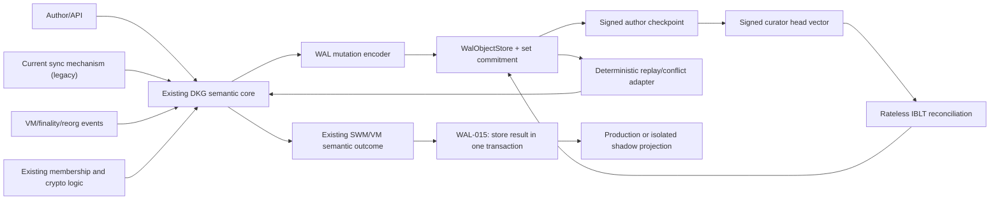
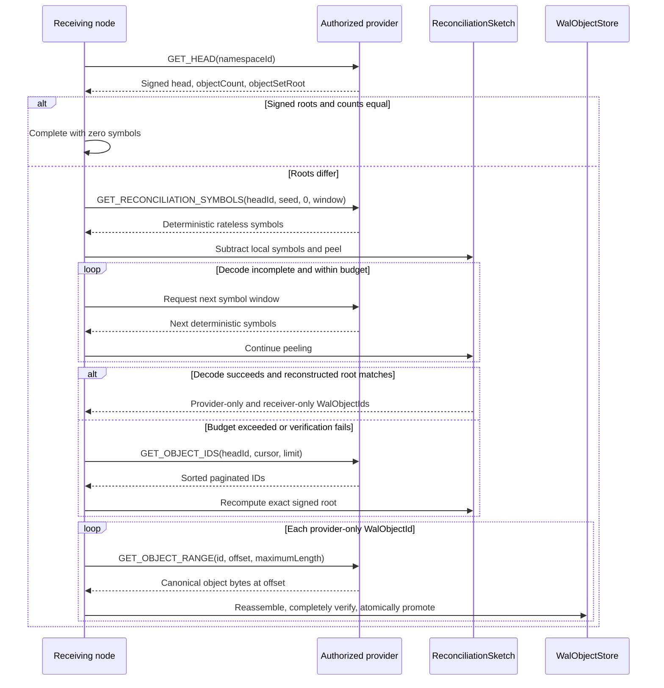
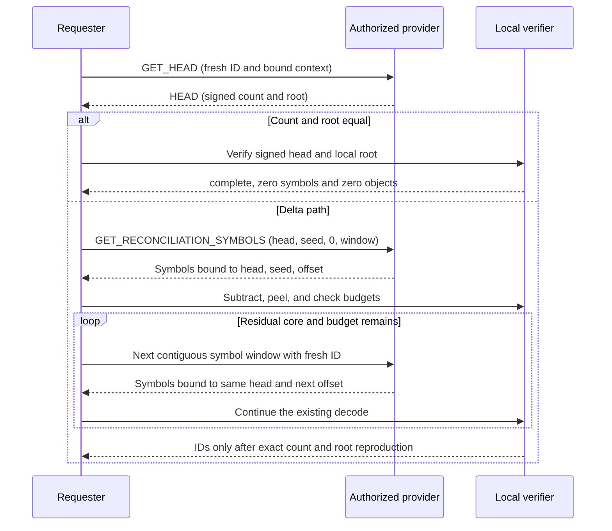
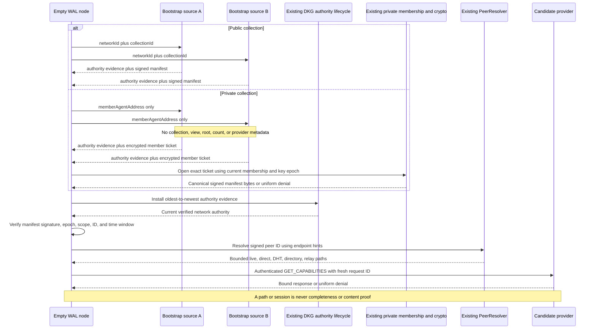
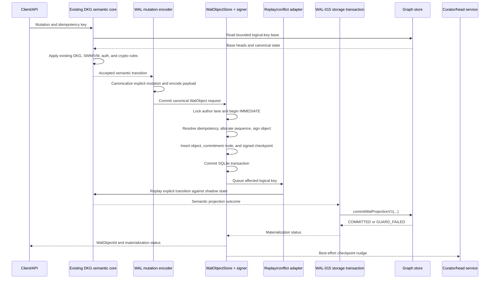
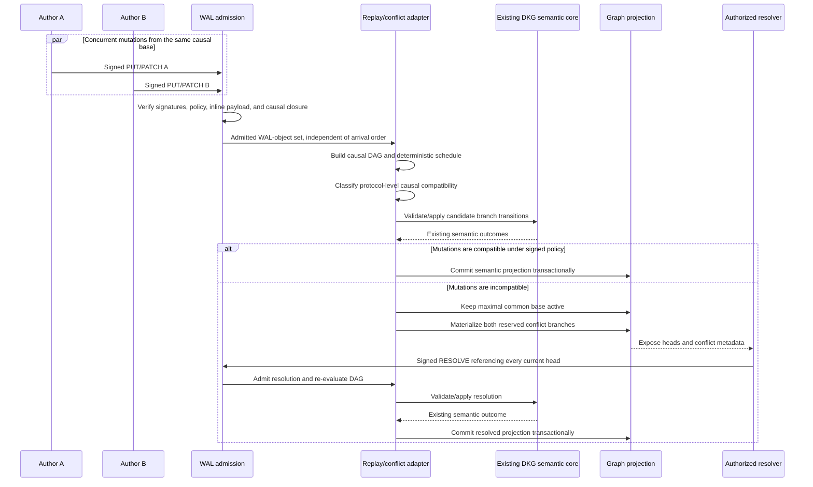
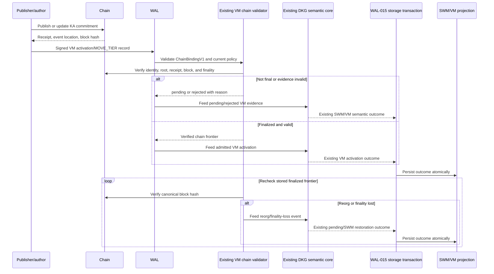
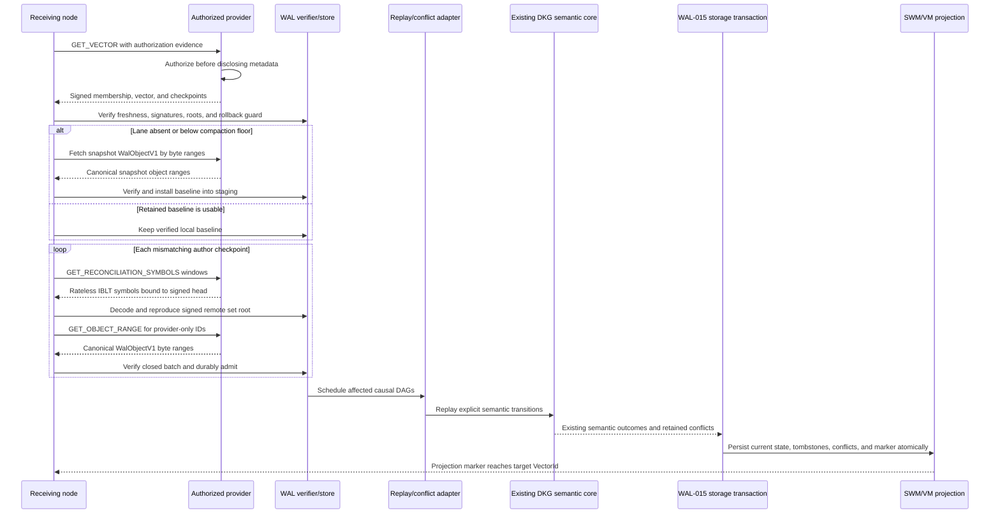
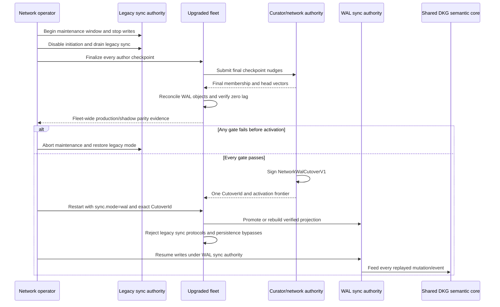

# OT-RFC-65: WAL-Replicated SWM/VM

## Abstract

This RFC replaces triplestore-level SWM/VM synchronization with a generic
write-ahead-log replication protocol. The generic protocol reconciles
authenticated sets of immutable `WalObjectId` values, transfers each missing
canonical `WalObjectV1` as resumable byte ranges, and durably admits the
complete object without knowing anything about RDF graphs or SPARQL. One
`WalObjectV1`, including its inline opaque payload bytes, is the smallest and
only durable content-addressed synchronization atom. Transfer ranges have no
independent identity or protocol lifecycle. RDF remains central to the product,
but it becomes a deterministic projection: a versioned encoder binds an exact
transition already accepted by the existing semantic core into canonical
opaque payload bytes. The WAL layer contains no DKG- or SPARQL-specific
semantic evaluator. On replay, a
deterministic causal/conflict adapter schedules those bytes and invokes the
same existing DKG semantic core used by the current synchronization path. It
does not reimplement publish, share, update, deletion, expiry, SWM/VM,
verified-memory, membership, finality, or cryptographic behavior. WAL-015 only
commits the semantic core's resulting projection and exact WAL marker through
one graph-database transaction in the existing storage adapter. That
transaction is a projection persistence guarantee, not another synchronization
atom.

Each author signs its own WAL records and checkpoints. A curator signs
membership and bounded-freshness vectors naming the exact author checkpoints a
complete replica must hold, while the chain remains authoritative for VM
identity and finality. Serving peers are untrusted caches. Pull-based set
reconciliation is the correctness path; gossip is only a latency hint. Private
authorization is checked before disclosing roots, IDs, sizes, proofs, or bytes,
and private payloads remain encrypted under the existing membership key model.

Protocol version 1 fixes exact-arity deterministic CBOR tuples, BLAKE3 object
identities, a signed deterministic set commitment, rateless IBLT reconciliation
over 32-byte `WalObjectId` values, bounded deterministic full-ID fallback,
whole-object range transfer, three raw libp2p protocol families, durable SQLite
WAL control state, and one transactional graph-storage capability. The transport
design takes inspiration from Iroh's separation of content identity, provider
choice, resumable byte transfer, and transport path selection, but does not
require an Iroh runtime. IBLT decoding discovers differences efficiently; it is
never accepted as the authenticated completeness proof.

The normative schema registry and byte fixtures named in the front matter are
part of this RFC. They freeze every tuple position, numeric enum, domain,
resource bound, valid vector, and invalid vector used by protocol version 1.
Two separately written TypeScript implementations consume the same fixtures;
the fixtures are language-neutral, and no additional implementation language
is required by this RFC.

Crash recovery, reconnect, late join, backfill, and projection rebuild all use
the same admission and replay path. A receiver either reconciles retained WAL
records or installs an authenticated author snapshot and then reconciles the
post-snapshot delta. Existing SWM/VM data enters through a signed genesis
barrier; this preserves current authenticated state but does not invent causal
history for mutations that predate the WAL.

Deployment is deliberately parallel but synchronization authority is not. The
current synchronization mechanism, named `legacy` in this RFC, remains
production-authoritative while the complete WAL synchronization protocol runs
in shadow across the upgraded fleet. Both mechanisms invoke one DKG semantic
implementation, one SWM/VM model, and the same verified-memory and cryptographic
logic. After fleet-wide parity, failure, security, rebuild, and throughput gates
pass, one signed network cutover disables legacy synchronization and makes WAL
the only synchronization authority. It does not replace the shared semantic
core. `Legacy` names only the superseded synchronization mechanism; the DKG
semantics, SWM/VM model, verified-memory logic, and cryptographic logic are
shared current behavior, not legacy behavior. There is no per-collection mixed
synchronization authority or live legacy sync fallback after writes resume. A
separate companion document compares this
design with OT-RFC-64 / OriginTrail dkgv10-spec PR #144.

## 0. Decision

Build a complete WAL replication protocol beside the current graph-sync stack.
The current synchronization mechanism remains authoritative while both sync
mechanisms run in parallel against the same semantic core and SWM/VM model.
After the WAL path passes the acceptance gates, pause writes, sign one network
cutover manifest, switch every collection and node to WAL synchronization
authority, and disable the legacy-sync handlers. There is no per-collection
gradual migration, no mixed synchronization-authority mode, and no live
legacy-sync fallback after cutover.

The permanent boundary is:

> Reconcile and replicate complete authenticated immutable WAL objects. Treat
> their inline payload as opaque bytes and RDF graphs as a deterministic,
> rebuildable query projection.

The WAL proves what was committed. The existing semantic core validates DKG and
RDF semantics; the WAL replay/conflict adapter invokes that core, and WAL-015
persists its output atomically through the existing storage adapter. A graph database is still
central to the product, but it is no longer required to prove replication
history or completeness.

The files `vectors/OT-RFC-65-protocol-v1.schema.json` and
`vectors/OT-RFC-65-protocol-v1.json` are normative. Prose names are descriptive;
the exact numeric enum values, tuple arities, field types, domains, and hard
limits in the schema registry control when prose is abbreviated.

## 1. Scope

### Goals

- Store-independent synchronization for SWM and VM.
- Network work proportional to the symmetric difference and missing WAL-object
  bytes, not all stored graphs.
- Exact replay after crashes, source changes, deletion, expiry, and late join.
- One admission and deterministic replay/conflict-adapter path for local
  writes, live delivery, reconnect, recovery, and rebuild, always invoking the
  existing DKG semantic core.
- Deterministic graph projection and explicit conflict retention.
- Existing DKG membership, private-content, authorship, and chain-finality rules.
- Two synchronization mechanisms during shadow rollout, but exactly one DKG
  semantic implementation, one SWM/VM model, and one verified-memory and
  cryptographic implementation.
- A full parallel implementation followed by one hard cutover.

### Measurable success criteria

The WAL path is successful only when it preserves existing DKG semantics and
meets the following objective gates. Implementation completion by itself is not
a success criterion.

For reconciliation measurements:

- `N` is the total committed WAL-object count in the compared namespaces;
- `k` is the cardinality of the `WalObjectId` symmetric difference;
- `b` is the total canonical byte length of remote-only WAL objects.

| Goal | Measurement | Required result before cutover |
|---|---|---|
| **SWM/VM semantic identity** | Feed the existing publish, share, update, delete, expiry, membership, private-access, VM-finality, and reorg golden corpus through both synchronization mechanisms into the same semantic core. Compare authorization decisions, active/conflict state digests, canonical RDF, API-visible lifecycle state, and VM status. | Both sync mechanisms demonstrably invoke the same semantic implementation; no duplicate WAL-specific DKG behavior exists. Results are 100% identical for all previously defined behavior, with zero unexplained divergence during a seven-day full-fleet shadow soak covering at least 1,000,000 accepted mutations and every supported mutation type. |
| **Existing crypto compatibility** | Run the existing author, curator, membership, Sender Key, KA-root, receipt, and chain-validation vectors through the adapter boundary. | 100% of valid vectors remain valid and 100% of invalid vectors remain rejected. The WAL layer must not independently redefine membership, decryption authority, KA identity, or VM finality. |
| **Exact convergence** | Reconcile healthy replicas from equal, partially missing, opposite-arrival, stale-peer, snapshot, and genesis states. Compare checkpoint IDs, object roots/counts, admitted object IDs, projection markers, active-state digests, and conflict digests. | Every authorized healthy replica reaches the exact signed target vector with zero missing WAL objects and identical projection/conflict digests. An IBLT decode alone never satisfies this gate; the decoded remote set must reproduce the signed target commitment. |
| **Equal-set cost** | Start with current cached membership/checkpoints and equal object-set roots for `N = 10^4`, `10^5`, and `10^6`. | After the signed head exchange: zero IBLT symbols, ID enumeration, WAL-object transfer, and triplestore enumeration. Cost must not grow with stored graph count. |
| **Delta-proportional work** | Hold `k` and `b` fixed while increasing `N` from `10^4` to `10^6`, using the same differing IDs and object bytes. | Transferred WAL-object bytes remain exactly constant; rateless reconciliation bytes increase by no more than 50%; cached symbol generation does not rescan RDF or rebuild the full set per peer; triplestore enumeration remains zero. |
| **Backfill and rebuild** | Test empty join, below-compaction-floor join, genesis bootstrap, and projection-only rebuild against the same signed target. | 100% exact target-root and projection parity; zero deleted/expired-state resurrection; no graph enumeration during network backfill; a locally complete WAL rebuild performs zero network payload transfer. Backfill p95 duration must be no worse than the current full graph-sync baseline on the same data and link. |
| **Interrupted transfer efficiency** | Interrupt each WAL-object stream after every negotiated range boundary and at randomized positions inside a range; resume from the same and another provider. | Zero durably recorded complete ranges are retransmitted and at most one in-flight range is retransmitted per interruption. No range has an independent content identity. The complete reconstructed canonical object must match `WalObjectId`, signature, arity, and canonicality before atomic promotion. |
| **Crash safety** | Inject a process crash at every durable boundary listed in the acceptance tests, with at least 100 randomized runs per boundary. | Zero partial canonical projections, lost acknowledged records, false `complete` states, or manual repairs. Every restart converges automatically to the old projection plus pending replay or the fully committed new projection. |
| **Conflict determinism** | Schedule every conflict fixture through the WAL replay/conflict adapter under all WAL-object-arrival permutations and provider orders, invoking the same semantic core for every candidate transition. | 100% identical active-head, state, and conflict digests. No incompatible branch is silently discarded, no `WalObjectId` ordering is used as a winner rule, and no WAL-specific copy of DKG semantics is introduced. |
| **Private-data non-disclosure** | Exercise unauthenticated, removed-member, stale-policy, wrong-view, wrong-key-epoch, downgrade, proof-probing, and malformed requests. | Zero private roots, counts, IDs, sizes, proofs, ciphertext, or plaintext disclosed beyond a uniform denial response; zero unauthorized projection activation. |
| **VM safety** | Exercise valid, premature, substituted, reverted, and reorged VM evidence using the existing chain-validation corpus. | Zero VM activations without current identity/root/receipt/finality validation; 100% deterministic return to pending and restoration of the last valid SWM state after simulated reorg evidence. |
| **Write-path overhead** | Compare current-sync-authoritative and shadow-WAL local writes on identical hardware, data, durability settings, and workloads. | WAL shadowing adds no more than 20% to p95 publish/share latency, 30% to p99 latency, and 25% to peak daemon RSS or CPU seconds. No graph call occurs inside the WAL SQLite transaction. |
| **Operational diagnosis** | Force every readiness state and failure reason through API and restart. | 100% of non-complete collections expose the expected checkpoint, local root/count, exact missing objects/ranges, IBLT decode/fallback state, materialization lag, freshness source, retry state, and stable reason code. No internally known failure is reported as `complete`. |
| **Hard-cutover safety** | Rehearse the maintenance barrier, final reconciliation, signed cutover, restart, late-node return, and pre-activation abort on the full deployment inventory. | 100% of authoritative nodes persist and load the same `CutoverId`; zero legacy-sync protocol handlers or semantic-core-bypassing graph writers remain after activation; a missing/mismatched ID fails closed; every pre-activation abort returns to legacy sync authority without accepting WAL-sync-authoritative writes. |

Performance comparisons must use the same hardware, network shaping, dataset,
roster, chain snapshot, adapter version, durability settings, and fault schedule.
Run each performance profile at least three times and report median, p95, p99,
bytes, request counts, CPU seconds, peak RSS, and triplestore operations. A pass
may not be claimed from a faster environment or a smaller workload than its
current-sync baseline.

### Non-goals

- No total order or consensus across independent authors.
- No remote execution of arbitrary SPARQL text.
- No wall-clock last-write-wins.
- No replication of database-engine WAL files.
- No Iroh runtime dependency in protocol version 1.
- No compression on the wire in protocol version 1.
- No live dual-authoritative or fallback mode after cutover.

## 2. Architecture



The two synchronization mechanisms converge at `DkgSemanticCore`. They are not
two implementations of DKG. The `legacy` label applies only to the current
synchronization mechanism and its protocol handlers. It does not label or
deprecate the SWM/VM model, verified-memory rules, or cryptographic logic.

### Components

| Component | Responsibility |
|---|---|
| `WalObjectStore` | Durable complete canonical WAL objects, temporary range staging, checkpoints, vectors, idempotency, and admission state. |
| `SetCommitment` | Deterministic authenticated set commitment over `WalObjectId`; it proves target equality but is not traversed in the normal reconciliation path. |
| `ReconciliationSketch` | Deterministic rateless IBLT symbol generation, subtraction, peeling, decode verification, and bounded full-ID fallback. |
| `CollectionAuthority` | Membership, author authorization, private-view authorization, freshness vector. |
| `ReconciliationDriver` | Compare signed heads, stream IBLT symbols, fetch complete objects by ranges, and admit closed batches. |
| `WalReplayConflictAdapter` | Build the causal schedule, classify protocol-level compatibility from explicit mutation footprints and signed replay policy, retain incompatible branches, and invoke `DkgSemanticCore` for every branch transition. It owns no duplicate DKG behavior. |
| `DkgSemanticCore` | The existing implementation of publish/share/update/delete/expiry, SWM/VM, verified-memory, authorization, and cryptographic behavior, reused by both synchronization mechanisms. |
| Existing graph storage adapter | WAL-015 persists the semantic core's resulting projection and WAL marker atomically; it does not decide semantic outcomes. |
| `VmChainValidator` | The existing chain-validation implementation for KA identity, root, version, receipt, finality, and reorg status, invoked by the shared semantic core. |

### Authority

- An author signs its records and author checkpoints.
- The curator signs membership and bounded-freshness head vectors.
- The chain remains authoritative for VM identity and finality.
- Serving peers are untrusted caches.
- The WAL-object set is replicated truth.
- RDF is the validated query projection of that truth.
- Synchronization chooses and transports inputs; only the shared DKG semantic
  core decides their SWM/VM, verified-memory, authorization, and crypto meaning.

## 3. Required invariants

1. **Immutable identity:** one `WalObjectId` names exactly one complete
   canonical signed `WalObjectV1`. No payload, range, or chunk has a separate
   synchronization identity. One accepted DKG operation that changes multiple
   disclosure views produces one complete `WalObjectV1` per eligible view and
   namespace. Those objects are peers, not parts of a larger synchronization
   object: each remains the sole atom, and the public object contains no private
   RDF bytes.
2. **Authorization before disclosure:** private roots, IDs, sizes, proofs, and
   bytes are returned only after current membership authorization.
3. **Explicit completeness:** synchronization targets the exact author
   checkpoints named by a valid curator vector, never a provider's incidental
   local inventory.
4. **Pull is correctness:** gossip and push only reduce latency.
5. **WAL before RDF:** complete verified WAL objects are durable before
   materialization.
6. **One semantic implementation:** current sync and WAL sync invoke the same
   DKG semantic core, SWM/VM model, verified-memory logic, and cryptographic
   logic. The WAL replay/conflict adapter may schedule causal work and retain
   branches, but may not reproduce or override those semantics.
7. **Deterministic projection:** identical admitted sets, policy, adapter
   version, and finalized chain view produce identical semantic-core outcomes,
   active state, and conflicts.
8. **Deletion is an object:** absence from a response never means deletion.
9. **No silent conflict loss:** incompatible concurrent heads remain visible
   until an authorized signed resolution references all of them.
10. **Bounded resources:** every frame, IBLT symbol window, decode result, range,
   object, batch, queue, temporary file, and conflict fan-out has an explicit
   admission limit.
11. **One synchronization-authority switch:** before cutover the legacy sync
    mechanism owns production synchronization; after cutover WAL sync owns it.
    The semantic core is the same on both sides of the switch.

## 4. Canonical encoding, hashes, and signatures

### 4.1 Control encoding

All WAL objects, checkpoints, vectors, manifests, and protocol control frames
use RFC 8949 deterministic CBOR with this profile:

- exact-arity arrays/tuples for every normative signed, hashed, and wire object;
- definite-length arrays, strings, and byte strings;
- shortest integer representation;
- UTF-8 strings normalized to NFC;
- no maps, floats, tags, or indefinite lengths in normative protocol objects;
- set-like arrays sorted lexicographically by their canonical bytes and deduped;
- a decoder rejects non-canonical bytes instead of re-encoding them;
- missing or extra tuple positions are rejected;
- an optional position is present as CBOR `null`; changing tuple shape requires
  a new object version.

IDs are raw 32-byte values on the wire. Addresses are raw 20-byte EVM
addresses. Counters are unsigned 64-bit integers.

### 4.2 Signatures

Protocol version 1 reuses the current DKG agent/curator secp256k1 authority.

```text
objectDigest = BLAKE3("dkg-wal-object-sign-v1\0" || canonicalUnsignedWalObject)
checkpointDigest = BLAKE3("dkg-wal-checkpoint-sign-v1\0" || canonicalUnsignedCheckpoint)
membershipDigest = BLAKE3("dkg-wal-membership-sign-v1\0" || canonicalUnsignedMembership)
vectorDigest = BLAKE3("dkg-wal-vector-sign-v1\0" || canonicalUnsignedVector)
cutoverDigest = BLAKE3("dkg-wal-cutover-sign-v1\0" || canonicalUnsignedCutover)
authorityDigest = BLAKE3("dkg-wal-authority-sign-v1\0" || canonicalUnsignedAuthoritySet)
receiptDigest = BLAKE3("dkg-wal-receipt-sign-v1\0" || canonicalUnsignedReceipt)
bootstrapDigest = BLAKE3("dkg-wal-bootstrap-sign-v1\0" || canonicalUnsignedBootstrapManifest)
rollbackRecoveryDigest = BLAKE3("dkg-wal-rollback-recovery-sign-v1\0" || canonicalUnsignedRollbackRecovery)
signature = EIP191_secp256k1_sign(the corresponding 32-byte digest)
```

Signatures are exactly 65 bytes, recoverable, low-S, and use normalized recovery
bits. Verification recovers the signer address and compares it with the signed
author or authority-set entry. For a single-author object the unsigned tuple is
the exact tuple without its final signature. For a threshold-signed object it
is the exact tuple without its final `signatures` array. Every threshold signer
signs the same digest; `SignatureEntryV1` values are sorted by address, unique,
and must meet the referenced authority-set threshold.

### 4.3 Object IDs

```text
WalObjectId = BLAKE3("dkg-wal-object-v1\0" || canonicalSignedWalObject)
MembershipCheckpointId = BLAKE3("dkg-wal-membership-v1\0" || canonicalSignedMembership)
CheckpointId = BLAKE3("dkg-wal-checkpoint-v1\0" || canonicalSignedCheckpoint)
VectorId = BLAKE3("dkg-wal-vector-v1\0" || canonicalSignedVector)
CutoverId = BLAKE3("dkg-wal-cutover-v1\0" || canonicalSignedCutover)
AuthoritySetId = BLAKE3("dkg-wal-authority-v1\0" || canonicalSignedAuthoritySet)
ReceiptId = BLAKE3("dkg-wal-receipt-v1\0" || canonicalSignedReceipt)
BootstrapManifestId = BLAKE3("dkg-wal-bootstrap-v1\0" || canonicalSignedBootstrapManifest)
RollbackRecoveryId = BLAKE3("dkg-wal-rollback-recovery-v1\0" || canonicalSignedRollbackRecovery)
```

## 5. Namespace and disclosure views

The generic replication protocol sees only a 32-byte `namespaceId`. DKG maps
its disclosure views to namespaces before crossing the adapter boundary so a
public VM peer cannot learn private SWM object IDs or activity counts.

```text
ReplicationCollectionKeyV1 = [
  networkId,
  contextGraphId,
  subGraphNameOrNull,
  visibility
]

ReplicationViewKeyV1 = [
  networkId,
  contextGraphId,
  subGraphNameOrNull,
  tier,
  visibility,
  policyEpoch,
  keyEpochOrNull
]

namespaceId = BLAKE3(
  "dkg-wal-namespace-v1\0" || canonicalCBOR(ReplicationViewKeyV1)
)

collectionId = BLAKE3(
  "dkg-wal-collection-v1\0" || canonicalCBOR(ReplicationCollectionKeyV1)
)
```

Version-1 numeric values are `tier: SWM=0, VM=1` and `visibility:
PUBLIC=0, PRIVATE=1`. `networkId`, `contextGraphId`, and `subGraphNameOrNull`
are NFC text bounded by the schema registry. Membership and vectors use the
stable `collectionId`; object routing and disclosure always use the more exact
`namespaceId`.

A private request is authorized for one exact view. A member may reconcile
several views, but roots are never merged across visibility or key epochs.
`MOVE_TIER` links source and target namespaces inside adapter-owned payload
bytes without making them one disclosure set. Generic discovery,
reconciliation, and object transfer route only by `namespaceId`.

## 6. Protocol objects

### 6.1 `WalObjectV1`

```text
WalObjectV1 = [
  version,                    // 1
  namespaceId,                // bytes32
  writerId,                   // bytes20 in the v1 DKG secp256k1 profile
  writerEpoch,                // u64
  sequence,                   // u64
  previousObjectIdOrNull,     // WalObjectId | null
  payloadBytes,               // bytes, opaque to generic WAL
  signature                   // bytes65
]
```

Rules:

- The first seven positions form `canonicalUnsignedWalObject`; `signature`
  signs its domain-separated digest from section 4.
- `WalObjectId` hashes the complete eight-position canonical tuple, including
  the signature.
- `sequence` is monotonic within `(namespaceId, writerId, writerEpoch)` but does
  not order different writers.
- `previousObjectIdOrNull` names the immediately preceding object in that writer
  epoch. It is null only for the first object of an epoch.
- `payloadBytes` is inline. It has no `PayloadId`, `BlobId`, range ID, chunk ID,
  separate set membership, or independent fetch method.
- The generic WAL layer does not decode `payloadBytes`. Graph, RDF, SPARQL,
  SWM/VM, policy, chain, conflict, snapshot, and deletion fields are forbidden
  from the generic tuple and belong to the DKG adapter payload.
- Every WAL object has exactly this shape regardless of application operation.
  A missing or extra position, map representation, or alternate field order is
  rejected.
- An object is advertisable only after its complete canonical bytes and writer
  checkpoint are durable.

### 6.2 Adapter-owned payload envelope

DKG payloads use an exact-arity envelope entirely inside `payloadBytes`:

```text
DkgPayloadEnvelopeV1 = [
  version,                    // 1
  payloadKind,                // u16 enum below
  codec,                      // u16 enum below
  mediaType,
  encryptionOrNull,
  contentBytes                // canonical plaintext or ciphertext
]

EncryptionDescriptorV1 = [
  algorithm,                  // 0 = AES-256-GCM
  keyEpoch,                   // u64
  nonce,                      // bytes12
  associatedDataDigest       // bytes32
]
```

The payload-kind values are `DKG_MUTATION=0`, `RDF_POLICY=1`,
`SNAPSHOT_MANIFEST=2`, `LEGACY_GENESIS=3`,
`COLLECTION_VECTOR_MANIFEST=4`, `CUTOVER_COHORT_MANIFEST=5`,
`MOVE_TIER_SOURCE=6`, and `MOVE_TIER_TARGET=7`. Codec values are
`DETERMINISTIC_CBOR=0`, `CANONICAL_NQUADS=1`, and `OPAQUE_BYTES=2`.
`mediaType` is NFC text of at most 128 UTF-8 bytes.

The envelope is signed indirectly because it is part of `WalObjectV1`. It has
no independent generic-WAL identity. For private payloads, `contentBytes` is
ciphertext and the associated data binds the namespace, writer, epoch,
sequence, envelope version, codec, media type, key epoch, and nonce.

`associatedDataDigest` is exactly:

```text
BLAKE3(
  "dkg-wal-payload-ad-v1\0" || canonicalCBOR([
    namespaceId, writerId, writerEpoch, sequence,
    envelopeVersion, payloadKind, codec, mediaType, keyEpoch, nonce
  ])
)
```

No decryption parameter is unsigned: the descriptor and ciphertext are inside
the enclosing signed and content-addressed `WalObjectV1`.

### 6.3 DKG mutation payload

The DKG adapter decodes mutation content as:

```text
DkgMutationV1 = [
  version,
  operation,                  // u16 enum below
  logicalKey,
  parents,                    // sorted unique WalObjectId[]
  baseHeads,                  // sorted unique WalObjectId[]
  policyObjectId,
  rdfMutationOrNull,
  chainBindingOrNull,
  nonConsensusTimestampMsOrNull
]
```

Operation values are `PUT=0`, `PATCH=1`, `DELETE=2`, `RESOLVE=3`,
`SNAPSHOT=4`, `MOVE_TIER_SOURCE=5`, `MOVE_TIER_TARGET=6`, and
`LEGACY_GENESIS=7`.

These positions are application semantics, not generic replication metadata.
`DELETE` contains a deterministic deletion mutation, `RESOLVE` references every
conflicting active head, and VM activation requires `chainBindingOrNull` to be
non-null.

### 6.4 RDF logical key

```text
logicalKey = BLAKE3(
  "dkg-rdf-logical-key-v1\0" || deterministicCBOR([
    contextGraphId,
    subGraphName,
    authorAddress,
    knowledgeAssetUal | rootEntity
  ])
)
```

Author scope is deliberate. Shared-write keys require a signed policy that
names the allowed writers and conflict resolvers.

### 6.5 `RdfMutationV1`

The `rdfMutationOrNull` position contains this exact-arity adapter tuple:

```text
RdfMutationV1 = [
  version,
  mode,                       // REPLACE=0 | PATCH=1
  baseStateDigest,
  resultStateDigest,
  replaceGraphs,              // sorted unique GraphReplacementV1[]
  replaceSubjects,            // sorted unique SubjectReplacementV1[]
  deleteNQuadsBytes,          // empty bytes when none
  insertNQuadsBytes,          // empty bytes when none
  touchedKeys,                // sorted unique bytes32[]
  sourceSemanticAuditBytesOrNull
]

GraphReplacementV1 = [graphIri, canonicalNQuadsBytes, quadCount]
SubjectReplacementV1 = [graphIri, subjectIri, canonicalNQuadsBytes, quadCount]

touchedKey = BLAKE3(
  "dkg-rdf-touched-key-v1\0" ||
  canonicalCBOR([graphIri, subjectIri, predicateIri])
)
```

- `REPLACE` may replace exact graphs and exact metadata subjects in one logical
  operation. It is the default for graph-scoped KAs.
- `PATCH` contains explicit canonical deletes and inserts returned by the
  shared semantic core. Remote nodes never execute source query text.
- `DELETE` makes the logical key inactive but retains its tombstone.
- The replay adapter asks the shared semantic core to recompute and verify
  touched keys and state digests.
- A concurrent `REPLACE` conflicts with every incomparable mutation of the same
  logical key.

All RDF bytes are inline within the enclosing WAL object. Large canonical
datasets therefore produce large WAL objects and use the same whole-object range
transport as every other object; they do not create a second synchronization
atom.

### 6.6 Private-safe tier movement

```text
MoveTierTargetV1 = [
  version,
  transitionCommitment,
  targetMutation
]

MoveTierSourceV1 = [
  version,
  transitionNonce,
  transitionCommitment,
  targetNamespaceId,
  targetWalObjectId,
  sourceHeads,
  sourceStateDigest,
  sourceResultDigest
]

TierTransitionReceiptV1 = [
  version,
  transitionCommitment,
  targetNamespaceId,
  targetWalObjectId,
  policyObjectId,
  curatorVectorId,
  expiresAtMs,
  authoritySetId,
  signatures
]
```

The transition commitment is

```text
BLAKE3(
  "dkg-wal-move-tier-v1\0" || transitionNonce || sourceNamespaceId ||
  targetNamespaceId || targetMutationDigest || sourceStateDigest ||
  sourceResultDigest
)
```

`transitionNonce` is a random bytes32 value. The public target contains only the
randomized commitment and target mutation. It contains no source namespace,
source WAL-object ID, graph name, key epoch, activity count, or causal shape.
The private source opening binds the public target ID and is served only under
the source-view authorization policy. The target remains pending until a
threshold-valid `TierTransitionReceiptV1` attests that the private side was
validated; the public receipt contains no private identifier. The source SWM
state is marked superseded only after that receipt and VM finality both pass.

### 6.7 `ChainBindingV1`

```text
ChainBindingV1 = [
  chainId,
  contextGraphOnChainId,
  kaId,
  assertionVersion,
  merkleRoot,
  transactionHash,
  blockNumber,
  blockHash,
  transactionIndex,
  logIndex,
  eventType,
  requiredFinalityBlocks
]
```

### 6.8 `AuthorCheckpointV1`

```text
AuthorCheckpointV1 = [
  version,
  namespaceId,
  writerId,
  writerEpoch,
  checkpointNumber,
  setCommitmentVersion,
  objectSetRoot,
  objectCount,
  maxSequence,
  previousCheckpointIdOrNull,
  baselineSnapshotObjectIdOrNull,
  compactionFloor,
  signature
]
```

Protocol version 1 creates one checkpoint in the same local transaction that
finalizes each authored object. This favors simple semantics over signature
batching. A later protocol may batch checkpoints without changing WAL-object
IDs.

Within one author epoch, every newer checkpoint must be a set extension. History
may be cut only by a new epoch whose first record is an author-signed snapshot.

### 6.9 `MembershipCheckpointV1`

```text
MembershipCheckpointV1 = [
  version,
  collectionId,
  checkpointNumber,
  policyEpoch,
  publishMode,
  writerIds,
  memberAgentAddresses,
  allowedPeerIds,
  activeNamespaceIds,
  rdfPolicyObjectId,
  previousMembershipCheckpointIdOrNull,
  issuedAtMs,
  authoritySetId,
  signatures                 // sorted SignatureEntryV1[]
]
```

Arrays are sorted and unique. Curated views admit records only from listed
authors. Private disclosure requires a listed member agent or a policy-valid
delegation bound to the transport peer. `OPEN` permits a new public author only
when its record carries valid chain authorization; the next head vector must
index that author before the collection can report `complete`.

### 6.10 `CollectionHeadVectorV1`

```text
CollectionHeadVectorV1 = [
  version,
  collectionId,
  membershipCheckpointId,
  expectedNamespaces,         // [[namespaceId, [[writerId, checkpointId]]]]
  vectorEpoch,
  vectorNumber,
  previousVectorIdOrNull,
  issuedAtMs,
  expiresAtMs,
  finalizedChainFrontierOrNull,
  authoritySetId,
  signatures                  // sorted SignatureEntryV1[]
]
```

`expectedNamespaces` is sorted by namespace ID; each writer list is sorted by
writer ID and unique.

Defaults:

- curator issues immediately after a valid author-checkpoint nudge or every 5
  seconds, whichever occurs first;
- vector validity is 60 seconds;
- accepted local clock skew is 5 seconds;
- the highest accepted `(epoch, number, hash)` is stored in a rollback guard
  outside graph and WAL snapshot restore domains;
- an expired or rolled-back vector yields `unknown-freshness`;
- private roots are not served under `unknown-freshness`.

For an open public CG, chain-valid authors may create new lanes. Their state is
not reported complete until a newer curator vector includes their checkpoint.
The curator indexes freshness; it does not become the content author.

### 6.11 `NetworkWalCutoverV1`

```text
NetworkWalCutoverV1 = [
  version,
  networkId,
  walProtocolVersion,
  rdfAdapterVersion,
  requiredNodeVersion,
  collectionVectorManifestObjectId,
  cohortManifestObjectId,
  cutoverEpoch,
  activation,
  legacySyncDisabled,
  authoritySetId,
  signatures                  // sorted SignatureEntryV1[]
]
```

The vector and cohort manifest objects are ordinary `WalObjectV1` values whose
adapter payloads contain, respectively,
the sorted complete list of `[collection, vectorId]` entries covered by the
cutover and the exact required-node/active-author cohort. Every node must start
WAL-authoritative mode with the same `CutoverId`.
Mixed legacy-sync/WAL-sync authority is rejected.

### 6.12 Threshold authority objects and rotation

```text
SignatureEntryV1 = [signerAddress, signature]

AuthoritySetV1 = [
  version,
  scope,                       // CURATOR=0 | NETWORK=1
  networkId,
  authorityEpoch,
  threshold,
  signerAddresses,
  notBeforeMs,
  expiresAtMs,
  previousAuthoritySetIdOrNull,
  emergencyRevocationIds,
  signatures
]

RollbackRecoveryV1 = [
  version,
  networkId,
  collectionId,
  minimumVectorEpoch,
  minimumVectorNumber,
  minimumVectorId,
  recoveryNonce,
  issuedAtMs,
  authoritySetId,
  signatures
]
```

Signature entries and signer addresses are sorted, unique, and threshold
checked against `authoritySetId`. Genesis authority sets are configured trust
anchors. A rotation is accepted only when signed by the previous current set;
an emergency revocation must be signed by the current network set and names
the exact revoked authority IDs. Changing curator authority increments
`vectorEpoch`, resets `vectorNumber` to zero, and links the prior vector ID.
Changing network authority increments its authority epoch and cannot lower an
already activated cutover requirement.

Loss of the rollback high-water file is fail-closed. The node reports
`unknown-freshness`, serves no private metadata, and accepts no vector until it
durably installs a threshold-valid `RollbackRecoveryV1` at or above the maximum
high-water reported by the required cohort. Ordinary graph/WAL snapshots cannot
restore or lower this guard.

## 7. Whole-object format and resumable range transfer

`WalObjectV1` is the only durable transferred content object. Its canonical
CBOR byte string may be streamed in ranges, but a range is only ephemeral wire
framing and local staging progress.

This RFC uses `atom` only for synchronization identity. The observable
admission of a complete `WalObjectV1` is all-or-nothing: partial range bytes
remain staging data, and its `WalObjectId` MUST NOT enter an admitted set,
checkpoint, vector, or replay queue until the complete canonical object has
passed length, ID, signature, and policy verification and is durably
recoverable. WAL-006 defines the crash-safe store/control transaction and
recovery protocol that provides this property.

WAL-015's all-or-nothing graph-database transaction is a different storage guarantee,
not another synchronization atom. It receives the existing semantic core's
already-decided result and stores that result plus its replay marker in one
transaction. No RDF graph, quad, conflict record, marker, transaction, payload,
page, or byte range gains a `WalObjectId` or independent synchronization
lifecycle.

```text
GetWalObjectRangeV1 = [
  walObjectId,
  offset,
  maximumLength
]

WalObjectRangeV1 = [
  walObjectId,
  totalObjectLength,
  offset,
  bytes
]
```

The offset addresses the complete canonical `WalObjectV1` encoding, including
tuple headers, inline payload, and signature. It never addresses an independent
payload object. Responses are idempotent for the same object ID and byte range.
`maximumLength` is in `1..1 MiB`. A response contains at least one byte except
that `offset == totalObjectLength` may return one empty EOF sentinel. Empty
ranges before EOF, offset-plus-length overflow, and any byte past the advertised
total are rejected.

A receiver:

1. validates `totalObjectLength`, offset arithmetic, negotiated range length,
   staging quota, and concurrency before allocating or extending a file;
2. writes received ranges to quota-controlled temporary storage and records a
   local resume bitmap keyed by `(WalObjectId, offset, length)`;
3. may retry, reorder, overlap, or fetch missing ranges from different
   authorized providers;
4. does not expose or admit any partial object;
5. after all bytes arrive, parses the exact tuple, rejects non-canonical CBOR,
   recomputes `WalObjectId`, verifies the writer signature and sequence link,
   fsyncs the object, atomically renames it to the final ID path, fsyncs the
   parent directory, and only then marks it complete.

Ranges have no independent hash, signature, set membership, durable protocol
identity, or semantic representation. Authenticated encrypted transport
protects in-flight bytes, while the complete object ID and signature provide
end-to-end acceptance. Bytes from a provider that fail complete-object
verification are discarded and the provider is penalized or quarantined.

Staging must not trust sparse-file logical length as quota evidence. An
implementation either preallocates charged physical space or stores bounded
range parts and charges both physical part bytes and the union of received
intervals before assembly. An object may retain at most 65,536 range parts.
Restart metadata binds the exact `(WalObjectId, totalObjectLength)`; a different
advertised length cannot resume the same staging entry. Duplicate and
overlapping bytes are permitted only when they agree. Promotion uses bounded
read buffers, verifies canonical structure, EIP-191 signature, and whole-object
BLAKE3 ID, fsyncs the complete file, atomically renames it, and fsyncs the
parent directory. Cancellation, timeout, quota failure, and abandoned staging
have bounded cleanup paths.

Large objects are valid. Implementations must stream them without buffering the
complete payload in memory and must interleave range scheduling so one large
object cannot starve smaller objects. Network policy and capability negotiation
set the maximum accepted object length and temporary-disk budget; those limits
must not be implemented by inventing content-addressed sub-objects. Protocol v1
intentionally provides no sub-object deduplication or independent
pre-completion content verification. Adding either requires a later protocol
version and a new synchronization-atom decision.

## 8. Rateless IBLT set reconciliation

### 8.1 Authenticated set commitment

Each author checkpoint commits to the exact set of `WalObjectId` values. The
commitment is a deterministic 16-way radix Merkle root used for authentication,
equality checks, local incremental maintenance, and final decode verification;
normal reconciliation does not traverse it over the wire.

- leaf capacity: 256 IDs;
- IDs inside a leaf are sorted and unique;
- a leaf that exceeds capacity splits by the next nibble;
- maximum depth: 64;
- the empty-set root is `BLAKE3("dkg-wal-set-empty-v1\0")`.

```text
leafHash = BLAKE3(
  "dkg-wal-set-leaf-v1\0" ||
  u8(prefixNibbleLength) || packedPrefix || u64be(count) || concat(sortedIds)
)

branchHash = BLAKE3(
  "dkg-wal-set-branch-v1\0" ||
  u8(prefixNibbleLength) || packedPrefix || u16be(childBitmap) ||
  concat(u8(nibble), u64be(childCount), childHash in nibble order)
)
```

Nibbles are packed high nibble first. If the prefix has odd length, the unused
low nibble of the final byte is zero; any other value is non-canonical.
Version-1 diagnostic/bootstrap membership proofs use:

```text
SetMembershipProofV1 = [
  version,
  walObjectId,
  leafPrefixNibbleLength,
  leafIds,
  path
]

SetProofLevelV1 = [
  parentPrefixNibbleLength,
  childBitmap,
  childNibble,
  siblings
]

SetProofSiblingV1 = [nibble, childCount, childHash]
```

`leafIds` and siblings are strictly sorted and unique. The path is leaf-to-root
in its logical meaning but encoded in root-to-leaf order, so a verifier walks it
in reverse. It must terminate at prefix length zero and the exact signed root.
Duplicate/unsorted leaf IDs, missing or extra siblings, bitmap disagreement,
bad counts, impossible prefix transitions, a nonzero unused nibble, trailing
levels, and root mismatch are `INVALID_PROOF`. Proofs remain disposable control
data and never become reconciled set elements.

The commitment is not another synchronization atom. It is a signed statement
about the set named by an author checkpoint. Equality of signed `(objectCount,
objectSetRoot)` values completes reconciliation without transmitting any IBLT
symbols.

### 8.2 Rateless difference discovery

When signed roots differ, protocol v1 uses a rateless Invertible Bloom Lookup
Table (IBLT) over fixed 32-byte `WalObjectId` keys. Both peers deterministically
encode the compared sets with the same algorithm and seed. The receiver subtracts
its local symbols from the provider's symbols: common IDs cancel and peeling
recovers provider-only and receiver-only IDs.

```text
ReconciliationSymbolV1 = [
  symbolIndex,
  count,                 // signed i64
  idXor,                 // bytes32
  checksumXor            // bytes32
]

idChecksum = BLAKE3(
  "dkg-wal-iblt-check-v1\0" || reconciliationSeed || walObjectId
)

reconciliationSeed = BLAKE3(
  "dkg-wal-iblt-seed-v1\0" ||
  requesterHeadId || providerHeadId || requesterNonce
)
```

The requester chooses `requesterNonce` only after receiving the provider's
signed immutable head. `requesterNonce` is bytes32. The normative
`ProtocolV1IbltReconciliationAlgorithm` uses an exact IEEE-754 binary64
evaluation profile:

```text
M = 0xda942042e4dd58b5
INVERSE_SQRT_NUMERATOR = 2^32
INDEX_OFFSET = 1.5

mapState(id) = u64le(first8(BLAKE3(
  "dkg-wal-iblt-map-v1\0" || reconciliationSeed || id
)))

index_0 = 0
state_0 = mapState(id)

after emitting at index_n:
  state_(n+1) = state_n * M mod 2^64
  x0 = binary64(state_(n+1))
  x1 = binary64(x0 + 1.0)
  x2 = sqrt64(x1)
  x3 = binary64(INVERSE_SQRT_NUMERATOR / x2)
  x4 = binary64(x3 - 1.0)
  x5 = binary64(binary64(index_n) + INDEX_OFFSET)
  x6 = binary64(x5 * x4)
  distance = max(1, ceil(x6))
  index_(n+1) = index_n + distance
```

`binary64(u64)` converts the exact unsigned integer using IEEE-754
round-to-nearest, ties-to-even. Every named `binary64(...)` operation rounds
its result to binary64 using the same mode before the next operation.
`sqrt64` is correctly rounded binary64 square root under that mode. Extended
precision intermediates, fused operations, reassociation, algebraic
simplification, and alternative evaluation orders are forbidden. An
implementation whose native runtime cannot guarantee this profile MUST use a
deterministic software routine and MUST reproduce the normative vectors. No
floating-point value appears in CBOR or on the wire; binary64 is used only to
derive integer symbol indices.

Every ID contributes first to symbol zero and then to the strictly increasing
indices above. `count` is a signed i64 and overflow fails the attempt.
`idXor` and `checksumXor` are
bytewise XOR. A symbol is pure only when count is exactly `+1` or `-1` and the
checksum of `idXor` equals `checksumXor`. The decoder always peels the lowest
available symbol index; a provider-only ID is subtracted from every received
membership cell and a receiver-only ID is added. Duplicate decoded IDs fail.

The schema and conformance vectors freeze the schedule, signed integer CBOR,
checksum, subtraction, incremental windows, peel trace, residual-core failure,
and reconstructed-root result. This name identifies a normative algorithm, not
a protocol object or synchronization atom. Experimental initial-window sizes,
growth policy, fallback thresholds, and performance candidates remain outside
the wire specification and may iterate without changing symbol bytes. A
provider can generate and cache the same deterministic symbol stream once per
`(headId, reconciliationSeed)` and serve any requested contiguous window.

The binary64 profile is the measured WAL-005 baseline. In a rotated
fresh-process TypeScript A/B at N=10K, 100K, 1M, and 10M with a fixed 32-ID
symmetric difference, the exact-integer candidate preserved symbol/byte counts
but increased median end-to-end time by 20%–23% and symbol-stream time by
72%–87%. The integer candidate remains informative experiment data, not the
protocol-v1 schedule.

The following rule is normative:

> The IBLT reconciliation algorithm, its parameters, symbols, local
> set-commitment nodes, byte-range frames, and local progress records are
> control-plane or implementation data, not synchronization atoms. They MUST
> NOT receive content IDs, become members of the reconciled content set, be
> admitted to `WalObjectStore`, or acquire an independent synchronization
> lifecycle. Only `WalObjectId` values are elements of the reconciled content
> set, and only a complete canonical `WalObjectV1` is fetched and admitted as
> synchronized content.

An implementation may cache symbols, commitment nodes, or transfer progress
locally, including across restart, but that cache is disposable and has no
protocol-visible identity or authority.

The receiver initially requests a bounded symbol window, subtracts its local
contribution, and peels pure symbols. If decoding does not complete, it requests
the next window and continues without restarting. A decode is successful only
when all of the following hold:

1. every residual symbol is zero after peeling;
2. every pure symbol passes the domain-separated checksum;
3. decoded IDs are unique, direction-tagged, and within negotiated limits;
4. applying receiver-only removals and provider-only additions to a temporary
   copy of the receiver's set reproduces the provider's signed object count and
   set root exactly.

IBLT decode success alone is never a completeness proof. A checksum collision,
malformed symbol, residual core, arithmetic overflow, root mismatch, or count
mismatch is a failed reconciliation attempt, never a partial success.

### 8.3 Bounded fallback and backfill

If decoding exceeds the negotiated symbol, CPU, memory, or elapsed-time budget,
the receiver switches provider or uses `GET_OBJECT_IDS`, a deterministic sorted
and paginated enumeration bound to the signed head. The receiver accepts the
enumeration only after receiving exactly the signed count and recomputing the
signed set root. An empty-node backfill may select enumeration immediately
because its symmetric difference is the entire retained set; IBLT cannot make
that information-theoretic cost disappear.

IBLT is therefore the normal delta path, while full enumeration is the bounded
decode-failure and large-backfill path. Neither path enumerates RDF or inspects
payload bytes.

```text
GetObjectIdsV1 = [headId, startAfterOrNull, limit]

ObjectIdsPageV1 = [
  headId,
  startAfterOrNull,
  ids,
  nextStartAfterOrNull,
  done
]
```

`limit` is `1..4096`. `ids` is strictly byte-sorted, unique, greater than
`startAfterOrNull`, and contains at most `limit` values. A nonfinal page has
`nextStartAfterOrNull == last(ids)` and `done=false`; a final page has
`nextStartAfterOrNull=null` and `done=true`. An empty set is represented by one
final empty page. Omitted, repeated, reordered, extra, truncated, stale-head,
or cursor-inconsistent pages fail the enumeration. The receiver reports success
only after exact count and set-root reproduction.

### 8.4 Reconciliation sequence



## 9. Transport protocol

Version 1 uses the existing raw libp2p `ProtocolRouter`, not the reliable-message
outbox. All control messages are deterministic CBOR frames with an unsigned
varint length prefix and a 1 MiB maximum frame.

```text
/dkg/10.1.0/wal-control
/dkg/10.1.0/wal-reconcile
/dkg/10.1.0/wal-object
```

### Iroh-inspired transport properties

Protocol version 1 does not depend on the Iroh runtime, but deliberately adopts
the following design properties from Iroh's content and connectivity model:

- stable cryptographic peer identity and authenticated encrypted transport;
- content identity independent of the peer or path serving it;
- metadata reconciliation separated from whole-object byte transfer;
- resumable range transfer with complete-object verification before admission;
- provider switching without changing object identity or correctness;
- direct paths when available and relay paths as an availability mechanism;
- live discovery or gossip as hints, never the durable completeness proof.

The existing libp2p router supplies the version-1 byte streams. A future Iroh
endpoint or another transport may implement the same framed protocols if it
preserves identity binding, authorization-before-disclosure, limits, and exact
byte/proof semantics. Iroh does not supply DKG membership, curator freshness,
WAL admission, RDF conflict handling, VM chain validation, or private key
policy; those remain protocol and adapter responsibilities defined here.

### Requests

Provider path discovery is replaceable and outside these three protocol
families, but trust bootstrap is not unspecified. Every empty node is
provisioned with the current network-authority trust anchor and at least two
bootstrap endpoints. It obtains a threshold-signed
`ProviderBootstrapManifestV1`; gossip, routing, rendezvous, and advertisements
may add paths only to identities already authorized by that manifest or a newer
membership checkpoint. A private join additionally requires a member-targeted
`PrivateBootstrapTicketV1` before any collection metadata is disclosed.

Every request uses this outer shape:

```text
FrameV1 = [protocolVersion, messageType, requestId, body]

AuthenticatedRequestV1 = [context, request]

RequestContextV1 = [
  issuedAtMs,
  requesterPeerId,
  targetPeerId,
  namespaceId,
  requesterAgentAddressOrNull,
  identityProofOrNull,
  privateViewProofOrNull
]
```

The unsigned-varint prefix is the canonical CBOR frame length. Every request
body binds:

- `requestId` of 16 random bytes;
- `issuedAtMs` with a 90-second maximum age;
- requester and target peer IDs;
- exact `namespaceId`;
- optional requester agent and identity proof;
- the current private-view membership proof when required.

Private authorization reuses the existing agent, delegation, and membership
rules. Replay IDs are cached for the request freshness window. Authorization is
performed before returning a head vector, checkpoint, object root, count, IBLT
symbol, ID, object length, or object byte.

The exact identity, delegation, bootstrap, capability, request, response, and
error tuples are frozen in the schema registry. Core request tuples are:

```text
GetHeadV1 = [writerId, writerEpochOrNull]
GetVectorV1 = [collectionId]
GetCheckpointV1 = [checkpointId]
AnnounceHeadV1 = [checkpointId]
CancelV1 = [cancelledRequestId]

GetReconciliationSymbolsV1 = [
  headId, reconciliationSeed, firstSymbolIndex, symbolCount
]

ReconciliationSymbolsV1 = [
  headId, reconciliationSeed, firstSymbolIndex, symbols
]

GetWalObjectRangeV1 = [walObjectId, offset, maximumLength]
WalObjectRangeV1 = [walObjectId, totalObjectLength, offset, bytes]

ErrorV1 = [code, retryAfterMsOrNull, detailCodeOrNull]
```

Message-type values are namespace-local. For `wal-control` they are
`GET_CAPABILITIES=0`, `CAPABILITIES=1`, `GET_HEAD=2`, `HEAD=3`,
`GET_VECTOR=4`, `VECTOR=5`, `GET_CHECKPOINT=6`, `CHECKPOINT=7`,
`ANNOUNCE_HEAD=8`, `ACK=9`, `CANCEL=10`, and `ERROR=255`. For
`wal-reconcile` they are `GET_RECONCILIATION_SYMBOLS=0`,
`RECONCILIATION_SYMBOLS=1`, `GET_OBJECT_IDS=2`, `OBJECT_IDS_PAGE=3`,
`CANCEL=10`, and `ERROR=255`. For `wal-object` they are
`GET_OBJECT_RANGE=0`, `OBJECT_RANGE=1`, `CANCEL=10`, and `ERROR=255`.
Stable error values are `UNSUPPORTED_VERSION=0`, `UNAUTHORIZED=1`,
`STALE_HEAD=2`, `INVALID_RANGE=3`, `RESOURCE_LIMIT=4`, `CANCELLED=5`,
`INTERNAL_UNAVAILABLE=6`, `NON_CANONICAL=7`, and `INVALID_PROOF=8`.

#### Exact framing and exchange rule

Each raw libp2p stream carries exactly one request frame and exactly one
response frame. The byte representation is:

```text
wireFrame = unsignedVarint(canonicalCbor.length) || canonicalCbor
canonicalCbor = deterministicCbor(FrameV1)
```

The unsigned varint is little-endian base-128, shortest-form, and limited to
eight bytes. The declared length excludes the prefix. The receiver rejects a
non-shortest or unterminated prefix, a declared length above 1 MiB, a truncated
body, trailing bytes, non-canonical CBOR, an inexact tuple arity, or an unknown
message before dispatch. CBOR arrays, byte/text strings, and nesting depth are
bounded before allocation. The inbound stream also has a 20-second read
deadline; a peer cannot keep a handler alive by sending only a prefix or a
partial body.

Every decodable response echoes the 16-byte request ID. If a frame is too
malformed to expose a valid request ID, the bounded error response uses the
all-zero request ID. A caller MUST NOT correlate such a response to an
operation. One request ID is single-use for the full freshness window; every
retry, including provider failover, mints a new ID.

#### Exact method bodies

The request `FrameV1.body` is always
`AuthenticatedRequestV1 = [RequestContextV1, requestBody]`. A successful
response `FrameV1.body` is exactly the response tuple below. `ERROR=255` may
replace any successful response and has `ErrorV1` as its body.

| Family | Request code and body | Success code and body |
|---|---|---|
| `wal-control` | `GET_CAPABILITIES=0`, `GetCapabilitiesV1=[]` | `CAPABILITIES=1`, `CapabilitiesV1` |
| `wal-control` | `GET_HEAD=2`, `GetHeadV1=[writerId, writerEpochOrNull]` | `HEAD=3`, `AuthorCheckpointV1` |
| `wal-control` | `GET_VECTOR=4`, `GetVectorV1=[collectionId]` | `VECTOR=5`, `CollectionHeadVectorV1` |
| `wal-control` | `GET_CHECKPOINT=6`, `GetCheckpointV1=[checkpointId]` | `CHECKPOINT=7`, `AuthorCheckpointV1` |
| `wal-control` | `ANNOUNCE_HEAD=8`, `AnnounceHeadV1=[checkpointId]` | `ACK=9`, `AckV1=[]` |
| `wal-control` | `CANCEL=10`, `CancelV1=[cancelledRequestId]` | `ACK=9`, `AckV1=[]` |
| `wal-reconcile` | `GET_RECONCILIATION_SYMBOLS=0`, `GetReconciliationSymbolsV1=[headId, reconciliationSeed, firstSymbolIndex, symbolCount]` | `RECONCILIATION_SYMBOLS=1`, `ReconciliationSymbolsV1=[headId, reconciliationSeed, firstSymbolIndex, symbols]` |
| `wal-reconcile` | `GET_OBJECT_IDS=2`, `GetObjectIdsV1=[headId, startAfterOrNull, limit]` | `OBJECT_IDS_PAGE=3`, `ObjectIdsPageV1=[headId, startAfterOrNull, ids, nextStartAfterOrNull, done]` |
| `wal-reconcile` | `CANCEL=10`, `CancelV1=[cancelledRequestId]` | `ACK=9`, `AckV1=[]` |
| `wal-object` | `GET_OBJECT_RANGE=0`, `GetWalObjectRangeV1=[walObjectId, offset, maximumLength]` | `OBJECT_RANGE=1`, `WalObjectRangeV1=[walObjectId, totalObjectLength, offset, bytes]` |
| `wal-object` | `CANCEL=10`, `CancelV1=[cancelledRequestId]` | `ACK=9`, `AckV1=[]` |

```text
CapabilitiesV1 = [
  protocolVersions,
  adapterVersions,
  maximumControlFrameBytes,
  maximumSymbolsPerResponse,
  maximumFallbackIdsPerPage,
  maximumObjectRangeBytes,
  maximumWalObjectBytes,
  maximumConcurrentRanges
]
```

Both version arrays are strictly sorted and unique. Protocol v1 is usable only
when both sides advertise protocol version `1`; the RDF adapter version is the
highest common advertised adapter version. Every negotiated numeric limit is
the lower of the two advertised values and can only tighten the version-1 hard
limit. A higher remote advertisement never raises a local or version hard cap.
No private request may fall back to a legacy protocol, a public namespace, or a
different disclosure view. `GET_CAPABILITIES` is itself identity-bound,
freshness-checked, replay-protected, and authorized.

The stable optional detail codes are `MALFORMED_FRAME=0`, `REPLAY=1`,
`STALE_REQUEST=2`, `PEER_BINDING=3`, `UNKNOWN_METHOD=4`, `BODY_SCHEMA=5`,
`RESPONSE_BINDING=6`, `TIMEOUT=7`, `QUEUE_SATURATED=8`, and
`LENGTH_MISMATCH=9`. Authorization failures deliberately return only
`ErrorV1=[UNAUTHORIZED,null,null]`; they do not reveal which peer, proof,
membership, namespace, head, or policy check failed. Unexpected internal
exceptions become `INTERNAL_UNAVAILABLE` without exception text.

The wire runtime checks proof shapes, time windows, requester/target transport
bindings, private-view bindings, and delegation bindings before calling the
service. The DKG integration authorizer remains responsible for cryptographic
signature verification and current agent, delegation, membership, authority,
and private-view policy. Authorization completes before a service lookup or
serialization can reveal a private head, vector, checkpoint, root, count,
symbol, ID, object length, or byte.

#### Requester and provider state machines

Requester states are `idle`, `head-known`, `reconciling`, `enumerating`,
`fetching`, `complete`, `cancelled`, and `failed`. The only success paths are:

```text
idle --HEAD_RECEIVED--> head-known --ROOTS_EQUAL--> complete
head-known --START_IBLT--> reconciling --IBLT_DECODED--> fetching
head-known|reconciling --FALLBACK_ENUMERATION--> enumerating
enumerating --ENUMERATION_VERIFIED--> fetching
fetching --OBJECTS_VERIFIED--> complete
```

`NEED_MORE_SYMBOLS` stays in `reconciling`. `PROVIDER_SWITCH` preserves
`head-known`, `reconciling`, `enumerating`, or `fetching`, but the new provider
must answer a fresh request bound to the same immutable signed head. `CANCEL`
and `FAIL` enter terminal states from every nonterminal state. Any transition
not listed is rejected.

Provider request states are `received`, `authorized`, `queued`, `running`,
`responded`, `cancelled`, and `failed`. The normal path is
`received -> authorized -> queued? -> running -> responded`. Authorization is
the first transition. Cancellation and failure are terminal. Per-peer and
global outstanding limits are enforced before service dispatch; reconciliation
and per-namespace object schedulers then enforce active and bounded queued
work. Cancellation and the 20-second handler deadline abort both queued and
running work.

#### Required protocol sequences

Equal sets and incremental IBLT reconciliation use no session state as proof:



Fallback enumeration and empty-node backfill are exact-set paths:

```mermaid
sequenceDiagram
    participant R as Requester
    participant P as Authorized provider
    participant V as Local verifier
    alt IBLT budget exceeded or verification fails
        R->>P: GET_OBJECT_IDS (signed head, null cursor, bounded limit)
    else Empty-node backfill
        R->>P: GET_OBJECT_IDS (signed head, null cursor, bounded limit)
    end
    loop Until done=true
        P-->>R: Sorted page bound to head and input cursor
        R->>V: Reject duplicate, gap, reorder, extra ID, or stale head
        R->>P: Next page from exact returned cursor with fresh ID
    end
    R->>V: Recompute exact count and signed set root
    alt Exact match
        V-->>R: Provider-only WalObjectIds
    else Any mismatch
        V-->>R: Failed attempt; admit no inferred completeness
    end
```

Range resume and provider switching preserve whole-object identity:

```mermaid
sequenceDiagram
    participant R as Requester
    participant A as Provider A
    participant B as Provider B
    participant S as Durable staging
    R->>A: GET_OBJECT_RANGE (WalObjectId, offset 0, max length)
    A-->>R: OBJECT_RANGE (same ID, total, offset 0, bytes)
    R->>S: Persist verified range metadata and bytes
    Note over R,A: Path fails after a request boundary
    R->>B: GET_OBJECT_RANGE (same ID, persisted offset, fresh ID)
    B-->>R: OBJECT_RANGE (same ID, same total, exact offset, bytes)
    R->>S: Persist; continue across either provider
    R->>S: Verify complete canonical WalObjectV1, ID, signature, lane, policy
    S-->>R: Atomic promotion only after complete-object verification
```

Cancellation, denial, stale-head recovery, and malformed peers fail boundedly:

```mermaid
sequenceDiagram
    participant R as Requester
    participant P as Provider wire runtime
    participant A as DKG authorizer
    participant S as WAL service
    alt Cancellation
        R->>P: Long bounded request
        R->>P: CANCEL (cancelled request ID, fresh request ID)
        P-->>R: ACK for CANCEL
        P-->>R: CANCELLED for original request
    else Authorization denial
        R->>P: AuthenticatedRequestV1
        P->>P: Check framing, freshness, replay, and peer bindings
        P->>A: Verify identity, delegation, membership, and view
        A-->>P: deny
        P-->>R: ErrorV1=[UNAUTHORIZED,null,null]
        Note over P,S: No private service lookup or serialization
    else Stale signed head during reconciliation
        R->>P: Request symbols or ID page for old head
        P-->>R: STALE_HEAD
        R->>P: GET_HEAD with a fresh request ID
        P-->>R: Current signed head; restart bound attempt
    else Malformed or slow peer
        R->>P: Noncanonical, oversized, partial, or over-budget frame
        P-->>R: Bounded stable error when an ID is recoverable
        Note over P: Read deadline closes partial streams; no service call
    end
```

Provider discovery does not appear in these state machines. Discovery produces
an untrusted candidate `(peerId, endpoints)` from the signed bootstrap manifest,
current membership, routing, rendezvous, or gossip. Only after transport peer
authentication, capability negotiation, context binding, replay/freshness
checks, and authorization does that candidate become an authorized protocol
provider. Discovery success is never head, set, object, or completeness proof.

An empty public node queries at least two configured bootstrap sources. Each
source may return an oldest-to-newest authority-rotation chain and a canonical
threshold-signed `ProviderBootstrapManifestV1`. The node installs authority
evidence through the existing DKG authority lifecycle, verifies the manifest
against the resulting current network authority, and then passes signed
endpoints only as untrusted inputs to the existing peer resolver. A signed
endpoint is not treated as dialable until it parses, targets the expected peer,
and is accepted by the transport address book. Live connections, DHT, network
registry, agent directory, direct paths, relays, and persisted availability
hints may add or replace paths without changing the signed provider identity or
content target.

For private cold start, bootstrap infrastructure receives only the member agent
address. It does not receive `collectionId`, `namespaceId`, view, root, object
count, or provider metadata. The returned member-targeted ticket is opened by
the existing current DKG membership and private-crypto path. Its authenticated
plaintext is the complete canonical signed `ProviderBootstrapManifestV1` byte
string, not a second provider-entry format. The outer ticket binds the exact
`collectionId`, member agent, membership checkpoint, validity window, nonce,
and `BootstrapManifestId`; the opened manifest must hash to that ID and verify
under the current network authority.



```text
ProviderBootstrapManifestV1 = [
  version, networkId, collectionId, authorityEpoch, providers,
  notBeforeMs, expiresAtMs, previousManifestIdOrNull,
  authoritySetId, signatures
]

ProviderEntryV1 = [peerId, agentAddress, endpoints, namespaceIds]

PrivateBootstrapTicketV1 = [
  version, collectionId, memberAgentAddress, membershipCheckpointId,
  providerManifestId, notBeforeMs, expiresAtMs, nonce, ciphertext
]
```

The private ticket ciphertext contains exactly the canonical signed
`ProviderBootstrapManifestV1` bytes and is encrypted to the current member
agent/key epoch. A provider still performs normal transport identity binding
and current membership authorization; a ticket or manifest discovers
candidates and does not prove content correctness.

### Message families

| Protocol | Request | Response |
|---|---|---|
| `wal-control` | `GET_CAPABILITIES`, `GET_HEAD`, `GET_VECTOR`, `GET_CHECKPOINT`, `ANNOUNCE_HEAD`, `CANCEL` | Version/limit negotiation, signed completeness statements, optional nudge, cancellation, or uniform denial. |
| `wal-reconcile` | `GET_RECONCILIATION_SYMBOLS`, `GET_OBJECT_IDS`, `CANCEL` | Deterministic symbol window or bounded sorted fallback page, each bound to one signed head, or cancellation. |
| `wal-object` | `GET_OBJECT_RANGE`, `CANCEL` | One ephemeral byte range of the complete canonical `WalObjectV1`, or cancellation. |

Responses echo `requestId`. A provider may be switched at any request boundary
because correctness is verified by signed roots and WAL-object IDs, not by
provider session state. `ANNOUNCE_HEAD` is only a latency hint; dropping every
nudge must not prevent pull-based convergence. `ERROR` is a common bounded
response with stable codes for unsupported version, unauthorized, stale head,
invalid range, resource limit, cancelled, and internal unavailable states.

## 10. Durable storage implementation

### 10.1 SQLite

Use a dedicated SQLite database with:

```text
PRAGMA journal_mode=WAL;
PRAGMA synchronous=FULL;
PRAGMA foreign_keys=ON;
```

Minimum tables:

| Table | Purpose |
|---|---|
| `wal_objects` | Complete canonical signed bytes, object path, length, and decoded generic index fields. |
| `object_ranges` | Local-only temporary range progress, file path, length, provider history, and expiry. |
| `author_lanes` | Next sequence, checkpoint number, current set root/count. |
| `set_commitment_nodes` | Persistent local nodes for incremental authenticated set-root maintenance. |
| `iblt_cache` | Bounded deterministic symbol cache keyed by signed head and reconciliation seed. |
| `checkpoints` | Canonical signed author checkpoints. |
| `vectors` | Verified curator vectors and current expected heads. |
| `idempotency` | `(namespace, writer, key) -> requestDigest, WalObjectId, status`. |
| `local_logical_heads` | Exact `(namespaceId, logicalKey)` causal frontier used by local authoring compare-and-swap. |
| `local_commit_work` | Durable `(namespaceId, logicalKey, WalObjectId)` replay/materialization outbox. |
| `admission` | Proof, closure, validation, quarantine, and reason state. |
| `materialization` | Per-`(namespaceId, logicalKey)` desired/applied active-head, conflict-head, and state digests plus source vector, retry, and error state. |
| `peer_state` | Provider success, failures, backoff, and availability hints. |

The rollback-resistant vector high-water is stored in a separate small SQLite
file excluded from WAL, graph, and snapshot restores.

### 10.2 Local write transaction

1. Compile the shared semantic core's accepted result to canonical mutation
   plaintext and policy-bound metadata.
2. For a public view, encode the complete adapter envelope as inline
   `payloadBytes`. For a private view, resolve the existing Sender Key epoch
   and complete the canonical plaintext before entering the writer lane; the
   sequence-bound encrypted envelope cannot yet be finalized.
3. Acquire the per-writer lane mutex.
4. Begin `IMMEDIATE` SQLite transaction.
5. Resolve the idempotency key. A repeated key with another request digest is an
   error; the same digest returns the existing WAL object.
6. Allocate `sequence` and bind `previousObjectIdOrNull`.
7. For a private view only, derive the object key from the allocated sequence,
   finalize the encrypted inline envelope, and durably claim nonce uniqueness
   in this same transaction. This callback may do byte/crypto work only; no
   network, graph, membership, key-selection, or semantic work is allowed.
8. Build and sign the complete canonical `WalObjectV1`.
9. Insert the object and update the persistent set commitment.
10. Build and sign the new writer checkpoint.
11. Update the writer lane and idempotency mapping.
12. Commit.
13. Fsync and atomically promote the canonical object file before reporting it
    advertisable.
14. Materialize the logical key synchronously or return
    `materialization-pending` with the durable `WalObjectId`.
15. Send a best-effort checkpoint nudge.

Local causal heads and replay work are keyed by `(namespaceId, logicalKey)`,
not by `logicalKey` alone. Public/private views, Sender Key epochs, policy
epochs, and SWM/VM tiers therefore cannot overwrite or deduplicate one
another's frontier or retry work. Cross-namespace relationships are expressed
only by signed adapter payloads such as `MOVE_TIER`.

The SQLite transaction remains open while signing. No network or graph call may
occur inside it.



### 10.3 Remote admission transaction

A fetched WAL object remains staged until:

- checkpoint signature and set inclusion are verified;
- complete object bytes, ID, writer signature, policy, and namespace are valid;
- canonical tuple arity and inline payload-envelope bounds are valid;
- ordinary parents and base heads are available;
- cross-author references are allowed by policy and available in the expected
  vector closure;
- private ciphertext authenticates and decrypts for an authorized local member;
- configured limits are satisfied.

The admission transaction inserts the closed WAL-object set and queues affected
logical keys. Invalid objects are retained only in bounded quarantine storage
with a stable reason code.

## 11. RDF canonicalization and WAL mutation encoder

### 11.1 Canonical N-Quads

- UTF-8 with LF line endings;
- one quad per line;
- absolute IRIs only for subject, predicate, and graph;
- blank nodes are rejected; DKG skolem IRIs are required;
- RDF 1.1 N-Quads escaping;
- language tags lowercase;
- duplicate quads removed;
- full lines sorted by unsigned UTF-8 byte order.

```text
stateDigest = BLAKE3(
  "dkg-rdf-state-v1\0" || concat(canonicalSortedNQuads)
)
```

### 11.2 Shared semantic-core outcome boundary

The existing DKG semantic core evaluates each local publish, share, update,
delete, expiry, and supported query/update intent once against the declared
base. Any SPARQL parsing, operation allow-list, graph-scope check,
nondeterminism rejection, authorization decision, or other DKG behavior stays
in that same existing implementation used by the current synchronization path.

On success, the shared core exposes an exact accepted transition to the WAL
encoder as graph/subject replacements, explicit canonical deletes/inserts, or
a whole-key deletion outcome. The encoder canonicalizes and binds those bytes,
base heads, digests, touched keys, signed replay-policy reference, and optional
opaque audit bytes into `RdfMutationV1`. It does not accept source SPARQL as an
executable input, parse it, or independently decide whether a DKG operation is
valid. Remote replay derives a candidate from explicit bytes and invokes the
same semantic core before projection persistence. Every production write path
must pass through the shared core and encode its accepted outcome successfully
before cutover.

## 12. Signed RDF policy

`policyObjectId` identifies an ordinary `WalObjectV1` whose adapter payload is
an `RdfPolicyV1` admitted by the current signed membership checkpoint.

```text
RdfPolicyV1 = [
  version,
  adapterVersion,
  allowedGraphPrefixes,
  maxQuadsPerMutation,
  maxWalObjectBytes,
  singleValuedPredicates,
  multiValuedPredicates,
  sharedWriteLogicalKeys,
  resolverAddresses,
  expiryAuthorityAddresses,
  allowedPayloadKinds
]
```

Default conflict policy is conservative:

- causal successor: apply;
- exact replay: idempotent;
- concurrent `REPLACE`: conflict;
- concurrent `PATCH`: merge only when touched keys are disjoint;
- different objects for one predicate merge only when policy declares the
  predicate multi-valued;
- delete-versus-update, failed precondition, incompatible tier movement, or
  chain disagreement: conflict.

General SHACL execution is not consensus logic in version 1. A future policy
version may define a deterministic SHACL subset.

`RdfPolicyV1` constrains WAL admission, deterministic replay, and resource use.
It cannot create a second membership, authorization, verified-memory, VM, or
cryptographic policy implementation. Any DKG-specific decision is delegated to
the same semantic-core function used by the current synchronization mechanism.

## 13. Deterministic replay/conflict adapter

For each logical key, `WalReplayConflictAdapter` builds the causal DAG from
admitted WAL objects, chooses a deterministic replay schedule, retains
incompatible branches, and invokes `DkgSemanticCore` for every candidate
transition. `WalObjectId` is only a deterministic processing tie-break, never a
winner rule.

This adapter is orchestration, not a second DKG implementation. It may verify
protocol structure (`parents`, `baseHeads`, causal closure, signed policy
binding, and resource bounds), choose replay order, and retain or expose
branches, including protocol-level compatibility derived from causal relations
and explicit mutation footprints. It MUST NOT independently implement publish,
share, update, deletion,
expiry, membership, SWM/VM activation, verified-memory, authorization,
decryption, root validation, finality, or reorg behavior. The existing semantic
core validates every branch's operation-specific preconditions and returns its
semantic projection outcome. If that logic is currently coupled to graph
persistence, it must be extracted into a shared callable boundary and the
current path must call that same boundary; copying it into `packages/wal` is
non-conformant.

For an ordinary single-logical-key mutation, `baseHeads` is the exact sorted
maximal accepted head set read by the encoder and `parents == baseHeads`.
Creation uses both arrays empty. `RESOLVE` uses every current conflict head in
both arrays. A snapshot baseline is the only version-1 operation allowed to
reset both arrays across an author-epoch boundary, under Section 17's covered
checkpoint rules. Every base head must otherwise be an admitted ancestor-or-
equal parent in the same logical-key closure. `baseStateDigest` is the digest of
the deterministic active state produced by exactly `baseHeads`; a mismatch
rejects admission. `touchedKeys` is the exact sorted set recomputed from all
delete, insert, graph-replace, and subject-replace scopes. Missing, extra,
duplicate, or unsorted entries reject admission.

For heads `H`, let `AncestorsInclusive(h)` contain `h` and all transitively
admitted parents. The common causal set is the intersection of those sets for
all `h` in `H`; the maximal common base is the sorted set of members in that
intersection that are not ancestors of another member in the intersection.
The adapter evaluates that frontier recursively by classifying causal
compatibility from explicit mutation footprints and asking the shared semantic
core to validate/apply each candidate transition under the same DKG and chain
context. If the frontier is still incompatible, it takes that frontier's
own maximal common base. The recursion is bounded by the causal-closure limit
and terminates at an empty genesis state. Arrival order and incidental local
graph contents never participate.

The replay/conflict adapter may schedule concurrent patches together only when
their recomputed touched-key sets are disjoint, or when every overlap is an
add-only value for a predicate explicitly declared multi-valued by the same
signed replay policy. Each branch transition is still validated/applied by the
shared semantic core. Exact delete/insert operations then commute; sorted
`WalObjectId` order is used only to make scheduling and digest emission
reproducible. `REPLACE`, delete-versus-update, incompatible tier movement,
policy disagreement, and an incomplete resolution remain protocol conflicts;
their DKG effects are never separately reimplemented.

1. Find maximal causally accepted heads.
2. Classify protocol-level compatibility, then ask `DkgSemanticCore` to
   validate/apply every successor and approved merge branch.
3. If incompatible heads exist, compute their maximal common accepted causal
   base.
4. Make only that common base active.
5. Store each incompatible branch in a reserved conflict graph.
6. Expose conflict metadata through API and system graph.
7. Accept a `RESOLVE` only when its authorized signer references every current
   conflict head and provides the complete resulting mutation.

Reserved graphs:

```text
urn:dkg:wal:projection
urn:dkg:wal:conflicts:<collection-hash>
urn:dkg:wal:conflict:<record-id>
```

Same-sequence author equivocation is retained, marks the author lane blocked,
and prevents new ambiguous state from becoming active until the curator rotates
the author epoch or an authorized governance resolution is admitted.



## 14. Transactional commit of the resulting projection

WAL and graph do not share a distributed transaction. The complete
`WalObjectV1` remains the sole durable content-addressed synchronization atom.
Separately, one graph projection commit must be an all-or-nothing database
transaction so content, conflicts, and its exact marker cannot tear.

WAL-015 receives a complete projection outcome from the shared DKG semantic
core and passes it to the existing storage adapter. The storage operation may
guard, persist, read back, retry, or rebuild that outcome;
it MUST NOT choose active heads, reinterpret mutations, resolve conflicts, or
apply separate SWM/VM, verified-memory, authorization, or cryptographic rules.

Each logical key has a marker in `urn:dkg:wal:projection` containing:

- adapter version;
- namespace ID;
- logical key;
- active-head-set digest;
- conflict-head-set digest;
- projected state digest;
- source vector ID;
- materialization status.

The storage package exposes one required capability:

```text
commitWalProjectionV1({
  adapterVersion: 1,
  mode: CAS | REBUILD,
  namespaceId,
  logicalKey,
  expectedActiveHeadsDigest,
  replaceGraphs,
  replaceSubjects,
  deleteQuads,
  insertQuads,
  conflictGraphs,
  newActiveHeadsDigest,
  newConflictHeadsDigest,
  newStateDigest,
  sourceVectorId,
  materializationStatus
}) -> COMMITTED(exactMarker) | GUARD_FAILED(currentExactMarker)
```

`materializationStatus` is WAL-015 persistence bookkeeping, not a DKG semantic
output. The shared semantic core returns the complete projection data and
digests without this field; the materializer stamps `APPLIED` when constructing
the successful storage commit. `PENDING` and `BLOCKED` remain durable control
states and API/readiness results, but cannot be supplied as semantic decisions
by the core or written as the marker of a successfully applied projection.

The backend must commit content, conflict graphs, and marker all-or-none. A lost
response is resolved by reading the marker. `GUARD_FAILED` causes the
replay/conflict adapter to invoke the semantic core again from the current
guarded base and retry. Content/marker disagreement blocks readiness and forces
rebuild of that logical key. Normal replay uses `CAS`. Explicit `REBUILD` is a
complete graph-only replacement derived from locally admitted WAL state; it has
no network input and repairs a missing or corrupt marker while removing stale
shadow graphs for that exact `(namespaceId, logicalKey)` scope.

Projection graphs use the isolated
`urn:dkg:wal:shadow:v1:<namespaceId>:<logicalKey>:` prefix. The marker graph and
all shadow graphs are hidden from production graph enumeration. Neither a
graph, quad, marker, transaction, nor materialization row receives a
`WalObjectId` or an independent synchronization lifecycle.

Initial authoritative support is limited to backends that pass fault-injection
atomicity tests. Oxigraph is the reference implementation. Blazegraph becomes
eligible only after the same tests pass. A backend without this capability may
run the parallel protocol but cannot participate after cutover.

## 15. Private payloads

Reuse the existing Sender Key membership and key-package distribution. For each
private view and key epoch:

```text
objectKey = HKDF-SHA256(
  epochKey,
  salt = writerId || u64be(writerEpoch),
  info = "dkg-wal-private-object-v1\0" ||
         namespaceId || u64be(sequence)
)
```

For protocol v1, `epochKey` is a stable copy of the initial 32-byte Sender Key
`chainKey` carried by the existing signed key package; it is copied before the
message chain ratchets and is never replaced by a later ratchet value.
`keyEpoch` is the package `createdAtMs` u64. A sender makes that value strictly
increase when rotating an epoch for the same private view and sender. Existing
persisted Sender Key state that lacks the stable initial-key copy remains valid
for current Sender Key traffic but MUST rotate before it can write or decrypt
private WAL payloads. These rules add domain-separated key use to the existing
package; they do not add a membership list or key-distribution protocol.

The DKG payload envelope uses AES-256-GCM with a random 12-byte nonce. The WAL
store enforces nonce uniqueness per derived key. Associated data commits to the
namespace, writer, epoch, sequence, envelope version, payload kind, codec, media
type, key epoch, and nonce. Ciphertext, including its authentication tag, is
inline `contentBytes` inside the signed WAL object. Neither plaintext nor
ciphertext has a separately advertised content ID, and no plaintext hash is
advertised outside the ciphertext. Authorization of the exact current private
view and key epoch occurs before lookup or disclosure of any head, root, count,
ID, size, proof, provider hint, ciphertext, or plaintext. Member removal rotates
the key epoch and stops future writes and serving to the removed member. It
cannot revoke ciphertext or keys previously obtained, so this is explicitly
future secrecy rather than retroactive revocation.

## 16. VM, finality, and reorg events through the shared semantic core

A VM record may be admitted before it is active. WAL-016 does not add a VM
state machine. It feeds WAL replay plus VM/finality/reorg events into the same
existing DKG semantic core and chain-validation implementation used by the
current synchronization mechanism. Activation therefore continues to require
that current chain adapter to verify:

- UAL/KA identity and author;
- context-graph binding;
- Merkle root;
- assertion version/root count;
- publish or update receipt and event location;
- block hash and configured finality depth.

The effective finality requirement is always:

```text
max(record.requiredFinalityBlocks, currentSignedNetworkFinalityMinimum)
```

The author field is therefore only a request for stricter finality and cannot
weaken chain/network policy. Every pending or active VM branch is re-evaluated
against the current signed policy after reconfiguration. Raising the network
minimum can return a previously active branch to `pending` until the new depth
is reached; lowering it does not bypass the author's stricter value. A record
above the signed network maximum is rejected as a resource/policy error rather
than wrapping or truncating the u32 field.

The semantic core returns the VM/SWM projection outcome, and WAL-015 persists
it with the verified chain frontier and projection marker.
The existing chain watcher periodically rechecks stored block hashes and sends
changes back through the same core. On reorg or loss of finality, that core
returns the VM branch to `pending` and restores the last valid SWM head when one
exists. WAL history is never deleted by a reorg.



## 17. Deletion, expiry, snapshots, and compaction

### Deletion and expiry

- Deletion is a signed `DELETE` with causal `baseHeads`.
- Expiry is a `DELETE` signed by the owner or policy-designated expiry authority
  and bound to a signed curator vector number or finalized chain block.
- Local wall time may schedule the expiry request but may not independently hide
  state.
- Tombstones remain part of the author set or its signed snapshot baseline.

### Snapshot

An author-signed `SNAPSHOT` contains a manifest of that author's lane state. It
may reference other authors' records when preserving a shared-key conflict, but
it cannot replace their checkpoints or attest to their authorship. The manifest
contains:

- every live logical key and active head contributed by that author;
- canonical state digest and inline canonical graph bytes;
- unresolved conflicts touching those heads;
- covered checkpoint and set root;
- policy, adapter version, and VM chain frontier.

```text
SnapshotManifestV1 = [
  version,
  namespaceId,
  writerId,
  newWriterEpoch,
  coveredWriterEpoch,
  coveredCheckpointId,
  coveredObjectSetRoot,
  coveredObjectCount,
  compactionFloor,
  entries,
  conflicts,
  policyObjectId,
  adapterVersion,
  chainFrontierOrNull
]

SnapshotEntryV1 = [
  logicalKey, activeHeadIds, stateDigest, canonicalGraphBytes
]

SnapshotConflictV1 = [
  logicalKey, externalHeadIds, commonBaseHeadIds, conflictDigest
]

SnapshotCustodyReceiptV1 = [
  version,
  snapshotObjectId,
  custodianAgentAddress,
  custodianPeerId,
  membershipCheckpointId,
  notBeforeMs,
  expiresAtMs,
  nonce,
  signature
]
```

A snapshot is sequence zero of `newWriterEpoch`, has
`previousObjectIdOrNull=null`, and its enclosing `DkgMutationV1` has empty
`parents` and `baseHeads`. The same-author snapshot signature plus the covered
signed checkpoint, exact covered root/count, and complete inline manifest form
the new baseline; a post-floor receiver does not fetch an artificial parent
below the floor. External conflict heads are not re-authored: every referenced
external head must remain reachable through that author's current retained set
or authenticated baseline before this snapshot is eligible for compaction.

Default snapshot trigger is 100,000 authored records or 30 days, whichever
comes first. The thresholds are configurable but are signed into network policy.

### Compaction

Compaction starts a new author epoch whose first WAL object is the snapshot.
Ordinary serving of pre-snapshot objects may stop only after:

- the complete snapshot WAL object exists on the author and two additional
  authorized custodians;
- a valid curator vector references the new epoch checkpoint;
- a 30-day retention grace has elapsed.

Each additional custodian supplies a signed receipt valid through at least the
end of the retention grace. The two custodians must be distinct, current
members authorized for that namespace, and different from the author. Removal,
revocation, expiry, peer/agent mismatch, or a membership checkpoint that no
longer lists the custodian invalidates its receipt. The author must acquire a
replacement and a newer vector before serving below the floor may stop. Receipt
signatures and IDs use the domains in the schema registry; receipts are
control-plane evidence, not reconciled content atoms.

A peer below `compactionFloor` must install and verify the snapshot before
reconciling post-snapshot records. Tombstones and conflicts are represented in
the snapshot, preventing resurrection.

### Genesis

Entering parallel mode begins with one maintenance barrier:

1. pause writes for each collection;
2. enumerate only known SWM/VM graph families;
3. canonicalize current accepted state;
4. create author-signed genesis snapshots when provenance is provable;
5. place unclaimable pre-WAL state in a read-only `LegacyGenesisV1` lane signed
   by the network migration authority, without pretending it has an original
   author signature; this lane is quarantined from the active projection unless
   an explicit signed migration policy authorizes its visibility;
6. sign genesis checkpoints and a curator head vector;
7. resume production using the current synchronization mechanism and shadow
   WAL capture through the same semantic core.

All changes after this barrier must produce WAL objects in parallel mode.

```text
LegacyGenesisV1 = [
  version,
  collectionId,
  namespaceId,
  sourceStateDigest,
  canonicalGraphBytes,
  provenanceStatus,           // 0 = unclaimable-legacy
  migrationPolicyObjectId,
  barrierVectorId,
  createdAtMs
]
```

### Backfill and projection rebuild

The protocol supports state backfill, not fabrication of pre-WAL event history.
An empty, stale, or rebuilt node converges on current authenticated SWM/VM state
using one of these paths:

1. **Incremental catch-up:** when every local author checkpoint is at or above
   its compaction floor, reconcile missing `WalObjectId` values through rateless
   IBLT and fetch remote-only complete objects by byte ranges.
2. **Snapshot plus delta:** when an author lane is absent or below its floor,
   install that author's verified baseline snapshot and then reconcile all
   post-baseline records named by the current head vector.
3. **Genesis bootstrap:** when joining the parallel deployment, install the
   authenticated genesis snapshots and permitted pre-WAL lanes, then reconcile
   every WAL object after the genesis barrier.
4. **Projection rebuild:** when verified WAL bytes are locally complete but RDF
   is missing or corrupt, discard or isolate the projection and replay the
   baseline plus accepted records through the pinned replay adapter and the
   same DKG semantic core. Network transfer is needed only for bytes that fail
   local verification.



Backfill invokes the same private-view authorization, encryption-epoch, policy,
VM-chain, SWM/VM, verified-memory, conflict, and resource checks as live
synchronization through the shared semantic core. Pre-WAL data
whose provenance is neither author-verifiable nor migration-policy-authorized
remains quarantined. The completeness guarantee is the authenticated baseline
plus every WAL object named after it; complete mutation history before that
baseline is outside the protocol guarantee.

## 18. Parallel protocol and hard cutover

### 18.1 Parallel mode

`sync.mode = parallel` means:

- the current synchronization mechanism (`legacy`) remains the authoritative
  way replicas exchange production state;
- both synchronization mechanisms invoke the same DKG semantic core, SWM/VM
  model, verified-memory logic, chain validation, and cryptographic logic;
- every local eligible mutation also commits to the shadow WAL;
- the WAL protocols operate between all upgraded nodes;
- WAL records materialize into an isolated shadow store or shadow graph
  namespace;
- production queries never read shadow state;
- current-sync results are not converted into synthetic WAL history;
- every active author must be upgraded and produce WAL records before cutover.

This is a complete parallel protocol, not a partial canary authority model.

```text
CutoverCohortManifestV1 = [
  version,
  networkId,
  cutoverEpoch,
  requiredNodes,
  activeAuthors,
  decommissionedPeerIds,
  minimumBootstrapVectorIds,
  createdAtMs
]

RequiredNodeV1 = [peerId, agentAddress]
ActiveAuthorV1 = [namespaceId, writerId, writerEpoch, checkpointId]
```

An active node is any non-decommissioned peer identity in the signed deployment
inventory that served, authored, curated, materialized, or answered readiness
for a covered collection during the preceding 30 days. An active author is any
writer lane named by a valid vector during that window and not explicitly
closed by a signed membership transition. Offline identities remain required;
operators must restore or explicitly decommission them before cutover. A
decommissioning decision is part of the signed cohort manifest and cannot be
inferred from temporary unreachability.

### 18.2 Cutover gates

Cutover is allowed only when all conditions hold for every collection:

- every measurable success criterion in Section 1 has a reproducible evidence
  bundle containing workload inputs, environment, raw measurements, and digests;
- every active node and author supports the required node, protocol, and adapter
  versions;
- current vectors are valid and no collection reports `unknown-freshness`;
- all expected author set roots and counts match across the fleet;
- all target WAL objects are completely verified and durable;
- shadow materialization has no lag;
- production and shadow canonical RDF state digests match;
- conflict digests match the expected shared-semantic-core result under the
  deterministic replay schedule;
- every current write path encodes its shared-core outcome to WAL;
- code-path evidence proves both synchronization mechanisms call the same DKG
  semantic implementation and that no WAL-specific SWM/VM, verified-memory,
  finality, membership, or crypto implementation exists;
- full rebuild from genesis/snapshot plus records reproduces the shadow digest;
- crash, range-resume, provider-switch, private-auth, equivocation, deletion,
  expiry, VM-finality, and reorg tests pass;
- resource and throughput targets pass at production scale.

### 18.3 Network-wide switch

1. Announce a maintenance window and stop all writes.
2. Disable legacy-sync gossip and initiation, then drain in-flight operations.
3. Finalize one author checkpoint per lane.
4. Issue final curator vectors and reconcile every node to them.
5. Verify production/shadow parity and zero materialization lag.
6. Sign `NetworkWalCutoverV1`.
7. Restart all nodes with `sync.mode = wal` and the exact `CutoverId`.
8. Promote the verified shadow projection or rebuild production from WAL.
9. Do not register legacy sync protocols or allow graph-persistence paths that
   bypass the shared semantic core and WAL-015 storage transaction.
10. Resume writes.

The signed cutover object and exact `CutoverId` are distributed through the
configured authority channel and persisted outside graph, shadow projection,
and ordinary WAL snapshot restore domains before restart. A mismatch or missing
ID fails startup. A node returning after cutover never registers legacy
protocols: it verifies the cutover and cohort against its network-authority
anchor, obtains a current signed bootstrap manifest, installs every required
baseline/vector at or above `minimumBootstrapVectorIds`, reconciles the WAL,
rebuilds the projection, and only then becomes ready.

There is no live synchronization fallback. Before writes resume, the fleet may
abort and return to `sync.mode=legacy`. After WAL writes resume, rollback
requires another maintenance window and deterministic graph export from WAL;
it is not an automatic protocol fallback. In either mode, the same DKG semantic
core and SWM/VM model remain in use.



## 19. Implementation layout

Recommended modules:

```text
packages/wal/
  src/canonical-cbor.ts
  src/ids.ts
  src/wal-object.ts
  src/rdf/canonical.ts
  src/rdf/mutation-encoder.ts
  src/replay/causal-scheduler.ts
  src/checkpoint.ts
  src/vector.ts
  src/cutover.ts
  src/wal-object-store.ts
  src/object-range-staging.ts
  src/set-commitment.ts
  src/rateless-iblt.ts
  src/reconciliation-fallback.ts
  src/authority.ts
  src/reconcile.ts
  src/protocol/*.ts

packages/agent/src/wal/
  local-commit.ts
  remote-admission.ts
  replay-conflict-adapter.ts
  dkg-semantic-core-adapter.ts  # delegates to existing core; no copied rules
  reconciliation-worker.ts
  provider-selection.ts
  status.ts

packages/storage/src/wal/
  apply-wal-projection.ts
  oxigraph-apply-wal-projection.ts
  conflict-projection.ts

packages/publisher/src/
  existing publish/share paths call local-commit.ts

packages/cli/src/daemon/routes/
  wal-status.ts
  wal-conflicts.ts
  wal-objects.ts
  wal-admin.ts
```

### Concurrency

- one mutex per local author lane for sequence/checkpoint finalization;
- one mutex per logical key for replay/projection persistence;
- maximum four reconciliation streams per peer;
- maximum two WAL-object range streams per namespace and peer;
- global materialization queue with policy-priority scheduling;
- all queues persist retry state in SQLite.

### Version-1 hard limits and defaults

| Limit | Default |
|---|---:|
| Control frame | 1 MiB |
| Reconciliation symbols per response | 4,096 |
| Reconciliation symbols per attempt | 4,194,304 |
| Decoded IDs per reconciliation attempt | 1,000,000 |
| Peeling operations per attempt | 67,108,864 |
| Fallback IDs per page | 4,096 |
| Fallback pages per attempt | 1,048,576 |
| WAL-object range | 1 MiB |
| Concurrent staged ranges per peer | 16 |
| Staged range parts per object | 65,536 |
| Concurrent reconciliation streams per peer | 4 |
| Concurrent object streams per namespace/peer | 2 |
| Outstanding requests per peer / global | 128 / 1,024 |
| Replay IDs retained per peer / global | 16,384 / 131,072 |
| Queued requests per scheduler key | 16 |
| Inbound read / request-handler deadline | 20 seconds / 20 seconds |
| Decoded CBOR array entries / nesting depth | 65,536 / 16 |
| WAL-object size | 1 GiB policy default, 8 GiB implementation default hard cap |
| Temporary object staging per peer | 16 GiB |
| Parents / base heads per mutation | 64 / 64 |
| Touched keys per mutation | 4,096 |
| Replaced graphs / subjects per mutation | 64 / 4,096 |
| Quads per mutation | 1,000,000 policy cap |
| Conflict heads per logical key | 32 |
| Authors per vector | 65,536 |
| Active views per node | 4,096 |
| Causal-closure depth | 1,000,000 |
| Snapshot entries / conflict entries | 1,000,000 / 100,000 |
| Quarantined bytes per peer | 256 MiB |
| Quarantine retention | 24 hours |
| Request freshness | 90 seconds |
| Curator vector validity | 60 seconds |
| Clock skew | 5 seconds |

Exceeding a hard limit rejects or quarantines the object. It never partially
materializes it. Signed network policy may lower a limit but may not raise a
hard version-1 maximum. Capability negotiation selects the minimum supported
value and never makes an otherwise invalid object valid. Array counts,
pagination, causal traversal, range allocation, timers, and queue slots are
checked before proportional memory or disk allocation.

## 20. API and readiness

Publish/share responses include:

```text
walObjectId
walStatus: committed | already-committed
materializationStatus: materialized | pending | blocked
checkpointId
```

A materialization failure after WAL commit returns the durable `WalObjectId`
and `pending`, not an ambiguous generic failure. Retrying with the same
idempotency key returns the same object.

Required operator endpoints:

- WAL/vector/checkpoint status per collection and author;
- missing WAL objects, pending IBLT symbols/fallback pages, and object ranges;
- projection lag and state digest;
- active/conflicting/quarantined logical keys;
- author equivocation;
- provider and retry state;
- force reconcile and rebuild;
- signed conflict resolution submission.

Readiness states are exactly:

```text
complete
known-incomplete
unknown-freshness
materialization-lag
blocked
```

Production readiness requires `complete` for every required view.

## 21. Acceptance tests

The implementation is not cutover-eligible until it proves:

- instrumentation and code-path tests prove current sync and WAL replay invoke
  the same DKG semantic implementation, SWM/VM model, verified-memory logic,
  chain validator, membership authorization, and cryptographic primitives;
- reconciliation inputs and outputs are limited to authenticated control bytes,
  `WalObjectId` sets, and complete `WalObjectV1` ranges; no reconciliation code
  interprets RDF, SPARQL, DKG operations, SWM/VM state, or conflicts;
- same admitted set produces the same active and conflict digests on every node;
- opposite arrival order produces identical state;
- equal signed roots complete with zero IBLT symbols or object bytes;
- rateless IBLT decoding recovers exact symmetric differences for all normative
  fixtures and requests more symbols rather than returning a partial decode;
- every decoded remote set reproduces the signed count and set root before any
  reconciliation attempt is reported complete;
- malformed, adversarial, overflowed, and deliberately non-peelable symbol
  streams fail within CPU, memory, symbol, and elapsed-time limits;
- bounded fallback enumeration detects omitted, duplicate, reordered,
  truncated, stale-head, and extra IDs through count and root verification;
- interrupted WAL-object range transfer resumes without giving ranges an
  independent content identity or retransmitting durably recorded ranges;
- switching providers during a transfer preserves correctness;
- no incomplete WAL object mutates canonical RDF state;
- crashes at every object-range, fsync, rename, SQLite, checkpoint, admission,
  and materialization
  boundary recover automatically;
- tombstones survive stale-peer reconnect and compaction;
- private callers cannot obtain roots, IDs, lengths, or bytes without current
  authorization;
- removed members cannot access new key epochs;
- same-sequence author equivocation is detected and blocked;
- VM activation and reorg behavior match chain truth;
- an empty node reaches the current vector through snapshot-plus-delta backfill;
- a node below a compaction floor cannot resurrect deleted or expired state;
- a locally complete WAL rebuilds a missing projection without graph sync;
- full rebuild reproduces the exact projection digest;
- steady-state reconciliation performs no graph enumeration;
- parallel production/shadow parity holds for the complete fleet before the
  single cutover;
- a node with a missing or mismatched `CutoverId` cannot enter authoritative
  mode, and no legacy-sync protocol or semantic-core-bypassing graph writer is
  accepted after activation.

## 22. Protocol-version-1 freeze resolution

The ten former implementation-freeze items are resolved for protocol version 1.
This section is a traceability index; the cited prose plus the normative schema
and vectors control implementation.

| Freeze item | Normative resolution |
|---|---|
| Adapter payload envelope | Section 6.2 freezes numeric payload/codec/crypto values, exact associated data, and whole-object signature/identity coverage. Encryption valid/invalid vectors are published. |
| Snapshot wire and closure | Section 17 freezes manifest, entry, conflict, legacy-genesis, custody-receipt, new-epoch, empty-parent/base, external-conflict, retention, expiry, and removed-custodian rules. |
| WalObject, commitment, and IBLT | Sections 4, 6.1, 7, and 8 plus vectors freeze canonical bytes, signatures, IDs, empty/one/split roots, odd-nibble proofs, exact binary64 mapping, symbols, peeling, failures, reconstruction, and fallback pages. |
| Replay/conflict convergence | Sections 6.3–6.5 and 13 define parents/base heads/state/touched-key relations, maximal common bases, deterministic scheduling, shared-semantic-core delegation, and compatibility. Replay fixtures take semantic-core outcomes as inputs and freeze only canonical head ordering and projection digests; they contain no DKG decision table. |
| Cross-view `MOVE_TIER` privacy | Section 6.6 uses a randomized public commitment, private source opening, and privacy-preserving threshold receipt; cross-view invalid vectors contain forbidden-value checks. |
| Authority lifecycle | Section 6.12 freezes threshold authority sets, rotation, revocation, vector-epoch transition, and fail-closed rollback-guard recovery. |
| Provider cold start | Section 9 freezes authority-pinned bootstrap manifests and private member-targeted tickets; gossip remains an untrusted path hint. |
| Cutover cohort and late nodes | Section 18 freezes active/cohort rules, explicit decommissioning, authenticated `CutoverId` persistence, and WAL-only late bootstrap. |
| Complete resource bounds | Section 19 and the schema registry freeze array, pagination, closure, request, IBLT, range, object, staging, sparse-file, quarantine, and timing maxima. |
| VM finality | Section 16 uses `max(authorRequest, currentNetworkMinimum)` and re-evaluates on policy change, so an author cannot weaken network policy. |

The conformance package contains two separately written TypeScript consumers:
one generic deterministic-CBOR/protocol reference and one cursor-based,
schema-specific verifier. Both reproduce canonical encodings, whole-object IDs,
set roots, IBLT symbols, AES-GCM plaintext, and replay/conflict projection
digests from the same language-neutral fixtures. The replay/conflict fixtures
canonicalize supplied shared-core outcomes; they do not calculate DKG behavior.
Valid and invalid cases cover empty, boundary,
duplicate, reordered, truncated, oversized, residual-core, cross-view,
stale-authority, and downgrade behavior. A generated large-object test stages a
16 MiB inline payload with a 64 KiB verification buffer, restarts, switches
range sources, rejects dishonest lengths/conflicting overlaps, and exposes no
final object before complete canonical/signature/ID verification and atomic
promotion.

Future tuning may change experimental window/growth/fallback policy without
changing protocol bytes. Any change to a tuple, enum, domain, hard limit,
binary64 mapping schedule, synchronization atom, or normative vector requires a
new protocol version or an explicit compatible RFC amendment with regenerated
fixtures.

## 23. Fixed version-1 decisions

| Area | Decision |
|---|---|
| Control codec | RFC 8949 deterministic CBOR exact-arity tuple profile above; no maps in normative signed, hashed, or wire objects. |
| Signature | Current secp256k1/EIP-191 agent keys and threshold curator/network authority sets, canonical low-S signatures. |
| Hash | BLAKE3 with explicit domains. |
| Synchronization atom | One complete canonical `WalObjectV1` with inline opaque payload; no separately addressed payload, blob, chunk, or range. |
| Range transfer | Ephemeral whole-object byte ranges with local resume state and complete-object verification before atomic promotion. |
| Set commitment | Deterministic 16-way radix Merkle root, leaf 256, used for authenticated equality and decode verification rather than normal wire traversal. |
| Set reconciliation | Exact IEEE-754 binary64 `ProtocolV1IbltReconciliationAlgorithm` over `WalObjectId`, incremental symbol windows, lowest-index peeling, reconstructed-root verification, and bounded sorted-ID fallback. |
| Transport | Existing raw libp2p router with `wal-control`, `wal-reconcile`, and `wal-object` protocol IDs. |
| Private crypto | Existing Sender Key distribution plus HKDF-SHA256 and AES-256-GCM content inline in the adapter payload envelope. |
| RDF format | Canonical, sorted, blank-node-free N-Quads. |
| SPARQL | Existing DKG semantic core only; WAL receives explicit accepted outcome bytes and executes no source SPARQL locally or remotely. |
| Merge policy | Conservative; replacements conflict, patches merge only when proven compatible. |
| Materialization | Required atomic backend capability; Oxigraph first. |
| Freshness | Curator vector every 5 seconds, valid 60 seconds, 5-second skew. |
| Checkpoints | One signed author checkpoint per authored WAL-object transaction. |
| Authority | Threshold sets with signed rotation/revocation, linked vector epochs, and fail-closed rollback-guard recovery. |
| Tier movement | Randomized public commitment plus private opening and threshold transition receipt; no private source identifier in public bytes. |
| Finality | `max(author request, current signed network minimum)` with re-evaluation after policy change. |
| Rollout | Full parallel shadow protocol, then one network-wide hard cutover. |
| Legacy-sync fallback | None after cutover. The DKG semantic core remains shared and unchanged. |

## 24. References

- [Iroh — content-addressed connectivity and transfer](https://github.com/n0-computer/iroh)
- [Extending that XOR Trick to Billions of Rows — IBLT introduction](https://nochlin.com/blog/extending-that-xor-trick)
- [What's the Difference? Efficient Set Reconciliation without Prior Context](https://research.google/pubs/whats-the-difference-efficient-set-reconciliation-without-prior-context/)
- [Invertible Bloom Lookup Tables](https://arxiv.org/abs/1101.2245)
- [Practical Rateless Set Reconciliation](https://arxiv.org/abs/2402.02668)
- [OT-RFC-64 / OriginTrail dkgv10-spec PR #144](https://github.com/OriginTrail/dkgv10-spec/pull/144)
- [Separate comparison with OT-RFC-64 / PR #144](OT-RFC-65-comparison-with-OT-RFC-64.md)
- [RFC 8949 — Concise Binary Object Representation](https://www.rfc-editor.org/rfc/rfc8949)
- [RFC 2119 — Requirement Levels](https://www.rfc-editor.org/rfc/rfc2119)
