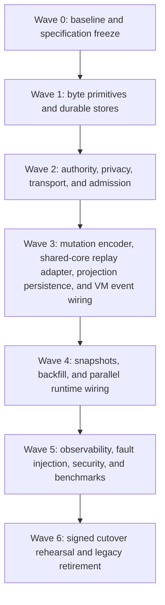

# WAL parallel-protocol implementation task pack

This directory turns OT-RFC-65 v0.11 into an implementation backlog for
OriginTrail DKG. It is intentionally created in an isolated worktree based on
the current remote `main`; it does not reuse or modify the dirty primary
checkout.

## Repository baseline

| Item | Value |
|---|---|
| Repository | `OriginTrail/dkg-v9` |
| Base ref | `origin/main` |
| Base commit | `a6f33e408335930f009c49781684bc79dd322b7b` |
| Authoritative branch | `codex/wal-005-iblt-lab` |
| Worktree | `/private/tmp/dkg-v9-wal-005-iblt-lab` |
| RFC source repository | `OriginTrail/dkgv10-spec` |
| RFC source commit | `3fae6958fd7875b2f435344f59bbbdd588430125` |
| RFC version | `0.11` |
| RFC SHA-256 | `8add36bf5f84c27a181ad5695610dc8e386615d10f537257c0defe4c132c5b1c` |
| Schema SHA-256 | `98e1dbf857a9287dac8af780a0715d01b9b1af6b00ae708ac868f18305a159cd` |
| Vectors SHA-256 | `c5221143d889461f13811e89c8f17f3405be14b6247dc94915d4bea5015bcde6` |

## Mandatory system-context contract

[OT-RFC-65-wal-byte-set-reconciliation-sync.md](OT-RFC-65-wal-byte-set-reconciliation-sync.md)
is the complete, verbatim RFC and is the
normative system context for **every** task in [TASKS.md](TASKS.md).
Its normative schema and byte fixtures are mirrored verbatim under
[`vectors/`](vectors/) and are part of that system context.

A task must not be dispatched by copying only its task section. The task runner
must receive:

1. the complete contents of `OT-RFC-65-wal-byte-set-reconciliation-sync.md` as
   system context;
2. the complete normative schema and vector files under `vectors/`;
3. the selected `WAL-xxx` task section as the task request;
4. the current repository and dependency state at execution time.

The RFC is authoritative when a task summary is shorter or ambiguous. A task
may narrow its implementation scope, but it may not weaken RFC invariants,
security boundaries, measurable goals, or acceptance gates. Any necessary RFC
change must be proposed in `dkgv10-spec` first and the system-context snapshot
must then be refreshed with its new source commit and checksum.

[OT-RFC-65-comparison-with-OT-RFC-64.md](OT-RFC-65-comparison-with-OT-RFC-64.md) is
informative context. It preserves the separate comparison with OT-RFC-64 / PR
#144 but is not a substitute for the RFC.

## Parallel-protocol boundary

Until the final cutover tasks are accepted:

- the current synchronization mechanism (`legacy`) remains
  production-authoritative;
- WAL records, reconciliation, and RDF projection run only under explicit
  `parallel` configuration;
- WAL network traffic uses separate versioned protocols and durable state;
- shadow WAL failures must be visible but must not corrupt or silently block the
  authoritative path;
- production reads must not consume shadow graphs;
- no task may introduce per-collection mixed authority;
- no legacy handler is removed before the signed hard-cutover gate.

There are two synchronization mechanisms during the parallel run, but exactly
one DKG semantic implementation, one SWM/VM model, and one verified-memory and
cryptographic implementation. The `legacy` label applies only to the current
synchronization mechanism, never to those shared semantics. WAL reconciliation
handles authenticated control bytes, `WalObjectId` sets, and complete
`WalObjectV1` byte ranges only. The deterministic replay/conflict adapter
invokes the existing semantic core; it does not reproduce DKG behavior. WAL-015
only persists the resulting projection atomically through the existing storage
adapter, and VM, finality, and reorg events enter that same core.

## Execution waves

| Wave | Tasks | Exit condition |
|---|---|---|
| 0 | `WAL-000`–`WAL-002` | Baseline receipts, frozen wire decisions, safe feature/config skeleton. |
| 1 | `WAL-003`–`WAL-006` | Canonical objects, whole-object range storage, rateless IBLT reconciliation, signed set commitments, and crash-safe WAL storage pass conformance tests. |
| 2 | `WAL-007`–`WAL-011` | Authority, private crypto adapter, wire protocols, provider discovery, and closed admission work fail-closed. |
| 3 | `WAL-012`–`WAL-016` | Local commits and identical admitted sets invoke the same existing semantic core and produce deterministic SWM/VM projections without duplicated behavior. |
| 4 | `WAL-017`–`WAL-020` | Snapshot/delta backfill and the complete network shadow protocol run beside legacy-sync authority while sharing one semantic core. |
| 5 | `WAL-021`–`WAL-022` | Security, crash, scale, and measurable-goal evidence gates pass. |
| 6 | `WAL-023`–`WAL-024` | Full-inventory cutover rehearsal passes; only then may WAL become authoritative and legacy sync be retired. |

## Task completion rules

Every task contains an **Acceptance area**. A task is complete only when every
checkbox is evidenced. “Code exists,” “unit tests pass,” or “works locally” is
not sufficient by itself.

For every task:

- preserve the RFC context and record any resolved ambiguity;
- add focused unit tests and the narrowest meaningful integration/devnet test;
- include negative and restart/fault cases, not only happy paths;
- run typecheck/build/lint for affected packages;
- attach exact commands, commit, environment, raw digests, and relevant metrics;
- store large/generated receipts as CI artifacts or under a task-specific `/tmp`
  result directory, not as accidental repository changes;
- keep the authoritative legacy-sync path unchanged unless the task explicitly owns
  cutover or retirement;
- leave the worktree clean when handing off.

## Artifacts

- [STATUS.md](STATUS.md) — task execution status with exact branch/commit evidence.
- [TASKS.md](TASKS.md) — detailed task list and acceptance areas.
- [COVERAGE.md](COVERAGE.md) — RFC-section and freeze-item coverage matrix.
- [OT-RFC-65-wal-byte-set-reconciliation-sync.md](OT-RFC-65-wal-byte-set-reconciliation-sync.md) — complete normative RFC system context.
- [`vectors/`](vectors/) — exact protocol-v1 schema registry and valid/invalid conformance bytes.
- [OT-RFC-65-comparison-with-OT-RFC-64.md](OT-RFC-65-comparison-with-OT-RFC-64.md) — separate informative comparison.
