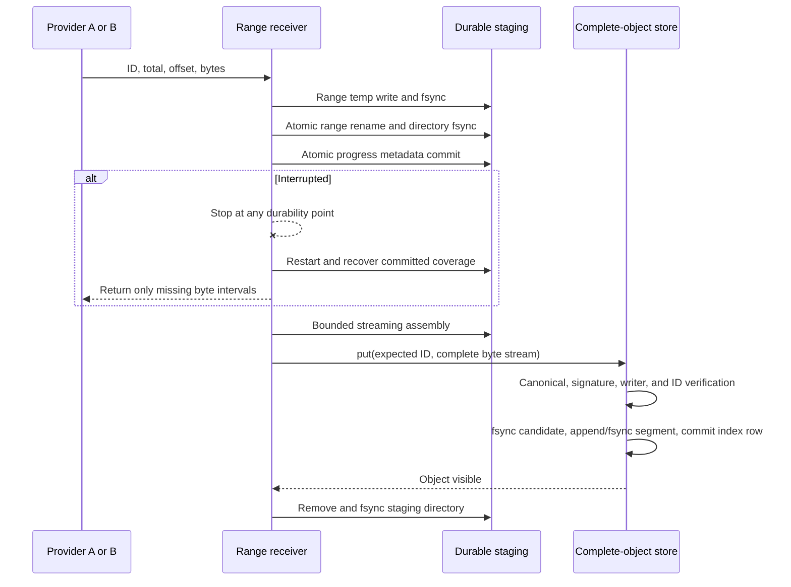

# WAL-004 implementation evidence

## Outcome

WAL-004 implements durable storage and resumable whole-object byte transfer for
the sole synchronization atom, `WalObjectV1`. The public boundary contains only
`has`, ranged `read`, verified atomic `put`, and sorted `ids`. Range staging is a
package-internal filesystem service and its JSON metadata is local restart
state—not a map-based wire encoding, content object, or reconciliation element.

The change remains inside the isolated WAL package. It registers no network
protocol, does not alter legacy graph sync, does not project RDF, and does not
change SWM/VM, verified-memory, membership, privacy, crypto-authority, chain, or
reorg semantics.

## Storage and transfer contract

- `PackedWalObjectStore` appends unchanged complete-object bytes to bounded
  local segments and uses a SQLite B-tree from the 32-byte `WalObjectId` to
  segment/offset/length. Those local fields are not protocol objects or IDs.
- The 32-byte segment header is `DKGWSEG1`, schema `u32`, reserved bytes, local
  segment ID `u64`, and reserved bytes. Every record is `DKGWREC1`, the complete
  32-byte ID, canonical length `u64`, then unchanged canonical bytes. Integers
  are unsigned big-endian. The append-only header does not carry a mutable
  catalog; SQLite owns the offset catalog and the record header binds it back
  to the physical bytes.
- Candidate streams remain invisible until canonical CBOR, EIP-191 signature,
  recovered writer, and domain-separated complete-object ID verify. Admission
  fsyncs segment bytes before committing the index row with SQLite WAL and
  `synchronous=FULL`. Repeated `put` is idempotent; reads are bounded positional
  reads; enumeration is a strict byte-ordered index cursor.
- Restart truncates any unindexed segment tail to `committed_end`. Missing,
  truncated, misheaded, misbound, or out-of-bounds physical/index state fails
  closed. The file-per-object implementation remains a reference backend.
- Ranges address those same full bytes. Separate range files avoid sparse-file
  allocation. Local metadata binds the expected ID and total length. Durable
  coverage is merged across reorder, agreeing overlap, duplicate delivery,
  restart, and provider failover.
- The receiver enforces the 8 GiB hard object ceiling, configurable 1 GiB
  default, 1 MiB range ceiling, 16 GiB physical staging quota, 65,536 parts,
  16 concurrent incomplete objects, staging lifetime, cancellation, and bounded
  64 KiB default assembly/verification buffers before promotion.
- Finalization streams the assembled file through `WalObjectStore.put`; invalid,
  wrongly signed, wrongly addressed, noncanonical, oversized, or mismatched-ID
  candidates are removed without creating a visible final object.

## Sequence and crash boundary



Fault-injection tests stop at metadata-file fsync/rename/parent fsync, range-file
fsync/rename/parent fsync, progress commit, assembly fsync, final promotion, and
staging removal. A new receiver instance then either resumes exactly the durable
missing coverage or observes the already-safe final object.

## Acceptance mapping

1. Contract tests cover an independent in-memory implementation,
   `FileWalObjectStore`, and `PackedWalObjectStore`. Zero-payload, exact
   configured ceiling, one-range, multi-range, out-of-order, agreeing overlap,
   duplicate, restart, and simultaneous-provider cases reconstruct
   byte-identical objects.
2. Negative tests cover dishonest totals, invalid arithmetic and bounds, gaps,
   truncation, conflicting overlap, malformed/noncanonical tuples, bad
   signatures, writer mismatch, wrong object ID, sparse oversized files,
   symlink/file/directory substitution, malformed metadata/parts, quota, part,
   concurrency, lifetime, and cancellation limits.
3. The restart `missing()` result excludes every durably covered interval. A
   failure before acknowledgment can therefore retry only its current range;
   already committed ranges are not requested again.
4. An 8 MiB object transfers out of order through 1 MiB ranges, assembles and
   verifies through 32 KiB buffers, and reports a 32 KiB maximum verifier read.
   A small object is admitted between the large object's ranges.
5. Schema/source assertions exclude `PayloadId`, `BlobId`, `ChunkId`, `RangeId`,
   an exported range store, or an independent payload fetch path. Complete
   `WalObjectV1` remains the sole durable content-addressed atom.
6. The package's 100% statement, branch, function, and line ratchet covers the
   new public contract, streaming verifier, filesystem store, internal receiver,
   filesystem failures, adversarial staging, restart, and fault paths.
7. The packed-store matrix records exact 10K/100K/1M/10M cardinalities in fresh
   processes. Ordered enumeration measured 9.5 ms, 97.6 ms, 936.7 ms, and
   10.24 s respectively on an Apple M3. Verified small-object `put` p95 stayed
   within 13.8–18.8 ms and verified 8 MiB `put` throughput within
   27.4–27.7 MiB/s. Synthetic SQLite cardinality aliases are explicitly
   separate from genuine canonical admission and are never read as objects.

## Validation receipts

```text
pnpm --filter @origintrail-official/dkg-wal lint
  PASS

pnpm --filter @origintrail-official/dkg-wal build
pnpm --filter @origintrail-official/dkg-wal test:types
  PASS

pnpm --filter @origintrail-official/dkg-wal test:coverage
  PASS: 20 test files passed, 1 explicit scale file skipped
  PASS: 238 tests passed, 2 explicit scale tests skipped
  PASS: 100% statements, branches, functions, and lines

pnpm --filter @origintrail-official/dkg-wal test:e2e
  PASS: 1 file, 3 tests

pnpm --filter @origintrail-official/dkg-wal test:fixtures
pnpm --filter @origintrail-official/dkg-wal test:conformance
  PASS: fixture regeneration check
  PASS: 2 conformance files, 41 tests, and conformance typecheck

node --import tsx scripts/store-benchmark.ts --matrix --write-baseline
  PASS: fresh-process 10K, 100K, 1M, and 10M matrix recorded
  PASS: preparation time is reported and excluded from measured totals
```
