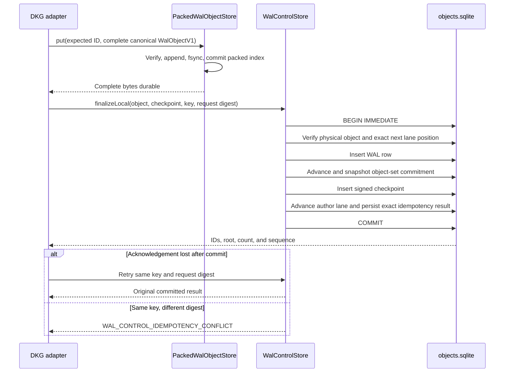

# WAL-006 implementation evidence

## Outcome

WAL-006 implements the crash-safe control state behind the parallel WAL
protocol. `WalControlStore` atomically records admitted complete objects,
author-lane progress, set commitments, signed checkpoints, idempotency results,
remote admission, materialization state, provider state, bounded caches,
quarantine, GC, and persistent retries. It uses the packed object's SQLite
index so a logical WAL object cannot reference bytes that are not already
durable.

The implementation remains confined to `@origintrail-official/dkg-wal`. It
does not register a network protocol, mutate Oxigraph, replace current graph
sync, or change DKG/SWM/VM, verified-memory, membership, privacy, crypto,
chain, or reorg semantics. RDF remains a downstream rebuildable projection.

## Durable layout and schema

- `objects.sqlite` retains the packed store's `user_version = 1`. The control
  layer owns a separate explicit `wal_control_schema` version, installed by one
  transaction and rejected when missing, older, or newer than supported.
- The control connection uses SQLite `WAL`, `synchronous=FULL`, foreign keys,
  `BEGIN IMMEDIATE`, and a process-local per-database asynchronous writer mutex.
- Version-1 tables are `wal_objects`, `object_ranges`,
  `set_commitment_nodes`, `checkpoints`, `author_lanes`, `iblt_cache`,
  `vectors`, `idempotency`, `admission`, `materialization`, `peer_state`,
  `retry_queue`, `quarantine`, and `gc_queue`, plus schema and rollback-guard
  metadata.
- Protocol `u64` positions are stored as fixed 8-byte unsigned big-endian blobs,
  avoiding SQLite signed-integer truncation. IDs and roots have fixed-width
  checks. Foreign keys bind complete bytes, previous objects, checkpoints,
  policies, baselines, lanes, and set roots.
- `rollback-high-water.sqlite` is a separately versioned mode-`0600` database,
  excluded from normal graph/WAL snapshot restore. A random 16-byte guard pairs
  it to the control database. Missing, substituted, malformed, mismatched, or
  decreasing high-water state blocks operation instead of being recreated.
- Public control APIs are exported through
  `@origintrail-official/dkg-wal/control` and the package root.

## Atomic local finalization



Finalization verifies canonical object/checkpoint identities, recovered writer,
namespace, epoch, sequence, previous link, checkpoint number, object-set root,
count, maximum sequence, previous checkpoint, policy, and baseline references.
No graph or network operation occurs inside the transaction. Fault injection
after the object insert, set update, checkpoint insert, before commit, after
rollback, and after commit proves old-or-complete-new state. A lost post-commit
acknowledgement remains a committed result and is recovered by idempotent replay.

## Remote admission, bounded work, and recovery

Remote objects are first staged with proof, closure, and provider metadata.
Only a physically present and byte-verified complete batch can atomically add
logical WAL rows and transition every member from `STAGED` to `ADMITTED`.
Missing bytes or a non-staged member rolls the whole batch back. WAL-007 through
WAL-011 supply the authority and causal-closure policies that precede this
durable boundary.

Retry work is persistent, priority ordered, attempt bounded, byte/count bounded,
and leased. Restart returns expired leases to `READY`; exhausted entries become
`BLOCKED`. Quarantine is bounded per peer by bytes/count and expires. IBLT cache
uses byte/count limits plus deterministic oldest-first eviction. GC work is
byte/count bounded. Range, cache, and quarantine metadata have explicit expiry.

Orphan ownership is intentionally split by physical format:

1. `PackedWalObjectStore` truncates unindexed segment tails after a crash.
2. The range receiver validates and removes orphan/expired range staging files.
3. `WalControlStore.cleanupExpired()` removes expired durable range/cache/
   quarantine rows.
4. The GC queue records eligible physical cleanup work without deleting bytes
   inside a control transaction.

```mermaid
sequenceDiagram
    participant R as Restarting runtime
    participant C as Control database
    participant H as Protected high-water database
    participant Q as Retry and cleanup state
    R->>C: Validate schema, quick_check, foreign keys, physical bindings
    R->>C: Rebuild and compare lane commitment roots/count/membership
    R->>H: Validate independent schema and paired guard
    alt Any mismatch or corruption
        R-->>R: blocked; no false complete and no RDF mutation
    else Valid durable state
        R->>Q: Recover expired leases and expire bounded metadata
        R-->>R: complete; replay may resume
    end
```

## Acceptance mapping

1. Fresh creation, interrupted migration rollback, reopen, missing version,
   unsupported version, missing packed schema, symlink substitution, missing
   high-water file, high-water schema/guard substitution, and interrupted guard
   adoption are deterministic and fail closed.
2. Fault hooks cover each local transaction durability boundary. Raw SQLite
   triggers cover staging, batch admission, leasing, IBLT cache, and vector
   transaction failures. Every test observes either zero logical rows or the
   complete committed state.
3. Packed-object foreign keys and checkpoint/set/lane foreign keys prevent an
   acknowledged object or checkpoint from referencing absent physical bytes or
   required state. Lost-ack replay proves an acknowledged commit remains present.
4. Idempotency persists across close/reopen, returns the original result for
   the same digest, and rejects key reuse with another digest.
5. Integrity tests cover SQLite inspection failure, foreign-key/physical-record
   deletion, lane count, set membership, missing/corrupt commitment snapshot,
   snapshot metadata mismatch, and unavailable rollback storage. Every result is
   `blocked`; subsequent mutation is refused.
6. Adversarial tests enforce retry count/bytes/attempts/lease state, per-peer
   quarantine count/bytes/retention, IBLT count/bytes/expiry, range bounds and
   expiry, and GC count/bytes.
7. The package's 100% statement, branch, function, and line ratchet covers all
   control schema, transaction, restart, idempotency, fault, corruption, and
   bounded-resource paths.

## Validation receipts

```text
pnpm --filter @origintrail-official/dkg-wal lint
pnpm --filter @origintrail-official/dkg-wal build
pnpm --filter @origintrail-official/dkg-wal test:types
  PASS

Node 24.11.1: vitest run --coverage
  PASS: 21 test files passed, 1 explicit scale file skipped
  PASS: 263 tests passed, 2 explicit scale tests skipped
  PASS: 100% statements, branches, functions, and lines
  PASS: WalControlStore focused suite 25/25

pnpm --filter @origintrail-official/dkg-wal test:fixtures
pnpm --filter @origintrail-official/dkg-wal test:conformance
  PASS: fixture regeneration check
  PASS: 2 conformance files, 41 tests, and conformance typecheck
```
