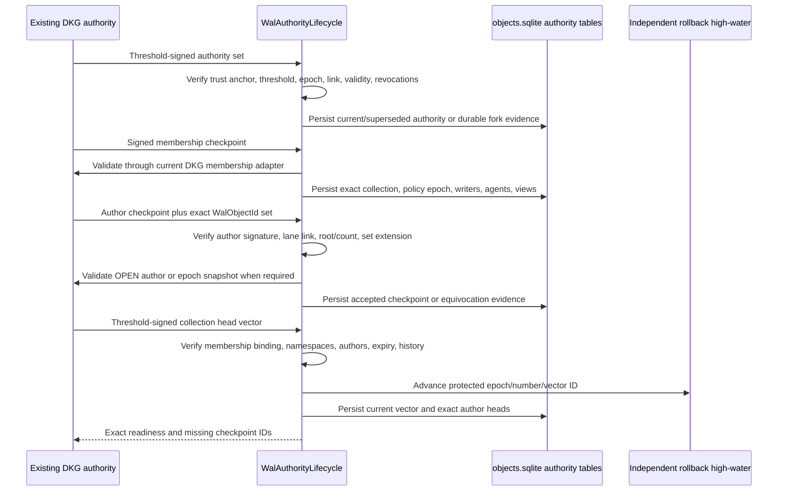

# WAL-007 implementation evidence

## Outcome

WAL-007 implements the signed authority lifecycle that decides whether an exact
WAL replication view is `complete`, `known-incomplete`, `unknown-freshness`, or
`blocked`. It validates threshold authority sets, signed membership
checkpoints, per-author checkpoint chains and set extensions, curator head
vectors, vector/authority rotation, emergency revocation, persisted fork
evidence, and independently protected rollback high-water recovery.

This changes replication authority bookkeeping only. Existing DKG membership,
agent delegation, chain authorization, verified-memory/snapshot validation,
RDF policy admission, SWM/VM behavior, and cryptographic authority remain the
source of truth behind `DkgWalAuthorityAdapter`. The legacy synchronization path
remains production-authoritative and unchanged.

## Authority and completeness flow



Completeness is granted only when the current vector is signed by the current,
unexpired, non-revoked curator authority; references the current membership;
names every and only active namespace; and every named author checkpoint is
locally accepted without equivocation. An unindexed OPEN author, missing RDF
policy object, or missing checkpoint is explicitly `known-incomplete`. Missing
rollback protection, stale authority, stale membership binding, expired vector,
or rotation without a replacement is `unknown-freshness`. Persisted authority,
vector, or author forks are `blocked`.

## Private disclosure remains a DKG decision

```mermaid
sequenceDiagram
    participant P as Authenticated transport peer
    participant A as WAL authority gate
    participant B as CurrentDkgWalAuthorityAdapter
    participant D as Existing DKG membership/delegation source
    P->>A: Request exact private collection/view/key epoch
    A->>A: Evaluate current authority, membership, vector, checkpoints
    alt Not current and complete
        A-->>P: Uniform false; no root, count, ID, size, or provider metadata
    else Complete private view
        A->>B: Agent address, transport peer, exact membership ID, delegation
        B->>B: Existing verifyAgentDelegation signature/scope/time checks
        B->>B: Bind recovered agent and delegatee peer exactly
        B->>D: Fresh current membership/revocation decision
        D-->>B: allow or deny
        B-->>A: boolean only
        A-->>P: disclose only on allow
    end
```

The bridge owns no membership cache and mints no authority. Op-key-only
delegations fail closed at this boundary because its input carries an
authenticated transport peer but no authenticated carrier operational key.
Later wire work may extend the request proof shape, but may not weaken that
binding.

## Durable schema and rollback recovery

- WAL control schema version 2 adds authority sets/revocations/forks,
  membership checkpoints, author checkpoint evidence/equivocations, collection
  vectors/forks, and exact vector heads.
- Version 1 migrates to version 2 in one `BEGIN IMMEDIATE` transaction. Injected
  failure rolls all DDL and the schema version back; retry completes normally.
- All protocol `u64` positions remain fixed-width unsigned big-endian blobs.
  Canonical signed bytes remain durable evidence and are re-decoded with their
  content-addressed ID binding on every authority decision.
- A missing rollback database is never silently recreated. Recovery requires a
  threshold-valid `RollbackRecoveryV1`, current network authority, exact
  network/collection binding, and a position at or above the independently
  established cohort minimum. The trusted control-store method only installs
  an already verified minimum into a confirmed-missing file paired to the
  original guard.

## Acceptance mapping

1. Exact-completeness tests cover current membership/vector/checkpoint
   agreement, restart persistence, missing policies/checkpoints, unindexed OPEN
   authors, stale membership vectors, and wrong collection/view/policy/key
   epochs.
2. Negative tests persist and block on same-position authority, vector, and
   author-checkpoint forks; reject expired/stale/unlinked/rolled-back evidence;
   and verify stable WAL authority error/status codes.
3. Private-disclosure tests prove that public, incomplete, stale, revoked,
   forked, removed-agent, wrong-peer, wrong-scope, expired, malformed, and
   callback-error paths disclose nothing.
4. Rotation tests cover threshold HA curator rotation, vector-epoch reset,
   same-authority vector increments, emergency network-authority revocation,
   author epoch snapshots, high-water loss, cohort-bounded restore, and failure
   to restore without the original control guard.
5. Curator/content separation is enforced for membership writer lists, author
   checkpoints, and vector heads. Provider/cache state never participates in an
   authority decision.
6. The existing agent-delegation and private-request authorization golden tests
   run unchanged beside the new bridge test. The bridge forwards membership,
   OPEN-author chain checks, epoch-snapshot validation, policy admission, and
   fresh private membership decisions to current DKG callbacks.

## Validation receipts

```text
Node 24.11.1: vitest run --coverage (packages/wal)
  PASS: 22 test files passed, 1 explicit scale file skipped
  PASS: 285 tests passed, 2 explicit scale tests skipped
  PASS: 100% statements, branches, functions, and lines
  PASS: authority lifecycle 19/19; control store 28/28

Node 24.11.1: vitest unit config
  test/wal-authority-adapter.test.ts
  test/agent-delegation.test.ts
  test/request-authorize.test.ts
  PASS: 3 files, 37 tests

pnpm exec tsc --noEmit --target ES2022 --module NodeNext \
  --moduleResolution NodeNext --strict --skipLibCheck \
  packages/agent/src/wal/authority-adapter.ts \
  packages/agent/test/wal-authority-adapter.test.ts
  PASS

pnpm --filter @origintrail-official/dkg-agent... build
  PASS: dependency-aware build of WAL, RDF utils, EVM module, core, chain,
        storage, query, publisher, random sampling, and agent type tests

pnpm --filter @origintrail-official/dkg-wal lint
pnpm --filter @origintrail-official/dkg-wal test:fixtures
pnpm --filter @origintrail-official/dkg-wal test:conformance
  PASS: lint/typecheck, fixture regeneration check, 41 conformance tests,
        and conformance typecheck
```
