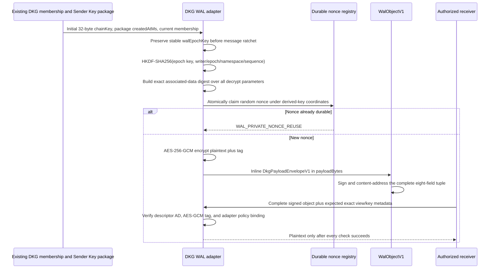

# WAL-008 implementation evidence

## Outcome

WAL-008 implements the private adapter envelope entirely inside
`WalObjectV1.payloadBytes`. Private content uses the existing DKG Sender Key
epoch, a domain-separated per-object HKDF-SHA256 key, AES-256-GCM, a random
12-byte nonce, and the exact RFC associated-data tuple. The complete envelope
remains covered by the enclosing `WalObjectV1` signature and identity; there is
no payload, plaintext, ciphertext, nonce, or range synchronization atom.

This does not replace DKG membership, Sender Key distribution, delegation,
SWM/VM lifecycle, verified-memory checks, or chain crypto. The WAL bridge only
projects a currently authorized existing Sender Key state into crypto inputs.
The legacy synchronization path remains production-authoritative and unchanged;
the shared semantic and cryptographic implementations are not legacy.

## Private payload write and read flow



The frozen vector now covers the complete key schedule instead of beginning at
an already-derived AES key. It contains an epoch key, the independently derived
object key, exact coordinates/metadata, nonce, associated-data digest,
ciphertext/tag, and canonical envelope. Node `hkdfSync` and WebCrypto HKDF
independently reproduce the object key before independent AES-GCM decryption.

## Authorization-before-disclosure and rotation

```mermaid
sequenceDiagram
    participant P as Authenticated transport peer
    participant G as Uniform private disclosure gate
    participant D as Current DKG authority and membership
    participant S as Private WAL store
    P->>G: Exact collection/view/policy/key epoch and delegation
    G->>D: Fresh current private-member decision
    alt Unauthenticated, removed, stale, wrong view/key, or callback failure
        D-->>G: deny or error
        G-->>P: one denied shape
        Note over G,S: Store lookup is never invoked; no root/count/ID/size/proof/provider/ciphertext leaks
    else Current and authorized
        D-->>G: allow
        G->>S: Load exact private value
        S-->>G: value or error
        G-->>P: value, or the same denied shape on error
    end
```

- Sender and receiver preserve a stable copy of the initial package chain key;
  normal Sender Key message ratchets cannot change WAL decryption.
- `keyEpoch` is the package `createdAtMs`. Rotation for the same sender/view is
  made strictly monotonic even if two epochs are created in one millisecond.
- Persisted pre-WAL Sender Key states continue to support legacy traffic but
  fail closed with `DKG_WAL_SENDER_KEY_ROTATION_REQUIRED` for WAL use.
- Removal remains an existing DKG membership decision. Rotation prevents
  future writes and serving to the removed member. It cannot erase ciphertext
  or keys already obtained; the RFC explicitly describes this as future
  secrecy, not retroactive revocation.

## Durable nonce schema and recovery

Control schema version 3 adds `private_payload_nonces`, uniquely keyed by the
object-key derivation coordinates and nonce, while retaining key epoch as audit
metadata. The claim happens before encryption, uses `INSERT OR IGNORE`, and
survives process/store restart. Version
1 migrates sequentially through the authority-aware version 2 and private
version 3, with each step independently transactional. Injected crashes leave
the previous version and table set intact; retry completes normally.

## Acceptance mapping

1. Existing Sender Key package delivery remains the only source of epoch keys.
   End-to-end legacy Sender Key tests prove the sender and receiver obtain the
   same stable initial key while their normal message chain keys ratchet.
2. The fixed vector decrypts exactly. Negative tests cover wrong collection or
   view (namespace), author, writer epoch, sequence, epoch key, key epoch,
   nonce, associated data, policy callback, payload kind, codec, media type,
   ciphertext, tag, truncation, and canonical length.
3. Durable nonce reuse is rejected before encryption across restart. Random
   nonce tests produce different envelopes/ciphertexts for identical plaintext,
   and prove neither plaintext nor its digest is advertised. Mutating envelope
   metadata invalidates the enclosing WAL signature.
4. Unauthenticated, removed, stale-policy, wrong-view, probing, callback-error,
   lookup-error, and downgrade cases expose one denial shape. Denied requests
   do not invoke the private store loader.
5. Sender Key rotation changes both key epoch and stable epoch key. The old key
   cannot decrypt new content, and the non-retroactive limit is normative in
   the RFC.
6. Public `MOVE_TIER_TARGET` fixtures are checked against every private source
   namespace, object ID, transition nonce, state/result digest, and known
   private source label. `MOVE_TIER_SOURCE` is rejected in a public envelope.

## Validation receipts

```text
Node 24.11.1: vitest run --coverage (packages/wal)
  PASS: 23 test files passed, 1 explicit scale file skipped
  PASS: 295 tests passed, 2 explicit scale tests skipped
  PASS: 100% statements, branches, functions, and lines
  PASS: private payload 8/8; control store 30/30

Node 24.11.1: complete agent isolated unit config
  PASS: 96 files, 1,192 tests
  PASS: includes wal-private-payload-adapter, wal-authority-adapter,
        agent-delegation, request-authorize, sender-key
        fanout/persistence/stale-target, and SWM gossip regressions

Node 24.11.1: conformance verification
  PASS: deterministic vector regeneration check
  PASS: 2 files, 41 tests; conformance typecheck
  PASS: Node crypto and WebCrypto independently reproduce HKDF/AES vector

Node 24.11.1: dependency-aware agent build
  PASS: WAL, RDF utils, EVM module, core, chain, storage, query, publisher,
        random sampling, agent, and agent type tests
```
