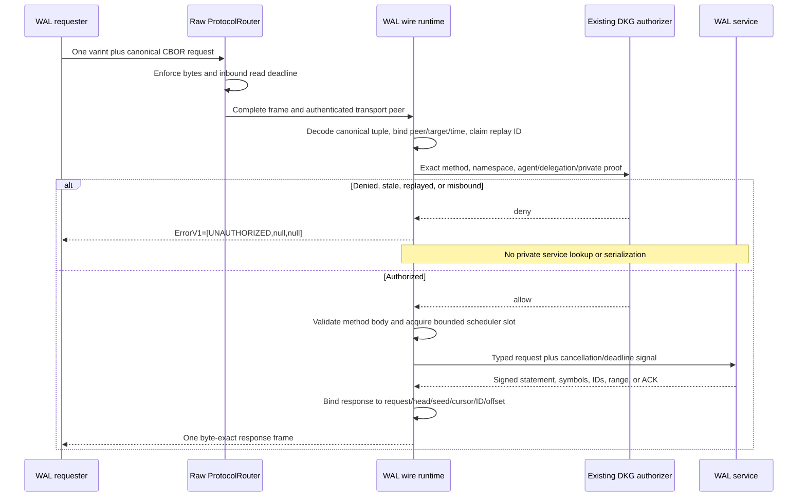

# WAL-009 implementation evidence

## Outcome

WAL-009 implements the three bounded authenticated protocol-v1 wire families
directly over the raw `ProtocolRouter`:

```text
/dkg/10.1.0/wal-control
/dkg/10.1.0/wal-reconcile
/dkg/10.1.0/wal-object
```

The implementation includes canonical length-prefixed CBOR framing, the full
frozen method/error catalog, structural transport/proof binding, replay and
freshness protection, authorization-before-disclosure, request/response proof
binding, capability negotiation, cancellation, handler/read deadlines,
bounded scheduling, and requester/provider transition machines. It does not
use `Messenger` or its reliable outbox as WAL correctness storage.

This is a parallel protocol surface. It does not replace DKG membership,
delegation, SWM/VM behavior, verified-memory logic, RDF policy, chain checks,
or cryptographic authority. The integration authorizer calls those existing
decisions after the generic wire runtime validates shape, time, and transport
bindings. No `/dkg/10.0.x/*` handler was changed; legacy remains authoritative.

## Wire and authority boundary



`GET_CAPABILITIES` negotiates only protocol v1 and the highest common RDF
adapter version. Numeric limits are pairwise minima and cannot raise local or
version hard caps. Private requests never downgrade to a legacy protocol or a
different disclosure view. Retries and provider switches mint a new 16-byte
request ID.

## Bounded execution

- The router caps the complete frame and applies an opt-in 20-second inbound
  read deadline. Undefined keeps the preexisting legacy behavior.
- The decoder rejects non-shortest/unterminated varints, truncated/trailing
  bytes, non-canonical CBOR, oversized strings/arrays, excessive nesting,
  unknown methods, and inexact tuples before service dispatch.
- Replay retention is bounded at 16,384 IDs per peer and 131,072 globally for
  the 90-second freshness window. Outstanding requests are bounded at 128 per
  peer and 1,024 globally.
- Reconciliation and per-namespace object transfer have independent active
  limits and bounded queues. Queue saturation is stable `RESOURCE_LIMIT`.
- Cancellation and the 20-second handler deadline abort queued or running
  service work. `CANCEL` is available in every family.
- Symbols, fallback pages, object sizes, range lengths, offsets, totals, and
  response bindings are checked before admission. A provider session never
  proves correctness.

## Independent golden vectors

The language-neutral protocol vector now includes exact request and response
bytes for all 11 family-specific catalog entries, all 9 stable error codes,
one-, two-, and three-byte varint boundaries, method-specific invalid bodies,
and malformed framing cases. The conformance package has an independent
varint/frame implementation. It regenerates the bytes without importing the
production WAL wire implementation; production then consumes and reproduces
the checked-in bytes exactly.

## Acceptance mapping

1. All valid golden frames round-trip exactly. Noncanonical, truncated,
   trailing, oversized, unsupported-version, stale, replayed, wrong-peer,
   wrong-target, wrong-request-ID, and response-binding inputs fail.
2. Every method and stable error has checked-in valid and invalid bytes;
   framing widths have explicit boundary vectors. Requester/provider state
   tests cover equal sets, incremental IBLT, fallback/backfill, range fetch,
   provider switching, cancellation, failure, queueing, and terminal-state
   rejection. Unknown messages never dispatch.
3. Structural binding and the existing DKG authorization callback both run
   before the method body reaches a service. Denial and callback failure return
   the same three-field tuple and private lookup spies remain untouched.
4. Registration is additive at `/dkg/10.1.0/*`. The only shared-router change
   is an opt-in per-registration read deadline; the default is undefined, and
   all 69 router regression tests pass.
5. Adversarial tests cover slowloris reads, length/count mismatch, symbol
   windows/bombs, fallback cursor/count abuse, dishonest object totals,
   overflow, EOF shape, replay capacity, cancellation, timeout, queue
   saturation, and concurrent request/stream limits.
6. Negotiation tests prove pairwise minima, common adapter selection, missing
   v1 rejection, missing adapter rejection, and explicit private no-downgrade.
7. Signed head/vector/checkpoint IDs, reconciliation head/seed/window, fallback
   head/cursor/page, and object ID/total/offset/range are independently bound.
   Discovery remains outside these protocols and becomes WAL-010; a discovered
   peer is only an untrusted candidate until transport and DKG authorization.

## Validation receipts

```text
Node 24.11.1: vitest run --coverage (packages/wal)
  PASS: 28 test files passed, 1 explicit scale file skipped
  PASS: 397 tests passed, 2 explicit scale tests skipped
  PASS: 100% statements, branches, functions, and lines
  PASS: wire runtime 54/54; wire codec 24/24; framing 17/17;
        independent wire vectors 3/3; state/replay 4/4

Node 24.11.1: conformance verification
  PASS: deterministic schema/vector regeneration check
  PASS: 2 files, 49 tests; strict TypeScript typecheck

Node 24.11.1: packages/core
  PASS: ProtocolRouter 69/69, including opt-in slowloris deadline
  PASS: TypeScript build

Node 24.11.1: packages/wal
  PASS: strict test typecheck and TypeScript build

Node 24.11.1: packages/agent WAL wire registration boundary
  PASS: focused unit test 1/1
  PASS: isolated strict TypeScript check
```
