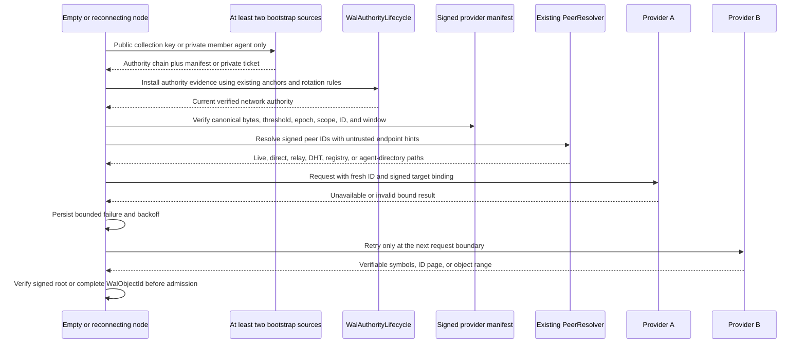

# WAL-010 implementation evidence

## Outcome

WAL-010 implements provider bootstrap, selection, durable availability state,
bounded failover, and public/private cold start for the parallel WAL protocol.
It preserves the separation between three different facts:

1. the existing DKG authority lifecycle decides which signed bootstrap evidence
   is current;
2. the signed provider manifest identifies authorized candidate peers; and
3. the existing `PeerResolver` and live transport state decide which paths are
   currently usable.

None of those facts is a content-set, object-byte, or completeness proof.
`WalObjectV1` remains the sole durable content-addressed synchronization atom.
Manifests, tickets, paths, scores, backoff rows, range parts, and IBLT symbols
remain signed control evidence or bounded local/ephemeral state.

The implementation is additive. It does not alter legacy synchronization, SWM/VM
semantics, verified memory, membership, delegation, chain checks, private
crypto, or the `/dkg/10.0.x/*` protocols. The current stack remains
synchronization-authoritative in `legacy` and `parallel` modes.

## Trust and path boundary



`WalAuthorityLifecycle` now structurally supplies the discovery authority
adapter. `acceptAuthorityEvidence` is only an alias for the existing full
`acceptAuthoritySet` path; it cannot bypass genesis trust anchors, threshold
signatures, linked rotations, revocation, fork blocking, time windows, or
durable persistence. `currentNetworkAuthority` returns `null` only when an
authority has not yet been installed. Invalid, expired, revoked, or forked
state remains an error.

The DKG agent adapter accepts canonical libp2p multihash bytes, validates each
signed or persisted multiaddress independently, checks an embedded `/p2p`
target when present, merges only valid paths into the existing address book,
and then runs the existing resolver. Live connections, DHT, network registry,
agent directory, direct connections, and relay paths remain availability
sources. A raw endpoint string is never promoted directly to a usable path.

## Public and private bootstrap

- Public cold start requires at least two distinct configured sources and
  bounds both source work and provider resolution fan-out.
- Authority evidence is processed oldest to newest through the persisted DKG
  lifecycle. A malformed or malicious source cannot define the target.
- Provider manifests are canonical exact tuples, threshold-signed by the
  current network authority, and bound to network, collection, authority epoch,
  authority-set ID, validity window, peer identity, agent identity, endpoints,
  and namespaces.
- Private bootstrap sends only `memberAgentAddress` to discovery
  infrastructure. It does not send collection, view, namespace, root, count,
  or provider metadata.
- The existing private membership/crypto opener returns the complete canonical
  signed `ProviderBootstrapManifestV1` bytes. The outer ticket binds its
  manifest ID, collection, member agent, membership checkpoint, window, and
  nonce. Every failure collapses to a uniform denial/no-ticket state.

## Selection, failover, and persistence

- Candidate, source, selected-provider, resolution-fan-out, endpoint, path,
  retry-attempt, and exponential-backoff limits are explicit and validated.
- Candidate paths are deduplicated deterministically. Live/direct/reachable
  transport paths rank above relays and signed/persisted hints; prior successes
  and failures adjust a bounded score without changing signed identity.
- Provider changes occur only between complete requests. A value is accepted
  only after the caller verifies its signed head/root/cursor/range binding.
- Success/failure counts, backoff deadline, and availability hints persist in
  the WAL control SQLite database. Restart tests prove that unavailable peers
  are skipped until their deadline and retries remain bounded.
- All-provider failure reports `known-incomplete` when a fresh signed target is
  known and `unknown-freshness` otherwise. Provider discovery never returns
  `complete`.

## Acceptance mapping

1. A no-state integration test uses the real `WalAuthorityLifecycle`, installs
   threshold-valid genesis network evidence from two sources, verifies the
   manifest, resolves a path, and returns one provider.
2. Tests drop sources, hints, resolver paths, and gossip-equivalent inputs;
   inject malformed, stale, foreign, conflicting, and incorrectly signed
   manifests; and change direct paths to relays while preserving the same
   signed target.
3. One integrated test switches providers independently during rateless-IBLT
   symbol acquisition, sorted fallback-page enumeration, and whole-object range
   transfer. It reconstructs the exact root and exact canonical bytes, repeats
   one range, and proves only one durable range part per unique request range.
4. Private tests assert that source calls contain only the member agent and that
   malformed, stale, empty, misbound, unauthorized, or incorrectly opened
   tickets disclose no collection/provider metadata.
5. SQLite restart tests preserve failure counts, backoff, availability hints,
   and retry work. Concurrency spies prove source and resolution fan-out bounds;
   deterministic exponential backoff prevents tight loops.
6. No-authority, no-manifest, no-ticket, denied-ticket, and all-provider-down
   cases prove the exact non-complete readiness classification.

## Devnet boundary

These components are sufficient to begin a WAL devnet lane and to add one
scenario per subsequent task. They do not, by themselves, claim multi-daemon
WAL exchange: the daemon still needs to instantiate and register a concrete
`WalWireProtocolServer` in `parallel` mode and connect discovery candidates to
the requester driver. The first devnet smoke must therefore prove real
`GET_CAPABILITIES`, direct-to-relay failover, restart persistence, and unchanged
legacy results before later tasks add admission, projection, backfill, and
cutover scenarios. In-process reconciliation tests are not reported as devnet
evidence.

## Validation receipts

```text
Node 24.11.1: packages/wal full coverage
  PASS: 29 test files passed, 1 explicit scale file skipped
  PASS: 419 tests passed, 2 explicit scale tests skipped
  PASS: 100% statements, branches, functions, and lines
  PASS: provider discovery 22/22; authority lifecycle 19/19;
        control store 30/30

Node 24.11.1: packages/wal strict test typecheck
  PASS: tsc -p tsconfig.test.json --noEmit

Node 24.11.1: packages/agent provider-resolution boundary
  PASS: provider resolver adapter 4/4; wire registration boundary 1/1
  PASS: isolated strict TypeScript check
```
