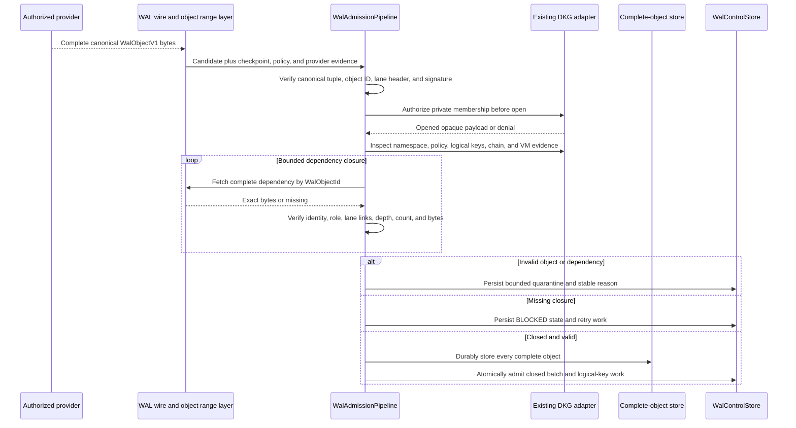

# WAL-011 implementation evidence

## Outcome

WAL-011 implements one fail-closed admission pipeline for complete canonical
`WalObjectV1` bytes received through network, backfill, or replay paths. The
same validation method is available to the future local compiler path; local
durable commit itself remains deliberately reserved for WAL-013.

The generic layer never interprets RDF, SPARQL, SWM, VM, verified-memory, or
private-crypto payload semantics. It verifies the complete content-addressed
atom and delegates application inspection, authority, policy, decryption,
cross-author permissions, chain evidence, and VM evidence to an injected DKG
adapter. Existing DKG semantics remain authoritative in both `legacy` and
`parallel` mode.

## Admission boundary



No staged, blocked, or quarantined candidate becomes canonical or shadow RDF.
The physical object store is append-only, while the control-store transaction
is the visibility boundary: either the complete closed batch and all affected
logical keys are admitted together, or none are visible as admitted.

## Validation and closure behavior

- Canonical bytes, object identity, writer/lane header, complete-object
  signature, checkpoint inclusion, namespace, payload envelope, adapter
  version, policy, cross-author permission, chain, and VM evidence are checked
  in a fixed fail-closed order.
- Private membership authorization runs before payload opening, adapter
  inspection, or any collection-specific disclosure.
- Parent, base-head, policy, and content references form one bounded closure.
  Cycles, wrong fetched identities, lane-link substitution, cross-view
  references, equivocation, excessive depth/count/bytes/references, and
  oversized objects are rejected or blocked with stable codes.
- Missing dependencies persist deterministic BLOCKED state and retry work.
  A later backfill can restage the candidate and admit it without accepting
  provider omission as deletion.
- Invalid bytes use bounded durable quarantine with provider provenance.
  Quarantine cannot overwrite or evict an already admitted canonical object.
- Validation parity tests feed the same bytes through local, network,
  backfill, and replay ingress and receive the same semantic result.

## First cumulative daemon/devnet lane

The branch now also instantiates the concrete raw WAL runtime in daemon
`parallel` mode. It registers the three frozen protocol families after
libp2p starts, publishes the changed registrar set through identify-push, and
exposes an authenticated operator-only capability probe. At this milestone:

- real `GET_CAPABILITIES` is enabled;
- later reconciliation and object methods fail closed as unavailable;
- `productionAuthority` remains `legacy`;
- `workersActive` remains zero; and
- `legacy` mode still registers no WAL runtime or WAL protocols.

This establishes a cumulative devnet acceptance lane. Each subsequent task
adds its own externally observable scenario to the same topology; unit,
property, crash, and benchmark suites remain required where daemon behavior
cannot prove the invariant.

The live three-node run used one core and two edge nodes. Core-to-edge pairs
`1<->2` and `1<->3` each advertised all WAL families, exchanged authenticated
capabilities in both directions, and repeated after the edge daemon restarted.
An edge-to-edge advertisement was intentionally not claimed: those two nodes
do not maintain a direct identified connection in this topology. A relay-only
case remains an explicit topology-specific test rather than being inferred
from an in-process or core-to-edge connection.

## Validation receipts

```text
Node 24.11.1: packages/wal full coverage
  PASS: 30 test files passed, 1 explicit scale file skipped
  PASS: 462 tests passed, 2 explicit scale tests skipped
  PASS: 100% statements, branches, functions, and lines
  PASS: admission pipeline 28/28

Node 24.11.1: focused integration regressions
  PASS: packages/core identify-push wiring 3/3
  PASS: packages/agent concrete WAL runtime and PeerId boundary 3/3
  PASS: packages/cli authenticated capability route 3/3
  PASS: core, agent, and CLI TypeScript builds

Isolated three-node devnet
  PASS: node 1 <-> node 2 capability exchange and node 2 restart
  PASS: node 1 <-> node 3 capability exchange and node 3 restart
  PASS: all checked daemons mode=parallel, productionAuthority=legacy,
        workersActive=0, protocolsRegistered=true
```
