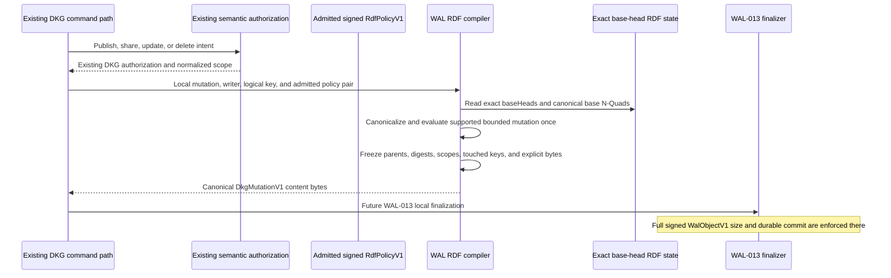
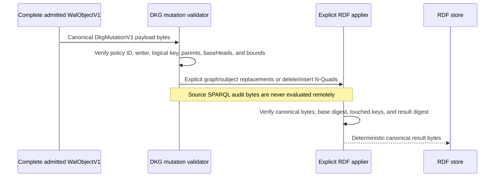

# WAL-012 implementation evidence

## Outcome

WAL-012 implements the deterministic RDF adapter boundary for OT-RFC-65. A
supported local DKG mutation is evaluated once against an exact admitted base,
then encoded as canonical `DkgMutationV1` bytes containing an explicit
`RdfMutationV1`. A remote node applies those bytes after validation; it never
executes the originating SPARQL text.

This is an additive shadow component. It does not replace DKG publish/share/
update/delete authorization, SWM or VM lifecycle rules, verified-memory
promotion, chain evidence, membership, or private cryptography. Those existing
semantics remain the oracle and legacy remains production-authoritative. Local
durable `WalObjectV1` finalization and publisher wiring belong to WAL-013.

## Local compilation boundary



The compiler accepts only author-scoped logical keys or explicitly shared keys
whose writer is a current member. Its caller must supply the current admitted
`RdfPolicyV1` together with its `WalObjectId`; policy admission verifies the
threshold-signed object against the current authority set and adapter version.
WAL-013 must pass this admitted pair atomically rather than accepting an
unbound public policy tuple.

## Remote application boundary



The optional source-SPARQL field is non-consensus audit data. Tests replace it
with malicious `DROP ALL` text and prove that remote application still derives
the same result solely from the explicit canonical mutation bytes.

## Canonicalization and policy rules

- Canonical N-Quads are UTF-8, LF-terminated, NFC-normalized, blank-node-free,
  escape-normalized, deduplicated, and sorted by unsigned UTF-8 byte order.
- Language tags are lower-cased and every graph, subject, predicate, and IRI is
  absolute and canonical. State digests, author-scoped logical keys, and
  graph/subject/predicate touched keys use separate domain tags.
- `RdfPolicyV1` is an exact canonical tuple pinned to adapter version 1. It
  bounds graphs, quads, object bytes, predicate classifications, shared-write
  keys, resolver/expiry authorities, and allowed payload kinds.
- Ordinary mutation `parents` equal the sorted exact `baseHeads`. PUT is an
  exact REPLACE, PATCH may be an explicit patch or exact replacement scope, and
  DELETE removes the whole logical key through an explicit tombstone mutation.
- Supported local SPARQL is limited to `INSERT DATA`, `DELETE DATA`, and bounded
  scoped `DELETE`/`INSERT`/`WHERE`. `SERVICE`, graph variables, default-graph
  access, load/drop/global operations, nondeterministic functions, escaping
  variables, and unsupported functions fail before content bytes exist.

## Acceptance mapping

1. The frozen protocol vector now contains canonical N-Quads, state digest,
   logical/touched keys, exact `RdfPolicyV1`, `RdfMutationV1`, and
   `DkgMutationV1` bytes. The package implementation and an independent
   TypeScript conformance consumer reproduce every byte and digest.
2. Embedded Oxigraph and the Blazegraph HTTP N-Quads adapter reproduce the same
   frozen canonical bytes and digest independent of store result order.
3. Publish PUT, shared-writer authorization, metadata update, scoped SPARQL
   update, and whole-key delete fixtures cover the existing DKG operation
   shapes. The unchanged publisher and agent semantic-oracle suites prove the
   legacy WM, SWM, VM, verified-memory, publish, share, and update outcomes.
4. Negative suites cover blank nodes, malformed/non-canonical RDF, unknown
   adapter versions, policy substitution, unauthorized shared writers,
   unsupported or nondeterministic SPARQL, graph/subject escape, causal
   substitution, tuple tampering, oversized mutations, and every resource
   bound with stable `WAL_RDF_*` reason codes.
5. Remote tests decode only canonical explicit bytes, recompute base/result
   digests and touched keys, and reject altered modes, scopes, counts, policy,
   logical key, causal heads, or content bytes.
6. The cumulative real-daemon lane proves the WAL transport remains registered
   and authenticated across restart while `productionAuthority=legacy` and
   `workersActive=0`. WAL-012 has no daemon mutation hook by design; WAL-013 is
   the first task where a live DKG write can honestly produce a durable shadow
   `WalObjectV1` in devnet.

## Validation receipts

```text
Node 24.11.1: packages/wal full coverage
  PASS: 34 test files passed, 1 explicit scale file skipped
  PASS: 552 tests passed, 2 explicit scale tests skipped
  PASS: 100% statements, branches, functions, and lines
  PASS: RDF-focused canonicalization/compiler/policy/SPARQL tests 90/90

Independent TypeScript conformance
  PASS: generated vector check is clean
  PASS: 50/50 tests
  PASS: TypeScript no-emit check

Store parity and builds
  PASS: Oxigraph and Blazegraph adapter parity 2/2
  PASS: packages/wal build and test typecheck
  PASS: packages/storage build

Unchanged DKG semantic oracle
  PASS: publisher publish/share/update boundary 75 passed, 2 intentional skips
  PASS: agent WM/SWM/VM/verified-memory lifecycle 46/46
  PASS: real two-node memory-layer path included in the agent suite

Isolated two-node cumulative devnet
  PASS: node 1 -> node 2 authenticated GET_CAPABILITIES
  PASS: node 2 -> node 1 authenticated GET_CAPABILITIES
  PASS: node 2 restart and both directions repeated
  PASS: mode=parallel, productionAuthority=legacy, workersActive=0,
        protocolsRegistered=true
  PASS: isolated devnet stopped after the test
```

## Next boundary

WAL-013 must bind the admitted policy pair to the local publisher integration,
enforce the complete signed `WalObjectV1` byte limit including tuple/signature
overhead, atomically finalize the object before acknowledging shadow WAL
success, and expose a task-specific devnet scenario. No RDF materialization or
production-authority change is permitted at that stage.
