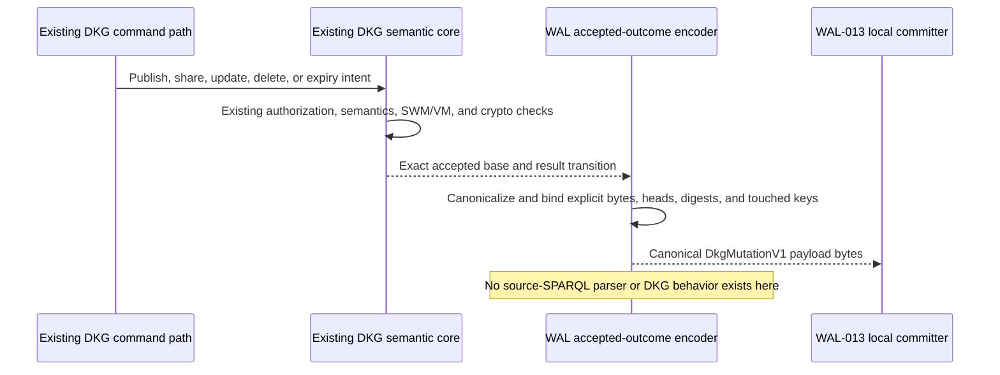
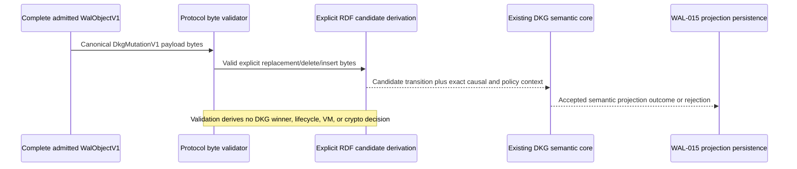

# WAL-012 implementation evidence

## Current outcome

WAL-012 now implements a deterministic byte encoder for an RDF transition
already accepted by the existing DKG semantic implementation. It does not
accept or evaluate source SPARQL. The earlier WAL-only SPARQL parser/evaluator
was non-conformant with the one-semantic-core rule and has been removed.

The shared code boundary is now explicit. Production legacy-sync graph
materialization, verified SWM recovery, and chain-driven VM reconciliation call
`DkgSemanticCore`, which delegates only to the existing implementations. Its
driver label is trace metadata and cannot select behavior. A static architecture
test rejects any production source that bypasses this adapter for those entry
points.

Local publisher WAL capture remains downstream of the existing successful DKG
operation, so encoding cannot create or alter a semantic decision. `WAL-014`
must route its actual replay candidates through this same adapter; that runtime
integration is a `WAL-014` acceptance condition, not a second implementation to
be introduced in `WAL-012`.

## Accepted-outcome encoding boundary



The production publisher shadow hook already captures exact before/after quads
after the existing operation succeeds. The encoder accepts only:

- exact graph or subject replacement bytes;
- exact deletes and inserts returned by the shared semantic core; or
- an accepted whole-logical-key deletion outcome.

Optional source audit bytes are opaque non-consensus bytes. WAL never parses or
executes them.

## Replay candidate boundary



`decodeDkgMutationCandidateV1` verifies canonical bytes, signed replay-policy
binding, graph scope, base/result digests, touched keys, and resource limits. It
derives a candidate only. WAL-014 must pass that candidate through the shared
semantic core before WAL-015 persists any projection.

## Canonicalization and protocol-policy rules

- Canonical N-Quads are UTF-8, LF-terminated, NFC-normalized,
  blank-node-free, escape-normalized, deduplicated, and sorted by unsigned
  UTF-8 byte order.
- State digests, author-scoped logical keys, and graph/subject/predicate touched
  keys use separate domain tags.
- `RdfPolicyV1` is an exact canonical tuple pinned to adapter version 1. It
  limits byte/graph/quad resources and binds replay-policy evidence; it does
  not replace existing DKG membership or semantic authorization.
- Ordinary mutation `parents` equal sorted exact `baseHeads`. PUT is exact
  REPLACE, PATCH carries an explicit accepted delta, and DELETE carries a
  whole-key tombstone transition.
- Reconciliation remains byte/ID-only and imports no RDF or semantic module.

## Acceptance mapping

1. The frozen protocol vector contains canonical N-Quads, state digest,
   logical/touched keys, exact `RdfPolicyV1`, `RdfMutationV1`, and
   `DkgMutationV1` bytes. The package implementation and independent
   TypeScript conformance consumer reproduce every byte and digest.
2. Embedded Oxigraph and the Blazegraph HTTP N-Quads adapter reproduce the
   same frozen canonical bytes and digest independent of store result order.
3. Publish PUT, shared-writer policy admission, metadata replacement, explicit
   accepted patch, and whole-key delete fixtures cover all encoded shapes.
4. Negative suites cover blank nodes, malformed/non-canonical RDF, unknown
   adapter versions, policy substitution, unauthorized protocol writers,
   graph/subject escape, causal substitution, tuple tampering, oversized
   mutations, and every resource bound with stable `WAL_RDF_*` codes.
5. Remote tests derive only explicit canonical candidates, recompute
   base/result digests and touched keys, and never execute audit bytes.
6. The architecture test invokes every adapter entry point with both
   `legacy-sync` and `wal-sync`, proving identical delegates, results, and
   rejection identity. Production source scanning permits direct low-level
   calls only inside the adapter and the underlying function definitions.
7. `packages/wal` has no dependency on agent, publisher, chain, query, or store
   semantic implementations. Its reconciliation module has a separate enforced
   byte/`WalObjectId`-set-only boundary.

## Validation receipts

```text
RFC source
  PASS: OT-RFC-65 v0.9 pushed at 6359a659da8688016b9e75a443f9bd46b89f221d
  PASS: sourceSemanticAuditBytesOrNull replaces misleading SPARQL field wording
  PASS: replay/conflict fixtures consume supplied semantic-core outcomes and
        contain no WAL-side DKG decision table
  PASS: two independent TypeScript consumers, 51/51 conformance tests

WAL accepted-outcome boundary
  PASS: WAL-only SPARQL parser/evaluator removed
  PASS: focused outcome encoder, local commit, and reconciliation-boundary tests
  PASS: WAL test TypeScript no-emit check
  PASS: 35 test files passed, 1 explicit scale file skipped
  PASS: 563 tests passed, 2 explicit scale tests skipped
  PASS: 100% statements, branches, functions, and lines

Shared semantic implementation
  PASS: local publisher capture occurs only after existing operations succeed
  PASS: legacy graph materialization, verified SWM recovery, and VM reconcile
        enter one DkgSemanticCore adapter
  PASS: five boundary tests prove driver-independent delegate/result/rejection
        behavior and reject production bypass calls
  PASS: 55 focused agent tests covering the boundary and existing entry points
```

## Next boundary

Finish WAL-013 durable shadow authoring. WAL-014 then schedules bytes and invokes
the existing core through `DkgSemanticCore`; it cannot be implemented as a new
reducer or semantic evaluator. Only the core's outcome may reach WAL-015.
