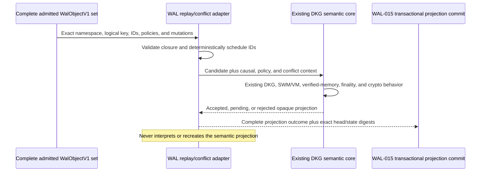

# WAL-014 deterministic replay/conflict adapter evidence

## Outcome

WAL-014 now has a deterministic replay/conflict adapter for one admitted
`WalObjectV1` set scoped by `(namespaceId, logicalKey)`. It constructs the
causal DAG, validates bases, schedules objects by unsigned ID bytes, identifies
maximal heads and their maximal common causal base, classifies only the
protocol-level compatibility rules, and retains incompatible heads explicitly.

It is not a DKG reducer. Every branch transition, compatible merge, and
resolution decision is passed to an injected `WalReplaySemanticCoreV1`, whose
projection value remains opaque to `packages/wal`. The agent bridge forwards
those calls through `DkgSemanticCore`; the synchronization-driver label changes
trace context only and cannot select a different implementation.



The complete `WalObjectV1` remains the only durable content-addressed
synchronization atom. Replay outputs, graph transactions, pages, ranges,
chunks, payloads, and conflict projections are not synchronization atoms.
WAL-015's transactional projection commit is a separate all-or-nothing database
guarantee and does not create a second atom.

## Implemented protocol behavior

- Validates exact namespace/logical-key scope, canonical mutation and policy
  tuples, writer coordinates, parent/base-head relations, and snapshot/genesis
  reset bases.
- Produces an arrival-, provider-, retry-, and wall-clock-independent
  topological schedule. Unsigned `WalObjectId` byte order breaks scheduling ties
  only; it never chooses the semantic winner.
- Detects missing closure, cycles, non-maximal bases, malformed semantic-core
  results, and resource-bound violations with stable blocked/quarantine errors.
- Treats disjoint PATCH footprints as compatible. Overlapping add-only PATCH
  branches are compatible only when their signed policy marks the predicate
  multi-valued. Policy/chain disagreement, REPLACE, delete/resolution,
  tier/non-RDF operations, and other overlapping PATCH branches conflict.
- Invokes the semantic core for every unblocked branch and for every
  protocol-compatible frontier merge. Incompatible maximal heads remain
  reserved while the frozen common-base state stays active.
- Accepts a structural `RESOLVE` candidate only when it references the complete
  current conflict frontier; the semantic core still owns authorization and the
  actual resolution decision.
- Retains same-lane/same-sequence equivocation evidence, blocks that writer lane
  and descendants, and never supplies equivocation nodes to the semantic core.
- Enforces protocol-v1 limits for object count, parent count, touched keys,
  conflict heads, causal depth, and recomputation work.

## Acceptance mapping

| Acceptance item | State | Evidence |
|---|---|---|
| Deterministic replay/conflict state under all permutations | Met | The focused suite exercises every arrival permutation and asserts identical schedules, active/conflict/pending heads, state, and digests. |
| Same complete production semantic entry points for both sync mechanisms | Open | The driver-independent bridge and static no-second-core boundary are proven. Full production wiring for every existing publish/share/update/delete/expiry, SWM/VM, verified-memory, finality/reorg, and crypto entry point is completed across WAL-015 through WAL-017 and proven end-to-end in WAL-021. |
| Normative conflict vectors | Met | Tests cover disjoint and same-key PATCH, replace/PATCH, replace/replace, delete/update, tier/non-RDF, multi-base, resolution, pending, and equivocation cases. Fixtures supply semantic-core outcomes rather than a DKG decision table. |
| No implicit conflict winner | Met | Permutation tests and static input typing exclude arrival time and provider identity; incompatible heads remain explicit and ID bytes only order processing. |
| Resolution safety | Met | Complete, incomplete, stale, partial, structurally invalid, and semantic-core-rejected resolutions are exercised without unintended state activation. |
| Resource bounds | Met | Every configured replay limit has a stable blocked/quarantine negative test. |
| Full existing semantic-oracle equivalence | Open | No divergence is permitted. The generic bridge is proven, but the complete current-sync/WAL golden corpus is an end-to-end WAL-021 gate and is not inferred from unit mocks. |
| Adapter naming and package boundary | Met | API/package names use replay/conflict terminology; static tests reject provider/arrival fields and WAL-side semantic-engine code. |

## Validation receipts

```text
WAL replay package
  PASS: 31 focused replay/conflict tests
  PASS: 37 test files; 598 tests passed
  SKIP: 1 explicit scale file; 2 intentional scale tests
  PASS: 100% statements, branches, functions, and lines
  PASS: WAL test and build TypeScript no-emit checks
  PASS: 51 protocol conformance tests

Agent shared-core bridge
  PASS: focused DkgSemanticCore boundary suite, 7 tests
  PASS: modified semantic-core and replay-bridge files at 100% focused coverage
  PASS: agent build TypeScript no-emit check
  PASS: full agent unit suite, 102 files and 1,215 tests
```

## Remaining boundary

The replay engine and its narrow shared-core bridge are implemented. WAL-014 is
not marked fully complete until the production implementation behind every
existing DKG/SWM/VM/verified-memory/finality/crypto path is exercised by both
sync mechanisms against the shared semantic oracle. WAL-015 must persist only
the complete outcome returned by that core, using a transactional projection
commit with no replay scheduling or semantic decisions in the storage layer.
