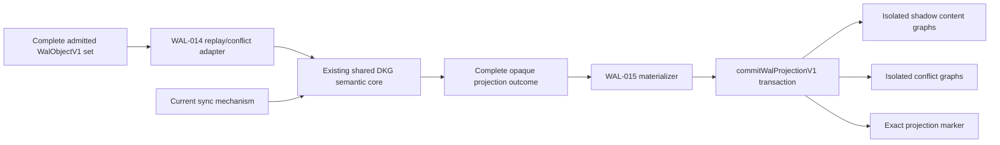
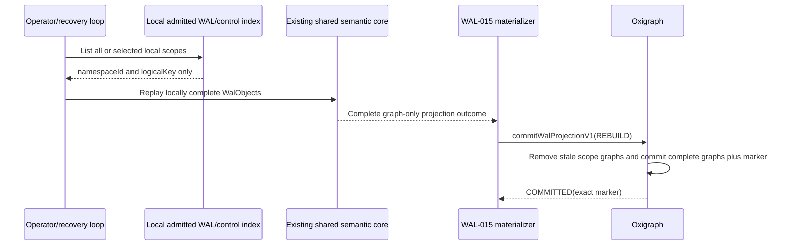

# WAL-015 evidence — transactional projection commit

## Result

WAL-015 is implemented and its acceptance area is verified. The implementation
persists an already-complete shared-core projection outcome through one guarded
Oxigraph transaction and adds only the `APPLIED` persistence status. It does
not decide DKG behavior, replay order, active
heads, conflicts, authorization, SWM/VM state, finality, or cryptography.

The complete canonical `WalObjectV1` remains the sole durable
content-addressed synchronization atom. The graph transaction, RDF graphs,
quads, projection marker, materialization row, and retry item have no
`WalObjectId` and no synchronization lifecycle.

## Boundary



There are two synchronization mechanisms, but the diagram has one semantic
core. Static tests also prove that the WAL-015 materializer imports neither the
replay scheduler nor DKG/chain/publisher/sync implementations.

## Transaction and exact recovery

```mermaid
sequenceDiagram
    participant R as WAL-014 adapter
    participant S as Shared semantic core
    participant M as WAL-015 materializer
    participant G as Oxigraph
    participant C as WAL control DB

    R->>S: Replay admitted complete WalObjects
    S-->>R: Complete projection outcome
    R->>M: Persist opaque outcome
    M->>C: Record desired digests and PENDING
    M->>G: commitWalProjectionV1(CAS, expected marker)
    alt Guard matches
        G->>G: One content/conflict/marker transaction
        G-->>M: COMMITTED(exact marker)
        M->>C: Record exact applied digests and APPLIED
    else Guard changed
        G-->>M: GUARD_FAILED(current exact marker)
        M->>S: Recalculate through the same semantic core
    else Response is lost or backend throws
        M->>G: Read exact marker
        alt Every marker field equals the intended marker
            M->>C: Record APPLIED
        else Marker differs or is absent
            M->>C: Persist retry
        else Marker is malformed or ambiguous
            M->>C: Record BLOCKED; require selective rebuild
        end
    end
```

The exact marker in `urn:dkg:wal:projection` contains only:

1. adapter version;
2. namespace ID;
3. logical key;
4. active-head-set digest;
5. conflict-head-set digest;
6. projected state digest;
7. source vector ID;
8. materialization status.

No operation kind, authorization result, winner choice, VM rule, or
cryptographic decision crosses into the storage capability. Materialization
status is owned by WAL-015 rather than returned by the semantic core.

## Rebuild



The rebuild source deliberately exposes no peer or network method. `REBUILD`
accepts only complete graph replacements, has no expected-head guard, removes
stale graphs only under the exact
`urn:dkg:wal:shadow:v1:<namespaceId>:<logicalKey>:` prefix, and installs the
marker in the same transaction.

## Implemented surfaces

| Surface | Evidence |
|---|---|
| Capability contract | `TripleStore.walProjectionTransactions = 'v1'` plus optional `commitWalProjectionV1`; only a proven pair is authoritative-eligible. |
| Reference transaction | `OxigraphStore.commitWalProjectionV1` validates the complete plan, executes one multi-operation update, and confirms an exact marker. |
| Worker/decorator parity | Oxigraph worker, graph index, large-literal wrapper, and changelog wrapper forward the capability without exposing shadow graphs or adding legacy changelog records. |
| Backend gate | Embedded and worker Oxigraph are eligible. Blazegraph, generic SPARQL HTTP, and an unsupported custom store remain ineligible. |
| Durable control | Schema v6 keys materialization by `(namespaceId, logicalKey)` and records desired/applied active, conflict, and state digests, source vector, attempts, retry time, error, and status. |
| Migration | v5's unused namespace-ambiguous provisional materialization rows are deliberately reset because projection state is derived and locally rebuildable. Migration rollback is tested. |
| Agent orchestration | Per-scope lock, guarded recalculation, exact lost-response post-read, persistent retry, exact APPLIED-marker restart audit, leased retry handling, local outbox completion, and full/selective local-only rebuild. |

## Acceptance evidence

| Acceptance | Proof |
|---|---|
| All-old or all-new content/conflict/marker | A deliberately late failing Oxigraph operation rolls back the complete multi-operation request; normal tests read content, conflict, delta, subject replacement, and marker together. |
| Lost-response exactness | Tests distinguish an exact intended marker, a different valid marker, an absent marker, and corrupt/ambiguous markers. Only the exact intended marker is success. |
| Opposite scheduling and restart | Opposite competing schedules recalculate through the shared core to byte-equal marker/RDF results. Persistent Oxigraph and SQLite control state recover after restart. An APPLIED control row with a missing/different graph marker is durably requeued; a malformed marker is blocked for selective rebuild. |
| Semantically passive storage | Deliberately different opaque complete projection outcomes use the same method and are accepted or rejected only by scope, shape, integrity, and CAS guard rules. |
| Zero-network rebuild | Empty/corrupt selected and full scopes rebuild through an interface containing only local scope listing and local WAL replay. |
| Shadow isolation | Every target graph must match the exact internal scope prefix; internal marker/shadow graphs are removed from `listGraphs`, including through production wrappers. |
| Backend eligibility | Explicit Oxigraph/worker positive tests and Blazegraph/SPARQL/custom negative tests pass. |

## Verification receipts

- Storage package: **31 files passed, 456 tests passed, 26 intentionally
  skipped**.
- Focused storage transaction suite: **9/9 passed**.
- WAL package with coverage: **37 files passed, 599 tests passed, 2 scale tests
  intentionally skipped; 100% statements, branches, functions, and lines**.
- WAL control schema/materialization suite: **63/63 passed**.
- Focused agent materializer suite: **13/13 passed**.
- Complete curated agent unit suite: **103 files and 1,228 tests passed** with
  loopback networking enabled; the materializer suite is part of this manifest.
- Complete agent regression: **235 files passed, 2 skipped; 2,555 tests passed,
  5 intentionally skipped**.
- Forced TypeScript builds passed for storage, WAL, and agent.
- Agent public type-contract compilation passed.
- `git diff --check` passed.
