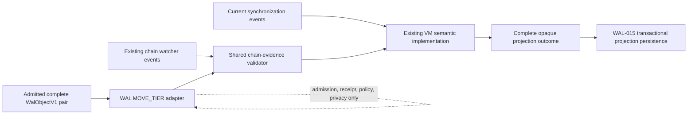
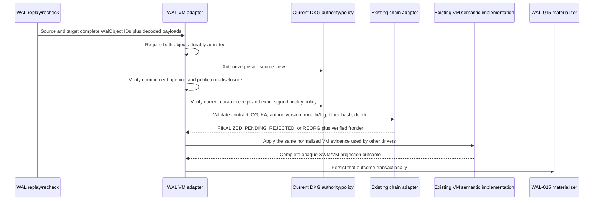

# WAL-016 evidence — shared VM/finality/reorg adapter

## Result

WAL-016 now has its frozen byte protocol, chain-evidence validator, privacy and
finality guards, chain-event extraction, restart/policy revalidation path, and
driver-independent semantic-core bridge. This is a verified implementation
increment, not full WAL-016 acceptance. The production implementation behind
the bridge still has to prove finalized VM activation, SWM restoration after a
reorg, and legacy/WAL API and RDF equality against the existing lifecycle
corpus.

The implementation preserves the architectural rule:

- two synchronization mechanisms;
- one DKG semantic implementation;
- one SWM/VM model;
- one verified-memory and cryptographic implementation.

The complete canonical `WalObjectV1` remains the sole durable
content-addressed synchronization atom. A MOVE_TIER side, receipt, chain event,
verified frontier, semantic outcome, graph transaction, or VM projection is not
a smaller synchronization atom.

## Frozen protocol surface

`MoveTierTargetV1` carries one complete canonical `DkgMutationV1` whose operation
is `MOVE_TIER_TARGET`. The mutation must include both the public RDF outcome and
the complete `ChainBindingV1`, and its public semantic-audit field must be null.
The target-mutation digest is:

```text
BLAKE3("dkg-wal-move-tier-target-mutation-v1\0" || canonicalCbor(targetDkgMutationV1))
```

`ChainBindingV1` is the exact 14-field tuple:

```text
[
  chainId,
  knowledgeAssetsContract,
  contextGraphOnChainId,
  kaId,
  authorAddress,
  assertionVersion,
  merkleRoot,
  transactionHash,
  blockNumber,
  blockHash,
  transactionIndex,
  logIndex,
  eventType,
  requiredFinalityBlocks
]
```

`eventType` is the frozen enum `PUBLISH = 0`, `UPDATE = 1`. The target/source
commitment, target object, current policy, current curator vector, expiry, and
threshold receipt are verified before any semantic call.

## Shared boundary



`CurrentDkgVmSemanticCoreAdapterV1` takes an injected existing semantic
implementation. The synchronization driver is trace metadata only; the same
function is invoked for `legacy-sync`, `chain-event`, and `wal-sync`. The WAL
adapter has no VM transition table and does not inspect or modify the returned
projection. WAL-015 persists that complete opaque outcome and adds only its
materialization bookkeeping.

## MOVE_TIER and chain sequence



The chain validator reads current chain truth and owns no WAL state or SWM/VM
projection. It recognizes exact publish and update events. Missing capabilities
or RPC data remain `PENDING`; insufficient depth remains `PENDING`; substituted
chain, contract, context graph, KA, author, version, root, transaction, or event
location is `REJECTED`; a missing or changed canonical block is `REORG`. These
statuses are inputs to the existing semantic owner rather than a second WAL VM
state machine.

Effective finality is `max(authorRequiredBlocks, networkMinimumBlocks)`. An
author request above the current signed maximum is rejected. Rechecks for
`wal-replay`, `chain-recheck`, `policy-reconfiguration`, and
`restart-revalidation` all pass through the same validator and semantic bridge.

## Privacy boundary

Before chain or semantic evaluation, the adapter scans canonical public target
bytes for every source-only representation available to it: source namespace,
source object, transition nonce, source heads, source state/result digests, and
additional private graph/view values. Exact source values in public target
bytes fail with `WAL_VM_PRIVATE_DISCLOSURE`. The public target mutation also
forbids source semantic-audit bytes by construction.

## Acceptance mapping

| Acceptance item | State | Evidence |
|---|---|---|
| Existing valid/invalid VM lifecycle corpus through the same boundary | Open | The new validator has publish/update and negative unit coverage, but the complete existing lifecycle corpus has not yet been replayed through both drivers. |
| Same production VM/finality/reorg implementation and state model | Open | Instrumentation proves a driver-independent call into one injected function and no WAL-side transition table. Production lifecycle wiring is still required. |
| Invalid/premature/reorg evidence never creates active VM | Open | Validation statuses and negative cases are proven. The actual existing semantic implementation must demonstrate that those statuses cannot produce active state. |
| Finalized activation and deterministic SWM restoration | Open | Requires production semantic-owner wiring and lifecycle/reorg integration evidence. |
| Public target non-disclosure | Met | Structural target validation and exact canonical-byte leak tests reject private source identity, causal, state, audit, and caller-supplied private values. |
| Policy reconfiguration and restart frontier revalidation | Met | Both triggers rerun the exact signed policy calculation, shared chain validator, same semantic bridge, and WAL-015 persistence path without a WAL VM table. |
| Legacy/WAL VM API and canonical RDF equality | Open | Remains a golden-corpus integration gate; unit mocks are not treated as parity evidence. |

## Verification receipts

- Frozen RFC snapshot: v0.13 at spec commit
  `30710613663092d9b972c41ea5ddb0f471846fa3`; RFC/schema/vector SHA-256 values
  match the task-pack README.
- WAL VM/authority focused tests pass, including canonical round trips,
  commitment/receipt substitution, authority/signature/expiry negatives,
  privacy leakage, finality arithmetic, and canonical block identity.
- WAL package coverage: **39 files passed, 1 intentionally skipped; 619 tests
  passed, 2 scale tests intentionally skipped; 100% statements, branches,
  functions, and lines**.
- Agent focused VM/shared-core tests: **3 files and 30 tests passed**.
- Complete agent unit suite: **105 files and 1,251 tests passed** under pinned
  Node.js 24 with loopback networking enabled.
- Focused chain extraction suite: **2/2 tests passed**, proving publish/update
  author, root, transaction order, log order, and canonical block identity.
- Protocol conformance suite and affected TypeScript builds are release checks
  for this increment; exact final commands are recorded with the commit review.
- `git diff --check` passes before commit.

## Remaining production gate

WAL-016 is not complete until the adapter is wired to the actual existing
finalization/reorg semantic owner, and one golden corpus proves that finalized,
pending, rejected, and reorg evidence yields exactly the same VM API state and
canonical RDF for current synchronization and WAL replay. That work must reuse
the existing implementation; it must not fill the gap by adding WAL-specific VM
behavior.
