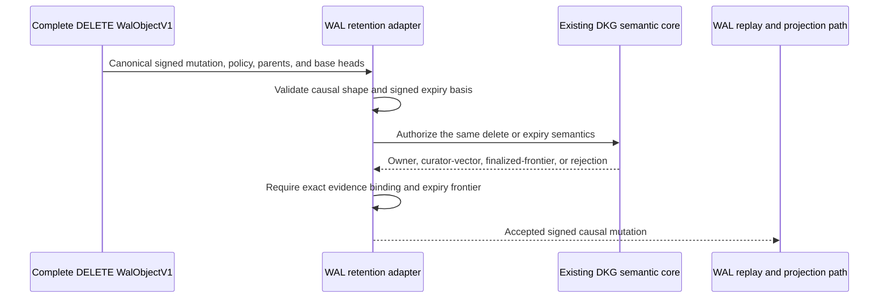
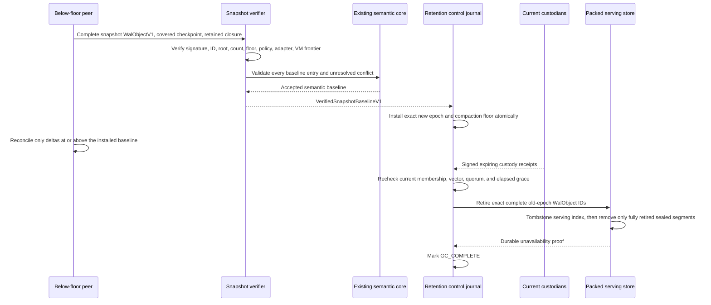

# WAL-017 evidence — deletion, snapshots, custody, and safe compaction

## Result

WAL-017 is implemented and verified. Deletes remain signed causal
`WalObjectV1` mutations; expiry becomes effective only through authenticated
vector or finalized-chain evidence accepted by the existing DKG semantic core.
Author snapshots are complete sequence-zero `WalObjectV1` atoms of a new epoch,
and a verified baseline must be durably installed before a below-floor peer may
reconcile later deltas.

The complete canonical `WalObjectV1` remains the sole durable
content-addressed synchronization atom. Snapshot manifests are payloads inside
that atom. Packed pages/segments, custody receipts, retention-journal rows,
projection commits, and GC tombstones are local storage or control evidence;
none has a `WalObjectId` or participates in byte-set reconciliation.

The implementation preserves the system rule:

- two synchronization mechanisms;
- one DKG semantic implementation;
- one SWM/VM model;
- one verified-memory and cryptographic implementation.

## Shared semantic delete and expiry path

`validateDeleteOrExpiryV1` first requires canonical `DkgMutationV1` and
`RdfPolicyV1` tuples, the `DELETE` operation, and the exact same non-empty
signed causal parents and base heads. It then calls the injected existing DKG
semantic core. Owner deletion requires owner evidence. Policy expiry requires
exactly one signed curator vector or finalized chain frontier whose authenticated
time is at or after the signed expiry. Local wall time is intentionally absent
from the authorization input.



No WAL-specific delete policy or wall-clock last-write-wins rule was added.

## Snapshot and compaction path

`SnapshotManifestV1` is carried directly in the public or authenticated-private
DKG envelope of the new epoch's sequence-zero object. Verification covers the
complete object signature/ID, author coordinates, signed covered checkpoint,
set root/count/floor, current policy, RDF adapter version, VM frontier, canonical
inline N-Quads, tombstones, active same-author heads, external conflict closure,
and the existing semantic core's entry/conflict decisions.

`selectBaselineForPeerV1` returns `install-baseline` when the retained author
epoch is absent/older or its retained covered count is below the signed floor.
`WalRetentionCoordinatorV1.installVerifiedBaseline` accepts only a
`VerifiedSnapshotBaselineV1` result and durably installs that exact author epoch
before delta reconciliation can continue.



Local authoring binds the snapshot object's own ID into checkpoint zero and
starts it on a fresh packed segment. This leaves the prior epoch in sealed
segments that can be reclaimed only after every exact under-floor object is
durably unservable. Partial or active segments are deferred, and retired object
IDs cannot be reinserted.

## Crash and no-resurrection guarantees

The v7 control schema journals monotonic retention states:

```text
INSTALLED -> VECTOR_BOUND -> GC_ELIGIBLE -> GC_COMPLETE
```

Custody receipts and the exact under-floor object set are durable before floor
advance. Packed-store tombstones commit before control state may reach
`GC_COMPLETE`. Restart recovery removes a segment only when every indexed object
is already tombstoned, rejects corrupt retired-segment indexes, and refuses to
serve or re-admit a retired object. Fault tests cover snapshot/checkpoint commit,
retention installation, receipt persistence, vector binding, floor advance,
packed index commit, physical segment deletion, and GC completion.

## Acceptance mapping

| Acceptance item | State | Evidence |
|---|---|---|
| Offline/restart/compaction never resurrects deleted or expired state | Met | Persistent self-baseline, packed tombstone, restart, re-admission rejection, and post-index crash recovery tests keep the snapshot/new epoch authoritative. |
| Local-clock-only, unauthorized, non-causal, or stale expiry fails | Met | Delete/expiry tests cover missing/mismatched base heads, rejected shared-core decisions, wrong evidence kinds, stale vector time, and mismatched/finalized frontier evidence. |
| Snapshot bytes, author, closure, policy, adapter, VM, tombstone, and conflict verification | Met | The v0.14 vectors freeze expiry/snapshot bytes; conformance and adversarial snapshot tests cover public/private envelopes, signatures, checkpoint/root/floor, state bytes/digests, duplicate keys, heads, and conflicts. |
| Below-floor peer installs and validates the baseline before deltas | Met | Baseline selection plus `installVerifiedBaseline` tests require full verification output and a durable epoch transition; removed history is not fetched by the transition. WAL-019 owns invoking it from the network driver. |
| GC requires durable current custody, vector, quorum, and grace | Met | Coordinator/control tests reject absent, forged, duplicated, expired, removed/revoked, peer-mismatched, unpersisted, or insufficient receipts and premature/unbound floors. |
| Crash-safe snapshot install, epoch rotation, receipts, floor, and physical GC | Met | Transaction-hook and restart tests prove rollback or idempotent recovery at every named boundary and reject corrupt retired-segment state. |

## Verification receipts

- Frozen RFC snapshot: v0.14 at spec commit
  `2323c5b326b52360bbba63c8f9fbbddb3bf569b0`.
- RFC SHA-256:
  `cb876f94089ec83a565c9cb2d450e336b946ded4a5b41b1c6d450a602cb9b00c`.
- Schema SHA-256:
  `a47d7d3301531889ebaba1968eef92f00cf2f0c31d25873232463191d282eac0`.
- Vector SHA-256:
  `a3869c3ecdad213ad365b2277cffe2f4e7d507e39ae00f956538f4ac505a6ce4`.
- WAL package: **42 files passed, 1 intentionally skipped; 643 tests passed,
  2 scale tests intentionally skipped; 100% statements, branches, functions,
  and lines**.
- Protocol conformance: **2 files and 52 tests passed**, including frozen
  expiry evidence and snapshot tombstones plus large-object restart behavior.
- Complete agent unit suite: **106 files and 1,252 tests passed** under pinned
  Node.js 24 with loopback networking enabled.
- WAL production build and test typecheck, publisher production build, and agent
  production/type-test builds pass.
- `git diff --check` passes before commit.
