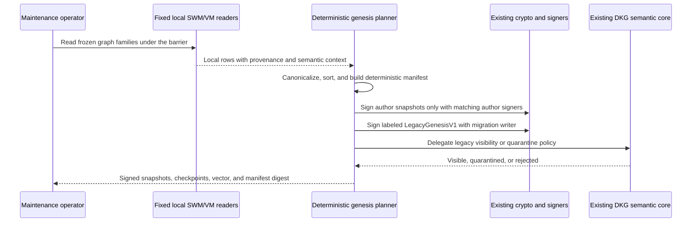
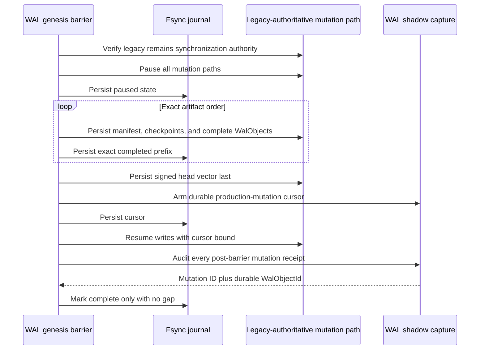
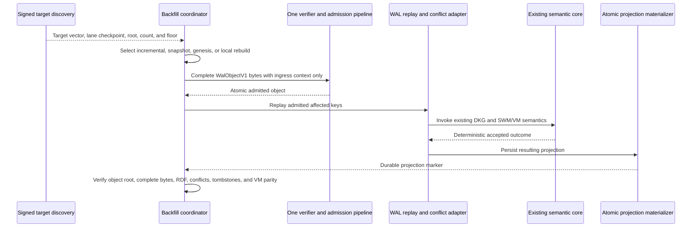

# WAL-018 evidence — genesis migration, backfill, and rebuild

## Result

The WAL-018 implementation increment is complete and verified for deterministic
genesis construction, migration-policy delegation, maintenance-barrier safety,
and all four backfill paths. The production-scale same-data/link p95 comparison
remains an explicit WAL-022 evidence gate; this document does not manufacture a
performance pass from unit timings.

The complete canonical `WalObjectV1` remains the sole durable
content-addressed synchronization atom. A genesis snapshot or clearly labeled
`LegacyGenesisV1` record is a payload inside a complete `WalObjectV1`.
Manifests, checkpoints, vectors, barrier journals, and evidence receipts are
authenticated control or local durability records; none is a smaller byte-sync
atom.

The implementation preserves the system rule:

- two synchronization mechanisms;
- one DKG semantic implementation;
- one SWM/VM model;
- one verified-memory and cryptographic implementation.

## Deterministic genesis and provenance boundary

`buildWalGenesisPlanV1` reads only the frozen local SWM/VM graph-family list.
It canonicalizes N-Quads and records logical keys, visibility, policy,
adapter version, and VM frontier. Rows with provable author provenance are
grouped into author lanes. Unclaimable pre-WAL rows become explicitly labeled
`LegacyGenesisV1` state and never receive a fabricated original-author
signature.

Private payload construction and opening require the existing authenticated
encryption callbacks. The migration layer does not implement a second cipher,
membership rule, RDF rule, or provenance policy. The agent bridge adds only a
traceable `wal-legacy-genesis-authorization` entry point around the supplied
existing semantic implementation.

## Maintenance barrier and post-barrier shadow proof

The barrier keeps current sync authoritative. It pauses production mutations,
persists the plan and every signed snapshot/checkpoint/object, persists the
head vector last, durably arms shadow capture, and only then resumes writes.
Every post-cursor production mutation must have one durable complete
`WalObjectV1` receipt.

The journal rejects invalid identities/digests, non-boolean lifecycle fields,
non-canonical cursors, and any artifact list that is not an exact bundle
prefix. Abort is safe even when pausing succeeded but the first journal write
failed. Crash tests cover every artifact boundary and transactional rename
window.

## Backfill and local rebuild

`planWalBackfillV1` selects one of four byte paths from signed target state and
local durable state:

| Path | Use | Network payload |
|---|---|---|
| `INCREMENTAL` | Local lane is at or above the floor | Missing complete WAL objects only |
| `SNAPSHOT_PLUS_DELTA` | Local lane is absent/stale below the floor | Authenticated snapshot object plus complete deltas |
| `GENESIS_BOOTSTRAP` | Empty node targets a signed genesis baseline | Signed genesis objects plus complete deltas |
| `PROJECTION_REBUILD` | Complete WAL exists but projection is missing/corrupt | Zero; reads local complete WAL objects only |

The coordinator never accepts remote graphs and has no RDF enumeration
callback. Its only remote inputs are complete object-byte batches. The local
projection rebuild invokes `loadLocalObjects` and explicitly records zero
network payload bytes.

## Acceptance mapping

| Acceptance item | State | Evidence |
|---|---|---|
| Deterministic repeated genesis and mutation-free dry-run | Met | Reversed input order produces identical canonical manifest bytes/digest; dry-run accepts only a plan and exposes no production operations. |
| Exact author signatures and labeled unclaimable provenance | Met | Author snapshots resolve the matching existing signer; `LegacyGenesisV1` uses a migration writer and shared-core policy, with default quarantine represented explicitly. |
| Empty, stale, below-floor, and projection-only exact parity | Met in coordinator boundary | All four paths require object-root, complete-object, RDF, conflict, tombstone, and VM parity before completion. WAL-019 owns live network-driver invocation. |
| No remote graph enumeration and zero-network local rebuild | Met | The operations interface exposes only complete object bytes; lane-local accounting proves projection rebuild transfers zero network bytes even after a networked lane. |
| Abort/resume/crash safety and post-barrier completeness | Met | Every artifact and file-rename crash boundary is resumable; authority is rechecked; head vector is last; capture precedes resume; duplicate, missing, non-durable, or malformed receipts fail closed. |
| Backfill p95 no worse than same-data/link legacy full sync | Open, owned by WAL-022 | `createWalBackfillEvidenceManifestV1` freezes integer-microsecond samples, environment/configuration/dataset/target digests, p95 comparison, byte count, admitted count, and canonical evidence digest. A production-scale runner and comparable receipts are intentionally not inferred from unit timing. |

## Verification receipts

- WAL package: **46 files passed, 1 intentionally skipped; 669 tests passed,
  2 scale tests intentionally skipped; 100% statements, branches, functions,
  and lines**.
- Protocol conformance: **2 files and 52 tests passed**, including the large
  complete-object restart path.
- Complete agent unit suite with loopback enabled: **107 files and 1,254 tests
  passed**.
- WAL production/test typechecks, agent production build, agent type tests, and
  migration adapter integration tests pass.
- The first sandboxed agent run was not treated as a product failure: it showed
  `listen EPERM` for ephemeral localhost libp2p addresses. The exact suite then
  passed unrestricted with all 1,254 tests.
