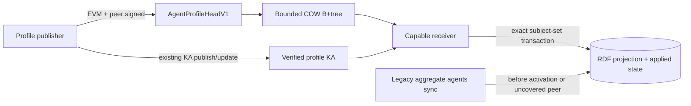

# ADR 0002: System Record Sync V1

Status: proposed, default-off

Issue: [#2052](https://github.com/OriginTrail/dkg/issues/2052)

Base dependency: [#2076](https://github.com/OriginTrail/dkg/pull/2076)

## Decision

DKG nodes will stop using aggregate RDF replay as the steady-state synchronization
protocol for the public `agents` system graph. A capable producer will publish a
signed, immutable record head for its own profile. Providers will expose the heads
through a bounded content-addressed B+tree. Receivers will fetch and atomically
materialize only records whose signed head advanced.

The protocol remains disabled until the activation and compatibility gates in this
document pass. The legacy aggregate lane remains authoritative before coordinated
activation and for peers that do not support V1.

`ontology` and public user Context Graph integration are later, separate changes.
They may reuse the primitives defined here, but they do not ship in the first
`agents` behavior change.

## Problem

Reconnects currently schedule `agents`, `ontology`, and all active durable graph
subscriptions. A completed phase deletes its transfer checkpoint, while checkpoint
identity is peer scoped. Without a peer-independent proof of semantic equivalence,
another reconnect can start aggregate RDF transfer from offset zero.

The r26 and r27 traces recorded repeated system work with little or no semantic
progress. In r27, 14 `agents` attempts across 10 peers caused 26 page retries and
13 failures. In r26, individual attempts retransferred prefixes from 12,288 to
65,536 triples. This work occupied the same global admission capacity needed by
foreground SWM and VM catch-up.

Whole-graph hashes, attempted-write generations, and periodic completeness scans
were rejected. They either require another aggregate store traversal, advance on
duplicate writes, churn on every heartbeat, or create a race-prone global
completeness claim.

## Goals

1. An unchanged profile offered by any number of capable peers is a bounded no-op.
2. One heartbeat changes work proportional to one profile, not the `agents` graph.
3. Record authority is independent of the peer serving the bytes.
4. Projection replacement and applied-head state commit atomically.
5. Reconnect and reconciliation use existing admission, priority, and lifecycle
   machinery; V1 adds no scheduler, timer, worker, or compactor.
6. Every wire, memory, disk, RPC, store, status, and retry surface has a numeric
   bound.
7. Mixed-version nodes retain phonebook correctness throughout rollout.

## Non-goals

- Removing the `agents` or `ontology` graphs.
- Relaxing wallet, peer-identity, Knowledge Asset, or chain authorization.
- Replacing #2053 scheduling or #2076 SWM continuation.
- Introducing a global graph generation, full-graph audit, or per-peer applied
  cursor matrix.
- Moving private or curated metadata through the public system-record protocol.
- Enabling the protocol on mainnet in the implementation changes.

## Architecture



```mermaid
sequenceDiagram
    participant Trigger as Existing reconnect/reconciler
    participant Admission as sync-global
    participant Provider
    participant Receiver
    participant Store

    Trigger->>Admission: Admit one physical background slice
    Receiver->>Provider: Fetch signed root/path/leaf
    alt applied head is equal and locally validated
        Receiver-->>Admission: Bounded no-op
    else newer valid head
        Receiver->>Provider: Fetch exact head and bundle
        Receiver->>Receiver: Verify peer, wallet, seal and content
        Receiver->>Store: Atomic exact-subject replacement + head CAS
    end
    Receiver-->>Admission: Release after at most 3 seconds
    Note over Trigger,Admission: A cold logical continuation may reacquire;<br/>foreground demand stops it after the current response
```

## Stable Record Identity

The stable record key is `(networkId, peerId)`. Serving peer, connection, and
provider tree shape are not part of record authority.

An applied version is identified by:

```text
(networkId, peerId, authoritySequence, version, headDigest)
```

`authoritySequence` advances only through a valid wallet transition. `version`
advances within one authority sequence. Lower sequences or versions never replace
higher applied state. Two different heads at the same sequence/version are an
equivocation and quarantine the record. Expiry affects discovery eligibility; it
does not authorize rollback or deletion.

A tombstone is signed and terminal for its authority sequence. Resurrection needs
a valid authority transition. Inventory omission has no deletion authority.

## AgentProfileHeadV1

The unsigned canonical `AgentProfileHeadObjectV1` commits:

- network ID and canonical peer ID;
- peer public key/signature suite;
- EVM issuer/signature suite, authority sequence, version, and previous head;
- for every sequence above zero, the exact accepted
  `AgentProfileAuthorityTransitionV1` digest and, when applicable, the exact
  transition-resolution digest;
- exact existing profile KA assertion/update coordinate and graph-scoped author
  seal;
- content digest, projection bundle digest/bytes/quads;
- canonical root subject and sorted owned-subject digest/count;
- projection schema digest, issue time, validity time, and optional tombstone or
  fork-resolution reference.

Its domain-separated canonical encoding excludes all signatures. The semantic
`objectDigest` is computed from that unsigned object. The EVM and detached peer
signatures sit beside the object in `SignedAgentProfileHeadEnvelopeV1` and both
cover `objectDigest` plus their required network/record/sequence context. Version,
fork, previous-head, inventory-row, and applied-state identity use `objectDigest`,
not a signed-envelope digest, so alternate valid signature encodings cannot create
a semantic fork.

Transition binding is acyclic: a transition commits the prior sequence/head and
authorizes exactly the next sequence, issuer, and root, but does not commit a next
head. The first head in that sequence commits the accepted transition digest.
Inventory discovery of that head therefore gives the receiver a canonical exact
fetch path for all authority evidence.

Cryptographic signature validity alone never grants object authority. The V1
verifier must enforce all of these object-specific predicates before opening an
applied-head capability:

- the embedded Ed25519 public key derives the canonical libp2p `peerId` in the
  stable record key, and its domain-separated signature covers the unsigned
  `objectDigest`, network, record key, authority sequence, and version;
- the EVM control signature recovers or EIP-1271-validates exactly the canonical
  `evmIssuer`; the root is exactly `did:dkg:agent:<lowercase evmIssuer>`;
- the profile coordinate, seal, content digest, bundle digest, owned-subject set,
  root, network, and record key all refer to the same `agents` record;
- the graph-scoped profile seal author equals the accepted current EVM authority;
  a valid unrelated wallet/peer pair cannot target another wallet root;
- the exact decoded bundle and seal are verified before the signed head can
  advance state. Inventory/provider signatures authenticate availability only.

An initial head requires peer and EVM signatures over sequence zero, has no prior
head/transition, and satisfies every equality above. An ordinary update keeps the
same network, peer, issuer, authority sequence, and root; its version is strictly
higher. A valid higher version may fast-forward, while `previousHeadDigest` remains
fork/audit evidence rather than a retention-dependent gate.

`AgentProfileAuthorityTransitionV1` keeps the network/peer key, increments
`authoritySequence` by exactly one, binds the prior authority/head, names the next
authority/root, and normally requires the peer, prior-EVM, and next-EVM signatures.
If the prior wallet is unavailable, the transition is accepted only after the
prior signed `validUntil` plus five-minute skew and still requires the peer plus
next-EVM signatures. V1 defines no generic on-chain-controller escape hatch. Two
different transitions to the same sequence are
authority equivocation: neither wins by arrival order. Resolution requires the
peer plus prior EVM authority; if that authority is unavailable, the record stays
quarantined.

Same-sequence/version head forks quarantine the record. A bounded
`AgentProfileForkResolutionV1` must list every observed conflict digest (maximum
16), retain the current authority bindings, and advance the version. Above that
bound the record stays quarantined. A tombstone requires the current peer and EVM
authority, advances the version, and is terminal for its authority sequence;
resurrection needs a valid authority transition. Expiry changes discovery
eligibility only and never authorizes rollback. `issuedAt` more than five minutes
in the future is rejected.

The peer signature uses a separate canonical domain and is not encoded as an
RFC64 `ControlObjectSignatureVariantV1`. Stack B may reuse the lower-level RFC64
canonical envelope/digest codecs, opaque bundle decoder, graph-scoped seal
verification, and EOA/EIP-1271 primitives. It must not cast through the
catalog-specific transferred-bundle verifier, which binds catalog head/row types.
The canonical peer ID comes from the libp2p node identity and embedded peer key;
`AgentWallet.peerId()` is not used because it returns public-key bytes rather than
the canonical libp2p peer ID. Initial producer support is EOA/EIP-191 only; a
contract-wallet profile cannot advertise V1 until an explicit local EIP-1271
signing provider is configured and tested. Producer state loss must hydrate and
verify current state from exact content-addressed objects or remain legacy-only;
it never invents a new sequence/version.

## Exact Projection Boundary

The profile bundle carries a sorted, duplicate-free owned-subject list. Valid
subjects are limited to:

1. the canonical `did:dkg:agent:0x<40-lowercase-hex>` root;
2. only `root/.well-known/genid/cap[1-9][0-9]*`,
   `root/.well-known/genid/offering[1-9][0-9]*`,
   `root/.well-known/genid/registration`, and
   `root/.well-known/genid/hosting`, linked respectively by
   `erc8004:capabilities`, `skill:offersSkill`, `prov:wasGeneratedBy`, and
   `skill:hostingProfile`;
3. exact `root#x25519-<32-lowercase-hex>` encryption-key/revocation subjects.

Each subject kind also has a frozen predicate allowlist matching `buildAgentProfile`;
the hosting projection temporarily accepts legacy `skill:paranetsServed` for the
measured testnet cohort. X25519 IDs must be recomputed from the root wallet and
decoded public key with `workspaceAgentEncryptionKeyId`; syntax alone is not
derivation. Blank nodes, encoded/unknown paths, malicious link predicates,
arbitrary external subjects, malformed fragments, and unlinked/underived subjects
are rejected. No prefix scan is permitted during V1 materialization.

## Inventory

Providers expose a content-addressed copy-on-write B+tree sorted by:

```text
(SHA-256(networkId || 0x00 || canonicalPeerId), canonicalPeerId)
```

Provider tree shape is not authoritative. A provider signs the immutable root
descriptor `(networkId, epoch, version, priorRootDigest, treeRootDigest,
totalRows)` to authenticate availability only. `priorRootDigest` is a non-owning
audit pointer and never contributes to object reachability. Every row still carries
its own wallet and peer authority.

Hard structural bounds:

| Item | Bound |
| --- | ---: |
| Encoded row | 512 bytes |
| Encoded internal entry | 256 bytes |
| Non-root leaf | 128-512 rows, at most 256 KiB |
| Non-root internal node | 128-256 entries, at most 64 KiB |
| Root | 2-256 entries, at most 64 KiB |
| Incoming records per network/kind | 262,144 hard parser/tree cap |
| Leaves at hard cap | 2,048 |
| Tree height | 3 |
| One inventory-tree update | 6 objects, 1 MiB, 6 durable object writes |

The leaf row is a compact head reference, not the signed head itself: version byte,
32-byte stable-key hash, two-byte peer-ID length plus at most 256 peer-ID bytes,
u64 authority sequence, u64 version, 32-byte head digest, and one flags byte. Its
maximum reference encoding is 340 bytes. Internal separators carry the 32-byte
stable-key hash and child digest, not the full peer ID; a provider must reject the
cryptographically exceptional case where two different canonical peer IDs produce
the same stable-key hash. This keeps the internal-entry bound independently
checkable before the full codec lands.

The row/entry count is the hard lower occupancy rule. The byte-aware rebalancer
targets 64 KiB leaves and 32 KiB internal nodes when entry sizes permit it. Split,
borrow, and merge selection is deterministic: split at the canonical row nearest
half the encoded bytes while preserving row minima; borrow first from the
lexicographically adjacent sibling that can remain above its minimum, preferring
left on a tie; otherwise merge with the lexicographically adjacent sibling,
preferring left on a tie. Copy-on-write proceeds bottom-up. An update touches one
logical search path and at most two leaves, two internal nodes, one root, and one
root descriptor.

The 262,144-row bound limits an incoming inventory and its tree parser. It does
not enlarge the local provider cache below: a node can retain and serve at most
the heads and bundles that fit its 50,000-object/2-GiB aggregate cache.

A slice pins one immutable root. A changed root ends that traversal, but already
applied record heads and verified completed leaf digests survive. Offsets never
cross roots.

## Atomic Materialization

Storage adapters advertise an internal `SystemRecordMaterializerV1` capability:

```ts
interface SystemRecordMaterializerV1 {
  apply(input: {
    mode: 'shadow' | 'authoritative';
    recordKey: string;
    graphUri: string;
    previousOwnedSubjects: readonly string[];
    expectedOwnedSubjectsDigest: string | null;
    nextOwnedSubjects: readonly string[];
    replacement: readonly Quad[];
    expectedHeadDigest: string | null;
    expectedRootClaim: string | null;
    nextRootSubject: string;
    nextAppliedState: readonly Quad[];
    materializationEpoch: string;
    verifiedRootCollision?: {
      incumbentRecordKey: string;
      expectedIncumbentHeadDigest: string;
      contenderHeadDigest: string;
    };
  }, options?: QueryOptions): Promise<
    'applied' | 'already-applied' | 'stale' | 'root-collision'
  >;
}
```

The transaction verifies the previous subject digest, applied-head CAS, and unique
root claim. It deletes the exact duplicate-free union of previous and next owned
subjects before inserting the replacement, then updates applied state, root claim,
and byte accounting in one durability unit. That union is capped at 2,048 subjects
total; a wallet transition that exceeds it is rejected before request construction.
Initial apply therefore removes pre-existing legacy rows on every exact target
subject instead of merging signed and unsigned projections. `STRSTARTS`, prefix
delete, aggregate count, and whole-graph scan are forbidden.

One nonterminal signed record owns a canonical wallet root. Root claim is a bounded
reserved-state CAS keyed by `(network, root)` and points to the peer-keyed record.
A second record or wallet transition targeting an already-claimed root is a signed
root-ownership collision. Only a fully verified contender for that exact wallet
may open the collision capability. One bounded transaction CASes the root claim,
incumbent record/head, and contender record/head, keeps the incumbent projection
for forensics, marks both records non-discoverable/quarantined, and returns
`root-collision`; arrival order cannot overwrite projection data. V1 has no
cross-peer root handoff. Expiry and
tombstone do not release the claim, and each record retains at most 16 historical
root claims across wallet transitions. Exceeding that history requires a later
protocol version rather than silent reuse.

The required production adapter is the daemon-managed Oxigraph server, pinned at
v0.5.8. After starting and verifying the checksum-pinned child, the managed
Oxigraph supervisor issues a process-local nominal namespace-ownership token that
cannot be represented in JSON or reconstructed from store options. The factory
only preserves this token through wrapper/cache construction; it does not mint it.
Operator-supplied `managedByDkg` or `atomicUpdates` is insufficient. Cache ownership
is a separate option and cannot erase namespace ownership as today's graph-index
factory path does. `SparqlHttpStore` advertises the materializer only when it
receives that supervisor-issued owned-and-atomic token and the pinned server passes
live rollback, concurrent-CAS, lost-response, crash/restart, and maximum-size latency
conformance. Persisted/manual `sparql-http` configuration must be unable to
manufacture the token.

An HTTP 204 does not reveal whether a conditional update matched. The Oxigraph
transaction writes one bounded RDF materialization nonce/receipt in the reserved
state graph only when every expected-head, subject-digest, and capacity condition
matches; a bounded post-read maps that receipt to `applied`,
`already-applied`, or `stale`. A timeout or malformed response is indeterminate:
the process-local validated/no-op epoch is invalidated immediately, the record and
wrapper indexes become dirty, and no second mutation is attempted. When storage is
available, one bounded post-read reconciles the receipt/state. Any later
generic/legacy mutation must persist its epoch fence first. The error path never
depends on a second successful write, and restart already begins locally
unvalidated.

The owned adapter has one physical materializer-write latch. A caller deadline may
end a logical slice, but it does not imply that Oxigraph stopped executing. After
an indeterminate response the latch enters `reconciling` and no second V1
materialization or ordering-dependent generic mutation may reach the endpoint.
The next existing trigger performs the bounded receipt/state read; if it cannot
prove completion, the managed supervisor's existing restart/recovery path must
restore a known state before the latch reopens. Reads may continue. No timer or
second scheduler is introduced.

Embedded persistent `OxigraphStore` and `OxigraphWorkerStore` remain legacy in V1:
their current durability path flushes a full N-Quads dump and cannot satisfy the
per-record write envelope. `BlazegraphStore` also remains legacy until a separate
owned-namespace capability and live conformance suite are approved.

`SharedMemoryLiteralBlobStore`, `GraphSetIndexStore`, and the agent
cache-invalidating wrapper must forward or explicitly deny the capability.
`ChangelogStore` explicitly denies V1 while enabled: its marker append is a second
transaction and cannot represent the atomic materialization. Changelog is default
off, so such nodes remain on the legacy lane until a separately reviewed fused
marker transaction exists.
The reserved state graph is excluded from graph enumeration and serving.
`GraphSetIndexStore` advances only after an `applied` result; indeterminate
outcomes dirty its index and force reconciliation.

Every process starts with applied records locally unvalidated. The first equal head
for a record performs one bounded exact record-local read and recomputes the owned
subject/projection digest and verifies both `rootClaim(root) == recordKey` and the
reverse record-to-root binding. A match enables the in-memory no-op path. A mismatch,
opaque mutation, restore/import, old-binary write, or indeterminate commit dirties
the record and forces exact recovery.

## Legacy Coexistence

Before activation, capable nodes verify and materialize V1 only in a reserved
non-authoritative shadow projection/state namespace; the authoritative `agents`
projection and every discovery query remain legacy-owned. Shadow/legacy mismatch
is diagnostic only and cannot suppress, insert into, or quarantine authoritative
phonebook state. No pressure-reduction claim is made in shadow mode.

At coordinated activation, each accepted signed record atomically installs its
authoritative exact-subject projection under the root-claim CAS. Thereafter legacy
quads for covered roots are classified before insertion: exact duplicates are
dropped; conflicts are withheld and may coalesce one exact signed recovery. An
unsigned legacy response never has signed-record quarantine authority. Only
verified signed-head/transition equivocation can quarantine a signed record.
Uncovered roots retain compatibility behavior during the rollout window. Missing
quads on one legacy page do not imply deletion or conflict.

One legacy page may cause at most two physical store requests:

1. one query maps at most 256 derived roots to compact record key, head digest, and
   subject count metadata: 256 rows and 256 KiB response maximum;
2. choose the deterministic root-key prefix whose aggregate count is at most 2,048,
   then fetch its owned-subject lists and projection membership under 2,048
   subjects, 10,000 quads, and a 2-MiB response maximum.

An oversized/truncated response is discarded. Roots outside the deterministic
prefix and overflow quads for signed roots are withheld and schedule coalesced
bounded exact recovery.
There is no per-root or per-quad query fanout.

## Scheduling and Resource Envelope

Only existing sync-on-connect and reconciler triggers schedule V1 work. One
physical slice is limited to one root/path/leaf, eight semantic advances, 2 MiB
wire, 12 requests, one retry per request, and three seconds. It releases
`sync-global` between slices and stops after the current bounded response when
foreground work is queued.

One cold logical continuation is limited to 512 slices, 4,096 semantic advances,
1 GiB total wire, and 30 minutes. At most 768 MiB is head/bundle traffic including
retransmission; 256 MiB is reserved for inventory and protocol overhead.

Runtime caps are aggregate, not per peer. “Heap” uses conservative weighted
accounting (UTF-16 strings at two bytes/code unit, encoded buffers at capacity,
128 bytes/Quad/container entry, and full Promise/waiter cardinality); it is not a
claim about serialized payload size. The object cache is disk-only.

| Resource | Bound |
| --- | ---: |
| Heap: inventory/head/decode/control/transient state | 64 MiB weighted |
| Disk: owned object/bundle cache | 2 GiB / 50,000 objects |
| Restart validation set | 8,192 keys / 1 MiB |
| Provider continuations | 1,024 / 1 MiB |
| Completed leaf digests | 4,096 / 256 KiB |
| Pending exact fetches | 128 digests, 2 decodes, 16 waiters/digest |
| EIP-1271 | 2 concurrent and 2 calls/slice; 2,048 entries / 8 MiB |
| Persistent dirty/quarantine state | 10,000 records / 16 MiB |
| Authenticated status page | 100 rows / 256 KiB / 2 seconds |

One atomic record additionally has distinct preflight ceilings: 1 MiB encoded
bundle, 64 KiB signed head envelope, 10,000 quads/2,048 union subjects, 2 MiB
canonical decoded terms, 4 MiB encoded SPARQL request body, and 12 MiB weighted
caller-side transient heap. Only one materializer write may be physically in flight.
Stack B must size incrementally before constructing the final SPARQL string and
reject an overflow without sending anything. Managed-Oxigraph maximum-size tests
record caller heap/RSS, request bytes, Oxigraph RSS, latency, and rollback; failure
to fit the three-second p99 or memory envelope lowers the profile limits rather than
raising node capacity.

The disk cache is an owned content-addressed file store with one transactional
metadata index. Its atomic root manifest pins the current root descriptor, reachable
tree objects, and advertised heads/bundles. This object-publication generation is
not the RDF materialization receipt above and makes no cross-store atomicity claim.
At most 64 process-local serve/traversal leases may pin prior roots for 30 seconds;
a root is never advertised without a durable serve lease.

Publication uses exactly one bounded durable pending-update journal entry and one
cache-writer latch. Before any object file is created, a metadata transaction records
the expected manifest generation, every new digest/size, intended reference deltas,
and the complete end-to-end publication: one head, one bundle, and at most six COW
tree/root-descriptor objects. The journal therefore holds at most eight content
objects and `2 MiB + 64 KiB` of encoded bytes plus bounded manifest/reference
metadata. Each object is then written to a generation-scoped staging name,
file-`fsync`ed, atomically renamed to its canonical digest (or byte-verified if
already present), and the containing directory is `fsync`ed. A second metadata
transaction CASes the expected generation, atomically swaps the manifest/reference
deltas, places newly unreachable digests on the indexed reclaim cursor, and marks
the journal generation committed. Cleanup unlinks journal-named staging files,
`fsync`s the containing directory, and only then consumes the journal entry
idempotently.

Startup resolves the single journal entry without scanning: if the manifest
generation committed, it finishes cleanup; otherwise it removes only journal-named
canonical files with zero references and journal-named staging files. A reused
pre-existing canonical object is never deleted. Every cleanup/reclaim batch unlinks
files idempotently, `fsync`s each affected containing directory once, and only then
transactionally consumes its journal/cursor rows. After a crash, a missing
zero-reference file is an idempotent successful delete. There is no state in which a
referenced digest lacks durable bytes and no durable byte can become an unindexed
orphan.

The live cache cap remains 2 GiB/50,000 objects. A distinct 32-MiB physical staging
reserve covers one eight-object/`2 MiB + 64 KiB` publication plus metadata
WAL/journal/temp growth. Before admission, bounded reclaim must establish both
post-commit live totals within the live cap and `current physical bytes + staged
bytes + 16 MiB metadata reserve <= 2 GiB + 32 MiB`; otherwise the update is rejected
before journal creation and root advertisement. Synchronous incremental reclaim
starts at most 16 unpinned deletes, 16 MiB, or until 50 ms has elapsed. The time
bound is cooperative: one already started filesystem delete/directory-`fsync` is
allowed to finish and must meet its separately measured p99 bound. The cache owns no
timer, worker, full-directory scan, or compactor. Tiny-cap heartbeat, active-lease,
lost-response, ENOSPC, and crash tests before/after every journal transaction,
write, file-`fsync`, rename, manifest commit, unlink, directory-`fsync`, metadata
consumption, and reclaim delete must prove physical bytes/object count plateaus
while every pinned root remains serveable.

Pending valid heads are coalesced by stable record before bundle fetch. A higher
valid version replaces lower not-yet-started work. In-flight transactions are not
cancelled, and same-version forks quarantine rather than coalesce.

## Activation

Activation is a coordinated, network-pinned release decision. It is never inferred
from a responder claim.

The complete active set observed through the legacy lane must satisfy all gates:

- at most 1,024 signed active records;
- at most 128 MiB aggregate active bundles;
- at most eight stable leaves in each complete provider inventory;
- every active head/bundle has a live serve lease on two distinct capable peers;
- no unsigned or unservable active root throughout
  `staleThreshold + 2 * heartbeat + 5 minutes`;
- p10 service is at least 120 records/minute and 24 MiB/minute;
- p99 non-coalesced arrival is at most 60 records/minute and 8 MiB/minute;
- both `records / (recordService - recordArrival)` and
  `bytes / (byteService - byteArrival)` are at most 18 minutes;
- materialization backlog slope is negative and all runtime/state caps remain below
  70% during the gate.

Any failure blocks cutover and leaves legacy authoritative. The 262,144-record tree
limit is a shadow-mode parser/storage safety bound, not an activation or 30-minute
completion claim.

After cutover, unsigned profiles are intentionally deprecated from active phonebook
semantics for capable peers. The active-set, bundle-byte, serve-lease, throughput,
backlog, and runtime-cap gates remain continuously measured on existing reconciler
triggers. Crossing 90% of an aggregate cap enters network-visible pressure warning;
recovering below 80% for `staleThreshold + 2 * heartbeat` clears it. At a hard cap,
the node continues serving and materializing already-covered records and accepts
only updates that do not increase the exceeded resource. It rejects new coverage
and growth before fetch/publication, emits a bounded authenticated
`system-record-cap-exceeded` status, and preserves legacy treatment for roots that
were never covered. It does not automatically switch an already-covered root back
to unsigned legacy semantics.

If a hard cap or failed service/backlog gate persists for
`staleThreshold + 2 * heartbeat`, cohort expansion stops and operators must choose a
network-pinned rollback release or new reviewed limits. All peers use that release
epoch; per-node fallback is forbidden. A rollback drains admitted slices, rotates
the materialization epoch, restores legacy authority for the cohort, and requires a
fresh complete activation gate before re-entry. Mainnet needs its own reviewed
activation release.

## Rollout and Rollback

1. Merge canonical objects, validators, and storage capability default-unused.
2. Enable producer/cache on one canary; requester remains disabled.
3. Enable provider advertisement.
4. Enable requester on one isolated Edge node while legacy stays authoritative.
5. Run matched cold/warm W1 testnet comparisons and the #2076 partial-tail test.
6. Expand the testnet cohort only after all machine gates pass.

Producer, provider, requester, and legacy-selection flags remain independent.
Disabling all flags unregisters protocols, aborts/drains admitted slices, clears
runtime caches, rotates the materialization epoch, and restores legacy behavior.
Re-enabling requires exact record validation before any equal-head no-op.

## Required Evidence

- canonical parser and maximum-size adversarial tests;
- ascending, descending, random, repeated-update, and adversarial-key tree tests;
- managed Oxigraph v0.5.8 over SPARQL atomic rollback/indeterminate-response
  conformance, including proof that the physical write latch remains closed until
  an indeterminate mutation is reconciled;
- cache journal crash injection at every transaction, file write, `fsync`, rename,
  manifest commit, ENOSPC, and reclaim delete boundary, with bounded physical bytes
  and no missing referenced or unindexed orphan object;
- wallet transition, fork, tombstone, liar, stale, restart, and old-binary tests;
- post-cutover hard-cap warning, hysteresis, non-growing update, coordinated
  rollback, and no per-node fallback tests;
- old/new requester/provider devnet matrix;
- cold-cache 256-root legacy page with no more than two store requests;
- 1,024-record/eight-leaf cold run with accelerated heartbeat churn;
- r27-style foreground SWM/VM parity while system and VM recovery work are active;
- three alternating baseline/candidate cold and warm W1 comparisons.

Stop implementation or activation when any authority primitive is unavailable,
valid production profiles exceed the frozen limits, an adapter cannot provide an
atomic bounded plan, tree invariants exceed the object/height envelope, or measured
load fails the activation equations.

## Stack A Characterization

The redacted r27/post-run snapshot in
`devnet/issue-2052-system-records/fixtures/r27-v1.json` records:

| Measure | Result |
| --- | ---: |
| Historical profile roots | 1,819 |
| Distinct peer keys | 1,807 |
| Fresh profiles at the fixed observation time | 4 |
| Stale profiles | 245 |
| Profiles without usable freshness | 1,570 |
| Peer keys present under multiple roots | 20 |
| Roots carrying multiple peer keys | 10 |
| Active candidate/ambiguous records | 3 / 1 |
| Active profile p99 quads | 2,252 |
| Active profile p99 serialized bytes | 463,357 |
| Active profile p99 owned subjects | 3 |

The four-profile active sample fits the 10,000-quad and 2,048-subject limits, and
its nearest-rank p99 (therefore also its maximum) N-Quads serialization is 463,357
bytes. This does **not** prove the 1-MiB encoded bundle, 64-KiB signed-head, or
`2 MiB + 64 KiB` publication-journal caps: exact transferable bundle bytes are
unavailable and remain a Stack B codec start/stop gate. The large quad count with
only three subjects is consistent with repeated
hosting-profile values and confirms that subject count alone is not a useful byte
budget. Duplicate peer/root relationships include one active peer-to-multiple-root
ambiguity. The fixture records that conflict without cloning one root projection
into multiple trusted records; such records remain quarantined/uncovered.

The CLI reports only a `loadEnvelope` sub-gate, never a full activation verdict.
The baseline cannot be activation-eligible: one active identity is ambiguous, V1
capability is absent, wallet type was not independently chain-classified, bundle
bytes and two-provider serve leases are unavailable, and record/byte service and
arrival rates do not exist before Stack C/D. These remain explicit unknowns rather
than inferred from W1, whose labels intentionally contain no graph or peer
identifier.
