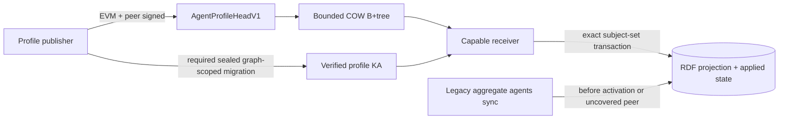

# ADR 0002: System Record Sync V1

Status: proposed, default-off

Issue: [#2052](https://github.com/OriginTrail/dkg/issues/2052)

Base dependency: [#2076](https://github.com/OriginTrail/dkg/pull/2076)

## Decision

DKG nodes will stop using aggregate RDF replay as the steady-state synchronization
protocol for the public `agents` system graph. A capable producer will publish a
signed, immutable record head for its own profile. Providers will expose the heads
through a bounded content-addressed B+tree. Receivers will fetch and atomically
materialize only records whose signed head advanced.

The protocol remains disabled until the activation and compatibility gates in this
document pass. The legacy aggregate lane remains authoritative before coordinated
activation and for peers that do not support V1.

`ontology` and public user Context Graph integration are later, separate changes.
They may reuse the primitives defined here, but they do not ship in the first
`agents` behavior change.

## Problem

Reconnects currently schedule `agents`, `ontology`, and all active durable graph
subscriptions. A completed phase deletes its transfer checkpoint, while checkpoint
identity is peer scoped. Without a peer-independent proof of semantic equivalence,
another reconnect can start aggregate RDF transfer from offset zero.

The r26 and r27 traces recorded repeated system work with little or no semantic
progress. In r27, 14 `agents` attempts across 10 peers caused 26 page retries and
13 failures. In r26, individual attempts retransferred prefixes from 12,288 to
65,536 triples. This work occupied the same global admission capacity needed by
foreground SWM and VM catch-up.

Whole-graph hashes, attempted-write generations, and periodic completeness scans
were rejected. They either require another aggregate store traversal, advance on
duplicate writes, churn on every heartbeat, or create a race-prone global
completeness claim.

## Goals

1. An unchanged profile offered by any number of capable peers is a bounded no-op.
2. One heartbeat changes work proportional to one profile, not the `agents` graph.
3. Record authority is independent of the peer serving the bytes.
4. Projection replacement and applied-head state commit atomically.
5. Reconnect and reconciliation use existing admission, priority, and lifecycle
   machinery; V1 adds no scheduler, timer, worker, or compactor.
6. Every wire, memory, disk, RPC, store, status, and retry surface has a numeric
   bound.
7. Mixed-version nodes retain phonebook correctness throughout rollout.

## Non-goals

- Removing the `agents` or `ontology` graphs.
- Relaxing wallet, peer-identity, Knowledge Asset, or chain authorization.
- Replacing #2053 scheduling or #2076 SWM continuation.
- Introducing a global graph generation, full-graph audit, or per-peer applied
  cursor matrix.
- Moving private or curated metadata through the public system-record protocol.
- Enabling the protocol on mainnet in the implementation changes.

## Architecture



```mermaid
sequenceDiagram
    participant Trigger as Existing reconnect/reconciler
    participant Admission as sync-global
    participant Provider
    participant Receiver
    participant Store

    Trigger->>Admission: Admit one physical background slice
    Receiver->>Provider: Fetch signed root/path/leaf
    alt applied head is equal and locally validated
        Receiver-->>Admission: Bounded no-op
    else newer valid head
        Receiver->>Provider: Fetch exact head, optional fork proof, and bundle
        Receiver->>Receiver: Verify peer, wallet, seal and content
        Receiver->>Store: Atomic exact-subject replacement + head CAS
    end
    Receiver-->>Admission: Release after at most 3 seconds
    Note over Trigger,Admission: A cold logical continuation may reacquire;<br/>foreground demand stops it after the current response
```

## Stable Record Identity

The stable record key is `(networkId, peerId)`. Serving peer, connection, and
provider tree shape are not part of record authority.

An applied version is identified by:

```text
(networkId, peerId, authoritySequence, version, headDigest)
```

`authoritySequence` advances only through a valid wallet transition. `version`
advances within one authority sequence. Lower sequences or ordinary active versions never
replace higher applied state. Once learned and verified, a tombstone is the exception: it is
an authority-sequence-wide revocation marker and dominates every active head in that sequence
regardless of delivery order or version. A bounded active closure cannot prove that an
otherwise valid but undisclosed signed tombstone does not exist; ordinary version ancestry is
unbounded and is deliberately not replayed. Two different active heads at the current maximal sequence/version are an
equivocation and quarantine the record. A valid successor that directly names a canonical
fork resolution may clear that quarantine; after it applies, unresolved alternative lower-version ordinary
heads are stale audit input and cannot re-quarantine state. Expiry affects discovery
eligibility; it does not authorize rollback or deletion.
V1 accepts authority sequences `0` through `14` only, hence at most 14 transitions and
15 current-plus-historical roots. A further rotation is a typed version-cap refusal that
leaves the last accepted record available and requires a later protocol version.

An authenticated tombstone is signed and terminal for its authority sequence; resurrection
needs a valid authority transition. Active/tombstone conflicts resolve to the tombstone and
cannot enter the ordinary fork-resolution path. If multiple valid tombstones are learned for
one sequence, the lowest version wins and equal versions select the lowest semantic digest.
Inventory omission has no deletion authority.

## AgentProfileHeadV1

The unsigned canonical `AgentProfileHeadObjectV1` is an exact tagged union. Both
variants have exactly `(objectType='agent-profile-head', kind='agents', state,
networkId, peerId, peerPublicKey, authoritySequence, version, previousHeadDigest?,
acceptedTransitionDigest?, forkResolutionDigest?,
evmIssuer, rootSubject, projectionSchemaDigest, issuedAt, ownedSubjectTableDigest,
ownedSubjectCount, projectionBytes, projectionQuads)`. Peer public key is unpadded
base64url Ed25519 bytes deriving `peerId`; sequences/counts/bytes/quads are canonical
u64 decimal strings; digests are lowercase 32-byte hex; issuer/root/timestamps use the
frozen scalar codecs. Unknown fields and head-level JSON `null` are rejected; the nested
reused seal retains only the null fields its existing exact codec mandates.

The `active` variant additionally has exactly `(validUntil, assertionCoordinate,
graphScopedAuthorSeal, contentDigest, bundleDigest)`. `assertionCoordinate` reuses the
exact RFC64 `AssertionCoordinateV1` codec and `graphScopedAuthorSeal` reuses the exact
`CanonicalGraphScopedAuthorSealV1` codec; the seal's coordinate/content/root/author
must match the head. Counts/bytes are nonzero and the owned-subject digest is nonempty.
An ordinary initial active head has sequence/version zero and omits all three optional
digests. An ordinary noninitial head requires `previousHeadDigest`; sequence above zero
also requires `acceptedTransitionDigest`; both omit `forkResolutionDigest`. A
current-frontier resolving successor instead requires `forkResolutionDigest`. Above
forked version zero its `previousHeadDigest` is the resolution's common fork base. For a
version-zero fork it omits `previousHeadDigest`; the signed resolution supplies the exact
network/peer/authority/fork tuple and evidence boundary. In both cases the successor's
version is strictly greater than the resolution version. A resolution object alone never
changes applied state. Historical resolution delivery is discarded after a fixed-enum
counter/sampled log and cannot change quarantine, closure, sidecar, or capacity.

The `tombstone` variant adds no fields. It requires `previousHeadDigest` to name an exact
verified active predecessor in the same authority sequence, uses the canonical empty
subject-table digest, and sets owned-subject/projection counts and bytes to decimal
`"0"`. It forbids the five active-only fields and cannot be a protocol-history initial
head. Both variants require peer plus current-EVM signature entries in the exact signed
envelope below.

Its domain-separated canonical encoding excludes all signatures. The semantic
`objectDigest` is computed from that unsigned object. The EVM and detached peer
signatures sit beside the object in `SignedAgentProfileHeadEnvelopeV1` and both
cover `objectDigest` plus their required network/record/sequence context. Version,
fork, previous-head, inventory-row, and applied-state identity use `objectDigest`,
not a signed-envelope digest, so alternate valid signature encodings cannot create
a semantic fork.

Tombstone apply over a present record deletes that record's exact currently committed
projection/subject table; cold apply over canonical absent state uses the signed
predecessor's table as its bounded deletion fallback. Cold noninitial apply accepts only an
opaque authority summary minted by the complete signature-verified closure builder; a caller-
authored or structurally cloned summary is rejected. It releases the deleted projection
accounting in the same transaction and retains the minimal
terminal applied state, every current/historical root claim and reverse binding, and
all precharged status/conflict slots. Resurrection still requires a valid next
authority transition signed by the tombstoning EVM authority; the unavailable-prior-
wallet validity-expiry exception cannot apply because tombstone has no `validUntil`.

Every V1 semantic digest is `SHA-256(UTF8(domain) || canonicalUnsignedBytes)`.
Control/tree objects use strict RFC8785 UTF-8 JSON with exact schemas; profile bundles
use the exact canonical transferred-bundle bytes. Signatures are envelope fields and
are excluded from semantic object digests.

Unless an exact reused codec below says otherwise, every protocol scalar is a JSON
string. Canonical u64 is `"0"|[1-9][0-9]*` and numerically at most
`18446744073709551615`; semantic/object/block hashes are exactly
`0x[0-9a-f]{64}`; EVM addresses are nonzero and exactly `0x[0-9a-f]{40}`; roots are exactly
`did:dkg:agent:` plus that lowercase address. Network ID is 1-128 ASCII
`[A-Za-z0-9:_-]`. A timestamp is a calendar-valid UTC RFC3339 second in years
0001-9999, exactly `YYYY-MM-DDTHH:mm:ssZ`, with no offset, fraction, or leap second.
Canonical peer ID is 1-256 ASCII bytes and must satisfy
`peerIdFromString(value).toString() === value`; `peerPublicKey` is unpadded base64url
decoding to exactly 32 Ed25519 bytes and must derive that peer ID. A digest array is a
JSON array of those digest strings. `recordKey` in signature/collision tuples is the
exact two-element JSON array `[networkId,peerId]`, never a joined string.

Ed25519 public keys and 64-byte signatures use unpadded base64url. EIP-191 signatures
use exactly `0x` plus 130 lowercase hex characters and canonical low-s/recovery rules.
EIP-1271 opaque signatures use `0x` plus 2-8,192 lowercase hex characters (1-4,096
bytes). EIP-1271 evidence uses the canonical unsigned-u256 decimal `chainId`,
the lowercase nonzero contract-address grammar above, u64-decimal `finalizedBlockNumber`, and a
lowercase 32-byte `finalizedBlockHash`; all four are JSON strings. Its `chainId` must equal
the canonical decimal suffix after the final `:` in the signed object's `networkId`; a
network ID without a numeric suffix cannot authorize EIP-1271 evidence. V1 reuses only
`assertCanonicalDecimalU64`, `assertCanonicalChainId`, `assertCanonicalDigest`,
`assertCanonicalEvmAddress`, and `assertCanonicalHexBytes` from
`packages/core/src/sync-wire-scalars.ts`,
`assertAssertionCoordinateV1` from `packages/core/src/author-catalog-codec.ts` and
`assertCanonicalGraphScopedAuthorSealV1` plus
`parseCanonicalGraphScopedAuthorSealV1` from
`packages/core/src/canonical-graph-scoped-author-seal.ts` at base
`308b5bb7d780c12aa17632c66d2248dbd9b49c60`; B1 copies their accepted bytes into golden
vectors so a later codec change cannot silently change V1.

| Object/message | Exact domain literal |
| --- | --- |
| Root descriptor object | `dkg-system-record-root-descriptor-object-v1\n` |
| Inventory internal object | `dkg-system-record-inventory-internal-object-v1\n` |
| Inventory leaf object | `dkg-system-record-inventory-leaf-object-v1\n` |
| Agent profile head object | `dkg-system-record-agent-profile-head-object-v1\n` |
| Authority transition object | `dkg-system-record-authority-transition-object-v1\n` |
| Fork resolution object | `dkg-system-record-fork-resolution-object-v1\n` |
| Conflict evidence object | `dkg-system-record-conflict-evidence-object-v1\n` |
| Profile bundle | `dkg-system-record-profile-bundle-v1\n` |
| Signed envelope cache/transport digest | `dkg-system-record-signed-envelope-v1\n` |
| Provider signature message | `dkg-system-record-provider-signature-v1\n` |
| Peer signature message | `dkg-system-record-peer-signature-v1\n` |
| EVM signature message | `dkg-system-record-evm-signature-v1\n` |
| Root-collision evidence | `dkg-system-record-root-collision-evidence-v1\n` |
| Owned-subject table | `dkg-system-record-owned-subject-table-v1\n` |
| Applied state | `dkg-system-record-applied-state-v1\n` |
| Root-claim set | `dkg-system-record-root-claim-set-v1\n` |
| Capacity state | `dkg-system-record-capacity-state-v1\n` |
| Materialization receipt | `dkg-system-record-materialization-receipt-v1\n` |

Provider signature input is canonical `(kind, networkId, providerPeerId,
descriptorObjectDigest)`. Signature inputs are object-specific and never fill an
inapplicable field with `null`:

- head peer input is `(agent-profile-head, objectDigest, networkId, recordKey,
  authoritySequence, version)`; its EVM input appends `(current-evm, evmIssuer)`;
- authority-transition peer and next-EVM inputs are `(authority-transition,
  objectDigest, networkId, recordKey, priorAuthoritySequence,
  nextAuthoritySequence, priorHeadDigest, signerRole, signerIssuer)`, where peer uses
  `(peer, omitted)`, next EVM uses `(next-evm, nextEvmIssuer)`, and co-signed mode also
  requires the exact `(prior-evm, priorEvmIssuer)` EVM input;
- fork-resolution peer/current-EVM inputs are `(fork-resolution, objectDigest,
  networkId, recordKey, authoritySequence, forkedVersion, resolutionVersion,
  signerRole, signerIssuer)`.

The peer role encodes the exact JSON string `"peer"` and omits `signerIssuer`; EVM
roles encode `"prior-evm"`, `"next-evm"`, or `"current-evm"` and require the lowercase issuer.
Each tuple above is an RFC8785 JSON array. Signature message bytes are exactly
`UTF8(signatureDomain) || RFC8785(tuple)`; Ed25519 signs those bytes, EIP-191 applies
the standard personal-message hash/signature to those bytes, and EIP-1271 validates
that same EIP-191 hash. Ed25519 signatures decode to exactly 64 bytes, EIP-191 to
exactly 65 bytes with canonical recovery/low-s checks, and EIP-1271 opaque signature
data is 1-4,096 bytes.
System-record schema levels reject unknown fields and JSON `null`; every conditionally
absent field is omitted. An exact reused nested codec keeps only its own mandatory null
members. Collision input is canonical `(networkId, root,
incumbentRecordKey, contenderStableKey, contenderHeadDigest)`. Signed-envelope digest
hashes the exact RFC8785 `(object, objectDigest, signatures)` envelope frozen below only
for cache/transport identity; ordering/fork/inventory/applied state use the unsigned
semantic digest.
The canonical empty subject-table digest hashes the RFC8785 bytes for `[]` under its
domain; B1 pins its exact lowercase-hex value in tests.

`OwnedSubjectTableObjectV1` is the exact RFC8785 JSON array of 0-2,048 canonical owned-
subject IRI strings, sorted by UTF-8 byte order with no duplicates, at most 256 KiB. It
has no envelope; authority comes from the signed head's `ownedSubjectTableDigest`. An
active bundle verifier derives this exact array and digest from the bundle. A cold
tombstone closure fetches the predecessor's table by that digest solely as its bounded
deletion set; historical profile content is not thereby materialized.

Transition binding is acyclic: a transition commits the prior sequence/head and
authorizes exactly the next sequence, issuer, and root, but does not commit a next
head. The first head in that sequence commits the accepted transition digest.
Inventory discovery of that head therefore gives the receiver a canonical exact
fetch path for all authority evidence.

Cryptographic signature validity alone never grants object authority. The V1
verifier must enforce all of these object-specific predicates before opening an
applied-head capability:

- the embedded Ed25519 public key derives the canonical libp2p `peerId` in the
  stable record key, and its domain-separated signature covers the unsigned
  `objectDigest`, network, record key, authority sequence, and version;
- the EVM control signature recovers or EIP-1271-validates exactly the canonical
  `evmIssuer`; the root is exactly `did:dkg:agent:<lowercase evmIssuer>`;
- for `active`, profile coordinate, seal, content/bundle digests, owned-subject set,
  root, network, and record key all refer to the same `agents` record; the graph-scoped
  seal author equals current EVM authority; and exact bundle/seal verification precedes
  state advance;
- for `tombstone`, an exact verified active predecessor, same authority/root,
  empty-table digest/count, zero projection accounting, and forbidden active-only fields
  all validate before deletion. Inventory/provider signatures authenticate availability
  only and cannot authorize either variant.

An initial active head requires peer and EVM signatures over sequence zero, has no prior
head/transition, and satisfies every active equality above. An ordinary active update keeps the
same network, peer, issuer, authority sequence, and root; its version is strictly
higher. A valid higher version may fast-forward, while `previousHeadDigest` remains
fork/audit evidence rather than a retention-dependent gate. Consequently the active closure
does not claim absence of an unseen tombstone; a tombstone takes terminal precedence as soon
as its own bounded proof is learned. A tombstone instead proves a
noninitial active predecessor and, once verified, dominates all active versions in that
authority sequence; it does not depend on which active version is currently local.

The canonical unsigned `AgentProfileAuthorityTransitionV1` fields are exactly
`(objectType='authority-transition', kind='agents', mode='co-signed'|'expired-prior',
networkId, peerId, peerPublicKey, priorAuthoritySequence,
nextAuthoritySequence, priorHeadDigest, priorEvmIssuer, nextEvmIssuer, nextRoot,
issuedAt, priorValidUntil?)`. Sequences are u64 decimals with
`nextAuthoritySequence=priorAuthoritySequence+1`; issuers and `nextRoot` are canonical
lowercase and `nextRoot=did:dkg:agent:<nextEvmIssuer>`. `co-signed` omits
`priorValidUntil` and requires peer, prior-EVM, and next-EVM signatures.
`expired-prior` requires `priorValidUntil` equal the predecessor head's signed value,
omits the prior-EVM signature, is accepted only after that instant plus five-minute
skew, and still requires peer and next-EVM signatures. No `version`, next-head digest,
optional `null`, or generic on-chain-controller escape exists. Two different
transitions to the same next sequence are authority equivocation whether discovered before
or after a descendant materializes. V1 has no transition-resolution object or clearance
path: every receiver that verifies both transitions atomically quarantines the record and
keeps it quarantined across later heads, restarts, GC, and provider changes. A future
protocol may recover only with portable authorization from every conflicting branch's
current controller or finalized external authority; peer plus historical prior-EVM
authority is insufficient. The availability sidecar propagates the bounded conflicting
transition objects, but no successor, version increase, or sequence pumping can clear
them. B1 pins receivers that first apply opposite A-to-B/B1 and A-to-C/C1 branches, then
exchange the identical conflict set, to the same terminally quarantined status with no
further materialized-state change.

The canonical unsigned `AgentProfileForkResolutionV1` fields are exactly
`(objectType='fork-resolution', kind='agents', networkId, peerId, peerPublicKey,
evmIssuer, authoritySequence, forkedVersion, resolutionVersion,
forkBaseHeadDigest?, evidenceHeadDigests, issuedAt)`.
`evidenceHeadDigests` is sorted, duplicate-free, has 2-16 entries, and names a verified
subset of conflicting heads at `forkedVersion`; it is evidence, never a receiver-local
completeness claim. A verifier must not reject a resolution merely because it knows another
valid conflict omitted from this bounded list.
`resolutionVersion` is strictly greater than `forkedVersion`. Peer and current-EVM
signatures are mandatory. At version zero `forkBaseHeadDigest` is omitted and every
listed initial head omits `previousHeadDigest`. Above zero it is mandatory, names a
fully verified lower-version active same-authority/root head, and every listed active head must
name it as `previousHeadDigest`; otherwise V1 leaves the fork quarantined for a later
protocol. This order-independent common base replaces the ambiguous notion of a locally
first accepted head.

The fresh signatures choose continuation rather than deleting any listed head, but the
resolution itself never mutates or deletes materialized state. A current-frontier resolving
successor directly names its digest in `forkResolutionDigest`, is signed by the same peer/
current EVM authority, and has `version > resolutionVersion`. Above version zero it names
the common `forkBaseHeadDigest` as `previousHeadDigest`; at version zero it omits
`previousHeadDigest`. This rule is independent of which conflicting projection arrived
first and of conflicts omitted from `evidenceHeadDigests`. The resolving successor replaces
any locally retained quarantined projection atomically. Tombstones cannot be a common base,
listed fork evidence, or resolving-successor ancestry. Only after that successor applies
may an authority transition name it as `priorHeadDigest`. V1 has no terminal fork-resolution
mode; a verified tombstone bypasses fork resolution and is the terminal sequence marker.

A fork resolution below the current frontier or below an already materialized authority
descendant is audit-only: the verifier may record a fixed-enum counter/sampled log, then
discards it without pinning/indexing or closure/sidecar/capacity effects. Competing
resolutions do not change state. Competing resolving successors are ordinary head forks;
a later fresh resolution/successor may resolve their current tuple. B1 pins three-candidate
`resolution+successor before third conflict` and `third conflict before resolution+
successor` vectors at version zero and above zero, across two receivers/restart/provider
failover, to identical final head, projection, disposition, closure, sidecar, and capacity.
A 16/17-conflict boundary uses the same rule: conflict-slot overflow affects local
diagnostics and bounded sidecar representation while unresolved, but it is not an authority
predicate and cannot invalidate an otherwise valid fresh resolution/successor. B1 pins
resolution/successor before the 17th conflict and the opposite order at version zero and
above zero to the same applied state across restart/provider failover.
A repeated stale-resolution flood must leave zero pinned/indexed audit objects after
request release and plateau total cache objects, disk bytes, and metadata across restart/GC.

The unsigned availability-only `AgentProfileConflictEvidenceV1` has exactly
`(objectType='conflict-evidence', kind='agents', networkId, peerId, entries)`. It has
1-8 entries in the same literal type order. A fork entry is exactly
`(type='fork', authoritySequence, version, objectDigests)`; a transition entry is exactly
`(type='transition', priorAuthoritySequence, nextAuthoritySequence, objectDigests)`.
Each digest array is sorted/unique with 2-16 values and there are at most 16 digests total.
Every fetched object must independently verify as a correctly signed head/transition at
that exact tuple, with at least two different semantic digests. The object and provider
signature authenticate availability only; they never authorize quarantine, selection, or
state. A receiver changes state only after validating the signed conflicts itself.

An inventory row has optional `conflictEvidenceDigest`, present only when the provider
can serve the complete declared evidence sidecar and its signed objects; this does not
claim the sidecar exhausts every locally observed conflict. The quarantine flag alone
has no authority. An honest provider that learns an unresolved conflict COW-updates this
sidecar/row so other receivers can fetch proof before the equivocating authority issues a
resolution. For a fork conflict, the field is omitted only after a canonical resolution and
its directly referencing resolving successor have applied. A transition-conflict sidecar is
never removed in V1. Evidence saturation never restores discovery: the local record remains
quarantined even if it cannot advertise a sidecar.

Oxigraph quarantine state and the file-cache inventory cannot commit atomically, so V1
uses one bounded state-first saga rather than pretending they can. On a newly verified
conflict, one applied-state transaction first persists quarantine/conflict slots plus an
exact indexed `publish` sidecar intent bound to state revision and target evidence digest.
While that intent exists the provider refuses to sign or serve an inventory containing
the affected row. It then durably ingests/publishes the evidence sidecar and row through
the cache journal, after which a second state CAS clears the intent and sets
`conflictEvidenceDigest`. A crash may therefore temporarily omit a quarantined row but
can never advertise an unresolved row without evidence.

A resolution alone leaves the record quarantined. Once its direct resolving successor
applies, the applied-state CAS installs the successor, discoverable state, and indexed
`remove` intent while retaining the old evidence digest; only then does
cache publication remove the sidecar/update the row, and a final CAS clears the digest and
intent. A stale sidecar is fail-closed because receivers independently compare it with the
signed resolution and successor. Each intent is the exact all-or-none
`(conflictSidecarIntentOperation='publish'|'remove'|'deferred',
conflictSidecarIntentEvidenceDigest, conflictSidecarIntentStateRevision)` group. The
existing 1,024-record state index bounds intents. Every transition is derived from the
authoritative state revision rather than the last cache state:

The resolution/successor rows below apply only to same-authority fork conflicts.
Transition equivocation remains `publish` plus quarantine permanently in V1.

| Existing intent | Authoritative state | Required next state/cache action |
| --- | --- | --- |
| none | unresolved conflict | persist quarantine plus `publish`; omit the row until publication completes |
| `publish` | same or expanded conflict | keep it, or CAS-replace its digest/revision with the expanded evidence |
| `publish` | resolution without accepted successor | keep `publish`, quarantine, and the omitted row |
| `publish` | resolution plus accepted resolving successor | CAS-replace it with `remove`, retaining staged references for cleanup |
| `remove` | unresolved conflict | CAS-replace it with `publish` for the current evidence and keep quarantine |
| `remove` | resolution plus accepted resolving successor | CAS-refresh its target revision/head and finish removal |
| `remove` | successor invalidated by a new frontier conflict | CAS-replace it with `publish` and quarantine |
| `publish` | sidecar/cache capacity refusal | CAS-replace it with indexed `deferred`, keep quarantine with no evidence digest, and omit the row |
| `deferred` | relevant capacity/state-change trigger | retry `publish`, or clear it if an accepted resolving successor made evidence obsolete |

Startup hydrates the bounded intent index before signing an inventory and always omits an
affected row until its saga is terminal. Provider capability may advertise unaffected
rows while the bounded index is not saturated; omission has no completeness/deletion authority, and conflict-evidence readiness is
reported separately. Repair advances one indexed intent at a time through the existing
sync-global/reconciler continuation. Each object ingest and each journal/row/state CAS is a
separately resumable durable step. Before dispatching a non-preemptible local step, at
least `SYSTEM_RECORD_REPAIR_MIN_DISPATCH_BUDGET_MS=1500` must remain in the three-second
slice; otherwise it releases admission and waits for the next existing trigger. A started
step may finish after the deadline, but no later step dispatches. Healthy maximum-size step
p99 must be at most 750 ms, the overrun/latch/slot duration is measured, and failure blocks
provider activation rather than raising concurrency or the budget. One intent is bounded
by 17 sidecar objects/1,064,960 canonical bytes and 110 reference deltas. A logical trigger
handles at most 512 slices/30 minutes; any remainder safely stays omitted until another
existing trigger, which is not guaranteed when the reconciler is disabled. There is no
graph/directory scan, network fetch, timer, worker, or new queue, and API, foreground,
unrelated-graph work, and unaffected provider rows remain available below saturation.
Before committing the 1,025th affected record, the same authoritative state transaction
is executed through the existing aggregate session's reserved control barrier. The barrier
first seals system-record provider admission and aborts/drains the sole admitted provider
stream under its existing three-second deadline, then commits the saturation flag,
quarantine, and incremented provider generation while admission remains sealed. Startup
hydrates the flag before registering the handler. While that flag is set the provider
refuses to sign or serve the entire system-record descriptor/inventory. It makes
no unsupported claim that an unindexed row can be selectively omitted or retried. Clearing
the flag requires explicit operator recovery that first reduces authoritative affected
state to at most 1,024 records (or upgrades the protocol), then rebuilds the complete keyed
index and descriptor under the same sealed barrier, commits a new generation/readiness,
then reopens admission. Every admitted handler binds the session/provider generation and
revalidates it immediately before signature/write; mismatch resets the stream. Automatic
continuations do not scan. Indexed
`deferred` intents are revisited only by the bounded continuation after relevant state/
capacity change. State revision CAS makes concurrent
conflict/resolution changes rewrite or restart the saga from authoritative state. No cache
latch or store slot crosses a store boundary. Crash injection covers every state/cache/
finalize boundary, every transition-table row, the 1,024/1,025 saturation boundary with
an in-flight request at commit/clear, crash at every seal/drain/flag/descriptor/readiness
boundary, restart and zero descriptor service while saturated, per-step resume, insufficient-
budget deferral, a slow-`fsync` single-step overrun, disabled reconciliation, and both
logical-trigger edges. Capacity refusal retains the indexed `deferred` retry key but no
sidecar digest or row; a later relevant existing trigger can locate it without a scan or
hot loop.

The provider root-descriptor envelope is exactly `(object, objectDigest,
providerPeerId, signatureSuite='ed25519-v1', signature)` and uses the provider input
above. Every authority-bearing head/control signed envelope has exactly
`(object, objectDigest, signatures)`. `signatures` is
a nonempty array sorted by the fixed role order `peer`, `prior-evm`, `next-evm`,
`current-evm`, with no duplicate role. Each exact entry is
`(role, suite, signer, evidence, signature)`: peer requires
`suite='ed25519-v1'`, signer equal canonical peer ID, and `evidence={kind:'none'}`;
EVM roles require suite `eip191-personal-sign-digest-v1` with
`evidence={kind:'none'}`, or `eip1271-current-finalized-v1` with exact
`evidence={kind:'eip1271-current-finalized', chainId, contractAddress,
finalizedBlockNumber, finalizedBlockHash}`. EVM signer equals the role's exact issuer.
Head/fork require roles `(peer,current-evm)`; co-signed transition requires
`(peer,prior-evm,next-evm)`; expired-prior requires `(peer,next-evm)`. Binary encodings use the byte limits above.
No envelope accepts a missing/extra signer, alternate order/field, `null`, mutable live-
account-code suite inference, or a supplied digest unequal to the recomputed semantic
digest. B1 commits independently generated golden canonical-object bytes, object
digests, signature-message bytes, signatures, and signed-envelope digests for every
variant and omission branch, plus the provider descriptor envelope. The standalone
golden-vector generator may use only the pinned scalar primitives, RFC8785, and standard
crypto; it must not import the B1 codec/verifier modules under test. CI byte-compares its
fixtures with production-code output.

Same-sequence/version head forks quarantine the record. A bounded
`AgentProfileForkResolutionV1` lists 2-16 verified conflict digests as non-authoritative
evidence, binds the order-independent common fork base above version zero, retains the
current authority bindings, and establishes a resolution version. More than 16 locally
verified frontier conflicts sets bounded overflow diagnostics while the fork is unresolved,
but cannot invalidate a fresh directly bound resolution/successor; a receiver does not infer
evidence completeness from the resolution list. A tombstone requires current peer and EVM authority,
proves an exact active predecessor, and is the authority-sequence-wide terminal marker.
Same-tuple and cross-version active conflicts do not weaken it or authorize fork resolution.
A tombstone remains eligible for resurrection only by a valid next-sequence authority transition.
Expiry changes discovery
eligibility only and never authorizes rollback. `issuedAt` more than five minutes
in the future is rejected.

Only frontier head conflicts and conflicts against the bounded applied transition chain
affect discovery. Another head at the current maximal tuple, another transition to the next
not-yet-materialized authority sequence, or a different valid transition digest for any
retained applied-chain sequence quarantines and unions into fixed conflict slots. Every
applied state retains the exact transition digest for each of its at-most-14 authority
steps. A valid higher ordinary head makes only lower ordinary
heads historical; an alternative ordinary head first learned after that point is stale
audit input and cannot re-quarantine or mutate the current record. A late alternative
transition never becomes stale merely because its selected branch previously advanced:
both `transition -> descendant -> alternative` and `transition -> alternative ->
descendant` delivery quarantine identically, including after restart/provider failover.
A current-frontier head fork may clear only through its canonical fork resolution plus
resolving successor and ordinary verified apply; resolution objects alone never do so.
Transition equivocation never clears in V1. A new head conflict at the current frontier always
re-quarantines unless it is already below an applied resolving successor; unresolved
conflict-slot overflow stays quarantined but clears with that same portable successor rule. B1 pins
`H5a -> H10 -> restart/GC -> H5b` and `H5a/H5b -> H10` to the same H10 materialized state,
and separately pins opposite-order authority-transition conflicts to the same permanently
quarantined V1 state.

Every inventory row and applied state carries only the current head digest plus optional
conflict-evidence digest/flags. A resolving head's direct `forkResolutionDigest` is verified
through that head's closure and needs no independent anchor/index. Historical resolution
branches are not indexed or pinned, and ordinary historical heads are not retained merely
for ordering.

The peer signature uses a separate canonical domain and is not encoded as an
RFC64 `ControlObjectSignatureVariantV1`. Stack B1 may reuse the lower-level RFC64
canonical envelope/digest codecs, opaque bundle decoder, graph-scoped seal
verification, and EOA/EIP-1271 primitives. It must not cast through the
catalog-specific transferred-bundle verifier, which binds catalog head/row types.
The canonical peer ID comes from the libp2p node identity and embedded peer key;
`AgentWallet.peerId()` is not used because it returns public-key bytes rather than
the canonical libp2p peer ID. Initial producer support is EOA/EIP-191 only; a
contract-wallet profile cannot advertise V1 until an explicit local EIP-1271
signing provider is configured and tested. Producer state loss must hydrate and
verify current state from exact content-addressed objects or remain legacy-only;
it never invents a new sequence/version.

## Exact Projection Boundary

The profile bundle carries a sorted, duplicate-free owned-subject list. Valid
subjects are limited to:

1. the canonical `did:dkg:agent:0x<40-lowercase-hex>` root;
2. only `root/.well-known/genid/cap[1-9][0-9]*`,
   `root/.well-known/genid/offering[1-9][0-9]*`,
   `root/.well-known/genid/registration`, and
   `root/.well-known/genid/hosting`, linked respectively by
   `erc8004:capabilities`, `skill:offersSkill`, `prov:wasGeneratedBy`, and
   `skill:hostingProfile`;
3. exact `root#x25519-<32-lowercase-hex>` encryption-key/revocation subjects.

Each subject kind also has a frozen predicate allowlist matching `buildAgentProfile`;
the hosting projection temporarily accepts legacy `skill:paranetsServed` for the
measured testnet cohort. X25519 IDs must be recomputed from the root wallet and
decoded public key with `workspaceAgentEncryptionKeyId`; syntax alone is not
derivation. Blank nodes, encoded/unknown paths, malicious link predicates,
arbitrary external subjects, malformed fragments, and unlinked/underived subjects
are rejected. No prefix scan is permitted during V1 materialization.

## Inventory

Providers expose a content-addressed copy-on-write B+tree sorted by:

```text
(SHA-256(networkId || 0x00 || canonicalPeerId), canonicalPeerId)
```

Provider tree shape is not authoritative. A provider signs the immutable root
descriptor `(kind='agents', networkId, epoch, version, priorRootDigest, treeRootDigest,
totalRows)` to authenticate availability only. `priorRootDigest` is a non-owning
audit pointer and never contributes to object reachability. Every row still carries
its own wallet and peer authority.

Inventory nodes/leaves are ordinary content-addressed immutable objects. Leaves
encode only canonical sorted rows and their derived key range; internal nodes encode
only canonical ordered separator/child-digest entries and their derived key range.
Mutable descriptor version, traversal path, and provider identity are not encoded, so
untouched subtree digests remain reusable across root publications and providers with
identical content. The signed descriptor commits the root digest; every traversed
parent commits the next child digest. Verifiers also enforce key-range, occupancy, and
ordering invariants at each edge.

Hard structural bounds:

| Item | Bound |
| --- | ---: |
| Encoded row | 512 bytes |
| Encoded internal entry | 256 bytes |
| Non-root leaf | 128-512 rows, at most 256 KiB |
| Non-root internal node | 128-256 entries, at most 64 KiB |
| Root | 2-256 entries, at most 64 KiB |
| Incoming records per network/kind | 262,144 hard parser/tree cap |
| Leaves at hard cap | 2,048 |
| Tree height | 3 |
| One inventory-tree update | 6 objects, 1 MiB, 6 durable object writes |

The leaf row is a compact head reference, not the signed object: version byte,
32-byte stable-key hash, two-byte peer-ID length plus at most 256 peer-ID bytes,
u64 authority sequence, u64 version, 32-byte head digest, optional 32-byte conflict-
evidence digest, and one flags byte. Its ordinary maximum is 340 bytes and quarantine-
evidence maximum is 372 bytes. Internal separators carry the 32-byte
stable-key hash and child digest, not the full peer ID; a provider must reject the
cryptographically exceptional case where two different canonical peer IDs produce
the same stable-key hash. This keeps the internal-entry bound independently
checkable before the full codec lands.

The row/entry count is the hard lower occupancy rule. The byte-aware rebalancer
targets 64 KiB leaves and 32 KiB internal nodes when entry sizes permit it. Split,
borrow, and merge selection is deterministic: split at the canonical row nearest
half the encoded bytes while preserving row minima; borrow first from the
lexicographically adjacent sibling that can remain above its minimum, preferring
left on a tie; otherwise merge with the lexicographically adjacent sibling,
preferring left on a tie. Copy-on-write proceeds bottom-up. An update touches one
logical search path and at most two leaves, two internal nodes, one root, and one
root descriptor.

Two-successive-publication tests insert, update, and delete across split/borrow/merge
boundaries and prove that untouched object digests are reused while each publication
still writes at most six objects/1 MiB.

The 262,144-row bound limits an incoming inventory and its tree parser. It does
not enlarge the local provider cache below: a node can retain and serve at most
the heads and bundles that fit its 50,000-object/2-GiB aggregate cache.

The agents-only V1 wire protocol is `/dkg/system-records/1.0.0`. Requests and
responses are `u32be headerLength || RFC8785-canonical-json header || payload`; the
8-KiB header bound is checked from the first four bytes before allocation. Requests
are payload-free and have `payloadBytes=0`; response payload allocation is bounded by
the parsed/validated object kind before it is read, with an aggregate
`1 MiB + 8 KiB + 4 bytes` frame cap.
The exported constant is
`SYSTEM_RECORD_MAX_FRAME_BYTES=1_056_772`; codecs, transport permits, accounting, and
tests use that one value.
Scalars are exact: `wireVersion='1'`; request ID is 32 lowercase hex characters;
SHA-256 digest is `0x` plus 64 lowercase hex characters; epoch/version are unsigned-u64 decimal strings;
network ID is 1-128 ASCII `[A-Za-z0-9:_-]`; traversal path is at most two child indexes
in `[0,255]`.

Request fields are exactly `(wireVersion, requestId, kind='agents', networkId,
operation, rootDescriptorDigest?, path?, objectKind?, objectDigest?, payloadBytes)`.
Operations are `get-root`, `get-inventory-object`, `get-control-object`, and
`get-bundle`. `get-root` has no object fields. Inventory fetch requires pinned
descriptor digest, path, exact digest, and `inventory-internal|inventory-leaf`.
Control fetch requires exact digest and one of `agent-profile-head`,
`authority-transition`, `fork-resolution`,
`conflict-evidence`, or `owned-subject-table`. Bundle fetch
requires `profile-bundle`; tombstone is signed head state rather than a separate kind.

Response fields are exactly `(wireVersion, requestId, status, objectKind?,
objectDigest?, payloadBytes, errorCode?)`. Status is
`ok|not-found|invalid-request|unsupported|busy|internal`; each non-success has no
payload and exactly `not_found|invalid_request|unsupported|busy|internal` for its
matching status. `get-root` success has `objectKind='root-descriptor'`; every other
success has one requested kind/digest-bound payload. Root descriptors, internal nodes, leaves, every control
kind, and bundles have distinct hash domains/caps. Unknown fields/enums, noncanonical
JSON/scalars, excessive depth/path, size mismatch, trailing bytes, kind/digest
mismatch, or cap overflow fail before payload allocation or cache/continuation use.

| Wire object | Encoded cap |
| --- | ---: |
| Request/response header | 8 KiB |
| Root descriptor | 16 KiB |
| Inventory root/internal | 64 KiB |
| Inventory leaf | 256 KiB |
| Profile head | 64 KiB |
| Authority transition/fork resolution | 64 KiB each |
| Conflict evidence | 16 KiB |
| Owned-subject table | 256 KiB |
| Profile bundle payload | 1 MiB |
| Whole response frame | 1 MiB + 8 KiB + 4 bytes |

A slice pins one signed descriptor digest and root digest. Each next object is
requested by the digest committed by the pinned root/parent and validated against
the requested path/key range. A descriptor change ends traversal, but verified
content survives. Reuse occurs only when the new root/parent commits the same digest;
offsets never cross descriptors.

## Atomic Materialization

Stack B1 freezes a canonical applied-state object before storage work. The exact
tagged `absent` sentinel and `present` schema cover network/kind, stable key,
monotonic state revision, status (`active`, `quarantined`, `tombstone`, `dirty`),
head/conflict-evidence?/projection/owned-subject-table digests, the exact contiguous
`(priorAuthoritySequence,nextAuthoritySequence,transitionDigest)` lineage for each of
the at-most-14 accepted authority transitions, and
counts, optional all-or-none conflict-sidecar intent operation/digest/state-revision,
optional pending-deletion-table digest/count/bytes, current root, at most 14 historical
roots (15 current-plus-historical roots total), 16 fixed preallocated conflict-digest slots plus one overflow bit,
materialization epoch, and accounted bytes. Its digest domain is
`dkg-system-record-applied-state-v1\n` and excludes only the digest field. Global
capacity state has its own revision, live-record count, and accounted bytes.
For every present record, `accountedBytes` is canonical and exact:
`64 KiB fixed state/security precharge + ownedSubjectTableBytes + projectionBytes +
pendingDeletionTableBytes`. The pending term is zero when omitted; current JSON size is
validated against the 64-KiB envelope but never reduces the precharge.
Tombstones commit the canonical SHA-256 digest of an empty projection under
`dkg-ka-projection-v1\n`; active state rejects that empty-projection digest.
Capacity accounting separates state/table bytes, persistent V1 projection bytes, and
projection quads.
`conflictEvidenceDigest` is present only for a fully cached unresolved availability
sidecar. Conflict-sidecar intent fields are all present only during the bounded saga and
are included in state capacity; partial groups fail. Pending deletion fields are all present only for a pre-activation shadow
tombstone and otherwise all omitted; their bytes are included in state/cache capacity.
Unknown fields, partial groups, and JSON `null` fail the applied-state codec.
The exact canonical sorted duplicate-free prior subject list lives in a separately
indexed per-record reserved table in the same transaction boundary. Its encoded bytes
are capped at 256 KiB and committed by the state table digest/count; header and table
bytes both count toward per-record and aggregate accounting.

Stack B2 exposes a passive controller. Merely discovering it performs no work; an
explicit non-serializable activation lease opens a generation-bound session. Callers
never supply graph URIs, reserved-state quads, or local CAS values:

```ts
interface SystemRecordLaneControllerV1 {
  open(activation: SystemRecordLaneActivationV1): Promise<SystemRecordLaneSessionV1>;
}

interface SystemRecordLaneSessionV1 {
  inspectAppliedState(
    recordKey: string,
    proof?: VerifiedAgentProfileReplacementV1,
    options?: QueryOptions,
  ): Promise<SystemRecordAppliedStateInspectionV1>;
  applyVerified(proof: VerifiedAgentProfileReplacementV1, options?: QueryOptions):
    Promise<SystemRecordApplyOutcomeV1>;
  close(mode: 'disable' | 'shutdown'): Promise<void>;
}

type SystemRecordApplyOutcomeV1 =
  | { outcome: 'applied'; stateRevision: string; appliedStateDigest: string }
  | { outcome: 'already-applied'; stateRevision: string; appliedStateDigest: string }
  | { outcome: 'stale' | 'root-collision' | 'capacity-exhausted' | 'capability-lost' }
  | { outcome: 'deferred'; reason:
      'inspection-timeout' | 'inspection-overflow' | 'validation-mismatch' |
      'state-changed' | 'generation-changed' | 'aborted' |
      'insufficient-apply-budget' }
  | { outcome: 'indeterminate'; recoveryGeneration: string };
```

Stack B1 owns canonical limits, state/object/inventory/wire codecs, and pure
structural/cryptographic primitives only. Stack B2 introduces the one agent-runtime
foundation used by later local producer and receiver: private proof registry/reader,
activation issuer, 64-MiB accountant, and one live 12-MiB lease per store. Producer and
receiver receive distinct lifecycle-bound structured consume closures that reserve,
decode, invoke their captured verifier, register a deep immutable proof, call
`applyVerified`, and release in `finally` unless ownership transfers to recovery. No
proof/lease is returned or abandonable. The
daemon-owned production controller factory captures this registry reader and activation
validator during composition; `open` cannot accept caller readers. Non-production
readers/leases exist only in internal test modules. No public factory, symbol, cast,
or shallow freeze can mint/alter a proof, reader, activation, or reservation.

`inspectAppliedState` is the only reserved-state/revalidation read and returns only a
bounded typed summary, never RDF or a retained handle. With an equal-head proof it
binds root discovery, exact `VALUES` reads, and promotion to one activation generation,
child generation, materialization epoch, state revision, and root-claim/reverse-binding
snapshot. It reads at most 2,048 subjects, 10,000 quads, 2 MiB, and one second.
The exhaustive result mapping is: exact digest equality is `match`; missing, extra, or
changed bounded data is `validation-mismatch`; a row/byte/subject cap breach is
`inspection-overflow`; timeout/abort is `inspection-timeout|aborted`; and any state,
epoch, child, activation, or session change is `state-changed|generation-changed`.
Only `match` may become `already-applied`.

`validation-mismatch` or `inspection-overflow` installs one in-memory
`exact-recovery-required` marker before returning `deferred`. The marker is charged to
the existing 1,024-record/8-MiB recovery cap and binds record key, head digest,
activation/child generation, materialization epoch, and that record's state revision/
digest. It deliberately excludes global capacity revision. A fresh proof on the next
existing trigger with the same record tuple consumes the marker into exact replacement
rather than repeating projection validation, then reads/rebinds the latest root-claim
and capacity revisions inside the one-shot CAS. An unrelated-record capacity change
does not clear the marker. Capacity-CAS staleness retains/rebases the intent without
another projection inspection; the single physical materializer latch serializes the
eventual read/CAS dispatch. Insufficient apply budget likewise retains it. Match, apply,
stale/collision/capacity/capability terminal outcome, disable/shutdown, or a bound
record/epoch/generation change clears it.

The marker table reserves one entry for every activation-cohort record. If its hard
1,024-entry/8-MiB cap is nevertheless reached in shadow mode, one aggregate
`recovery-cap-saturated` latch blocks further equal-head inspections while existing
markers drain; it owns no key, timer, queue, or worker. Refusal is typed
`capacity-exhausted`. The next existing trigger processes admitted markers first and
new inspections resume only after capacity changes. Tests prove mismatch then next-
trigger convergence during continuous unrelated-record churn, capacity-CAS rebase,
overflow recovery, epoch/restart invalidation, marker saturation with zero repeated
inspection, and no retry hot loop.

`applyVerified` consumes the registered proof/reservation and performs inspection,
preparation, and dispatch within one call. Its module-private one-shot command is bound
to activation generation, child generation, materialization epoch, immutable
replacement, and all expected state/root/capacity revisions; it is never returned or
abandonable. Dispatch consumes it. Retry, stale state, disable, child change, or an
indeterminate result requires a new verified call. Old facades fail before dispatch
with terminal `capability-lost`.

Inspection timeout/abort never causes a write or child recovery. Caller abort or less
than 1,500 ms remaining in the admitted slice returns typed predispatch `deferred` and
releases its reservation; mismatch/overflow follows the recovery-marker transition
above. The shared constants are
`SYSTEM_RECORD_APPLY_TIMEOUT_MS=1000` and
`SYSTEM_RECORD_REQUIRED_DISPATCH_BUDGET_MS=1500`; dispatch requires the latter and the
request uses the former hard timeout. For the receiver, trusted `sync-global` admission
issues a private, unforgeable monotonic `AdmittedSliceContextV1` at the start of the
three-second slice, before inventory/fetch/decode/verify. For the local producer, the
lifecycle-owned existing foreground profile-publication admission issues a distinct
nonrenewable `ProducerApplyContextV1` with a three-second absolute window immediately
after confirmed KA publication and before structured consume begins. The process-global
store scheduler never issues or refreshes either context; it only validates and
consumes it. The structured consume registry carries the context privately through
decode/verify/apply; public `QueryOptions`/`AbortSignal` cannot mint or extend it. After
store admission and immediately before any request byte can reach
the child, the adapter rechecks that at least 1,500 ms remains. Queue wait consumes the
budget. The request timeout is `min(1000 ms, absoluteSliceDeadline-now)` using the same
monotonic clock; threshold failure produces `insufficient-apply-budget` with zero child
dispatch or recovery. No fallback context exists. Fake-clock tests cover receiver time
spent in fetch/decode, producer pre-apply time, exact threshold, queue-delay budget loss,
abort race, downstream refresh attempts, and no-dispatch defer. Live B2 conformance requires maximum-size apply
p99 <=750 ms and zero deadline-induced recovery on a healthy node; otherwise record
limits are lowered before activation.

The private immutable one-shot `PreparedSystemRecordApplyV1` is an exact tagged command
with common fixed kind/network/stable key and canonical expected/next state fields, plus
exactly one registry-backed payload: `active { replacementBundle }` or
`tombstone { deletionTable }`. Its structured proof and runtime lease own the payload;
callers cannot author a delete scope. Storage consumes it once and, for tombstone,
recomputes the table digest/count against the verified predecessor head before deriving
the exact deletion. Missing/mismatched/reused/cross-session payloads fail before dispatch.

The expected-state CAS covers `(stateRevision, appliedStateDigest, headDigest,
transitionLineage,
conflictEvidenceDigest?, ownedSubjectTableDigest,
conflictSidecarIntentOperation?, conflictSidecarIntentEvidenceDigest?,
conflictSidecarIntentStateRevision?,
pendingDeletionTableDigest?, rootClaimSetDigest, materializationEpoch,
capacityRevision)`. Storage derives graph URIs, reads the exact prior subject table,
derives the exact prior/next union, canonical state/table quads, next revision/digest,
current and historical claims, exact reverse bindings, and aggregate state/table/
projection-byte/quad accounting. A same-head status change
cannot ABA. Typed outcomes distinguish `applied`, `already-applied`, `stale`,
`root-collision`, `capacity-exhausted`, predispatch `deferred`, `indeterminate`, and
`capability-lost`.

The transaction verifies the full expected state and unique root claim. It deletes
the exact duplicate-free union of previous and next owned subjects before inserting
the replacement, then updates applied state, root claim, receipt, and byte accounting
in one durability unit. That union is capped at 2,048 subjects total; a wallet
transition that exceeds it is rejected before request construction. Initial apply
therefore removes pre-existing legacy rows on every exact target subject instead of
merging signed and unsigned projections. `STRSTARTS`, prefix delete, aggregate
count, and whole-graph scan are forbidden.

A fully verified tombstone closure may CAS directly from canonical `absent` local state
to terminal `tombstone` state. “Cannot be initial” is a protocol-history predicate
proved by its exact signed active predecessor and deletion-only owned-subject table, not
a requirement to materialize that predecessor locally first. The closure builder returns an
in-memory opaque authority summary binding candidate digest, exact contiguous transition
lineage, ordered unique historical roots, predecessor, and deletion-table digest. Cold apply
requires that branded summary; serialized or caller-constructed equivalents have no authority.
The one transaction deletes
the predecessor table's exact subjects, installs terminal head/state, verified
current/historical root claims and reverse bindings, empty current table, zero projection,
and precharged security slots. It never inserts the predecessor projection, and discovery/
cache/index facades observe no intermediate active state. Root collision and capacity
checks are identical to other absent-state application. In pre-activation shadow mode it
cannot delete authoritative legacy RDF; shadow state persists the verified tombstone and
exact pending deletion-table digest/count/bytes, charges the table in state/cache
accounting across restart, and coordinated cutover performs that exact deletion and
clears the pending fields in the same
authoritative tombstone CAS. A cold-receiver test seeds predecessor legacy rows and
asserts their atomic removal with zero transient predecessor projection or dialable
identity before/after crash and cutover.

Fork resolutions never mint a materializer command. They retain quarantine until a
verified current-frontier resolving successor applies through the ordinary exact
replacement path. A tombstone never enters fork resolution. When it supersedes a present
active row, the tombstone command deletes the exact currently applied table; only cold
absent-state apply uses the signed predecessor table. A fork
resolution below the current frontier performs no projection, root-claim, binding,
capacity, or closure mutation. Transition equivocation has no V1 resolution command and
remains quarantined.

One nonterminal signed record owns a canonical wallet root. Root claim is a bounded
reserved-state CAS keyed by `(network, root)` and points to the peer-keyed record.
A second record or wallet transition targeting an already-claimed root is a signed
root-ownership collision. Only a fully verified replacement proof for that exact
wallet may apply it. If both records already exist, one bounded transaction CASes
both present-state digests/revisions plus root claim/capacity, keeps the incumbent
projection for forensics, and quarantines both. A canonically absent contender remains
absent regardless of free capacity: the transaction CASes its absent sentinel plus the
incumbent's complete state/root claims/capacity, quarantines the incumbent, and records
one domain-separated `(contenderStableKey, contenderHeadDigest)` digest in a precharged
incumbent slot. It never counts or describes the contender as materialized. Both return
`root-collision`; opposite arrival order leaves no record discoverable and never
overwrites the first projection. V1 has no
cross-peer root handoff. Expiry and
tombstone do not release the claim, and each transition must target a root never previously
claimed by that stable record. Each record retains at most 15 current-plus-historical root
claims across wallet transitions. Exceeding that history requires a later
protocol version rather than silent reuse.

Quarantine/tombstone/security status and all 16 conflict slots are precharged inside
the 64-KiB per-record state/accounting envelope at initial admission. Filling a
sorted slot or the overflow bit is byte-non-growing and idempotent. The separate
10,000-record/16-MiB quarantine cap holds diagnostic detail only; every applied state
always retains its fail-closed status, fixed conflict slots, and overflow bit.
Capacity cannot prevent durable quarantine.

The required production adapter is the daemon-managed Oxigraph server, pinned at
v0.5.8. After starting and verifying the checksum-pinned child, the managed
Oxigraph supervisor registers a process-local opaque ownership lease in a storage
`WeakMap`. The lease snapshot carries the live-ready state and a monotonic child
generation; it cannot be represented in JSON or reconstructed from store options,
and it becomes invalid immediately on child exit, automatic revive, stop, or
listener-ownership loss. The factory only preserves the lease key through runtime
wrapper construction; it does not mint it.
Operator-supplied `managedByDkg` or `atomicUpdates` is insufficient. Cache ownership
is a separate option and cannot erase namespace ownership as today's graph-index
factory path does. `SparqlHttpStore` advertises the materializer only when it
receives that supervisor-issued live lease and the pinned server passes
live rollback, concurrent-CAS, lost-response, crash/restart, and maximum-size latency
conformance. Persisted/manual `sparql-http` configuration must be unable to
manufacture the lease.

`OxigraphServerHandle` owns one mutex/state machine for startup, tracked/cancellable
backoff, automatic revive, controlled recovery, stop, and terminal close. Generation
increments only after the supervisor-owned process tree is the proven ready listener.
Same-expected recovery calls coalesce; stale-expected calls join/return an already
newer healthy generation. The supervisor never signals or kills a foreign listener:
foreign ownership or bounded port-release failure is terminal `capability-lost` and
requires operator action. No timer/recovery callback may spawn after close.

The controller owns at most one aggregate session per store for the enabled
`(network,kind)` set. Its CAS states are
`disabled|enabling|enabled|reconciling|disabling|shutdown|unavailable`; transition
precedence is `shutdown > disable > recovery/revive > open`. Same-descriptor calls
coalesce/idempotently return and incompatible opens reject. `disabled -> enabling`
atomically seals admission before enqueueing its epoch transition. Every queued/running
mutation and V1 call binds activation and child-generation abort scopes at enqueue;
transitions cancel queued retired scopes and drain or physically terminate running
ones before state changes. A different enabled-set descriptor requires disabling and
reopening this same aggregate session; `ontology` never creates a second controller,
barrier, epoch, or accountant.

The process-global scheduler accepts exactly one daemon-managed owned-store controller
registration. A second registration fails before capability exposure, open, or any
mutation and can never enter recovery. Other unowned/legacy store
identities stay outside the capability and never wait on ordinary enabled-lane barriers,
although each enable handoff conservatively drains pre-existing untagged work.
Scheduler admission has two independent dimensions inside the existing bounded
`StorePriorityScheduler`. Every managed-store mutation carries a shared child-generation permit,
closed store-wide only for recovery/reset/session transitions. V1 and `agents`/unknown-
scope writes also use the `agents` ordering domain; unrelated trusted CG writes keep
running during ordinary profile apply. Whole-store/reset is store-wide exclusive.
Optional managed entries declare opaque store-instance identity plus plane/mode.
Blocked entries stay queued while runnable
different-domain entries may pass, preserving FIFO within `(priority,domain)`. Barrier
changes wake selection. After eight same-domain shared bypasses or 250 ms exclusive
wait, later shared entries in that domain pause. ACK/health mutations in that domain
honor the bound; only ACK/health work in unrelated domains bypasses `agents`. A
generation/control transition seals every mutation for the managed store only. The default-off undefined path keeps current
O(1) head selection with no metadata allocation/evaluation. Because the scheduler is
process-global and disabled-mode work has no store identity, each enable takes one
conservative global watermark. Queued predispatch work may run or be removed/timeout
before dispatch. Active work must physically settle; a logical timeout never decrements
the transition watermark. If an untagged active operation cannot be attributed and
proven settled, activation fails closed. Regardless of apparent completion, every
`disabled -> enabling` transition destroys the old managed HTTP client, stops/proves
the owned child/port dead, and awaits every old client promise. Only then may it start/
prove a clean generation before epoch rotation. Failure is terminal with no replacement.
New entries are tagged with
the pending activation scope and held or normally rejected until commit; they cannot
bypass or keep the pre-seal active count nonzero. Each enable drain is measured but
adds no disabled-mode bookkeeping. Barrier wait consumes zero active execution slots.

Recovery, activation, and disable use one coalesced internal control-barrier entry
with the scheduler's single reserved controller slot outside ordinary queue capacity.
The registration-time invariant makes simultaneous second-store recovery impossible.
Sealing cannot be rejected by
queue-full, timeout, or caller abort. If bounded drain expires, only the owned child is
terminated. Failure to prove physical settlement is terminal `unavailable`; admission
stays sealed and legacy cannot bypass.
The reserved controller slot is queue/admission capacity, never additional backend
concurrency. Barrier wait has `barrier_wait_occupied_slot_ms=0`; the subsequent epoch
SPARQL mutation consumes and reports one ordinary store slot as
`control_epoch_active_slot_ms` plus latency.

An HTTP 204 does not reveal whether a conditional update matched. The transaction
writes one bounded nonce/receipt only when full state, every root claim/reverse binding,
epoch, and capacity match; a bounded post-read maps it to a typed result. Timeout,
lost/malformed response, or child-generation change in flight is indeterminate:
validated state is invalidated, wrappers dirty, and generation admission seals.
Recovery requests cooperative cancellation, waits one stop grace, terminates only the
owned process tree, proves exit/port release, destroys the generation-specific HTTP
client, and awaits every old request promise and permit. Only then may it bind/start/
prove the replacement child and read receipt/state there. Failure before settlement is
terminal and does not bind a replacement; stale requests can never reach a new listener.

The sync call registers that lifecycle single-flight before returning `indeterminate`
within three seconds and releasing `sync-global`. The live 12-MiB lease and retained
buffers transfer to recovery. One absolute deadline covers stop grace, post-destroy
client/request settlement, and one 30-second ready attempt. If an old promise/permit
ignores abort until the remaining deadline, no replacement binds: callback registries
and local buffers clear, the charge remains terminal/non-reusable until process exit,
and status is `unavailable:old-client-unsettled`. Recovery holds no sync/store slot.

`close('disable')` wins V1 admission but joins required physical settlement. If an uncertain old child must die and the store is not shutting down,
one replacement may start only to restore an ordinary clean store; it never reopens V1.
After bounded drain/termination, disable rotates epoch exclusively, commits `disabled`,
then permits legacy bypass. Failure leaves store/capability unavailable and sealed.
`close('shutdown')` cancels timers, destroys clients, proves owned-child exit, releases
memory, and never restarts/post-reads. Re-enable always performs the clean child handoff,
then increments activation generation, child generation, and epoch. Old facades fail before
dispatch; post-dispatch uncertainty is indeterminate. Default-off adds zero mutation,
epoch, queue, permit, or scheduler work.

| Current | Event | Required transition |
| --- | --- | --- |
| `disabled` | valid open/reopen | `enabling`; seal/drain, destroy old client, stop/prove old child dead, start clean generation, rotate epoch, then `enabled` |
| `enabling|enabled` | disable | `disabling`; revoke/cancel retired scopes, drain/terminate, rotate epoch, then `disabled` |
| `enabled` | indeterminate/child loss | `reconciling`; seal managed store and settle old generation before replacement bind |
| `reconciling` | disable | settle; restore at most one ordinary clean child; rotate epoch; end `disabled`, never V1-enabled |
| any nonterminal | shutdown | terminal `shutdown`; cancel/kill/settle/release; never restart/post-read |
| any transition | ownership/settlement failure | terminal `unavailable`; keep admission sealed |

Same-descriptor opens and same-mode closes join the active transition. Conflicting opens
fail before mutation. Shutdown supersedes disable; disable supersedes V1 recovery/reopen;
legacy never bypasses while physical uncertainty remains.

Storage-owned one-call structured mutation methods validate their operation enum/
arguments, derive exact complete graph scope, build one immutable query string once,
account it, and dispatch internally. No scoped handle/query bytes escape or can be
abandoned. Dispatch revalidates activation/child generation and never trusts caller
query bytes or `touchedGraphs`. Stack C migrates publisher,
join, CG registry, curator refresh, SWM host, reset/restore, and query-as-UPDATE paths
before activation. Anything unproven stays opaque and rotates the global epoch.
Generic writes to reserved state/shadow graphs are rejected; reset uses supervisor-
owned close/recover/reseed instead of caller-authored `DROP ALL`.

Embedded persistent `OxigraphStore` and `OxigraphWorkerStore` remain legacy in V1:
their current durability path flushes a full N-Quads dump and cannot satisfy the
per-record write envelope. `BlazegraphStore` also remains legacy until a separate
owned-namespace capability and live conformance suite are approved.

`SharedMemoryLiteralBlobStore`, `GraphSetIndexStore`, and the agent
cache-invalidating wrapper expose explicit memoized facades; capability discovery
never recursively unwraps a public `innerStore`.
`ChangelogStore` explicitly denies V1 while enabled: its marker append is a second
transaction and cannot represent the atomic materialization. Changelog is default
off, so such nodes remain on the legacy lane until a separately reviewed fused
marker transaction exists.
A single internal-graph policy distinguishes persistent exact graphs
`urn:dkg:internal:atomic-graph-replace:system-record-v1:state` and
`urn:dkg:internal:atomic-graph-replace:system-record-v1:shadow:agents` from ephemeral
UUID staging graphs under the already predecessor-hidden atomic prefix. Cleanup drops
only operation-generated exact staging names, never the prefix. The policy excludes
reserved graphs from every adapter/decorator enumeration path, graph-index seed/update,
changelog, and sync responder. B2 commits
`fixtures/system-record-predecessors-v1.json` with every supported full SHA,
source/binary checksum, Node version, seeded fixture digest, and expected result. CI
emits per-entry results and proves enumeration, responder, restart, and failed-replace
cleanup paths neither serve nor delete seeded state. Support changes require a reviewed
manifest diff; a moving branch head or new-binary-only filter is insufficient.
`GraphSetIndexStore` advances only
after an `applied` result; indeterminate outcomes dirty its index and force
reconciliation. The agent facade invalidates projection/list caches on applied or
quarantine and dirties them on indeterminate.

Every process starts with applied records locally unvalidated. The first equal head
binds one child/activation/epoch/state snapshot, reads the exact record projection/table,
and recomputes its digests. It validates current plus at most 14 historical root claims
and the exact reverse-binding set (at most 15), then rechecks every bound revision before
in-memory promotion. Missing/extra/changed rows or claims, timeout, cap overflow, or any
revision/generation change forces exact recovery. Opaque mutation, restore/import,
old-binary write, and indeterminate commit also dirty the record.

## Legacy Coexistence

Before activation, capable nodes verify and materialize V1 only in a reserved
non-authoritative shadow projection/state namespace; the authoritative `agents`
projection and every discovery query remain legacy-owned. Shadow/legacy mismatch
is diagnostic only and cannot suppress, insert into, or quarantine authoritative
phonebook state. No pressure-reduction claim is made in shadow mode.
Shadow materialization charges the same per-record and aggregate projection caps as
authoritative V1 state. Coordinated activation atomically removes the shadow copy while
installing the authoritative projection, leaving at most one charged V1 copy.

At coordinated activation, each accepted signed record atomically installs its
authoritative exact-subject projection under the root-claim CAS. Thereafter legacy
quads for covered roots are classified before insertion: exact duplicates are
dropped; conflicts are withheld and may coalesce one exact signed recovery. An
unsigned legacy response never has signed-record quarantine authority. Only
verified signed-head/transition equivocation can quarantine a signed record.
Uncovered roots retain compatibility behavior during the rollout window. Missing
quads on one legacy page do not imply deletion or conflict.

One legacy page may cause at most two physical store requests:

1. one query maps at most 256 derived roots to compact record key, head digest, and
   subject count metadata: 256 rows and 256 KiB response maximum;
2. choose the deterministic root-key prefix whose aggregate count is at most 2,048,
   then fetch its owned-subject lists and projection membership under 2,048
   subjects, 10,000 quads, and a 2-MiB response maximum.

An oversized/truncated response is discarded. Roots outside the deterministic
prefix and overflow quads for signed roots are withheld and schedule coalesced
bounded exact recovery.
There is no per-root or per-quad query fanout.

## Scheduling and Resource Envelope

Only existing sync-on-connect and reconciler triggers schedule V1 work. One
physical slice is limited to one root/path/leaf, eight semantic advances, 2 MiB
actual wire (prefix + header + payload, including rejected bytes), 12 requests, one
retry per request, and three seconds. It releases
`sync-global` between slices and stops after the current bounded response when
foreground work is queued.

One cold logical continuation is limited to 512 slices, 4,096 semantic advances,
1 GiB total wire, and 30 minutes. At most 768 MiB is row-closure object traffic
including retransmission; 256 MiB is reserved for inventory, rejected responses, and
protocol overhead.

Runtime caps are aggregate, not per peer. “Heap” uses conservative weighted
accounting (UTF-16 strings at two bytes/code unit, encoded buffers at capacity,
128 bytes/Quad/container entry, and full Promise/waiter cardinality); it is not a
claim about serialized payload size. The object cache is disk-only.

| Resource | Bound |
| --- | ---: |
| Heap: inventory/head/decode/control/transient state | 64 MiB weighted |
| Disk: owned object/bundle cache | 2 GiB / 50,000 objects |
| Restart validation set | 8,192 keys / 1 MiB |
| Provider continuations | 1,024 / 1 MiB |
| Completed leaf digests | 4,096 / 256 KiB |
| Pending exact fetches | 128 digests, 16 waiters/digest, 1 outbound stream / 1,056,772-byte reservation |
| Exact-object provider | 1 inbound stream / 1,056,772-byte reservation; no wait queue |
| Conflict availability | 1,024 sidecars / 17,408 refs / 128 MiB / 2 MiB metadata subcap |
| EIP-1271 | 2 concurrent and 2 calls/slice; 2,048 entries / 8 MiB |
| Applied state per record | 64 KiB header + 2,048 subjects / 256 KiB table + 10,000 quads / 2 MiB projection |
| Applied state aggregate per network/kind | 262,144 records / 512 MiB combined bytes / 5,000,000 projection quads |
| Persistent dirty/quarantine state | 10,000 records / 16 MiB |
| Authenticated status page | 100 rows / 256 KiB / 2 seconds |

One atomic record additionally has distinct preflight ceilings: 1 MiB encoded
bundle, 64 KiB signed head envelope, 10,000 quads/2,048 union subjects, 2 MiB
canonical decoded terms, 4 MiB encoded SPARQL request body, and 12 MiB weighted
end-to-end transient heap. Only one bundle decode/apply lease and one materializer write
may be physically in flight. Exact-object transport has two separate process-wide,
nonqueued permits: one outbound requester response stream and one inbound provider
response stream. Requester permit absence is typed slice-deferred; provider permit or
admission exhaustion resets the just-opened protocol stream without parsing or writing a
response. It never creates another queue. Before an outbound request is sent or an
admitted provider reads/encodes an object, the holder reserves the full
`SYSTEM_RECORD_MAX_FRAME_BYTES`
inside the 64-MiB accountant. Streaming reads charge actual buffer capacity, abort before
crossing the reservation/object ceiling, and release on every terminal/abort path. Thus
at most two exact-object streams and 2,113,544 bytes of frame capacity exist process-wide,
one in each direction. Prefix, header, payload, encoder capacity, read chunks, and any
replacement buffer are charged inside that reservation or transferred atomically without
double ownership; the 128-digest single-flight table is coalescing
metadata, not transport concurrency. A second bundle cannot decode until the first
structured lease releases. Activation service thresholds are measured with these exact
transport and decoder limits; no implementation may raise them to satisfy throughput.

The provider additionally uses the same system-record admission/accountant for one
request-driven, process-global dual token bucket, not the timer-backed generic
`RateLimiter`: request capacity 32/refill 256 per minute and response-work capacity
`4 * SYSTEM_RECORD_MAX_FRAME_BYTES`/refill 32 MiB per minute. Monotonic replenishment
runs only on request admission; there is no timer, worker, waiter, per-peer map, or queue.
At dedicated protocol-handler entry, before even bounded header parsing, one request token
is atomically charged and the nonqueued inbound permit is acquired. Failure resets/closes
the stream without a response; it cannot consume the lane with an uncharged `busy` frame.
All subsequent header read/parse, semantic validation, cache lookup/pin, crypto, encode,
and response write run under that permit and one monotonic hard deadline
`SYSTEM_RECORD_PROVIDER_EXCHANGE_TIMEOUT_MS=3000`. Slow header/readers are reset at the
deadline and release permit, pin, reservations, and settlement in `finally`.

After a valid header establishes the object kind, the known maximum success frame is
reserved from byte tokens before file/crypto. A bounded admitted error response first
reserves its exact header-frame ceiling; if unavailable the stream is reset without a
response. Successful/error work charges exactly once for the emitted frame bytes
(`4-byte prefix + canonical header bytes + payload bytes`) on every exit and atomically
returns unused reservation; request tokens are never refunded. Disk reads, verification,
and encoding CPU are bounded by the request token, one-stream permit, and three-second
deadline rather than a second byte charge.
Protocol `busy` therefore remains available only for an admitted downstream busy outcome,
never admission exhaustion. Metrics enforce provider requests/bytes, resets, admitted
`busy`, deadline aborts, maximum hold <=3 seconds, requester/provider peak one, queued
zero, and no leaked permit/reservation/pin.

The request algebra is load-bearing: a cold active record needs its head and bundle plus
at least one amortized inventory/control exact request, so the 60-record/minute service
floor consumes 180 requests/minute.
The requester limit of 12 requests/3 seconds provides 240/minute; a frozen 48-request/
minute inventory/control/retry allowance yields a measured p99 ceiling of 228 and leaves
12 requests/minute of margin. Provider refill 256/minute plus its frozen 64-request/minute
allowance yields a measured p99 ceiling of 244 and the same margin. Both inequalities are
strict and executable. Service, arrival, request, and backlog metrics are computed from the
same 30-180 paired one-minute intervals. Before capture, the activation coordinator fixes
immutable expected `(captureId, startedAt, endedAt, requesterSource, providerSource)`
identity/bounds independently of the runtime samples. The requester sample digest binds
its window, cold state, service/arrival/backlog counters, and requester exact-request count;
the provider digest independently binds its same window and provider exact-request count.
After capture, a separately supplied trusted coordinator artifact binds the exact fixture
manifest digest, aggregate complete-closure byte measurement, fixed identity/bounds, and
the ordered requester/provider sample-digest arrays. The local CLI exact-parses that artifact
through `--load-envelope-evidence`; its trust is operational provenance, not cryptographic
attestation by this V1 format. The runtime capture digest separately binds the complete
paired interval array. Validation requires first/last samples to equal the externally
expected bounds and every endpoint digest to equal the trusted array at that ordinal.
Each interval has a contiguous zero-based ordinal and canonical timestamps; gaps,
duplicates, reordering, prefix/suffix trimming, cherry-picking, and recomputed cross-minute
endpoint swapping fail validation. Every interval is runtime-marked cold and must
individually satisfy the three-request-per-serviced-record floor on both endpoints. No
independent marginal percentile or user-supplied aggregate mode label is accepted. The
32-MiB/minute byte
budget remains above the 24-MiB/minute closure-service floor; actual average closure size
must satisfy both gates and is remeasured rather than inferred.
All of these values come from one exported `system-record-limits-v1.ts` consumed by
codecs, storage accounting, and tests. Stack B2 independently enforces a 4-MiB
request-body limit and an 8-MiB materializer-local retained-byte limit. It preflights
subjects/quads/state and uses an incrementally charged encoder before constructing the
final SPARQL string; combined array-spread/map/join copies are forbidden. Stack B2's
shared agent runtime owns one live 12-MiB end-to-end lease in the 64-MiB accountant.
The structured consume callback reserves before bundle decode, keeps proof/lease private
through `applyVerified`, transfers builder/fetch/response charges, and releases in
`finally` after reject/abort/commit or physically settled recovery. Terminal unsettled
recovery quarantines the charge instead of reusing it. Missing, duplicate,
expired, cross-session, and double-released tokens fail before dispatch. The decoded
bundle/caller view, builder capacity, fetch-body retention, and response buffers all
count. Overflow is rejected before dispatch. Managed-Oxigraph maximum-size tests
record caller heap/RSS, request bytes, Oxigraph RSS, latency, and rollback; failure
to meet the 750-ms p99/1,000-ms hard timeout or memory envelope lowers the profile limits rather than
raising node capacity.

The disk cache is an owned content-addressed file store with one transactional metadata
index. Its atomic root manifest pins the current descriptor/tree and each row's complete
verification closure. The closure builder traverses a canonical digest-ordered queue,
deduplicates by digest, and applies these exact rules:

1. add the current signed head and, for active state, the current exact bundle; ordinary
   same-sequence `previousHeadDigest` ancestry is audit evidence and is not traversed;
2. if the current head has `forkResolutionDigest`, add that exact fork resolution, every
   listed evidence head, and its optional common fork base; add every authority transition
   referenced by a traversed head;
3. for every transition, add its exact prior signed head and recursively all compact
   authority evidence required to verify that head as accepted;
4. for tombstone, add the exact predecessor signed active head, its exact deletion-only
   owned-subject table, and recursively close its compact authority evidence;
5. for fork evidence, add the optional common base, every listed conflicting signed head,
   and recursively close their authority evidence.

Only the current active head's bundle is materialization evidence and belongs in the row
closure. Historical predecessor/conflict bundles are neither fetched nor retained: their
signed heads, graph-scoped seals, coordinates, content digests, and authority/control
chain are sufficient to verify authority, ordering, and equivocation, while their old
profile RDF is not materialized. An unseen same-sequence tombstone cannot be disproved by a
bounded partial history; after it is learned, applied-state ordering makes it terminal without
requiring ordinary ancestry replay. A tombstone has no current bundle and at most one
256-KiB deletion table. An active closure with one at-most-1-MiB current bundle and at
most 29 other at-most-64-KiB objects is algebraically below 3 MiB; a tombstone with one
deletion table and 31 64-KiB objects is below 2.25 MiB. A sequence-zero maximum
16-conflict fork resolution also fits. Every control object and successor head preflights the resulting
complete closure before it can become accepted, materialized, or advertised. An ordinary
transition or resolving successor that would exceed 32 objects, 3 MiB, 15 total root claims, or 16
resolved-fork tuples is rejected without changing the last accepted head's availability.
A newly verified frontier conflict still atomically quarantines the record; if the expanded
resolution cannot fit, V1 remains quarantined and requires a later protocol version. A
lower historical ordinary head learned after a directly resolving successor is stale and
does not expand the active closure. An alternate transition against the retained applied
chain re-quarantines, remains sidecar-backed/row-quarantined, never enters an advertised
active closure, and cannot clear in V1.
There is no state in which an accepted/advertised head lacks a serveable closure.

The exhaustive edge equations are part of the B1 tests. A worst-case resolution-free
sequence-14 active row is `current head + current bundle + 14 *
(transition + prior head) = 30 objects`. Its tombstone is
`tombstone head + deletion table + active predecessor + 14 *
(transition + transition-prior head) = 31 objects`. At authority sequence zero, a first
maximum 16-conflict fork resolution is at most `current head + current payload +
resolution + 16 conflicts + optional common base = 20 objects`. Recursive authority
history remains load-bearing: at sequence 13, two conflicts reach exactly 32 objects and
16 reach 46; at sequence 14, even two conflicts reach 34 and cannot clear under V1's
fixed cap. These high-sequence forks remain safely quarantined for a later protocol rather
than raising node resource limits. Accepted cases keep one payload plus all remaining
64-KiB objects below 3 MiB. Audit-only historical resolution objects are excluded from the advertised
closure and all live metadata/capacity equations. Mixed histories are admitted only when
the exact deduplicated equation remains
at most 32 objects/3 MiB; boundary tests cover 31/32 accepted and 33 rejected without
changing the last accepted head.

Every object is canonical/digest-verified before its outgoing references are followed.
A fork resolution has no state effect unless the current resolving head directly names
it; resolution arrival without that successor is audit-only and discarded after bounded
diagnostics. Opposite `head -> resolution` and `resolution -> head` delivery, restart,
provider failover, and a previously unseen omitted conflict must produce identical head,
status, and closure.
The result and every reference list are sorted by semantic digest (with object kind only
as a collision tie-break) and must contain at most 32 objects and
3 MiB canonical bytes. No chain is truncated and no checkpoint inferred; missing or
over-cap closure fails before advertisement and keeps legacy authoritative. Globally,
advertised closures use at most 25,000 distinct objects/1 GiB and 262,144 row-to-object
references. Closure plus sidecar canonical live metadata shares one 24-MiB aggregate cap;
shared bytes count once physically and every row reference counts. The activation cohort
additionally allows at most 256 MiB, 32,768 references, and 4 MiB combined closure-plus-
sidecar metadata. These caps are preflighted atomically.

Optional unresolved-conflict availability is a separately pinned, non-authoritative
security sidecar: one at-most-16-KiB evidence object plus at most 16 already bounded
signed control objects, hence 17 objects/1,064,960 canonical bytes per row. Aggregate
caps are 1,024 sidecars, 17,408 row-object references, 128 MiB canonical bytes, and
a 2-MiB metadata subcap inside the combined 24-MiB live/4-MiB activation metadata caps;
physical objects also count in the existing 50,000-object/2-GiB cache.
The B1 aggregate helper returns an exact encoded cohort delta only. B2 atomically combines
that delta with the complete cache baseline, including roots, inventory nodes, staging,
unreferenced objects, and journal/WAL reserve, before enforcing the physical cache caps.
It is excluded from active closure service/drain numerators because a sidecar row is
quarantined, but all disk, wire, token-bucket, and cache accounting includes it. Cap
refusal never unquarantines locally and never permits an unverified remote quarantine.

Object durability and row visibility use two bounded phases with the same one cache-
writer latch acquired only for one bounded local mutation at a time. No latch is held
across a network request, complete-closure traversal, another object ingest, or a slice
boundary. Phase 1 ingests each new closure/COW object independently: acquire the latch,
recheck the expected manifest generation, then one metadata intent
names one digest/size, the bytes are written to a generation staging name, file-`fsync`,
renamed (or an existing canonical file is byte-verified), directory-`fsync`, then indexed
as durable `refcount=0`, and release the latch. Only one at-most-1-MiB object is staged at once; all durable
unreferenced objects are capped at 128 objects/64 MiB and are reclaimable from an indexed
cursor without scanning. Phase 2 uses one pending-publication journal entry containing
the expected manifest generation and at most 110/64-KiB canonical reference deltas
(old/new 32-object closures, old/new 17-object security sidecars, plus old/new six-object
COW paths). One metadata transaction
verifies every referenced digest is durable, increments/decrements closure/tree refs,
swaps row/root manifest state, queues zero-ref objects, and commits the journal, then
releases the latch. Interleaving generation mismatch retries from preflight without
holding bytes or the latch. A row is never visible before every dependency is durable and
referenced. Latch acquisition has no private wait queue and consumes the caller's existing
slice; contention returns typed `busy`/deferred. CI and live evidence record latch hold/
wait p50/p95/p99, assert zero ownership during network wait, and apply the foreground
non-regression gate.

Startup resolves the single publication journal and per-object ingest intent without a
scan. Pre-commit ingest remains indexed/refcount-zero; post-commit refs remain live.
Cleanup deletes only intent/cursor-named zero-ref files, directory-`fsync`s, then consumes
metadata idempotently; reused canonical objects are never deleted. Eviction first
COW-removes the row, commits decrements, waits for at most 64 process-local 30-second
serve/traversal pins, then reclaims. Two-provider readiness proves complete closures.
Crash tests cover every ingest intent/write/fsync/rename/index step and the boundary
between control-object durability, closure-refcount CAS, and row/root visibility.

Content files, including indexed refcount-zero objects, remain capped at 2 GiB/50,000
objects; closure references and canonical live metadata have the caps above. Physical
content plus one-object staging is capped at `2 GiB + 32 MiB`; metadata DB/WAL/journal/
temp is capped at `32 MiB live + 32 MiB reserve`. The combined 24-MiB canonical-live cap
leaves 8 MiB inside the live bound for indexes and DB overhead; the reserve is never
counted as live capacity. Admission atomically preflights closure plus sidecar metadata,
indexes, DB overhead, WAL/journal, and temp against their appropriate live/reserve bounds and all post-commit and
staging totals. Synchronous reclaim starts at most 16 unpinned deletes, 16 MiB, or 50 ms;
one started unlink/directory-`fsync` may finish under its measured p99. There is no timer,
worker, full-directory scan, or compactor. Tiny-cap, shared-dependency, ref-overflow,
heartbeat, lease, ENOSPC, lost-response, restart, and rollback tests prove content,
reference, and metadata plateaus while every advertised closure stays serveable.

Pending valid heads are coalesced by stable record before bundle fetch. A higher
valid version replaces lower not-yet-started work. In-flight transactions are not
cancelled, and same-version forks quarantine rather than coalesce.

## Activation

Activation is a coordinated, network-pinned release decision. It is never inferred
from a responder claim.

The complete active set observed through the legacy lane must satisfy all gates:

- at most 512 signed active records;
- at most 128 MiB aggregate active bundles;
- at most 256 MiB aggregate complete verification-closure bytes;
- at most four stable leaves in each complete provider inventory;
- at most 32,768 closure references and 4 MiB combined closure-plus-sidecar metadata in
  the activation cohort, while canonical-live metadata remains at most 24 MiB and physical
  live plus WAL/journal/temp reserve remain independently at most 32 MiB each;
- every current authoritative row, active or tombstone, has its complete verification
  closure durably served by two distinct capable peers;
- no unsigned or unservable active root throughout
  `staleThreshold + 2 * heartbeat + 5 minutes`;
- p10 service is at least 60 records/minute and 24 MiB/minute of verified unique
  complete-closure bytes;
- p99 non-coalesced arrival is at most 16 records/minute and 8 MiB/minute of new unique
  complete-closure bytes;
- at that service, p99 requester/provider exact requests are at most 228/244 per minute,
  counting root/tree/control/bundle/retry/rejection work rather than only completed rows;
- the activation sample contains 30-180 capture-bound, strictly contiguous paired
  one-minute intervals, every interval is instrumented as cold, and within every interval requester/provider raw exact-request
  counters are each at least `3 * servicedRecords`; percentiles are derived from these same
  intervals and warm/cache-hit or mixed samples cannot satisfy this gate;
- both `records / (recordService - recordArrival)` and
  `activeClosureBytes / (closureByteService - closureByteArrival)` are at most 18 minutes;
- materialization backlog slope is negative and all runtime/state caps remain below
  70% during the gate.

The record/byte service thresholds are remeasured with the normative single bundle
decoder. Cache hits do not count as serviced bytes; retransmissions count only in actual
wire/resource denominators and therefore lower effective service. Bundle bytes remain a
diagnostic subcap, never the closure-drain numerator. Results from an earlier two-decoder
prototype cannot satisfy this gate.

Any failure blocks cutover and leaves legacy authoritative. The 262,144-record tree
limit is a shadow-mode parser/storage safety bound, not an activation or 30-minute
completion claim.

After cutover the same two-provider closure rule is a readiness invariant. Falling
below it for the grace window triggers only the coordinated rollback path; it never
causes per-node unsigned fallback or permits an older active head to replace a locally
applied tombstone.

After cutover, unsigned profiles are intentionally deprecated from active phonebook
semantics for capable peers. The active-set, closure-byte/reference, serve-lease, throughput,
backlog, and runtime-cap gates remain continuously measured on existing reconciler
triggers. Crossing 90% of an aggregate cap enters network-visible pressure warning;
recovering below 80% for `staleThreshold + 2 * heartbeat` clears it. At a hard cap,
the node continues serving and materializing already-covered records and accepts
only updates that do not increase the exceeded resource. It rejects new coverage
and growth before fetch/publication, emits a bounded authenticated
`system-record-cap-exceeded` status, and preserves legacy treatment for roots that
were never covered. It does not automatically switch an already-covered root back
to unsigned legacy semantics.

If a hard cap or failed service/backlog gate persists for
`staleThreshold + 2 * heartbeat`, cohort expansion stops and operators must choose a
network-pinned rollback release or new reviewed limits. All peers use that release
epoch; per-node fallback is forbidden. A rollback drains admitted slices, rotates
the materialization epoch, restores legacy authority for the cohort, and requires a
fresh complete activation gate before re-entry. Mainnet needs its own reviewed
activation release.

## Rollout and Rollback

1. Merge canonical objects, validators, and storage capability default-unused.
2. Enable producer/cache on one canary; requester remains disabled.
3. Enable provider advertisement.
4. Enable requester on one isolated Edge node while legacy stays authoritative.
5. Run matched cold/warm W1 testnet comparisons and the #2076 partial-tail test.
6. Expand the testnet cohort only after all machine gates pass.

Producer, provider, requester, and legacy-selection flags remain independent.
Disabling all flags unregisters protocols, aborts/drains admitted slices, clears
runtime caches, rotates the materialization epoch, and restores legacy behavior.
Re-enabling requires exact record validation before any equal-head no-op.

## Required Evidence

- canonical parser, literal head/control/envelope schemas, independently generated
  signature/digest vectors for every suite/role/omission branch, absent/null/unknown-field,
  and maximum-size adversarial tests;
- ascending, descending, random, repeated-update, adversarial-key, and two-successive-
  publication tree tests that prove untouched digest reuse and the six-object cap;
- pure transaction-model injection at fence/delete/insert/full-state CAS/root-claim/
  accounting/receipt/commit boundaries;
- tiny-cap and many-maximum-shadow-record tests proving combined state/table/projection
  bytes and projection quads plateau, reject before RDF dispatch, and tombstone frees
  only projection/table accounting while terminal claims/security state remains;
- managed Oxigraph v0.5.8 over SPARQL rollback, concurrent-CAS/capacity,
  lost-response proxy, pre-open legacy lost response plus enable/re-enable clean handoff,
  stale-client settlement before child bind, abort-ignoring promise deadline, child
  kill/restart/generation, late-admission defer, structured-lease cleanup after verify-
  then-throw/cancel/shutdown, maximum-size one-call scoped mutations, close/disable
  during reconcile, saturated queue/control barrier, and
  maximum-size p99/RSS conformance, including proof that the physical write latch
  stays closed until controlled child recovery and new-generation reconciliation;
- executable `pnpm test:live:system-record-managed-ownership` CI in
  `.github/workflows/system-record-managed-ownership.yml`, emitting and enforcing a
  machine-readable `managed-ownership-verdict.json` against the checksum-pinned
  server rather than an embedded substitute; it enforces zero foreign-process signals,
  post-close spawns, stale-generation dispatch after readiness,
  `oldGenerationOutstandingAtReplacementBind`,
  `oldGenerationSettlementsAfterReplacementBind`, stale-facade dispatch,
  `barrier_wait_occupied_slot_ms`, and default-off work, plus <=3-second indeterminate
  return, `deadlineInducedRecoveriesHealthy=0`, no live structured leases after terminal
  paths, and stop-grace-plus-30-second recovery;
- `createTripleStore` compositions with graph index, literal blob, changelog on/off,
  and agent cache wrappers; reserved graphs never enumerate or serve;
- the committed exact supported-predecessor manifest/binary matrix seeded with persistent reserved state,
  proving enumeration, graph-index rebuild, changelog, legacy/durable responders,
  restart, malformed requests, and failed-replace cleanup neither expose nor delete it;
- cache journal crash injection at every transaction, file write, `fsync`, rename,
  manifest commit, ENOSPC, and reclaim delete boundary, with bounded physical bytes
  and no missing referenced or unindexed orphan object;
- complete-closure DAG/cap/refcount/metadata/journal tests plus cold active/tombstone verification after
  predecessor-row removal, restart, cache pressure/GC, and provider failover;
- exact coexistence boundaries for 4-MiB activation and 24-MiB canonical-live combined
  closure/sidecar metadata, 32-MiB physical live metadata, and a separate 32-MiB WAL/
  journal/temp reserve, with atomic refusal before any partial publication;
- wallet transition, fork, direct absent-to-tombstone with seeded legacy rows atomically
  deleted and zero transient projection,
  frontier third head/transition conflict in every delivery order, including a transition
  learned after a descendant was applied, including resolution,
  then a directly referencing resolving successor, cold restart/provider failover, late lower
  ordinary-head delivery with no re-quarantine, and late alternative-transition delivery
  with deterministic quarantine;
  opposite A-to-B/B1 and A-to-C/C1 first-materialization orders followed by the same
  transition conflict set, later heads, restart, and provider failover with identical
  terminal quarantine and zero further materialized-state change; A-to-B-to-C followed by
  old-peer/old-wallet transition/successor attempts with zero lineage or materialized-state change;
  invalid or incomplete tombstone proof with zero direct deletion; same-sequence and rotated-authority
  successor approval vectors; direct resolution/successor
  delivery orders at version zero and above zero, omitted third-conflict and 16/17-
  conflict orders, sequence-13/14 by 2/16-conflict closure-cap boundaries, liar,
  stale resolution branches after a later applied head with zero quarantine/closure/
  sidecar/capacity effect, restart, and
  old-binary tests;
- unresolved-conflict sidecar propagation before resolution, invalid-provider evidence
  causing no quarantine, 16-digest/aggregate-cap saturation, resolution cleanup, and
  110-reference journal plus every state-first publish/remove/deferred saga transition,
  crash boundary, capacity/saturation path, step-budget/resume/slow-fsync behavior, and
  bounded startup continuation with affected-row omission;
- full-frame requester/provider reservation/transfer/leak tests and provider token-bucket
  burst/refill/reset/busy/abort tests, including malformed floods and slow-header/slow-
  reader forced release at three seconds, with peak streams one, queued zero, strict
  request-budget algebra, exact once-only frame-byte token settlement at maximum frame and
  sustained 24-MiB/minute service, 30-180 externally fixture/bounds/closure-bound paired
  one-minute cold intervals with trusted role-specific endpoint digest lists and strict
  ordinal/time continuity, positive CLI proof plus absent/mismatch/trim/recomputed-cross-
  minute rejection, with
  requester/provider consistency in every interval (at least three exact requests per
  serviced record), mixed warm/cold and marginal-percentile false-positive rejection, and
  sustained service remeasurement;
- equal-head mismatch/overflow then next-trigger recovery during unrelated capacity
  churn, capacity-CAS rebase, saturation-latch zero reinspection, producer/receiver
  deadline issuers, exact monotonic threshold, scheduler queue-delay, abort/refresh race,
  and zero-child-dispatch on insufficient budget;
- post-cutover hard-cap warning, hysteresis, non-growing update, coordinated
  rollback, and no per-node fallback tests;
- old/new requester/provider devnet matrix;
- cold-cache 256-root legacy page with no more than two store requests;
- 512-record/four-leaf/256-MiB-closure cold run with accelerated heartbeat churn and
  the normative single decoder;
- r27-style foreground SWM/VM parity while system and VM recovery work are active;
- three alternating baseline/candidate cold and warm W1 comparisons.

Stop implementation or activation when any authority primitive is unavailable,
valid production profiles exceed the frozen limits, an adapter cannot provide an
atomic bounded plan, tree invariants exceed the object/height envelope, or measured
load fails the activation equations.

## Stack A Characterization

The redacted r27/post-run snapshot in
`devnet/issue-2052-system-records/fixtures/r27-v1.json` records:

| Measure | Result |
| --- | ---: |
| Historical profile roots | 1,819 |
| Distinct peer keys | 1,807 |
| Fresh profiles at the fixed observation time | 4 |
| Stale profiles | 245 |
| Profiles without usable freshness | 1,570 |
| Peer keys present under multiple roots | 20 |
| Roots carrying multiple peer keys | 10 |
| Active candidate/ambiguous records | 3 / 1 |
| Active profile p99 quads | 2,252 |
| Active profile p99 serialized bytes | 463,357 |
| Active profile p99 owned subjects | 3 |

The four-profile active sample fits the 10,000-quad and 2,048-subject limits, and
its nearest-rank p99 (therefore also its maximum) N-Quads serialization is 463,357
bytes. This does **not** prove the 1-MiB encoded bundle, 64-KiB signed-head, one-object
ingest, or 110-reference/64-KiB publication-journal caps: exact transferable bundle bytes are
unavailable and remain a Stack B1 codec start/stop gate. The large quad count with
only three subjects is consistent with repeated
hosting-profile values and confirms that subject count alone is not a useful byte
budget. Duplicate peer/root relationships include one active peer-to-multiple-root
ambiguity. The fixture records that conflict without cloning one root projection
into multiple trusted records; such records remain quarantined/uncovered.

The CLI reports only a `loadEnvelope` sub-gate, never a full activation verdict.
The baseline cannot be activation-eligible: one active identity is ambiguous, V1
capability is absent, wallet type was not independently chain-classified, bundle
bytes and two-provider serve leases are unavailable, and record/byte service and
arrival rates do not exist before Stack C/D. These remain explicit unknowns rather
than inferred from W1, whose labels intentionally contain no graph or peer
identifier.

One additional prerequisite is deliberately unresolved: the current profile
producer publishes unsealed, off-chain collections into the unregistered genesis
`agents` graph, so no production profile yet satisfies the graph-scoped seal
predicate above. Stack C must size and implement the producer migration to
sealed graph-scoped profile KAs and decide whether and how `agents` is
chain-anchored. Activation stops until that migration and authority model are
proven; the architecture edge above describes the required target state, not the
current producer path.
