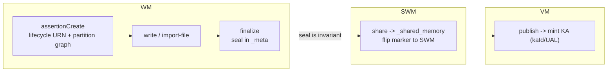
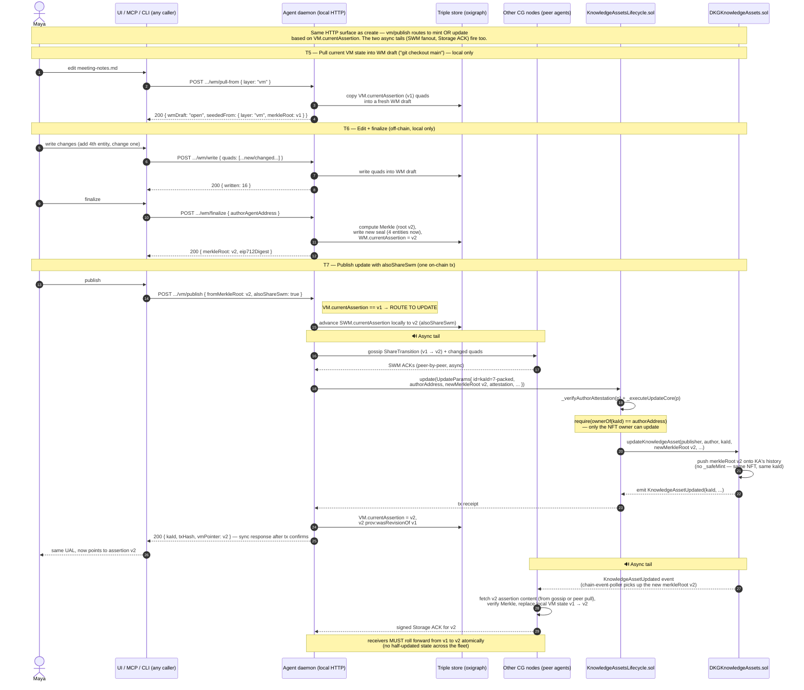

# OT-RFC-43: Deterministic Knowledge Asset identity (file = KA) and the SWM → VM publish model

| Field | Value |
|-------|-------|
| **RFC** | OT-RFC-43 |
| **Title** | Deterministic Knowledge Asset identity (file = KA) and the SWM → VM publish model |
| **Status** | Draft (for discussion) |
| **Created** | 2026-06-03 |
| **Track** | Protocol Core (publish pipeline, on-chain identity, HTTP API) |
| **Packages** | `publisher`, `agent`, `evm-module`, `core`, `cli` (daemon HTTP), `node-ui`, `adapter-openclaw`, `adapter-hermes`, `mcp-dkg` |
| **Related** | [03_PROTOCOL_CORE.md](../03_PROTOCOL_CORE.md), [06_PUBLICATION_PIPELINE.md](../06_PUBLICATION_PIPELINE.md), [07_EVM_MODULE.md](../07_EVM_MODULE.md), [17_NODE_API.md](../17_NODE_API.md), [OT-RFC-42](OT-RFC-42-kc-content-ownership-nft.md), upstream code: [`packages/evm-module/docs/greenfield-ka-ual.md`](https://github.com/OriginTrail/dkg/blob/main/packages/evm-module/docs/greenfield-ka-ual.md) |
| **Spin-off RFCs** | [OT-RFC-44 — File = Knowledge Asset (Design B + publish-guard fix)](OT-RFC-44-file-equals-ka.md) — the urgent, chain-risk-free bug fix, extracted so it can ship without waiting on the identity/API work. [OT-RFC-45 — Update authority is owner-only (ratify + fix contract header)](OT-RFC-45-update-authority-owner-only.md) — the Open #9 docs↔runtime discrepancy, extracted as a docs/decision change that gates the public contract surface. This RFC (43) remains the umbrella for the identity model, the API rationalization, and the Option 1/Option 2 decision. |

The key words "MUST", "MUST NOT", "REQUIRED", "SHALL", "SHALL NOT", "SHOULD", "SHOULD NOT", "RECOMMENDED", "MAY", and "OPTIONAL" in this document are to be interpreted as described in [RFC 2119](https://datatracker.ietf.org/doc/html/rfc2119).

---

## 0. TL;DR

**The problem.** Today the V10 publish pipeline blocks any file containing more than one RDF entity (the `kaCount !== 1` guard in `dkg-publisher.ts`), surfacing as "V10 publish requires exactly one root entity per request." The cause: every consumer treats `autoPartition`'s entity index as a list of KAs, conflating *entity count* with *KA count*. The fix: one file/lifecycle = one KA, however many entities it contains.

**The decisions.** The RFC contains three independent decisions:

| Decision | Recommendation | Reversible? |
|---|---|---|
| **A — Lifecycle model** | **Design B** (decouple entity count from KA count; entities stay as the KA's member entities) | Effectively no — Design A breaks RS proof reconstruction (§3.2 blockquote) |
| **B — Identity assignment** | **Option 1** (deterministic, minter-namespaced, pre-knowable `kaId`/UAL — needs a ~30-line contract change) | Yes — Option 2 ships first, Option 1 lands later with zero rework |
| **C — Sequencing** | Phase 0 (predicate rename) → Phase 1 (Design B + clean API **model**) → Phase 2 (Option 2, optional) → Phase 3 (Option 1 + audit + pre-known-id **addressing**). Phase 1 + Option 2 + RFC-45 sign-off = the v10.0 floor (§11.0); Phase 3 is additive later. | — |

**Two pieces are split out so they can move without this RFC.** The urgent, chain-risk-free bug fix (Design B + the publish guard) is extracted as **[OT-RFC-44](OT-RFC-44-file-equals-ka.md)**, and the contract docs↔runtime authorization discrepancy (Open #9) is extracted as **[OT-RFC-45](OT-RFC-45-update-authority-owner-only.md)**. Both are part of the **v10.0 forward-compatibility floor** (§11.0); RFC-43 remains the umbrella for the identity model, the API rationalization, and the Option 1 vs Option 2 decision. **You do not have to ship all of RFC-43 for v10.0** — §11.0 defines the non-breaking floor and what is safe to defer.

**Recommended reading order.** §0 → §11.0 (what's in v10.0 vs deferred) → §3.0 (Design A vs B) → §4.6 (why Option 1 matters) → §9 (decision framework) → §11.1 (phases). The walkthroughs in §7 and the API in §10.5 are the integrator-facing surface; the sequence diagrams in §7 show the network behavior (gossip + Storage ACK) end to end.

**Conventions used throughout this RFC.**

- **Chain prefix.** Walkthrough examples use `did:dkg:hardhat:31337` (the local devnet chain id every contributor runs against, matching `random-sampling/test/prover.test.ts`). Production environments substitute `did:dkg:base:8453` (Base mainnet) or `did:dkg:base:84532` (Base Sepolia). The *shape* of the URI is what matters; the prefix is environment-dependent.
- **Predicates.** Throughout this document, `dkg:entity` / `dkg:assertionEntity` refer to the **target** state after §10.1's rename of the misleadingly-named legacy `dkg:rootEntity` / `dkg:assertionRootEntity` (which hold graph entities, **not** Merkle roots). Citations of current code use the old name with `(legacy)` marker.
- **Verb.** This RFC uses `share` (not `promote`) for the WM → SWM transition, per the rename in §10.6.

---

## 1. Summary

A Knowledge Asset (KA) should behave like a **file**: a user-chosen set of triples with a single stable NFT identity and a chain of immutable assertion versions (v1, v2, …). Today the V10 publish pipeline breaks that model from the other direction. `autoPartition` still maps every RDF **entity** to its own KA (one manifest entry per entity), and the greenfield publisher then **hard-rejects any publish with more than one entity** — `kaCount !== 1` throws ([dkg-publisher.ts](https://github.com/OriginTrail/dkg/blob/main/packages/publisher/src/dkg-publisher.ts) ~1773), surfaced in the UI as "V10 publish requires exactly one root entity per request" (the "root entity" wording is itself a misnomer; see Terminology). So a logical file with N entities cannot be published as one KA at all: it is either **blocked**, or must be split into **N single-entity KAs** (N transactions, N UALs, N owners). Both outcomes contradict the file=KA model. *(Silently minting N KAs in one shot was the legacy V8/V9 KnowledgeCollection behaviour; V10 replaced it with the one-entity-per-publish guard.)*

This RFC fixes the model so that **one file/lifecycle = one KA**, however many entities it contains and however many assertion versions it accumulates over time. The core move is to **decouple the entity count from the KA count**: a KA may name many entities in its current assertion, but there is still exactly one KA NFT per file. It then proposes two options for *how KA identity is assigned*:

- **Option 1 (deterministic, on-chain): minter-namespaced, pre-knowable `kaId`/UAL.** The agent knows the UAL before it publishes. Requires a small, low-blast-radius change to the greenfield `DKGKnowledgeAssets` contract.
- **Option 2 (off-chain handle): keep the contract as-is, learn `kaId` after the tx, and bind it to a stable off-chain lifecycle handle.** This is the approach currently captured in the `selection_to_single_ka` plan.

Both options share the same file=KA model and the same lifecycle rework; they differ only in identity assignment and where the create-vs-update decision is bound. Section 7 walks both options through a concrete end-to-end user scenario.

### Terminology (read this first)

- **Root** means **Merkle root** — a hash — and nothing else in this document. We never call a graph subject a "root."
- **Entity** is a named graph subject (an IRI that triples are written about), e.g. `ex:ProjectApollo`. An assertion contains **1..N entities**.
- **Assertion** is one immutable, Merkle-rooted **version** of a file's content — identified by its Merkle root (v1, v2, v3…). Each finalize seals one assertion; each update on chain stores a **new** assertion under the same KA. Assertions are the revision history; they are not the KA itself.
- **Knowledge Asset (KA)** is the on-chain, ownable **NFT** (`kaId`/UAL) **plus the collection of assertions** stored under it over time. Think of it like a file: one stable identity (the NFT), many immutable versions (the assertions). **First publish** mints the KA and stores assertion v1; **each update** pushes assertion v2, v3… under the **same** token. One file/lifecycle → one KA, regardless of entity count or how many assertion versions accumulate.
- **Predicate rename (adopted by this RFC).** The current code stores an assertion's entity list under predicates literally named `dkg:rootEntity` / `dkg:assertionRootEntity`. Despite the name, these values are **graph entities, not Merkle roots** — the word "root" here is simply wrong. **This RFC renames them to `dkg:entity` / `dkg:assertionEntity`** via a dual-read migration (§10.1). Citations of current code use the old name and mark it `(legacy)`; everything describing the *target* state uses the new name.

## 2. Motivation — what's broken today

The user-facing trigger is the publish error in §1, but the underlying problems are deeper. Seven distinct issues surfaced during the iteration that produced this RFC. Each one leaves an integrator or contributor with a wrong mental model, and several compound — the misnamed function feeds the wrong design conclusion, which feeds the wrong API shape, which feeds the wrong identity story.

We list them here so the rest of the RFC's structure makes sense. Each subsection points forward to the section that fixes it.

### 2.1 The triggering bug — multi-entity files cannot publish at all

The on-chain greenfield contract mints **exactly one** KA per `createKnowledgeAsset` call (`knowledgeAssetsAmount != 1` reverts; §3.4) — i.e. the contract *already* expects one KA per tx. The off-chain pipeline fights this: `skolemizeByEntity` (today still named `autoPartition`, §2.2) hands publishers a `Map<entity, Quad[]>`, and every consumer reads `kaMap.size` as "the number of KAs" instead of "the number of entities in this one KA's entity list." The V10 publisher then enforces that misreading with `kaCount !== 1` (`dkg-publisher.ts` ~1773), so a file with N entities is unpublishable as one KA — it is either *blocked* or split into N single-entity KAs with N transactions, N UALs, and N owners. Neither matches the file=KA expectation users (and the contract) already hold. **Fix: §3.3 — decouple entity count from KA count; one publish, one mint, any entity count.**

### 2.2 Semantic misnomers — every name in the lifecycle vocabulary lies about what it does

Three names lead every reader (humans and LLMs alike) to the wrong conclusion, then the resulting wrong patches re-entrench the underlying bug:

- **`dkg:rootEntity` / `dkg:assertionRootEntity`** are predicates that hold *graph entities*, **not** Merkle roots. The "root" in the name is a misnomer that makes readers conflate the entity list with the assertion hash — exactly the confusion that produces "but isn't `kaCount` the root count?" patches. **Fix: §10.1 — rename to `dkg:entity` / `dkg:assertionEntity` via dual-read migration.**
- **`autoPartition`** does not partition into KAs. It skolemizes blank nodes and indexes the result by entity (`Map<entity, Quad[]>`). The skolemization is load-bearing for consensus (it produces the canonical subject hashes that drive Merkle, validation Rules 2/3, the SWM gather, and the RS prover); the grouping is just an index. The name suggests the function is the source of multi-KA explosion — it isn't; its *callers* are. Every fresh reader reaches "kill autoPartition" and writes a patch that breaks proof reconstruction. **Fix: §10.4 — rename to `skolemizeByEntity` with a dual-export deprecation; behavior unchanged.**
- **`promote`** (the WM → SWM verb in code and HTTP routes) is something every user-facing surface — UI button copy, MCP tool descriptions, integration docs — already calls **`share`**. The vocabulary mismatch costs every integrator one round-trip of "wait, which one do I call?" **Fix: §10.6 — rename to `share` across API path, side-effect-flag names, data predicates, activity types, and the emitter function name.**

### 2.3 API drift — three URL shapes, two identifier styles, no resource model

The daemon's HTTP surface accumulated three independent shapes that don't share a model (§10.5):

- `POST /api/assertion/:name/create|write|finalize|promote|discard` — assertion-lifecycle verbs, where `:name` is really a *file* handle, not an *assertion* identifier.
- `POST /api/shared-memory/publish` — the publish entrypoint, sitting in a different URL tree, with `assertionName` in the body, and no explicit notion of which layer it acts on (it ends up touching all three).
- `POST /api/shared-memory/write` — a legacy free-form SWM append that predates the named-assertion lifecycle.

The result is that the **resource model is implicit and wrong**. The same logical object (a file/KA in some layer) is addressed two different ways by neighbouring endpoints; the publish endpoint hides which thing it acts on; there is no first-class concept of a *draft* (the mutable working set under construction toward the next assertion) or a *layer pointer* (the per-layer `currentAssertion`). Status codes are inconsistent; partial-failure semantics are undefined. **Fix: §10.5 — three resources (KA / Assertion / Draft), layer in the URL on every write (`wm/write`, `swm/share`, `vm/publish`), atomic-by-default behavior when content is in the body, explicit `207 Multi-Status` for partial-success.**

### 2.4 The identity gap — the UAL exists only after the tx confirms

In the V10 design as it stands, the `kaId` is the on-chain counter's value — handed to the caller only after the publish transaction confirms. That means **for the entire WM and SWM lifecycle the file has no canonical chain identity.** Off-chain code papers over this with a "lifecycle URN" handle, but the existing `lifecycle → kaId` mapping path (`resolveUalByBatchId`, [metadata.ts](https://github.com/OriginTrail/dkg/blob/main/packages/publisher/src/metadata.ts) ~479) keys on a `dkg:batchId` triple that **only the post-publish confirmed-metadata writer emits** (`generateConfirmedMetadata`, ~267) — the share/promote path writes no `dkg:batchId`, so before a publish confirms the lookup resolves nothing and the code falls back to a tentatively-constructed UAL. *(Verified against `main`@`1ae3ffd7`.)* Downstream consequences:

- **No cross-references before publish.** Two co-authors can't reference each other's drafts. A planning task can't link to the KA it will revise. A derivation can't be recorded at the moment of branching.
- **Fragile create-vs-update.** Routing a new publish to `Lifecycle.publish` (mint) vs `Lifecycle.update` (push new merkle) depends on whether the handle is present and correct. A miss writes a new KA with a duplicate name.
- **Pre-publish content commitments are impossible.** Preregistration, embargoes, sealed-bid auctions all require "I commit to publishing exactly this at exactly this address" — the chain has no anchor to enforce until after the publish, which defeats the commitment.

**Fix: §4 (Option 1) — deterministic, minter-namespaced, pre-knowable `kaId`/UAL via a small contract change.** §4.6 enumerates the five product categories this unlocks; §5 (Option 2) is the "ship today, no contract change" interim that doesn't unlock them.

### 2.5 No cross-layer "update" primitive — editing already-shared or already-published content has no clean entry point

The existing lifecycle has `create → write → finalize → share → publish`, but it has **no primitive for "edit something already in SWM or VM."** Users who want to revise a file the team has agreed on (SWM) or a file already on chain (VM) have no clean workflow: they either start a parallel WM draft from scratch and lose the existing content, or they SPARQL-edit the wrong layer directly (which corrupts the assertion boundary). This isn't a hypothetical — it surfaced immediately on the very first multi-entity file we tried to update. **Fix: §10.5.3 — `POST .../wm/pull-from { layer: "swm" | "vm" }` as a first-class verb (the git-checkout equivalent), with `onConflict` semantics for dirty drafts.**

### 2.6 The contract documentation contradicts the runtime — and integrators design from the docs

`KnowledgeAssetsLifecycle.sol`'s NatSpec documents curated-CG updates as **delegating** to `isAuthorizedPublisher` (curator + PCA agents can update any KA in the CG). The live `_executeUpdateCore` (~1324-1326) enforces strict **owner-only** (`ownerOf(kaId) == attestedAuthor`). These are not equivalent, and they determine whether the "team co-owned canonical code graph" pattern from §8 is buildable as-described. An integrator reading the header designs for delegated updates and hits a runtime revert; an integrator reading the code designs for owner-only and is told by docs that PCAs work. Today's operative behaviour is owner-only. **Fix: §8.7 blocking-warning callout — ratify owner-only as canonical, update the contract header, treat PCA-delegated update as a future extension behind an explicit flag. Tracked as Open #9; sign-off required before Phase 1 freezes the public surface.**

### 2.7 Cross-node failure modes hide behind single-node tests

Several invariants on the receiving side of a publish are bound to `kaCount`, and the `kaCount !== 1` guard at the publisher (§2.1) means those invariants have **never been exercised in production with a multi-entity payload**:

- `storage-ack-handler.ts` (~804) asserts `rootSubjects.size === intent.kaCount`. Today this only ever runs with `rootSubjects.size === 1` and `kaCount === 1`. Under Design B the receiver will see *N* subjects with `kaCount === 1`, so `N === 1` fails and **the receiver refuses to ACK**. The publisher gets a confirmed chain tx and zero peer ACKs.
- The same shape applies to the RS proof reconstruction in `ka-extractor.ts`: the leaf-set filter is correct for the single-entity case but has not been verified end-to-end on a multi-entity KA across two nodes.

These are exactly the kind of bugs that pass every single-node test and fail silently in production. **Fix: §11.2 test plan — mandatory multi-node ACK + RS proof tests on a multi-entity file KA, run on a CG that also contains legacy per-entity KAs (proves mixed graphs sample correctly).**

### The agreed mental model that emerges from these fixes

Once the seven items above are addressed, the mental model the RFC argues for — and the one §0 TL;DR opens with — falls out naturally:

- **KA** = on-chain `kaId` with a DID prefix (the UAL) + all assertions ever stored under that token.
- **Assertion** = one immutable version of that KA's content, identified by its Merkle root.
- **Each update creates a new assertion, not a new KA.** The assertion may contain many entities; the **name** is a human label (default = filename).
- **The UAL is the canonical identity from creation, not a post-tx receipt** (under Option 1).

This mirrors a file with a stable identity and a revision history. The rest of the RFC is the work it takes to make the system behave that way.

## 3. Shared model (applies to both options)

### 3.0 Design A vs Design B — the names used throughout this RFC

The file=KA model has two candidate implementations. The RFC compares them once (here), then refers to them by name in §3.2, §3.3, §6, §7, §9, §10, and §11. Read this first.

- **Design A — "Collapse to one anchor."** Replace the N real entities with a single synthetic **anchor entity** (e.g. `urn:dkg:assertion:…/anchor`). The KA's only entity is the anchor; the real graph subjects are demoted to triples *about* the anchor (`<anchor> dkg:contains ex:ProjectApollo`, `<anchor> dkg:contains ex:Alice`, …). One KA, one entity in its `dkg:entity` list, real entities no longer first-class members of the KA.
- **Design B — "Decouple entity count from KA count" (adopted).** Keep the N real entities as **first-class member entities** of the KA. One KA whose `dkg:entity` list has N values — the same entities the seal already enumerates today. No synthetic anchor; entities are unchanged; only the "how many KAs per assertion" decision moves (N → 1).

| | **Design B (adopted)** | Design A (rejected) |
|---|------------------------|---------------------|
| Where the real entities live | First-class members of the one KA (`dkg:entity` list, N values) | Demoted to data triples about a synthetic anchor; not in the KA's entity list |
| What the KA's entity list contains | All N real entities | One synthetic anchor IRI |
| Merkle / gather / proof code paths | **Unchanged** — they already iterate the entity list whether N=1 or N>1 | **Broken** — every real subject falls outside the KA's entity-set filter (`?s = <entity> OR STRSTARTS(?s, "<entity>/.well-known/genid/")`); the RS prover reconstructs an empty leaf set and every proof fails (§3.2 blockquote) |
| Files changed | Only the count/identity guards in §3.3 (~9 files) | Those *plus* `validation.ts`, `workspace-resolution.ts`, `ka-extractor.ts` rewrites |
| Risk | Bookkeeping-only | Consensus-breaking |

> **Wherever this RFC writes "Design B" without qualification, it means: one file/lifecycle = one KA whose member entities are all the entities in the current assertion, with the entities written under `dkg:entity` (renamed in §10.1) and the Merkle root computed exactly as it is today.** The deeper "why not Design A" analysis lives in §9 Decision A and the blockquote at the end of §3.2.

### 3.1 The lifecycle and its single leverage point



- **The Merkle is already single; the KA count is the only thing that's wrong.** `finalize` ([packages/agent/src/dkg-agent.ts](https://github.com/OriginTrail/dkg/blob/main/packages/agent/src/dkg-agent.ts) ~9317-9552) runs `autoPartition(quads)`, records the assertion's entity list (today `rootEntities = [...kaMap.keys()]` — a misnamed variable; these are entities), and computes **one flat Merkle over all skolemized quads** (`computeFlatKCRoot`, ~9343). So the version hash already covers the whole set in one shot. The defect is purely downstream: the multi-valued entity list is turned into one manifest entry (one KA) per entity, and the publisher's `kaCount !== 1` guard then demands exactly one — so multi-entity files can't publish as one KA. **The fix is to keep the entity list as-is and bind it to a single KA** — decouple the entity count from the KA count. No "anchor entity" replaces the real entities; they stay first-class.
- **The seal is the lifecycle invariant.** The "seal" is a small block of `_meta` quads written at finalize ([packages/core/src/assertion-seal.ts](https://github.com/OriginTrail/dkg/blob/main/packages/core/src/assertion-seal.ts), `buildAssertionSealQuads`) that commits the assertion's content: `assertionMerkleRoot` (the flat Merkle over the quads = the version id), the EIP-712 author signature (`authorAddress` + `authorAttestationR`/`VS`), the chain/contract binding (`assertedAtChainId`/`assertedAtKav10Address`), and the assertion's **entity list** (stored today under the misleadingly-named `dkg:assertionRootEntity`, renamed to `dkg:assertionEntity` by §10.1 — these are graph entities used to scope the SWM load, not Merkle roots). Per assertion-seal.ts it "MUST NOT be re-derived at publish-time ... shape doesn't change as the assertion moves WM -> SWM -> VM": publish reads it, sanity-checks against the quads, and forwards the pre-computed `(merkleRoot, signature, authorAddress)` to the chain verbatim. **This RFC does not change the seal's entity list** — it keeps all N entities; it only changes how many KAs they resolve to (N → 1). The seal is computed and attached once at finalize; share/publish inherit it unchanged.
- **The lifecycle URN is the stable cross-layer key:** `urn:dkg:assertion:<cg>:[<sg>:]<agent>:<name>` ([packages/core/src/constants.ts](https://github.com/OriginTrail/dkg/blob/main/packages/core/src/constants.ts) ~223). It is the assertion's handle across WM/SWM/VM (not an entity, not a root — a name key). The on-chain `kaId`/UAL is assigned at publish (Option 2) or pre-known at finalize (Option 1).

### 3.2 The three lifecycle complexities (common to both options)

- **A - `autoPartition` maps each entity to its own KA, and the V10 publisher then rejects any assertion with more than one entity** (`kaCount = manifestEntries.length`, and `kaCount !== 1` throws — [dkg-publisher.ts](https://github.com/OriginTrail/dkg/blob/main/packages/publisher/src/dkg-publisher.ts) ~1773). So a file with N entities is unpublishable as one KA: it is forced into N single-entity KAs or blocked outright. Fix: **decouple the entity count from the KA count.** One **file/lifecycle** maps to one KA whose **member entities** are all the entities in the current assertion (all `dkg:partOf` the one KA / one UAL). The entities stay first-class graph entities — they are *not* replaced by a synthetic anchor and they remain the scoping key for the assertion's triples. Only the "how many KAs per file" decision changes (N → 1); assertion versioning (v1 → v2 → … under the same token) is unchanged.
- **B - share (WM → SWM) flattens the assertion boundary** into one `_shared_memory` graph ([packages/publisher/src/dkg-publisher.ts](https://github.com/OriginTrail/dkg/blob/main/packages/publisher/src/dkg-publisher.ts) ~4081-4312). Because the assertion already enumerates its member entities (the seal's entity list, plus the per-entity `ShareTransition` records in `_shared_memory_meta`), the boundary is recoverable: a selection = the set of entities bound to one file/lifecycle (which will become one KA at publish). No new load-bearing predicate is required; an optional `dkg:member` denormalization can make the rescope query cheaper, but it duplicates information the entity list already carries.
- **C - there is no reliable lifecycle-URN -> kaId mapping before publish.** The lookup (`resolveUalByBatchId`, [packages/publisher/src/metadata.ts](https://github.com/OriginTrail/dkg/blob/main/packages/publisher/src/metadata.ts) ~479) keys on a `dkg:batchId` triple emitted **only** by post-publish `generateConfirmedMetadata` (~267); the share/promote metadata writers emit no `dkg:batchId`, so pre-publish the lookup returns nothing and the publisher falls back to a tentatively-constructed UAL. **This is the complexity the two options resolve differently** (see below).

> **Why this framing matters (Design B, not "collapse to one anchor").** Three consensus-adjacent code paths scope an assertion's triples by its entity set — `?entity` is either a listed entity or a skolemized child of one: publish-time `validation.ts` (Rules 2/3), the SWM payload gather in `workspace-resolution.ts` (`?s = <entity> || STRSTARTS(?s, "<entity>/.well-known/genid/")`), and the random-sampling proof reconstruction in `ka-extractor.ts` (same filter, looped over the KA's entities). If we instead replaced the entities with a single synthetic "anchor" entity, every real subject would fail those filters → publish validation rejects the data, the SWM gather returns nothing, and the **RS prover reconstructs an empty leaf set and every proof fails** (leaf-count mismatch). Keeping the entities as the KA's member entities means the Merkle/gather/proof machinery is **unchanged**; the only things that move are the count-equality guards (see §3.3).

### 3.3 Sites that conflate entity-count with KA-count (must change together)

Because the change is "N entities, 1 KA," every place that currently assumes *entities == KAs* must be updated in lockstep. None of these touch the Merkle leaf computation; they are all count/identity bookkeeping:

> **`autoPartition` is not the bug — its callers are.** The function ([packages/publisher/src/auto-partition.ts](https://github.com/OriginTrail/dkg/blob/main/packages/publisher/src/auto-partition.ts)) does two things: (1) **skolemize** blank nodes under their parent entity (`<entity>/.well-known/genid/N`) and (2) **group** the resulting skolemized quads by entity into a `Map<entity, Quad[]>`. The skolemization is **load-bearing for consensus** — it produces the canonical subject hashes that drive `computeFlatKCRoot`, `validation.ts` Rules 2/3, the SWM gather, and the RS prover's filter (`?s = <entity> OR STRSTARTS(?s, "<entity>/.well-known/genid/")`). The grouping is **just an index**; the Merkle root concatenates `[...kaMap.values()].flat()` before hashing, so the grouping cannot affect the hash. The defect is that every consumer treats `kaMap.size` as "the number of KAs" instead of "the number of entities in this one KA's entity list." Under Design B the function is **unchanged**; only the consumers in the table below change. The function is misnamed (it does not partition into KAs — it skolemizes and indexes by entity); a follow-up rename is captured in §10.4.

| Site | Today's assumption | Change |
|------|--------------------|--------|
| `dkg-publisher.ts` / publish guard | "exactly one entity per publish" (`kaCount !== 1` / single-entity guard) | one **assertion** per publish; `kaCount = 1` with any number of entities |
| `validation.ts` Rules 2/3 | each entity is its own manifest entry / own KA | entities are members of one KA; rules validate "subject ∈ assertion's entity set or skolem child" — same check, one manifest entry |
| `storage-ack-handler.ts` (~804) | `rootSubjects.size === intent.kaCount` (receiving nodes refuse to ACK otherwise) | decouple: `kaCount = 1`; entity count is independent and not asserted equal |
| `ka-extractor.ts` (RS) | loops entities, each its own KA under the UAL | unchanged loop, but all entities resolve under **one** `kaId`/UAL |
| `metadata.ts` `generateKCMetadata` | emits one KA node per entity | emits one KA node; entities are its `dkg:entity` (renamed from `dkg:rootEntity`, §10.1) members |

### 3.4 Greenfield contract context (why Option 1 is cheap)

The active contract is the greenfield `DKGKnowledgeAssets` (ERC-721, `kaId == tokenId`), not the legacy `KnowledgeCollectionStorage`:

- `createKnowledgeAsset` mints exactly one token (`knowledgeAssetsAmount != 1` reverts) via `++_knowledgeAssetsCounter` then `_safeMint(author, kaId)` ([packages/evm-module/contracts/storage/DKGKnowledgeAssets.sol](https://github.com/OriginTrail/dkg/blob/main/packages/evm-module/contracts/storage/DKGKnowledgeAssets.sol) ~190-220).
- Identity is trivial: `getKnowledgeAssetId(tokenId) -> tokenId`, `isPartOfKnowledgeAsset(id, tokenId) -> id == tokenId`. **No positional slab math** (the legacy `(id-1)*MAX_SIZE` is gone).
- Random sampling selects a KA by **index into a per-CG list** (`getContextGraphKCAt`, `getContextGraphKCCount`), not by guessing a dense id ([packages/evm-module/contracts/RandomSampling.sol](https://github.com/OriginTrail/dkg/blob/main/packages/evm-module/contracts/RandomSampling.sol) ~565-590). So `kaId` values may be sparse without affecting sampling hit-rate.
- `getLatestKnowledgeAssetId()` is used only by off-chain snapshot/debug scripts, never in consensus or node runtime.
- Greenfield mints **one token per `createKnowledgeAsset`** at the contract - which *is* the file=KA shape. The thing fighting it is purely off-chain: callers read `autoPartition`'s entity-keyed map as a list of KAs (one manifest entry per entity), and the `kaCount !== 1` guard then forbids a multi-entity publish. The fix changes the readers (and the misleading function name, §10.4) — not the skolemization. The chain already wants exactly one KA per tx.

## 4. Option 1 - Deterministic, minter-namespaced, pre-knowable kaId/UAL

### 4.1 Idea

Let the **minter assign the `kaId`**, namespaced by its own address, so the UAL is known before the publish tx. ERC-721 `_safeMint` accepts any unique `uint256` and reverts on collision, so uniqueness is enforced by the contract.

Two implementation variants:

- **1a - Packed id (single id, two renderings; zero extra storage).** `kaId = (uint160(minter) << 96) | uint96(number)`. Then `did:dkg:<chain>/<DKGKnowledgeAssets>/<kaId>` and `did:dkg:<chain>/<minter>/<number>` are the **same id parsed two ways** - no mapping needed.
- **1b - Dense id + alias mapping.** Keep `++counter` as the canonical `tokenId`, and add `keccak256(minter, number) -> tokenId` (+ reverse). Preserves a dense sequential `tokenId` for external tooling, at the cost of two SSTOREs and a post-tx canonical id.

> **Tooling impact of the packed id (1a), and the recommendation.** A packed `kaId` is a non-sequential `uint256`, which breaks any consumer that assumes dense, incrementing token ids — sequential block explorers, `ERC721Enumerable.tokenByIndex`, and some NFT marketplaces. Two facts make this manageable: (i) **`DKGKnowledgeAssets` is plain `ERC721`, not `ERC721Enumerable`** (verified — it inherits `ERC721`, not the enumerable extension), so on-chain index enumeration is *not* a feature today; off-chain indexers already enumerate via `KnowledgeAssetCreated` events, which behave identically under sparse ids. (ii) **Random sampling selects by index into a per-CG list** (`getContextGraphKCAt`, verified §3.4), not by guessing a dense id, so consensus hit-rate is unaffected by sparsity. The residual cost is purely external presentation. **Recommendation: adopt 1a, and keep the contract-authority rendering (`…/<contract>/<packedKaId>`) as the canonical UAL explorers resolve, with `…/<minter>/<number>` as the human/provenance form (Open #1, #2).** Choose 1b only if a dense sequential `tokenId` is a hard external-tooling requirement — it buys that at two SSTOREs per mint plus a post-tx canonical id (which reintroduces a sliver of Complexity C). The decision stays open (Open #1); the default lean is 1a.

### 4.2 Contract change

- `createKnowledgeAsset` accepts a caller-supplied id (1a) or `(minter, number)` alias (1b); replace `++_knowledgeAssetsCounter` accordingly (1a) or keep it and add the alias maps (1b).
- Uniqueness is **per-minter** by construction: the minter's address namespaces the id, so no cross-agent collision and no front-running. An accidental reuse of `(minter, number)` makes `_safeMint` **revert loudly** - never a silent clobber.
- `getLatestKnowledgeAssetId()` becomes meaningless under 1a; migrate the off-chain snapshot/debug scripts to enumerate via `KnowledgeAssetCreated` events or per-CG lists.
- **Known extension point (not v1).** An additional `(minter, bytes32 name) → number` alias-slot table is the natural landing site for the human-memorable handle capability in §4.6 (e.g. `did:dkg:.../alice/meeting-notes` resolves to `(0xalice, 7)`). It is **not** required for Option 1 v1 — the contract change in §4.1/§4.2 enables the other four §4.6 capabilities on its own — but wallet-namespacing makes adding it later a self-contained follow-on, not a refactor.

### 4.3 How it resolves the lifecycle

- Complexity C **disappears**: the UAL is a pure function of `(minter, number)` known at finalize, so we stamp it on the lifecycle entity from the start and it rides WM -> SWM -> VM unchanged. No fragile post-publish mapping.
- **Create vs update** is explicit and chain-enforced: publishing a new `(minter, number)` mints; updating reuses the same `kaId` via `updateKnowledgeAsset` (the contract already supports a new merkle root under the same id).
- **Accidental same-name** is a non-issue: the chain rejects a duplicate `(minter, number)`; identity is the id, the name is a label.

### 4.4 Costs / risks

- **Consensus-touching contract change** (audit, redeploy, version bump, author-attestation interplay in `KnowledgeAssetsLifecycle`). Scope the audit honestly: it is *not* "review 30 new lines." `KnowledgeAssetsLifecycle.sol`'s own authorization NatSpec is **already out of sync with its runtime** — the header documents a policy-branch update gate that delegates to `isAuthorizedPublisher`, while `_executeUpdateCore` enforces strict owner-only (Open #9 / [OT-RFC-45](OT-RFC-45-update-authority-owner-only.md)). An auditor must reconcile docs↔code across the existing authorization surface, not just the diff, so budget for that. Resolving Open #9 *before* the contract change is a prerequisite, not a parallel task.
- **UAL shape:** if both renderings are first-class UALs, external resolvers/indexers/explorers must learn the minter-authority form. Lower-risk start: keep the contract-authority UAL canonical, treat the minter form as a trustless lookup, promote later. (Variant 1a's packed `kaId` is also a non-sequential `uint256`, which interacts with ERC-721 tooling — see §4.1 and Open #1.)
- **Key rotation is largely a non-issue — the minter prefix is a *creation* namespace, not a *live-authority* claim.** The address embedded in the UAL is fixed at mint and **never re-validated afterward**: the contract checks `(kaId >> 96) == msg.sender` only at create, and `_safeMint(author, kaId)` mints to the author. Ownership is a standard, transferable ERC-721 position — `DKGKnowledgeAssets` adds **no soulbinding** (verified, no `_update`/`transferFrom` override) — and **update authority follows the current owner, not the minter**: `_executeUpdateCore` requires `ownerOf(kaId) == attestedAuthor` ([KnowledgeAssetsLifecycle.sol](https://github.com/OriginTrail/dkg/blob/main/packages/evm-module/contracts/KnowledgeAssetsLifecycle.sol) ~1324). So for any *existing* KA, rotating who-can-update is just an NFT **transfer** to a new key (or a Safe) — available today, no contract change, no delegation. The author/owner may be a smart account from the start: EOAs, **EIP-1271** contract accounts (Gnosis Safe), and **EIP-7702**-delegated EOAs are all accepted (the `authorAddress.code.length` branch, verified ~961). The recommended pattern for a durable identity is therefore to **mint under a smart-account namespace** — the Safe's address is the stable prefix in every UAL while its signer set rotates underneath. The *only* residual gap is minting **new** KAs under a prefix whose key is lost (you can no longer sign as that minter); even that is bounded — start a fresh namespace, or use the Phase-4 alias table (§4.2 / §11.1) as a handle→namespace indirection so a memorable name can be re-pointed to a new prefix. Net: §4.6's wallet-as-profile is rotation-safe when the namespace wallet is a smart account; a raw-EOA namespace trades that for simplicity.

### 4.5 The durable per-agent number allocator

Option 1 lets the agent *choose* `number`, which moves the uniqueness problem on-chain → off-chain: **the agent must never reuse a `number` it has already committed to**, even across a week-long WM→SWM gap, a crash, a restore-from-backup, or two of its own devices racing. In practice this is a small, well-bounded piece of code — not a subsystem — because every recovery oracle the daemon needs already exists.

Concrete shape (an evening's work, not a project):

- **One namespace per agent key, never per node.** 1 agent = 1 key = 1 number space (§7's rule). A node hosting many agents keeps a separate counter per agent address. Two agents never share a key, so they never contend for the same `(minter, number)`.
- **One SQLite row per agent.** A `ka_numbers(agent_address PRIMARY KEY, next_number INTEGER NOT NULL)` row in the daemon's existing state DB. Allocation is a single transaction: `UPDATE ka_numbers SET next_number = next_number + 1 RETURNING next_number - 1`. WAL-mode SQLite gives ACID for free, so the row is durable before the UAL is returned to the UI — a crash between "show UAL" and "publish" cannot re-hand the same number. The RFC §7 T0 step *already* stamps `dkg:reservedUal`/`dkg:kaId` on the lifecycle URN in the triple store, which is a second independent record of the reservation.
- **Monotonic only — never reclaim.** `uint96` allows ~8×10²⁸ numbers per agent (2⁹⁶ slots). An absurdly busy single agent — 1000 drafts/sec for a million years — would burn ~2⁵⁵ numbers, leaving a 2⁴¹× multiplier of headroom. So the allocator is a strict monotonic counter with **no reclaim path of any kind** — not for discarded drafts, not for failed finalizes, not for reverted publishes. A burned number is cosmetic, never a correctness issue, and removing reclaim removes a whole class of double-allocation race. To keep waste low without reintroducing reclaim, the daemon **allocates only after request validation passes** (so malformed `POST /api/knowledge-assets` calls — bad quads, bad signature, wrong CG — never consume a number; see the §10.5.5 partial-failure table); anything that fails *after* allocation simply leaves a gap. This is the single rule that makes §10.5.5's "no reclaim" status table consistent with this section.
- **Reconciliation on startup (existing oracles, no new infrastructure).** Set `nextNumber = max(local, chainMaxForThisMinter, tripleStoreMaxForThisMinter) + 1`:
  - *Chain oracle*: enumerate `KnowledgeAssetCreated` events filtered by `minter == self` via the chain event poller the daemon already runs.
  - *Triple-store oracle*: `SELECT MAX(?n) WHERE { ?s dkg:kaId ?n FILTER(STR(?s) starts with this agent's lifecycle prefix) }` — covers reserved-but-not-yet-minted drafts the chain doesn't know about.
  - This makes restore-from-stale-backup safe by construction: whichever oracle has a later number wins. If both oracles are unreachable (cold start, no network), the daemon refuses to allocate new numbers until at least one returns — a single "allocator is reconciling" UX state.
- **Multi-device single-writer discipline (rule, not code).** Two daemons running the same key will eventually pick the same `number`; the contract's `_safeMint` reverts the loser. This costs at most one failed tx (gas), never a silent clobber. Document "one active device per agent key" and stop there; a coordination lease across devices is overkill for v1.

**Engineering cost, honestly:** one table, one write per draft, one startup query, one documented rule. Option 2's "the chain is the allocator" advantage is real but small — Option 2 still needs **off-chain handle bookkeeping** (`dkg:publishedAs`/`dkg:kaId` writeback, create-vs-update decision keyed off the handle) that has to stay consistent across nodes and survive the same crash/restore/restore-from-backup cases. The allocator is *not* a meaningful argument against Option 1.

### 4.6 What this unlocks (capabilities only Option 1 enables)

The chain change buys more than "we skip the post-tx handle write." It changes what a UAL *is*. Five properties hold for a wallet-namespaced UAL that do not hold for a URN — and they collapse to one root cause.

| Property | UAL (Option 1) | URN |
|---|---|---|
| Provenance-first (minter visible from the URI) | Yes | No — agent string is unverified text |
| Globally unique | Yes — chain refuses duplicate `(minter, n)` | No — any vault can write any URN string |
| Unforgeable | Yes — only the minter's wallet can mint under their prefix | No — anyone can write any URN |
| Dereferenceable | Yes — UAL → contract → owner, current root, history | Partial — vault-local; requires knowing the vault |
| Pre-knowable as a *binding* commitment | Yes — chain enforces the binding when published | No — URN is a string the author writes, but nothing on chain binds it to the eventual publish |

The single root cause is **chain-enforced authority**: only the wallet whose address is in the prefix can ever mint under it, and only one `(minter, number)` pair can exist. Global uniqueness, unforgeability, and provenance-first all follow mechanically from that one rule; dereferenceability and pre-knowability are direct consequences of putting the id on chain. URN has no authority layer, which is why none of these properties hold for it — *you can mint any random URN string you like in your own vault, but you cannot mint a UAL you do not have authority for.*

What this produces in practice: **the UAL stops being a *receipt* a user gets after publishing and becomes a *name* a user can commit to, reference, alias, and route through before publishing.** Three of the five capabilities below (pre-publish commitments, forward references, derivation graphs) are direct consequences of this receipt → name flip and are **live in v1**; one (wallet-as-profile) is a consequence of *whose* name it is and is also **live in v1**; one (human-memorable handles) requires a small **follow-on** contract change on top of v1 (the alias-slot table from §4.2). Section §4.6's table below marks each capability as **v1** or **v1.x** so the framing is honest about what ships when.

> **Today's opaque UAL (`did:dkg:hardhat/<contractAddr>/<n>`) already has weaker analogues of three properties** — unique-by-counter, unforgeable-once-minted, dereferenceable-via-contract — because the chain assigns and stores the id. What Option 1 specifically adds: (a) the *minter* in the prefix — which upgrades "unforgeable" from "no one can re-mint this id" to "no one can mint *under this prefix* at all," (b) provenance visible in the URI itself, and (c) *pre-knowability* — the agent computes the UAL before the tx. Those additions are what take the UAL from "a receipt the chain hands me" to "a name I can use." Everything in §4.6 is downstream of that flip.

> **What v1 actually puts in front of users.** Option 1 v1 gives an Obsidian/Cursor/social user a UAL like `did:dkg:base:8453/0x9f3b…a21c/7` — *pre-knowable* (available from T0), *unforgeable* (only Maya's wallet can mint under her prefix), *globally unique* (chain-enforced), *dereferenceable* (UAL → contract → owner/root/history). What it does **not** give them in v1 is *memorability*: the 42-character address is still in the URI, and the agent number (`7`) is a counter, not a name. The four product categories below labelled **v1** unlock with the contract change in §4.2 alone. The fifth (human-memorable handles) needs a small additional alias-slot contract follow-on — *enabled by* the same wallet-namespacing v1 introduces, but not part of v1 itself. Treat v1 as "wallets are now identities; pretty names come in v1.x."

Five capabilities follow — each a category of product the DKG cannot host today without either Option 1 or every integration reinventing it locally. This is the case for Option 1 that matters: not "slightly nicer linking," but **what becomes buildable.**

#### Human-memorable, user-owned identities — **v1.x (alias-slot follow-on)**

"Paste this 80-character DID into Slack" is the single biggest UX barrier to consumer adoption of decentralized-content protocols. Twitter scaled because `@handle` is memorable; ENS scaled because `vitalik.eth` is. Wallet-namespaced UALs let the DKG do the same — `did:dkg:base/branarakic/meeting-notes` instead of `did:dkg:base/0x9f3b…a21c/7`, owned by the user, enforced by the chain. The difference between "looks technical" and "feels like sharing a tweet" is the difference between a B2B integration product and a consumer protocol. *(Mechanism — **and an honest scope note**: this capability requires a **follow-on** contract change on top of Option 1 v1 — an `(minter, bytes32 name) → number` alias-slot table; **not** part of the v1 contract change in §4.1/§4.2 (which only enables the minter-namespaced *numeric* UAL `…/<wallet>/<number>`). Wallet-namespacing in v1 makes the alias table a self-contained ~50-line follow-on; the alias work is captured in §4.2 as a known extension point, and a Phase 4 placeholder is listed in §11.1.)*

#### Pre-publish content commitments — provable promises — **v1**

Academic preregistration, journalism embargoes, legal contracts, regulatory disclosures, sealed-bid auctions, prediction markets — all categories worth billions of dollars, all built on "I commit to publishing exactly this, at exactly this address, by this date." Today the DKG can resolve what's already there but cannot **bind** to what *will* be there. A deterministic UAL plus an EIP-712 commitment signed at finalize creates a publishable promise: anyone reading it has cryptographic proof that only the signer can mint that UAL and the eventual content hash will match. This is a new product category, not a UX upgrade. URN has no chain-level uniqueness or ownership to enforce, so the same commitment over a URN is just a claim. *(Mechanism: sign `{ual, contentHash, deadline}` at finalize; gossip via chat or post on chain. No additional contract work beyond v1.)*

#### Forward references across independent authors — **v1**

Cross-author work today requires synchronization: you can only cite something that already exists. With pre-known UALs, two co-authors can each reference *the other's not-yet-published draft* and publish independently when ready — the references resolve as soon as both KAs exist. The same shape unlocks distributed wikis, journalist-source workflows, and multi-agent AI pipelines where agent A consumes agent B's output without either gating the other. Decentralized graphs are supposed to be authority-free; today they can only contain *backward* references. URN cannot deliver this because there's no chain-enforced way to know the URN you're writing is one the author actually intends to publish. *(Mechanism: agents share `(minter, number)` ahead of publish; the chain enforces the binding when the tx lands. No additional contract work beyond v1.)*

#### Wallet-as-profile — DKG as content network, not just database — **v1**

Today the DKG is positioned as B2B knowledge infrastructure. The wallet-rooted UAL prefix `did:dkg:base/<wallet>/*` is the same shape as a Bluesky DID or a Farcaster `fid`: your wallet is your identity, your KAs are your posts, the prefix is your profile. Apps can render "everything Alice published" by enumerating her minter address — vault-independent, CG-independent, portable across the entire network. This is the move that puts DKG in the same product category as decentralized social protocols, expanding the addressable market by orders of magnitude. URN can't deliver it because URN is CG-keyed: an author in three CGs has three disjoint namespaces and no portable identity. *(Mechanism: existing `KnowledgeAssetCreated` events, filtered by minter — no new infrastructure beyond v1.)*

> **Profile = "created by", not "currently owned by" — and that is the right semantic.** The minter prefix is stamped at mint and is immutable; current ownership is a separate, transferable ERC-721 position (§4.4). Enumerating `…/<wallet>/*` therefore answers *"what did this identity author"* — a permanent provenance/authorship view that survives the NFT later being transferred or sold. An "owned by Alice **now**" view is a different (also useful) query answered by `ownerOf`/`Transfer` events, not by the prefix. Keep the two distinct in UI copy: the prefix is a byline, not a deed.

#### Verifiable derivation graphs — Git/Wikipedia for content — **v1**

Wikipedia branching, scientific replication studies, alternate-history wikis, AI training-data lineage, contract amendments, song remixes — anywhere "this is descended from that" is the central relationship. Pre-known UALs let a forker pre-announce `<forkUal> prov:wasDerivedFrom <originalUal>` *before* either is published, making the derivation chain provable at the moment of branching rather than patched in after the fact. URN-based forking is fragile — renames and CG moves break the chain. Opaque rename-proof UALs make derivation graphs a first-class on-chain artefact. *(Mechanism: write `prov:wasDerivedFrom` triples referencing pre-known UALs; both KAs publish independently. No additional contract work beyond v1.)*

> **Why this matters for Decision B.** If any one of these five is a product priority, Option 2 cannot deliver it — every integration would have to either reinvent Option 1's allocator locally or live without the capability. If none of them are priorities and the DKG's role is "resolve and verify already-published content," Option 2's value gap is small. The decision turns on whether the DKG should be a publish-and-resolve system or a **content-namespace platform**.

## 5. Option 2 - Off-chain lifecycle handle (no contract change)

This is the approach in the `selection_to_single_ka` plan.

### 5.1 Idea

Keep `DKGKnowledgeAssets` as-is (dense `++counter`, `kaId` learned after the tx). Anchor identity off-chain on the **lifecycle URN** and bind it to the minted `kaId` once the tx confirms.

- **Anchor = name URN** reusing `assertionLifecycleUri` shape `urn:dkg:assertion:<cg>:[<sg>:]<agent>:<name>`; `<name>` defaults to filename or "Save As".
- After a confirmed publish, write a durable handle on the lifecycle subject: `<lifecycleUrn> dkg:publishedAs <UAL> ; dkg:kaId N` (resolves Complexity C off-chain).
- **Create vs update** is decided by whether the lifecycle URN already carries a handle (provenance), **not** by the name string. Accidental duplicate name -> new `kaId` with a duplicate label (cosmetic, renamable), never a silent clobber.
- Versioning is recorded off-chain via `dkg:currentAssertion` + a `prov:wasRevisionOf` chain.

### 5.2 How it resolves the lifecycle

- Same decouple-entity-count-from-KA-count (A) and assertion-boundary (B) fixes.
- Complexity C is resolved by the post-publish handle write rather than by determinism. This is correct but **eventual** (the handle exists only after the tx confirms), and relies on off-chain bookkeeping for the create-vs-update decision.

### 5.3 Costs / risks

- No contract change, no audit, ships on the current chain - fastest path.
- The lifecycle -> kaId binding is off-chain state that must be written reliably and kept consistent across nodes (replication, retries, reorgs).
- The pretty UAL is never pre-knowable; cross-references between not-yet-published KAs are not possible.
- Update routing depends on the off-chain handle being present and trusted, rather than on a chain-enforced namespace.

## 6. Comparison

Both options sit **on top of a shared baseline** that ships regardless of which one you pick (Design B + the two renames). Estimating the options on their own would be misleading — the baseline is roughly half the work — so the table separates baseline from each option's *incremental* cost.

### 6.1 Shared baseline (required for either option)

| Strand | Files (rough) | Active dev | Notes |
|--------|---------------|------------|-------|
| **Design B (file = KA)** — §3.3 guard/manifest changes | ~9 files (`dkg-publisher.ts`, `validation.ts`, `storage-ack-handler.ts`, `metadata.ts`, `ka-extractor.ts`, `canonical-publish-payload.ts`, `update-handler.ts`, `publish-handler.ts`, `dkg-agent-publish.ts`) + tests | **~1 week** | The only risk-bearing one — cross-node ACK + RS proof on multi-entity KA must pass (§11.2). |
| **Predicate rename §10.1** (`dkg:rootEntity` → `dkg:entity`) | ~10 files (5 emitters, 4 consumers, +SPARQL) + tests | **~3 days** | Dual-read/write — fleet ordering matters, but mechanical. |
| **Function rename §10.4** (`autoPartition` → `skolemizeByEntity`) | 1 module + ~30 mechanical import sites | **~1 day + cleanup as touched** | Pure rename, no behaviour change. |
| Baseline total | **~19 files + tests** | **~1.5–2 weeks** | This is what ships in Phase 0 + Phase 1. |

### 6.2 Incremental cost of each option (on top of baseline)

| Dimension | **Option 1** (deterministic on-chain id) | **Option 2** (off-chain handle) |
|---|---|---|
| **Implementation complexity** | **Medium.** One small contract change + a per-agent SQLite allocator + a few chain-integration touches. Conceptually clean (the id is a pure function of `(minter, number)`); the work is spread across thin layers. | **Small.** All off-chain: write the handle after the tx confirms, key create-vs-update off the handle, add two metadata predicates. |
| **Files edited (incremental)** | **~12–15 files + 1 contract.** Contract: `DKGKnowledgeAssets.sol` (~30 lines). Off-chain: allocator module + SQLite migration (2–3 new files); `dkg-publisher.ts` (emit pre-known id), `evm-adapter.ts` (pass id through), `dkg-agent-publish.ts` (stamp `dkg:reservedUal` at T0), lifecycle/metadata helpers, `page-fetch.ts` + `evm-adapter.ts` (decouple `batchId` ≠ `kaId`), `~3–5` snapshot/debug scripts (`getLatestKnowledgeAssetId` → events), plus the full-precision `kaId` audit (greppable). | **~5–7 files.** `dkg-publisher.ts` (post-tx handle writeback), `update-handler.ts` (create-vs-update keyed on handle), `metadata.ts` (new `dkg:publishedAs`/`dkg:kaId`/`dkg:currentAssertion`/`prov:wasRevisionOf` emit), lifecycle resolver helper, UI "pending vs published" state, tests. |
| **Active dev time** | **~2 weeks.** Contract + tests (1–2d), allocator + reconciliation (2–3d), `batchId`/`kaId` decouple (1–2d), full-precision audit + fix (1–2d), lifecycle stamping + adapter (1d), multi-node integration tests (2–3d). | **~1 week.** Handle writeback (1d), create-vs-update refactor (1–2d), new predicates + provenance chain (0.5d), cross-node propagation test on existing gossip (1–2d), UI states (1–2d). |
| **Calendar to ship** | **~4–6 weeks if a boutique auditor is queued and ready; ~8–12 weeks otherwise.** Audit is the long pole and the dominant uncertainty: a 30-line surgical change can be turned around in 2–4 weeks of active audit time, but queue + back-and-forth typically adds 2–4 weeks on top, and a larger firm can take 4–8 weeks queue-in-queue-out. Add ~1 week for redeploy + coordination after sign-off. Active dev (~2 weeks) fits inside the audit window either way. **Commit to a release date only after the auditor is contracted.** | **~1–2 weeks.** No external dependency. |
| **Agent UX** | **Best.** The UAL exists from T0. An agent can cite, link, message, or pre-commit to the UAL anywhere in WM/SWM — "this draft is at `did:dkg:hardhat:31337/0x9f3b…/7`" works *before* the tx, and the very same string still works after publish. One identifier across the entire lifecycle. Cross-agent collaboration ("I'll reference your KA `…/7` in mine") works pre-publish. | **Good, with one indirection.** Until publish, the only stable handle is the lifecycle URN (`urn:dkg:assertion:…`). Agents that already use lifecycle URNs feel nothing; agents that want to cite the chain identity must wait for the post-publish handle write or carry a "URN → UAL" lookup. Two-step workflow if anything publishes-then-references its own UAL. |
| **Operational complexity at runtime** | **Small but real.** §4.5: one SQLite row per agent, one durable write per draft, one startup reconciliation against chain events + triple store. One documented "one active device per key" rule. | **Small but real.** Off-chain handle must be written reliably post-tx and propagate across nodes (rides existing `_meta` gossip). Recovery cases mirror Option 1's: rescan chain events + triple store. **Comparable size to Option 1's allocator** — this "advantage" largely cancels (see §9 Decision B). |
| **Pre-knowable UAL** | **Yes.** Pure function of `(minter, number)`. | **No.** Learned only post-confirmation. |
| **Cross-KA references before publish** | **Yes.** First-class. | **No.** Must use lifecycle URN as proxy; rewrite UAL references after each publish. |
| **Capabilities enabled (see §4.6)** | **All five categories** — human-memorable handles, pre-publish content commitments, forward references across independent authors, wallet-as-profile, verifiable derivation graphs. Each is a product category the DKG cannot host on Option 2 alone. | **None of the five.** The post-tx handle is a routing aid; it does not unlock new product categories. Integrations that want any of the five must wait for Option 1 or reinvent it locally. |
| **Contract change / audit / redeploy** | **Required.** ~30 lines changed; greenfield surface is small but audit is non-negotiable. | **None.** |
| **External resolver / explorer impact** | Some, *if* the minter-authority UAL becomes first-class (Open decision #2). Lowest-risk start: keep contract-authority UAL canonical, treat minter form as a trustless lookup. | **None.** |
| **Key rotation / multi-device** | Needs delegation story (Open decision #3); contract-revert backstop covers double-spend. | Unaffected (handle is off-chain). |
| **Forward compatibility** | **End-state** — Option 1 *is* the target identity model; nothing else to fold in. | Degrades gracefully: ship Option 2 now, layer Option 1 later with **zero rework** (handle stays as a harmless artefact). |
| **Risk if it ships broken** | Buggy contract → migration / redeploy / explicit upgrade path. Higher blast radius. | Buggy handle → off-chain bookkeeping bug; recoverable by re-scanning chain + triple store. Lower blast radius. |

> **Estimates assume one engineer familiar with the codebase.** They include code, tests, and basic docs; they exclude product / UI design, security review beyond the contract audit, and the predicate-rename "drop the legacy dual-read `UNION`" follow-up release. The two real risks to these numbers are (a) the audit calendar for Option 1 and (b) the cross-node Storage ACK + RS proof tests in the baseline (§11.2) — both are well-defined but can surface deeper bugs that extend timelines. None of these numbers are precise enough to commit to a release date without scoping the test work first.

## 7. End-to-end user scenario (both options)

To make the difference concrete, follow one user through the full lifecycle. The only thing that actually changes between the options is **when the UAL exists**.

### Shared setup

- Maya uses the node UI like an Obsidian vault. Her context graph (vault) is `research-vault`; her agent address is `0x9f3b…a21c`.
- She imports `meeting-notes.md`. The extractor produces ~12 triples about 3 **entities**: `:ProjectApollo`, `:Alice`, `:Deadline2026Q3`.
- Chain is `evm:31337`; the `DKGKnowledgeAssets` contract is at `0xabc…def`.
- In **both** options the 3 entities are **members of one file** (one lifecycle, one KA once published), not 3 separate KAs. The file's lifecycle URN is `urn:dkg:assertion:research-vault:0x9f3b…a21c:meeting-notes`.

**Terminology used in the tables.** A **draft** is the mutable WM file entry (lifecycle URN). A **sealed assertion** is one immutable, Merkle-rooted **version** (v1, v2, …) of that file's content — each finalize or update produces a new assertion hash. A **Knowledge Asset (KA)** is the on-chain NFT (`kaId`/UAL) **plus all assertions stored under it** — it does not exist until the mint at T4, and there is exactly **one KA per file/lifecycle** no matter how many entities or assertion versions it holds. So at T0 we have a draft with entities, **not** a KA; at T4 we mint the KA and store assertion v1; at T5 we add assertion v2 under the same KA.

### Option 1 walkthrough - deterministic id (UAL exists from creation)

Setup: `number = 7` is the next free number in Maya's namespace, so `kaId = (uint160(0x9f3b…a21c) << 96) | 7` (the `<packedKaId>`, hex `0x9f3b…a21c…0007`). Human UAL `did:dkg:hardhat:31337/0x9f3b…a21c/7` and canonical UAL `did:dkg:hardhat:31337/0xabc…def/<packedKaId>` encode the same `kaId` (production: substitute `base:8453` per §0).

| Action | What gets created | Id of that thing | What happens |
|--------|-------------------|------------------|--------------|
| **T0 - Create in WM** | A **draft assertion** (WM file entry) keyed by its lifecycle URN. **Not a KA yet** - no NFT. | Lifecycle URN `urn:dkg:assertion:research-vault:0x9f3b…a21c:meeting-notes` **plus a pre-computed** kaId/UAL `…/0x9f3b…a21c/7` | Maya imports `meeting-notes.md`. Her agent allocates `number = 7` and computes the UAL immediately. The id is **computed, not minted** - nothing on chain. |
| **T1 - Edit / extract** | ~12 **data triples** across 3 **entities** | Entity IRIs `:ProjectApollo`, `:Alice`, `:Deadline2026Q3` (members of the assertion; no KA ids of their own) | The extractor fills the WM partition graph. The 3 entities belong to this one file. |
| **T2 - Finalize** | A **sealed assertion v1** (immutable state) | Merkle root **v1** = the version id; the seal is attached to the lifecycle URN (which already carries the pre-known UAL) | The seal commits the whole set (all 3 entities) as one assertion. Still nothing on chain. |
| **T3 - Share to SWM** | The assertion's entities enter shared memory (the assertion's entity list defines the boundary) | Reuses the lifecycle URN + UAL `…/7` (marked "pending mint") | Maya clicks **"Share to team"** to collaborate. Off-chain, free, reversible. Triples enter shared memory; collaborators already see the final UAL. |
| **T4 - Publish to VM** | The **Knowledge Asset** (ERC-721 NFT) + **assertion v1** stored on chain | `kaId = 7` -> UAL `did:dkg:hardhat:31337/0x9f3b…a21c/7` (**equals** the pre-known id); merkle root **v1** | First on-chain tx: `createKnowledgeAsset` mints the KA NFT to Maya and stores assertion v1. The KA now exists; v1 is its first assertion. **No write-back, no mapping** - the chain id equals what the UI showed all along. |
| **T5 - Update** | A **new assertion v2** under the **same KA** | Merkle root **v2**; **same** `kaId 7` / same UAL | Maya pulls the current VM state into a fresh WM draft (one `wm/pull-from { layer: "vm" }` call — see §10.5), edits, finalizes, then publishes. `updateKnowledgeAsset` stores v2 under the same token — a new assertion, not a new KA. v1 → v2 is a revision chain; the NFT address is stable. |
| **Accident** | (nothing - revert) | - | Maya tries to mint a *different* file as `number = 7`. `_safeMint` **reverts** (id taken). She picks 8. No clobber, ever. |

### Option 2 walkthrough - off-chain handle (UAL exists only after publish)

| Action | What gets created | Id of that thing | What happens |
|--------|-------------------|------------------|--------------|
| **T0 - Create in WM** | A **draft assertion** (WM file entry) keyed by its lifecycle URN. **Not a KA yet.** | Lifecycle URN `urn:dkg:assertion:research-vault:0x9f3b…a21c:meeting-notes` only. **No kaId, no UAL.** | Maya imports `meeting-notes.md`. The entry is identified **only** by its lifecycle URN. |
| **T1 - Edit / extract** | ~12 **data triples** across 3 **entities** | Entity IRIs `:ProjectApollo`, `:Alice`, `:Deadline2026Q3` | Identical to Option 1. |
| **T2 - Finalize** | A **sealed assertion v1** | Merkle root **v1**; the seal is attached to the lifecycle URN. **Still no UAL.** | The seal commits the whole set (all 3 entities) as one assertion. Nothing on chain. |
| **T3 - Share to SWM** | The assertion's entities enter shared memory | Lifecycle URN (UI shows a `urn:dkg:share:*` stand-in; **no real UAL yet**) | Same **"Share to team"** action; off-chain, reversible. |
| **T4 - Publish to VM** | The **Knowledge Asset** (ERC-721 NFT) + **assertion v1** + off-chain handle | `kaId = 42` (from the global counter) -> UAL `did:dkg:hardhat:31337/0xabc…def/42`, learned **after** the tx; handle `dkg:publishedAs`/`dkg:kaId 42` written onto the lifecycle URN | Same tx shape: mints the KA and stores v1. UAL knowable only post-confirmation; the node writes the handle back so the lifecycle URN ↔ KA bind exists. |
| **T5 - Update** | A **new assertion v2** under the **same KA** | Merkle root **v2**; same `kaId 42` / same UAL | The handle on the lifecycle URN resolves to `42`. Maya opens a fresh WM draft seeded from the current VM state (`wm/pull-from { layer: "vm" }` — see §10.5), edits, finalizes, then publishes. `updateKnowledgeAsset` stores v2 under `…/42` — new assertion, same KA. |
| **Accident** | A **new KA** with a duplicate **label** | New `kaId 43` (same name string) | Create-vs-update keys on the **handle**, not the name, so a genuinely new "meeting-notes" mints a fresh `kaId` - a cosmetic duplicate name, never a clobber. |

### Maya's view: share vs publish, and why the id never collides

If it helps, the whole lifecycle maps almost 1:1 onto GitHub (this is fleshed out in §10.5):

- **The KA** is the repository (`agent/number`, like `owner/repo`).
- **Assertions** are commits (Merkle root = SHA, immutable).
- **WM, SWM, VM** are branches with their own pointers; VM is `main`, anchored on chain.
- **`finalize`** is `git commit`; **`share`** is `git push origin swm`; **`publish`** is `git push origin main`.
- To edit something already in SWM or VM, Maya runs the equivalent of `git checkout origin/<branch>` first (`wm/pull-from { layer }`), then edits in her working tree (WM).

With that mapping in mind:

**Share (WM -> SWM) = "make this visible to my team" / `git push origin swm`.** Maya shares whenever she wants her team to see or co-edit something before it is committed canonically. It is off-chain, free, reversible, and collaborative - her triples just become visible in the shared graph. Most day-to-day editing lives here; nothing is minted.

**Publish (SWM -> VM) = "make it permanent and verifiable" / `git push origin main`.** Maya publishes only when the content is *done enough* to be cited and relied upon. This is when chain state is involved: one transaction mints the **KA** (the NFT) and stores **assertion v1**; later updates store v2, v3… under the same KA.

What the publish transaction actually does:

- **Create (first publish):** the lifecycle contract calls `DKGKnowledgeAssets.createKnowledgeAsset`, which `_safeMint`s **one** ERC-721 (the KA NFT) to Maya, stores **assertion v1** (the merkle root), and locks TRAC for the chosen epoch span. The KA now exists; v1 is its first assertion.
- **Update (T5):** later edits call `updateKnowledgeAsset` — stores a **new assertion** (v2, new merkle root) under the **same** token id. No new NFT is minted; the KA accumulates another assertion in its revision chain.
- **Finalize and share are *not* transactions.** They only touch Maya's local triple store (and gossip to collaborators). The chain never sees a WM or SWM entry.

Why the on-chain id can never duplicate:

- **Option 2 (chain-assigned counter).** The contract owns a monotonic counter (`++_knowledgeAssetsCounter`). Maya never chooses the id, so collisions are **impossible by construction** - the cost is that she cannot know the UAL until the tx confirms.
- **Option 1 (minter-assigned id).** Maya *does* choose the low `number`, and **two chain-enforced guards** make duplicates impossible:
  1. **Namespace binding.** The id's high 160 bits must equal `msg.sender`; the contract reverts any mint where they don't. So Maya can only mint under her own address - nobody can squat `…/0x9f3b…a21c/7`, she cannot collide with another agent, and front-running is impossible.
  2. **Existence check.** ERC-721 `_safeMint` reverts if that token id already exists. Reusing `number = 7` fails loudly. Maya's client tracks her next free number locally (and can read her highest-used id on-chain), so it simply advances; if two of her own devices race, the loser's tx reverts and retries with the next number. Never a silent overwrite.

Net: Option 2 can't duplicate because **the chain assigns the id**; Option 1 can't duplicate because **the chain enforces `(namespace == sender)` AND `(token not already minted)`**. The only difference Maya feels is *when* the UAL becomes real - at creation (Option 1) or at publish (Option 2).

### What actually lands in the triple store at each step

These listings reflect the **proposed file=KA model** (Design B: N entities, one KA). The `_meta` / `_shared_memory_meta` triples use the real predicates emitted by the metadata generators ([packages/publisher/src/metadata.ts](https://github.com/OriginTrail/dkg/blob/main/packages/publisher/src/metadata.ts), [packages/core/src/assertion-seal.ts](https://github.com/OriginTrail/dkg/blob/main/packages/core/src/assertion-seal.ts)); the data triples and the import-provenance subjects are illustrative. The entity list uses the **renamed** predicates `dkg:entity` / `dkg:assertionEntity` (this RFC renames them from `dkg:rootEntity` / `dkg:assertionRootEntity`, §10.1 — they hold **entities, not Merkle roots**); during the dual-read migration window the old names are still emitted in parallel. The genuinely **new predicates in this RFC** are `dkg:currentAssertion` and the lifecycle handle (`dkg:publishedAs` + `dkg:kaId`); the optional `dkg:member` denormalization is *not* load-bearing (the entity list already encodes membership). The two options write the **same** quads except for identity, which is called out per step.

Prefixes: `dkg:` = `http://dkg.io/ontology/`, `prov:` = `http://www.w3.org/ns/prov#`, `rdf:` = `http://www.w3.org/1999/02/22-rdf-syntax-ns#`, `ex:` = Maya's vault data namespace.

Named graphs in play:
- partition (WM data): `did:dkg:context-graph:research-vault/assertion/0x9f3b…a21c/meeting-notes`
- meta: `did:dkg:context-graph:research-vault/_meta`
- shared memory (SWM data): `did:dkg:context-graph:research-vault/_shared_memory`
- shared memory meta: `did:dkg:context-graph:research-vault/_shared_memory_meta`

`<lifecycle>` below is shorthand for the lifecycle URN `urn:dkg:assertion:research-vault:0x9f3b…a21c:meeting-notes` — the assertion's name key that lifecycle/seal metadata attaches to. It is **not** an entity and **not** a root; it is the stable handle. The three data entities (`ex:ProjectApollo`, `ex:Alice`, `ex:Deadline2026Q3`) are the assertion's **member entities**.

#### T0 - create (WM)

GRAPH `…/_meta` (from `generateAssertionCreatedMetadata`; `<lifecycle>` is the lifecycle URN):

```
<lifecycle> rdf:type prov:Entity .
<lifecycle> rdf:type dkg:Assertion .
<lifecycle> prov:wasAttributedTo  did:dkg:agent:0x9f3b…a21c .
<lifecycle> prov:wasGeneratedBy   <lifecycle/event/1> .
<lifecycle> dkg:contextGraph      did:dkg:context-graph:research-vault .
<lifecycle> dkg:assertionName     "meeting-notes" .
<lifecycle> dkg:assertionGraph    <…/assertion/0x9f3b…a21c/meeting-notes> .
<lifecycle> dkg:state             "created" .
<lifecycle> dkg:memoryLayer       "WorkingMemory" .
<lifecycle/event/1> rdf:type prov:Activity , dkg:AssertionCreated .
<lifecycle/event/1> prov:startedAtTime "2026-06-03T…"^^xsd:dateTime .
<lifecycle/event/1> prov:wasAssociatedWith did:dkg:agent:0x9f3b…a21c .
<lifecycle/event/1> prov:generated <lifecycle> .
<lifecycle/event/1> dkg:fromLayer "none" .
<lifecycle/event/1> dkg:toLayer   "WorkingMemory" .
# marker on the partition graph URI (from assertionCreate):
<…/assertion/0x9f3b…a21c/meeting-notes> dkg:memoryLayer "WM" .
```

**Option 1 only** - the deterministic UAL is known now, so it is stamped on the lifecycle URN immediately (new in this RFC):

```
<lifecycle> dkg:kaId        7 .
<lifecycle> dkg:reservedUal "did:dkg:hardhat:31337/0x9f3b…a21c/7" .   # pending mint
```

**Option 2** - nothing extra; there is no UAL yet. The partition data graph exists but is empty.

#### T1 - write / extract (WM)

GRAPH `…/assertion/0x9f3b…a21c/meeting-notes` (data triples land here; illustrative):

```
ex:ProjectApollo   rdf:type ex:Project ; rdfs:label "Project Apollo" ;
                   ex:owner ex:Alice ; ex:deadline ex:Deadline2026Q3 .
ex:Alice           rdf:type ex:Person ; rdfs:label "Alice" ; ex:worksOn ex:ProjectApollo .
ex:Deadline2026Q3  rdf:type ex:Milestone ; ex:date "2026-09-30" .
# reserved import-provenance subjects (illustrative spellings), stay in WM:
<urn:dkg:file:meeting-notes.md>  rdf:type dkg:File ; dkg:fileHash "a1b2c3…" .
<urn:dkg:extraction:01J7…>       rdf:type dkg:Extraction ; dkg:sourceFile <urn:dkg:file:meeting-notes.md> .
```

The 3 `ex:` entities are **members of one file**, not 3 KAs. `_meta` is unchanged at this step (identical for both options).

#### T2 - finalize (WM)

GRAPH `…/_meta` - the seal (from `buildAssertionSealQuads`), attached to the lifecycle URN. The seal lists **all the assertion's entities** under `dkg:assertionEntity` (renamed from `dkg:assertionRootEntity`, §10.1 — these are entities, not roots). The seal's *shape* is unchanged from today — it already enumerates every entity; this RFC does **not** collapse them to one node and only renames the predicate:

```
<lifecycle> dkg:assertionMerkleRoot    "9f86d0…"^^xsd:hexBinary .   # v1 = flat Merkle over the whole set (the only "root" here)
<lifecycle> dkg:authorAddress          "0x9f3b…a21c" .
<lifecycle> dkg:authorAttestationR     "…"^^xsd:hexBinary .
<lifecycle> dkg:authorAttestationVS    "…"^^xsd:hexBinary .
<lifecycle> dkg:authorSchemeVersion    1 .
<lifecycle> dkg:assertedAtChainId      31337 .
<lifecycle> dkg:assertedAtKav10Address "0xabc…def" .
<lifecycle> dkg:assertionFinalizedAt   "2026-06-03T…"^^xsd:dateTime .
# the assertion's entity list (renamed from dkg:assertionRootEntity, §10.1; these are entities, not roots):
<lifecycle> dkg:assertionEntity        ex:ProjectApollo .
<lifecycle> dkg:assertionEntity        ex:Alice .
<lifecycle> dkg:assertionEntity        ex:Deadline2026Q3 .
```

Identical for both options (the merkle/signature don't depend on how the id is assigned). Data graph unchanged.

#### T3 - share to SWM

Data triples move out of the partition graph into the shared-memory graph (reserved subjects stay behind).

> **"Reserved subjects stay behind" is itself under review** — see *Where import provenance belongs* below (this §7) and Open #11. Those subjects are arguably metadata that should live in `_meta` (outside the layers), not in the WM data partition at all; leaving them in WM is what forces the `share`-time reserved-prefix filter and produces the UI / dangling-reference symptoms documented there.

GRAPH `…/_shared_memory` (the 3 `ex:` subjects, re-homed verbatim):

```
ex:ProjectApollo   rdf:type ex:Project ; rdfs:label "Project Apollo" ; ex:owner ex:Alice ; ex:deadline ex:Deadline2026Q3 .
ex:Alice           rdf:type ex:Person ; rdfs:label "Alice" ; ex:worksOn ex:ProjectApollo .
ex:Deadline2026Q3  rdf:type ex:Milestone ; ex:date "2026-09-30" .
```

GRAPH `…/_meta` - delete `dkg:state "created"` + `dkg:memoryLayer "WorkingMemory"` on `<lifecycle>`, then (from `generateAssertionSharedMetadata` — renamed from `…PromotedMetadata` per §10.6):

```
<lifecycle> dkg:state       "shared" .                  # renamed from "promoted" per §10.6; dual-read during migration
<lifecycle> dkg:memoryLayer "SharedWorkingMemory" .
<lifecycle/event/2> rdf:type prov:Activity , dkg:AssertionShared .   # renamed from dkg:AssertionPromoted per §10.6
<lifecycle/event/2> prov:startedAtTime "2026-06-03T…"^^xsd:dateTime .
<lifecycle/event/2> prov:wasAssociatedWith did:dkg:agent:0x9f3b…a21c .
<lifecycle/event/2> prov:used <lifecycle> .
<lifecycle/event/2> dkg:fromLayer "WorkingMemory" .
<lifecycle/event/2> dkg:toLayer   "SharedWorkingMemory" .
<lifecycle/event/2> dkg:shareOperationId "share-001" .
# the share records the assertion's entities (renamed from dkg:rootEntity, §10.1):
<lifecycle/event/2> dkg:entity ex:ProjectApollo , ex:Alice , ex:Deadline2026Q3 .
# marker flip on the partition graph URI:
<…/assertion/0x9f3b…a21c/meeting-notes> dkg:memoryLayer "SWM" .
```

GRAPH `…/_shared_memory_meta` - `ShareTransition` (`generateShareTransitionMetadata`). The per-entity transition records already encode which entities belong to this assertion, so the file boundary survives flattening **without** a new predicate:

```
<urn:dkg:share:share-001> rdf:type dkg:ShareTransition .
<urn:dkg:share:share-001> dkg:source "assertion/0x9f3b…a21c/meeting-notes" .
<urn:dkg:share:share-001> dkg:agent  did:dkg:agent:0x9f3b…a21c .
<urn:dkg:share:share-001> dkg:timestamp "2026-06-03T…"^^xsd:dateTime .
<urn:dkg:share:share-001> dkg:entity ex:ProjectApollo , ex:Alice , ex:Deadline2026Q3 .   # entities in this assertion (renamed from dkg:rootEntity)
# OPTIONAL denormalization (NOT load-bearing) - a direct membership index if the rescope query needs it:
# <lifecycle> dkg:member ex:ProjectApollo , ex:Alice , ex:Deadline2026Q3 .
```

The assertion boundary is the entity set above; **Option 1** additionally still carries its `dkg:reservedUal`/`dkg:kaId` from T0. **Option 2** still has no UAL.

#### T4 - publish to VM

GRAPH `…/_meta` - one KC node + **one** KA node (from `generateKCMetadata`, now emitting a single KA instead of one-per-entity) + confirmed provenance (`generateConfirmedMetadata`). `<UAL>` is `did:dkg:hardhat:31337/0x9f3b…a21c/7` (Option 1) or `did:dkg:hardhat:31337/0xabc…def/42` (Option 2):

```
<UAL> rdf:type dkg:KnowledgeCollection .
<UAL> dkg:merkleRoot   "9f86d0…" .
<UAL> dkg:kaCount      1 .                         # one KA, regardless of entity count
<UAL> dkg:accessPolicy "public" .
<UAL> prov:wasAttributedTo did:dkg:agent:0x9f3b…a21c .
<UAL> dkg:publishedAt  "2026-06-03T…"^^xsd:dateTime .
<UAL> dkg:contextGraph did:dkg:context-graph:research-vault .
# the single KA - all 3 entities are its member entities (decoupled: 3 entities, 1 KA):
<UAL/1> rdf:type dkg:KnowledgeAsset .
<UAL/1> dkg:partOf <UAL> .
<UAL/1> dkg:tokenId 7 .                           # Option 1: 7 ; Option 2: 42
# entity list (renamed from dkg:rootEntity, §10.1; these are entities, not roots) - the scoping key for the KA's triples:
<UAL/1> dkg:entity ex:ProjectApollo .
<UAL/1> dkg:entity ex:Alice .
<UAL/1> dkg:entity ex:Deadline2026Q3 .
# confirmed on-chain provenance:
<UAL> dkg:status "confirmed" .
<UAL> dkg:transactionHash "0x…" .
<UAL> dkg:blockNumber 12345 .
<UAL> dkg:batchId 7 .                              # Option 1: 7 ; Option 2: 42
<UAL> dkg:chainId "evm:31337" .
# lifecycle event (generateAssertionPublishedMetadata): delete shared/SWM, then:
<lifecycle> dkg:state "published" .
<lifecycle> dkg:memoryLayer "VerifiableMemory" .
<lifecycle/event/3> rdf:type prov:Activity , dkg:AssertionPublished .
<lifecycle/event/3> dkg:kcUal <UAL> .
<lifecycle/event/3> dkg:fromLayer "SharedWorkingMemory" ; dkg:toLayer "VerifiableMemory" .
<lifecycle> dkg:currentAssertion "9f86d0…" .          # NEW: points at the live merkle state
```

**Option 1** - the UAL equals the pre-known value, so nothing is "discovered"; the lifecycle URN already carried `dkg:kaId 7` / `dkg:reservedUal`. No write-back needed.

**Option 2 only** - the kaId was just assigned, so the **lifecycle handle is written back** onto the lifecycle URN (NEW in this RFC, replacing the fragile event-only `kcUal`):

```
<lifecycle> dkg:publishedAs <did:dkg:hardhat:31337/0xabc…def/42> .
<lifecycle> dkg:kaId 42 .
```

GRAPH `…/_meta` also gets the publish receipt on the partition URI (`buildAssertionPublishReceiptQuads`): `dkg:publishedAtTx`, `dkg:publishedAtBlock`, `dkg:publishedAtKaId`.

#### T5 - update (edit + republish)

Same lifecycle URN and same `kaId` in both options (7 / 42); the contract pushes a new merkle root. GRAPH `…/_meta`:

```
<UAL> dkg:merkleRoot "5e88c1…" .                   # replaced with v2 root
<lifecycle> dkg:currentAssertion "5e88c1…" .          # advanced to v2
<lifecycle> prov:wasRevisionOf "9f86d0…" .            # NEW: revision chain v1 -> v2
<lifecycle/event/4> rdf:type prov:Activity , dkg:AssertionUpdated .
```

The UAL is unchanged; the KA is unchanged — only a new assertion (merkle state) is added to its history. That's the "file with versions" model.

### Where import provenance belongs — `_meta`, not the layered data graph (open)

The T1 / T3 listings above place the **import-provenance subjects** (`<urn:dkg:file:*> rdf:type dkg:File`, `<urn:dkg:extraction:*> rdf:type dkg:ExtractionProvenance`) in the WM **data partition**, and `share` then leaves them behind ("reserved subjects stay behind"). Implemented as described, this is the source of a recurring class of bugs and it sits awkwardly against the model this RFC otherwise advocates. Flagged here as an open design point (Open #11).

**Observation (verified on a live node, `oxigraph-server` backend).** After a markdown import + `share`, the assertion's *knowledge* (the named root entity + its blank-node section children) correctly moves to `…/_shared_memory` and the lifecycle marker flips to SWM — but the assertion data graph retains exactly the `dkg:File` + `dkg:ExtractionProvenance` triples. Crucially, **`_meta` already carries the same provenance as literals on the lifecycle subject**: `dkg:sourceFileName`, `dkg:sourceFileHash`, `dkg:sourceContentType`, `dkg:extractionMethod`, `dkg:extractionStatus`, `dkg:structuralTripleCount`, `dkg:semanticTripleCount`. So the structured `dkg:File` / `dkg:ExtractionProvenance` nodes in the data partition are a **second, redundant representation** of facts already in `_meta` — but located *inside a memory layer* instead of outside it.

**The principle.** Knowledge moves WM → SWM → VM; **metadata describing how that knowledge came to be should not live in any layer.** `_meta` is precisely the layer-independent home, and it is already where every other piece of assertion metadata lives (the seal, the `prov:` lifecycle events, the `dkg:memoryLayer` markers, and — already — the source/extraction literals above). Import provenance is the same *kind* of thing and belongs there too, not in the WM data graph.

**Why the current placement is a smell, not just a preference.** Three downstream problems exist *only because* the provenance was written into the layer flow:

- **The `share`-time reserved-prefix filter** (`isReservedSubject` in [`dkg-publisher.ts`](https://github.com/OriginTrail/dkg/blob/main/packages/publisher/src/dkg-publisher.ts)) exists solely to strip `urn:dkg:file:*` / `urn:dkg:extraction:*` back out of the data on the way to SWM. If the provenance were never in the data graph, the filter would be unnecessary.
- **The node-UI counts these reserved subjects as promotable WM content**, so after "Promote/Share all" the WM layer still reports leftover triples ("N can be promoted" / "8 triples left") even though the daemon will never promote them — a persistent "did the share actually work?" confusion.
- **A dangling cross-layer reference.** The document entity keeps its `dkg:sourceFile` / `dkg:markdownForm` edge when it moves to SWM (its *subject* is the entity, so the filter keeps it), but the `dkg:File` **body** it points at stays in WM. A collaborator pulling SWM gets a `sourceFile` link that dead-ends.

Moving the provenance to `_meta` dissolves all three at the source, and makes Merkle-exclusion automatic — metadata that is never in the data graph can never leak into a KA's Merkle — rather than filter-dependent.

**The unresolved tension with [OT-RFC-44](OT-RFC-44-file-equals-ka.md).** The same `urn:dkg:file:*` subject is treated three different ways across the runtime and these RFCs, and they are not reconciled:

1. **Today's runtime** — an inert WM-data provenance node, filtered out of `share`.
2. **This RFC, §7 T1/T3** — "reserved import-provenance" that *stays in the WM layer*.
3. **OT-RFC-44** — a **File = Knowledge Asset**: a first-class, *publishable* thing.

A plausible reconciliation is to **split the two concepts**:

- **`ExtractionProvenance`** (how / when / by whom an assertion was produced) is unambiguously assertion metadata → `_meta`. It is never a KA.
- **The File** (the source blob) is what RFC-44 wants to elevate to a KA — but if so it should be its *own* assertion with its *own* lifecycle, not a node squatting in another assertion's WM data graph. The document entity's `dkg:sourceFile` edge then becomes a proper inter-KA reference (the "forward references" of §4.6), not a dangling pointer.

Either resolution is compatible with the rest of this RFC; the status quo — structured provenance nodes living in the layered data partition — is the one option that is not.

### What identifier exists at each step

| Step | Option 1 (deterministic) | Option 2 (off-chain handle) |
|------|--------------------------|------------------------------|
| T0 create (WM) | lifecycle URN **+ final UAL** (pre-known) | lifecycle URN only |
| T2 finalize | same UAL | lifecycle URN only |
| T3 SWM | same UAL (shown as pending) | lifecycle URN only (UAL still unknown) |
| T4 publish (VM) | same UAL, now minted on chain | UAL **assigned now**, written back to the lifecycle URN |
| T5 update | same UAL, new Merkle | same UAL, new Merkle |

The user-visible difference: in Option 1 the file has its permanent address the moment it is created (and can be referenced/linked before it is ever published); in Option 2 the address only appears after the publish transaction confirms.

### Sequence diagrams: create, update, and cross-layer edit

The three diagrams below trace the same Obsidian file through the lifecycle, showing the off-chain agent steps, the exact on-chain calls, **and the cross-node network behavior** that the §11 test plan calls out as load-bearing. They use the **GitHub-shaped HTTP surface** proposed in §10.5 — `POST /api/knowledge-assets/:agent/:number/wm|swm|vm/...` with layer-explicit routes — and assume Option 1 (UAL pre-known from T0).

**Two async network tails are non-blocking on the API but are *the* cross-node behavior:**

| Tail | When | What it is | Code |
|---|---|---|---|
| **SWM substrate fanout** | `swm/share` (incl. `alsoShareSwm`) | Gossip the `ShareTransition` + quads to other CG members via libp2p; each receiver writes to its own SWM and ACKs. UI returns after the local write; peer ACKs arrive over seconds and are tracked in `ack-collector`, inspectable via `GET .../swm`. | `swm/substrate-fanout.ts`, `swm/ack-quorum.ts` |
| **Storage ACK protocol** | `vm/publish` | Other nodes observe `KnowledgeAssetCreated` / `KnowledgeAssetUpdated` via chain events, fetch the assertion, store it locally, send a signed Storage ACK. UI returns after chain confirmation; cross-node ACKs arrive over seconds-to-minutes, inspectable via `GET .../vm`. | `chain-event-poller.ts`, `storage-ack-handler.ts` (V2 LU11 envelope) |

(Everything else — quads + meta in the triple store, allocator + lifecycle state in SQLite — is sync local I/O that the HTTP response waits for; it's implicit in every diagram.)

These tails are *the operations that prove the system works* — a publish that the publisher's node thinks succeeded but no receiver ACKs is a real failure mode the test plan exercises. The diagrams call them out below their respective steps so the reader can see exactly where the network gets involved.

**Option 1 vs Option 2 in these diagrams.** The diagrams assume **Option 1**: the UAL is pre-known at T0, the URL uses `(agent, number)` from the moment the KA exists, and the publish tx confirms the *already-shown* UAL. **Under Option 2 the diagrams are identical except for two arrows**: at T0 the response returns only `{ lifecycleUrn }` (no UAL); at T4/T7 the post-tx response writes back `dkg:publishedAs`/`dkg:kaId` and the UAL is revealed for the first time. Every intermediate step (write, finalize, share, gossip, Storage ACK) is byte-for-byte the same. We don't draw a separate Option 2 diagram for that reason.

**A note on layering.** The Node UI is treated as **just another caller** of the daemon's HTTP API; the same endpoints are used by MCP, CLI, and adapter clients (Hermes, OpenClaw, etc.). The UI's lifeline below could be relabelled "MCP client" or "CLI" without changing any other arrow.

**Granular vs atomic shape.** *The dominant integration case* — Obsidian, Cursor, MCP, single-batch ingestion — uses the **one-call atomic shortcut** (`POST /api/knowledge-assets` with quads in the body; see §10.5.5). The granular T0–T2 / T0–T4 sequences drawn below are the **streaming / multi-turn shape** for adapters that legitimately need to split write and finalize. We draw the granular shape because the network behavior at T3/T4 is identical between the two — the atomic call simply collapses T0–T2 (or T0–T4) into a single HTTP round-trip with the same downstream side effects.

The on-chain calls map directly to the V10 contracts: `KnowledgeAssetsLifecycle.sol` (entry point — attestation, delegation, payment) and `DKGKnowledgeAssets.sol` (ERC-721 — mint, merkle history).

#### Create flow — Obsidian → WM → SWM → VM (mints one KA)

```mermaid
sequenceDiagram
    autonumber
    actor Maya
    participant UI as UI / MCP / CLI (any caller)
    participant Agent as Agent daemon (local HTTP)
    participant Alloc as Allocator (SQLite)
    participant TS as Triple store (oxigraph)
    participant Other as Other CG nodes (peer agents)
    participant Life as KnowledgeAssetsLifecycle.sol
    participant KAS as DKGKnowledgeAssets.sol

    Note over Maya,KAS: Maya has meeting-notes.md in her Obsidian vault.<br/>This is the GRANULAR path; for the ONE-CALL atomic shortcut see §10.5.5.

    Note over Maya,KAS: T0 — Create KA + open draft (off-chain, no tx, local only)
    Maya->>UI: import meeting-notes.md
    UI->>Agent: POST /api/knowledge-assets<br/>{ contextGraphId, name: "meeting-notes" }
    Agent->>Alloc: allocate(agent_address)
    Alloc-->>Agent: number = 7 (durable row, fsynced)
    Note right of Agent: packedKaId = (agent_addr << 96) OR 7<br/>UAL = did:dkg:hardhat:31337/<agent_addr>/7
    Agent->>TS: write _meta — lifecycle URN,<br/>dkg:kaId=7, dkg:reservedUal,<br/>WM.draft="open"
    Agent-->>UI: 201 { agent, number, ual, status: "draft-open" }
    UI-->>Maya: UAL visible from T0

    Note over Maya,KAS: T1 — Write quads to WM draft (off-chain, local only)
    Maya->>UI: extract / write triples
    UI->>Agent: POST .../wm/write { quads: [...12 quads, 3 entities...] }
    Agent->>TS: insert quads into WM partition graph
    Agent-->>UI: 200 { written: 12 }

    Note over Maya,KAS: T2 — Finalize WM draft (off-chain, local only; "git commit")
    Maya->>UI: finalize
    UI->>Agent: POST .../wm/finalize { authorAgentAddress }
    Agent->>TS: compute flat Merkle (root v1),<br/>write seal (entity list, EIP-712 attestation),<br/>WM.currentAssertion = v1
    Agent-->>UI: 200 { merkleRoot: v1, eip712Digest }

    Note over Maya,KAS: ⚡ ATOMIC SHORTCUT — Obsidian / MCP / Cursor / dkg ka add:<br/>T0–T2 collapse to ONE call: POST /api/knowledge-assets { quads, authorAgentAddress }<br/>returns 201 with sealed assertion v1 in the body.

    Note over Maya,KAS: T3 — Share WM → SWM ("git push origin swm")
    Maya->>UI: share
    UI->>Agent: POST .../swm/share { fromMerkleRoot: v1 }
    Agent->>TS: re-home quads into _shared_memory,<br/>write ShareTransition, SWM.currentAssertion = v1
    Agent-->>UI: 200 { swmPointer: v1,<br/>  ackTracking: { dispatched: true, peersTargeted: N } }<br/>— sync response after local write
    Note over Agent,Other: 🔊 Async tail: SWM substrate fanout<br/>(swm/substrate-fanout.ts; non-blocking on the UI)
    Agent->>Other: gossip ShareTransition + quads to CG members via libp2p
    Other->>Other: each receiver writes to its own _shared_memory
    Other-->>Agent: SWM ACKs (peer-by-peer, tracked in ack-collector)
    Note over Agent,Other: quorum visible later via GET .../swm → { ackCount, peersTargeted, ... }

    Note over Maya,KAS: T4 — Publish SWM → VM ("git push origin main", one on-chain tx)
    Maya->>UI: publish
    UI->>Agent: POST .../vm/publish { fromMerkleRoot: v1, epochs: 24 }
    Note right of Agent: VM.currentAssertion == null → ROUTE TO CREATE
    Agent->>Life: publish(PublishParams{ kaId=packedKaId,<br/>authorAddress, merkleRoot v1, attestation, epochs, ... })
    Life->>Life: _verifyAuthorAttestation(p) + _executePublishCore(p)
    Life->>KAS: createKnowledgeAsset(publisher, author, kaId, merkleRoot v1, ...)
    KAS->>KAS: require((kaId >> 96) == publisher); _safeMint(author, kaId)
    KAS-->>Life: emit KnowledgeAssetCreated(kaId, author, ...)
    Life-->>Agent: tx receipt, confirmed kaId
    Agent->>TS: VM.currentAssertion = v1, VM.status = "confirmed"
    Agent-->>UI: 200 { kaId, txHash, vmPointer: v1 } — sync response after tx confirms
    Note over Other,KAS: 🔊 Async tail: cross-node Storage ACK protocol<br/>(chain-event-poller.ts + storage-ack-handler.ts; ACK V2 LU11 envelope)
    KAS-->>Other: KnowledgeAssetCreated event<br/>(each receiver observes via its chain-event-poller)
    Other->>Other: fetch assertion content, verify Merkle,<br/>write to local VM
    Other-->>Agent: signed Storage ACK
```

*The Storage ACK arrow at the bottom of this diagram is precisely what the §11.2 "cross-node ACK test" exercises: it must complete with `kaCount=1` and `entities=N` under Design B. A publish that the publisher's node thinks succeeded but no receiver ACKs is the canonical silent-failure mode.*

Key things this diagram makes explicit:

- **T0–T3 are entirely off-chain.** No tx, no gas. The UAL exists from T0 because the allocator hands out a durable per-agent number and the contract enforces the `(kaId >> 96) == minter` invariant. The string Maya sees at T0 is the same string the chain confirms at T4.
- **The dominant case is ONE call, not five.** Callers with quads in hand (Obsidian / MCP / Cursor) hit `POST /api/knowledge-assets` once with `{ quads, authorAgentAddress, alsoShareSwm: true, alsoPublishVm: { epochs } }` and get a `201` with `{ kaId, ual, merkleRoot, swmPointer, vmPointer, txHash }` (or `207 Multi-Status` if a tail failed — see §10.5.5). The granular T0–T4 above is the streaming / multi-turn shape; both shapes are first-class.
- **Layer is in the URL on every write.** `wm/write` cannot accidentally hit SWM; `swm/share` cannot mint; `vm/publish` is the only path to chain. The route is the safety rail.
- **The UI is a peer of MCP / CLI / adapter clients.** It owns no state; the daemon does. Any integration can drive the same lifecycle by hitting the same routes in the same order.
- **The chain enforces the prefix, not the daemon.** Even a malicious daemon can't mint into another agent's namespace — `require((kaId >> 96) == msg.sender)` rejects it.
- **One tx, one mint, regardless of entity count.** The file's three entities all flow into a single `createKnowledgeAsset` call with one merkle root (Design B).
- **`_safeMint(author, kaId)` mints to the attested author**, not the publisher. Publisher (`msg.sender`) pays gas; author owns the NFT. This is what makes "wallet-as-profile" work (§4.6).
- **Two async network tails are non-blocking on the API**, but they're the actual cross-node behavior. SWM ACKs and Storage ACKs are tracked in `ack-collector` / `storage-ack-handler.ts` respectively and inspectable via `GET .../swm` and `GET .../vm`. The §11.2 cross-node ACK test is the canary that proves these tails actually complete.

#### Update flow — edit, finalize, republish (same KA, new assertion)



Key things this diagram makes explicit:

- **`wm/pull-from` is the missing primitive.** Without it, "edit something already in SWM/VM" had no clean entry point. With it, the workflow is uniform: pull → write → finalize → share/publish, every time, regardless of which layer you're "editing from."
- **Same endpoint for create and update.** `vm/publish` is the only on-chain entry. The daemon reads `VM.currentAssertion` to decide between `Lifecycle.publish` (mint) and `Lifecycle.update` (push new merkle). Integrations don't track lifecycle state.
- **No new NFT.** `updateKnowledgeAsset` pushes a new merkle root onto the existing KA — no `_safeMint`, no new token, no new UAL. The file identity is stable across edits, exactly the Obsidian/Cursor expectation.
- **Owner-only updates by default.** The lifecycle contract enforces `ownerOf(kaId) == authorAddress`. If Maya transfers the NFT to a Safe multisig, IERC1271 gates updates — same surface, multi-sig governance.
- **`alsoShareSwm` is the solo-user shortcut.** Solo Maya skips an explicit `swm/share` call; teams omit the flag and keep the explicit two-step.
- **Updates have two async tails, not one.** The new v2 fans out to SWM (so peers see the team-visible draft state of the new version), and after the chain tx, the Storage ACK protocol propagates v2 across the storage fleet. Both are tracked separately; a publish that confirms on chain but has zero Storage ACKs is a real failure mode worth alarming on.

#### Cross-layer update — SWM-only revision, no chain (when VM isn't involved)

```mermaid
sequenceDiagram
    autonumber
    actor Maya
    participant UI as UI / MCP / CLI (any caller)
    participant Agent as Agent daemon (local HTTP)
    participant TS as Triple store (oxigraph)
    participant Other as Other CG nodes (peer agents)

    Note over Maya,Other: The KA exists in SWM (team agreed on v3) but has not been published to VM yet.<br/>Maya wants to edit the team's current SWM state. No chain interaction anywhere.

    Note over Maya,Other: T-a — Pull current SWM state into WM draft (local only)
    Maya->>UI: edit the team's draft
    UI->>Agent: POST .../wm/pull-from { layer: "swm" }
    Agent->>TS: copy SWM.currentAssertion (v3) quads<br/>into a fresh WM draft
    Agent-->>UI: 200 { wmDraft: "open", seededFrom: { layer: "swm", merkleRoot: v3 } }

    Note over Maya,Other: T-b — Edit + finalize locally (local only)
    Maya->>UI: write changes
    UI->>Agent: POST .../wm/write { quads: [...] }
    Agent->>TS: write to WM draft
    Agent-->>UI: 200 { written }

    Maya->>UI: finalize
    UI->>Agent: POST .../wm/finalize { authorAgentAddress }
    Agent->>TS: compute Merkle (root v4), seal, WM.currentAssertion = v4
    Agent-->>UI: 200 { merkleRoot: v4 }

    Note over Maya,Other: T-c — Share to SWM (CCL gate, gossip fanout, NO chain)
    Maya->>UI: share
    UI->>Agent: POST .../swm/share { fromMerkleRoot: v4 }
    Agent->>Agent: evaluate CCL policy for this CG<br/>(role: contributor / curator / etc.)
    alt CCL policy rejects
        Agent-->>UI: 403 { reason: "policy denial" }
    else CCL policy allows
        Agent->>TS: advance SWM.currentAssertion = v4,<br/>archive v3 as prov:wasRevisionOf
        Agent-->>UI: 200 { swmPointer: v4,<br/>  ackTracking: { dispatched: true, peersTargeted: N } }<br/>— sync response after local commit
        Note over Agent,Other: 🔊 Async tail: SWM substrate fanout (no chain involvement)
        Agent->>Other: gossip ShareTransition (v3 → v4) + changed quads<br/>via swm/substrate-fanout.ts
        Other->>Other: each receiver writes v4 to its own _shared_memory<br/>(receivers run their OWN CCL gate; can reject if their policy differs)
        Other-->>Agent: SWM ACKs (peer-by-peer)
        Note over Agent,Other: ack-collector accrues quorum;<br/>visible later via GET .../swm → { ackCount, peersTargeted, ... }
    end
    UI-->>Maya: SWM updated (or denied) — chain untouched
```

Key things this third diagram makes explicit:

- **Updates happen at every layer, not just VM.** SWM evolves through share calls; VM through publish calls; WM through write/finalize. Each layer has its own pointer that moves independently.
- **No chain involvement for SWM updates.** Maya's team can iterate on a draft KA for weeks in SWM, accumulating assertion versions, without any on-chain transactions. Only publish-to-VM touches the chain.
- **CCL runs twice on a successful share** — once on the publisher (sender) and once on each receiver. The publisher's gate decides "may this leave WM?"; each receiver's gate decides "may this enter our SWM?" Both can independently accept or reject; the publisher's UI sees `acks: 0` and the count grows as receivers accept.
- **Governance lives where it belongs.** WM has no governance (local agent owns it). SWM has CCL policy (the CG's published rules, evaluated on every node). VM has chain enforcement (`ownerOf` / IERC1271). The same `share` / `publish` pattern, gated differently per layer.
- **The flow is identical to "update with chain."** Same `pull-from` → `write` → `finalize` → `share` shape. Only the last hop (gossip-only vs chain) differs. Callers don't need separate code paths.

#### Why "double check" these three diagrams

The three together prove that under Option 1 + Design B + the §10.5 API model:

1. **Identity is stable from T0 onward** — Maya, Obsidian, every linker can use the same UAL from creation through every update across every layer.
2. **The HTTP surface is uniform** — UI, MCP, CLI, and adapters all drive the same routes. Layer is explicit in every write. There is no privileged caller.
3. **Multi-entity files are first-class** — the three (or four) entities never get shattered into separate KAs.
4. **Updates work at every layer** — `wm/pull-from` opens the door to editing SWM or VM content via the same workflow. WM is the only mutable surface; SWM/VM are pointer destinations.
5. **The chain is the source of authority only where it should be** — VM enforcement is on chain; SWM enforcement is CCL; WM has none. Same verbs, layer-appropriate gates.

If any of these five reads wrong in the diagrams, the design is wrong; not the diagram.

## 8. Worked example: a 3-developer coding project on the DKG

This section shows how a real team would *use* the file=KA model and the new identity — the canonical "dogfooding" scenario, since the DKG repo itself is a coding project. It doubles as a usability check on both options.

### 8.1 The mental model: CG = repo, memory tiers = git states

A coding project maps onto one **Context Graph** and the three memory tiers map onto git. The mapping is the same one §10.5 builds the HTTP API around, just expressed at the workflow level:

| Git concept | DKG concept | API surface (§10.5) |
|-------------|-------------|---------------------|
| The private repo | One **invite-only, curators-only CG** ("team workspace" pattern from `SPEC_CG_MEMORY_MODEL`) | `/api/context-graph/...` |
| A file under version control | A **Knowledge Asset** (`agent/number`) | `/api/knowledge-assets/:agent/:number` |
| A dev's uncommitted working tree | Their **WM draft** (private to their agent, never gossiped) | `/api/knowledge-assets/:a/:n/wm/write` |
| `git commit` | `finalize` (creates immutable assertion) | `/api/knowledge-assets/:a/:n/wm/finalize` |
| A commit SHA | An **assertion Merkle root** (immutable, content-addressed) | `/api/assertions/:merkleRoot` |
| A shared branch / draft PR | **SWM pointer** (team sees and co-edits, reviewable) | `/api/knowledge-assets/:a/:n/swm` |
| `git push origin swm` | **Share** (advances SWM pointer) | `/api/knowledge-assets/:a/:n/swm/share` |
| `main` after merge | **VM pointer** (canonical, chain-anchored, owned) | `/api/knowledge-assets/:a/:n/vm` |
| `git push origin main` | **Publish** (mints or updates the on-chain KA) | `/api/knowledge-assets/:a/:n/vm/publish` |
| `git checkout origin/<branch>` | **`wm/pull-from { layer }`** (seed WM draft from SWM/VM) | `/api/knowledge-assets/:a/:n/wm/pull-from` |
| `CODEOWNERS` / branch protection | NFT owner check on VM; CCL policy on SWM | (enforced by daemon + contract) |

The governing principle: **the canonical code graph mirrors `main`, not any individual's working tree.** Nobody pushes straight to `main`; symmetrically, no individual agent unilaterally rewrites the canonical code graph. The same workflow that GitHub users already use — branch, edit, commit, push to feature branch, review, merge — is exactly the workflow this API exposes, just with RDF assertions instead of file diffs.

### 8.2 Roles, identities, and NFT ownership

Three developers; one is the lead and GitHub admin. With **1 agent = 1 key** (each agent has its own namespace), ownership splits cleanly by *what kind of memory each artifact is*:

| Artifact | Owner (NFT / authority) | Updated by | Why |
|----------|-------------------------|------------|-----|
| **The CG itself** (NFT recording existence + policy) | **Lead / curator** | Lead | Admin role: sets allowlist + delegation, same as repo admin |
| **Canonical code graph** (`code-structure`, or one KA per package) | **A dedicated project / CI agent identity** — own EOA for low-stakes, **a Safe (CI key + human backups) for anything continuity depends on** (key-loss SPOF, see below) | CI, on merge to `main` | Represents `main`, which belongs to the project — survives people leaving; CI is the only writer, so no race |
| **GitHub activity** (`github-activity`) | Project / CI agent | CI / webhook on PR + issue events | Same rationale as the code graph |
| **Per-feature planning** (decision + tasks + findings for a PR) | **The authoring dev's agent** | That dev | Authentic provenance — "this dev proposed this decision," like PR authorship |

Two deliberate choices:

- **The lead is the curator** of an invite-only + curators-only CG. The three devs are on the allowlist (repo collaborators) and are **delegated publishers** (PCA) — they can publish to VM, outsiders cannot. WM and SWM are unrestricted for members.
- **A dedicated CI agent — not a human — owns the canonical code graph.** A human key would orphan the graph on departure or key rotation, and CI needs an unattended key to update on merge anyway. This cleanly separates "the project's truth" (CI-owned) from "what a person proposed" (dev-owned). Under Option 1 the code-graph KAs live in the CI agent's namespace, so `code-structure/<pkg>` always resolves to the same pre-known UAL.
  - ⚠ **But a single CI EOA is itself a single point of failure.** Updates are owner-only with **no protocol-level recovery** (see [OT-RFC-45](OT-RFC-45-update-authority-owner-only.md) §5.1): lose the CI key and the canonical graph is **permanently frozen** — no one can ever push a new assertion. Because an EOA is one key, surviving key loss requires a **smart-contract owner**. So for anything the project's continuity depends on, mint the code-graph KAs to a **Safe (or recovery-enabled EIP-1271 account)**, not a bare EOA — e.g. a Safe whose signers are the **CI bot key + human backups** (1-of-N so CI updates routinely while humans retain control, or 2-of-N for tighter control). "CI owns the graph" then means "a Safe the CI agent signs for," which keeps the unattended-update convenience *and* survives losing the CI key. The Safe owner must implement EIP-1271 `isValidSignature(bytes32,bytes)` (set its `CompatibilityFallbackHandler` at deploy); a pre-1271 multisig like the classic Gnosis `MultiSigWallet` does **not** qualify (RFC-45 §5).

### 8.3 The update flow: editing `protocol-router.ts`

This is the central question — a code edit must become a code-graph diff. The flow mirrors git exactly:

| When | Project-memory assertion | Canonical code graph |
|------|--------------------------|----------------------|
| **Plan** (dev branches + edits locally) | Dev's agent creates a **planning assertion** in WM: `urn:dkg:decision:router-refactor`, `urn:dkg:task:… tasks:touches urn:dkg:code:file:…/protocol-router.ts` | No change (= uncommitted work) |
| **Open PR #812** | Share planning assertion to SWM (team reviews); refresh `github-activity` with `pr:812 github:affects …/protocol-router.ts` | No change (PR not merged) |
| **Review** | Teammates query/comment in SWM; flip `tasks:status` | No change; URIs already valid |
| **Merge to `main`** | Mark tasks `done`; publish planning assertion to VM | **CI incrementally rescans only the touched file** and `updateKnowledgeAsset`s the `code-structure` KA — new merkle root (v2, v3…), **same stable file URIs**, only properties change (`contains`, `imports`, line counts) |

The "code-graph diff" is therefore the delta in the `code-structure` triples for that one file **plus** the PR's `github:affects` edge — not a second copy of the code graph. The stable URI `urn:dkg:code:file:…/protocol-router.ts` never changes; tasks can link to it *before* the PR lands, which is the whole point.

### 8.4 The questions this answers directly

- **One new KA per file?** **No.** That is the `autoPartition` trap this RFC removes. A PR touching 8 entities would mean 8 mints + fragmented ownership. Instead the code graph is **one KA (or one per package)** whose assertion history grows with each merge (`updateKnowledgeAsset` → new assertion v2, v3…, same NFT). If it grows large, shard by **package** (`code-structure/dkg-agent`, `code-structure/dkg-publisher`), not by file — a PR touching one package updates one KA's current assertion.
- **Should the lead's agent always compute the graph, or review others' assertions?** **Neither as a bottleneck.** The CI agent computes the canonical graph on merge (deterministic, authorless, no race). The lead's job is to *review the feature assertions* devs share to SWM — exactly like reviewing a PR. The graph updates as a consequence of merge.
- **Who owns the NFT?** The **CI/project agent** owns the canonical code-graph KAs; **each dev** owns their planning KAs; the **lead** owns the CG. Ownership follows authorship and authority, not who happened to run the importer.

### 8.5 Why this is cleaner under Option 1

The pre-known, namespaced UAL makes every one of these ownership boundaries chain-truthful before any tx:

- The CI agent's `code-structure/<pkg>` UALs are stable, pre-computable strings — a planning task can reference "this revises the code KA at `did:dkg:…/<ci-agent>/<n>`" before the merge mints it.
- A dev's planning KA UAL is known at draft time, so `decisions:recordedIn`/`prov:wasRevisionOf` cross-links can be written in WM/SWM before publish.
- Namespacing by agent address means the CI agent, the lead, and the three devs **cannot collide** even though they all write into the same CG — the chain enforces it.

Under Option 2 all of this still works, but every cross-reference must wait for the post-publish handle write-back, so WM/SWM links to not-yet-published KAs are not possible — they have to be patched in after each tx confirms.

### 8.6 The one rule that makes it coherent

**Humans/agents never write the canonical code graph directly; CI does, on merge, mirroring `main`.** Devs write *project memory* (decisions, tasks, findings) that links to the stable `urn:dkg:code:*` URIs. The two join on those URIs but have different owners and different update triggers — the same answer git already gives: `main` is owned by the project and advanced by merge; branches and proposals are owned by their authors.

### 8.7 Authorization & ownership (what the contract actually enforces)

A common misconception is "curated CG ⇒ the curator owns and controls everything in VM." The contract is more decentralized. Three distinct authorities, each enforced separately:

| Authority | Question | Who | Enforced by |
|-----------|----------|-----|-------------|
| **Publish** | Who may write a *new* KA to VM? | Curated CG: the curator **and its delegated PCA agents** (not the curator alone). Open CG: anyone. | `isAuthorizedPublisher(cgId, msg.sender)` ([KnowledgeAssetsLifecycle.sol](https://github.com/OriginTrail/dkg/blob/main/packages/evm-module/contracts/KnowledgeAssetsLifecycle.sol) ~619) |
| **Ownership** | Who owns a minted KA NFT? | The **author** (`p.authorAddress`, the EIP-712-attested signer) — *not* the curator, *not* necessarily `msg.sender`. | `createKnowledgeAsset(msg.sender, author, …)` → `_safeMint(author, kaId)` (~641) |
| **Update** | Who may push a new version of an existing KA? | The KA's **current owner** (`ownerOf(kaId)` must equal the update's attested author). | `_executeUpdateCore` owner check (~1324-1326) |

Consequences for the worked example:

- **The curator is a policy gatekeeper, not a universal editor.** The lead/curator controls the allowlist + delegation and owns the **CG NFT**, but cannot rewrite a KA they don't own. The CI agent owns the code-graph KAs; each dev owns their planning KAs. This is the decentralized-authorship shape.
- **Two valid ownership shapes**, chosen purely by *what address goes in the author attestation*:
  - **Decentralized authorship** (recommended default, §8.2): each KA is author-owned; update authority is distributed per-owner; mirrors git authorship.
  - **Centralized custody**: set `author = curator` on every publish so the curator owns and solely updates everything. Simpler custody, single point of control (and failure).

**Multisig needs no protocol change.** Author attestations are verified via `IERC1271` for contract accounts (the `authorAddress.code.length` branch), so a **Gnosis Safe** can be either authority:

- **Safe as curator** → the *policy* (allowlist, delegation, CG ownership) is governed by an N-of-M multisig. The contract explicitly supports "EOA / Safe curators."
- **Safe as KA owner** → because update requires `ownerOf(kaId) == author` and that author signature can be an `IERC1271` Safe signature, **a KA owned by a Safe can only be updated by the Safe's quorum** — i.e. multiple agents vote to update. This is the user's "multisig to update" idea, and it falls straight out of the existing owner-only check with zero new code.

So for "the team collectively owns and updates the canonical code graph," mint those KAs to a **team Safe** instead of a single CI key; updates then require N-of-M agent signatures. Decentralized authorship and multisig compose per-KA: pick an EOA owner (single author) or a Safe owner (a voting set) for each KA independently.

> ⚠ **Blocking discrepancy — `_executeUpdateCore` vs the contract header (Open decision #9).** The contract NatSpec at the top of `KnowledgeAssetsLifecycle.sol` documents curated-CG updates as **delegating** to `isAuthorizedPublisher` (curator + PCA agents can update any KA in the CG). The **live code** at `_executeUpdateCore` (~1324–1326) enforces strict **owner-only** (`ownerOf(kaId) == attestedAuthor`). These are not equivalent and they directly determine whether the §8 worked example is buildable as-described:
>
> | Question | If "owner-only" is canonical | If "PCA-delegated" is canonical |
> |---|---|---|
> | Can a CI agent update a KA owned by the curator? | No — needs a transfer first or a Safe-owned KA | Yes — CI gets PCA, no transfer |
> | Can a teammate update a KA owned by the author? | No, even with PCA | Yes |
> | Is a team Safe the *only* way to get N-of-M update authority? | Yes — §8.7 multisig story is the path | No — PCA delegation is an alternative |
> | Does the §8 "CI owns the code graph" pattern work out of the box? | Yes (CI is the owner; nobody else needs update rights) | Yes (and PCA gives a delegate fallback) |
>
> **Operative behavior today is owner-only.** We recommend ratifying owner-only as canonical (it's stricter, matches the §8 example, and is what the code actually does), update the contract header to match, and treat "PCA can update" as a future extension behind an explicit flag rather than a latent capability. **Resolving this is a prerequisite to shipping any team-update workflow** — until then, integrators reading the contract header will design for delegated updates and hit a runtime revert. Tracking as Open #9; sign-off needed from the contract author before Phase 1 freezes the public surface.

## 9. Recommendation & decision framework

This RFC contains **three independent decisions**. They can be made separately; only Decision C (sequencing) couples them. The "recommended" call is given for each, with the condition under which the other choice is correct — this section is meant to be the artifact you decide from, not a verdict.

### Decision A — the lifecycle model: Design A vs **Design B**

Design A and Design B are defined in §3.0 (read that first for the side-by-side); this section is just the decision call. **This is not really a coin-flip:** Design A breaks random-sampling proof reconstruction (§3.2 blockquote) — its synthetic anchor falls outside the entity-set filter that the RS prover, `validation.ts` Rules 2/3, and the SWM gather all rely on, so leaf reconstruction empties out and every proof fails. Design B keeps the entity list as-is and only flips the *count* assumption (N entities → 1 KA, not → N KAs), which is bookkeeping-only.

**Recommend Design B** unless someone finds a way to make the RS prover, publish validation, and SWM gather work off a single synthetic entity — a much larger change for no model benefit. The rest of the RFC assumes B.

### Decision B — identity assignment: Option 1 vs Option 2

This is the genuine choice. Use §6's comparison table and the §4.6 framing; both collapse to one question.

- **Option 1 (deterministic on-chain id)** turns the UAL from *a receipt the chain hands you after publishing* into *a name you can commit to, reference, and route through before publishing.* That flip is the root cause of the **five product categories** §4.6 enumerates: human-memorable handles, pre-publish content commitments, forward references across independent authors, wallet-as-profile, verifiable derivation graphs. The cost is a **consensus-touching contract change + audit/redeploy** and a small per-agent allocator (§4.5: one SQLite row, one write per draft, one startup reconciliation using oracles the daemon already runs).
- **Option 2 (off-chain handle)** ships **today with zero chain risk**. It cleanly solves Complexity C (lifecycle ↔ kaId binding), correctly routes create-vs-update, and is operationally comparable in size to Option 1's allocator — *for already-published content*. It does **not** unlock any of §4.6's five product categories, because the UAL exists only post-publish. Any workflow that needs a pre-knowable, wallet-namespaced identifier (commit, reference, alias, profile, derivation) either waits for Option 1 or is reinvented per-integration.

**The decision is not "which identity mechanism is technically nicer"** — both work for resolve-and-update of already-published KAs. It is **what product category the DKG is in**: a publish-and-resolve database (Option 2 is sufficient) or a content-namespace platform on which third parties can build commit/reference/profile/derivation products (Option 1 is required). §4.6 is the artifact that argues for the second framing; §9 takes no position on which framing is right — that's the decision.

> **Disclosure (so the reader can correct for it).** This RFC *advocates* Option 1 — §4.6 is written as a capability case, and the recurring "Option 2's allocator advantage largely cancels" line (§4.5, §6.2) is part of that argument. Two honest counterweights the advocacy should not bury: (1) **the audit is bigger than the diff.** Option 1 is "~30 changed lines" of *new* code, but it lands on a contract whose existing authorization NatSpec already contradicts its runtime (Open #9 / [OT-RFC-45](OT-RFC-45-update-authority-owner-only.md)); a competent audit reconciles the whole authorization surface, not just the diff, so treat §6.2's "audit is the long pole" as a floor, not a point estimate. (2) **none of the five capabilities are needed to fix the user-facing bug** — that is Design B ([OT-RFC-44](OT-RFC-44-file-equals-ka.md)), which is chain-risk-free and ships regardless. Option 1 is a *platform* bet, and it should be decided on the strength of the §4.6 roadmap, not on the urgency of the bug.

**Choose Option 1 if** any of the §4.6 capabilities is on the v1 or near-term roadmap, *or* if the strategic posture is "we want third-party integrations (Obsidian, Cursor-style tools, social readers, AI-lineage auditors, etc.) to ship products on top of the DKG without each one rebuilding deterministic-UAL machinery locally." You must also be able to absorb an audit cycle (§6.2: ~4–6 weeks calendar, audit is the long pole).

**Choose Option 2 if** the DKG's near-term role is strictly resolve-and-verify of *already-published* content (no pre-publish cross-references, no consumer-facing handles, no third-party content products), *and* time-to-ship / avoiding a contract change is the dominant constraint.

They are not mutually exclusive over time (Decision C); shipping Option 2 first keeps the door fully open to Option 1, but does **not** retroactively grant Option 2 users any of the five §4.6 capabilities — they only become available once Option 1 lands.

### Decision C — sequencing

Because Option 2 is a strict subset of Option 1's value and **degrades gracefully** (its off-chain handle simply becomes redundant once ids are deterministic), the lowest-regret path is **ship Design B first** (it is required by both options and fixes the user-facing bug), then pick Option 2 or Option 1 for identity. If unsure on Decision B, shipping Option 2 with Design B keeps the door fully open to Option 1 later with no rework. **This sequencing is a recommendation, not a constraint** — if pre-knowable UALs are a hard v1 requirement, go straight to Option 1 and skip the off-chain handle entirely.

### Constraints Option 1 introduces (independent of sequencing)

Neither blocks today; both must be respected before enabling the relevant feature:

- **Decouple `dkg:batchId` from `kaId`.** Delta sync ([packages/agent/src/sync/requester/page-fetch.ts](https://github.com/OriginTrail/dkg/blob/main/packages/agent/src/sync/requester/page-fetch.ts)) uses a monotonic `dkg:batchId > sinceBatchId` high-water mark, and `evm-adapter.ts` sets `batchId = kaId`. Minter-namespaced packed ids are not time-ordered, so the watermark must instead derive from a per-CG registration ordinal (the `lastReconciledOrdinal` the VM reconciler already maintains). Currently latent (default = full scan), so nothing breaks until delta sync is wired.
- **Full-precision ids everywhere.** A packed `(minter << 96) | number` is a full `uint256`; every `batchId`/`kaId` parse must be bigint/decimal-string end-to-end. A stray `Number(...)` silently corrupts the id and the KA becomes unresolvable for proofs.

## 10. Backwards compatibility & migration

The change is **forward-only**: nothing already on chain is rewritten, and old data keeps resolving. Two migrations are in play — the data model (per-entity KAs → file KAs) and the predicate rename — and both run as additive dual-read windows so a mixed-version fleet never breaks.

### 10.1 Predicate rename: `dkg:rootEntity`/`dkg:assertionRootEntity` → `dkg:entity`/`dkg:assertionEntity`

The entity-list predicates are misnamed (these are graph entities, not Merkle roots). The rename is adopted (Terminology box) and runs as a **dual-read, dual-write** migration so no reader has to flip atomically:

1. **Dual-write (one release).** Every emitter — the seal (`buildAssertionSealQuads`), `metadata.ts` (`generateKCMetadata`), the share metadata (`generateAssertionSharedMetadata`, see §10.6 for the verb rename), and the `ShareTransition` builder — writes **both** the new `dkg:entity`/`dkg:assertionEntity` *and* the legacy predicate.
2. **Dual-read (same release).** Every consumer — `validation.ts` (Rules 2/3), `workspace-resolution.ts` (SWM gather), `ka-extractor.ts` (RS proof reconstruction), and any SPARQL that filters on the entity list — reads `dkg:entity` **OR** the legacy name (`UNION` / `VALUES`), so it tolerates data written before or after the flip.
3. **Backfill (optional, lazy).** Existing `_meta`/`_shared_memory_meta` graphs can be backfilled by a one-shot `INSERT { ?s dkg:entity ?o } WHERE { ?s dkg:rootEntity ?o }` per CG, or left to the dual-read path to cover.
4. **Drop legacy (later release).** Once all nodes run the dual-read code and (optionally) backfill has run, stop writing the legacy predicate. Reads keep the `UNION` for one more release as a safety net, then drop it.

**Consensus caution:** `ka-extractor.ts` feeds Merkle proof reconstruction. The dual-read there must land on **every** node *before* any node starts writing only the new name, or a lagging verifier reconstructs an empty leaf set and proofs fail. This is the same cross-node ordering constraint as the data-model change (§11) and they should ship together.

### 10.2 Existing per-entity KAs (data-model migration)

Single-entity KAs already minted under today's `kaCount === 1` guard (each file effectively published as N separate one-entity KAs) stay valid and immutable:

- **No retroactive merge.** Already-minted per-entity KAs keep their ids, owners, and proofs. The file=KA model applies to **new publishes only**. We do not (and cannot, without owner consent) collapse historical KAs into one.
- **Mixed graphs resolve fine.** A CG can hold both old per-entity KAs and new file KAs simultaneously; RS samples both by index, resolution works for both, and the entity-scoping filter is identical.
- **Re-publish, don't migrate.** If a user *wants* an old multi-KA file consolidated, the path is to re-finalize and publish a fresh file KA (new id, new lineage) — an explicit user action, not an automatic rewrite.
- **The publish guard flip is the only hard switch.** Softening `kaCount !== 1` (§3.3) changes behaviour for new publishes; it has no effect on existing KAs.

### 10.3 Option-specific notes

- **Option 2 → Option 1 later.** The off-chain handle (`dkg:publishedAs`/`dkg:kaId`) becomes redundant once ids are deterministic, but it is harmless to keep — no migration needed, just stop relying on it for the create-vs-update decision.
- **`getLatestKnowledgeAssetId` consumers** (snapshot/debug scripts only) must move to event/per-CG enumeration before Option 1 (Open decision #4); they are off-chain and non-consensus, so this can happen any time before the contract change.

### 10.4 Function rename: `autoPartition` → `skolemizeByEntity`

The function name is the third misnomer the RFC inherits (after `dkg:rootEntity` and "root entity" in error strings). It does not partition into KAs — it **skolemizes blank nodes and indexes the result by entity**. Under Design B that's exactly the operation a single KA needs; nothing about the function changes, only the name and the shape of what callers do with the result.

Migration is purely off-chain refactor — no consensus risk, no chain change — and runs after Design B has flipped the call sites (Phase 1):

1. **Add the new name as a synonym (no behaviour change).** Export `skolemizeByEntity` alongside `autoPartition` from [packages/publisher/src/index.ts](https://github.com/OriginTrail/dkg/blob/main/packages/publisher/src/index.ts) and the `auto-partition.ts` module — same function, same return type (`Map<entity, Quad[]>`). Document `autoPartition` as `@deprecated — use skolemizeByEntity`.
2. **Migrate call sites incrementally.** ~30 import sites across `dkg-publisher.ts`, `canonical-publish-payload.ts`, `publish-handler.ts`, `update-handler.ts`, the `agent/` package, `gossip-publish-handler.ts`, `sync-verify-worker-impl.ts`, `finalization-handler.ts`, and tests. Each switch is mechanical; do it as touched, not as a single rename PR (keeps PR blast radius small).
3. **Rename the local manifest variable.** Where call sites build manifests, rename `kaMap` → `entityIndex` (or similar) at the same time, so the variable name no longer suggests "map of KAs."
4. **Drop the old export.** Once no internal callers reference `autoPartition`, remove the deprecated export. External consumers — primarily test fixtures and `scripts/devnet-update-seal.mjs` — get one release of overlap to switch.

**Why now, not later:** the function name is *the* reason readers (including LLMs writing patches into this RFC) keep concluding "kill autoPartition" or "it must be the thing producing N KAs." Keeping the misnomer alive after Design B lands invites future regressions where someone re-introduces `for (const ka of autoPartition(quads))` reasoning. The function is fine; the name is a trap.

**Why this is safe to do in Phase 1, not Phase 0:** the predicate rename (§10.1) needs the dual-read window because legacy data already on disk uses the old name. The function rename has no on-disk artifact — it's pure code — so the moment all call sites compile against the new name, the old name can be deleted. No data migration, no fleet ordering constraint.

### 10.5 HTTP API rationalization

The daemon's HTTP surface accumulated three independent shapes over time:

- `POST /api/assertion/:name/create|write|finalize|promote|discard` — assertion-lifecycle verbs, where `:name` is really a *file* handle, not an *assertion* identifier.
- `POST /api/shared-memory/publish` — the publish entrypoint, with `assertionName` in the body, sitting in a different URL tree.
- `POST /api/shared-memory/write` — a legacy free-form SWM append that predates the named-assertion lifecycle.

The result is that the **resource model is implicit and wrong**: the same logical object (a file/KA in some layer) is addressed two different ways by neighbouring endpoints, the publish endpoint hides which thing it acts on, and there is no first-class concept of a *draft* or a *layer pointer*. Option 1 makes this worse if left alone: a stable, pre-known UAL from T0 wants to be the URL handle, but the current routes weren't designed for it.

This section proposes a single coherent resource model. It's not a consensus change — it's an off-chain HTTP surface refactor that bundles cleanly with the Phase 3 Option 1 work, since both touch the same caller-facing identity story.

#### 10.5.1 Mental model: GitHub for RDF files

The model that makes every other choice fall out:

| Git / GitHub | DKG |
|---|---|
| Repository (`owner/repo`) | Knowledge Asset (UAL: `agent/number`) |
| Working tree | The WM draft (mutable WIP) |
| `git commit` | `finalize` (creates immutable assertion) |
| Commit SHA | Assertion Merkle root |
| `origin/main` | VM pointer (canonical, on-chain) |
| `origin/<feature>` | SWM pointer (team-shared) |
| `git push origin main` | `vm/publish` (`Lifecycle.publish` / `Lifecycle.update`) |
| `git push origin <branch>` | `swm/share` (advances SWM pointer) |
| `git checkout origin/swm` | `wm/pull-from { layer: "swm" }` (seed WM draft from current SWM) |
| `git log` | `GET /api/knowledge-assets/:agent/:number/versions` |
| Branch protection rules | CCL policies on SWM |
| `CODEOWNERS` / NFT ownership | Owner-only updates on VM (chain-enforced) |

Once this analogy clicks, the API shape designs itself: the resource is the KA; the working tree is WM; SWM and VM are remote branches; commits are immutable; pointers advance.

#### 10.5.2 Three resources, sharp boundaries

Today's API conflates the KA, the assertion, and the draft. The cleaned-up model separates them:

| Resource | What it is | Identifier | Mutability |
|---|---|---|---|
| **Knowledge Asset** (the file) | Identity + per-layer pointers + version history | UAL (`agent/number` slice in URLs) | Pointers move; ownership transfers; content lives in its assertions |
| **Assertion** (a version) | One immutable Merkle-rooted snapshot | Merkle root (content-addressed) | Read-only forever |
| **Draft** (the WIP) | The current writable working tree for a KA | Implicit (one draft per KA, lives under `/wm/`) | Mutable until finalized or discarded |

Two consequences worth calling out:

1. **Drafts only exist in WM.** SWM and VM expose only `GET` (read) and pointer-advance verbs (`share`, `publish`). To edit content that's already in SWM or VM, you `wm/pull-from { layer: "..." }` to seed a fresh WM draft, edit, finalize, then re-share / re-publish. This is the git workflow exactly — you can't edit `main` directly; you branch, edit, push.
2. **Each layer has its own pointer.** A single KA can have `WM.currentAssertion = v4`, `SWM.currentAssertion = v3`, `VM.currentAssertion = v2` simultaneously — Maya is 2 versions ahead locally, the team last agreed at v3, the chain still shows v2. Share / publish are the moves that synchronize them.

#### 10.5.3 The endpoint shape

```
# Knowledge Asset (the file)
POST   /api/knowledge-assets                                  create KA + open draft (see §10.5.5 for atomic/granular shapes)
GET    /api/knowledge-assets/:agent/:number                   metadata, per-layer pointers
GET    /api/knowledge-assets?owner=0xabc                      wallet-as-profile (list)
GET    /api/knowledge-assets?name=meeting-notes               look up by human name (scoped by ?contextGraphId, ?owner)
GET    /api/knowledge-assets?contextGraphId=research-vault    list all KAs in a CG
GET    /api/knowledge-assets/:agent/:number/versions          full assertion history (git log)

# WM — your working tree (the only place editing happens)
GET    /api/knowledge-assets/:agent/:number/wm                current WM assertion + draft state
POST   /api/knowledge-assets/:agent/:number/wm/write          append/modify quads in draft
                                                              { quads }
POST   /api/knowledge-assets/:agent/:number/wm/finalize       freeze draft → new assertion (git commit)
                                                              { authorAgentAddress }
POST   /api/knowledge-assets/:agent/:number/wm/discard        throw away current draft
POST   /api/knowledge-assets/:agent/:number/wm/pull-from      seed draft from another layer (git checkout)
                                                              { layer: "swm" | "vm", merkleRoot?,
                                                                onConflict?: "reject" | "replace" }

# SWM — team branch (pointer advances only, no direct editing)
GET    /api/knowledge-assets/:agent/:number/swm               current SWM assertion + ack-quorum status
POST   /api/knowledge-assets/:agent/:number/swm/share         advance SWM pointer to a WM assertion (git push)
                                                              { fromMerkleRoot }

# VM — main (chain-anchored, pointer advances only)
GET    /api/knowledge-assets/:agent/:number/vm                current VM assertion + on-chain status + Storage ACK quorum
POST   /api/knowledge-assets/:agent/:number/vm/publish        advance VM pointer (mint OR update; see §10.5.5 for flags)
                                                              { fromMerkleRoot, epochs?, tokenAmount?,
                                                                alsoShareSwm? }

# Assertions — frozen versions, content-addressed (global)
GET    /api/assertions/:merkleRoot                            metadata for one version
GET    /api/assertions/:merkleRoot/quads                      the RDF
GET    /api/assertions/:merkleRoot/proof                      RS proof

# Legacy / cross-system lookup (resolves to canonical /api/knowledge-assets/:agent/:number)
GET    /api/lifecycle/:lifecycleUrn                           → 308 redirect to canonical KA route
                                                              (URN is the path segment; daemon URL-decodes
                                                                colons internally; clients pass it verbatim)
```

Four things this shape buys that the current surface doesn't:

- **Layer is in the URL.** Every write / share / publish call says explicitly which layer it touches. `wm/write` cannot accidentally hit SWM; `swm/share` cannot accidentally mint. The route is the safety rail.
- **`publish` subsumes mint and update.** The daemon reads the VM pointer state: empty → call `Lifecycle.publish` (mint), exists → call `Lifecycle.update` (push new merkle). Same caller endpoint; the §7 sequence diagrams already model this routing.
- **Cross-layer updates have a first-class verb.** `wm/pull-from { layer: "swm" }` answers "how do I edit something that's already in SWM?" cleanly. Today's API has no such verb; the workflow is implicit and discovery-hostile.
- **Humans look up by name; the URL routes by id.** Maya remembers `"meeting-notes"`, not `7`. `GET /api/knowledge-assets?name=meeting-notes&contextGraphId=research-vault` returns the canonical `(agent, number)` and a `Location` header pointing to it. The UI, MCP, and CLI all use this for "open my file called X" workflows. The URL itself stays clean — the name is a query, not a path segment, so it can change without breaking links.

**`wm/pull-from` conflict semantics** (the foot-gun guard). Pulling into a KA that already has an open WM draft *with unsaved changes* would silently overwrite the draft. To prevent that, `onConflict` is required when the daemon detects a dirty draft:

| `onConflict` | Behavior | When to use |
|---|---|---|
| `"reject"` (default if draft is dirty) | `409 Conflict` with the current draft summary; pull does nothing | Safe default — caller must explicitly decide |
| `"replace"` | Discard the open draft, seed a fresh one from `layer.currentAssertion` | "I want the team's version, throw mine away" — git-style force checkout |

When the open draft has no changes since the last finalize (or there is no open draft), `pull-from` runs unconditionally — `onConflict` is ignored.

> **Three-way merge is explicitly out of scope for v1.** A `"merge"` mode (seed from `layer.currentAssertion`, then re-apply the open draft's diff on top) is *not* shipped, and is deliberately omitted from the endpoint signature above. Three-way merge of RDF assertions is its own hard problem — skolemized blank-node identity is not stable across versions, and semantic conflicts (two edits to the same entity's properties) have no syntactic resolution — so it warrants a dedicated design rather than a casual enum value. `reject` + `replace` cover the real workflows (inspect-then-decide, or take-theirs); a caller who wants to combine their work with the team's pulls with `replace` into a scratch draft and re-applies by hand, exactly as `git checkout --theirs` then manual re-edit. If demand is real, merge lands later as a non-breaking additional `onConflict` value (the enum is open for extension).

#### 10.5.4 Identifier rules

The URL uses `(agent, number)` — the unique fragment of the UAL — for routing. The full UAL appears in response bodies. The packed `kaId` (uint256 hex) is accepted as a single-segment alias. All three are isomorphic; the daemon normalizes on read.

| Form | Example | Used in |
|---|---|---|
| UAL | `did:dkg:hardhat:31337/0xabc.../7` (devnet); `did:dkg:base:8453/0xabc.../7` (prod) | Response bodies; user-facing UI; cross-system references |
| `(agent, number)` two-segment | `0xabc.../7` | URL path: `/api/knowledge-assets/0xabc.../7/...` |
| Packed `kaId` hex single-segment | `0x0abc...0000000000000007` | URL path alias: `/api/knowledge-assets/0x.../wm/write` |
| Lifecycle URN (legacy / Option 2 pre-publish) | `urn:dkg:assertion:research-vault:0x9f3b…a21c:meeting-notes` | **Not** embedded in URL paths. Use `GET /api/lifecycle/:urn` which 308-redirects to the canonical `(agent, number)` route. |

**Lifecycle URN shape.** `urn:dkg:assertion:<cg>:[<sg>:]<agent>:<name>`. The sub-CG slot is **omitted** when empty (no `::` ever appears). When present: `urn:dkg:assertion:<cg>:<sg>:<agent>:<name>`. The previous double-colon notation seen in older docs was a mistake — there is exactly one colon between every adjacent populated segment.

Under Option 1, the `(agent, number)` form is **available from T0** (the moment `POST /api/knowledge-assets` returns), so the same URL shape works pre- and post-publish. There is no "switch identifiers after T4" moment; the URL Maya bookmarks at create still resolves after the chain confirms.

**Per-layer status enum** (values returned by `GET .../wm`, `.../swm`, `.../vm` and surfaced in atomic-create responses):

| Layer | Enum value | Meaning |
|---|---|---|
| WM | `draft-open` | Mutable draft exists; quads can still be written |
| WM | `wm-sealed` | Draft was finalized; `WM.currentAssertion` set; ready to share/publish |
| WM | `none` | No WM draft exists (either never opened or discarded after finalize) |
| SWM | `unshared` | KA has never been shared to SWM |
| SWM | `sharing` | A share is in-flight (local write committed; ack-collector waiting) |
| SWM | `shared` | `SWM.currentAssertion` set; quorum status separately reported via `ackTracking` |
| SWM | `share-rejected` | CCL policy denied — `SWM.currentAssertion` unchanged |
| VM | `unminted` | KA has never been published to chain |
| VM | `publishing` | Tx submitted, not yet confirmed |
| VM | `confirmed` | `VM.currentAssertion` set; on-chain; Storage ACK quorum tracked separately |
| VM | `publish-failed` | Tx reverted or timed out — `VM.currentAssertion` unchanged |

Atomic-create responses (§10.5.5) also use a top-level `status` field with composite values: `wm-confirmed` (sealed but not shared), `swm-shared` (sealed + shared), `vm-confirmed` (sealed + shared + published).

#### 10.5.5 Atomic by default, granular when you need it

**The dominant integration case is one call.** Obsidian, Cursor, MCP, single-batch ingestion, `dkg ka add <file>` from the CLI — all have the triples in hand at the moment of creation and want **one** HTTP call that returns a sealed assertion v1. Below is the call. The five sub-sections after it explain why each piece of the request is shaped the way it is.

```http
POST /api/knowledge-assets
Authorization: Bearer <agent-token>

{
  "contextGraphId": "research-vault",
  "name": "meeting-notes",
  "quads": [...12 quads, 3 entities...],
  "authorAgentAddress": "0x9f3b..."
}

→ 201 Created
Location: /api/knowledge-assets/0x9f3b.../7
{
  "agent":  "0x9f3b...",                              // the KA's minter; equals authorAgentAddress here
  "number": 7,                                        // allocator-issued; durable from this response onward
  "ual":    "did:dkg:hardhat:31337/0x9f3b.../7",
  "kaId":   "0x9f3b...0007",                          // packed uint256
  "merkleRoot": "0xabc...",                           // assertion v1, sealed
  "status": "wm-sealed"                               // see §10.5.4 status enum
}
```

The "publish this file now" button (or `dkg ka add --publish`) is the same call with two extra flags:

```http
POST /api/knowledge-assets

{
  "contextGraphId": "research-vault",
  "name": "meeting-notes",
  "quads": [...],
  "authorAgentAddress": "0x9f3b...",
  "alsoShareSwm": true,
  "alsoPublishVm": { "epochs": 24, "tokenAmount": "..." }
}

→ 201 Created   (or 207 Multi-Status if any tail failed — see partial-failure table below)
{
  "agent": "0x9f3b...", "number": 7, "ual": "...",
  "merkleRoot":  "0xabc...",
  "swmPointer":  "0xabc...",
  "ackTracking": { "dispatched": true, "peersTargeted": 4 },
  "vmPointer":   "0xabc...",
  "txHash":      "0xdef...",
  "status":      "vm-confirmed"
}
```

The minority case — adapters streaming from upstream systems, multi-turn LLM enrichment, snapshot/debug tools that pause between write and seal — genuinely needs the split because `finalize` is heavyweight (flat Merkle over all quads, EIP-712 author signature, immutable seal) and should fire once per assertion, not once per batch. Those callers use the granular endpoints (`wm/write` then `wm/finalize`); the body shape decides which path you get without a different endpoint.

##### Why `authorAgentAddress` is in the body, not the URL

The URL's `:agent` is the **minter** (the wallet whose namespace the KA lives under — chain-enforced via `(kaId >> 96) == msg.sender`). The body's `authorAgentAddress` is the **author** (the wallet attested in the EIP-712 signature; the recipient of the NFT via `_safeMint`). They are usually equal — Maya mints her own file — but the contract supports them being different (a curator publishes on behalf of an author, paying gas; the author still owns the NFT). On `POST /api/knowledge-assets`, the URL has no `:agent` yet (the daemon picks the namespace), so `authorAgentAddress` in the body tells the daemon both whose attestation to sign with **and** whose number-allocator to consume. The response then sets `agent = authorAgentAddress` (the dominant case) or `agent = <publisher>` (when explicitly delegated via a future `publisherAddress` field — out of scope for v1).

##### Why the flags split into `autoFinalize` vs `also*`

Two semantic categories, two prefixes:

| Flag | Semantic | Default | Shape |
|---|---|---|---|
| `autoFinalize` | "Should the daemon turn provided quads into a sealed assertion in the same call?" — *a default-on behavior of the create endpoint itself* | `true` when `quads` is present in the body; `false` when `quads` is absent | `boolean` |
| `alsoShareSwm` | "Beyond create+finalize, should the daemon also advance the SWM pointer?" — *an opt-in side effect on top of the base operation* | `false` always | `boolean` |
| `alsoPublishVm` | "Beyond create+finalize, should the daemon also submit a chain tx to advance the VM pointer?" — *an opt-in side effect on top of the base operation* | `false` always | `{ epochs: number, tokenAmount?: string }` (object form — `epochs` has no safe default) |

**The naming rule:** `auto*` modifies the endpoint's *default behavior*; `also*` opts into *additional layer transitions*. `autoFinalize` is the only `auto*` flag because the create endpoint is the only one whose default behavior depends on the body shape. Defaults are **conservative**: a chain tx, TRAC lock, and gossip fanout never happen without an explicit opt-in. The same `alsoShareSwm` and `alsoPublishVm` are accepted by `POST .../vm/publish` for callers that built the draft incrementally — same names, same semantics, no aliasing.

##### Why `alsoPublishVm` takes an object, not `true`

`epochs` and `tokenAmount` have no safe defaults — they're per-call economic decisions. We considered defaulting `epochs` to a CG-level setting, but it would make the simple boolean form silently encode invisible state. An object form forces the caller to write `"alsoPublishVm": { "epochs": 24 }` explicitly, which is one extra word for a meaningful confirmation. (The other two flags are booleans because they have no required parameters.)

##### Status codes and partial-failure semantics

A multi-stage one-shot call must never leave the caller with a state they can't see and fix. Three HTTP status codes are used, each meaning a different shape of outcome:

| Outcome | Status | Body shape |
|---|---|---|
| Everything succeeded | `201 Created` | Full result, all pointers populated |
| Create + finalize succeeded; some `also*` tail failed | `207 Multi-Status` | Full result with whichever pointers succeeded; `errors[]` lists the failed phases with retry guidance |
| Create or finalize itself failed | `4xx` / `5xx` | No KA was created. The allocator never reclaims (§4.5): the daemon **allocates the number only after request validation passes**, so `4xx` shape failures consume nothing; a `5xx` after allocation leaves a monotonic gap that is never reused. Safe to retry. |

The per-phase failure table:

| What fails | Outcome | What the daemon does |
|---|---|---|
| Invalid quads, wrong contextGraphId, malformed authorAgentAddress | `400 Bad Request` | Nothing persisted; rejected **before** number allocation, so no number is consumed |
| Author EIP-712 signature invalid | `401 Unauthorized` | Same as above |
| Allocator can't fsync (disk full, lock contention) | `503 Service Unavailable` | Same as above; safe to retry |
| `finalize` fails (signing error, seal builder rejects) | `500 Internal Server Error` | Draft is discarded; the already-allocated number is **not** reclaimed (monotonic counter — §4.5), so the retry mints under the next number. A burned number is cosmetic, never a correctness issue. |
| `alsoShareSwm` fails (CCL policy denial, gossip dispatch error) | `207 Multi-Status` with `errors[].phase = "swm-share"` and `swmPointer: null` | Assertion v1 is **sealed in WM** (real artifact, content-addressed); caller retries `POST .../swm/share { fromMerkleRoot: v1 }` later — idempotent |
| `alsoPublishVm` fails (chain revert, gas estimation, audit reject) | `207 Multi-Status` with `errors[].phase = "vm-publish"` and `vmPointer: null` | SWM pointer is still advanced (if `alsoShareSwm` was set and succeeded); caller retries `POST .../vm/publish { fromMerkleRoot: v1 }` later — idempotent |

`207`'s body always includes `created` (the KA + sealed assertion exist), the `errors[]` array, and whichever pointers (`swmPointer`, `vmPointer`) succeeded. Clients distinguish "fully succeeded" from "partially succeeded" by the status code, not by inspecting the body. The principle: **create + finalize is atomic — it either yields a sealed assertion v1 or persists nothing — and the `also*` tails are best-effort, each reported independently.** A `207` is therefore a *real, visible* partial commit (e.g. the SWM pointer advanced but the VM tail failed), not a rollback to "nothing happened" — but it is never a *silent* half-commit and never an orphan draft the caller can't see and resume. The atomic unit is `{create, finalize}`; each `also*` layer transition is its own retryable step.

##### The granular endpoints stay first-class

`wm/write`, `wm/finalize`, `swm/share`, `vm/publish` are not deprecated; they are the right shape for the case where the split matters. Streaming adapters call `POST /api/knowledge-assets { name, contextGraphId }` (no quads → no auto-finalize), then `wm/write` repeatedly, then `wm/finalize` once. The dominant case is one call; the streaming case is still clean.

#### 10.5.6 Migration

The current routes do not get ripped out. The new shape ships alongside them for one minor version:

1. **Add new routes** in `packages/cli/src/daemon/routes/`, sharing the same underlying handlers as the existing ones. New routes are the canonical form in docs and client SDKs.
2. **Keep old routes** returning either:
   - **`308 Permanent Redirect`** to the new equivalent (preferred — clients auto-follow, no breakage), or
   - **`200` + deprecation header** (`Deprecation: true`, `Link: <new-url>; rel="successor-version"`) for the body-keyed routes (`/api/shared-memory/publish`) where redirect doesn't cleanly map.
3. **Update client SDKs in lockstep**: `packages/cli/src/api-client.ts`, `packages/adapter-openclaw/src/dkg-client.ts`, `packages/adapter-hermes/src/dkg-client.ts`, `packages/mcp-dkg/src/client.ts`, `packages/node-ui/src/ui/api.ts`. Each switches to the new shape; the redirect/deprecation header on the old route lets pinned older clients keep working through one release.
4. **Drop old routes** after one minor release of overlap. The deprecation header gives integrations one release cycle to migrate; CI fails any internal caller still on the old shape.

The work is well-bounded — handler logic is unchanged; this is router + client-SDK plumbing — and ships as one PR per affected package.

#### 10.5.7 Sequencing the API change — separate the *model* from the *identifier*

An earlier draft bundled this whole section into Phase 3 (Option 1). That over-couples two separable things, and the separation is exactly what makes a forward-compatible v10.0 possible (§11.0):

- **The resource model is identity-agnostic and SHOULD ship early (Phase 1).** Three resources (KA / Assertion / Draft), layer-in-the-URL on every write, `wm/pull-from`, atomic-by-default, `207` partial-failure semantics — none of this depends on *how* identity is assigned. It works just as well over Option 2 (route by lifecycle handle / post-publish UAL) as over Option 1. Shipping the clean **route structure** in v10.0 is the single highest-leverage forward-compatibility move, because the public URL surface is the thing third parties bake in and the thing that is *breaking* to change later.
- **Only the pre-known `(agent, number)` ADDRESSING needs Option 1 (Phase 3).** Under Option 2 the same routes are keyed by the lifecycle URN (via `GET /api/lifecycle/:urn` → canonical) and, post-publish, the dense kaId. When Option 1 lands, `(agent, number)` becomes available from T0 and slots into the **identical** `:agent/:number/wm|swm|vm/...` structure — an *additional accepted identifier form*, normalized on read (§10.5.4), not a new route shape. So there is no "two identifier styles" trap **as long as the route structure ships once, early**; the trap only springs if v10.0 keeps the legacy `/api/assertion/:name/*` + `/api/shared-memory/publish` shapes and a later phase introduces a second structure.
- **The §7 sequence diagrams already assume this structure.** They are drawn against `:agent/:number/wm|swm|vm/...`; under Option 2 they are byte-identical except the T0 response omits the UAL and the post-publish step writes the handle back (§7 already states this). So the diagrams are valid for the Phase-1 model ship, not only for Phase 3.

**Net:** land the resource model + routes in Phase 1 (no chain dependency); land the pre-known-identifier addressing with Option 1 in Phase 3. Daemon-side router work is ~1–2 days plus a few hours per client SDK package; it does not block the contract change or allocator, and decoupling it is what lets v10.0 be a non-breaking floor (§11.0).

### 10.6 Verb rename: `promote` → `share`

The current code (and earlier drafts of this RFC) calls the WM → SWM transition **`promote`**. This is the third misnomer in the lifecycle vocabulary (after `dkg:rootEntity` → `dkg:entity` in §10.1 and `autoPartition` → `skolemizeByEntity` in §10.4). The transition is not a "promotion" in the bureaucratic-elevation sense; it is **the moment Maya's WM contents become visible to her team**. Every user-facing surface (UI button copy, MCP tool descriptions, integration docs) already calls this "share." The API verb should match.

The rename is conceptual *and* concrete. It touches:

**Public API surface** (the user-visible part):

- Endpoint path: `POST /api/knowledge-assets/:a/:n/swm/promote` → `POST /api/knowledge-assets/:a/:n/swm/share`
- Side-effect flags on the create endpoint **and** `vm/publish`: `autoPromoteSwm` / `alsoPromoteSwm` → `alsoShareSwm` (unified to a single name across both endpoints per §10.5.5)

**Internal data predicates** (what lands in `_meta` after the WM → SWM transition):

- `dkg:state "promoted"` → `dkg:state "shared"`
- `dkg:AssertionPromoted` (activity type) → `dkg:AssertionShared`
- `generateAssertionPromotedMetadata` (emitter function name) → `generateAssertionSharedMetadata`

**Mental-model vocabulary** (RFC prose, docs, error messages):

- "promote to SWM" → "share to SWM"
- "Promote → publish boundary" → "Share → publish boundary"
- "the promote/share metadata" (already a hedge in §10.1 step 1) → "the share metadata"

**Migration: same dual-read/dual-write pattern as §10.1.** This is consensus-irrelevant — neither the predicate values nor the API path appear in the seal or the publish payload — so it is a safe, off-chain refactor:

1. **Dual-write (one release).** Emit both `dkg:state "promoted"` *and* `dkg:state "shared"` (likewise both activity types). Daemon routes both `/swm/promote` and `/swm/share` to the same handler. Body-flag aliases: `autoPromoteSwm` / `alsoPromoteSwm` are accepted as synonyms for `alsoShareSwm`.
2. **Dual-read.** Validation, gather, and RS use `VALUES ?state { "promoted" "shared" }` (or `UNION` for activity types) so old data and new data both resolve.
3. **Backfill (optional, cheap).** A single SPARQL rewrite per CG converts existing `"promoted"` values to `"shared"`; activity types similarly. Runs once per node.
4. **Drop the legacy emission.** One release after backfill, stop writing the old value. The dual-read stays for one more release as a safety net.
5. **Drop the legacy reader and the legacy route.** Two releases out, the daemon returns `308 Permanent Redirect` from `/swm/promote` to `/swm/share` for one final release, then drops the redirect.

**Why bundle with the §10.5 API model (Phase 1):** the verb appears in URLs, auto-flag names, prose, and DB predicates. The new routes land in Phase 1 (§11.0/§10.5.7), and they should use the correct `share` verb from the first commit — shipping `/swm/promote` on the new resource shape and renaming it later would churn the same callers twice. So the data-predicate dual-read (`dkg:state "promoted"→"shared"`, activity types) and the legacy `/swm/promote` 308 redirect ride in Phase 1 with the routes. One coordinated rename, one migration window.

**Why now and not earlier:** the API rename can't ship before Phase 1 (Design B) — `swm/promote` still operates on the wrong resource shape (per-entity KAs). Once Phase 1 has flipped the resource model, the verb rename is cosmetic on top of substantive correctness.

## 11. Rollout phases & test plan

The rollout is staged so each phase is independently shippable and verifiable. Phases are written for the recommended sequencing (§9 Decision C); if Option 1 is chosen for v1, Phase 2 is skipped and Phase 3 absorbs it.

### 11.0 The v10.0 forward-compatibility floor (do we have to ship the whole thing?)

**Short answer: no.** There is a v10.0 floor that fixes the user-facing bug, freezes a clean public surface, and leaves *every* identity/contract upgrade in this RFC reachable later as a **non-breaking, additive** change. You do **not** have to implement Option 1 for v10.0. The discipline is to separate "the parts that are breaking to change later" (ship them now) from "the parts that are additive to add later" (defer them).

**What MUST be in v10.0 — the only items that are expensive or breaking to defer:**

| Item | Why it can't cleanly wait | Chain risk | RFC |
|---|---|---|---|
| **Design B (file = KA)** | It is the consensus/data-model change *and* the actual bug fix. Shipping the per-entity model in v10.0 and flipping to file=KA later means a *second* coordinated fleet migration of the same cross-node invariants (`storage-ack` `kaCount`, RS proof reconstruction) — pay it once. | **None** | [OT-RFC-44](OT-RFC-44-file-equals-ka.md) |
| **The clean HTTP resource model + routes** (§10.5, *model only*) | The public URL surface is what third parties bake in; replacing the legacy `/api/assertion/:name/*` + `/api/shared-memory/publish` shapes *after* integrations exist is the textbook breaking change. Ship the GitHub-shaped routes once, structured for the eventual `(agent, number)` identifier (§10.5.7). | None | this RFC |
| **Owner-only update authority — ratified + header fixed** (Open #9) | Not code (runtime is already owner-only); it's a *decision* that freezes the contract's public authorization semantics. Settle it before anyone designs against the wrong NatSpec. | None (docs) | [OT-RFC-45](OT-RFC-45-update-authority-owner-only.md) |

**What SHOULD be in v10.0 — cheap, forward-compatible, reduces later cleanup:**

- **Predicate / verb renames as dual-read/write** (§10.1, §10.4, §10.6). Forward-compatible by construction; doing them early means less legacy-named data to backfill once KAs accumulate.
- **Option 2 off-chain handle** (§5). Correct create-vs-update routing today, and the RFC's own Decision C guarantees it degrades to a harmless artefact under Option 1 — *zero rework* on the upgrade path.

**What is safe to DEFER to v10.x — genuinely additive later, no lock-in:**

| Deferred item | Why deferral is non-breaking |
|---|---|
| **Option 1** (deterministic minter-namespaced UAL + contract change + allocator) | Old KAs keep their contract-authority UALs forever (immutable); the minter-namespaced form is a *new* rendering for *new* KAs, and it slots into the already-shipped route structure as an additional identifier (§10.5.7). RS sampling is index-based, so sparse ids don't regress consensus (§3.4). The Option 2 handle becomes redundant but harmless (§10.3). |
| **Phase 4 alias table** (human-memorable handles) | A second additive contract table on top of Option 1; nothing depends on it until it ships. |

**The one real lock-in risk to internalize:** it is *not* the contract — the contract change is additive later. It is the **public API + UAL shape**. That asymmetry is the whole reason for this split: the off-chain surface is cheap-now / expensive-later, so ship it in v10.0; the on-chain identity is expensive-now (audit) / cheap-later (additive), so defer it. Get the route structure and the owner-only semantics frozen correctly in v10.0 and Option 1 is a clean follow-on whenever the §4.6 platform bet is made — or never, with no regret.

> **So: implement the whole thing only if a pre-knowable, wallet-namespaced UAL is a *hard launch requirement* for a v10.0 product (pre-publish cross-references, wallet-as-profile at GA).** If it is not, ship the floor above (Phases 0–1 + Option 2 + clean routes + RFC-45 sign-off) and treat Option 1/Phase 4 as additive v10.x work. The floor is the recommended default.

### 11.1 Phases

| Phase | Scope | Chain change? | Gate to next |
|-------|-------|---------------|--------------|
| **0 — Predicate rename (dual-read/write)** | §10.1 steps 1–2 across emitters + consumers, fleet-wide | No | All nodes on dual-read; RS proofs still pass on a mixed-data CG |
| **1 — Design B (file=KA) + clean API model** ([OT-RFC-44](OT-RFC-44-file-equals-ka.md)) | §3.3 guard/identity changes: publish guard, `validation.ts` Rules 2/3, `storage-ack-handler.ts` `kaCount`, `metadata.ts` single-KA node; supersede PR #925. **Includes function rename §10.4** (`autoPartition` → `skolemizeByEntity`). **Also lands the HTTP resource MODEL + routes (§10.5, identity-agnostic part)** — three resources, layer-in-URL, `wm/pull-from`, atomic-by-default, `207` semantics — routed by lifecycle handle / post-publish UAL, structured for the eventual `(agent, number)` (§10.5.7). New routes use the `share` verb from day one, so the **§10.6 verb rename** (`promote`→`share` data-predicate dual-read + legacy `/swm/promote` 308) rides here too. This is the forward-compat floor (§11.0). | No | New publish mints 1 KA / N entities; cross-node ACK + RS proof pass; no internal caller imports `autoPartition`; new routes are canonical with legacy routes 308-redirecting |
| **2 — Option 2 identity** (if chosen) | Lifecycle handle write-back (`dkg:publishedAs`/`dkg:kaId`), create-vs-update keyed on handle, `dkg:currentAssertion`/`prov:wasRevisionOf` chain | No | Update routes to the right `kaId` purely from the handle |
| **3 — Option 1 identity** (target/optional) | Contract change (1a packed id) + audit + redeploy; per-agent allocator (§4.5); `batchId`≠`kaId` decoupling; full-precision id audit; **pre-known `(agent, number)` ADDRESSING** layered onto the Phase-1 routes (an additional accepted identifier form, normalized on read — *not* a new route shape, §10.5.7). | **Yes** | Audit sign-off (incl. Open #9 / RFC-45 reconciliation); allocator survives crash/restore; delta-sync watermark off per-CG ordinal; `(agent, number)` resolves identically to the handle form for all client SDKs |
| **4 — Human-memorable handles (alias-slot follow-on)** (placeholder, post-v1) | Second contract change: `(minter, bytes32 name) → number` alias-slot table on top of Option 1. Enables UALs like `did:dkg:base:8453/0xalice.../meeting-notes` (memorable, owned, chain-enforced). Off-chain: resolver path that rewrites alias-form UALs to packed-form before contract calls; UI affordance for "claim a name." Out of scope for Phase 3; called out here so §4.6's human-memorable-handles capability has a phase to belong to. | **Yes** (second small audit) | Alias claim + resolution work end-to-end; alias-aware UALs resolve identically to packed UALs for all downstream consumers |

Phase 0 and Phase 1 are the user-facing fix and carry no chain risk. Phase 3 is the only one in the v1 plan requiring audit/redeploy and should never gate Phases 0–1. Phase 4 is a placeholder for the human-memorable-handle capability called out in §4.6 — sized and prioritized separately after v1 ships.

### 11.2 Test plan (the cross-node tests are the ones that matter)

Single-node tests will pass even when the model is wrong; the failure modes here are all **multi-node / consensus** shaped. Mandatory coverage:

- **Cross-node Storage ACK (the sneaky one).** A publisher node publishes a file KA with N entities (N>1); a *separate* receiving node must ACK it. Today a multi-entity publish never reaches the receiver — the `kaCount !== 1` guard blocks it at the publisher — so the `storage-ack-handler.ts` `rootSubjects.size === intent.kaCount` check (§3.3) has only ever run with one subject and `kaCount = 1`. Under Design B the receiver now sees **N subjects with `kaCount = 1`**, so `N === 1` fails and the ACK is refused. Test must assert ACK **succeeds** with `kaCount = 1` and `entities = N`. *This cannot be caught on one node.*
- **RS proof on a multi-entity file KA.** A challenger samples a published file KA and reconstructs the Merkle proof on a *different* node via `ka-extractor.ts`. Assert the leaf set = all N entities' triples (+ skolem children) and the proof verifies. Run it on a CG that **also** contains legacy per-entity KAs (§10.2) to prove mixed graphs sample correctly.
- **Dual-read predicate window.** Write `_meta` with only legacy `dkg:rootEntity`, run validation + gather + RS on a node that emits only `dkg:entity`; assert all three still resolve the entity list (proves the `UNION` read). Then the reverse (new-only data, old-aware reader). This guards the §10.1 ordering constraint.
- **Share → publish boundary survives flattening.** Share (WM → SWM) a multi-entity assertion, confirm the entity set is recoverable from the seal + `ShareTransition` records (no reliance on the optional `dkg:member`), then publish and confirm exactly one KA with all entities.
- **Update routing.** Edit + republish; assert the same `kaId` is reused (Option 2: via the handle; Option 1: via the pre-known id) and the revision chain (`prov:wasRevisionOf`, `dkg:currentAssertion`) advances.
- **Option 1 allocator (Phase 3 only).** Kill the agent between "UAL shown" and "publish," restart, and assert the next draft does **not** reuse the burned `number`. Restore from a stale backup and assert on-chain reconciliation advances `nextNumber` past the highest minted id. Race two devices on one key and assert the loser reverts cleanly (no silent clobber).
- **Mixed-fleet sync.** A node on the new code and a node on the old code in the same CG: assert neither corrupts the other's view and delta sync (when wired) does not skip records under sparse ids.

## 12. Open decisions

1. Option 1a (packed id) vs 1b (dense id + alias mapping): is a packed `(minter, number)` acceptable as the canonical ERC-721 token id, or must a dense sequential `tokenId` survive for external tooling?
2. Is the minter-authority UAL a **first-class UAL** (resolver work) or an **on-chain lookup** with the contract-authority UAL staying canonical?
3. Key rotation for minter-namespaced ids — **largely resolved, narrow residual** (see §4.4). Update authority follows `ownerOf(kaId)` and the NFT is freely transferable, so rotating who-can-update an *existing* KA is a transfer to a new key or Safe — available today, no contract change. Authors/owners may be EOAs, EIP-1271 smart accounts (Safe), or EIP-7702-delegated EOAs, so minting under a smart-account namespace gives a stable UAL prefix with a rotatable signer set. The only open piece: minting **new** KAs under a prefix whose key is lost — accept "start a new namespace," or fold it into the Phase-4 alias table as a handle→namespace indirection? Decide whether even that residual needs a v1 answer (recommendation: no).
4. Off-chain enumeration: confirm migrating `getLatestKnowledgeAssetId` consumers (snapshot/debug scripts) to event/per-CG enumeration.
5. Resolution semantics: entities become member entities of one KA and are no longer independently minted/dereferenceable as their own KAs (they remain addressable graph subjects) - acceptable?
6. Governance: sign-off to supersede PR #925 (single-KA SWM boundary) and soften the `kaCount !== 1` posture to "one KA per file/lifecycle, any entity count"; contract-author sign-off for Option 1.
7. Sequencing (§9 Decision C): ship Option 2 first as the interim identity, or go straight to Option 1 for v1? Decided by whether pre-knowable UALs are a hard requirement.
8. **Renames — three of them adopted; remaining sub-questions are legacy-drop timing.**
   - *Predicate rename:* `dkg:rootEntity`/`dkg:assertionRootEntity` → `dkg:entity`/`dkg:assertionEntity` is decided (Terminology box) and specified as a dual-read/write migration (§10.1) touching `metadata.ts`, `validation.ts`, `workspace-resolution.ts`, `ka-extractor.ts`, and the seal. Open: how long to keep the dual-read `UNION` and whether to run the eager backfill (§10.1 step 3) or rely on lazy dual-read only.
   - *Function rename:* `autoPartition` → `skolemizeByEntity` is decided (§10.4) and lands in Phase 1 as a deprecated synonym + incremental migration across ~30 call sites. Open: confirm `skolemizeByEntity` as the target name (alternative: `skolemizeAndIndexByEntity`, `groupByEntity`) and the deprecation grace period for external test/script consumers.
   - *Verb rename (`promote` → `share`):* decided (§10.6) and bundled into **Phase 1** alongside the §10.5 API model (the new routes use `share` from day one; §10.5.7, §11.0). Touches the API path (`/swm/promote` → `/swm/share`), side-effect-flag names (`autoPromoteSwm` / `alsoPromoteSwm` → `alsoShareSwm`, unified per §10.5.5), data predicates (`dkg:state "promoted"` → `dkg:state "shared"`, `dkg:AssertionPromoted` → `dkg:AssertionShared`), and the emitter function name (`generateAssertionPromotedMetadata` → `generateAssertionSharedMetadata`). Open: confirm the dual-read window length (one or two releases?) and whether `308 Permanent Redirect` from the legacy route is sufficient or also needs the body-flag aliasing on `vm/publish`.
9. **Update authority — owner-only vs curator-delegated (live discrepancy) — now tracked as its own RFC ([OT-RFC-45](OT-RFC-45-update-authority-owner-only.md)).** Verified against `main`@`1ae3ffd7`: the `KnowledgeAssetsLifecycle` header (lines 71–84) documents a **two-branch** update gate — curated CGs (`publishPolicy==0`) delegate to `isAuthorizedPublisher` (curator + PCA inherit update rights); open CGs (`publishPolicy==1`) pin to the original publisher (`merkleRoots[0].publisher`). The live `_executeUpdateCore` (~1322–1327) does **neither** — it is a single unconditional **owner-only** check (`ownerOf(kaId) == attestedAuthor`, no `isAuthorizedPublisher` call, no policy branch). So *both* documented branches are wrong, not just the curated one. The publish path *does* implement the delegation machinery (`isAuthorizedPublisher` + PCA agents, verified), which is presumably why the header assumed update mirrored it. Recommendation (carried in RFC-45): ratify owner-only as canonical, fix the header, treat PCA-delegated update as a future opt-in flag. This gates the §8.7 team-update story and must be signed off before Phase 1 freezes the public surface. Ties into Open #3.
10. **HTTP API phasing (§10.5 / §10.5.7) — recommendation now resolved, confirm:** the resource **model** (GitHub-shaped routes, three-resource model, `wm/pull-from`) ships in **Phase 1** (identity-agnostic, part of the v10.0 floor), and only the pre-known **`(agent, number)` addressing** waits for Option 1 in Phase 3 — added as an additional identifier form on the *same* routes, not a second route shape (§10.5.7). This avoids the "two identifier styles" trap while letting the clean surface ship in v10.0. Open: confirm this split (vs. the older "bundle all of §10.5 into Phase 3" position), and confirm dual-route + 308 redirects (preferred) over a hard cut.
11. **Where import provenance lives (§7 *Where import provenance belongs*).** Should the structured `dkg:File` / `dkg:ExtractionProvenance` nodes move out of the WM data partition into `_meta` — where the equivalent `dkg:sourceFileName` / `dkg:sourceFileHash` / `dkg:extractionMethod` literals already sit (verified on a live node)? The current placement (provenance inside the layered data graph) is what forces the `share`-time `isReservedSubject` filter, makes the node-UI miscount reserved subjects as promotable WM content, and leaves a dangling cross-layer `dkg:sourceFile` reference from the promoted SWM entity into a WM-only file body. This decision ties into the crux for [OT-RFC-44](OT-RFC-44-file-equals-ka.md): **is a source file "metadata about an assertion" (→ `_meta`) or "a Knowledge Asset in its own right" (→ its own lifecycle)?** Recommendation: route `ExtractionProvenance` to `_meta` unconditionally (it is never a KA); decide the `File` node's home jointly with RFC-44 (own KA/lifecycle vs `_meta` blob descriptor), but in no case leave it as a node squatting in another assertion's WM data partition.

## 13. Out of scope

- The O(context-graph-count) weighted-draw scan in `RandomSampling._pickWeightedChallenge` is a separate scalability concern tracked in the `scalable_weighted_cg_draw` plan. It is orthogonal: KA selection within a CG is already O(1), and the id change does not depend on it. If anything, **Design B helps RS**: collapsing N per-entity KAs into one file-KA *shrinks* each CG's KA list (fewer entries to sample over) and sparse minter-namespaced ids do not affect hit-rate because selection is by index into the per-CG list, not by guessing a dense id. The only behavioral shift is granularity — one proof now covers a whole file instead of N proofs covering N entities.
