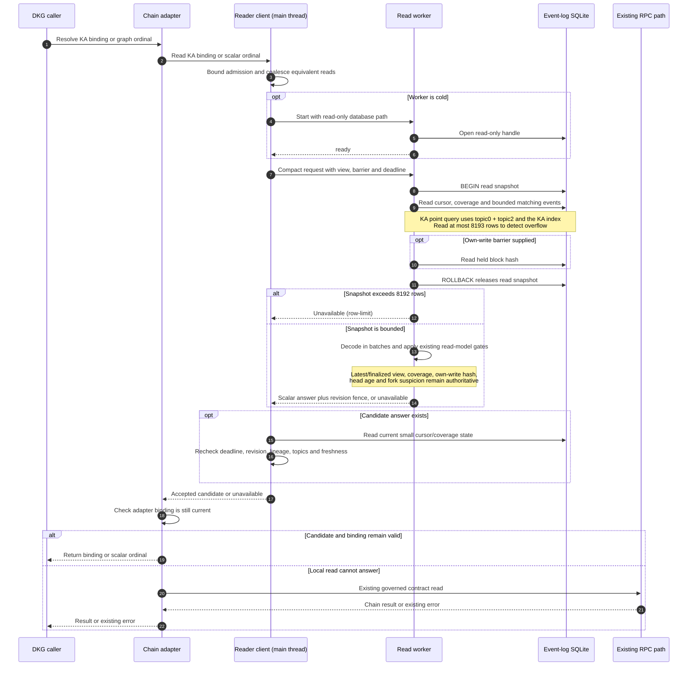
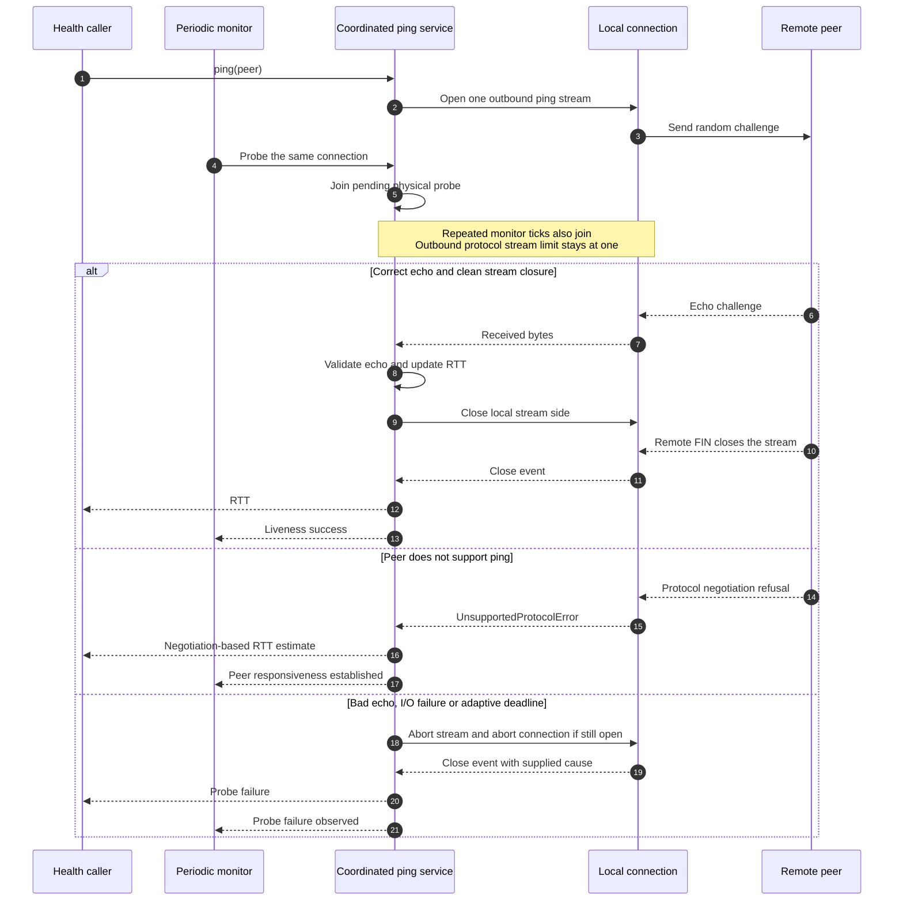

# Chain-index reads and connection stability

Status: implemented and validated locally. No production node was changed or restarted.

The fix addresses two independently reproduced mechanisms: a KA-to-graph lookup replaying all retained registrations on the main thread, and overlapping libp2p health/monitor probes exceeding the one-stream ping limit. It does not establish the cause of the original overload or prove long-term production recovery.

## Implementation

KA point reads select the registration signature and indexed KA ID (`topic2`) before decoding. A SQLite index covers scope, emitter, event signature, KA ID and event order; the point query explicitly selects it so a database without planner statistics cannot silently scan the history. Existing databases receive the additive index during initialization, before serving requests.

The daemon owns one reader worker with a read-only SQLite connection. It captures cursor, coverage, matching rows and own-write evidence in one transaction, releases that transaction, then decodes. The existing event-log connection remains the writer. Small responses are checked against the current revision, lineage, topic set, fork suspicion and head age before being accepted; adapter binding checks remain in place.

Limits are explicit:

- At most 64 callers and four physical reads, with equivalent reads shared between callers.
- A 1.5-second read deadline and separate 10-second worker startup deadline. A cold reader can finish starting after an individual caller falls back.
- SQLite reads at most 8,193 rows; a result exceeding 8,192 rows is refused, never treated as a complete history. This bounds native allocation before JavaScript decoding.
- Decoding yields every 128 rows. Ordinal callers receive one KA ID; the compatibility list port refuses lists larger than 1,024 entries.
- Cancelled physical work retains its slot and watchdog until the worker replies. Stuck workers are terminated; replacements wait for retirement and a one-second cooldown. Shutdown also awaits retired workers.

Misses, incomplete coverage, oversized graphs, stale answers, overload and worker failure use the existing RPC fallback. They cannot revive a full-history main-thread replay. Large graphs therefore still incur RPC calls for ordinal reads. The SDK's non-worker path also benefits from the indexed point lookup.

The ping service now coordinates periodic liveness probes and explicit health calls per connection. It replaces the independent built-in monitor using the supported configuration option, retaining the standard inbound responder, 10-second interval, adaptive deadlines, echo validation and dead-peer teardown. A probe holds its outbound slot until the remote stream closes. Cancelling one observer does not cancel the shared probe. Connection close logs preserve the supplied initiator and bounded, escaped error details.

## Sequence diagrams

### Indexed read, snapshot validation and RPC fallback



The writer remains the existing daemon store. No historical array is sent back for point/ordinal reads. Queue refusal, startup delay and worker failure can also produce the unavailable outcome before a worker request is dispatched. Caller cancellation rejects the caller instead of automatically starting a fallback RPC.

### Shared callers, cancellation and physical work retirement

```mermaid
sequenceDiagram
    autonumber
    participant A as Caller A
    participant B as Caller B
    participant C as Reader client
    participant W as Read worker
    A->>C: Read binding K with abort signal
    C->>W: Dispatch one physical read
    B->>C: Equivalent read K
    C->>C: Join existing job (same original deadline)
    A->>C: Abort
    C-->>A: Reject with abort reason
    Note over C,W: Caller B remains attached; physical read continues
    alt Worker replies before deadline
        W-->>C: Candidate result
        C->>C: Validate current state and deadline
        C-->>B: Accepted answer or unavailable
    else Physical read reaches deadline
        C-->>B: Unavailable (adapter may use RPC)
        C->>W: Terminate stalled reader
        Note over C: Other pending jobs become unavailable<br/>Late replies from retired worker are ignored
        W-->>C: Termination completes
        Note over C: Replacement is allowed only after retirement<br/>and the one-second cooldown
    end
```

If every caller aborts, the client sends cancellation but retains the physical slot and its watchdog until the worker replies or is terminated. Waiting for worker startup has a separate 10-second watchdog; a queued caller can hit its 1.5-second deadline without killing a worker that is still loading. Shutdown closes admission and awaits current and already-retiring workers before closing the dashboard database.

### One ping probe shared by health and liveness monitoring



Health-caller cancellation detaches that observer without cancelling the shared probe. Service shutdown cancels and drains probes without using the ordinary failure path to abort connections. The standard inbound ping responder remains installed. Only the independent built-in monitor is disabled; the replacement monitor still checks liveness every 10 seconds with the existing adaptive timeout behavior.

## Validation

Work began from freshly fetched `origin/testnet-canary` commit `24341ba73ab1f8a6f4330e34ae905bab725f0db6`; this remained the current base during validation. Tests use local fixtures and loopback peers.

All 226 focused tests passed on Node 22.23.1: chain 99, SQLite store 27, CLI worker/lifecycle 81, core ping/diagnostics 17 and agent wiring 2. Coverage includes indexed SQL selection and migration, finality, coverage, own-write hashes, replaced tails, tombstones, retired revisions and bindings, caller cancellation, queue limits, physical timeouts, worker startup/crash/recovery, startup cleanup and shutdown. Real TCP/Noise/Yamux tests reproduce and fix health/monitor and monitor/monitor collisions while also checking silent peers, delayed remote stream closure and reconnect behavior. Package builds, type checks and repository lint pass.

The repeatable benchmark is:

```sh
node --expose-gc packages/cli/scripts/chain-index-read-worker-benchmark.mjs
```

Build the CLI and its workspace dependencies first. It generates temporary 35,963- and 359,630-row fixtures, measures cold/warm point reads and concurrent ordinal/point reads, polls a local HTTP endpoint and records event-loop delay. `CHAIN_INDEX_BENCH_CAPTURE` optionally supplies an existing SQLite-row JSONL capture; no capture is committed. `CHAIN_INDEX_BENCH_OUTPUT` writes JSON evidence.

An initial unbounded stress run aborted Node inside native SQLite row allocation despite the worker heap limit. The SQL row limit fixes that observed failure; the stress run is repeated after that change. Worker heap limits alone are not the containment mechanism.

Measured on Apple M3 with five fresh-worker samples and 100 warm/mixed point samples per fixture; filesystem caches were not flushed:

| Runtime | History | Warm point p99 | Mixed point success | Local HTTP maximum | Event-loop maximum |
| --- | ---: | ---: | ---: | ---: | ---: |
| Node 22.23.1 | 35,963 captured rows | 3.75 ms | 100/100 | 4.03 ms | 11.37 ms |
| Node 22.23.1 | 359,630 generated rows | 3.84 ms | 100/100 | 1.12 ms | 11.40 ms |
| Node 25.2.1 | 35,963 captured rows | 1.86 ms | 100/100 | 3.42 ms | 16.91 ms |
| Node 25.2.1 | 359,630 generated rows | 2.45 ms | 100/100 | 0.93 ms | 11.27 ms |

Every point lookup selected one row. No historical arrays crossed the worker boundary; the largest response was 284 bytes. Cold reads completed within 409 ms in these runs. Concurrent oversized ordinal reads refused with `row-limit` and left point reads available; the benchmark records fallback without sending RPC. The Node 22 patch release tested here is 22.23.1, rather than the investigated production host's 22.23.0.

On the 359,630-row local database, direct index creation took 866 ms; reopening a compact database through the real initializer took 767 ms. The added index used 78.30 MiB and the row count was unchanged. A fragmented fixture took 7.19 seconds to reopen because the existing startup free-page policy also ran `VACUUM`. Account for database size, fragmentation and available disk space when planning startup; these timings are not production measurements.

## Deployment gate

Release matching CLI, core, chain, agent and node-ui package versions. Before production, run a staging publish/StorageACK/reconnect soak under comparable history and request pressure; inspect event-loop delay, RPC fallback rate, publish completion and close causes. Local latency tests do not replace this soak.

Confirm the available ACK quorum before restarting any core. With four Base cores and three required remote ACKs, taking one node down can prevent quorum even during a sequential rollout. Plan spare eligible capacity or an explicit maintenance window. Rollback is the previous package set; the additional SQLite index is compatible with the old reader.

A one-node production pilot is useful after staging, with EG Luigi the most informative candidate from the investigation because it exhibited the repeated stalls. This is a proposed rollout, not a deployment instruction or a claim that current fleet health has been rechecked:

1. Finish CI/review and staging publish, repair and reconnect validation with the packaged build. Exercise unsolved Random Sampling retries and observe at least two complete proof periods with active publishing.
2. Recheck live eligible ACK identities, peer reachability, disk headroom and node health. Arrange spare eligible capacity or a maintenance window if the restart would remove quorum. Capture the old package versions and a baseline on Luigi plus one unchanged comparison node.
3. Deploy one coherent package set to Luigi only and confirm index migration, reader startup, API responsiveness and peer recovery. Measure per-thread CPU, event-loop delay, RSS, disk/WAL growth, lookup durations, worker timeouts/restarts, RPC fallbacks and connection close causes.
4. Require completed publish transactions with the required distinct StorageACK identities and successful repair/challenge progression; also exercise reconnects. Observe at least two complete proof periods under representative activity, extending the soak if the original symptom has not been exercised.
5. Roll back the package set on incorrect bindings/ordinals, repeated worker failures, resource growth, increased local disconnects or publish/ACK regressions. Preserve raw history and the additive index. Expand only after the pilot meets the application-level checks.

The new reader diagnostics are throttled warning lines, not continuous latency or fallback-rate histograms. Collect the pilot's latency distributions and rates separately; lack of warning lines is insufficient evidence of health. The 1.5-second reader deadline is a local-read budget and does not promise a 1.5-second end-to-end RPC/API response.

A patched node can prevent its own ping collisions, while an unpatched peer can still close the other end. Interpret remote-initiated closures separately; one healthy pilot cannot establish fleet-wide stability or settle the original overload's cause.
