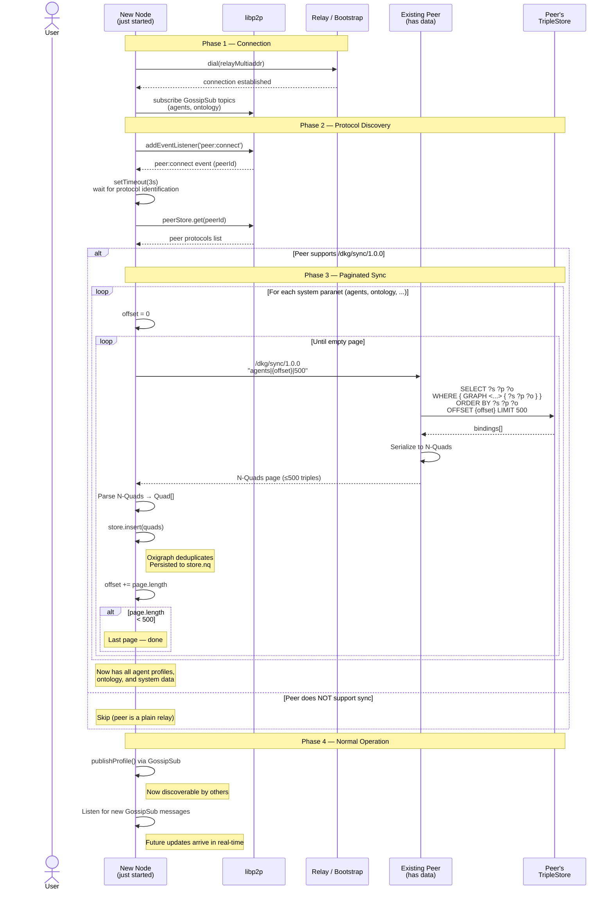

# Paranet Sync Flow

Sequence diagram showing how a newly-joined node catches up on data it
missed while offline. This solves the **"last to the party" problem** —
GossipSub is fire-and-forget, so a node that connects after profiles were
broadcast would never learn about existing agents without an explicit sync.

## Problem

```
Timeline ─────────────────────────────────────────►

  Agent A starts         Agent B starts
  publishes profile      publishes profile
  via GossipSub          via GossipSub
       │                      │
       ▼                      ▼
  ┌─────────┐            ┌─────────┐
  │ A knows  │            │ B knows │
  │ about B  │            │ about A │
  └─────────┘            └─────────┘

                                           Agent C starts
                                           subscribes to GossipSub
                                                │
                                                ▼
                                           ┌─────────┐
                                           │ C knows  │
                                           │ NOTHING  │  ← missed both broadcasts
                                           └─────────┘
```

## Solution: Sync on connect

When C connects to any peer, it requests the full contents of the `agents`
paranet (and any other system paranets) from that peer, page by page.

## Design decisions

- **Paginated** — the request includes `offset|limit` so large paranets
  don't blow up memory. Default page size is 500 triples per request.
  The requester loops until it gets an empty page.
- **SPARQL-backed** — the responder uses `SELECT ... ORDER BY ... OFFSET
  ... LIMIT ...` under the hood, so the response is deterministic and
  resumable even if new triples arrive mid-sync.
- **Protocol-gated** — before attempting sync, the requester checks the
  peer's protocol list via the libp2p peer store. If the peer doesn't
  advertise `/dkg/sync/1.0.0` (e.g. a plain circuit relay), the sync is
  skipped entirely — no wasted dial attempts.
- **Idempotent** — inserting duplicate triples into Oxigraph is a no-op,
  so syncing the same page twice is safe.
- **Persistent store** — synced data is written to `~/.dkg/store.nq` and
  survives restarts. A node that already has data from a previous session
  only receives triples it doesn't yet have (the store deduplicates on
  insert).

## Wire format

```
Protocol:   /dkg/sync/1.0.0
Transport:  libp2p stream (request → response)

Request (UTF-8):
  "<paranetId>|<offset>|<limit>"
  e.g. "agents|0|500"

  - paranetId:  which paranet to sync (default: "agents")
  - offset:     number of triples to skip (default: 0)
  - limit:      max triples to return (capped at 500)

Response (UTF-8):
  N-Quads text, one triple per line:
  "<subject> <predicate> <object> <graph> .\n"

  Empty response = no more data (end of pagination).
```

## Sequence diagram



## Persistence lifecycle

```
First start (no store.nq)             Restart (store.nq exists)
─────────────────────────              ────────────────────────
OxigraphStore(~/.dkg/store.nq)        OxigraphStore(~/.dkg/store.nq)
  │                                      │
  ├─ file not found → empty store        ├─ load N-Quads from disk
  │                                      │  (agent profiles, published data, ...)
  ├─ peer:connect → sync agents          │
  │  └─ insert + flush to disk           ├─ peer:connect → sync agents
  │                                      │  └─ insert (dedup) + flush
  ├─ GossipSub → receive publishes       │
  │  └─ insert + flush to disk           ├─ GossipSub → receive publishes
  │                                      │  └─ insert + flush
  └─ close() → final flush               └─ close() → final flush
```
