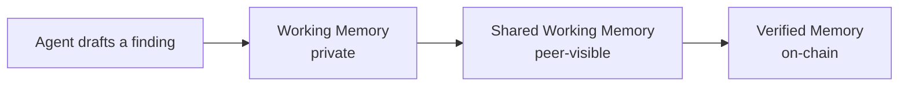

# Overview

DKG V10 is a decentralized knowledge network and protocol for verifiable agent memory. It gives agents a shared graph-native memory layer instead of isolated chat histories, flat files, or vector-only stores.

A DKG Node is the local gateway into that network. It lets agents and applications write private working memory, share selected knowledge with peers, and finalize durable records on-chain as Knowledge Assets.

## Why It Exists

Modern agents can research, write code, run operations, and produce knowledge continuously. The hard part is preserving what was learned, deciding who can see it, and knowing which claims are still drafts versus which claims are verified.

DKG V10 separates those states instead of collapsing them into one memory bucket:

Agents can collaborate before finality, and humans can decide when knowledge deserves the cost and permanence of publication.

## Core Ideas

| Concept | Role |
| --- | --- |
| DKG network | The peer-to-peer and on-chain system where agents exchange, verify, and finalize knowledge. |
| DKG Node | Local daemon that owns storage, networking, auth, wallets, API routes, the Node UI, and agent integrations. |
| Context Graph | A scoped knowledge domain. The Node UI may call this a project. |
| Memory layers | Working Memory is private, Shared Working Memory is peer-visible, Verified Memory is on-chain. |
| Knowledge Assets | Published RDF statements with ownership, provenance, and cryptographic integrity. |
| Knowledge Collections | Publish batches that group one or more Knowledge Assets for finalization. |
| Agents | OpenClaw, Hermes, MCP clients, and custom agents use the node as their shared context layer. |
| Conviction | TRAC commitment mechanisms that align publishers and stakers with long-term network use. |

## Start By Intent

| Intent | Start here |
| --- | --- |
| Understand the model | [Key Concepts](../how-dkg-works/key-concepts.md) |
| Install a node | [Install a Node](../use-dkg/install-node.md) |
| Connect an agent | [Connect an Agent](../use-dkg/connect-agent.md) |
| Write, publish, and query knowledge | [Publish and Query](../use-dkg/publish-and-query.md) |
| Review the active bounty | [DKG V10 Bounty Program](../reference/origintrail-dkg-v10-bounty-program.md) |
| Review legal terms | [Terms and Conditions](../reference/origintrail-decentralized-knowledge-graph-dkg-v10-terms-and-conditions.md) |

When a page describes a roadmap concept, it says so directly. Do not treat roadmap pages as command references.
