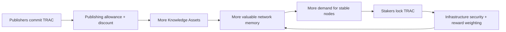

# Conviction & Economics

DKG uses conviction mechanisms to connect usage demand with long-term network support. Publisher conviction is the demand-side commitment. Staker conviction is the supply-side commitment.



## Publisher Conviction

A Publishing Conviction Account lets a publisher commit TRAC for a fixed publishing window. The commitment is represented on-chain by the DKG Publishing Conviction NFT contract. The account can register publishing agents, top up funds, settle billing windows, and expose a read-only account snapshot.

Current operator surface:

```bash
dkg pca create --tokens 100000 --primary-node <identityId>
dkg pca register-agent <accountId> <agentAddress>
dkg pca deregister-agent <accountId> <agentAddress>
dkg pca funds <accountId> --tokens 50000
dkg pca settle <accountId>
dkg pca info <accountId>
```

The matching daemon routes are:

| Route                                | Purpose                                 |
| ------------------------------------ | --------------------------------------- |
| `POST /api/pca`                      | Create a Publishing Conviction Account. |
| `POST /api/pca/:id/agent`            | Register a publishing agent.            |
| `DELETE /api/pca/:id/agent/:address` | Deregister a publishing agent.          |
| `POST /api/pca/:id/funds`            | Top up a PCA.                           |
| `POST /api/pca/:id/settle`           | Run the lazy-settlement sweep.          |
| `GET /api/pca/:id`                   | Read a PCA snapshot.                    |

Owner-gated writes require the daemon EOA to own the PCA NFT. `pca settle` and `pca info` are permissionless/read-side operations.

## Discount Tiers

The current V10 contract tests pin the publishing discount ladder by committed TRAC:

| TRAC committed | Discount |
| -------------- | -------- |
| 25,000         | 10%      |
| 50,000         | 20%      |
| 100,000        | 30%      |
| 250,000        | 40%      |
| 500,000        | 50%      |
| 1,000,000+     | 75%      |

Publishing can use the PCA path only when the publishing wallet is registered as an agent for the account and the publish window matches the account configuration. The wallet still needs native gas. It does not need an on-chain node identity for PCA payment eligibility; node identity is optional publisher-node attribution. Otherwise the publisher path falls back to direct spend at the normal price.

## Curated Context Graphs and PCA

PCA can be attached to curated Context Graph registration through `pcaAccountId`.

```bash
dkg context-graph register <id> --publish-policy 0 --pca-account-id <accountId>
```

The daemon preflights ownership so a local curator cannot claim someone else's PCA. `pcaAccountId` is valid only for curated publish policy.

## Protocol Treasury Fee

A governance-set protocol fee (default 3%, capped at 10%) is skimmed from the staker-bound TRAC on every paid publish, update, or lifetime extension. Publishers pay the same gross price — the fee comes out of the amount that would otherwise flow into the staker reward pool. The fee is dormant until governance sets a treasury recipient, so a fresh deployment charges nothing until it is enabled.

## Staker Conviction

Staker conviction is the supply-side commitment mechanism. V10 staking positions are represented as transferable ERC-721 NFTs. Each position records the staked amount, node identity, lock tier, multiplier, and expiry behavior.

The V10 contract model uses discrete lock tiers:

| Lock tier | Reward multiplier |
| --------- | ----------------- |
| No lockup | 1x                |
| 1 month   | 1.5x              |
| 3 months  | 2x                |
| 6 months  | 3.5x              |
| 12 months | 6x                |

This page documents the contract-backed model and economics vocabulary. It is not yet a staker operating guide. Until a public `use-dkg` page covers the complete staker workflow, treat staker conviction as an economics and contract concept rather than a documented operator procedure.

## Terms

The official legal text for TRAC, conviction positions, Knowledge Assets, and risk disclosures is copied unchanged in [OriginTrail Decentralized Knowledge Graph DKG V10 - Terms and Conditions](../getting-started/dkg-v10-t-c.md).
