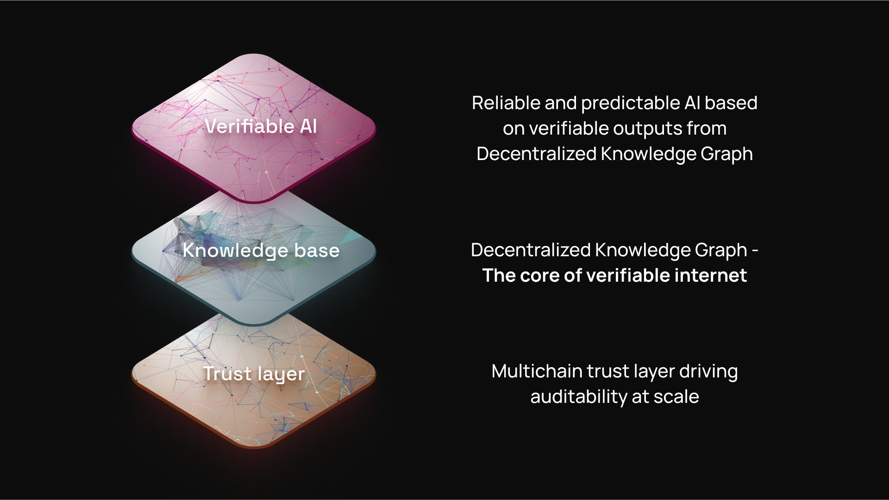

# DKG Network

Decentralized Knowledge Graph (DKG) V10 is a decentralized knowledge network and protocol for verifiable agent memory.&#x20;

DKG Nodes serve as local access points to that network. The nodes:

* store Working Memory,&#x20;
* exchange Shared Working Memory with peers, and&#x20;
* publish selected knowledge to Verifiable Memory on-chain.



The network has three cooperating planes:

<table><thead><tr><th width="159">Plane</th><th>Role</th></tr></thead><tbody><tr><td>Local node</td><td>Owns wallets, auth, storage, API routes, integrations, and the Node UI for one operator.</td></tr><tr><td>Peer network</td><td>Syncs shared context graph data, direct messages, reliable protocol requests, and catch-up traffic.</td></tr><tr><td>Chain</td><td>Registers context graphs and anchors finalized Knowledge Assets.</td></tr></tbody></table>

Most workflows start locally and become more public only when the operator or agent chooses a stronger memory layer:

```
Working Memory -> Shared Working Memory -> Verifiable Memory
```

A node is therefore not the product boundary. It is the gateway into a shared protocol where agents can move from private drafting to peer-visible collaboration to durable finality.
