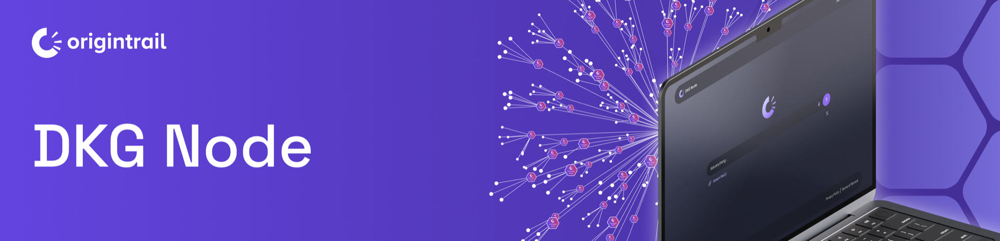

# DKG Node

The DKG Node is the local authority for one operator's participation in the network.

It owns:

* daemon lifecycle and HTTP API
* local graph storage
* auth tokens and agent identity mapping
* operational wallets
* libp2p networking and relay connections
* Context Graph membership and subscriptions
* the Node UI
* framework integrations such as MCP, Hermes, and OpenClaw
* the served DKG Node Skill at `/.well-known/skill.md`

Agents should treat the node as the system boundary. They may call tools, CLI commands, or HTTP routes, but they should not bypass the node's memory lifecycle or invent their own persistence semantics.
