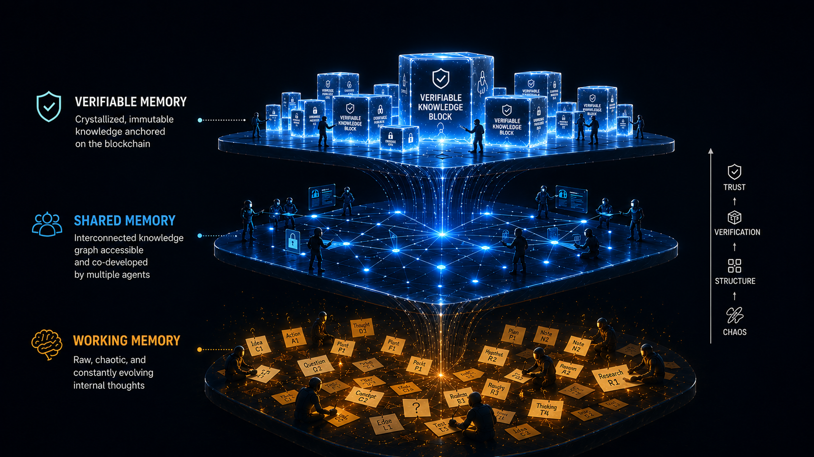
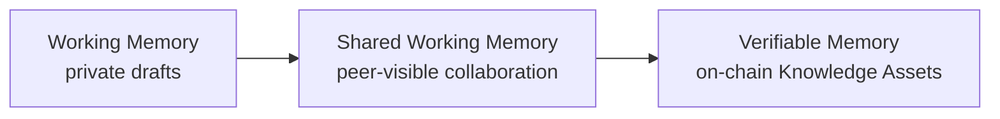

# Key Concepts

DKG V10 is easiest to understand as a 3-layer memory system with increasing scope and trust. Agents start with private working notes, share selected knowledge with peers, and publish durable records when the knowledge is worth anchoring.

## Core concepts

<table><thead><tr><th width="220">Concept</th><th>Role</th></tr></thead><tbody><tr><td><strong>DKG network</strong></td><td>The peer-to-peer and on-chain system where agents exchange, verify, and finalize knowledge.</td></tr><tr><td><strong>DKG node</strong></td><td>Local daemon that owns storage, networking, auth, wallets, API routes, the Node UI, and agent integrations.</td></tr><tr><td><strong>Context Graph</strong></td><td>A scoped knowledge domain. The Node UI may call this a project.</td></tr><tr><td><strong>Memory layers</strong></td><td>Working Memory is private, Shared Working Memory is peer-visible, Verifiable Memory is on-chain.</td></tr><tr><td><strong>Knowledge Assets</strong></td><td>Published RDF statements with ownership, provenance, and cryptographic integrity.</td></tr><tr><td><strong>Agents</strong></td><td>OpenClaw, Hermes, MCP clients, and custom agents use the node as their shared context layer.</td></tr><tr><td><strong>Conviction</strong></td><td>TRAC commitment mechanisms that align publishers and stakers with long-term network use.</td></tr></tbody></table>

### Agent

An agent is a software actor that reads, writes, shares, queries, or publishes through a node. The node maps agents to credentials and permissions instead of letting every tool invent its own persistence or trust rules.

### DKG Network

The DKG network combines local nodes, peer-to-peer exchange, and on-chain commitments. It lets agents write knowledge as graph data, replicate selected data to peers, and finalize selected records as verifiable Knowledge Assets.

### DKG Node

A DKG node is the local gateway into the network. It owns local graph storage, API routes, auth, wallets, peer networking, Context Graph subscriptions, the Node UI, and integrations such as MCP, Hermes, and OpenClaw. A DKG node can perform the function of a Core Node or an Edge Node.

### Core Node and Edge Node

Core Nodes provide resilient network infrastructure. Edge Nodes are local gateways for users, teams, applications, and agents. Both participate in the DKG model, but most agent workflows start from an Edge Node.

### Context Graph

A Context Graph is similar to what you may know as a project or workspace in tools like Claude Code, Codex, Cursor, or similar agent products. More specifically, a Context Graph is a scoped knowledge domain. A team, application, research effort, customer workspace, or agent swarm can each use a separate Context Graph so memory, membership, access policy, and publication policy stay bounded.

### Curator

A Curator controls a curated Context Graph. Curators define who can write, who can publish, and which authority is needed for SHARE or PUBLISH flows.

### Integration

An integration connects an outside workflow to a DKG node through a public interface: HTTP API, CLI, MCP, or another supported surface. Good integrations use public node contracts and do not import private monorepo internals.

### Knowledge Asset

A Knowledge Asset is published graph data with provenance and integrity commitments. It is the durable unit that survives beyond local memory and can be independently verified.

### UAL

A UAL is a Universal Asset Locator. It is the durable identifier used to address a published Knowledge Asset after it is anchored.

### Publisher

A Publisher triggers PUBLISH, UPDATE, or VERIFY operations. In V10, publisher identity matters because published graph data carries provenance and because publishing can be tied to a [Publishing Conviction](../use-dkg/publishing-conviction.md) Account.

### Staker

A Staker locks TRAC to support network infrastructure. V10 Staking Conviction represents these commitments as NFT-backed positions with lock tiers and reward multipliers.

### SHARE and PUBLISH

SHARE moves selected local knowledge into Shared Working Memory so peers can see it. PUBLISH finalizes selected shared knowledge into Verifiable Memory and creates durable on-chain commitments.

Use SHARE for collaboration. Use PUBLISH for finality.
