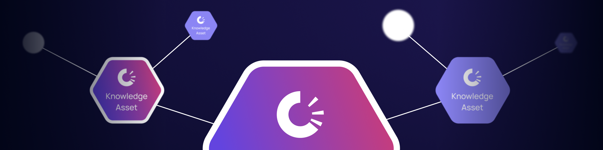

# Knowledge Assets

A Knowledge Asset is published graph data with provenance and integrity. It packages RDF statements so other nodes can verify who published them, what was published, and whether the content still matches its commitment. Each publish mints one Knowledge Asset — a single ERC-721 token — that can describe multiple related entities.

Use Knowledge Assets when knowledge needs to survive beyond local or team memory:

* facts that must be independently verifiable
* records that should have a durable identifier
* data that another party may endorse or verify
* final outputs from a multi-agent workflow

Agents should not convert every note into a Knowledge Asset. Most work starts in Working Memory and becomes a Knowledge Asset only after it is worth finalizing.

## Knowledge Assets and UALs

The Knowledge Asset is minted to its author as an ERC-721 token; the publisher pays the TRAC cost. After publication, the asset is addressed through a UAL of the form `did:dkg:{chainId}/{contract}/{kaId}`, where `kaId` is the ERC-721 token id. The UAL stays the same even when the asset's content is updated, so citations remain valid across revisions.

Use the UAL when another workflow needs to cite, fetch, or verify published knowledge. Use the Context Graph when the workflow needs the larger scoped memory domain around that asset.

## Publisher Authority

Publishing records who finalized the knowledge. When a Publishing Conviction Account is active, a registered publishing agent can use that account's conviction path. If the agent is not registered or the account is not eligible for the publish, the publisher path falls back to direct spend.
