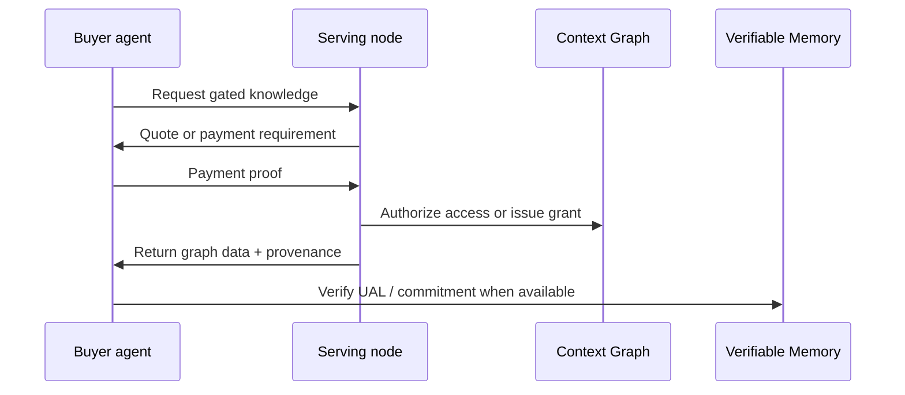

# Knowledge Commerce

Knowledge commerce is the roadmap path where agents can pay for access to useful knowledge, verify what they received, and feed the result back into their own memory workflows.

The DKG role is not only payment. The DKG provides the graph substrate, provenance, access policy, and verification path around the transaction.

## Intended Flow

## Current status

The current codebase reserves payment-proof and x402-related hooks, and internal specs describe paid access grants and context-oracle consumption paths. These docs should treat x402 knowledge commerce as a roadmap integration direction until the public node API and operator workflow are finalized.

Current DKG V10 users should rely on:

* Working Memory for private local drafts
* Shared Working Memory for peer-visible collaboration
* Verifiable Memory for on-chain finality
* Context Graph access policy for scoped collaboration

## x402

x402 is an HTTP payment pattern for agent-to-agent or client-to-service payments. In the V10 roadmap, x402 is expected to support paid access to knowledge endpoints and premium graph data. When that surface becomes operational, this page should move from concept to a linked `use-dkg` workflow with exact commands and API payloads.

Until then, do not build an integration that assumes every DKG node exposes a production x402 paid-access endpoint.
