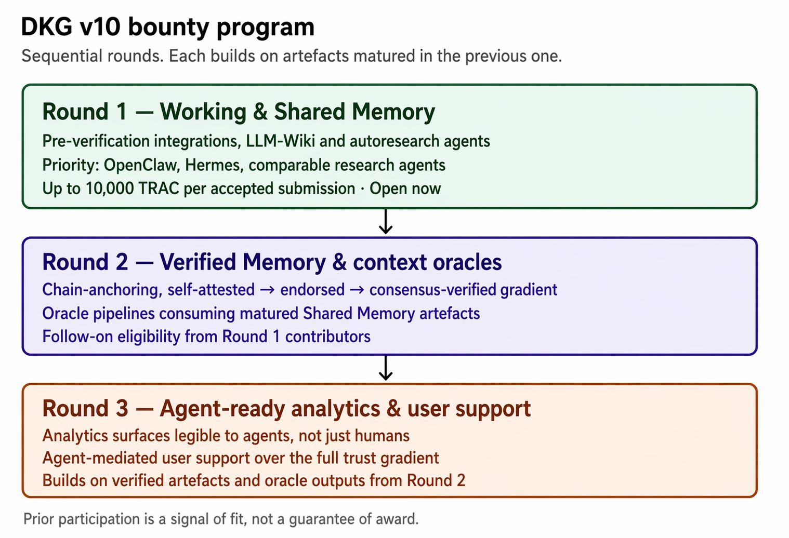
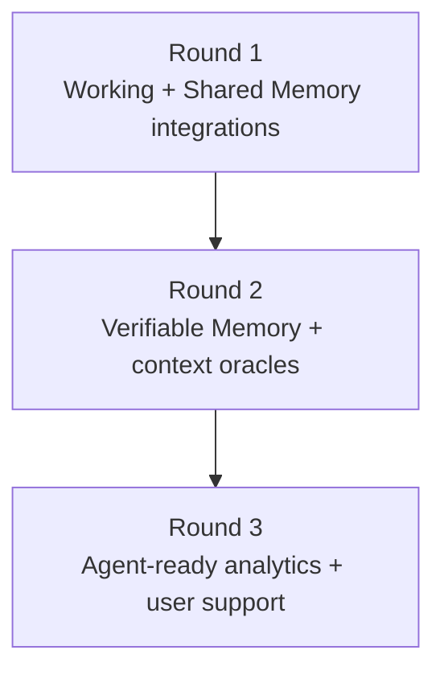

# Roadmap & Convergence

DKG V10 is aimed at one problem: agents are producing knowledge faster than teams can preserve, share, and verify it. Proprietary assistant memories solve part of that problem for one product. DKG solves it as a shared network layer where memory is portable, graph-native, ownable, and verifiable.

## Why does it matter?

Multi-agent systems need a substrate where many agents can contribute without turning every claim into a verifiable truth. The DKG model separates drafting, collaboration, and finality:

* Agents draft in Working Memory
* Teams and swarms collaborate through Shared Working Memory
* Selected knowledge becomes Verifiable Memory through on-chain publication

That makes DKG useful for research agents, coding agents, operational agents, and applications that need provenance instead of one-off chat history.

## Four convergence areas

<table><thead><tr><th width="230">Area</th><th>Direction</th></tr></thead><tbody><tr><td>DePIN infrastructure</td><td>Local nodes become agent hosts, query endpoints, and network participants.</td></tr><tr><td>Multi-agent memory</td><td>Agents use shared graph memory instead of isolated logs or vector-only stores.</td></tr><tr><td>DKG applications</td><td>Apps ground predictions, research, operations, and support in queryable Knowledge Assets.</td></tr><tr><td>Truth-seeking algorithms</td><td>Verification, conviction, and payment rails align publishers, stakers, and consumers.</td></tr></tbody></table>

## Current public surface

The current docs focus on the operational DKG V10 surface that users and agents can call today:

* node install and runtime setup
* MCP, Hermes, and OpenClaw connection paths
* Working Memory and Shared Working Memory assertions
* sharing from WM to SWM
* Verifiable Memory publishing flows
* Context Graph creation and subscription
* peer discovery, relays, and P2P resilience
* Publishing Conviction Account CLI/API routes

## Roadmap surface

Some roadmap concepts are important to explain now because they shape the system vocabulary and bounty program, but they should not be confused with day-one operator commands.

<table><thead><tr><th width="205">Topic</th><th>Status in these docs</th></tr></thead><tbody><tr><td>Publisher conviction</td><td>Current concept with current PCA CLI/API surface.</td></tr><tr><td>Staker conviction</td><td>Contract-backed V10 economics concept; no public staker how-to is documented here yet.</td></tr><tr><td>Context oracles</td><td>Roadmap direction for consuming matured verifiable knowledge.</td></tr><tr><td>x402 paid access</td><td>Roadmap/payment integration direction; current protocol surfaces reserve payment-proof hooks.</td></tr><tr><td>Later bounty rounds</td><td>Planned and indicative unless the official bounty page says otherwise.</td></tr></tbody></table>

## Sequence

Round 1 seeds the pre-verification layer with useful integrations. Round 2 is expected to move more of that output into Verifiable Memory and oracle-ready workflows. Round 3 is expected to make the resulting network easier for agents and humans to inspect, support, and operate.

The binding program details live in the official [DKG V10 Bounty Program](../active-now/dkg-v10-bounty.md) page.
