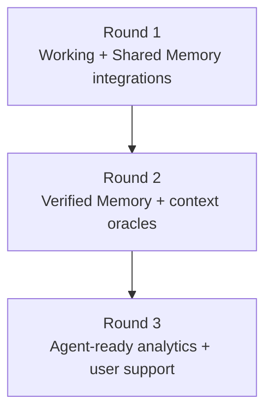

# Roadmap and Convergence

DKG V10 is aimed at one problem: agents are producing knowledge faster than teams can preserve, share, and verify it. Proprietary assistant memories solve part of that problem for one product. DKG solves it as a shared network layer where memory is portable, graph-native, ownable, and verifiable.

## Why It Matters

Multi-agent systems need a substrate where many agents can contribute without turning every claim into trusted truth. The DKG model separates drafting, collaboration, and finality:

- agents draft in Working Memory
- teams and swarms collaborate through Shared Working Memory
- selected knowledge becomes Verified Memory through on-chain publication

That makes DKG useful for research agents, coding agents, operational agents, and applications that need provenance instead of one-off chat history.

## Four Convergence Areas

| Area | Direction |
| --- | --- |
| DePIN infrastructure | Local nodes become agent hosts, query endpoints, and network participants. |
| Multi-agent memory | Agents use shared graph memory instead of isolated logs or vector-only stores. |
| DKG applications | Apps ground predictions, research, operations, and support in queryable Knowledge Assets. |
| Truth-seeking algorithms | Verification, conviction, and payment rails align publishers, stakers, and consumers. |

## Current Public Surface

The current docs focus on the operational V10 surface that users and agents can call today:

- node install and runtime setup
- MCP, Hermes, and OpenClaw connection paths
- Working Memory and Shared Working Memory assertions
- promotion from WM to SWM
- Verified Memory publishing flows
- Context Graph creation and subscription
- peer discovery, relays, and P2P resilience
- Publishing Conviction Account CLI/API routes

## Roadmap Surface

Some roadmap concepts are important to explain now because they shape the system vocabulary and bounty program, but they should not be confused with day-one operator commands.

| Topic | Status in these docs |
| --- | --- |
| Publisher conviction | Current concept with current PCA CLI/API surface. |
| Staker conviction | Contract-backed V10 economics concept; no public staker how-to is documented here yet. |
| Context oracles | Roadmap direction for consuming matured verified knowledge. |
| x402 paid access | Roadmap/payment integration direction; current protocol surfaces reserve payment-proof hooks. |
| Later bounty rounds | Planned and indicative unless the official bounty page says otherwise. |

## Sequence

Round 1 seeds the pre-verification layer with useful integrations. Round 2 is expected to move more of that output into Verified Memory and oracle-ready workflows. Round 3 is expected to make the resulting network easier for agents and humans to inspect, support, and operate.

The binding program details live in the official [DKG V10 Bounty Program](../reference/origintrail-dkg-v10-bounty-program.md) page.
