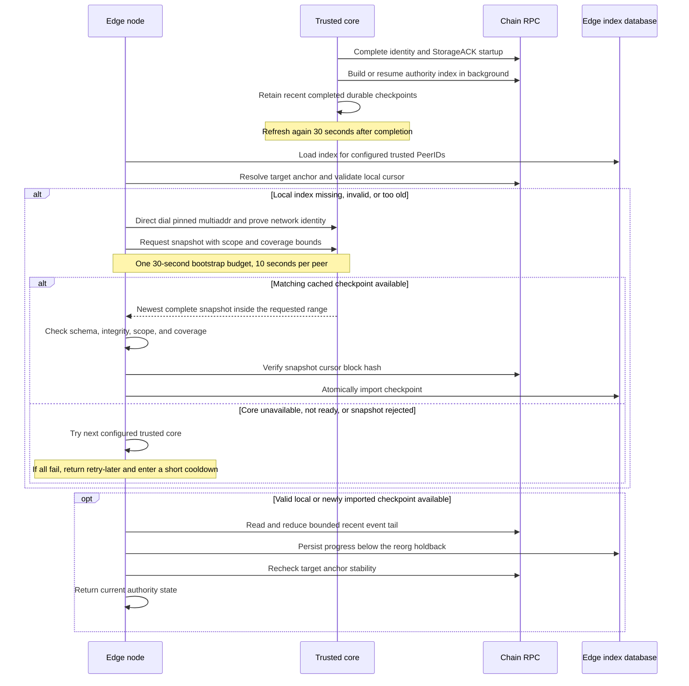

# Core snapshots for the Context Graph authority index

An edge can fetch the built Context Graph authority table from trusted cores and
read only a bounded recent tail from chain. This avoids rebuilding the registry
from its deployment block on every fresh edge. Cores still perform that historical
scan once and preserve their progress in the local index store.

The table includes owners, participants, permission state, and historical version
counters. It is authority-bearing data. Enable snapshots only for core operators
you trust to supply the complete, correct table.

## Authority index bootstrap

Since 10.0.18 an edge needs no configuration to use snapshots:

- **Default (no `authorityIndex` block):** an edge with a configured EVM chain
  (`chain.rpcUrl` and `chain.hubAddress`) and operational keys trusts the
  relays listed in its network file: at most eight, each pinned by the PeerID
  in its multiaddr, with placeholder entries skipped. The network file is the
  trust anchor, as it already is for the chain the node joins.
  Operator-configured `relay` and `preferredRelays` entries never enter the
  trust set, and neither do agent-registry (phonebook) cores: registry
  profiles are unauthenticated gossip, and nothing binds a profile's PeerID
  to the staked identity it names. The edge requests a snapshot from the
  relays over the protocol described below within one 30-second bootstrap
  budget, and then reads the bounded recent tail from chain. If no relay
  supplies a usable snapshot inside that budget, the edge logs it and
  continues with the local-history scan, resuming from any checkpoint it
  already scanned locally instead of rescanning from the contract's
  deployment block, so it is never slower than an edge without snapshots.
  The startup log reports
  `mode=core-snapshot trustedCoreCount=<relays> source=network-relays fallback=local-history`
  with the tail budget and cache epoch. An edge that cannot run the default
  (mock chain adapter, no chain configuration, no operational wallets, or
  `relay: "none"`) keeps the local-history scan; its startup log reports
  `mode=local-history`, preceded by
  `[authority-index] network-relay default skipped: <reason>; using local history`.
  Cores do not use snapshots; they build the index from chain history.
- **Explicit override:** an `authorityIndex` block in the edge's `config.json`
  wins over the default and pins the cores the edge trusts. Its keys are `mode`
  (must be `core-snapshot`), `trustedCorePeers` (one to eight multiaddrs with
  distinct pinned PeerIDs), `maxTailBlocks` (`200` to `10000`, default `2000`),
  and `cacheEpoch` (nonnegative integer, default `0`). The startup log reports
  the mode, trusted-core count, and tail budget. The rest of this page
  describes the explicit block.

## Configure the cores first

Use ordinary core configuration on the same network as the edges:

```json
{
  "networkConfig": "testnet",
  "nodeRole": "core"
}
```

Merge these fields into the core's existing `config.json` under its `DKG_HOME`
(normally `~/.dkg`). Keep its chain configuration, wallets, and persistent data.
Updated cores build and refresh the index in the background and serve completed
snapshots over libp2p. Snapshot requests read the cached table; they do not start
another historical rebuild. While the core is building its first index, a complete
snapshot is not yet available.

This background work starts automatically after the core's identity and StorageACK
startup steps, even if no edge has enabled snapshots. This
keeps background chain initialization from delaying identity and ACK setup.
Budget for the initial historical scan and the following refreshes. Refreshes
run at background RPC priority, with the next attempt scheduled 30 seconds after
the previous one ends.

Make the core reachable from the edges and obtain its advertised multiaddr and
PeerID. The `/p2p/` suffix identifies the core that the edge will trust. Preserve
the core's identity and index database across restarts. Configure more than one
independently available core for failover.

## Enable snapshots on each edge

Add this block to the edge's local `config.json`. Replace both example multiaddrs
with the actual reachable addresses and PeerIDs of your trusted cores:

```json
{
  "networkConfig": "testnet",
  "nodeRole": "edge",
  "authorityIndex": {
    "mode": "core-snapshot",
    "trustedCorePeers": [
      "/dns4/core-a.example.com/tcp/9090/p2p/<CORE_A_PEER_ID>",
      "/dns4/core-b.example.com/tcp/9090/p2p/<CORE_B_PEER_ID>"
    ],
    "maxTailBlocks": 2000
  }
}
```

Restart the edge after editing its config:

```bash
dkg stop
dkg start
```

`trustedCorePeers` must contain one to eight valid multiaddrs with distinct pinned
PeerIDs. The explicit list comes only from the operator's local config: relays,
bootstrap peers, discovered cores, and entries in a bundled network config are
never added to it. Without the block, the edge uses the network-relay default
described in [Authority index bootstrap](#authority-index-bootstrap).

`maxTailBlocks` defaults to `2000` and must be an integer from `200` to `10000`.
The minimum leaves room beyond the 50-block durable reorg holdback for refresh
age and RPC head differences. Prefer the default for operational headroom; even
the minimum can become insufficient when a core or RPC falls behind.
The edge checks the snapshot's deployment and block anchor against its chain,
persists the imported index, and processes the recent tail locally up to the
anchor selected by `chain.finalityConfirmations`.
If it falls farther behind than this limit, it requests a newer snapshot instead
of scanning the missing history. The edge still needs its configured RPC endpoint
for chain checks and the recent tail.

This setting is for edges. Startup rejects it on a core, as well as invalid
sources, unsupported modes, unknown fields, invalid tail limits, and an
`authorityIndex` block misplaced inside `core`. The startup log reports the mode,
trusted-core count, and tail budget.

The standard daemon supplies the local durable index store. SDK callers must
provide that store and a configured EVM chain with operational keys. This mode
does not accept an injected `chainAdapter`: the agent must construct the EVM
adapter so it can install the snapshot transport and its trust namespace together.
`DKGAgent.create` rejects an explicit block without them. The network-relay
default applies only when they are present and `networkRelays` names at least
one relay; otherwise the edge runs local history. `planAuthorityIndexBootstrap`
reports that decision, and the reason for a skipped default, from the same
agent configuration.

## How the node fetches the table

Fetching is automatic when an authority read finds its local index missing,
invalid, or farther behind than `maxTailBlocks`. A recent valid local checkpoint
resumes directly from chain without another download. No separate fetch command
or HTTP snapshot endpoint is added by this feature.

The edge connects to a core multiaddr (pinned by config, or a network-file
relay by default) and sends a JSON request over
the authenticated libp2p protocol:

```text
/dkg/10.0.0/authority-index-snapshot/1
```

Directly dialing the pinned multiaddr avoids needing the Agent Registry
phonebook to bootstrap the authority index. Normal network-identity admission
still applies. The client tries trusted cores sequentially, with a 10-second
deadline for each attempt, including snapshot admission. One 30-second bootstrap
budget covers the candidate walks, admission, and repeated import attempts after
concurrent writes. It does not restart for each peer or import retry. An exhausted
budget aborts transport and anchor checks; an already-started database write must
still drain safely. The locally verified tail remains subject to its separate
block budget and the existing RPC controls.

Cores retain up to eight completed checkpoints and choose the newest one inside
the edge's requested range. This lets a slightly older edge use a prior checkpoint
when the core's latest cursor is ahead. The edge never raises its anchor to accept
a newer core's authority state.

The wire request has this shape; the node derives all four request fields:

```typescript
{
  version: 1,
  request: {
    scope: string,                  // chain ID, Hub, and ContextGraphStorage address
    deploymentBlockNumber: number,
    minThroughBlockNumber: number,  // max(deployment, target anchor - maxTailBlocks)
    maxThroughBlockNumber: number  // highest durable block below the reorg holdback
  }
}
```

A successful response is `{ version: 1, status: 'ok', snapshot }`, where
`snapshot` contains its own `version: 1`, the same `scope`, and the complete
version-2 `checkpoint` (`cursor`, `states`, and `integrity`). The cursor records
the deployment block and covered block number/hash; states contain the on-chain
authority rows, including ownership, policies, membership, and their generation
counters. The core serializes this existing checkpoint; operators do not assemble
it themselves.



Requests are limited to 2 KiB, responses to 8 MiB, and a core permits four
concurrent cache exports. An admitted remote PeerID may make four requests per
five-second window; additional requests receive `busy`. The limiter tracks at
most 1,024 active peer windows, returning `busy` for new peers at capacity.
These limits bound cache-export work; they do not reserve a fixed number of
in-flight response bytes in the underlying transport.

Non-success responses are `{ version: 1, status }`:

| Status | Meaning |
| --- | --- |
| `not-ready` | No completed checkpoint is available. |
| `above-range` | Available checkpoints are ahead of the edge's accepted range. |
| `below-range` | Available checkpoints are too old for the edge's tail budget. |
| `too-large` | The complete snapshot cannot fit the response limit. |
| `busy` | Export concurrency or the peer request limit was reached. |
| `invalid-request` | The request fails the protocol bounds or schema. |
| `unavailable` | Export failed or no suitable cached checkpoint can be selected. |

The client retains each peer's failure and tries the next configured source
within its remaining deadline. A final bootstrap failure is classified as
retryable by a later caller; switching chain RPC providers does not restart the
same peer walk. Snapshot requests never initiate a scan on the core. There is no
chunking: an oversized table needs a future protocol extension.

## Trust and failure behavior

Libp2p authenticates the remote peer against the configured PeerID. Network identity,
deployment, schema, and block-anchor checks reject snapshots for another deployment
or an invalid chain anchor. Those checks do **not** prove the table's contents or
that no registry events were omitted. Neither a block hash nor a checksum proves
the historical counters. This mode deliberately trusts the configured core
operators for that state; it is not a trustless state-sync protocol.

Cores serve this public chain-derived table to peers admitted by the normal
network-identity checks. The core does not require requesters to appear in a
separate snapshot allowlist. Its request and byte limits constrain resource use;
they do not make the data confidential.

When all trusted cores are unavailable, still building, or serving snapshots too
old for the tail limit, authority reads that need a new snapshot fail. Subsequent
normal authority reads or caller retries try again after a five-second bootstrap
cooldown owned by the chain index; there is no separate transport cooldown or
edge snapshot refresh timer. Reads recover when a
suitable snapshot is available.
With an explicit `authorityIndex` block there is no automatic fallback to a
scan from contract deployment; only the network-relay default falls back to
local history, and that fallback resumes from any checkpoint the edge already
scanned locally instead of rescanning. An edge whose persisted index is
already within the tail limit can continue by reading that small tail from
chain.

For recovery, check the core's index-build progress and RPC access, then peer
reachability and the pinned PeerIDs. Allow cold cores to finish their first build;
do not increase the edge tail limit to cover the registry's full lifetime.

## Rollout and compatibility

Upgrade cores first and let their indexes become ready, then enable this setting
on edges. Since 10.0.18, omitting `authorityIndex` on an edge with a configured
EVM chain and operational keys selects the network-relay default with
local-history fallback instead of an unconditional historical scan. Removing
the block and restarting returns to that default.

The persisted index is separated by trust policy. Changing the set of trusted
PeerIDs requires a snapshot under the new policy; the network-relay default is
keyed by the relays' PeerIDs like a block pinning the same relays, so a
release that changes the network file's relays fetches a fresh snapshot.
Removing `authorityIndex` returns to the network-relay default; it never
promotes a core-supplied table to independently verified history. Changing
only a core's address while retaining its PeerID does not change
the trusted identity.

To discard an imported index while keeping the same trusted peers, increase
`authorityIndex.cacheEpoch` to a previously unused nonnegative integer and restart
the edge. It defaults to `0`; for the first reset, set it to `1`. The new epoch
uses an empty persistence namespace and requires a fresh trusted snapshot. Keep
the new value in the config: removing or reducing it can reuse an older namespace.
Old rows are retained; this is a logical reset, not secure data erasure. If the
core itself supplied incorrect state, repair it or remove it from the trusted set
before resetting, otherwise the new import can reproduce the same problem.

The snapshot covers the Context Graph authority index. It does not transfer
Knowledge Asset data, replace Shared Memory synchronization, or eliminate other
chain work performed by the node.
