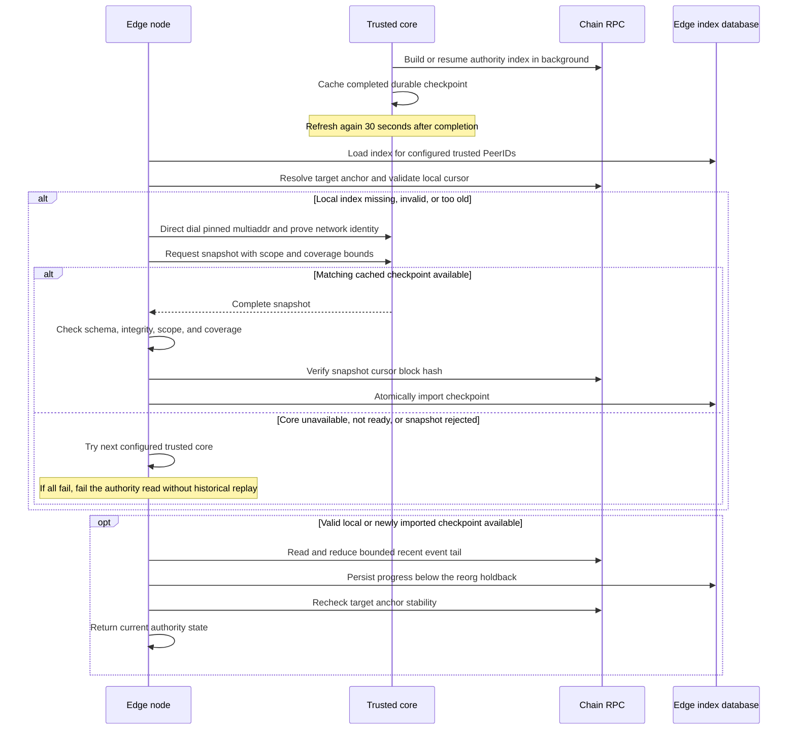

# Core snapshots for the Context Graph authority index

An edge can fetch the built Context Graph authority table from trusted cores and
read only a bounded recent tail from chain. This avoids rebuilding the registry
from its deployment block on every fresh edge. Cores still perform that historical
scan once and preserve their progress in the local index store.

The table includes owners, participants, permission state, and historical version
counters. It is authority-bearing data. Enable snapshots only for core operators
you trust to supply the complete, correct table.

## Configure the cores first

Use ordinary core configuration on the same network as the edges:

```json
{
  "networkConfig": "testnet",
  "nodeRole": "core"
}
```

Merge these fields into the core's existing `config.json` under its `DKG_HOME`
(normally `~/.dkg`). Keep its chain configuration, wallets, and persistent data.
Updated cores build and refresh the index in the background and serve completed
snapshots over libp2p. Snapshot requests read the cached table; they do not start
another historical rebuild. While the core is building its first index, a complete
snapshot is not yet available.

Make the core reachable from the edges and obtain its advertised multiaddr and
PeerID. The `/p2p/` suffix identifies the core that the edge will trust. Preserve
the core's identity and index database across restarts. Configure more than one
independently available core for failover.

## Enable snapshots on each edge

Add this block to the edge's local `config.json`. Replace both example multiaddrs
with the actual reachable addresses and PeerIDs of your trusted cores:

```json
{
  "networkConfig": "testnet",
  "nodeRole": "edge",
  "authorityIndex": {
    "mode": "core-snapshot",
    "trustedCorePeers": [
      "/dns4/core-a.example.com/tcp/9090/p2p/<CORE_A_PEER_ID>",
      "/dns4/core-b.example.com/tcp/9090/p2p/<CORE_B_PEER_ID>"
    ],
    "maxTailBlocks": 2000
  }
}
```

Restart the edge after editing its config:

```bash
dkg stop
dkg start
```

`trustedCorePeers` must contain one to eight valid multiaddrs with distinct pinned
PeerIDs. The list comes only from the operator's local config. Being a relay,
bootstrap peer, discovered core, or entry in a bundled network config does not
grant snapshot trust.

`maxTailBlocks` defaults to `2000` and must be an integer from `50` to `10000`.
The edge checks the snapshot's deployment and block anchor against its chain,
persists the imported index, and processes the recent tail locally up to the
anchor selected by `chain.finalityConfirmations`.
If it falls farther behind than this limit, it requests a newer snapshot instead
of scanning the missing history. The edge still needs its configured RPC endpoint
for chain checks and the recent tail.

This setting is for edges. Startup rejects it on a core, as well as invalid
sources, unsupported modes, and invalid tail limits.

## How the node fetches the table

Fetching is automatic when an authority read finds its local index missing,
invalid, or farther behind than `maxTailBlocks`. A recent valid local checkpoint
resumes directly from chain without another download. No separate fetch command
or HTTP snapshot endpoint is added by this feature.

The edge connects to a configured core multiaddr and sends a JSON request over
the authenticated libp2p protocol:

```text
/dkg/10.0.0/authority-index-snapshot/1
```

Directly dialing the pinned multiaddr avoids needing the Agent Registry
phonebook to bootstrap the authority index. Normal network-identity admission
still applies. The client tries trusted cores sequentially, with a 10-second
deadline for each attempt, including snapshot admission.

The wire request has this shape; the node derives all four request fields:

```typescript
{
  version: 1,
  request: {
    scope: string,                  // chain ID, Hub, and ContextGraphStorage address
    deploymentBlockNumber: number,
    minThroughBlockNumber: number,  // max(deployment, target anchor - maxTailBlocks)
    maxThroughBlockNumber: number  // highest durable block below the reorg holdback
  }
}
```

A successful response is `{ version: 1, status: 'ok', snapshot }`, where
`snapshot` contains its own `version: 1`, the same `scope`, and the complete
version-2 `checkpoint` (`cursor`, `states`, and `integrity`). The cursor records
the deployment block and covered block number/hash; states contain the on-chain
authority rows, including ownership, policies, membership, and their generation
counters. The core serializes this existing checkpoint; operators do not assemble
it themselves.



Requests are limited to 2 KiB, responses to 8 MiB, and a core permits four
concurrent cache exports. Non-success responses use `not-ready`, `busy`,
`too-large`, `invalid-request`, or `unavailable`; the client tries the next
configured source. Snapshot requests never initiate a scan on the core.

## Trust and failure behavior

Libp2p authenticates the remote peer against the configured PeerID. Network,
registry, schema, and block-anchor checks reject snapshots for another deployment
or an invalid chain anchor. Those checks do **not** prove the table's contents or
that no registry events were omitted. Neither a block hash nor a checksum proves
the historical counters. This mode deliberately trusts the configured core
operators for that state; it is not a trustless state-sync protocol.

When all trusted cores are unavailable, still building, or serving snapshots too
old for the tail limit, authority reads that need a new snapshot fail. Subsequent
normal authority reads or caller retries try again; there is no separate edge
snapshot refresh timer. Reads recover when a suitable snapshot is available.
There is no automatic fallback to a scan from contract deployment in
`core-snapshot` mode. An edge whose persisted index is already within the tail
limit can continue by reading that small tail from chain.

For recovery, check the core's index-build progress and RPC access, then peer
reachability and the pinned PeerIDs. Allow cold cores to finish their first build;
do not increase the edge tail limit to cover the registry's full lifetime.

## Rollout and compatibility

Upgrade cores first and let their indexes become ready, then enable this setting
on edges. Omitting `authorityIndex` preserves the existing independent historical
scan behavior, so updating the binary alone does not change an existing edge's
trust policy. Removing the block and restarting returns to that behavior.

The persisted index is separated by trust policy. Changing the set of trusted
PeerIDs requires a snapshot under the new policy. Removing `authorityIndex`
returns to the independently built local index, rebuilding from chain if it does
not exist; it never promotes a core-supplied table to independently verified
history. Changing only a core's address while retaining its PeerID does not change
the trusted identity.

The snapshot covers the Context Graph authority index. It does not transfer
Knowledge Asset data, replace Shared Memory synchronization, or eliminate other
chain work performed by the node.
