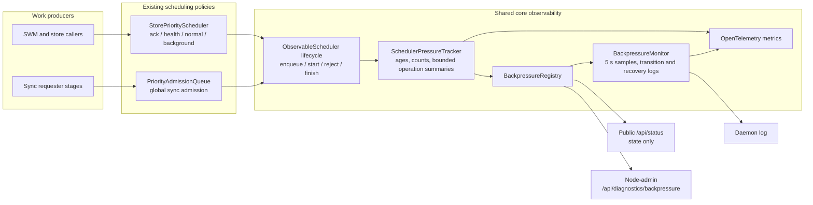

# Backpressure observability

DKG exposes one common pressure model for its in-memory schedulers. It answers
four questions without requiring scheduler-specific log archaeology:

1. Which scheduler and lane are under pressure?
2. Is work waiting, rejected, or admitted but possibly stuck?
3. Which bounded operation classes account for that work?
4. Did the scheduler recover?

This is an observability layer only. It does not change queue ordering,
concurrency, reservation, displacement, timeout, or retry behavior.

## Architecture



The tracker records references to bounded labels and timestamps, not work
closures or payloads. A snapshot can contain a maximum of eight queued and
eight active operation summaries per lane. Labels are sanitized and truncated
before they reach metrics, logs, or the diagnostics response.

The first registered sources are:

- `store`: the external-store priority scheduler and its `ack`, `health`,
  `normal`, and `background` lanes;
- `sync-global`: the process-wide sync admission queue and its sync lanes.

Other schedulers can extend `ObservableScheduler` and call its protected
lifecycle methods at their existing admission boundaries. They keep complete
ownership of policy.

## Pressure states

| State | Meaning |
| --- | --- |
| `healthy` | No age, utilization, rejection, or active-duration threshold is crossed. |
| `degraded` | A queue is old or at least 75% utilized, but is not full. |
| `saturated` | A queue is full or an admission rejection occurred in the recent visibility window. |
| `stalled` | The oldest admitted operation crossed the scheduler's active-duration threshold. |

State precedence is `stalled` > `saturated` > `degraded` > `healthy`. A recent
rejection remains visible for 60 seconds so a short full-queue event is not
missed between monitor samples.

These states describe evidence, not root cause. For example, a stalled store
operation can be caused by Blazegraph, Oxigraph, disk, or a caller that never
settles. Use the operation summary and surrounding store logs to continue the
investigation.

## Read current pressure

`GET /api/status` is public and includes only the aggregate state:

```json
{
  "backpressure": {
    "state": "degraded",
    "schedulers": [
      { "scheduler": "store", "state": "degraded" },
      { "scheduler": "sync-global", "state": "healthy" }
    ],
    "diagnosticsAvailable": "/api/diagnostics/backpressure"
  }
}
```

The detailed route requires the node-level admin token. Agent-scoped tokens are
rejected because the response describes node-wide work.

```bash
TOKEN=$(dkg auth show)
curl -sS \
  -H "Authorization: Bearer $TOKEN" \
  http://127.0.0.1:9200/api/diagnostics/backpressure | jq
```

The response reports current queue/inflight counts and limits, oldest ages,
cumulative lifecycle/rejection counts, and bounded operation summaries. It
does not expose request bodies, SPARQL text, graph or peer identifiers, work
closures, or durable queue payloads.

## Log behavior

The daemon samples registered sources every five seconds. It emits:

- a warning immediately when a lane enters or changes a non-healthy state;
- one warning summary per minute while that state persists;
- an info message when the lane recovers.

All messages start with `[backpressure]` and carry a JSON object:

```text
[warn] [backpressure] {"event":"transition","scheduler":"store","lane":"normal","state":"degraded","previousState":"healthy","queued":3,"queueLimit":4,"inflight":4,"inflightLimit":4,"oldestQueuedAgeMs":15234,"oldestActiveAgeMs":19310,"rejectedTotal":0,"queuedOperations":[{"operation":"blazegraph.query","count":3,"oldestAgeMs":15234}],"activeOperations":[{"operation":"publisher.swm.graphScopedReplace","count":4,"oldestAgeMs":19310}]}
```

Per-item enqueue/start logs are deliberately avoided. Transition and periodic
summary logging make sustained pressure visible without creating a log storm
that competes with the overloaded scheduler.

## Metrics

The common OpenTelemetry instruments use bounded `scheduler` and `lane`
attributes:

| Metric | Type | Purpose |
| --- | --- | --- |
| `dkg.backpressure.queue_depth` | gauge | Current waiting work |
| `dkg.backpressure.queue_limit` | gauge | Configured queue capacity |
| `dkg.backpressure.inflight` | gauge | Current admitted work |
| `dkg.backpressure.inflight_limit` | gauge | Configured concurrency |
| `dkg.backpressure.oldest_queued_age_ms` | gauge | Head-of-line age |
| `dkg.backpressure.oldest_active_age_ms` | gauge | Oldest admitted duration |
| `dkg.backpressure.events_total` | counter | Lifecycle and rejection events |
| `dkg.backpressure.queue_wait_ms` | histogram | Completed queue waits |
| `dkg.backpressure.active_duration_ms` | histogram | Completed admitted durations |

Operation names are intentionally excluded from the common current-value
gauges. They remain available in bounded diagnostic/log summaries, while
metrics retain predictable cardinality.

## Failure containment

Instrumentation is fail-open:

- metric recording failures do not alter admission or completion;
- one broken source is reported in the registry's `failures` array without
  hiding healthy sources;
- log callback failures do not stop the monitor;
- the monitor timer is unreferenced and is stopped during daemon shutdown.
