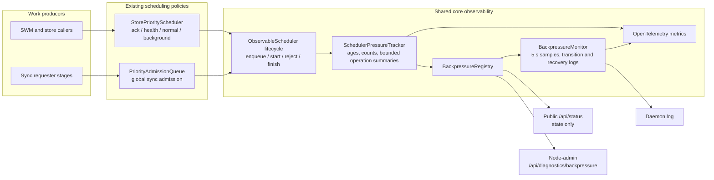

# Backpressure observability

DKG exposes one common pressure model for its in-memory schedulers. It answers
four questions without requiring scheduler-specific log archaeology:

1. Which scheduler and lane are under pressure?
2. Is work waiting, rejected, or admitted but possibly stuck?
3. Which bounded operation classes account for that work?
4. Did the scheduler recover?

This is an observability layer only. It does not change queue ordering,
concurrency, reservation, displacement, timeout, or retry behavior.

## Architecture



The tracker records references to bounded labels and timestamps, not work
closures or payloads. A snapshot can contain a maximum of eight queued and
eight active operation summaries per lane. Labels are sanitized and truncated
before they reach metrics, logs, or the diagnostics response.

The first registered sources are:

- `store`: the external-store priority scheduler and its `ack`, `health`,
  `normal`, and `background` lanes;
- `sync-global`: the process-wide sync admission queue and its sync lanes.

### Attributing `sync-global` pressure to a trigger

The `lane` of a `sync-global` entry says *what kind of work* is queued
(`durable`, `changelog`, `shared_memory`, `swm_recovery`), but every trigger
funnels into the same few lanes. Its `operation` label therefore pairs the
collapsed work class with the **admission source** — the trigger that enqueued
it — as `<work class>:<source>`:

| Source | Trigger |
| --- | --- |
| `catchup-foreground` | explicit Context Graph catch-up (`POST /api/context-graph/subscribe`) |
| `catchup-background` | automatic post-approval / reconcile catch-up |
| `on-connect` | sync-on-connect after a peer dial |
| `reconcile` | the periodic sync reconciler |
| `vm-recovery` | foreground repair of specific missing Knowledge Assets |
| `swm-recovery` | curator-targeted shared-memory recovery |
| `unspecified` | a caller that did not declare an origin |

### Tuning foreground catch-up

Two knobs govern the foreground Context Graph catch-up that most often shows up
as `catchup-foreground` pressure. Both are read once at daemon start.

| Variable | Default | Effect |
| --- | --- | --- |
| `DKG_CATCHUP_STOP_ON_PROOF` | on | The catch-up walks peers in escalating waves and stops once the resolved curator has settled every requested plane. Set to `0`, `false`, `no`, or `off` to restore the previous behaviour: every sync-capable peer, both requested planes, no early stop. Use this if a graph ever lands short — foreground catch-up optimises for one authoritative payload, while breadth remains the background reconcile lane's job. |
| `DKG_CATCHUP_BACKPRESSURE_MAX_WAIT_MS` | `180000` | Wall-clock budget one foreground plane may spend being **refused** by local `sync-global` admission before the job reports a retryable `deferred`. Measured from before the first attempt, so an attempt's own queue time counts against it. It does not cancel a round the scheduler has already accepted — that one is doing real work and is bounded by `SYNC_TOTAL_TIMEOUT_MS`. The default sits above both a full head-of-line round (120 s) and the queue waits that motivated it. An explicit `0` disables retries; a blank value is treated as unset. |
| `DKG_CATCHUP_MAX_CONCURRENT_PEERS` | `4` | Caps in-flight per-peer sync rounds, and therefore the widest escalation wave. Raising it above the `sync-global` queue depth lets a single catch-up saturate the scheduler against itself. |

So `{"operation":"durable:catchup-foreground","count":4,"oldestAgeMs":109000}`
in a `queuedOperations` summary reads as "four explicit catch-up durable
admissions are queued, the oldest for 109 seconds", and the matching
`activeOperations` entry gives the same view for admitted work. Both halves are
closed sets, so the label space stays bounded (5 × 7) and, as before, no Context
Graph id or peer id ever reaches a metric, log line, or diagnostics response —
an unrecognized source is clamped to `unspecified`.

Other schedulers can extend `ObservableScheduler` and call its protected
lifecycle methods at their existing admission boundaries. They keep complete
ownership of policy.

## Pressure states

| State | Meaning |
| --- | --- |
| `healthy` | No age, utilization, rejection, or active-duration threshold is crossed. |
| `degraded` | A queue is old or at least 75% utilized, but is not full. |
| `saturated` | A queue is full or an admission rejection occurred in the recent visibility window. |
| `stalled` | The oldest admitted operation crossed the scheduler's active-duration threshold. |

State precedence is `stalled` > `saturated` > `degraded` > `healthy`. A recent
rejection remains visible for 60 seconds so a short full-queue event is not
missed between monitor samples.

These states describe evidence, not root cause. For example, a stalled store
operation can be caused by Blazegraph, Oxigraph, disk, or a caller that never
settles. Use the operation summary and surrounding store logs to continue the
investigation.

## Read current pressure

`GET /api/status` is public and includes only the aggregate state:

```json
{
  "backpressure": {
    "state": "degraded",
    "schedulers": [
      { "scheduler": "store", "state": "degraded" },
      { "scheduler": "sync-global", "state": "healthy" }
    ],
    "diagnosticsAvailable": "/api/diagnostics/backpressure"
  }
}
```

The detailed route requires the node-level admin token. Agent-scoped tokens are
rejected because the response describes node-wide work.

```bash
TOKEN=$(dkg auth show)
curl -sS \
  -H "Authorization: Bearer $TOKEN" \
  http://127.0.0.1:9200/api/diagnostics/backpressure | jq
```

The response reports current queue/inflight counts and limits, oldest ages,
cumulative lifecycle/rejection counts, and bounded operation summaries. It
does not expose request bodies, SPARQL text, graph or peer identifiers, work
closures, or durable queue payloads.

## Log behavior

The daemon samples registered sources every five seconds. It emits:

- a warning immediately when a lane enters or changes a non-healthy state;
- one warning summary per minute while that state persists;
- an info message when the lane recovers.

All messages start with `[backpressure]` and carry a JSON object:

```text
[warn] [backpressure] {"event":"transition","scheduler":"store","lane":"normal","state":"degraded","previousState":"healthy","queued":3,"queueLimit":4,"inflight":4,"inflightLimit":4,"oldestQueuedAgeMs":15234,"oldestActiveAgeMs":19310,"rejectedTotal":0,"queuedOperations":[{"operation":"blazegraph.query","count":3,"oldestAgeMs":15234}],"activeOperations":[{"operation":"publisher.swm.graphScopedReplace","count":4,"oldestAgeMs":19310}]}
```

Per-item enqueue/start logs are deliberately avoided. Transition and periodic
summary logging make sustained pressure visible without creating a log storm
that competes with the overloaded scheduler.

The daemon routes these records through its structured log sink. That keeps a
full local copy and forwards the same redacted record to enabled syslog and
OTLP exporters, so the records reach the Loki-backed Grafana dashboards.

## Grafana worker-pressure flame graph and heatmaps

The **DKG Node — Logs** dashboard includes a **Scheduler pressure** row. Its
flame graph expands the bounded `activeOperations` and `queuedOperations`
arrays, groups them by scheduler, lane, and operation source, and shows the
largest sampled `oldestAgeMs` in a fixed most-recent one-hour window. The
lookback is intentionally independent of the Grafana-selected range: Loki 3
splits long-range instant metric queries internally, so letting an incident
range of 6 or 24 hours flow into all five flamegraph targets can make the
dashboard itself create backend pressure.

The two top-level branches have distinct meanings:

- **active / admitted**: work occupying a worker slot;
- **queued / waiting**: work still waiting for admission.

Block width is elapsed pressure age in milliseconds. It answers which source
was present and how old its oldest observed work became. It is not CPU time,
request share, invocation count, or an exact completed-job duration. The
monitor intentionally emits transition, periodic summary, and recovery records
instead of a per-item event stream, so Grafana must not claim more precision
than the log contract provides.

Two heatmaps below the flame graph keep the active and queued meanings
separate and retain the full Grafana-selected historical range. Each heatmap
groups samples by scheduler/lane and shows the
distribution over time of the peak sampled age in each Grafana resolution
bucket:

- **Active / admitted pressure age** shows how old the oldest work occupying a
  worker slot became;
- **Queued / waiting pressure age** shows how old the oldest work waiting for
  admission became.

The heatmaps retain the maximum observed age in each time bucket because the
source is a sparse transition/summary stream. A darker cell means more samples
fell into that time/age bucket; it does not mean more CPU was consumed. Empty
periods mean Loki received no matching diagnostic sample, not necessarily that
the scheduler was idle.

## Grafana source-attributed sync cost

The **DKG Nodes — Sync Cost** dashboard is the interactive Grafana companion
to the W1 measurement contract introduced by PR #2033. It reads OpenTelemetry
metrics from VictoriaMetrics and keeps the existing Loki pressure dashboard
intact: logs answer what was present in a bounded pressure snapshot, while the
metrics dashboard measures completed work, transferred payload, admission
pressure, and catch-up outcomes over time.

The dashboard covers every W1 instrument:

| Instrument | Dashboard view |
| --- | --- |
| I1 physical sync attempts | Rate by source, outcome, transport, plane, and phase |
| I2/I3 request and response payload bytes | Throughput by source and response outcome |
| I4 logical operation duration | Source/lane/outcome flame graph, active-worker equivalents, and duration heatmap |
| I5 rejected operations | Rate by source, lane, and bounded reason |
| I6 single-flight joins | Rate by scope, owner source, and joining source |
| I7 catch-up requests | Rate by route result and shared-memory request flag |
| I8 catch-up jobs | Rate by terminal status and admission path |
| I9 catch-up job duration | Walk-job p95 and duration heatmap |

The flame-graph width is accumulated **active wall-clock occupancy** for
completed logical sync operations in the selected Grafana range. It is not CPU
time. Operations rejected before they start never receive a zero-duration I4
sample; they appear in I5 instead.

The two Prometheus heatmaps read real histogram buckets rather than estimating
a distribution from log samples:

- logical sync operation duration uses I4 and follows the selected
  source/lane/outcome filters;
- walk catch-up duration uses I9 and deliberately excludes synthetic
  already-ready jobs, which perform no work.

The dashboard also renders the W1 evidence gates and source-family shares over
the selected Grafana range. Those interactive panels are for investigation;
the generated `tools/observability/w1/w1-queries.md` packet remains the fixed
1-hour/2-hour decision contract. Any failed evidence gate makes the window
**inconclusive** rather than healthy, and the byte counters describe encoded
application payload rather than network-wire bandwidth.

## Metrics

The common OpenTelemetry instruments use bounded `scheduler` and `lane`
attributes:

| Metric | Type | Purpose |
| --- | --- | --- |
| `dkg.backpressure.queue_depth` | gauge | Current waiting work |
| `dkg.backpressure.queue_limit` | gauge | Configured queue capacity |
| `dkg.backpressure.inflight` | gauge | Current admitted work |
| `dkg.backpressure.inflight_limit` | gauge | Configured concurrency |
| `dkg.backpressure.oldest_queued_age_ms` | gauge | Head-of-line age |
| `dkg.backpressure.oldest_active_age_ms` | gauge | Oldest admitted duration |
| `dkg.backpressure.events_total` | counter | Lifecycle and rejection events |
| `dkg.backpressure.queue_wait_ms` | histogram | Completed queue waits |
| `dkg.backpressure.active_duration_ms` | histogram | Completed admitted durations |

Operation names are intentionally excluded from the common current-value
gauges. They remain available in bounded diagnostic/log summaries, while
metrics retain predictable cardinality.

## Failure containment

Instrumentation is fail-open:

- metric recording failures do not alter admission or completion;
- one broken source is reported in the registry's `failures` array without
  hiding healthy sources;
- log callback failures do not stop the monitor;
- the monitor timer is unreferenced and is stopped during daemon shutdown.
